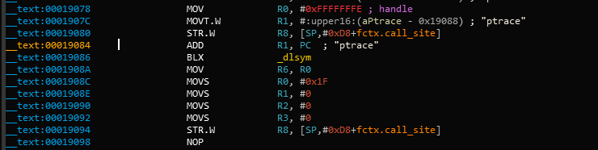
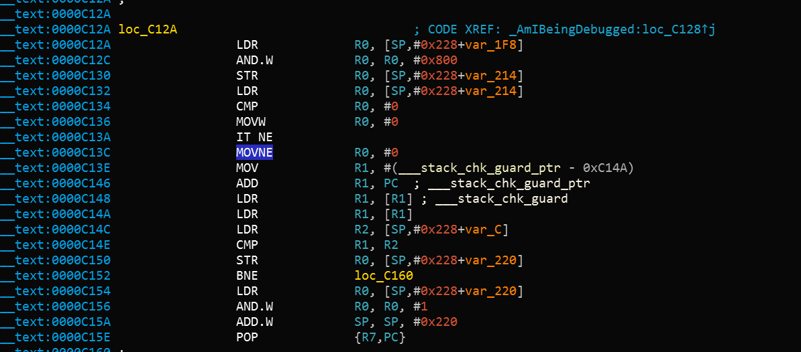

## Защита от обратного проектирования в iOS

### Определение джейлбрейка

#### Обзор

В контексте защиты от обратного проектирования, механизмы определения джейлбрейка были добавлены, чтобы осложнить запуск на джейлбрейкнутом устройстве. Данная мера, взамен, мешает некоторым инструментам и подходам, которые любят применять инженеры обратного проектирвоания. Так как определение джейлбрека попадает в одну категорию со многими другими механизмами защиты, само по себе определение является не очень эффективной защитой, но если посыпать все приложение проверками это может увеличить эффективность всей схемы защиты от вмешательства. [Список типичных техник определения джейлбрека на iOS может быть найден ниже.](https://www.trustwave.com/Resources/SpiderLabs-Blog/Jailbreak-Detection-Methods/ "Jailbreak Detection Methods on the Trustware Spiderlabs Blog").

##### Проверки файлов

Проверяйте наличие файлов или директорий, обычно связанных с джейлбреком, такие как:

```
/Applications/Cydia.app
/Applications/FakeCarrier.app
/Applications/Icy.app
/Applications/IntelliScreen.app
/Applications/MxTube.app
/Applications/RockApp.app
/Applications/SBSettings.app
/Applications/WinterBoard.app
/Applications/blackra1n.app
/Library/MobileSubstrate/DynamicLibraries/LiveClock.plist
/Library/MobileSubstrate/DynamicLibraries/Veency.plist
/Library/MobileSubstrate/MobileSubstrate.dylib
/System/Library/LaunchDaemons/com.ikey.bbot.plist
/System/Library/LaunchDaemons/com.saurik.Cydia.Startup.plist
/bin/bash
/bin/sh
/etc/apt
/etc/ssh/sshd_config
/private/var/lib/apt
/private/var/lib/cydia
/private/var/mobile/Library/SBSettings/Themes
/private/var/stash
/private/var/tmp/cydia.log
/usr/bin/sshd
/usr/libexec/sftp-server
/usr/libexec/ssh-keysign
/usr/sbin/sshd
/var/cache/apt
/var/lib/apt
/var/lib/cydia
/usr/sbin/frida-server
/usr/bin/cycript
/usr/local/bin/cycript
/usr/lib/libcycript.dylib
```

##### Проверки разрешений файлов

Другой возможной проверкой будет попытка записи по пути, за пределами песочницы приложения. Это может быть сделано с помощью попытки создания файла, например, в директории /private. Если файл успешно создается, то это значит что устройство взломано.

```objc
NSError *error;
NSString *stringToBeWritten = @"This is a test.";
[stringToBeWritten writeToFile:@"/private/jailbreak.txt" atomically:YES
         encoding:NSUTF8StringEncoding error:&error];
if(error==nil){
   //Device is jailbroken
   return YES;
 } else {
   //Device is not jailbroken
   [[NSFileManager defaultManager] removeItemAtPath:@"/private/jailbreak.txt" error:nil];
 }
```

##### Проверка обработчиков протоколов

Попытка открытия Cydia URL. Магазин приложений Cydia, который поставляется практически с каждым инструментом  джейлбрейка, устанавливает обработчик протокола cydia://.

```
if([[UIApplication sharedApplication] canOpenURL:[NSURL URLWithString:@"cydia://package/com.example.package"]]){
```

##### Вызов системных API

Вызов функции system() с аргументом NULL на обычном устройстве вернет значение 0; тоже самое на джейлбрейк устройстве вернет 1. Так происходит, потому что вызов данной функции проверяет доступен ли `/bin/sh`, а это так только на взломанных устройствах.

#### Обход проверки на джейлбрейк

После того как вы запустите приложение с активированной проверкой на джейлбрейк, вы заметите одно из следующего:

1.	Приложение немедленно закрывается без какого-либо уведомления
2.	Появляется всплывающее окно, которое информирует, что приложение не будет работать на джейлбрейкнутом устройстве.

В первом случае, было бы не лишним проверить работает ли приложение корректно(функционально) на обычном устройстве. Может так быть, что приложение в действительности вылетает или же имеет баг, который его крашит. Такое может случаться, когда вы тестируете приложение, находящиеся в стадии пре-релиза.

Давайте рассмотрим как обойти определение джейлбрейка, используя еще раз приложение Damn Vulnerable iOS в качестве примера. После того как вы загрузите двоичный файл в Hopper, вам нужно подождать пока приложение полностью будет дезассемблировано(смотрите на верхнюю панель). После этого мы можем осуществить поиска строки 'jail' в поле для поиска. Мы видим два разных класса: `SFAntiPiracy` и `JailbreakDetectionVC`.
Вы можете также захотеть декомпилировать функции, чтобы посмотреть что они делают, а особенно что возвращают.

 

Как вы можете видеть, существует метод класса `+[SFAntiPiracy isTheDeviceJailbroken]` и метод экземпляра `-[JailbreakDetectionVC isJailbroken]`.  Основное отличие для нас, заключается в том, что мы можем осуществить инъекцию cycript напрямую в метод класса, а когда дело доходит до метода экземпляра, нам сначало необходимо найти этот самый экземпляр целевого класса. Функция `choose` найдет в памяти кучи известные сигнатуры указанного класса и вернет массив экземпляров, которые будут найдены. Очень важно помещать приложение в необходимое состояние, чтобы экземпляр класса действительно был создан.

Давайте внедрим cycript в наш процесс (посмотрите ваш PID, используя `top`):

```shell
iOS8-jailbreak:~ root# cycript -p 12345
cy# [SFAntiPiracy isTheDeviceJailbroken]
true
```

Как вы можете видеть, наш метод класса был вызван напрямую и вернул true. Теперь, давайте вызовем метод экземпляра `-[JailbreakDetectionVC isJailbroken]`. Для начала нам необходимо обратиться к функции `choose`, чтобы найти экземпляры класса `JailbreakDetectionVC`.

```shell
cy# a=choose(JailbreakDetectionVC)
[]
```

Оййй! Похоже, что возвращенный массив пуст. Это значит, что нет ни одного экземпляра класса, зарегистрированного в среде исполнения. Фактически, мы не нажали вторую кнопку 'Jailbreak Test', которая вдействительности инициализирует инстанс данного класса:

```shell
cy# a=choose(JailbreakDetectionVC)
[#"<JailbreakDetectionVC: 0x14ee15620>"]
cy# [a[0] isJailbroken]
True
```


Следовательно, теперь вы понимаете почему так важно, чтобы приложение находилось в желаемом состоянии.
Теперь обход проверки на джейлбрейк в данном случае тривиален. Мы пониманием, что функция возвращает булево значение, и нам необходимо всего лишь изменить возвращаемое значение. Мы можем выполнить это, подменив реализацию функции, используя cycript. Пожалуйста, обратите внимание, что на самом деле это заменит функцию по указанному имени, так что остерегайтесь побочных эффектов, в том случае, если эта функция что-то изменяет в приложении:

```shell
cy# JailbreakDetectionVC.prototype.isJailbroken=function(){return false}
cy# [a[0] isJailbroken]
false
```


В данном случае мы обошли проверку наличия джейлбрека в приложении!

Теперь, давайте представим что приложение немедленно закрывается, до момента определения наличия джейлбрейка на устройстве. В этом случае у вас нет времени успеть запустить cycript и подменить реализацию. Вместо этого, вам придется использовать CydiaSubstrate, воспользоваться подходящей функцией хука, например `MSHookMessageEx` и выполнить компиляцию твика. Существуют [хорошие источники](http://delaat.net/rp/2015-2016/p51/report.pdf "Jailbreak/Root Detection Evasion Study on iOS and Android"), сообщающие как это сделать, однако, мы предоставим, возможно, более легкий и быстрый подход подход.

**[Frida](https://www.frida.re/ "Frida")** это библиотека динамического инструментирования, которая позволяет использовать, помимио прочего, JavaScript API для инструментирования приложений. Одна из фич, которой мы будем пользоваться для обхода определения джейлбрека - это, так называемое, раннее инструментирование, например, подмена реализации функции во время запуска.  

1.	Прежде всего, убедитесь что `frida-server` запущен на вашем устройстве.
2.	Устройство должно быть подключено через кабель USB.
3.	Используйте `frida-trace` на вашем компьютере:

```shell
$ frida-trace -U -f /Applications/DamnVulnerableIOSApp.app/DamnVulnerableIOSApp  -m "-[JailbreakDetectionVC isJailbroken]"
```

Это запустит DamnVulnerableIOSApp, отслеживайте вызовы к `-[JailbreakDetectionVC isJailbroken]` и создайте хук JavaScript с обратными вызовами для `onEnter` и `onLeave`. Теперь необходимо заменить возвращаемое значение на `value.replace()`, как показано в примере ниже:

```JavaScript
    onLeave: function (log, retval, state) {
    console.log("Function [JailbreakDetectionVC isJailbroken] originally returned:"+ retval);
    retval.replace(0);  
      console.log("Changing the return value to:"+retval);
    }
```

Такое возвращаемое значение будет работать так:

```shell
$ frida-trace -U -f /Applications/DamnVulnerableIOSApp.app/DamnVulnerableIOSApp  -m "-[JailbreakDetectionVC isJailbroken]:"

Instrumenting functions...                                           `...
-[JailbreakDetectionVC isJailbroken]: Loaded handler at "./__handlers__/__JailbreakDetectionVC_isJailbroken_.js"
Started tracing 1 function. Press Ctrl+C to stop.                       
Function [JailbreakDetectionVC isJailbroken] originally returned:0x1
Changing the return value to:0x0
           /* TID 0x303 */
  6890 ms  -[JailbreakDetectionVC isJailbroken]
Function [JailbreakDetectionVC isJailbroken] originally returned:0x1
Changing the return value to:0x0
 22475 ms  -[JailbreakDetectionVC isJailbroken]
```

Пожалуйста, обратите внимание, что было два вызова к `-[JailbreakDetectionVC isJailbroken]`, которые отражают два физических нажатия через пользовательский интерфейс.

Frida очень мощный и разноплановый инструмент. За деталями работы инструмента обращайтесь к [документации](https://www.frida.re/docs/home/ "Frida Documentation").

Скрипт Python для хука методов Objective-C и нативных функций:

```python
import frida
import sys

try:
	session = frida.get_usb_device().attach("Target Process")
except frida.ProcessNotFoundError:
	print "Failed to attach to the target process. Did you launch the app?"
	sys.exit(0);

script = session.create_script("""

	// Handle fork() based check

  var fork = Module.findExportByName("libsystem_c.dylib", "fork");

	Interceptor.replace(fork, new NativeCallback(function () {
		send("Intercepted call to fork().");
	    return -1;
	}, 'int', []));

  var system = Module.findExportByName("libsystem_c.dylib", "system");

	Interceptor.replace(system, new NativeCallback(function () {
		send("Intercepted call to system().");
	    return 0;
	}, 'int', []));

	// Intercept checks for Cydia URL handler

	var canOpenURL = ObjC.classes.UIApplication["- canOpenURL:"];

	Interceptor.attach(canOpenURL.implementation, {
		onEnter: function(args) {
		  var url = ObjC.Object(args[2]);
		  send("[UIApplication canOpenURL:] " + path.toString());
		  },
		onLeave: function(retval) {
			send ("canOpenURL returned: " + retval);
	  	}

	});		

	// Intercept file existence checks via [NSFileManager fileExistsAtPath:]

	var fileExistsAtPath = ObjC.classes.NSFileManager["- fileExistsAtPath:"];
	var hideFile = 0;

	Interceptor.attach(fileExistsAtPath.implementation, {
		onEnter: function(args) {
		  var path = ObjC.Object(args[2]);
		  // send("[NSFileManager fileExistsAtPath:] " + path.toString());

		  if (path.toString() == "/Applications/Cydia.app" || path.toString() == "/bin/bash") {
		  	hideFile = 1;
		  }
		},
		onLeave: function(retval) {
			if (hideFile) {
		  		send("Hiding jailbreak file...");MM
				retval.replace(0);
				hideFile = 0;
			}

			// send("fileExistsAtPath returned: " + retval);
	  }
	});


	/* If the above doesn't work, you might want to hook low level file APIs as well

		var openat = Module.findExportByName("libsystem_c.dylib", "openat");
		var stat = Module.findExportByName("libsystem_c.dylib", "stat");
		var fopen = Module.findExportByName("libsystem_c.dylib", "fopen");
		var open = Module.findExportByName("libsystem_c.dylib", "open");
		var faccesset = Module.findExportByName("libsystem_kernel.dylib", "faccessat");

	*/

""")

def on_message(message, data):
	if 'payload' in message:
	  		print(message['payload'])

script.on('message', on_message)
script.load()
sys.stdin.read()
```


#### Проверки анти-дебаггера

#### Обзор

Отладка и изучение приложения очень важно, во время реверсинговых упражнений. Используя дебаггер, инженер обратного проектирования может не только отслеживать значения критических переменных, но также считывать и модифицировать память.

Понимая значимость возможностей отладки приложения, разработчики используют множество техник, чтобы это предотвратить. Они называются техники анти-дебага. Как уже было описано в главе про Android "Тестирование отказоустойчивости против обратного проектирования", техники анти-дебага могут быть превентивные или же реактивные.

Превентивные техники делают вообще невозможным подключение дебаггера, в то время как, реактивные техники прежде всего определяют наличие отладчика, после чего разрешают приложению отклоняться от ожидаемого поведения.

Существует несколько техник анти-дебага; некоторые из них описаны ниже.

##### Использование ptrace

iOS работает на ядре XNU. Ядро XNU реализует системный вызов `ptrace`, но он не такой мощный как в реализациях Unix или же Linux. Ядро XNU делает доступным другой интерфейс для отладки, используя Mach IPC. Реализация `ptrace` в iOS предосталвяет очень важное свойство: предотвращение дебага процесса. Эта фича реализована как опция `PT_DENY_ATTACH` системного вызова `ptrace`. Использование `PT_DENY_ATTACH` - это справедливо широко-известная техника анти-дебага, так что вы можете прибегать к ней не только во время iOS пентестов.

The Mac Hacker's Handbook, описывает `PT_DENY_ATTACH`:

```
PT_DENY_ATTACH
Данный запрос - это другая операция, используемая отслеживаемыми процесса; он позволяет процессу, который уже отслеживается, отказать в дальнешем отслеживании родительскому процессу. Все другие аргументы игнорируются. Если процесс уже отслеживается, он прекратиться со статусом выхода ENOTSUP; в противном случае, он устанавливает флаг, который предотвращает последующие попытки отслеживания. Попытка родительского процесса отследить процесс, у которого установлен данный флаг, приведет к нарушению сегментации в процессе родителя.
```

Перефразируя, использование `ptrace` с `PT_DENY_ATTACH` дает гарантии что никакой дебаггер не сможет подключится к вызывающему процессу; если отладчик попробует подключится, процесс будет завершен.

Перед тем как погружаться в детали, очень важно знать что `ptrace` не является частью публичных iOS API.
Непубличные API запрещены, и Apple Store может не пропускать приложения, содержащие их (https://developer.apple.com/documentation/). Из-за этого, `ptrace` не вызывается напрямую в коде; он вызывается посредством получения указателя на функцию `ptrace` через `dlsym`.

Далее идет пример применения описанной выше логики:

```objc
#import <dlfcn.h>
#import <sys/types.h>
#import <stdio.h>
typedef int (*ptrace_ptr_t)(int _request, pid_t _pid, caddr_t _addr, int _data);
void anti_debug() {
  ptrace_ptr_t ptrace_ptr = (ptrace_ptr_t)dlsym(RTLD_SELF, "ptrace");
  ptrace_ptr(31, 0, 0, 0); // PTRACE_DENY_ATTACH = 31
}
```

Далее приведен пример дезассемблированного бинарного файла, который реализует данный подход:


Давайте разберемся что же происходит в бинарнике. `dlsym` вызывается с `ptrace`, как второй аргемент (регистр R1). Возвращаемое значение в регистре R0 перемещается в регистр R6, по адресу *0x1908A*. По адресу *0x19098*, значение ссылки в регистре R6 вызывается, используя инструкцию BLX R6. Чтобы отключить вызов `ptrace`, нам нужно заменить инструкцию BLX R6 (0xB0 0x47 в Little Endian) на инструкцию NOP (0x00 0xBF в Little Endian). После патча, код выглядит следующим образом:



[Armconverter.com](Armconverter.com)- удобный инструмент для преобраований между байт кодом и мнемоникой инструкций.

##### Использование sysctl

Другой подход для определения подключенного отладчика вовлекает `sysctl`. Согласно документации Apple:

```
Функция sysctl() получает информацию о системе и позволяет процессам, с необходимыми привелегиями, указывать системную информацию.
```

`sysctl` также может быть использован для получения информации о текущем процессе (такой как, используется ли отладчик). Следующая демонстрационная реализация обсуждается в ["How do I determine if I'm being run under the debugger?"](https://developer.apple.com/library/content/qa/qa1361/_index.html "How do I determine if I'm being run under the debugger?"):

```C
#include <assert.h>
#include <stdbool.h>
#include <sys/types.h>
#include <unistd.h>
#include <sys/sysctl.h>

static bool AmIBeingDebugged(void)
    // Returns true if the current process is being debugged (either
    // running under the debugger or has a debugger attached post facto).
{
    int                 junk;
    int                 mib[4];
    struct kinfo_proc   info;
    size_t              size;

    // Initialize the flags so that, if sysctl fails for some bizarre
    // reason, we get a predictable result.

    info.kp_proc.p_flag = 0;

    // Initialize mib, which tells sysctl the info we want, in this case
    // we're looking for information about a specific process ID.

    mib[0] = CTL_KERN;
    mib[1] = KERN_PROC;
    mib[2] = KERN_PROC_PID;
    mib[3] = getpid();

    // Call sysctl.

    size = sizeof(info);
    junk = sysctl(mib, sizeof(mib) / sizeof(*mib), &info, &size, NULL, 0);
    assert(junk == 0);

    // We're being debugged if the P_TRACED flag is set.

    return ( (info.kp_proc.p_flag & P_TRACED) != 0 );
}
```

После того как приведенный выше код скомпилируется, его дезассемблированная версия второй части кода, выглядит следующим образом:


После того, как инструкция по адресу *0xC13C*, MOVNE R0, #1 пропатчена и заменена на MOVNE R0, #0 (0x00 0x20 в байт коде), пропатченный код будет похож на:



Вы можете обойти проверку `sysctl`, используя отладчик и поставив точку останова на моменте обращения к `sysctl`. Данный подход демонстрируется в [iOS Anti-Debugging Protections #2](https://www.coredump.gr/articles/ios-anti-debugging-protections-part-2/ "iOS Anti-Debugging Protections #2").

Needle содержит модуль, цель которого обход неспецифичных реализаций определения джейлбрейка. Needle использует Frida для осуществления хуков нативных методов, которые могут быть использованы для определения что устройство джейлбрейкнуто, также он ищет имена функций, которые могут быть использованы в процессе определения джейлбрейка, и возвращает false, когда обнаруживается что устройство джейлбрейкнуто. Следующая команда должна быть использована, чтобы запустить модуль:

```
[needle] > use dynamic/detection/script_jailbreak-detection-bypass
[needle][script_jailbreak-detection-bypass] > run
```

#### Проверка целостности файлов

#### Обзор

Существует две темы, относящиеся к целостности файлов:

 1. _Проверки, которые относятся к проверке целостности исходного кода приложения:_ в главе "Обратное проектирование и подмена", мы обсуждали проверку подписи iOS IPA приложения. Мы также увидели, что замотивированный инженер может с легкостью обойти данную проверку с помощью переупаковки и переподписи приложения с использованием сертификатов разработчика или корпорации. Один из способов усложнения данного принципа обхода защиты - добавление внутренних проверок времени исполнения, в которых вам необходимо проверять сходится ли подпись во время выполнения приложения.

 2. _Проверки, относящиеся к проверке целостности файлового хранилища:_ Когда файлы хранятся в приложение или в виде пар ключ-значение в Keychain, `UserDefaults`/`NSUserDefaults`, БД SQLite или БД Realm, тогда их целостность должна быть защищена.

##### Пример реализации - исходный код приложения

О проверках целостности уже позаботился Apple, с их системой DRM. Однако, возможны дополнительные контрмеры, такие как пример ниже. Здесь, `mach_header` парсится для подсчета момента, где начинаются данные с инструкциями, чтобы потом использовать эту информацию для генерации подписи. После этого, подпись сравнивается с предоставляемой. Пожалуйста, убедитесь что сравнение идет с подписью, хранящейся или закодированной где-либо в другом месте.

```c
int xyz(char *dst) {
    const struct mach_header * header;
    Dl_info dlinfo;

    if (dladdr(xyz, &dlinfo) == 0 || dlinfo.dli_fbase == NULL) {
        NSLog(@" Error: Could not resolve symbol xyz");
        [NSThread exit];
    }

    while(1) {

        header = dlinfo.dli_fbase;  // Pointer on the Mach-O header
        struct load_command * cmd = (struct load_command *)(header + 1); // First load command
        // Now iterate through load command
        //to find __text section of __TEXT segment
        for (uint32_t i = 0; cmd != NULL && i < header->ncmds; i++) {
            if (cmd->cmd == LC_SEGMENT) {
                // __TEXT load command is a LC_SEGMENT load command
                struct segment_command * segment = (struct segment_command *)cmd;
                if (!strcmp(segment->segname, "__TEXT")) {
                    // Stop on __TEXT segment load command and go through sections
                    // to find __text section
                    struct section * section = (struct section *)(segment + 1);
                    for (uint32_t j = 0; section != NULL && j < segment->nsects; j++) {
                        if (!strcmp(section->sectname, "__text"))
                            break; //Stop on __text section load command
                        section = (struct section *)(section + 1);
                    }
                    // Get here the __text section address, the __text section size
                    // and the virtual memory address so we can calculate
                    // a pointer on the __text section
                    uint32_t * textSectionAddr = (uint32_t *)section->addr;
                    uint32_t textSectionSize = section->size;
                    uint32_t * vmaddr = segment->vmaddr;
                    char * textSectionPtr = (char *)((int)header + (int)textSectionAddr - (int)vmaddr);
                    // Calculate the signature of the data,
                    // store the result in a string
                    // and compare to the original one
                    unsigned char digest[CC_MD5_DIGEST_LENGTH];
                    CC_MD5(textSectionPtr, textSectionSize, digest);     // calculate the signature
                    for (int i = 0; i < sizeof(digest); i++)             // fill signature
                        sprintf(dst + (2 * i), "%02x", digest[i]);

                    // return strcmp(originalSignature, signature) == 0;    // verify signatures match

                    return 0;
                }
            }
            cmd = (struct load_command *)((uint8_t *)cmd + cmd->cmdsize);
        }
    }

}
```

##### Пример реализации - хранилище

Когда заходит речь и проверках целостности хранилища приложения, как такового, вы можете создать HMAC или же подпись, на основе данной пары ключ-значение или же на основе файла, храняшегося на устройстве. Когда вы создаете HMAC, лучше всего использовать реализации в CommonCrypto. В случае необходимости шифрования: пожалуйста, обедитесь, что вы шифруете, а затем применяете HMAC, как описано в [Authenticated Encryption](https://cseweb.ucsd.edu/~mihir/papers/oem.html "Authenticated Encryption: Relations among notions and analysis of the generic composition paradigm").

Когда производите генерацию HMAC с CC:

1. Получайте дату как `NSMutableData`.
2. Получите ключ от данных (возможно, из keychain).
3. Посчитайте значение хеша.
4. Присоедините значение хеша непосредственно к данным
5. Сохраните результат шага номер 4.


```objc
	// Allocate a buffer to hold the digest, and perform the digest.
	NSMutableData* actualData = [getData];
 	//get the key from the keychain
	NSData* key = [getKey];
   NSMutableData* digestBuffer = [NSMutableData dataWithLength:CC_SHA256_DIGEST_LENGTH];
   CCHmac(kCCHmacAlgSHA256, [actualData bytes], (CC_LONG)[key length], [actualData
     bytes], (CC_LONG)[actualData length], [digestBuffer mutableBytes]);
   [actualData appendData: digestBuffer];
```

Как альтернатива, вы можете использовать NSData для шагов 1 и 3, но тогда вам понадобится создать новый буффер в шаге 4.

Когда верефицируете HMAC с CC:

1. Извлеките сообщение и hmacbytes как отдельные `NSData`.
2. Повторите шаги 1-3 генерации hmac, используя `NSData`.
3. Теперь сравните полученные hmacbytes с результатом шага 1.

```objc
	NSData* hmac = [data subdataWithRange:NSMakeRange(data.length - CC_SHA256_DIGEST_LENGTH, CC_SHA256_DIGEST_LENGTH)];
	NSData* actualData = [data subdataWithRange:NSMakeRange(0, (data.length - hmac.length))];
	NSMutableData* digestBuffer = [NSMutableData dataWithLength:CC_SHA256_DIGEST_LENGTH];
	CCHmac(kCCHmacAlgSHA256, [actualData bytes], (CC_LONG)[key length], [actualData bytes], (CC_LONG)[actualData length], [digestBuffer mutableBytes]);
	return [hmac isEqual: digestBuffer];

```

##### Обход проверок целостности файлов

*Когда пытаетесь обойти проверки целостности исходного кода приложения*

1. Пропатчите функциональность, отвечающую за анти-дебаг. Выключите нежелательное поведение просто переписав необходимые участки кода на инструкции NOP.
2. Пропатчите любой, хранимый хеш, который используется для проверки целостности кода.
3. Используйте Frida, чтобы сделать хуки API, которые будут подменять системные вызовы API файловой системы. Верните управление оригинальному файлу вместо измененного.

*Когда пытаетесь обойти проверки целостности хранилища*

1. Извлеките данные с устройства, как описано в секции о привязке устройства.
2. Измените полученные данные и поместите их обратно.

#### Оценка эффективности

*Для проверки целостности исходного кода приложения*

Запустите приложение на устройстве без изменения состояния и убедитесь что все работает. После этого примените патчи к исполняемому файлу. используя optool, переподпишите приложение, как описано в главе "Базовая проверка безопасности" и запустите его.

Приложение должно заметить изменения и отреагировать на них каким-либо образом. По крайней мере, оно должно предупредить пользователя и завершить приложение. Работайте над методом обхода и отвечайте на следующие вопросы:


- Можно ли обойти механизмы, используя тривиальные способы (например, с помощью хука одной функции API)?
- Как сложно найти анти-дебаг код, используя статический и динамический анализ?
- Необходимо ли вам писать код, чтобы отключить защиту? Сколько времени подтребуется на это?
- Какова ваша субъективная оценка сложности?

Для более детальной оценки, применяйте критерии, описанные под заголовком "Оценивание промраммной защиты"  в главе "Оценивание схем защиты ПО".

*Для проверки целостности хранилища*

Похожие подход сохраняется и здесь, но теперь отвечайте на следующие вопросы:

- Можно ли обойти механизмы, используя тривиальные способы (например, изменение внутренностей файла или же пары ключ-значение)?
- Как трудно получить ключ HMAC или же ассиметричный закрытый ключ?
- Необходимо ли вам писать код, чтобы отключить защиту? Сколько времени потребуется на это?
- Какова ваша субъективная оценка сложности?


### Привязка устройства

#### Обзор

Цель привязки устройства - помешать злоумышленнику в тот момент, когда он пытается скопировать состояние приложения с устройства А на устройство Б, и продолжить использовать приложение на устройстве Б. Когда устройство А считается доверенным, оно может иметь больше привилегий чем устройство Б, данная логика не должна меняться, если приложение копируют с устройства А на устройство Б.

Пожалуйста, обратите внимание, что [с iOS 7.0](https://developer.apple.com/library/content/releasenotes/General/RN-iOSSDK-7.0/index.html "iOS 7 release notes") идентификаторы аппаратуры, такие как MAC адрес недоступны. Возможный способ привязать приложение к устройству основан на использовании `identifierForVendor`, хранении чего- либо в keychain или же использование Google InstanceID для iOS [2]. Смотрите главу "Исправления" для более детальной информации.

#### Статический анализ

Когда исходный код доступен, можете поискать использование плохих практик, таких как:

- MAC адреса: существуют разные способы получения адреса MAC: когда используете `CTL_NET` (сетевая подсистема), `NET_RT_IFLIST` (получение настроенных интерфейсов) или же когда mac адрес форматируется, вы можете часто видеть форматный код вывода вида `"%x:%x:%x:%x:%x:%x"`.
- использование UDID: `[[[UIDevice currentDevice] identifierForVendor] UUIDString];` и в Swift3: `UIDevice.current.identifierForVendor?.uuidString`
- Любые привязки к файловой системе или же keychain, которые незащищены любым из `SecAccessControlCreateFlags` или же использованы классы защиты: `kSecAttrAccessibleAlways` или `kSecAttrAccessibleAlwaysThisDeviceOnly`.

#### Динамический анализ

Существует несколько вариантов проверки привязки приложения:

##### Динамический анализ, используя симулятор

Выполните следующие шаги для проверки наличия привязки приложения, используя симулятор:

1.	Запустите приложение на симуляторе.
2.	Убидитесь, что вы можете повысить уровень доверия в приложении (например, аутентифицироваться).
3.	Скачайте данные с симулятора, руководствуясь следующими шагами:
  - Так как симулятор использует UUIDs для определения самих себя, вы можете облегчить нахождение местоположения хранилища, создав точку останова и выполнив там `po NSHomeDirectory()`, которая раскроет местоположение данных симулятора. В противном случае, можете выполнить `find ~/Library/Developer/CoreSimulator/Devices/ | grep <appname>` для нахождения plist файлов.
  - перейдите в распечатнанную директорию
  - скопируйте все найденные папки (Documents, Library, tmp)
  - скопируете содержимое keychain, его можно найти, начиная с iOS 8, в `~/Library/Developer/CoreSimulator/Devices/<Simulator Device ID>/data/Library/Keychains`.
4.	Запустите приложение на другом симуляторе и найдите путь к папкам с его данными, как описано в шаге 3.
5.	Остановите приложение на втором симуляторе, теперь перепишите исходные данные данными, скопироваными на шаге 3.
6.	Можете ли вы продолжить в аутентифицированном состоянии? Если так, значит привязка может работать некорректно.

Обратите внимание, что мы пишем привязка может работать некорректно, потому что не все уникально на симуляторах.

##### Динамический анализ, используя два джейлбрейкнутых устройства.

Выполните следующие шаги, если хотите верифицировать привязку приложения, используя два джейлбрейкнутых устройства:

1.	Запустите приложение на взломанном устройстве.
2.	Убидитесь, что вы можете повысить уровень доверия в приложении (например, аутентифицироваться).
3.	Скачайте данные со взломанного устройства:
   - вы можете использовать подключение ssh к вашему устройству и после этого получить данные(точно также как и с симулятором, либо используя точку останова либо `find /private/var/mobile/Containers/Data/Application/ | grep <name of app>`. Директория находится в `/private/var/mobile/Containers/Data/Application/<Application uuid>`
  - перейдите в напечатанную директорию, используя SSH или же скопируйте папки, используя SCP (`scp <ipaddress>:/<folder_found_in_previous_step> targetfolder`). Вы можете воспользоваться клиентом FTP, например, FileZilla.
  - скопируйте содержимое keychain, которое находится в `/private/var/Keychains/keychain-2.db`, которое вы можете получить, воспользовавшись [keychain dumper](https://github.com/ptoomey3/Keychain-Dumper "Keychain Dumper"). Для этого вам необходимо изменить права `chmod +r /private/var/Keychains/keychain-2.db` и после этого выполнить `./keychain_dumper -a`.
4.	Установите приложение на второй взломанный телефон.
5.	Перепешите данные приложения, полученные на шаге 3. Данные keychain необходимо добавить вручную.
6.	Можете ли вы продолжить в аутентифицированном состоянии? Если так, значит привязка может работать некорректно.

#### Исправления

До того как мы обсудим используемые идентификаторы, давайте быстренько обсудим как они могут быть испоьзованы для привязки. Существует 3 метода, которые позволяют осуществлять привязку в iOS:

- Можете использовать `[[UIDevice currentDevice] identifierForVendor]` (в Objective-C) или `UIDevice.current.identifierForVendor?.uuidString` (в Swift3) и `UIDevice.currentDevice().identifierForVendor?.UUIDString` (в Swift2). Который может измениться после переустановки приложения, когда никакие другие приложения вендора не установлены.
- Вы можете хранить что-то в keychain, для определения экземпляра приложения. Необходимо убедиться, что эти данные не сохраняется, используйте `kSecAttrAccessibleWhenPasscodeSetThisDeviceOnly`(если вы хотите обезопасить и давать доступ только после ввода пароля или Touch ID) или же используя `kSecAttrAccessibleAfterFirstUnlockThisDeviceOnly`, или `kSecAttrAccessibleWhenUnlockedThisDeviceOnly`.
- Можете использовать Google instanceID для [iOS](https://developers.google.com/instance-id/guides/ios-implementation "iOS implementation instance-ID").

Любая схема, основанная на этих вариантах будет более безопасна в моментах между включением пароля или Touch ID и защитой материалов, хранящихся в Keychain или файловой системе, используя классы защиты, такие как: `kSecAttrAccessibleAfterFirstUnlockThisDeviceOnly` и `kSecAttrAccessibleWhenUnlockedThisDeviceOnly`, и `SecAccessControlCreateFlags` c установлеными флагами `kSecAccessControlDevicePasscode`(для паролей), `kSecAccessControlUserPresence` (пароль или Touch ID), `kSecAccessControlTouchIDAny` (Touch ID), `kSecAccessControlTouchIDCurrentSet` (Touch ID: но только текущие отпечатки пальцев).

### Ссылки

-	[Dana Geist, Marat Nigmatullin: Jailbreak/Root Detection Evasion Study on iOS and Android](http://delaat.net/rp/2015-2016/p51/report.pdf "Dana Geist, Marat Nigmatullin: Jailbreak/Root Detection Evasion Study on iOS and Android")

#### OWASP Mobile Top 10 2016

-	M9 - Обратное проектирование - https://owasp.org/www-project-mobile-top-10/2016-risks/m9-reverse-engineering

#### OWASP MASVS

- V8.1: "Приложение обнаруживает и реагирует на наличие root или jailbreak либо путем уведомления пользователя, либо прекращением работы приложения."
- V8.9: "Обфускация применяется к программной защите, которая, в свою очередь, препятствует де-обфускации посредством динамического анализа."
- V8.10: "Приложение реализует функциональность привязки устройства, используя отпечаток устройства, полученный из нескольких свойств, уникальных для устройства."
- V8.11: "Все исполняемые файлы и библиотеки, принадлежащие приложению, зашифрованы на уровне файла, и/или важные сегменты кода и данных внутри исполняемых файлов зашифрованы или упакованы. Тривиальный статический анализ не показывает важный код или данные."
- V8.12: "Если целью обфускации является защита чувствительных вычислений, используется схема обфускации, которая подходит как для конкретной задачи, так и надежна против ручных и автоматизированных методов деобфускации, учитывая опубликованные в настоящее время исследования. Эффективность схемы обфускации должна быть проверена с помощью ручного тестирования. Обратите внимание, что аппаратные функции изоляции предпочтительнее по сравнению с обфускацией, когда это возможно."

#### Инструменты
- Frida - http://frida.re/
- Keychain Dumper - https://github.com/ptoomey3/Keychain-Dumper
- Appsync Unified - https://cydia.angelxwind.net/?page/net.angelxwind.appsyncunified
