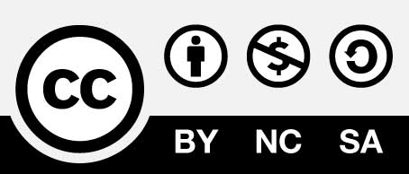

# Frontispiece

## About the OWASP Mobile Security Testing Guide

The OWASP Mobile Security Testing Guide (MSTG) is a comprehensive manual for testing the security of mobile apps. It describes processes and techniques for verifying the requirements listed in the [Mobile Application Security Verification Standard (MASVS)](https://github.com/OWASP/owasp-masvs), and provides a baseline for complete and consistent security tests.

OWASP thanks the many authors, reviewers, and editors for their hard work in developing this guide. If you have any comments or suggestions on the Mobile Security Testing Guide, please join the discussion around MASVS and MSTG in the [OWASP Mobile Security Project Slack Channel](https://owasp.slack.com/messages/project-mobile_omtg/details/). You can sign up for the Slack channel at [http://owasp.herokuapp.com/](http://owasp.herokuapp.com/).

## Copyright and License

Copyright © 2018 The OWASP Foundation. This work is licensed under a [Creative Commons Attribution-ShareAlike 4.0 International License](https://creativecommons.org/licenses/by-sa/4.0/). For any reuse or distribution, you must make clear to others the license terms of this work.

## Acknowledgements

**Note**: This contributor table is generated based on our [GitHub contribution statistics](https://github.com/OWASP/owasp-mstg/graphs/contributors). For more information on these stats, see the [GitHub Repository README](https://github.com/OWASP/owasp-mstg/blob/master/README.md). We manually update the table every few weeks, so be patient if you're not listed immediately.

### Authors

#### Bernhard Mueller

Bernhard is a cyber security specialist with a talent for hacking systems of all kinds. During more than a decade in the industry, he has published many zero-day exploits for software such as MS SQL Server, Adobe Flash Player, IBM Director, Cisco VOIP, and ModSecurity. If you can name it, he has probably broken it at least once. BlackHat USA commended his pioneering work in mobile security with a Pwnie Award for Best Research.

#### Sven Schleier

Sven is an experienced web and mobile penetration tester and assessed everything from historic Flash applications to progressive apps build on the MEAN stack. He is also a security engineer that supported many projects end-to-end during the SDLC to "build security in". He was speaking at local and international meetups and conferences and is conducting hands-on workshops about web application and mobile app security. 

### Co-Authors

Co-authors have consistently contributed quality content and have at least 2,000 additions logged in the GitHub repository.

#### Romuald Szkudlarek

Romuald is a passionate cyber security & privacy professional with over 15 years of experience in the web, mobile, IoT and cloud domains. During his career, he has been dedicating his spare time to a variety of projects with the goal of advancing the sectors of software and security. He is teaching regularly at various institutions. He holds CISSP, CCSP, CSSLP, and CEH credentials.

#### Jeroen Willemsen

Jeroen is a full-stack developer specializing in IT security at Xebia with a passion for mobile and risk management. Driven by a love for explaining technical subjects, he began as a PHP teacher to undergrad students before moving on to discussing security, risk management, and programming issues to anyone willing to listen and learn.

### Top Contributors

Top contributors have consistently contributed quality content and have at least 500 additions logged in the GitHub repository.

- Pawel Rzepa
- Francesco Stillavato
- Andreas Happe
- Alexander Anthuk
- Henry Hoggard
- Wen Bin Kong
- Abdessamad Temmar
- Bolot Kerimbaev
- Slawomir Kosowski

### Contributors

Contributors have contributed quality content and have at least 50 additions logged in the GitHub repository.

Jin Kung Ong, Sjoerd Langkemper, Gerhard Wagner, Michael Helwig, Pece Milosev, Denis Pilipchuk, Ryan Teoh, Dharshin De Silva, Anatoly Rosencrantz, Abhinav Sejpa, Daniel Ramirez Martin, Claudio André, Enrico Verzegnassi, Yogesh Sharma, Dominique Righetto, Raul Siles, Prathan Phongthiproek, Tom Welch, Luander Ribeiro, Dario Incalza, Akanksha Bana, Oguzhan Topgul, Carlos Holguera, David Fern, Pishu Mahtani, Anuruddha E.

### Reviewers

Reviewers have consistently provided useful feedback through GitHub issues and pull request comments.

- Sjoerd Langkemper
- Anant Shrivastava

### Editors

- Heaven Hodges
- Caitlin Andrews
- Nick Epson
- Anita Diamond
- Anna Szkudlarek

### Others

Many other contributors have committed small amounts of content, such as a single word or sentence (less than 50 additions). The full list of contributors is available on GitHub:

https://github.com/OWASP/owasp-mstg/graphs/contributors

### Older Versions

The Mobile Security Testing Guide was initiated by Milan Singh Thakur in 2015. The original document was hosted on Google Drive. Guide development was moved to GitHub in October 2016.

**OWASP MSTG "Beta 2" (Google Doc)**

| Authors | Reviewers | Top Contributors |
| --- | --- | --- |
| Milan Singh Thakur, Abhinav Sejpal, Blessen Thomas, Dennis Titze, Davide Cioccia, Pragati Singh, Mohammad Hamed Dadpour, David Fern, Mirza Ali, Rahil Parikh, Anant Shrivastava, Stephen Corbiaux, Ryan Dewhurst, Anto Joseph, Bao Lee, Shiv Patel, Nutan Kumar Panda, Julian Schütte, Stephanie Vanroelen, Bernard Wagner, Gerhard Wagner, Javier Dominguez | Andrew Muller, Jonathan Carter, Stephanie Vanroelen, Milan Singh Thakur  | Jim Manico, Paco Hope, Pragati Singh, Yair Amit, Amin Lalji, OWASP Mobile Team|

**OWASP MSTG "Beta 1" (Google Doc)**

| Authors | Reviewers | Top Contributors |
| --- | --- | --- |
| Milan Singh Thakur, Abhinav Sejpal, Pragati Singh, Mohammad Hamed Dadpour, David Fern, Mirza Ali, Rahil Parikh | Andrew Muller, Jonathan Carter | Jim Manico, Paco Hope, Yair Amit, Amin Lalji, OWASP Mobile Team  |
