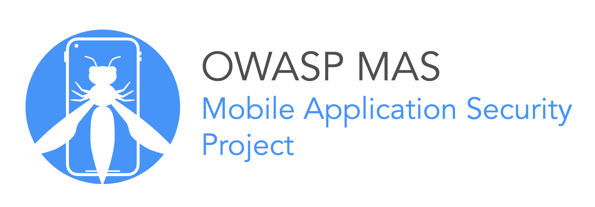
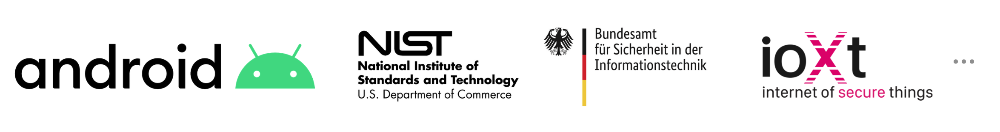

# Frontispiece

## About the OWASP MASTG

The [OWASP Mobile Application Security Testing Guide (MASTG)](https://mas.owasp.org/MASTG/), which is part of the [OWASP Mobile Application Security (MAS)](https://mas.owasp.org/) flagship project, is a comprehensive manual covering the processes, techniques, and tools used during mobile application security analysis, as well as an exhaustive set of test cases for verifying the requirements listed in the [OWASP Mobile Application Security Verification Standard (MASVS)](https://mas.owasp.org/MASVS/), providing a baseline for complete and consistent security tests.

The OWASP MASVS and MASTG are trusted by the following platform providers and standardization, governmental and educational institutions. [Learn more](0x02b-MASVS-MASTG-Adoption.md).

## Authors

<!-- markdownlint-disable search-replace -->

### Bernhard Mueller

Bernhard is a cyber security specialist with a talent for hacking systems of all kinds. During more than a decade in the industry, he has published many zero-day exploits for software such as MS SQL Server, Adobe Flash Player, IBM Director, Cisco VOIP, and ModSecurity. If you can name it, he has probably broken it at least once. BlackHat USA commended his pioneering work in mobile security with a Pwnie Award for Best Research.

### Sven Schleier

Sven is an experienced web and mobile penetration tester and assessed everything from historic Flash applications to progressive mobile apps. He is also a security engineer that supported many projects end-to-end during the SDLC to "build security in". He was speaking at local and international meetups and conferences and is conducting hands-on workshops about web application and mobile app security.

### Jeroen Willemsen

Jeroen is a principal security architect with a passion for mobile security and risk management. He has supported companies as a security coach, a security engineer and as a full-stack developer, which makes him a jack of all trades. He loves explaining technical subjects: from security issues to programming challenges.

### Carlos Holguera

Carlos is a mobile security research engineer who has gained many years of hands-on experience in the field of security testing for mobile apps and embedded systems such as automotive control units and IoT devices. He is passionate about reverse engineering and dynamic instrumentation of mobile apps and is continuously learning and sharing his knowledge.

## Co-Authors

Co-authors have consistently contributed quality content and have at least 2,000 additions logged in the GitHub repository.

### Romuald Szkudlarek

Romuald is a passionate cyber security & privacy professional with over 15 years of experience in the web, mobile, IoT and cloud domains. During his career, he has been dedicating his spare time to a variety of projects with the goal of advancing the sectors of software and security. He is teaching regularly at various institutions. He holds CISSP, CCSP, CSSLP, and CEH credentials.

### Jeroen Beckers

Jeroen is a mobile security lead responsible for quality assurance on mobile security projects and for R&D on all things mobile. Although he started his career as a programmer, he found that it was more fun to take things apart than to put things together, and the switch to security was quickly made. Ever since his master's thesis on Android security, Jeroen has been interested in mobile devices and their (in)security. He loves sharing his knowledge with other people, as is demonstrated by his many talks & trainings at colleges, universities, clients and conferences.

### Vikas Gupta

Vikas is an experienced cyber security researcher, with expertise in mobile security. In his career he has worked to secure applications for various industries including fintech, banks and governments. He enjoys reverse engineering, especially obfuscated native code and cryptography. He holds masters in security and mobile computing, and an OSCP certification. He is always open to share his knowledge and exchange ideas.

<!-- markdownlint-disable search-replace -->

<!-- \pagebreak -->

## Changelog

All our Changelogs are available online at the OWASP MASTG GitHub repository, see the Releases page:

<https://github.com/OWASP/mastg/releases>

## Disclaimer

Please consult the laws in your country before executing any tests against mobile apps by utilizing the MASTG materials. Refrain from violating the laws with anything described in the MASTG.

Our [Code of Conduct](https://github.com/OWASP/mastg/blob/master/.github/CODE_OF_CONDUCT.md) has further details.

OWASP thanks the many authors, reviewers, and editors for their hard work in developing this guide. If you have any comments or suggestions, please connect with us: <https://mas.owasp.org/contact>

If you find any inconsistencies or typos please open an issue in the OWASP MASTG Github Repo: <https://github.com/OWASP/mastg>

## Copyright and License

Copyright © The OWASP Foundation. This work is licensed under a [Creative Commons Attribution-ShareAlike 4.0 International License](https://creativecommons.org/licenses/by-sa/4.0/ "Creative Commons Attribution-ShareAlike 4.0 International License"). For any reuse or distribution, you must make clear to others the license terms of this work.

