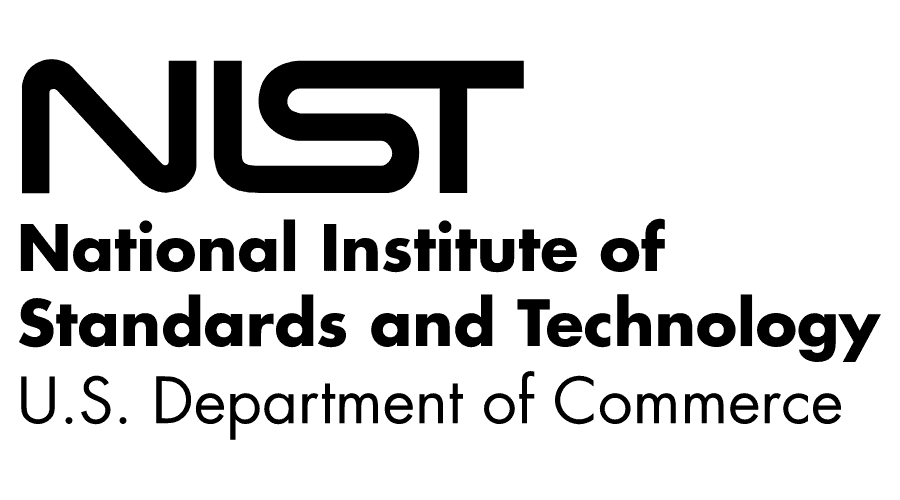
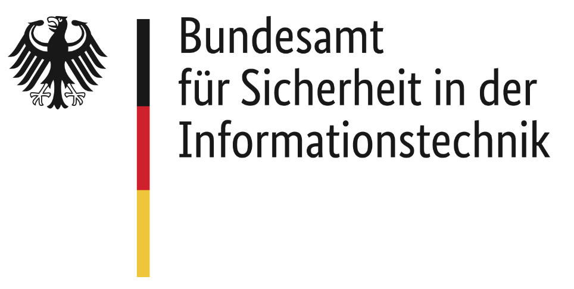

# OWASP MASVS and MASTG Adoption

The OWASP MASVS and MASTG are trusted by the following platform providers and standardization, governmental and educational institutions.

## Mobile Platform Providers

### Google Android

Since 2021 Google has shown their support for the OWASP Mobile Security project (MASTG/MASVS) and has started providing continuous and high value feedback to the MASVS refactoring process via the [App Defense Alliance (ADA)](https://appdefensealliance.dev/) and its [MASA (Mobile Application Security Assessment) program](https://appdefensealliance.dev/masa).

With MASA, Google has acknowledged the importance of leveraging a globally recognized standard for mobile app security to the mobile app ecosystem. Developers can work directly with an Authorized Lab partner to initiate a security assessment. Google will recognize developers who have had their applications independently validated against a set of MASVS Level 1 requirements and will showcase this on their Data safety section.

We thank Google, the ADA and all its members for their support and for their excellent work on protecting the mobile app ecosystem.

## Certification Institutions

### CREST

CREST is an international not-for-profit, membership body who quality assures its members and delivers professional certifications to the cyber security industry. CREST works with governments, regulators, academe, training partners, professional bodies and other stakeholders around the world.

In August 2022, CREST launched the OWASP Verification Standard (OVS) Programme. CREST OVS sets new standards for application security. Underpinned by OWASP's Application Security Verification Standard (ASVS) and Mobile Application Security Verification Standard (MASVS), CREST is leveraging the open-source community to build and maintain global standards to deliver a global web and mobile application security framework. This will provide assurance to the buying community that developers using CREST OVS accredited providers, always know that they are engaged with ethical and capable organisations with skilled and competent security testers by leveraging the OWASP ASVS and MASVS standards.

- [CREST OVS Programme](https://www.crest-approved.org/membership/crest-ovs-programme/)
- [CREST OVS Accreditation Process](https://www.crest-approved.org/membership/crest-ovs-programme/ovs-programme-accreditation-process/)
- [CREST OVS Introductory Video](https://www.youtube.com/watch?v=th1l6-e4hcg)

We thank CREST for their consulation regarding the OVS programme and its support to the open-source community to build and maintain global cyber security standards.

## Standardization Institutions

### NIST (National Institute of Standards and Technology, United States)

The [National Institute of Standards and Technology (NIST)](https://www.nist.gov/about-nist) was founded in 1901 and is now part of the U.S. Department of Commerce. NIST is one of the nation's oldest physical science laboratories. Congress established the agency to remove a major challenge to U.S. industrial competitiveness at the time — a second-rate measurement infrastructure that lagged behind the capabilities of the United Kingdom, Germany and other economic rivals.

- [NIST.SP.800-163 "Vetting the Security of Mobile Applications" Revision 1, 2019](https://csrc.nist.gov/news/2019/nist-publishes-sp-800-163-rev-1)
- [NIST.SP.800-218 "Secure Software Development Framework (SSDF) v1.1: Recommendations for Mitigating the Risk of Software Vulnerabilities" v1.1, 2022](https://nvlpubs.nist.gov/nistpubs/SpecialPublications/NIST.SP.800-218.pdf)
- [NIST CSWP 33 "Product Development Cybersecurity Handbook: Concepts and Considerations for IoT Product Manufacturers" Initial Public Draft, 2024](https://nvlpubs.nist.gov/nistpubs/CSWP/NIST.CSWP.33.ipd.pdf)

### BSI (Bundesamt für Sicherheit in der Informationstechnik, Germany)

BSI stands for "Federal Office for Information Security", it has the goal to promote IT security in Germany and is the central IT security service provider for the federal government.

- [Technical Guideline BSI TR-03161 Security requirements for eHealth applications v1.0, 2020](https://www.bsi.bund.de/SharedDocs/Downloads/EN/BSI/Publications/TechGuidelines/TR03161/TR-03161.pdf)
- [Prüfvorschrift für den Produktgutachter des „ePA-Frontend des Versicherten" und des „E-Rezept-Frontend des Versicherten v2.0, 2021](https://www.bsi.bund.de/SharedDocs/Downloads/DE/BSI/DigitaleGesellschaft/Pruefvorschrift_Produktgutachter_ePA-Frontend.pdf)

### ioXt

The mission of the [ioXt Alliance](https://www.ioxtalliance.org/) is to build confidence in Internet of Things products through multi-stakeholder, international, harmonized, and standardized security and privacy requirements, product compliance programs, and public transparency of those requirements and programs.

In 2021, ioXt has [extended its security principles through the Mobile Application profile](https://www.ioxtalliance.org/news-events-blog/ioxt-alliance-expands-certification-program-for-mobile-and-vpn-security), so that app developers can ensure their products are built with, and maintain, high cybersecurity standards such as the OWASP MASVS and the VPN Trust Initiative. The ioXt Mobile Application profile is a security standard that applies to any cloud connected mobile app and provides the much needed market transparency for consumer and commercial mobile app security.

- [ioXt Base Profile v2.0](https://static1.squarespace.com/static/5c6dbac1f8135a29c7fbb621/t/6078677c7d7b84799f1eaa5b/1618503553847/ioXt_Base_Profile.pdf)

## Governmental Institutions

| Name | Document | Year |
| -------------- | -------------------- | -- |
| Government of Singapore, Cyber Security Agency (CSA) | [Safe App Standard v2.0](https://www.csa.gov.sg/resources/publications/safe-app-standard-2-0) | 2024 |
| European Payments Council | [Payment Threats and Fraud Trends Report](https://www.europeanpaymentscouncil.eu/sites/default/files/kb/file/2021-12/EPC193-21%20v1.0%202021%20Payments%20Threats%20and%20Fraud%20Trends%20Report.pdf) | 2021 |
| European Payments Council | [Mobile Initiated SEPA Credit Transfer Interoperability Implementation Guidelines, including SCT Instant (MSCT IIGs)](https://www.europeanpaymentscouncil.eu/document-library/guidance-documents/mobile-initiated-sepa-instant-credit-transfer-interoperability) | 2019 |
| ENISA (European Union Agency for Cybersecurity) | [Good Practices for Security of SMART CARS](https://www.enisa.europa.eu/publications/smart-cars) | 2019 |
| Government of India, Ministry of Electronics & Information Technology | [Adoption of Mobile AppSec Verification Standard (MASVS) Version 1.0 of OWASP](http://egovstandards.gov.in/notified-standards-1) | 2019 |
| Finish Transport and Communication Agency (TRAFICOM) | [Assessment guideline for electronic identification services (Draft)](https://www.traficom.fi/sites/default/files/media/file/DRAFT%20Traficom%20guideline%20211%202019%20conformity%20assessment%20of%20eID%20service.pdf) | 2019 |
| Gobierno de España INCIBE | [Ciberseguridad en Smart Toys](https://www.incibe.es/sites/default/files/contenidos/guias/doc/guia_smarttoys_final.pdf) | 2019 |

## Educational Institutions

| Name | Document | Year |
| -------------- | -------------------- | -- |
| Leibniz Fachhochschule Hannover, Germany | [Sicherheitsüberprüfung von mobilen iOS Apps nach OWASP (German)](https://leibniz-fh.de/content/uploads/2022/09/27_Arbeitspapier_OWASP.pdf) | 2022 |
| University of Florida, Florida Institute for Cybersecurity Research, United States | ["SO{U}RCERER : Developer-Driven Security Testing Framework for Android Apps"](https://arxiv.org/pdf/2111.01631.pdf) | 2021 |
| University of Adelaide, Australia and Queen Mary University of London, United Kingdom | [An Empirical Assessment of Global COVID-19 Contact Tracing Applications](https://arxiv.org/pdf/2006.10933.pdf) | 2021 |
| School of Information Technology, Mapúa University, Philippines | [A Vulnerability Assessment on the Parental Control Mobile Applications Security: Status based on the OWASP Security Requirements](http://www.ieomsociety.org/singapore2021/papers/1104.pdf) | 2021 |

## Application in Scientific Research

- [STAMBA: Security Testing for Android Mobile Banking Apps](https://link.springer.com/chapter/10.1007/978-3-319-28658-7_57 "Advances in Signal Processing and Intelligent Recognition Systems pp 671-683")

## Books

- [Hands-On Security in DevOps](https://books.google.co.uk/books?id=bO1mDwAAQBAJ&pg=PA40&lpg=PA40&dq=owasp+mobile+security+testing+guide&source=bl&ots=pHhAasVgeC&sig=ACfU3U0yodcqH0O8Sjx3ADTN2m1tbHeCsg&hl=nl&sa=X&ved=2ahUKEwio2umM8tbiAhXgVBUIHehnAEU4UBDoATAIegQICRAB#v=onepage&q=owasp%20mobile%20security%20testing%20guide&f=false "Hands-On Security in DevOps in Google books")

## Industry Case Studies

- [Case Study: NowSecure Commits to Security Standards](https://drive.google.com/file/d/1cns3Ot6MGdHwMMSx88lDds3brktMhLOM/view?usp=share_link)

> Would you like to contribute with your case study? [Connect with us!](https://mas.owasp.org/contact/)
