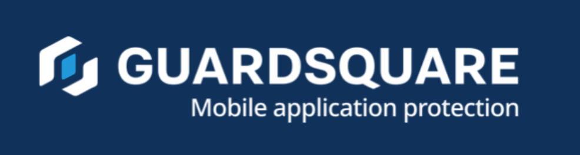

# Acknowledgments

## Contributors

All of our contributors are listed in the Contributing section of the OWASP MAS website:

<https://mas.owasp.org/contributing/>

## MAS Advocates

Being a "MAS Advocate" is the highest status that companies can achieve in the OWASP MAS project, acknowledging that they've gone above and beyond, **continuously supporting the project with time/dedicated resources with clear/high impact**.

To achieve this status, you'll need to demonstrate that you **make consistent high-impact contributions** to the project. The **minimum meaningful monthly contribution** is the following:

- **1 substantial PR**, which includes a full set of Weakness+Tests+Demos
    - Alternatively, as this is currently a priority, several PRs focused on porting v1->v2 tests (equivalent effort to the above, must include at least one demo per test).
- **2-3 in-depth PR reviews or issue support**
    - Involving a thorough analysis, constructive feedback, and actionable suggestions that demonstrate a clear understanding of the topic.
    - Reviews should go beyond surface-level comments and, where necessary, include research to provide well-informed insights.
- **Active participation** in the MAS Task Force, which includes:
    - Presenting your work, asking questions, and discussing new ideas/changes.
    - Proactive follow-up on tasks and initiatives.

**Important Note**: Contributions should align with OWASP quality guidelines and project priorities.

**Initial evaluation period**: Consistency over a sustained period of time (min. 6 months) is fundamental. Note that the 6-month timeframe is a minimum and may extend depending on the nature and impact of your contributions.

### Benefits

- Company logo displayed in our main READMEs and main OWASP project site.
- Special acknowledgement on each MASTG release containing the contributed PRs.

### How to Apply

If you'd like to apply please contact the project leaders by sending an email to [Sven Schleier](mailto:sven.schleier@owasp.org) and [Carlos Holguera](mailto:carlos.holguera@owasp.org) who will validate your application and provide you with a _contribution report_.

After the initial evaluation period (see above), you'll need to send back the contribution report including sufficient evidence (e.g links to PRs) showing what you've done in that period that goes inline with "**the minimum meaningful monthly contributions**".

### Important Disclaimers

#### Renewals

If the **MAS Advocate** status is granted and you wish to maintain it, contributions must remain consistent beyond the initial evaluation period. Advocates must continue collecting evidence and submit a **yearly contribution report**.

#### Financial Donations

Financial donations are **not** part of the eligibility criteria for MAS Advocate status.

#### Non-Endorsement

Advocate companies may use the OWASP MAS logo and reference MASVS/MASTG resources in their communications. However, they **cannot** present this as an **endorsement by OWASP** or imply that they are a **preferred provider** of software or services.

#### Revocation of MAS Advocate Status

MAS Advocate status will be **revoked immediately** if a company fails to comply with the guidelines. For example:

- **Acceptable Use**: Listing MAS Advocate status on a website homepage, in "About Company" slides for sales presentations, or in sales collateral.
- **Non-Compliant Use**: Claiming OWASP certification, OWASP endorsement, or being a **preferred vendor** of OWASP or the MAS project.

#### Non-Certification & Non-Vetting Disclaimer

OWASP **does not certify, validate, or vet** any vendors, software, or trust marks. Claims of MASVS/MASTG/MASWE compliance **are not officially recognized** by OWASP or the OWASP MAS project. Organizations should exercise caution when relying on such claims.

#### Vendor Neutrality

The **OWASP Foundation** is strictly vendor-neutral and **does not endorse** any of its supporters.

#### Governance and Editorial Independence

MAS Advocates may contribute to discussions, provide feedback, and suggest improvements to the OWASP MAS resources. However, they **do not have decision-making authority** over the final content, which remains under the control of the OWASP MAS project leaders.

## Our MAS Advocates

### NowSecure

**We'd like to thank [NowSecure](https://www.nowsecure.com) for its exemplary contributions since 2022, which set a blueprint for other potential contributors wanting to push the project forward.** [Read more about their journey here.](../news/posts/2025-04-09-celebrating-3-years-advocate-nowsecure.md)

**High-impact Contributions:**

- Hundreds of pull requests and reviews, significantly enhancing MAS resources.
- Key role in rebranding the project from MSTG to OWASP MAS.
- Major contributions to MASVS v2.0.0, including feedback on abstraction and testing profiles.
- Contributions to the MASTG refactor, including modularizing the framework.
- Significant input in introducing MASVS-PRIVACY and MASWE.
- Leadership of the MAS Task Force, driving the roadmap forward.
- Support in developing MAS Test Apps for Android and iOS.

A special mention goes to NowSecure's contributions during the **OWASP Project Summit 2024**, where they led the mobile app security track and reviewed numerous contributions, fostering collaboration and innovation.

In the past, NowSecure has also contributed to the project and has donated the @MASTG-APP-0015.

### Guardsquare

**We'd like to thank [Guardsquare](https://www.guardsquare.com) for its outstanding contributions to the OWASP MAS project, culminating in achieving MAS Advocate status in 2025.** [Read more about their achievement here.](../news/posts/2025-05-23-new-advocate-guardsquare.md)

**High-impact Contributions:**

- Active participation in the MAS Task Force, including monthly calls and proactive follow-ups.
- Numerous pull requests focused on porting v1 to v2 tests with demos.
- Peer reviews and actionable feedback to maintain MASTG quality.

A special highlight was Guardsquare's significant contributions during the **OWASP Project Summit in November 2024**, where their team submitted the majority of the \~40 pull requests created during the event.
