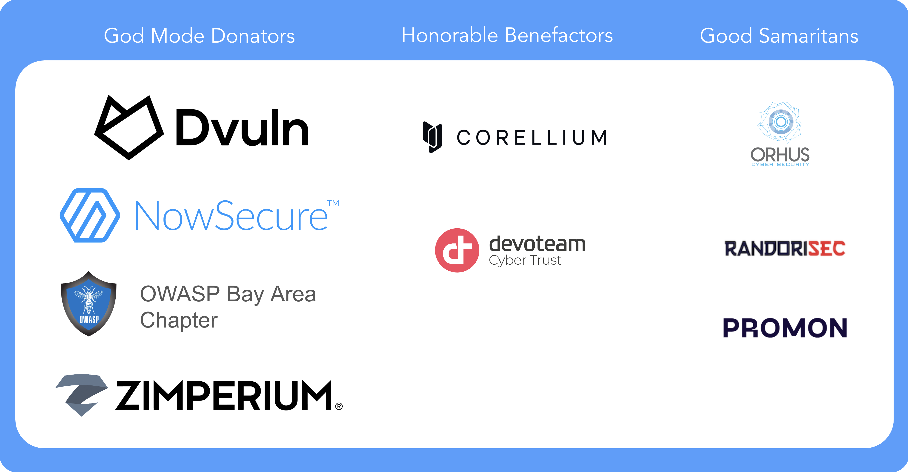

# Acknowledgments

## Contributors

All of our contributors are listed in the Contributing section of the OWASP MAS website:

<https://mas.owasp.org/contributing/>

## 🥇 MAS Advocates

MAS Advocates are industry supporters of the OWASP MASVS and MASTG who have invested a significant and consistent amount of resources to push the project forward by providing consistent high-impact contributions and continuously spreading the word.

> 🥇 Being a "MAS Advocate" is the highest status that companies can achieve in the project, acknowledging that they've gone above and beyond to support the project.

**MAS Advocates continuously support the project with time/dedicated resources with clear/high impact**. To achieve this status, you'll need to demonstrate that you **make consistent high-impact contributions** to the project. For example:
     - Content Pull Requests (e.g. adding/updating existing tests, tooling, maintaining code samples, etc.)
     - Technical PR reviews
     - Improving automation (GitHub Actions)
     - Upgrading, extending or creating new Crackmes
     - Moderating GitHub Discussions
     - Providing high quality feedback to the project and for special events such as the MASVS/MASTG refactoring.
     - etc.

The following will be considered but it's not a requirement:

- **Showing Adoption**: it should be clear just from looking at the official company page that they have adopted the OWASP MASVS and MASTG. For example:
    - Services/products
    - Resources (e.g. blog posts, press releases, public pentest reports)
    - Trainings
    - etc.
- **Spreading the word** and promoting the project with many presentations each year, public trainings, high social media involvement (e.g. liking, re-sharing, doing own posting specifically to promote the project).

### 🎁 Benefits

- Company logo displayed in our main READMEs and main OWASP project site.
- Linked blog posts in the MASTG will include the company name.
- Special acknowledgement on each MASTG release containing the contributed PRs.
- Re-shares from the OWASP MAS accounts on new publications (e.g. retweets).
- Initial public "Thank You" and yearly after successful renewal.

### 📝 How to Apply

If you'd like to apply please contact the project leaders by sending an email to [Sven Schleier](mailto:sven.schleier@owasp.org) and [Carlos Holguera](mailto:carlos.holguera@owasp.org) who will validate your application and provide you with a _contribution report_. Please be sure to include sufficient evidence (e.g including links to PRs) showing what you've done in the 6 months period that goes inline with the three categories described above:

- **Make consistent high-impact contributions**
- **Showing Adoption**
- **Spreading the word**

### ❗ Important Disclaimers

- If the "MAS Advocate" status is granted and you'd like to maintain it, the aforementioned contributions must remain consistent after the initial period as well. You should keep collecting this evidence and send us a _contribution report_ yearly.
- [Financial donations](https://mas.owasp.org/donate/) are not part of the eligibility criteria but will be listed for completion.
- Re-shared publications and blog posts linked in MASTG text must be **educational** and focus on mobile security or MASVS/MASTG and **not endorse company products/services**.
- Advocate Companies may use the logo and links to MASVS/MASTG resources as part of their communication but cannot use them as an endorsement by OWASP as a preferred provider of software and services.
    - Example of what's ok: list MAS Advocate status on website home page, in "about company" slides in sales presentations, on sales collateral.
    - Example of what's not ok: a MAS Advocate cannot claim they are OWASP certified.
- The quality of the application of the MASVS/MASTG by these companies [has not been vetted by the MAS team](https://mas.owasp.org/MASVS/Intro/04-Assessment_and_Certification/).

> The OWASP Foundation is very grateful for the support by the individuals and organizations listed. However please note, the OWASP Foundation is strictly vendor neutral and does not endorse any of its supporters. MAS Advocates do not influence the content of the MASVS or MASTG in any way.

## Our MAS Advocates

[NowSecure](https://www.nowsecure.com) has provided consistent high-impact contributions to the project and has successfully helped spread the word.

**We'd like to thank NowSecure for its exemplary contribution which sets a blueprint for other potential contributors wanting to push the project forward.**

### NowSecure's Contributions to the MAS Project

**High-impact Contributions (time/dedicated resources):**

- [Content PRs](https://github.com/OWASP/owasp-mastg/pulls?q=is%3Apr+%22%28by+%40NowSecure%29%22)
- Technical Reviews for PRs
- Participation in GitHub Discussions

A special mention goes for the **contribution to the MASVS Refactoring**:

- Significant time investment to drive the discussions and create the proposals along with the community
- Testability Analysis
- Feedback on each category proposal
- Statistics from internal analysis

In the past, NowSecure has also contributed to the project, has sponsored it becoming a "God Mode Sponsor" and has donated the [UnCrackable App for Android Level 4: Radare2 Pay](0x08b-Reference-Apps.md#android-uncrackable-l4).

Additionally:

**Showing Adoption:**

- Services / Products:
    - [NowSecure Debuts New OWASP MASVS Mobile Pen Tests](https://www.nowsecure.com/blog/2022/03/22/nowsecure-debuts-new-owasp-masvs-mobile-pen-tests/)
    - [NowSecure Platform for Automated Mobile Security Testing](https://www.nowsecure.com/products/nowsecure-platform/)
- Resources:
    - [The Essential Guide to the OWASP Mobile Security Project](https://discover.nowsecure.com/c/manager-guide-owasp?x=LIaYZt&xs=90367)
- Trainings:
    - [Standards and Risk Assessment](https://academy.nowsecure.com/standards-and-risk-assessment)
    - [OWASP MASVS & MASTG Updates](https://academy.nowsecure.com/owasp-masvs-mstg-updates)
    - [Intro to Mobile App Security](https://academy.nowsecure.com/intro-to-mobile-app-security)

**Spreading the Word:**

- **Social media involvement**: continuous Twitter and LinkedIn activity (see [examples](https://twitter.com/search?q=(MASVS%20OR%20MSTG)%20(from%3ANowSecureMobile)&src=typed_query))
- **Case Study**: [NowSecure Commits to Security Standards](https://drive.google.com/file/d/1cns3Ot6MGdHwMMSx88lDds3brktMhLOM/view?usp=share_link)
- **Blog Posts**:
    - [Integrate security into the mobile app software development lifecycle](https://www.scmagazine.com/perspective/devops/integrate-security-into-the-mobile-app-software-development-lifecycle)
    - [OWASP Mobile Security Testing Checklist Aids Compliance](https://www.nowsecure.com/blog/2022/02/23/owasp-mobile-security-testing-checklist-aids-compliance/)
- **Presentations**:
    - Refactoring Mobile App Security (OWASP AppSec US, Oct 2023)
    - OWASP MAS Project Showcase (OWASP AppSec US, Oct 2023)
    - OWASP MASVS v2 Updates (Tech Talks by NowSecure, Feb 2023)
    - "Mobile Wanderlust"! Our journey to Version 2.0! (OWASP AppSec EU Jun 10 2022, OWASP Global AppSec APAC Sept 2022, OWASP AppSec US Nov 2022, OWASP AppSec EU Feb 2023)
    - Insiders Guide to Mobile AppSec with Latest OWASP MASVS (OWASP Toronto Chapter Feb 10 2022)
    - [Insiders Guide to Mobile AppSec with Latest OWASP MASVS (OWASP Virtual AppSec 2021 Nov 11 2021)](https://www.youtube.com/watch?v=TcYtpUIIMYw)
    - [Insiders Guide to Mobile AppSec with OWASP MASVS (OWASP Northern Virginia Chapter Oct 8 2021)](https://www.youtube.com/watch?v=fuLo64WH3SU)
    - and more

### Donators

While both the MASVS and the MASTG are created and maintained by the community on a voluntary basis, sometimes a little bit of outside help is required. We therefore thank our donators for providing the funds to be able to hire technical editors. Note that their donation does not influence the content of the MASVS or MASTG in any way. The Donation Packages are described on our [OWASP Project page](https://mas.owasp.org/donate/ "OWASP MAS Donation Packages").

