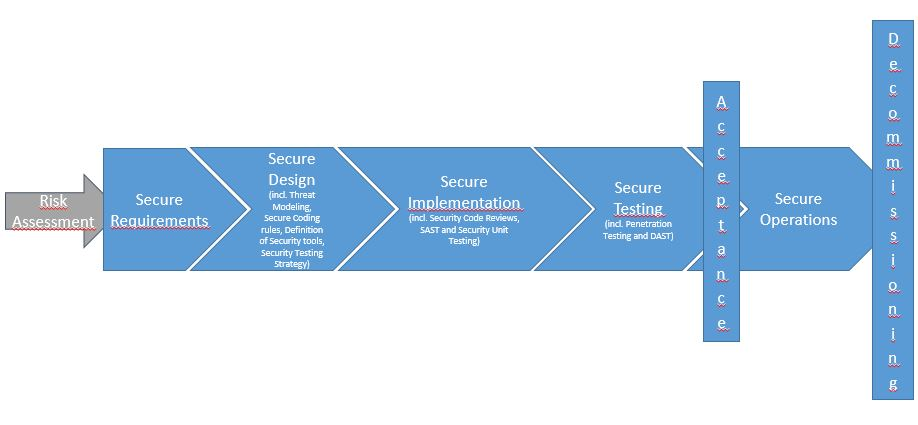

## Mobile App Security Testing

In the following sections we'll provide a brief overview of general security testing principles and key terminology. The concepts introduced are largely identical to those found in other types of penetration testing, so if you are an experienced tester you may want to skip this chapter and go right to the interesting part.

Throughout the guide, we use "mobile app security testing" as a catchall phrase to refer to the evaluation of mobile app security via static and dynamic analysis. Terms such as "mobile app penetration testing" and "mobile app security review" are used somewhat inconsistently in the security industry, but these terms refer to roughly the same thing. A mobile app security test is usually part of a larger security assessment or penetration test that encompasses the client-server architecture and server-side APIs used by the mobile app.

In this guide, we cover mobile app security testing in two contexts. The first is the "classical" security test completed near the end of the development life cycle. In this context, the tester accesses a nearly finished or production-ready version of the app, identifies security issues, and writes a (usually devastating) report. The other context is characterized by the implementation of requirements and the automation of security tests from the beginning of the software development life cycle onwards. The same basic requirements and test cases apply to both contexts, but the high-level method and the level of client interaction differ.

### Principles of Testing

#### White-box Testing versus Black-box Testing

Let's start by defining the concepts:

- **Black-box testing** is conducted without the tester's having any information about the app being tested. This process is sometimes called "zero-knowledge testing." The main purpose of this test is allowing the tester to behave like a real attacker in the sense of exploring possible uses for publicly available and discoverable information.
- **White-box testing** (sometimes called "full knowledge testing") is the total opposite of black-box testing in the sense that the tester has full knowledge of the app. The knowledge may encompass source code, documentation, and diagrams. Although much easier and faster than black-box testing, white-box testing doesn't allow for as many test cases. White-box testing is generally more useful for protecting the app against internal attackers.
- **Gray-box testing** is all testing that falls in between the two aforementioned testing types: some information is provided to the tester (usually credentials only), and other information is intended to be discovered. This type of testing is an interesting compromise in the number of test cases, the cost, the speed, and the scope of testing. Gray-box testing is the most common kind of testing in the security industry.

We strongly advise that you request the source code so that you can use the testing time as efficiently as possible. The tester's code access obviously doesn't simulate an external attack, but it simplifies the identification of vulnerabilities by allowing the tester to verify every identified anomaly or suspicious behavior at the code level. A white-box test is the way to go if the app hasn't been tested before.

Even though decompiling on Android is straightforward, the source code may be obfuscated, and de-obfuscating will be time-consuming, possibly to the point of being even. Time constraints are therefore another reason for the tester to have access to the source code.

#### Static versus Dynamic Analysis

Static analysis involves examining an application's components without executing them. It may be similar to white-box testing. The term often refers to manual or automatic source code analysis.
OWASP provides information about [Static Code Analysis](https://www.owasp.org/index.php/Static_Code_Analysis "OWASP Static Code Analysis") that may help you understand techniques, strengths, weaknesses, and limitations.

Dynamic analysis involves examining the app from the outside while executing it. This type of analysis can be manual or automatic. It usually doesn't provide the information that static analysis provides, but it is a good way to detect interesting elements (assets, features, entry points, etc.) from a user's point of view. It may be similar to black-box testing.
OWASP provides information about [Dynamic Analysis](https://www.owasp.org/index.php/Dynamic_Analysis "OWASP Dynamic Analysis") that may help you understand how to analyze apps.

Now that we have defined static and dynamic analysis, let's dive deeper.

#### Vulnerability Analysis

Vulnerability analysis is usually the process of looking for vulnerabilities in an app. Although this may be done manually, automated scanners are usually used to identify the main vulnerabilities. Static and dynamic analysis are types of vulnerability analysis.

#### Static Analysis

During static analysis, the mobile app's source code is analyzed to ensure appropriate implementation of security controls. In most cases, a hybrid automatic/manual approach is used. Automatic scans catch the low-hanging fruit, and the human tester can explore the code base with specific usage contexts in mind.

##### Manual Code Review

A human reviewer performs manual code review by manually analyzing the mobile application's source code for security vulnerabilities. Methods range from a basic keyword search via the 'grep' command to a line-by-line examination of the source code. IDEs (Integrated Development Environments) often provide basic code review functions and can be extended with various tools.

A common approach to manual code analysis entails identifying key security vulnerability indicators by searching for certain APIs and keywords, such as database-related method calls like "executeStatement" or "executeQuery". Code containing these strings is a good starting point for manual analysis.

In contrast to automatic code analysis, manual code review is very good for identifying vulnerabilities in the business logic, standards violations, and design flaws, especially when the code is technically secure but logically flawed. Such scenarios are unlikely to be detected by any automatic code analysis tool.

A manual code review requires an expert code reviewer who is proficient in both the language and the frameworks used for the mobile application. Full code review can be a slow, tedious, time-consuming process for the reviewer, especially given large code bases with many dependencies.

##### Automatic Code Analysis

Automated analysis tools can be used to speed up the review process of Static Application Security Testing (SAST). They check the source code for compliance with a predefined set of rules or industry best practices, then typically display a list of findings or warnings and flags for all detected violations. Some static analysis tools run against the compiled app only, some must be fed the original source code, and some run as live-analysis plugins in the Integrated Development Environment (IDE).

Although some static code analysis tools incorporate a lot of information about the rules and semantics required to analyze mobile apps, they may produce many false positives, particularly if they are not configured for the target environment. A security professional must therefore always review the results.

The chapter "Testing tools", at the end of this book, includes a list of static analysis tools.

#### Dynamic Analysis

The focus of dynamic analysis (also called DAST, or Dynamic Application Security Testing) is the testing and evaluation of apps via their real-time execution. The main objective of dynamic analysis is finding security vulnerabilities or weak spots in a program while it is running. Dynamic analysis is conducted both at the mobile platform layer and against the back-end services and APIs, where the mobile app's request and response patterns can be analyzed.

Dynamic analysis is usually used to check for security mechanisms that provide sufficient protection against the most prevalent types of attack, such as disclosure of data in transit, authentication and authorization issues, and server configuration errors.

#### Avoiding False Positives

Automated testing tools' lack of sensitivity to app context is a challenge. These tools may identify a potential issue that's irrelevant. Such results are called "false positives."

For example, security testers commonly report vulnerabilities that are exploitable in a web browser but aren't relevant to the mobile app. This false positive occurs because automated tools used to scan the back-end service are based on regular browser-based web applications. Issues such as CSRF (Cross-site Request Forgery) and Cross-Site Scripting (XSS) are reported accordingly.

Let's take CSRF as an example. A successful CSRF attack requires the following:

- The ability to entice the logged-in user to open a malicious link in the web browser used to access the vulnerable site.
- The client (browser) must automatically add the session cookie or other authentication token to the request.

Mobile apps don't fulfill these requirements: even if Webviews and cookie-based session management are used, any malicious link the user clicks opens in the default browser, which has a separate cookie store.

Stored Cross-Site Scripting (XSS) can be an issue if the app includes Webviews, and it may even lead to command execution if the app exports JavaScript interfaces. However, reflected cross-site scripting is rarely an issue for the reason mentioned above (even though whether they should exist at all is arguable—escaping output is simply a best practice).

In any case, consider exploit scenarios when you perform the risk assessment; don't blindly trust your scanning tool's output.

#### Penetration Testing (a.k.a. Pentesting)

The classic approach involves all-around security testing of the app's final or near-final build, e.g., the build that's available at the end of the development process. For testing at the end of the development process, we recommend the [Mobile App Security Verification Standard (MASVS)](https://github.com/OWASP/owasp-masvs "OWASP MASVS") and the associated checklist. A typical security test is structured as follows:

- **Preparation** - defining the scope of security testing, including identifying applicable security controls, the organization's testing goals, and sensitive data. More generally, preparation includes all synchronization with the client as well as legally protecting the tester (who is often a third party). Remember, attacking a system without written authorization is illegal in many parts of the world!
- **Intelligence Gathering** - analyzing the **environmental** and **architectural** context of the app to gain a general contextual understanding.
- **Mapping the Application** - based on information from the previous phases; may be complemented by automated scanning and manually exploring the app. Mapping provides a thorough understanding of the app, its entry points, the data it holds, and the main potential vulnerabilities. These vulnerabilities can then be ranked according to the damage their exploitation would cause so that the security tester can prioritize them. This phase includes the creation of test cases that may be used during test execution.
- **Exploitation** - in this phase, the security tester tries to penetrate the app by exploiting the vulnerabilities identified during the previous phase. This phase is necessary for determining whether vulnerabilities are real (i.e., true positives).
- **Reporting** - in this phase, which is essential to the client, the security tester reports the vulnerabilities he or she has been able to exploit and documents the kind of compromise he or she has been able to perform, including the compromise's scope (for example, the data he or she has been able to access illegitimately).

##### Preparation

The security level at which the app will be tested must be decided before testing. The security requirements should be decided at the beginning of the project. Different organizations have different security needs and resources available for investing in test activities. Although the controls in MASVS Level 1 (L1) are applicable to all mobile apps, walking through the entire checklist of L1 and Level 2 (L2) MASVS controls with technical and business stakeholders is a good way to decide on a level of test coverage.

Organizations may have different regulatory and legal obligations in certain territories. Even if an app doesn't handle sensitive data, some L2 requirements may be relevant (because of industry regulations or local laws). For example, two-factor authentication (2FA) may be obligatory for a financial app and enforced by a country's central bank and/or financial regulatory authorities.

Security goals/controls defined earlier in the development process may also be reviewed during the discussion with stakeholders. Some controls may conform to MASVS controls, but others may be specific to the organization or application.

All involved parties must agree on the decisions and the scope in the checklist because these will define the baseline for all security testing.

###### Coordinating with the Client

Setting up a working test environment can be a challenging task. For example, restrictions on the enterprise wireless access points and networks may impede dynamic analysis performed at client premises. Company policies may prohibit the use of rooted phones or (hardware and software) network testing tools within enterprise networks. Apps that implement root detection and other reverse engineering countermeasures may significantly increase the work required for further analysis.

Security testing involves many invasive tasks, including monitoring and manipulating the mobile app's network traffic, inspecting the app data files, and instrumenting API calls. Security controls, such as certificate pinning and root detection, may impede these tasks and dramatically slow testing down.

To overcome these obstacles, you may want to request two of the app's build variants from the development team. One variant should be a release build so that you can determine whether the implemented controls are working properly and can be bypassed easily. The second variant should be a debug build for which certain security controls have been deactivated. Testing two different builds is the most efficient way to cover all test cases.

Depending on the scope of the engagement, this approach may not be possible. Requesting both production and debug builds for a white-box test will help you complete all test cases and clearly state the app's security maturity. The client may prefer that black-box tests be focused on the production app and the evaluation of its security controls' effectiveness.

The scope of both types of testing should be discussed during the preparation phase. For example, whether the security controls should be adjusted should be decided before testing. Additional topics are discussed below.

###### Identifying Sensitive Data

Classifications of sensitive information differ by industry and country. In addition, organizations may take a restrictive view of sensitive data, and they may have a data classification policy that clearly defines sensitive information.

There are three general states from which data may be accessible:

- **At rest** - the data is sitting in a file or data store
- **In use** - an application has loaded the data into its address space
- **In transit** - data has been exchanged between mobile app and endpoint or consuming processes on the device, e.g., during IPC (Inter-Process Communication)

The degree of scrutiny that's appropriate for each state may depend on the data's importance and likelihood of being accessed. For example, data held in application memory may be more vulnerable than data on web servers to access via core dumps because attackers are more likely to gain physical access to mobile devices than to web servers.

When no data classification policy is available, use the following list of information that's generally considered sensitive:

- user authentication information (credentials, PINs, etc.)
- Personally Identifiable Information (PII) that can be abused for identity theft: social security numbers, credit card numbers, bank account numbers, health information
- device identifiers that may identity a person
- highly sensitive data whose compromise would lead to reputational harm and/or financial costs
- any data whose protection is a legal obligation
- any technical data generated by the application (or its related systems) and used to protect other data or the system itself (e.g., encryption keys).

 A definition of "sensitive data" must be decided before testing begins because detecting sensitive data leakage without a definition may be impossible.

##### Intelligence Gathering

Intelligence gathering involves the collection of information about the app's architecture, the business use cases the app serves, and the context in which the app operates. Such information may be classified as "environmental" or "architectural."

###### Environmental Information

Environmental information includes:

- The organization's goals for the app. Functionality shapes users' interaction with the app and may make some surfaces more likely than others to be targeted by attackers.   
- The relevant industry. Different industries may have different risk profiles.
- Stakeholders and investors; understanding who is interested in and responsible for the app.
- Internal processes, workflows, and organizational structures. Organization-specific internal processes and workflows may create opportunities for [business logic exploits](https://www.owasp.org/index.php/Testing_for_business_logic "Testing business logic").

###### Architectural Information

Architectural information includes:

- **The mobile app:** How the app accesses data and manages it in-process, how it communicates with other resources and manages user sessions, and whether it detects itself running on jailbroken or rooted phones and reacts to these situations.
- **The Operating System:** The operating systems and OS versions the app runs on (including Android or iOS version restrictions), whether the app is expected to run on devices that have Mobile Device Management (MDM) controls, and relevant OS vulnerabilities.
- **Network:** Usage of secure transport protocols (e.g., TLS), usage of strong keys and cryptographic algorithms (e.g., SHA-2) to secure network traffic encryption, usage of certificate pinning to verify the endpoint, etc.
- **Remote Services:** The remote services the app consumes and whether their being compromised could compromise the client.

##### Mapping the Application

Once the security tester has information about the app and its context, the next step is mapping the app's structure and content, e.g., identifying its entry points, features, and data.

When penetration testing is performed in a white-box or grey-box paradigm, any documents from the interior of the project (architecture diagrams, functional specifications, code, etc.) may greatly facilitate the process. If source code is available, the use of SAST tools can reveal valuable information about vulnerabilities (e.g., SQL Injection).
DAST tools may support black-box testing and automatically scan the app: whereas a tester will need hours or days, a scanner may perform the same task in a few minutes. However, it's important to remember that automatic tools have limitations and will only find what they have been programmed to find. Therefore, human analysis may be necessary to augment results from automatic tools (intuition is often key to security testing).

Threat Modeling is an important artifact: documents from the workshop usually greatly support the identification of much of the information a security tester needs (entry points, assets, vulnerabilities, severity, etc.). Testers are strongly advised to discuss the availability of such documents with the client. Threat modeling should be a key part of the software development life cycle. It usually occurs in the early phases of a project.

The [threat modeling guidelines defined in OWASP](https://www.owasp.org/index.php/Application_Threat_Modeling "OWASP Application Threat Modeling") are generally applicable to mobile apps.

##### Exploitation

Unfortunately, time or financial constraints limit many pentests to application mapping via automated scanners (for vulnerability analysis, for example). Although vulnerabilities identified during the previous phase may be interesting, their relevance must be confirmed with respect to five axes:

- **Damage potential** - the damage that can result from exploiting the vulnerability
- **Reproducibility** - ease of reproducing the attack
- **Exploitability** - ease of executing the attack
- **Affected users** - the number of users affected by the attack
- **Discoverability** - ease of discovering the vulnerability

Against all odds, some vulnerabilities may not be exploitable and may lead to minor compromises, if any. Other vulnerabilities may seem harmless at first sight, yet be determined very dangerous under realistic test conditions. Testers who carefully go through the exploitation phase support pentesting by characterizing vulnerabilities and their effects.

#### Reporting

The security tester's findings will be valuable to the client only if they are clearly documented. A good pentest report should include information such as, but not limited to, the following:

- an executive summary
- a description of the scope and context (e.g., targeted systems)
- methods used
- sources of information (either provided by the client or discovered during the pentest)
- prioritized findings (e.g., vulnerabilities that have been structured by DREAD classification)
- detailed findings
- recommendations for fixing each defect

Many pentest report templates are available on the internet: Google is your friend!

### Security Testing and the SDLC

Although the principles of security testing haven't fundamentally changed in recent history, software development techniques have changed dramatically. While the widespread adoption of Agile practices was speeding up software development, security testers had to become quicker and more agile while continuing to deliver trustworthy software.

The following section is focused on this evolution and describes contemporary security testing.

#### Security Testing during the Software Development Life Cycle

Software development is not very old, after all, so the end of developing without a framework is easy to observe. We have all experienced the need for a minimal set of rules to control work as the source code grows.

In the past, "Waterfall" methodologies  were the most widely adopted: development proceeded by steps that had a predefined sequence. Limited to a single step, backtracking capability was a serious drawback of Waterfall methodologies. Although they have important positive features (providing structure, helping testers clarify where effort is needed, being clear and easy to understand, etc.), they also have negative ones (creating silos, being slow, specialized teams, etc.).

As software development matured, competition increased and developers needed to react to market changes more quickly while creating software products with smaller budgets. The idea of less structure became popular, and smaller teams collaborated, breaking silos throughout the organization. The "Agile" concept was born (Scrum, XP, and RAD are well-known examples of Agile implementations); it enabled more autonomous teams to work together more quickly.

Security wasn't originally an integral part of software development. It was an afterthought, performed at the network level by operation teams who had to compensate for poor software security! Although unintegrated security was possible when software programs were located inside a perimeter, the concept became obsolete as new kinds of software consumption emerged with web, mobile, and IoT technologies. Nowadays, security must be baked **inside** software because compensating for vulnerabilities is often very difficult.

Implementing a Secure SDLC (Software Development Life Cycle) is the way to incorporate security during software development. Secure SDLCs do not depend on any methodology or language, and they can be used with Waterfall and Agile. This chapter is focused on Agile and Secure SDLC in the DevOps world, and it includes details about state-of-the-art ways to quickly and collaboratively develop and deliver secure software that promotes autonomy and automation.

Note: "SDLC" will be used interchangeably with "Secure SDLC" in the following section to help you internalize the idea that security is a part of software development processes.
In the same spirit, we use the name DevSecOps to emphasize the fact that security is part of DevOps.

#### SDLC Overview

##### General Description of SDLC

SDLCs always consist of the same steps (the overall process is sequential in the Waterfall paradigm and iterative in the Agile paradigm):

- Perform a **risk assessment** for the application and its components to identify their risk profiles. These risk profiles typically depend on the organization's risk appetite and applicable regulatory requirements. The risk assessment is also based on factors, including whether the application is accessible via the Internet and the kind of data the application processes and stores. All kinds of risks must be taken into account: financial, marketing, industrial, etc. Data classification policies specify which data is sensitive and how it must be secured.
- **Security Requirements** are determined at the beginning of a project or development cycle, when functional requirements are being gathered. **Abuse Cases** are added as use cases are created. Teams (including development teams) may be given security training (such as Secure Coding) if they need it.
You can use the [OWASP MASVS](https://www.owasp.org/images/f/fe/MASVS_v0.9.3.pdf "OWASP MASVS") to determine the security requirements of mobile applications on the basis of the risk assessment phase. Iteratively reviewing requirements when features and data classes are added is common, especially with Agile projects.
-  **Threat Modeling**, which is basically the identification, enumeration, prioritization, and initial handling of threats, is a foundational artifact that must be performed as architecture development and design progress. **Security Architecture**, a Threat Model factor, can be refined (for both software and hardware aspects) after the Threat Modeling phase. **Secure Coding rules** are established and the list of **Security tools** that will be used is created. The strategy for **Security testing** is clarified.
- All security requirements and design considerations should be stored in the Application Life Cycle Management (ALM) system (also known as the issue tracker) that the development/ops team uses to ensure tight integration of security requirements into the development workflow. The security requirements should contain relevant source code snippets so that developers can quickly reference the snippets. Creating a dedicated repository that's under version control and contains only these code snippets is a secure coding strategy that's more beneficial than the traditional approach (storing the guidelines in word documents or PDFs).
- **Securely develop the software**. To increase code security, you must complete activities such as **Security Code Reviews**, **Static Application Security Testing**, and **Security Unit Testing**. Although quality analogues of these security activities exist, the same logic must be applied to security, e.g., reviewing, analyzing, and testing code for security defects (for example, missing input validation, failing to free all resources, etc.).
- Next comes the long-awaited release candidate testing: both manual and automated **Penetration Testing** ("Pentests"). **Dynamic Application Security Testing** is usually performed during this phase as well.
- After the software has been **Accredited** during **Acceptance** by all stakeholders, it can be safely transitioned to **Operation** teams and put in Production.
- The last phase, too often neglected, is the safe **Decommissioning** of software after its end of use.

The picture below illustrates all the phases and artifacts:

Based on the project's general risk profile, you may simplify (or even skip) some artifacts, and you may add others (formal intermediary approvals, formal documentation of certain points, etc.). **Always remember two things: an SDLC is meant to reduce risks associated with software development, and it is a framework that helps you set up controls to that end.** This this is a generic description of SDLC; always tailor this framework to your projects.

##### Defining a Test Strategy

Test strategies specify the tests that will be performed during the SDLC as well as testing frequency. Test strategies are used to make sure that the final software product meets security objectives, which are generally determined by clients' legal/marketing/corporate teams.
The test strategy is usually created during the Secure Design phase, after risks have been clarified (during the Initiation phase) and before code development (the Secure Implementation phase) begins. The strategy requires input from activities such as Risk Management, previous Threat Modeling, and Security Engineering.

A Test Strategy needn't be formally written: it may be described through Stories (in Agile projects), quickly enumerated in checklists, or specified as test cases for a given tool. However, the strategy must definitely be shared because it must be implemented by a team other than the team who defined it. Moreover, all technical teams must agree to it to ensure that it doesn't place unacceptable burdens on any of them.

Test Strategies address topics such as the following:

- objectives and risk descriptions
- plans for meeting objectives, risk reduction, which tests will be mandatory, who will perform them, how and when they will be performed
- acceptance criteria

To track the testing strategy's progress and effectiveness, metrics should be defined, continually updated during the project, and periodically communicated. An entire book could be written about choosing relevant metrics; the most we can say here is that they depend on risk profiles, projects, and organizations. Examples of metrics include the following:

- the number of stories related to security controls that have been successfully implemented
- code coverage for unit tests of security controls and sensitive features
- the number of security bugs found for each build via static analysis tools
- trends in security bug backlogs (which may be sorted by urgency)

These are only suggestions; other metrics may be more relevant to your project. Metrics are powerful tools for getting a project under control, provided they give project managers a clear and synthetic perspective on what is happening and what needs to be improved.

Distinguishing between tests performed by an internal team and tests performed by an independent third party is important. Internal tests are usually useful for improving daily operations, while third-party tests are more beneficial to the whole organization. Internal tests can be performed quite often, but third-party testing happens at most once or twice a year; also, the former are less expensive than the latter.
Both are necessary, and many regulations mandate tests from an independent third party because such tests can be more trustworthy.

#### Security Testing in Waterfall

##### What Waterfall Is and How Testing Activities Are Arranged

Basically, SDLC doesn't mandate the use of any development life cycle: it is safe to say that security can (and must!) be addressed in any situation.

Waterfall methodologies were popular before the 21st century. The most famous application is called the "V model," in which phases are performed in sequence and you can backtrack only a single step.
The testing activities of this model occur in sequence and are performed as a whole, mostly at the point in the life cycle when most of the app development is complete. This activity sequence means that changing the architecture and other factors that were set up at the beginning of the project is hardly possible even though code may be changed after defects have been identified.

#### Security Testing for Agile/DevOps and DevSecOps

DevOps refers to practices that focus on a close collaboration between all stakeholders involved in software development (generally called Devs) and operations (generally called Ops). DevOps is not about merging Devs and Ops.
Development and operations teams originally worked in silos, when pushing developed software to production could take a significant amount of time. When development teams made moving more deliveries to production necessary by working with Agile, operation teams had to speed up to match the pace. DevOps is the necessary evolution of the solution to that challenge in that it allows software to be released to users more quickly. This is largely accomplished via extensive build automation, the process of testing and releasing software, and infrastructure changes (in addition to the collaboration aspect of DevOps). This automation is embodied in the deployment pipeline with the concepts of Continuous Integration and Continuous Delivery (CI/CD).

People may assume that the term "DevOps" represents collaboration between development and operations teams only, however, as DevOps thought leader Gene Kim puts it: "At first blush, it seems as though the problems are just between dev and ops, but test is in there, and you have information security objectives, and the need to protect systems and data. These are top-level concerns of management, and they have become part of the DevOps picture."

In other words, DevOps collaboration includes quality teams, security teams, and many other teams related to the project. When you hear "DevOps" today, you should probably be thinking of something like [DevOpsQATestInfoSec](https://techbeacon.com/evolution-devops-new-thinking-gene-kim "The evolution of DevOps: Gene Kim on getting to continuous delivery"). Indeed, DevOps values pertain to increasing not only speed but also quality, security, reliability, stability, and resilience.

Security is just as critical to business success as the overall quality, performance, and usability of an application. As development cycles are shortened and delivery frequencies increased, making sure that quality and security are built in from the very beginning becomes essential. **DevSecOps** is all about adding security to DevOps processes. Most defects are identified during production. DevOps specifies best practices for identifying as many defects as possible early in the life cycle and for minimizing the number of defects in the released application.

However, DevSecOps is not just a linear process oriented towards delivering the best possible software to operations; it is also a mandate that operations closely monitor software that's in production to identify issues and fix them by forming a quick and efficient feedback loop with development. DevSecOps is a process through which Continuous Improvement is heavily emphasized.

The human aspect of this emphasis is reflected in the creation of cross-functional teams that work together to achieve business outcomes. This section is focused on necessary interactions and integrating security into the development life cycle (which starts with project inception and ends with the delivery of value to users).

##### What Agile and DevSecOps Are and How Testing Activities Are Arranged

###### Overview

Automation is a key DevSecOps practice: as stated earlier, the frequency of deliveries from development to operation increases when compared to the traditional approach, and activities that usually require time need to keep up, e.g. deliver the same added value while taking more time. Unproductive activities must consequently be abandoned, and essential tasks must be fastened. These changes impact infrastructure changes, deployment, and security:
- infrastructure is being implemented as **Infrastructure as Code**
- deployment is becoming more scripted, translated through the concepts of **Continuous Integration** and **Continuous Delivery**
- **security activities** are being automated as much as possible and taking place throughout the life cycle

The following sections provide more details about these three points.

###### Infrastructure as Code

Instead of manually provisioning computing resources (physical servers, virtual machines, etc.) and modifying configuration files, Infrastructure as Code is based on the use of tools and automation to fasten the provisioning process and make is more reliable and repeatable. Corresponding scripts are often stored under version control to facilitate sharing and issue resolution.

Infrastructure as Code practices facilitate collaboration between development and operations teams, with the following results:
- Devs better understand infrastructure from a familiar point of view and can prepare resources that the running application will require.
- Ops operate an environment that better suits the application, and they share a language with Devs.

Infrastructure as Code also facilitates the construction of the environments required by classical software creation projects, for **development** ("DEV"), **integration** ("INT"), **testing** ("PPR" for Pre-Production. Some tests are usually performed in earlier environments, and PPR tests mostly pertain to non-regression and performance with data that's similar to data used in production), and **production** ("PRD"). The value of infrastructure as code lies in the possible similarity between environments (they should be the same).

Infrastructure as Code is commonly used for projects that have Cloud-based resources because many vendors provide APIs that can be used for provisioning items (such as virtual machines, storage spaces, etc.) and working on configurations (e.g., modifying memory sizes or the number of CPUs used by virtual machines). These APIs provide alternatives to administrators' performing these activities from monitoring consoles.

The main tools in this domain are [Puppet](https://puppet.com/ "Puppet"), [Terraform](https://www.terraform.io/ "Terraform"),  [Chef](https://www.chef.io/chef/ "Chef") and [Ansible](https://www.ansible.com/ "Ansible").

###### Deployment

The deployment pipeline's sophistication depends on the maturity of the project organization or development team. In its simplest form, the deployment pipeline consists of a commit phase. The commit phase usually involves running simple compiler checks and the unit test suite as well as creating a deployable artifact of the application. A release candidate is the latest version that has been checked into the trunk of the version control system. Release candidates are evaluated by the deployment pipeline for conformity to standards they must fulfil for deployment to production.

The commit phase is designed to provide instant feedback to developers and is therefore run on every commit to the trunk. Time constraints exist because of this frequency. The commit phase should usually be complete within five minutes, and it shouldn't take longer than ten. Adhering to this time constraint is quite challenging when it comes to security because many security tools can't be run quickly enough (#paul, #mcgraw).

CI/CD means "Continuous Integration/Continuous Delivery" in some contexts and "Continuous Integration/Continuous Deployment" in others. Actually, the logic is:

- Continuous Integration build actions (either triggered by a commit or performed regularly) use all source code to build a candidate release. Tests can then be performed and the release's compliance with security, quality, etc., rules can be checked. If case compliance is confirmed, the process can continue; otherwise, the development team must remediate the issue(s) and propose changes.
- Continuous Delivery candidate releases can proceed to the pre-production environment. If the release can then be validated (either manually or automatically), deployment can continue. If not, the project team will be notified and proper action(s) must be taken.
- Continuous Deployment releases are directly transitioned from integration to production, e.g., they become accessible to the user. However, no release should go to production if significant defects have been identified during previous activities.

The delivery and deployment of applications with low or medium sensitivity may be merged into a single step, and validation may be performed after delivery. However, keeping these two actions separate and using strong validation are strongly advised for sensitive applications.

###### Security

At this point, the big question is: now that other activities required for delivering code are completed significantly faster and more effectively, how can security keep up? How can we maintain an appropriate level of security? Delivering value to users more often with decreased security would definitely not be good!

Once again, the answer is automation and tooling: by implementing these two concepts throughout the project life cycle, you can maintain and improve security. The higher the expected level of security, the more controls, checkpoints, and emphasis will take place. The following are examples:

- Static Application Security Testing can take place during the development phase, and it can be integrated into the Continuous Integration process with more or less emphasis on scan results. You can establish more or less demanding Secure Coding Rules and use SAST tools to check the effectiveness of their implementation.
- Dynamic Application Security Testing may be automatically performed after the application has been built (e.g., after Continuous Integration has taken place) and before delivery, again, with more or less emphasis on results.
- You can add manual validation checkpoints between consecutive phases, for example, between delivery and deployment.

The security of an application developed with DevOps must be considered during operations. The following are examples:

- Scanning should take place regularly (at both the infrastructure and application level).
- Pentesting may take place regularly. (The version of the application used in production is the version that should be pentested, and the testing should take place in a dedicated environment and include data that's similar to the production version data. See the section on Penetration Testing for more details.)
- Active monitoring should be performed to identify issues and remediate them as soon as possible via the feedback loop.

### References

- [paul] - M. Paul. Official (ISC)2 Guide to the CSSLP CBK, Second Edition ((ISC)2 Press), 2014
- [mcgraw] - G McGraw. Software Security: Building Security In, 2006
