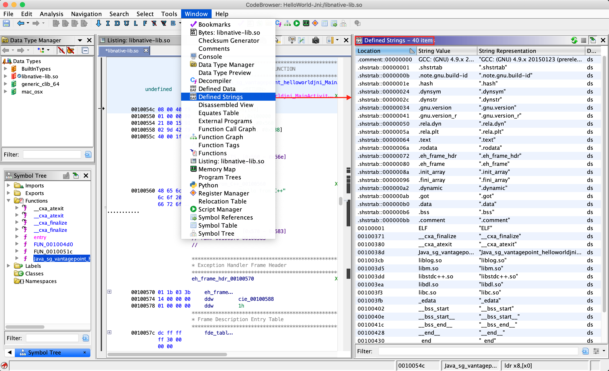

## Tampering and Reverse Engineering

Reverse engineering and tampering techniques have long belonged to the realm of crackers, modders, malware analysts, etc. For "traditional" security testers and researchers, reverse engineering has been more of a complementary skill. But the tides are turning: mobile app black-box testing increasingly requires disassembling compiled apps, applying patches, and tampering with binary code or even live processes. The fact that many mobile apps implement defenses against unwelcome tampering doesn't make things easier for security testers.

Reverse engineering a mobile app is the process of analyzing the compiled app to extract information about its source code. The goal of reverse engineering is *comprehending* the code.

*Tampering* is the process of changing a mobile app (either the compiled app or the running process) or its environment to affect its behavior. For example, an app might refuse to run on your rooted test device, making it impossible to run some of your tests. In such cases, you'll want to alter the app's behavior.

Mobile security testers are served well by understanding basic reverse engineering concepts. They should also know mobile devices and operating systems inside out: processor architecture, executable format, programming language intricacies, and so forth.

Reverse engineering is an art, and describing its every facet would fill a whole library. The sheer range of techniques and specializations is mind-blowing: one can spend years working on a very specific and isolated sub-problem, such as automating malware analysis or developing novel de-obfuscation methods. Security testers are generalists; to be effective reverse engineers, they must filter through the vast amount of relevant information.

There is no generic reverse engineering process that always works. That said, we'll describe commonly used methods and tools later in this guide, and give examples of tackling the most common defenses.

### Why You Need It

Mobile security testing requires at least basic reverse engineering skills for several reasons:

**1. To enable black-box testing of mobile apps.** Modern apps often include controls that will hinder dynamic analysis. SSL pinning and end-to-end (E2E) encryption sometimes prevent you from intercepting or manipulating traffic with a proxy. Root detection could prevent the app from running on a rooted device, preventing you from using advanced testing tools. You must be able to deactivate these defenses.

**2. To enhance static analysis in black-box security testing.** In a black-box test, static analysis of the app bytecode or binary code helps you understand the internal logic of the app. It also allows you to identify flaws such as hardcoded credentials.

**3. To assess resilience against reverse engineering.** Apps that implement the software protection measures listed in the Mobile Application Security Verification Standard Anti-Reversing Controls (MASVS-R) should withstand reverse engineering to a certain degree. To verify the effectiveness of such controls, the tester may perform a *resilience assessment* as part of the general security test. For the resilience assessment, the tester assumes the role of the reverse engineer and attempts to bypass defenses.

Before we dive into the world of mobile app reversing, we have some good news and some bad news. Let's start with the good news:

**Ultimately, the reverse engineer always wins.**

This is particularly true in the mobile industry, where the reverse engineer has a natural advantage: the way mobile apps are deployed and sandboxed is by design more restrictive than the deployment and sandboxing of classical Desktop apps, so including the rootkit-like defensive mechanisms often found in Windows software (e.g., DRM systems) is simply not feasible. The openness of Android makes allows reverse engineers to make favorable changes to the operating system, aiding the reverse engineering process. iOS gives reverse engineers less control, but defensive options are also more limited.

The bad news is that dealing with multi-threaded anti-debugging controls, cryptographic white-boxes, stealthy anti-tampering features, and highly complex control flow transformations is not for the faint-hearted. The most effective software protection schemes are proprietary and won't be beaten with standard tweaks and tricks. Defeating them requires tedious manual analysis, coding, frustration, and—depending on your personality—sleepless nights and strained relationships.

It's easy for beginners to get overwhelmed by the sheer scope of reversing. The best way to get started is to set up some basic tools (see the relevant sections in the Android and iOS reversing chapters) and start with simple reversing tasks and crackmes. You'll need to learn about the assembler/bytecode language, the operating system, obfuscations you encounter, and so on. Start with simple tasks and gradually level up to more difficult ones.

In the following section. we'll give an overview of the techniques most commonly used in mobile app security testing. In later chapters, we'll drill down into OS-specific details of both Android and iOS.

### Basic Tampering Techniques

#### Binary Patching

*Patching* is the process of changing the compiled app, e.g., changing code in binary executables, modifying Java bytecode, or tampering with resources. This process is known as *modding* in the mobile game hacking scene. Patches can be applied in many ways, including editing binary files in a hex editor and decompiling, editing, and re-assembling an app. We'll give detailed examples of useful patches in later chapters.

Keep in mind that modern mobile operating systems strictly enforce code signing, so running modified apps is not as straightforward as it used to be in desktop environments. Security experts had a much easier life in the 90s! Fortunately, patching is not very difficult if you work on your own device—you simply have to re-sign the app or disable the default code signature verification facilities to run modified code.

#### Code Injection

Code injection is a very powerful technique that allows you to explore and modify processes at run time. Injection can be implemented in various ways, but you'll get by without knowing all the details thanks to freely available, well-documented tools that automate the process. These tools give you direct access to process memory and important structures such as live objects instantiated by the app. They come with many utility functions that are useful for resolving loaded libraries, hooking methods and native functions, and more. Process memory tampering is more difficult to detect than file patching, so it is the preferred method in most cases.

Substrate, Frida, and Xposed are the most widely used hooking and code injection frameworks in the mobile industry. The three frameworks differ in design philosophy and implementation details: Substrate and Xposed focus on code injection and/or hooking, while Frida aims to be a full-blown "dynamic instrumentation framework", incorporating code injection, language bindings, and an injectable JavaScript VM and console.

However, you can also instrument apps with Substrate by using it to inject Cycript, the programming environment (aka "Cycript-to-JavaScript" compiler) authored by Saurik of Cydia fame. To complicate things even more, Frida's authors also created a fork of Cycript called ["frida-cycript"](https://github.com/nowsecure/frida-cycript "Cycript fork powered by Frida"). It replaces Cycript's runtime with a Frida-based runtime called Mjølner. This enables Cycript to run on all the platforms and architectures maintained by frida-core (if you are confused at this point, don't worry). The release of frida-cycript was accompanied by a blog post by Frida's developer Ole titled "Cycript on Steroids", a title that [Saurik wasn't very fond of](https://www.reddit.com/r/ReverseEngineering/comments/50uweq/cycript_on_steroids_pumping_up_portability_and/ "Cycript on steroids: Pumping up portability and performance with Frida").

We'll include examples of all three frameworks. We recommend starting with Frida because it is the most versatile of the three (for this reason, we'll also include more Frida details and examples). Notably, Frida can inject a JavaScript VM into a process on both Android and iOS, while Cycript injection with Substrate only works on iOS. Ultimately, however, you can of course achieve many of the same goals with either framework.

##### Frida

[Frida](https://www.frida.re "Frida") is a free and open source dynamic code instrumentation toolkit written in Vala by Ole André Vadla Ravnås that works by injecting a JavaScript engine ([Duktape](https://duktape.org/ "Duktape JavaScript Engine") and [V8](https://v8.dev/docs "V8 JavaScript Engine")) into the instrumented process. Frida lets you execute snippets of JavaScript into native apps on Android and iOS (as well as on [other platforms](https://www.frida.re/docs/home/ "So what is Frida, exactly?")).

Code can be injected in several ways. For example, Xposed permanently modifies the Android app loader, providing hooks for running your own code every time a new process is started.
In contrast, Frida implements code injection by writing code directly into process memory. When attached to a running app:

- Frida uses ptrace to hijack a thread of a running process. This thread is used to allocate a chunk of memory and populate it with a mini-bootstrapper.
- The bootstrapper starts a fresh thread, connects to the Frida debugging server that's running on the device, and loads a shared library that contains the Frida agent (`frida-agent.so`).
- The agent establishes a bi-directional communication channel back to the tool (e.g. the Frida REPL or your custom Python script).
- The hijacked thread resumes after being restored to its original state, and process execution continues as usual.


*Frida Architecture, source: [https://www.frida.re/docs/hacking/](https://www.frida.re/docs/hacking "Frida - Hacking")*

Frida offers three modes of operation:

1. Injected: this is the most common scenario when frida-server is running as a daemon in the iOS or Android device. frida-core is exposed over TCP, listening on localhost:27042 by default. Running in this mode is not possible on devices that are not rooted or jailbroken.
2. Embedded: this is the case when your device is not rooted nor jailbroken (you cannot use ptrace as an unprivileged user), you're responsible for the injection of the [frida-gadget](https://www.frida.re/docs/gadget/ "Frida Gadget") library by embedding it into your app.
3. Preloaded: similar to `LD_PRELOAD` or `DYLD_INSERT_LIBRARIES`. You can configure the frida-gadget to run autonomously and load a script from the filesystem (e.g. path relative to where the Gadget binary resides).

Independently of the chosen mode, you can make use of the [Frida JavaScript APIs](https://www.frida.re/docs/javascript-api/ "Frida JavaScript APIs") to interact with the running process and its memory. Some of the fundamental APIs are:

- [Interceptor](https://www.frida.re/docs/javascript-api/#interceptor "Interceptor"): When using the Interceptor API, Frida injects a trampoline (aka in-line hooking) at the function prologue which provokes a redirection to our custom code, executes our code, and returns to the original function. Note that while very effective for our purpose, this introduces a considerable overhead (due to the trampoline related jumping and context switching) and cannot be considered transparent as it overwrites the original code and acts similar to a debugger (putting breakpoints) and therefore can be detected in a similar manner, e.g. by applications that periodically checksum their own code.
- [Stalker](https://www.frida.re/docs/javascript-api/#stalker "Stalker"): If your tracing requirements include transparency, performance and high granularity, Stalker should be your API of choice. When tracing code with the Stalker API, Frida leverages just-in-time dynamic recompilation (by using [Capstone](http://www.capstone-engine.org/ "Capstone")): when a thread is about to execute its next instructions, Stalker allocates some memory, copies the original code over, and interlaces the copy with your custom code for instrumentation. Finally, it executes the copy (leaving the original code untouched, and therefore avoiding any anti-debugging checks). This approach increases instrumentation performance considerably and allows for very high granularity when tracing (e.g. by tracing exclusively CALL or RET instructions). You can learn more in-depth details in [the blog post "Anatomy of a code tracer" by Frida's creator Ole](https://medium.com/@oleavr/anatomy-of-a-code-tracer-b081aadb0df8 "Anatomy of a code tracer") [#vadla]. Some examples of use for Stalker are, for example [who-does-it-call](https://codeshare.frida.re/@oleavr/who-does-it-call/ "who-does-it-call") or [diff-calls](https://github.com/frida/frida-presentations/blob/master/R2Con2017/01-basics/02-diff-calls.js "diff-calls").
- [Java](https://www.frida.re/docs/javascript-api/#java "Java"): When working on Android you can use this API to enumerate loaded classes, enumerate class loaders, create and use specific class instances, enumerate live instances of classes by scanning the heap, etc.
- [ObjC](https://www.frida.re/docs/javascript-api/#objc "ObjC"): When working on iOS you can use this API to get a mapping of all registered classes, register or use specific class or protocol instances, enumerate live instances of classes by scanning the heap, etc.

Frida also provides a couple of simple tools built on top of the Frida API and available right from your terminal after installing frida-tools via pip. For instance:

- You can use the [Frida CLI](https://www.frida.re/docs/frida-cli/ "Frida CLI") (`frida`) for quick script prototyping and try/error scenarios.
- [`frida-ps`](https://www.frida.re/docs/frida-ps/ "frida-ps") to obtain a list of all apps (or processes) running on the device including their names and PDIs.
- [`frida-ls-devices`](https://www.frida.re/docs/frida-ls-devices/ "frida-ls-devices") to list your connected devices;
- [`frida-trace`](https://www.frida.re/docs/frida-trace/ "frida-trace") to quickly trace methods that are part of an iOS app or that are implemented inside an Android native library.

In addition, you'll also find several open source Frida-based tools, such as:

- [Passionfruit](https://github.com/chaitin/passionfruit "Passionfruit"): an iOS app blackbox assessment tool.
- [Fridump](https://github.com/Nightbringer21/fridump "fridump"): a memory dumping tool for both Android and iOS.
- [Objection](https://github.com/sensepost/objection "objection"): a runtime mobile security assessment framework.
- [r2frida](https://github.com/nowsecure/r2frida "r2frida"): a project merging the powerful reverse engineering capabilities of radare2 with the dynamic instrumentation toolkit of Frida.

We will be using all of these tools throughout the guide.

You can use these tools as-is, tweak them to your needs, or take as excellent examples on how to use the APIs. Having them as an example is very helpful when you write your own hooking scripts or when you build introspection tools to support your reverse engineering workflow.

One more thing to mention is the Frida CodeShare project (<https://codeshare.frida.re>). It contains a collection of ready-to-run Frida scripts which can enormously help when performing concrete tasks both on Android as on iOS as well as also serve as inspiration to build your own scripts. Two representative examples are:

- Universal Android SSL Pinning Bypass with Frida - <https://codeshare.frida.re/@pcipolloni/universal-android-ssl-pinning-bypass-with-frida/>
- ObjC method observer - <https://codeshare.frida.re/@mrmacete/objc-method-observer/>

Using them is as simple as including the `--codeshare <handler>` flag and a handler when using the Frida CLI. For example, to use "ObjC method observer", enter the following:

```shell
$ frida --codeshare mrmacete/objc-method-observer -f YOUR_BINARY
```

### Static and Dynamic Binary Analysis

Reverse engineering is the process of reconstructing the semantics of a compiled program's source code. In other words, you take the program apart, run it, simulate parts of it, and do other unspeakable things to it to understand what it does and how.

#### Using Disassemblers and Decompilers

Disassemblers and decompilers allow you to translate an app's binary code or bytecode back into a more or less understandable format. By using these tools on native binaries, you can obtain assembler code that matches the architecture the app was compiled for. Disassemblers convert machine code to assembly code which in turn is used by decompilers to generate equivalent high-level language code. Android Java apps can be disassembled to smali, which is an assembly language for the DEX format used by Dalvik, Android's Java VM. Smali assembly can also be quite easily decompiled back to equivalent Java code. 

In theory, the mapping between assembly and machine code should be one-to-one, and therefore it may give the impression that disassembling is a simple task. But in practice, there are multiple pitfalls such as: 

- Reliably distinguish between code and data 
- Variable instruction size,
- Indirect branch instructions,
- Functions without explicit CALL sites within the executable's code segment,
- Position independent code (PIC) sequences, and
- Hand crafted assembly code.

In similar vain, decompilation is a very complicated process, involving many deterministic and heuristics based approaches. As a consequence, decompilation is not always accurate, but nevertheless very helpful in getting a quick understanding of the function being analyzed. Accuracy of decompilation depends on the amount of information available in the code being decompiled and the sophistication of the decompiler. It is always a good idea to keep cross-checking decompiled code against disassembled code for maximum accuracy. Many compilation and post-compilation tools introduce additional complexity to the compiled code in order to increase the difficulty of decompilation. Such codes are called as *obfuscated code*. 

Over the past decades many tools have perfected the process of disassembly and decompilation, producing output with high fidelity.  There are a wide range of tools and frameworks available for disassembling and decompiling binaries: commercial tools, open source tools, reverse engineering frameworks, etc. Advanced usage instructions for any of these tools can often easily fill a book of their own. The best way to get started is to simply pick a tool that fits your needs and budget and buy a well-reviewed user guide. In this section we will provide an introduction to one such tools and in the subsequent "Reverse Engineering and Tampering" chapter we'll list and introduce some of the other more popular tools for each operating system.


##### Ghidra

Ghidra is an open source software reverse engineering (SRE) suite of tools developed by United State of America's National Security Agency's (NSA) Research Directorate. Ghidra is a versatile tool which comprises of a disassembler, decompiler and an inbuilt scripting engine for advance usage. Please refer to the [installation guide](https://ghidra-sre.org/InstallationGuide.html "Ghidra Installation Guide") on how to install it and also look at the [cheat sheet](https://ghidra-sre.org/CheatSheet.html "Cheat Sheet") for a first overview of available commands and shortcuts. In this section we will have walk-through on how to create a project, view disassembly and decompiled code for a binary.

Start Ghidra using `ghidraRun` (\*nix) or `ghidraRun.bat` (Windows), depending on the platform you are on. Once Ghidra is fired up, create a new project by specifying the project directory. You will be greeted by a window as shown below:  


In your new **Active Project** you can import an app binary by going to **File** -> **Import File** and choosing the desired file.


If the file can be properly processed, Ghidra will show meta-information about the binary before starting the analysis.


To get the disassembled code for the binary file chosen above, double click the imported file from the **Active Project** window. Click **yes** and **analyze** for auto-analysis on the subsequent windows. Auto-analysis will take some time depending on the size of the binary, the progress can be tracked in the bottom right corner of the code browser window. Once auto-analysis is completed you can start exploring the binary.  


The most important windows to explore a binary in Ghidra are the **Listing** (Disassembly) window, the **Symbol Tree** window and the **Decompiler** window, which shows the decompiled version of the function selected for disassembly. The **Display Function Graph** option shows control flow graph of the selected function. 


There are many other functionalities available in Ghidra and most of them can be explored by opening the **Window** menu. For example, if you want to examine the strings present in the binary, open the **Defined Strings** option. Other advance functionalities we will discuss while analyzing various binaries for Android and iOS platforms in the coming chapters. 




#### Debugging and Tracing

In the traditional sense, debugging is the process of identifying and isolating problems in a program as part of the software development life cycle. The same tools used for debugging are valuable to reverse engineers even when identifying bugs is not the primary goal. Debuggers enable program suspension at any point during run time, inspection of the process' internal state, and even register and memory modification. These abilities simplify program inspection.

*Debugging* usually means interactive debugging sessions in which a debugger is attached to the running process. In contrast, *tracing* refers to passive logging of information about the app's execution (such as API calls). Tracing can be done in several ways, including debugging APIs, function hooks, and Kernel tracing facilities. Again, we'll cover many of these techniques in the OS-specific "Reverse Engineering and Tampering" chapters.

### Advanced Techniques

For more complicated tasks, such as de-obfuscating heavily obfuscated binaries, you won't get far without automating certain parts of the analysis. For example, understanding and simplifying a complex control flow graph based on manual analysis in the disassembler would take you years (and most likely drive you mad long before you're done). Instead, you can augment your workflow with custom made tools. Fortunately, modern disassemblers come with scripting and extension APIs, and many useful extensions are available for popular disassemblers. There are also open source disassembling engines and binary analysis frameworks.

As always in hacking, the anything-goes rule applies: simply use whatever is most efficient. Every binary is different, and all reverse engineers have their own style. Often, the best way to achieve your goal is to combine approaches (such as emulator-based tracing and symbolic execution). To get started, pick a good disassembler and/or reverse engineering framework, then get comfortable with their particular features and extension APIs. Ultimately, the best way to get better is to get hands-on experience.

#### Dynamic Binary Instrumentation

Another useful approach for native binaries is dynamic binary instrumentations (DBI). Instrumentation frameworks such as Valgrind and PIN support fine-grained instruction-level tracing of single processes. This is accomplished by inserting dynamically generated code at run time. Valgrind compiles fine on Android, and pre-built binaries are available for download.

The [Valgrind README](http://valgrind.org/docs/manual/dist.readme-android.html "Valgrind README") includes specific compilation instructions for Android.

#### Emulation-based Dynamic Analysis

Running an app in the emulator gives you powerful ways to monitor and manipulate its environment. For some reverse engineering tasks, especially those that require low-level instruction tracing, emulation is the best (or only) choice. Unfortunately, this type of analysis is only viable for Android, because no emulator exists for iOS (the iOS simulator is not an emulator, and apps compiled for an iOS device don't run on it). We'll provide an overview of popular emulation-based analysis frameworks for Android in the "Tampering and Reverse Engineering on Android" chapter.

<br/>
<br/>

#### Custom Tooling with Reverse Engineering Frameworks

Even though most professional GUI-based disassemblers feature scripting facilities and extensibility, they are simply not well-suited to solving particular problems. Reverse engineering frameworks allow you to perform and automate any kind of reversing task without depending on a heavy-weight GUI. Notably, most reversing frameworks are open source and/or available for free. Popular frameworks with support for mobile architectures include [Radare2](https://github.com/radare/radare2 "radare2") and [Angr](https://github.com/angr/angr "Angr").

##### Example: Program Analysis with Symbolic/Concolic Execution

In the late 2000s, testing based on symbolic execution has become a popular way to identify security vulnerabilities. Symbolic "execution" actually refers to the process of representing possible paths through a program as formulas in first-order logic. Satisfiability Modulo Theories (SMT) solvers are used to check the satisfiability of these formulas and provide solutions, including concrete values of the variables needed to reach a certain point of execution on the path corresponding to the solved formula.

Typically, symbolic execution is combined with other techniques such as dynamic execution to mitigate the path explosion problem specific to classical symbolic execution. This combination of concrete (actual) and symbolic execution is referred to as *concolic execution* (the name concolic stems from *conc*rete and symb*olic*. Together with improved SMT solvers and current hardware speeds, concolic execution allows to explore paths in medium-size software modules (i.e., on the order of 10s KLOC). However, it also comes in handy for supporting de-obfuscation tasks, such as simplifying control flow graphs. For example, Jonathan Salwan and Romain Thomas have [shown how to reverse engineer VM-based software protections using Dynamic Symbolic Execution](https://triton.quarkslab.com/files/csaw2016-sos-rthomas-jsalwan.pdf "Jonathan Salwan and Romain Thomas: How Triton can help to reverse virtual machine based software protections") (i.e., using a mix of actual execution traces, simulation, and symbolic execution).

In the Android section, you'll find a walkthrough for cracking a simple license check in an Android application using symbolic execution.

### References

- [#vadla] Ole André Vadla Ravnås, Anatomy of a code tracer - <https://medium.com/@oleavr/anatomy-of-a-code-tracer-b081aadb0df8>

#### OWASP Mobile Top 10 2016

- M9 - Reverse Engineering - <https://www.owasp.org/index.php/Mobile_Top_10_2016-M9-Reverse_Engineering>

#### Tools

- Angr - <https://github.com/angr/angr>
- Cycript - <http://www.cycript.org/>
- Frida - <https://www.frida.re/>
- Frida CLI - <https://www.frida.re/docs/frida-cli/>
- frida-ls-devices - <https://www.frida.re/docs/frida-ls-devices/>
- frida-ps - <https://www.frida.re/docs/frida-ps/>
- frida-trace - <https://www.frida.re/docs/frida-trace/>
- Fridump - <https://github.com/Nightbringer21/fridump>
- Objection - <https://github.com/sensepost/objection>
- Passionfruit - <https://github.com/chaitin/passionfruit>
- r2frida - <https://github.com/nowsecure/r2frida>
- Radare2 - <https://github.com/radare/radare2>
- Substrate - <http://www.cydiasubstrate.com/>
- Xposed - <https://www.xda-developers.com/xposed-framework-hub/>
