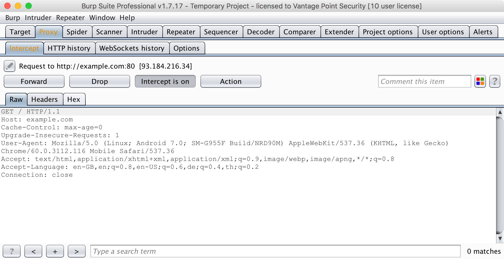

## Testing Network Communication

Practically every network-connected mobile app uses the Hypertext Transfer Protocol (HTTP) or HTTP over Transport Layer Security (TLS), HTTPS, to send and receive data to and from remote endpoints. Consequently, network-based attacks (such as packet sniffing and man-in-the-middle-attacks) are a problem. In this chapter we discuss potential vulnerabilities, testing techniques, and best practices concerning the network communication between mobile apps and their endpoints.

### Intercepting HTTP(S) Traffic

In many cases, it is most practical to configure a system proxy on the mobile device, so that HTTP(S) traffic is redirected through an *interception proxy* running on your host machine. By monitoring the requests between the mobile app client and the backend, you can easily map the available server-side APIs and gain insight into the communication protocol. Additionally, you can replay and manipulate requests to test for server-side bugs.

Several free and commercial proxy tools are available. Here are some of the most popular:

- [Burp Suite](https://portswigger.net/burp)
- [OWASP ZAP](https://www.owasp.org/index.php/OWASP_Zed_Attack_Proxy_Project)
- [Charles Proxy](https://www.charlesproxy.com)

To use the interception proxy, you'll need run it on your PC/MAC and configure the mobile app to route HTTP(S) requests to your proxy. In most cases, it is enough to set a system-wide proxy in the network settings of the mobile device - if the app uses standard HTTP APIs or popular libraries such as `okhttp`, it will automatically use the system settings.

Using a proxy breaks SSL certificate verification and the app will usually fail to initiate TLS connections. To work around this issue, you can install your proxy's CA certificate on the device. We'll explain how to do this in the OS-specific "Basic Security Testing" chapters.



### Intercepting Traffic on the Network Layer

Dynamic analysis by using an interception proxy can be straight forward if standard libraries are used in the app and all communication is done via HTTP. But there are several cases where this is not working:

- If mobile application development platforms like [Xamarin](https://www.xamarin.com/platform "Xamarin") are used that ignore the system proxy settings;
-	If mobile applications verify if the system proxy is used and refuse to send requests through a proxy;
- If you want to intercept push notifications, like for example GCM/FCM on Android;
- If XMPP or other non-HTTP protocols are used.

In these cases you need to monitor and analyze the network traffic first in order to decide what to do next. Luckily, there are several options for redirecting and intercepting network communication:

- Route the traffic through the host machine. You can set up your Mac/PC as the network gateway, e.g. by using the built-in Internet Sharing facilities of your operating system. You can then use [Wireshark](https://www.wireshark.org) to sniff any Internet-bound traffic from the mobile device;

- Use [ettercap](https://ettercap.github.io/ettercap/ "Ettercap") to redirect network traffic from the mobile device to your host machine (see below);

- On a rooted device, you can use hooking or code injection to intercept network-related API calls (e.g. HTTP requests) and dump or even manipulate the arguments of these calls. This eliminates the need to inspect the actual network data. We'll talk in more detail about these techniques in the "Reverse Engineering and Tampering" chapters;

- On iOS, you can create a "Remote Virtual Interface" instead. We'll describe this method in the chapter "Basic Security Testing on iOS".

#### Simulating a Man-in-the-Middle Attack

[Ettercap](https://ettercap.github.io/ettercap/ "Ettercap") can be used during network penetration tests in order to simulate a man-in-the-middle attack. This is achieved by executing [ARP poisoning or spoofing](https://en.wikipedia.org/wiki/ARP_spoofing "ARP poisoning/spoofing") to the target machines. When such an attack is successful, all packets between two machines are redirected to a third machine that acts as the man-in-the-middle and is able to intercept the traffic for analysis.

For a full dynamic analysis of a mobile app, all network traffic should be intercepted. To be able to intercept the messages several steps should be considered for preparation.

**Ettercap Installation**

Ettercap is available for all major Linux and Unix operating systems and should be part of their respective package installation mechanisms. You need to install it on your machine that will act as the MITM. On macOS it can be installed by using brew.

```bash
$ brew install ettercap
```

Ettercap can also be installed through `apt-get` on Debian based linux distributions.

```bash
sudo apt-get install zlib1g zlib1g-dev
sudo apt-get install build-essential
sudo apt-get install ettercap
```

**Network Analyzer Tool**

Install a tool that allows you to monitor and analyze the network traffic that will be redirected to your machine. The two most common network monitoring (or capturing) tools are:

- [Wireshark](https://www.wireshark.org "Wireshark") (CLI pendant: [tshark](https://www.wireshark.org/docs/man-pages/tshark.html "TShark")) and
- [tcpdump](http://www.tcpdump.org/tcpdump_man.html "tcpdump")

Wireshark offers a GUI and is more straightforward if you are not used to the command line. If you are looking for a command line tool you should either use TShark or tcpdump. All of these tools are available for all major Linux and Unix operating systems and should be part of their respective package installation mechanisms.

**Network Setup**

To be able to get a man-in-the-middle position your machine should be in the same wireless network as the mobile phone and the gateway it communicates to. Once this is done you need the following information:

- IP address of mobile phone
- IP address of gateway

#### ARP Poisoning with Ettercap

Start ettercap with the following command and replace the first IP addresses with the network gateway in the wireless network and the second one with the one of your mobile device.

```bash
$ sudo ettercap -T -i en0 -M arp:remote /192.168.0.1// /192.168.0.105//
```

On the mobile phone start the browser and navigate to example.com, you should see output like the following:

```bash
ettercap 0.8.2 copyright 2001-2015 Ettercap Development Team

Listening on:
   en0 -> AC:BC:32:81:45:05
	  192.168.0.105/255.255.255.0
	  fe80::c2a:e80c:5108:f4d3/64

SSL dissection needs a valid 'redir_command_on' script in the etter.conf file
Privileges dropped to EUID 65534 EGID 65534...

  33 plugins
  42 protocol dissectors
  57 ports monitored
20388 mac vendor fingerprint
1766 tcp OS fingerprint
2182 known services

Scanning for merged targets (2 hosts)...

* |=========================================>| 100.00 %

2 hosts added to the hosts list...

ARP poisoning victims:

 GROUP 1 : 192.168.0.1 F8:E9:03:C7:D5:10

 GROUP 2 : 192.168.0.102 20:82:C0:DE:8F:09
Starting Unified sniffing...

Text only Interface activated...
Hit 'h' for inline help

Sun Jul  9 22:23:05 2017 [855399]
  :::0 --> ff02::1:ff11:998b:0 | SFR (0)


Sun Jul  9 22:23:10 2017 [736653]
TCP  172.217.26.78:443 --> 192.168.0.102:34127 | R (0)

Sun Jul  9 22:23:10 2017 [737483]
TCP  74.125.68.95:443 --> 192.168.0.102:35354 | R (0)
```

If that's the case, you are now able to see the complete network traffic that is sent and received by the mobile phone. This includes also DNS, DHCP and any other form of communication and can therefore be quite "noisy". You should therefore know how to use [DisplayFilters in Wireshark](https://wiki.wireshark.org/DisplayFilters "DisplayFilters") or know [how to filter in tcpdump](https://danielmiessler.com/study/tcpdump/#gs.OVQjKbk "A tcpdump Tutorial and Primer with Examples") to focus only on the relevant traffic for you.

> Man-in-the-middle attacks work against any device and operating system as the attack is executed on OSI Layer 2 through ARP Spoofing. When you are MITM you might not be able to see clear text data, as the data in transit might be encrypted by using TLS, but it will give you valuable information about the hosts involved, the protocols used and the ports the app is communicating with.

As an example, we will now redirect all requests from a Xamarin app to our interception proxy in the next section.

#### Span Port / Port Forwarding

As an alternative to a MITM attack with ettercap, a Wifi Access Point (AP) or router can also be used instead. The setup requires access to the configuration of the AP and this should be clarified prior to the engagement. If it's possible to reconfigure you should check first if the AP supports either:

- port forwarding or
- has a span or mirror port.

In both scenarios the AP needs to be configured to point to your machines IP. Tools like Wireshark can then again be used to monitor and record the traffic for further investigation.

#### Setting a Proxy Through Runtime Instrumentation

On a rooted or jailbroken device, you can also use runtime hooking to set a new proxy or redirect network traffic. This can be achieved with hooking tools like [Inspeckage](https://github.com/ac-pm/Inspeckage) or code injection frameworks like [frida](https://www.frida.re) and [cycript](http://www.cycript.org). You'll find more information about runtime instrumentation in the "Reverse Engineering and Tampering" chapters of this guide.

#### Example: Dealing with Xamarin

Xamarin is a mobile application development platform that is capable of producing [native Android](https://developer.xamarin.com/guides/android/getting_started/ "Getting Started with Android") and [iOS apps](https://developer.xamarin.com/guides/ios/ "Getting Started with iOS") by using Visual Studio and C# as programming language.

When testing a Xamarin app and when you are trying to set the system proxy in the WiFi settings you won't be able to see any HTTP requests in your interception proxy, as the apps created by Xamarin do not use the local proxy settings of your phone. There are two ways to resolve this:

- Add a [default proxy to the app](https://developer.xamarin.com/api/type/System.Net.WebProxy/ "System.Net.WebProxy Class"), by adding the following code in the `OnCreate()` or `Main()` method and re-create the app:

```
WebRequest.DefaultWebProxy = new WebProxy("192.168.11.1", 8080);
```

- Use ettercap in order to get a man-in-the-middle position (MITM), see the section above about how to setup a MITM attack. When being MITM we only need to redirect port 443 to our interception proxy running on localhost. This can be done by using the command `rdr` on macOS:

```bash
$ echo "
rdr pass inet proto tcp from any to any port 443 -> 127.0.0.1 port 8080
" | sudo pfctl -ef -
```

The interception proxy need to listen to the port specified in the port forwarding rule above, which is 8080

**CA Certificates**

If not already done, install the CA certificates in your mobile device which will allow us to intercept HTTPS requests:

- [Install the CA certificate of your interception proxy into your Android phone](https://support.portswigger.net/customer/portal/articles/1841102-installing-burp-s-ca-certificate-in-an-android-device "Installing Burp's CA Certificate in an Android Device").
- [Install the CA certificate of your interception proxy into your iOS phone](https://support.portswigger.net/customer/portal/articles/1841108-configuring-an-ios-device-to-work-with-burp "Configuring an iOS Device to Work With Burp")

**Intercepting Traffic**

Start using the app and trigger it's functions. You should see HTTP messages showing up in your interception proxy.

> When using ettercap you need to activate "Support invisible proxying" in Proxy Tab / Options / Edit Interface

### Verifying Data Encryption on the Network

#### Overview

One of the core mobile app functions is sending/receiving data over untrusted networks like the Internet. If the data is not properly protected in transit, an attacker with access to any part of the network infrastructure (e.g., a Wi-Fi access point) may intercept, read, or modify it. This is why plaintext network protocols are rarely advisable.

The vast majority of apps rely on HTTP for communication with the backend. HTTPS wraps HTTP in an encrypted connection (the acronym HTTPS originally referred to HTTP over Secure Socket Layer (SSL); SSL is the deprecated predecessor of TLS). TLS allows authentication of the backend service and ensures confidentiality and integrity of the network data.

##### Recommended TLS Settings

Ensuring proper TLS configuration on the server side is also important. SSL is deprecated and should no longer be used. TLS v1.2 and v1.3 are considered secure, but many services still allow TLS v1.0 and v1.1 for compatibility with older clients.

When both the client and server are controlled by the same organization and used only for communicating with one another, you can increase security by [hardening the configuration](https://dev.ssllabs.com/projects/best-practices/ "Qualys SSL/TLS Deployment Best Practices").

If a mobile application connects to a specific server, its networking stack can be tuned to ensure the highest possible security level for the server's configuration. Lack of support in the underlying operating system may force the mobile application to use a weaker configuration.

For example, the popular Android networking library okhttp uses the following preferred set of cipher suites, but these are only available on Android versions 7.0 and later:

- `TLS_ECDHE_ECDSA_WITH_AES_128_GCM_SHA256`
- `TLS_ECDHE_RSA_WITH_AES_128_GCM_SHA256`
- `TLS_ECDHE_ECDSA_WITH_AES_256_GCM_SHA384`
- `TLS_ECDHE_RSA_WITH_AES_256_GCM_SHA384`
- `TLS_ECDHE_ECDSA_WITH_CHACHA20_POLY1305_SHA256`
- `TLS_ECDHE_RSA_WITH_CHACHA20_POLY1305_SHA256`

To support earlier versions of Android, it adds a few ciphers that are considered less secure, for example, `TLS_RSA_WITH_3DES_EDE_CBC_SHA`.

Similarly, the iOS ATS (App Transport Security) configuration requires one of the following ciphers:

- `TLS_ECDHE_ECDSA_WITH_AES_256_GCM_SHA384`
- `TLS_ECDHE_ECDSA_WITH_AES_128_GCM_SHA256`
- `TLS_ECDHE_ECDSA_WITH_AES_256_CBC_SHA384`
- `TLS_ECDHE_ECDSA_WITH_AES_256_CBC_SHA`
- `TLS_ECDHE_ECDSA_WITH_AES_128_CBC_SHA256`
- `TLS_ECDHE_ECDSA_WITH_AES_128_CBC_SHA`
- `TLS_ECDHE_RSA_WITH_AES_256_GCM_SHA384`
- `TLS_ECDHE_RSA_WITH_AES_128_GCM_SHA256`
- `TLS_ECDHE_RSA_WITH_AES_256_CBC_SHA384`
- `TLS_ECDHE_RSA_WITH_AES_128_CBC_SHA256`
- `TLS_ECDHE_RSA_WITH_AES_128_CBC_SHA`

#### Static Analysis

Identify all API/web service requests in the source code and ensure that no plain HTTP URLs are requested. Make sure that sensitive information is sent over secure channels by using [HttpsURLConnection](https://developer.android.com/reference/javax/net/ssl/HttpsURLConnection.html "HttpsURLConnection") or [SSLSocket](https://developer.android.com/reference/javax/net/ssl/SSLSocket.html "SSLSocket") (for socket-level communication using TLS).

Be aware that `SSLSocket` **doesn't** verify the hostname. Use `getDefaultHostnameVerifier` to verify the hostname. The Android developer documentation includes a [code example](https://developer.android.com/training/articles/security-ssl.html#WarningsSslSocket "Warnings About Using SSLSocket Directly").

Verify that the server is configured according to best practices. See also the [OWASP Transport Layer Protection cheat sheet](https://www.owasp.org/index.php/Transport_Layer_Protection_Cheat_Sheet "Transport Layer Protection Cheat Sheet") and the [Qualys SSL/TLS Deployment Best Practices](https://dev.ssllabs.com/projects/best-practices/ "Qualys SSL/TLS Deployment Best Practices").

The configuration file of the web server or reverse proxy at which the HTTPS connection terminates is required for static analysis. See also the [OWASP Transport Layer Protection cheat sheet](https://www.owasp.org/index.php/Transport_Layer_Protection_Cheat_Sheet "Transport Layer Protection Cheat Sheet") and the [Qualys SSL/TLS Deployment Best Practices](https://dev.ssllabs.com/projects/best-practices/ "Qualys SSL/TLS Deployment Best Practices").

#### Dynamic Analysis

Intercept the tested app's incoming and outgoing network traffic and make sure that this traffic is encrypted. You can intercept network traffic in any of the following ways:

- Capture all HTTP and Websocket traffic with an interception proxy like [OWASP ZAP](https://security.secure.force.com/security/tools/webapp/zapandroidsetup "OWASP ZAP") or [Burp Suite Professional](https://support.portswigger.net/customer/portal/articles/1841101-configuring-an-android-device-to-work-with-burp "Configuring an Android device to work with Burp") and make sure all requests are made via HTTPS instead of HTTP.

Interception proxies like Burp and OWASP ZAP will show HTTP traffic only. You can, however, use Burp plugins such as [Burp-non-HTTP-Extension](https://github.com/summitt/Burp-Non-HTTP-Extension) and [mitm-relay](https://github.com/jrmdev/mitm_relay) to decode and visualize communication via XMPP and other protocols.

> Some applications may not work with proxies like Burp and ZAP because of Certificate Pinning. In such a scenario, please check "Testing Custom Certificate Stores and SSL Pinning". Tools like Vproxy can be used to redirect all HTTP(S) traffic to your machine to sniff and investigate it for unencrypted requests.

- Capture all network traffic with Tcpdump. Consider this when Burp or OWASP ZAP do not recognize protocols (e.g. XMPP). You can begin live capturing via the command:

```bash
adb shell "tcpdump -s 0 -w - | nc -l -p 1234"
adb forward tcp:1234 tcp:1234
```

You can display the captured traffic in a human-readable format with Wireshark. Figure out which protocols are used and whether they are unencrypted. Capturing all traffic (TCP and UDP) is important, so you should execute all functions of the tested application after you've intercepted it.


### Making Sure that Critical Operations Use Secure Communication Channels

#### Overview

For sensitive applications like banking apps, [OWASP MASVS](https://github.com/OWASP/owasp-masvs/blob/master/Document/0x03-Using_the_MASVS.md "The Mobile Application Security Verification Standard") introduces "Defense in Depth" verification levels. The critical operations (e.g., user enrollment and account recovery) of such applications are some of the most attractive targets to attackers. This requires implementation of advanced security controls, such as additional channels (e.g., SMS and e-mail) to confirm user actions.

#### Static Analysis

Review the code and identify the parts that refer to critical operations. Make sure that additional channels are used for such operation. The following are examples of additional verification channels:

- Token (e.g., RSA token, yubikey);
- Push notification (e.g., Google Prompt);
- SMS;
- E-mail;
- Data from another website you visited or scanned;
- Data from a physical letter or physical entry point (e.g., data you receive only after signing a document at a bank).

#### Dynamic Analysis

Identify all of the tested application's critical operations (e.g., user enrollment, account recovery, and money transfer). Ensure that each critical operation requires at least one additional channel (e.g., SMS, e-mail, or token). Make sure that directly calling the function bypasses usage of these channels.

#### Remediation

Make sure that critical operations enforce the use of at least one additional channel to confirm user actions. These channels must not be bypassed when executing critical operations. If you're going to implement an additional factor to verify the user's identity, consider [Infobip 2FA library](https://2-fa.github.io/libraries/android-library.html "Infobip 2FA library") or one-time passcodes (OTP) via [Google Authenticator](https://github.com/google/google-authenticator-android "Google Authenticator for Android").

### References

#### OWASP Mobile Top 10 2016
- M3 - Insecure Communication - https://www.owasp.org/index.php/Mobile_Top_10_2016-M3-Insecure_Communication

#### OWASP MASVS
- V5.1: "Data is encrypted on the network with TLS. The secure channel is used consistently throughout the app."
- V5.5: "The app doesn't rely on a single insecure communication channel (e-mail or SMS) for critical operations such as enrollment and account recovery."

#### CWE
- CWE-308 - Use of Single-factor Authentication
- CWE-319 - Cleartext Transmission of Sensitive Information

#### Tools

- Tcpdump - http://www.androidtcpdump.com/
- Wireshark - https://www.wireshark.org/
- OWASP ZAP - https://www.owasp.org/index.php/OWASP_Zed_Attack_Proxy_Project
- Burp Suite - https://portswigger.net/burp/
- Vproxy - https://github.com/B4rD4k/Vproxy
