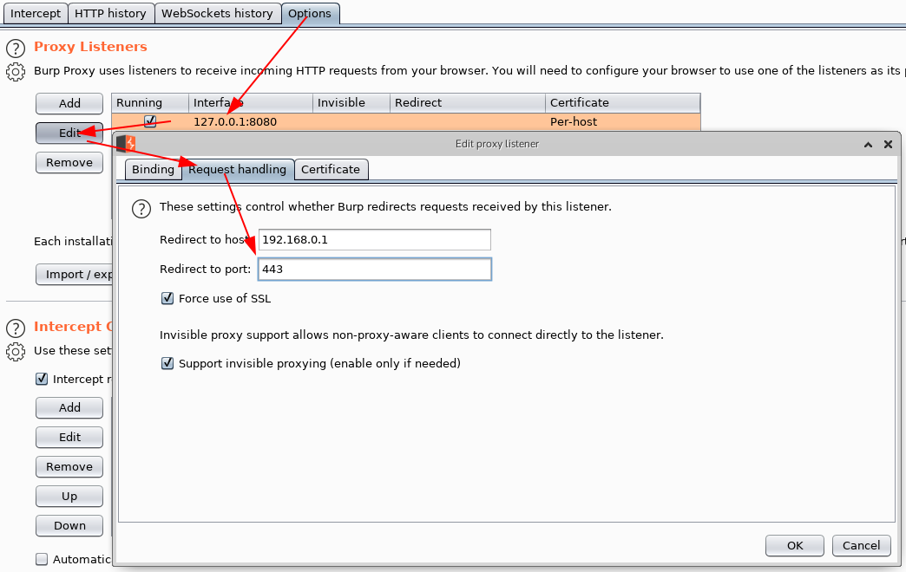

# Testing Network Communication

Practically every network-connected mobile app uses the Hypertext Transfer Protocol (HTTP) or HTTP over Transport Layer Security (TLS), HTTPS, to send and receive data to and from remote endpoints. Consequently, network-based attacks (such as packet sniffing and man-in-the-middle-attacks) are a problem. In this chapter we discuss potential vulnerabilities, testing techniques, and best practices concerning the network communication between mobile apps and their endpoints.

## Intercepting HTTP(S) Traffic

In many cases, it is most practical to configure a system proxy on the mobile device, so that HTTP(S) traffic is redirected through an *interception proxy* running on your host machine. By monitoring the requests between the mobile app client and the backend, you can easily map the available server-side APIs and gain insight into the communication protocol. Additionally, you can replay and manipulate requests to test for server-side vulnerabilities.

Several free and commercial proxy tools are available. Here are some of the most popular:

- [Burp Suite](https://portswigger.net/burp "Burp Suite")
- [OWASP ZAP](https://www.owasp.org/index.php/OWASP_Zed_Attack_Proxy_Project "OWASP ZAP")
- [Charles Proxy](https://www.charlesproxy.com "Charles Proxy")

To use the interception proxy, you'll need run it on your machine and configure the mobile app to route HTTP(S) requests to your proxy. In most cases, it is enough to set a system-wide proxy in the network settings of the mobile device - if the app uses standard HTTP APIs or popular libraries such as `okhttp`, it will automatically use the system settings.


Using a proxy breaks SSL certificate verification and the app will usually fail to initiate TLS connections. To work around this issue, you can install your proxy's CA certificate on the device. We'll explain how to do this in the OS-specific "Basic Security Testing" chapters.

## Burp plugins to Process Non-HTTP Traffic

Interception proxies such as Burp and OWASP ZAP won't show non-HTTP traffic, because they aren't capable of decoding it properly by default. There are, however, Burp plugins available such as:

- [Burp-non-HTTP-Extension](https://github.com/summitt/Burp-Non-HTTP-Extension "Burp-non-HTTP-Extension") and
- [Mitm-relay](https://github.com/jrmdev/mitm_relay "Mitm-relay").

These plugins can visualize non-HTTP protocols and you will also be able to intercept and manipulate the traffic.

Note that this setup can sometimes become very tedious and is not as straightforward as testing HTTP.

## Intercepting Traffic on the Network Layer

Dynamic analysis by using an interception proxy can be straight forward if standard libraries are used in the app and all communication is done via HTTP. But there are several cases where this is not working:

- If mobile application development platforms like [Xamarin](https://www.xamarin.com/platform "Xamarin") are used that ignore the system proxy settings;
- If mobile applications verify if the system proxy is used and refuse to send requests through a proxy;
- If you want to intercept push notifications, like for example GCM/FCM on Android;
- If XMPP or other non-HTTP protocols are used.

In these cases you need to monitor and analyze the network traffic first in order to decide what to do next. Luckily, there are several options for redirecting and intercepting network communication:

- Route the traffic through the host machine. You can set up your machine as the network gateway, e.g. by using the built-in Internet Sharing facilities of your operating system. You can then use [Wireshark](https://www.wireshark.org "Wireshark") to sniff any traffic from the mobile device;

- Sometimes you need to execute a MITM attack to force the mobile device to talk to you. For this scenario you should consider [bettercap](https://github.com/bettercap/bettercap "bettercap") or use your own access point to redirect network traffic from the mobile device to your host machine (see below);

> bettercap is a powerful tool to execute MITM attacks and should be preferred nowadays, instead of ettercap. See also [Why another MITM tool?](https://www.bettercap.org/legacy/#why-another-mitm-tool "Why another MITM tool?") on the bettercap site.

- On a rooted device, you can use hooking or code injection to intercept network-related API calls (e.g. HTTP requests) and dump or even manipulate the arguments of these calls. This eliminates the need to inspect the actual network data. We'll talk in more detail about these techniques in the "Reverse Engineering and Tampering" chapters;

- On macOS, you can create a "Remote Virtual Interface" for sniffing all traffic on an iOS device. We'll describe this method in the chapter "Basic Security Testing on iOS".

### Simulating a Man-in-the-Middle Attack with bettercap

#### Network Setup

To be able to get a man-in-the-middle position your machine should be in the same wireless network as the mobile phone and the gateway it communicates to. Once this is done you need the IP address of your mobile phone.

[bettercap](https://github.com/bettercap/bettercap "bettercap") can be used during network penetration tests in order to simulate a man-in-the-middle (MITM) attack. This is achieved by executing [ARP poisoning or spoofing](https://en.wikipedia.org/wiki/ARP_spoofing "ARP poisoning/spoofing") to the target machines. When such an attack is successful, all packets between two machines are redirected to a third machine that acts as the man-in-the-middle and is able to intercept the traffic for analysis.

For a full dynamic analysis of a mobile app, all network traffic should be intercepted. To be able to intercept the messages several steps should be considered for preparation.

#### bettercap Installation

bettercap is available for all major Linux and Unix operating systems and should be part of their respective package installation mechanisms. You need to install it on your machine that will act as the MITM. On macOS it can be installed by using brew.

```bash
$ brew install bettercap
```

For Kali Linux you can install bettercap with `apt-get`:

```bash
$ apt-get update
$ apt-get install bettercap
```

There are installation instructions as well for Ubuntu Linux 18.04 on [LinuxHint](https://linuxhint.com/install-bettercap-on-ubuntu-18-04-and-use-the-events-stream/ "Install Bettercap on Ubuntu 18.04").

### ARP Poisoning with bettercap

Start your preferred network analyzer tool first, then start bettercap with the following command and replace the IP address below (X.X.X.X) with the target you want to execute the MITM attack against.

```bash
$ sudo bettercap -eval "set arp.spoof.targets X.X.X.X; arp.spoof on; set arp.spoof.internal true; set arp.spoof.fullduplex true;"
bettercap v2.22 (built for darwin amd64 with go1.12.1) [type 'help' for a list of commands]

[19:21:39] [sys.log] [inf] arp.spoof enabling forwarding
[19:21:39] [sys.log] [inf] arp.spoof arp spoofer started, probing 1 targets.
```

bettercap will then automatically send the packets to the network gateway in the (wireless) network and you are able to sniff the traffic. Beginning of 2019 support for [full duplex ARP spoofing](https://github.com/bettercap/bettercap/issues/426 "Full Duplex ARP Spoofing") was added to bettercap.

On the mobile phone start the browser and navigate to `http://example.com`, you should see output like the following when you are using Wireshark.


If that's the case, you are now able to see the complete network traffic that is sent and received by the mobile phone. This includes also DNS, DHCP and any other form of communication and can therefore be quite "noisy". You should therefore know how to use [DisplayFilters in Wireshark](https://wiki.wireshark.org/DisplayFilters "DisplayFilters") or know [how to filter in tcpdump](https://danielmiessler.com/study/tcpdump/#gs.OVQjKbk "A tcpdump Tutorial and Primer with Examples") to focus only on the relevant traffic for you.

> Man-in-the-middle attacks work against any device and operating system as the attack is executed on OSI Layer 2 through ARP Spoofing. When you are MITM you might not be able to see clear text data, as the data in transit might be encrypted by using TLS, but it will give you valuable information about the hosts involved, the protocols used and the ports the app is communicating with.

### Simulating a Man-in-the-Middle Attack with an access point

#### Network Setup

A simple way to simulate a man-in-the-middle (MITM) attack is to configure a network where all packets between the devices in scope and the target network are going through your machine. In a mobile penetration test, this can be achieved by using an access point the mobile devices and your machine are connected to. Your machine is then becoming a router and an access point.

Following scenarios are possible:

- Use your machine's built-in WiFi card as an access point and use your wired connection to connect to the target network.
- Use an external USB WiFi card as an access point and user your machine built-in WiFi to connect to the target network (can be vice-versa).
- Use a separate access point and redirect the traffic to your machine.

The scenario with an external USB WiFi card require that the card has the capability to create an access point. Additionally, you need to install some tools and/or configure the network to enforce a man-in-the-middle position (see below). You can verify if your WiFi card has AP capabilities by using the command `iwconfig` on Kali Linux:

```bash
$ iw list | grep AP
```

The scenario with a separate access point requires access to the configuration of the AP and you should check first if the AP supports either:

- port forwarding or
- has a span or mirror port.

In both cases the AP needs to be configured to point to your machines IP. Your machine must be connected to the AP (via wired connection or WiFi) and you need to have connection to the target network (can be the same connection as to the AP). Some additional configuration may be required on your machine to route traffic to the target network.

> If the separate access point belongs to the customer, all changes and configurations should be clarified prior to the engagement and a backup should be created, before making any changes.


#### Installation

The following procedure is setting up a man-in-the-middle position using an access point and an additional network interface:

Create a WiFi network either through a separate access point or through an external USB WiFi card or through the built-in card of your machine.

This can be done by using the built-in utilities on macOS. You can use [share the internet connection on Mac with other network users](https://support.apple.com/en-ke/guide/mac-help/mchlp1540/mac "Share the internet connection on Mac with other network users").

For all major Linux and Unix operating systems you need tools such as:

- hostapd
- dnsmasq
- iptables
- wpa_supplicant
- airmon-ng

For Kali Linux you can install these tools with `apt-get`:

```bash
$ apt-get update
$ apt-get install hostapd dnsmasq aircrack-ng
```

> iptables and wpa_supplicant are installed by default on Kali Linux.

In case of a separate access point, route the traffic to your machine. In case of an external USB WiFi card or built-in WiFi card the traffic is already available on your machine.

Route the incoming traffic coming from the WiFi to the additional network interface where the traffic can reach the target network. Additional network interface can be wired connection or other WiFi card, depending on your setup.

#### Configuration

We focus on the configuration files for Kali Linux. Following values need to be defined:

- wlan1 - id of the AP network interface (with AP capabilities),
- wlan0 - id of the target network interface (this can be wired interface or other WiFi card)
- 10.0.0.0/24 - IP addresses and mask of AP network

The following configuration files need to be changed and adjusted accordingly:

- hostapd.conf

    ```bash
    # Name of the WiFi interface we use
    interface=wlan1
    # Use the nl80211 driver
    driver=nl80211
    hw_mode=g
    channel=6
    wmm_enabled=1
    macaddr_acl=0
    auth_algs=1
    ignore_broadcast_ssid=0
    wpa=2
    wpa_key_mgmt=WPA-PSK
    rsn_pairwise=CCMP
    # Name of the AP network
    ssid=STM-AP
    # Password of the AP network
    wpa_passphrase=password
    ```

- wpa_supplicant.conf

    ```bash
    network={
        ssid="NAME_OF_THE_TARGET_NETWORK"
        psk="PASSWORD_OF_THE_TARGET_NETWORK"
    }
    ```

- dnsmasq.conf

    ```bash
    interface=wlan1
    dhcp-range=10.0.0.10,10.0.0.250,12h
    dhcp-option=3,10.0.0.1
    dhcp-option=6,10.0.0.1
    server=8.8.8.8
    log-queries
    log-dhcp
    listen-address=127.0.0.1
    ```

#### MITM Attack

To be able to get a man-in-the-middle position you need to run the above configuration. This can be done by using the following commands on Kali Linux:

```bash
# check if other process is not using WiFi interfaces
$ airmon-ng check kill
# configure IP address of the AP network interface
$ ifconfig wlan1 10.0.0.1 up
# start access point
$ hostapd hostapd.conf
# connect the target network interface
$ wpa_supplicant -B -i wlan0 -c wpa_supplicant.conf
# run DNS server
$ dnsmasq -C dnsmasq.conf -d
# enable routing
$ echo 1 > /proc/sys/net/ipv4/ip_forward
# iptables will NAT connections from AP network interface to the target network interface
$ iptables --flush
$ iptables --table nat --append POSTROUTING --out-interface wlan0 -j MASQUERADE
$ iptables --append FORWARD --in-interface wlan1 -j ACCEPT
$ iptables -t nat -A POSTROUTING -j MASQUERADE
```

Now you can connect your mobile devices to the access point.

### Network Analyzer Tool

Install a tool that allows you to monitor and analyze the network traffic that will be redirected to your machine. The two most common network monitoring (or capturing) tools are:

- [Wireshark](https://www.wireshark.org "Wireshark") (CLI pendant: [TShark](https://www.wireshark.org/docs/man-pages/tshark.html "TShark"))
- [tcpdump](https://www.tcpdump.org/tcpdump_man.html "tcpdump")

Wireshark offers a GUI and is more straightforward if you are not used to the command line. If you are looking for a command line tool you should either use TShark or tcpdump. All of these tools are available for all major Linux and Unix operating systems and should be part of their respective package installation mechanisms.

### Setting a Proxy Through Runtime Instrumentation

On a rooted or jailbroken device, you can also use runtime hooking to set a new proxy or redirect network traffic. This can be achieved with hooking tools like [Inspeckage](https://github.com/ac-pm/Inspeckage "Inspeckage") or code injection frameworks like [Frida](https://www.frida.re "Frida") and [cycript](http://www.cycript.org "cycript"). You'll find more information about runtime instrumentation in the "Reverse Engineering and Tampering" chapters of this guide.

### Example - Dealing with Xamarin

As an example, we will now redirect all requests from a Xamarin app to an interception proxy.

Xamarin is a mobile application development platform that is capable of producing [native Android](https://developer.xamarin.com/guides/android/getting_started/ "Getting Started with Android") and [iOS apps](https://developer.xamarin.com/guides/ios/ "Getting Started with iOS") by using Visual Studio and C# as programming language.

When testing a Xamarin app and when you are trying to set the system proxy in the Wi-Fi settings you won't be able to see any HTTP requests in your interception proxy, as the apps created by Xamarin do not use the local proxy settings of your phone. There are three ways to resolve this:

- 1st way: Add a [default proxy to the app](https://developer.xamarin.com/api/type/System.Net.WebProxy/ "System.Net.WebProxy Class"), by adding the following code in the `OnCreate` or `Main` method and re-create the app:

    ```cs
    WebRequest.DefaultWebProxy = new WebProxy("192.168.11.1", 8080);
    ```

- 2nd way: Use bettercap in order to get a man-in-the-middle position (MITM), see the section above about how to setup a MITM attack. When being MITM you only need to redirect port 443 to your interception proxy running on localhost. This can be done by using the command `rdr` on macOS:

    ```bash
    $ echo "
    rdr pass inet proto tcp from any to any port 443 -> 127.0.0.1 port 8080
    " | sudo pfctl -ef -
    ```

- For Linux systems you can use `iptables`:

    ```bash
    $ sudo iptables -t nat -A PREROUTING -p tcp --dport 443 -j DNAT --to-destination 127.0.0.1:8080
    ```

- As last step, you need to set the option 'Support invisible proxy' in the listener settings of Burp Suite.

- 3rd way: Instead of bettercap an alternative is tweaking the `/etc/hosts` on the mobile phone. Add an entry into `/etc/hosts` for the target domain and point it to the IP address of your intercepting proxy. This creates a similar situation of being MiTM as with bettercap and you need to redirect port 443 to the port which is used by your interception proxy. The redirection can be applied as mentioned above. Additionally, you need to redirect traffic from your interception proxy to the original location and port.

> When redirecting traffic you should create narrow rules to the domains and IPs in scope, to minimize noise and out-of-scope traffic.

The interception proxy need to listen to the port specified in the port forwarding rule above, which is 8080.

When a Xamarin app is configured to use a proxy (e.g. by using `WebRequest.DefaultWebProxy`) you need to specify where traffic should go next, after redirecting the traffic to your intercepting proxy. You need to redirect the traffic to the original location. The following procedure is setting up a redirection in Burp to the original location:

1. Go to **Proxy** tab and click on **Options**
2. Select and edit your listener from the list of proxy listeners.
3. Go to **Request handling** tab and set:

    - Redirect to host: provide original traffic location.
    - Redirect to port: provide original port location.
    - Set 'Force use of SSL' (when HTTPS is used) and set 'Support invisible proxy'.



<br/>
<br/>

#### CA Certificates

If not already done, install the CA certificates in your mobile device which will allow us to intercept HTTPS requests:

- [Install the CA certificate of your interception proxy into your Android phone](https://support.portswigger.net/customer/portal/articles/1841102-installing-burp-s-ca-certificate-in-an-android-device "Installing Burp\'s CA Certificate in an Android Device")
    > Note that starting with Android 7.0 (API level 24) the OS no longer trusts a user supplied CA certificate unless specified in the app. Bypassing this security measure will be addressed in the "Basic Security Testing" chapters.
- [Install the CA certificate of your interception proxy into your iOS phone](https://support.portswigger.net/customer/portal/articles/1841108-configuring-an-ios-device-to-work-with-burp "Configuring an iOS Device to Work With Burp")

#### Intercepting Traffic

Start using the app and trigger it's functions. You should see HTTP messages showing up in your interception proxy.

> When using bettercap you need to activate "Support invisible proxying" in Proxy Tab / Options / Edit Interface

## Verifying Data Encryption on the Network (MSTG-NETWORK-1 and MSTG-NETWORK-2)

### Overview

One of the core mobile app functions is sending/receiving data over untrusted networks like the Internet. If the data is not properly protected in transit, an attacker with access to any part of the network infrastructure (e.g., a Wi-Fi access point) may intercept, read, or modify it. This is why plaintext network protocols are rarely advisable.

The vast majority of apps rely on HTTP for communication with the backend. HTTPS wraps HTTP in an encrypted connection (the acronym HTTPS originally referred to HTTP over Secure Socket Layer (SSL); SSL is the deprecated predecessor of TLS). TLS allows authentication of the backend service and ensures confidentiality and integrity of the network data.

#### Recommended TLS Settings

Ensuring proper TLS configuration on the server side is also important. The SSL protocol is deprecated and should no longer be used.
Also TLS v1.0 and TLS v1.1 have [known vulnerabilities](https://portswigger.net/daily-swig/the-end-is-nigh-browser-makers-ditch-support-for-aging-tls-1-0-1-1-protocols "Browser-makers ditch support for aging TLS 1.0, 1.1 protocols") and their usage is deprecated in all major browsers by 2020.
TLS v1.2 and TLS v1.3 are considered best practice for secure transmission of data. Starting with Android 10 (API level 29) TLS v1.3 will be enabled by default for faster and secure communication. The [major change with TLS v1.3](https://developer.android.com/about/versions/10/behavior-changes-all#tls-1.3 "TLS 1.3 enabled by default") is that customizing cipher suites is no longer possible and that all of them are enabled when TLS v1.3 is enabled, whereas Zero Round Trip (0-RTT) mode isn't supported.

When both the client and server are controlled by the same organization and used only for communicating with one another, you can increase security by [hardening the configuration](https://dev.ssllabs.com/projects/best-practices/ "Qualys SSL/TLS Deployment Best Practices").

If a mobile application connects to a specific server, its networking stack can be tuned to ensure the highest possible security level for the server's configuration. Lack of support in the underlying operating system may force the mobile application to use a weaker configuration.

##### Cipher Suites Terminology

Cipher suites have the following structure:

- **Protocol_KeyExchangeAlgorithm_WITH_BlockCipher_IntegrityCheckAlgorithm**

This structure can be described as follows:

- The Protocol the cipher uses
- The key Exchange Algorithm used by the server and the client to authenticate during the TLS handshake
- The block cipher used to encrypt the message stream
- Integrity check algorithm used to authenticate messages

Example: `TLS_RSA_WITH_3DES_EDE_CBC_SHA`

In the example above the cipher suites uses:

- TLS as protocol
- RSA Asymmetric encryption for Authentication
- 3DES for Symmetric encryption with EDE_CBC mode
- SHA Hash algorithm for integrity

Note that in TLSv1.3 the KeyExchangeAlgorithm is not part of the cipher suite, instead it is determined during the TLS handshake.

In the following listing, we’ll present the different algorithms of each part of the cipher suite.

Protocols:

- `SSLv1`
- `SSLv2` - [RFC 6176](https://tools.ietf.org/html/rfc6176 "RFC 6176")
- `SSLv3` - [RFC 6101](https://tools.ietf.org/html/rfc6101 "RFC 6101")
- `TLSv1.0` - [RFC 2246](https://www.ietf.org/rfc/rfc2246 "RFC 2246")
- `TLSv1.1` - [RFC 4346](https://tools.ietf.org/html/rfc4346 "RFC 4346")
- `TLSv1.2` - [RFC 5246](https://tools.ietf.org/html/rfc5246 "RFC 5246")
- `TLSv1.3` - [RFC 8446](https://tools.ietf.org/html/rfc8446 "RFC 8446")

Key Exchange Algorithms:

- `DSA` - [RFC 6979](https://tools.ietf.org/html/rfc6979 "RFC 6979")
- `ECDSA` - [RFC 6979](https://tools.ietf.org/html/rfc6979 "RFC 6979")
- `RSA` - [RFC 8017](https://tools.ietf.org/html/rfc8017 "RFC 8017")
- `DHE` - [RFC 2631](https://tools.ietf.org/html/rfc2631 "RFC 2631")  - [RFC 7919](https://tools.ietf.org/html/rfc7919 "RFC 7919")
- `ECDHE` - [RFC 4492](https://tools.ietf.org/html/rfc4492 "RFC 4492")
- `PSK` - [RFC 4279](https://tools.ietf.org/html/rfc4279 "RFC 4279")
- `DSS` - [FIPS186-4](https://nvlpubs.nist.gov/nistpubs/FIPS/NIST.FIPS.186-4.pdf "FIPS186-4")
- `DH_anon` - [RFC 2631](https://tools.ietf.org/html/rfc2631 "RFC 2631")  - [RFC 7919](https://tools.ietf.org/html/rfc7919 "RFC 7919")
- `DHE_RSA` - [RFC 2631](https://tools.ietf.org/html/rfc2631 "RFC 2631")  - [RFC 7919](https://tools.ietf.org/html/rfc7919 "RFC 7919")
- `DHE_DSS` - [RFC 2631](https://tools.ietf.org/html/rfc2631 "RFC 2631")  - [RFC 7919](https://tools.ietf.org/html/rfc7919 "RFC 7919")
- `ECDHE_ECDSA` - [RFC 8422](https://tools.ietf.org/html/rfc8422 "RFC 8422")
- `ECDHE_PSK`  - [RFC 8422](https://tools.ietf.org/html/rfc8422 "RFC 8422")  - [RFC 5489](https://tools.ietf.org/html/rfc5489 "RFC 5489")
- `ECDHE_RSA`  - [RFC 8422](https://tools.ietf.org/html/rfc8422 "RFC 8422")

Block Ciphers:

- `DES`  - [RFC 4772](https://tools.ietf.org/html/rfc4772 "RFC 4772")
- `DES_CBC`  - [RFC 1829](https://tools.ietf.org/html/rfc1829 "RFC 1829")
- `3DES`  - [RFC 2420](https://tools.ietf.org/html/rfc2420 "RFC 2420")
- `3DES_EDE_CBC` - [RFC 2420](https://tools.ietf.org/html/rfc2420 "RFC 2420")
- `AES_128_CBC` - [RFC 3268](https://tools.ietf.org/html/rfc3268 "RFC 3268")
- `AES_128_GCM`  - [RFC 5288](https://tools.ietf.org/html/rfc5288 "RFC 5288")
- `AES_256_CBC` - [RFC 3268](https://tools.ietf.org/html/rfc3268 "RFC 3268")
- `AES_256_GCM` - [RFC 5288](https://tools.ietf.org/html/rfc5288 "RFC 5288")
- `RC4_40`  - [RFC 7465](https://tools.ietf.org/html/rfc7465 "RFC 7465")
- `RC4_128`  - [RFC 7465](https://tools.ietf.org/html/rfc7465 "RFC 7465")
- `CHACHA20_POLY1305`  - [RFC 7905](https://tools.ietf.org/html/rfc7905 "RFC 7905")  - [RFC 7539](https://tools.ietf.org/html/rfc7539 "RFC 7539")

Integrity Check Algorithms:

- `MD5`  - [RFC 6151](https://tools.ietf.org/html/rfc6151 "RFC 6151")
- `SHA`  - [RFC 6234](https://tools.ietf.org/html/rfc6234 "RFC 6234")
- `SHA256`  - [RFC 6234](https://tools.ietf.org/html/rfc6234 "RFC 6234")
- `SHA384`  - [RFC 6234](https://tools.ietf.org/html/rfc6234 "RFC 6234")

Note that The efficiency of a cipher suite depends on the efficiency of its algorithms.

In the following, we’ll present the updated recommended cipher suites list to use with TLS. These cipher suites are recommended by both IANA in its TLS parameters documentation and OWASP TLS Cipher String Cheat Sheet:

- IANA recommended cipher suites can be found in [TLS Cipher Suites](https://www.iana.org/assignments/tls-parameters/tls-parameters.xhtml#tls-parameters-4 "TLS Cipher Suites").
- OWASP recommended cipher suites can be found in the [TLS Cipher String Cheat Sheet](https://github.com/OWASP/CheatSheetSeries/blob/master/cheatsheets/TLS_Cipher_String_Cheat_Sheet.md "OWASP TLS Cipher String Cheat Sheet").

Note that in Android 10 the following [SHA-2 CBC cipher suites have been removed](https://developer.android.com/about/versions/10/behavior-changes-all#sha2-cbc-cipher-suites "SHA-2 CBC cipher suites removed"):

- `TLS_RSA_WITH_AES_128_CBC_SHA256`
- `TLS_RSA_WITH_AES_256_CBC_SHA256`
- `TLS_ECDHE_ECDSA_WITH_AES_128_CBC_SHA256`
- `TLS_ECDHE_ECDSA_WITH_AES_256_CBC_SHA384`
- `TLS_ECDHE_RSA_WITH_AES_128_CBC_SHA256`
- `TLS_ECDHE_RSA_WITH_AES_256_CBC_SHA384`

Some Android and iOS versions do not support some of the recommended cipher suites, so for compatibility purposes you can check the supported cipher suites for [Android](https://developer.android.com/reference/javax/net/ssl/SSLSocket#cipher-suites "Cipher suites") and [iOS](https://developer.apple.com/documentation/security/1550981-ssl_cipher_suite_values?language=objc "SSL Cipher Suite Values") versions and choose the top supported cipher suites.

### Static Analysis

Identify all API/web service requests in the source code and ensure that no plain HTTP URLs are used. Make sure that sensitive information is sent over secure channels by using [HttpsURLConnection](https://developer.android.com/reference/javax/net/ssl/HttpsURLConnection.html "HttpsURLConnection") or [SSLSocket](https://developer.android.com/reference/javax/net/ssl/SSLSocket.html "SSLSocket") (for socket-level communication using TLS).

Be aware that `SSLSocket` **doesn't** verify the hostname. Use `getDefaultHostnameVerifier` to verify the hostname. The Android developer documentation includes a [code example](https://developer.android.com/training/articles/security-ssl.html#WarningsSslSocket "Warnings About Using SSLSocket Directly").

Verify that the server or termination proxy at which the HTTPS connection terminates is configured according to best practices. See also the [OWASP Transport Layer Protection cheat sheet](https://github.com/OWASP/CheatSheetSeries/blob/master/cheatsheets/Transport_Layer_Protection_Cheat_Sheet.md "Transport Layer Protection Cheat Sheet") and the [Qualys SSL/TLS Deployment Best Practices](https://dev.ssllabs.com/projects/best-practices/ "Qualys SSL/TLS Deployment Best Practices").

### Dynamic Analysis

Intercept the tested app's incoming and outgoing network traffic and make sure that this traffic is encrypted. You can intercept network traffic in any of the following ways:

- Capture all HTTP(S) and Websocket traffic with an interception proxy like OWASP ZAP or Burp Suite and make sure all requests are made via HTTPS instead of HTTP.
- Interception proxies like Burp and OWASP ZAP will show HTTP(S) traffic only. You can, however, use a Burp plugin such as [Burp-non-HTTP-Extension](https://github.com/summitt/Burp-Non-HTTP-Extension "Burp-non-HTTP-Extension") or the tool [mitm-relay](https://github.com/jrmdev/mitm_relay "mitm-relay") to decode and visualize communication via XMPP and other protocols.

> Some applications may not work with proxies like Burp and ZAP because of Certificate Pinning. In such a scenario, please check "Testing Custom Certificate Stores and Certificate Pinning".

If you want to verify whether your server supports the right cipher suites, there are various tools you can use:

- nscurl - see Testing Network Communication for iOS for more details.
- [testssl.sh](https://github.com/drwetter/testssl.sh "mitm-relay") which "is a free command line tool which checks a server's service on any port for the support of TLS/SSL ciphers, protocols as well as some cryptographic flaws".

## Making Sure that Critical Operations Use Secure Communication Channels (MSTG-NETWORK-5)

### Overview

For sensitive applications like banking apps, [OWASP MASVS](https://github.com/OWASP/owasp-masvs/blob/master/Document/0x03-Using_the_MASVS.md "The Mobile Application Security Verification Standard") introduces "Defense in Depth" verification levels. The critical operations (e.g., user enrolment and account recovery) of such applications are some of the most attractive targets to attackers. This requires implementation of advanced security controls, such as additional channels to confirm user actions without relying on SMS or email.

Note that using SMS as an additional factor for critical operations is not recommended. Attacks like SIM swap scams were used in many cases to [attack Instagram accounts, cryptocurrency exchanges](https://motherboard.vice.com/en_us/article/vbqax3/hackers-sim-swapping-steal-phone-numbers-instagram-bitcoin "The SIM Hijackers") and of course [financial institutions](https://www.fintechnews.org/sim-swapping-how-the-mobile-security-feature-can-lead-to-a-hacked-bank-account/ "SIM swapping") to bypass SMS verification. SIM swapping is a legitimate service offered by many carriers to switch your mobile number to a new SIM card. If an attacker manages to either convince the carrier or recruits retail workers at mobile shops to do a SIM swap, the mobile number will be transferred to a SIM the attacker owns.  As a result of this, the attacker will be able to receive all SMS and voice calls without the victim knowing it.

There are different ways to [protect your SIM card](https://www.wired.com/story/sim-swap-attack-defend-phone/ "How to protect yourself against a SIM swap attack"), but this level of security maturity and awareness cannot be expected from a normal user and is also not enforced by the carriers.  

Also the usage of emails shouldn't be considered as a secure communication channel. Encrypting emails is usually not offered by service providers and even when available not used by the average user, therefore the confidentiality of data when using emails cannot be guaranteed. Spoofing, (spear|dynamite) phishing and spamming are additional ways to trick users by abusing emails. Therefore other secure communication channels should be considered besides SMS and email.

### Static Analysis

Review the code and identify the parts that refer to critical operations. Make sure that additional channels are used for such operations. The following are examples of additional verification channels:

- Token (e.g., RSA token, YubiKey),
- Push notification (e.g., Google Prompt),
- Data from another website you have visited or scanned (e.g. QR code) or
- Data from a physical letter or physical entry point (e.g., data you receive only after signing a document at a bank).

Make sure that critical operations enforce the use of at least one additional channel to confirm user actions. These channels must not be bypassed when executing critical operations. If you're going to implement an additional factor to verify the user's identity, consider also one-time passcodes (OTP) via [Google Authenticator](https://github.com/google/google-authenticator-android "Google Authenticator for Android").

### Dynamic Analysis

Identify all of the tested application's critical operations (e.g., user enrollment, account recovery, and financial transactions). Ensure that each critical operation requires at least one additional verification channel. Make sure that directly calling the function doesn't bypass the usage of these channels.

## References

### OWASP MASVS

- MSTG-NETWORK-1: "Data is encrypted on the network using TLS. The secure channel is used consistently throughout the app."
- MSTG-NETWORK-2: "The TLS settings are in line with current best practices, or as close as possible if the mobile operating system does not support the recommended standards."
- MSTG-NETWORK-5: "The app doesn't rely on a single insecure communication channel (email or SMS) for critical operations, such as enrollments and account recovery."

### Tools

- bettercap - <https://www.bettercap.org>
- Burp Suite - <https://portswigger.net/burp/>
- OWASP ZAP - <https://www.owasp.org/index.php/>
- tcpdump - <https://www.androidtcpdump.com/>
- Testssl.sh - <https://github.com/drwetter/testssl.sh>
- Wireshark - <https://www.wireshark.org/>

### Android

- Android supported Cipher suites - <https://developer.android.com/reference/javax/net/ssl/SSLSocket#Cipher%20suites>
- Android documentation: Android 10 Changes - <https://developer.android.com/about/versions/10/behavior-changes-all>

### iOS

- iOS supported Cipher suites - <https://developer.apple.com/documentation/security/1550981-ssl_cipher_suite_values?language=objc>

### IANA Transport Layer Security (TLS) Parameters

- TLS Cipher Suites - <https://www.iana.org/assignments/tls-parameters/tls-parameters.xhtml#tls-parameters-4>

### OWASP TLS Cipher String Cheat Sheet

- Recommendations for a cipher string - <https://github.com/OWASP/CheatSheetSeries/blob/master/cheatsheets/TLS_Cipher_String_Cheat_Sheet.md>

### SIM Swapping attacks

- The SIM Hijackers - <https://motherboard.vice.com/en_us/article/vbqax3/hackers-sim-swapping-steal-phone-numbers-instagram-bitcoin>
- SIM swapping: how the mobile security feature can lead to a hacked bank account - <https://www.fintechnews.org/sim-swapping-how-the-mobile-security-feature-can-lead-to-a-hacked-bank-account/>

### NIST

- FIPS PUB 186 - Digital Signature Standard (DSS)

### SIM Swap Fraud

- <https://motherboard.vice.com/en_us/article/vbqax3/hackers-sim-swapping-steal-phone-numbers-instagram-bitcoin>
- How to protect yourself against a SIM swap attack - <https://www.wired.com/story/sim-swap-attack-defend-phone/>

<br/>
<br/>

### IETF

- RFC 6176 - <https://tools.ietf.org/html/rfc6176>
- RFC 6101 - <https://tools.ietf.org/html/rfc6101>
- RFC 2246 - <https://www.ietf.org/rfc/rfc2246>
- RFC 4346 - <https://tools.ietf.org/html/rfc4346>
- RFC 5246 - <https://tools.ietf.org/html/rfc5246>
- RFC 8446 - <https://tools.ietf.org/html/rfc8446>
- RFC 6979 - <https://tools.ietf.org/html/rfc6979>
- RFC 8017 - <https://tools.ietf.org/html/rfc8017>
- RFC 2631 - <https://tools.ietf.org/html/rfc2631>
- RFC 7919 - <https://tools.ietf.org/html/rfc7919>
- RFC 4492 - <https://tools.ietf.org/html/rfc4492>
- RFC 4279 - <https://tools.ietf.org/html/rfc4279>
- RFC 2631 - <https://tools.ietf.org/html/rfc2631>
- RFC 8422 - <https://tools.ietf.org/html/rfc8422>
- RFC 5489 - <https://tools.ietf.org/html/rfc5489>
- RFC 4772 - <https://tools.ietf.org/html/rfc4772>
- RFC 1829 - <https://tools.ietf.org/html/rfc1829>
- RFC 2420 - <https://tools.ietf.org/html/rfc2420>
- RFC 3268 - <https://tools.ietf.org/html/rfc3268>
- RFC 5288 - <https://tools.ietf.org/html/rfc5288>
- RFC 7465 - <https://tools.ietf.org/html/rfc7465>
- RFC 7905 - <https://tools.ietf.org/html/rfc7905>
- RFC 7539 - <https://tools.ietf.org/html/rfc7539>
- RFC 6151 - <https://tools.ietf.org/html/rfc6151>
- RFC 6234 - <https://tools.ietf.org/html/rfc6234>
- RFC 8447 - <https://tools.ietf.org/html/rfc8447#section-8>
