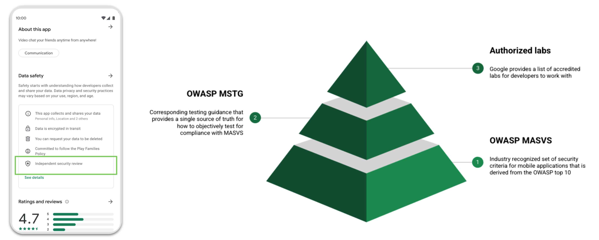

# Mobile App User Privacy Protection

## Overview

**IMPORTANT DISCLAIMER:** The MASTG is not a legal handbook and it will not go into the specifics of the GDPR or other possibly relevant legislation here. Instead, this chapter will introduce you to the topics related to user privacy protection, provide you with essential references for your own research efforts, and give you tests or guidelines that determine whether an app adheres to the privacy-related requirements listed in the OWASP MASVS.

### The Main Problem

Mobile apps handle all kinds of sensitive user data, from identification and banking information to health data, so both the developers and the public are understandably concerned about how this data is handled and where it ends up. It is also worth discussing the "benefits users get from using the apps" vs "the real price that they are paying for it" (often without even being aware of it).

### The Solution (pre-2020)

To ensure that users are properly protected, legislation such as the European Union's [General Data Protection Regulation (GDPR)](https://gdpr-info.eu/ "GDPR") in Europe have been developed and deployed (applicable since May 25, 2018). These laws can force developers to be more transparent regarding the handling of sensitive user data, which is usually implemented with privacy policies.

### The Challenge

Consider these dimensions of mobile app privacy:

- **Developer Compliance**: Developers need to be aware of laws about user privacy so their work is compliant. Ideally, the following principles must be followed:
    - **Privacy-by-Design** approach (Art. 25 GDPR, "Data protection by design and by default").
    - **Principle of Least Privilege** ("Every program and every user of the system should operate using the least set of privileges necessary to complete the job.")
- **User Education**: Users need to be educated about their sensitive data and informed about how to use the application properly (to ensure secure handling and processing of their information).

> Note: More often than not apps will claim to handle certain data, but in reality that's not the case. The IEEE article ["Engineering Privacy in Smartphone Apps: A Technical Guideline Catalog for App Developers" by Majid Hatamian](https://drive.google.com/file/d/1cp7zrqJuVkftJ0DARNN40Ga_m_tEhIrQ/view?usp=sharing) gives a very nice introduction to this topic.

### Goals for Data Protection

When an app requests personal information from a user, the user needs to know why the app needs that data and how it is used by the app. If there is a third party doing the actual processing of the data, the app should tell the user that too.

Like the classic triad of security protection goals: confidentiality, integrity, and availability, there are three protection goals that have been proposed for data protection:

- **Unlinkability**:
    - Users' privacy-relevant data is unlinkable to any other set of privacy-relevant data outside of the domain.
    - Includes: data minimization, anonymization, pseudonymization, etc.
- **Transparency**:
    - Users should know how to request all information that the application has on them and be aware of all the information that the app has on them.
    - Includes: privacy policies, user education, proper logging and auditing mechanisms, etc.
- **Intervenability**:
    - Users should know how to correct their personal information, request its deletion, withdraw any given consent at any time, and receive instructions on how to do so.
    - Includes: privacy settings directly in the app, single points of contact for individuals' intervention requests (e.g. in-app chat, telephone number, e-mail), etc.

> For more details, see Section 5.1.1 "Introduction to data protection goals" in ENISA's ["Privacy and data protection in mobile applications"](https://www.enisa.europa.eu/publications/privacy-and-data-protection-in-mobile-applications "ENISA - Privacy and data protection in mobile applications").

Since it is very challenging (if not impossible in many cases) to address both security and privacy protection goals at the same time, it is worth examining an visualization in IEEE's publication [Protection Goals for Privacy Engineering](https://ieeexplore.ieee.org/document/7163220) called ["The Three Axes"](https://ieeexplore.ieee.org/document/7163220#sec2e) which helps us understand why we cannot reach 100% of each of all six goals simultaneously.

Though a privacy policy traditionally protects most of the these processes, that approach is not always optimal because:

- Developers are not legal experts but still need to be compliant with legislation.
- Users almost always have to read long and wordy policies.

### The New Approach (Google and Apple)

In order to address these challenges and better inform users, Google and Apple have introduced new privacy labeling systems (very much along the lines of NIST's proposal) to help users easily understand how their data is being collected, handled, and shared, [Consumer Software Cybersecurity Labeling](https://nvlpubs.nist.gov/nistpubs/CSWP/NIST.CSWP.02042022-1.pdf). Their approaches can be seen at:

- The App Store [Nutrition Labels](https://www.apple.com/privacy/labels/) (since 2020).
- The Google Play [Data Safety Section](https://developer.android.com/guide/topics/data/collect-share) (since 2021).

Since this is a new requirement on both platforms, these labels must be accurate in order to reassure users and mitigate abuse.

### Google ADA MASA Program

Since regular security testing helps developers identify key vulnerabilities in their apps, Google Play will allow developers who have completed independent security validation to inform users by disclosing this fact in the app's Data Safety section. The developer's commitment to security and privacy is meant to reassure users.

As part of the process to provide more transparency into the app's security architecture, Google has introduced the [MASA (Mobile Application Security Assessment)](https://appdefensealliance.dev/masa) program as part of the [App Defense Alliance (ADA)](https://appdefensealliance.dev/). Since MASA is a globally recognized standard for mobile app security to the mobile app ecosystem, Google is acknowledging the importance of security in this industry. Developers can work directly with an Authorized Lab partner to initiate a security assessment that is independently validated against a set of MASVS Level 1 requirements, and Google will recognize this effort by allowing them to disclose these tests in the app's Data Safety section.

> If you are a developer and would like to participate, complete the [Independent Security Review form](https://docs.google.com/forms/d/e/1FAIpQLSdBl_eCNcUeUVDiB2duiJLZ5s4AV5AhDVuOz_1u8S9qhcXF5g/viewform "Google Play - Independent Security Review form").

Of course the testing is limited and it does not guarantee complete safety of the application. The independent review may not be scoped to verify the accuracy and completeness of a developer's Data Safety declarations, and developers remain solely responsible for making complete and accurate declarations in their app's Play Store listing.

### References

You can learn more about this and other privacy related topics here:

- [iOS App Privacy Policy](https://developer.apple.com/documentation/healthkit/protecting_user_privacy#3705073)
- [iOS Privacy Details Section on the App Store](https://developer.apple.com/app-store/app-privacy-details/)
- [iOS Privacy Best Practices](https://developer.apple.com/documentation/uikit/protecting_the_user_s_privacy)
- [Android App Privacy Policy](https://support.google.com/googleplay/android-developer/answer/9859455#privacy_policy)
- [Android Data Safety Section on Google Play](https://support.google.com/googleplay/android-developer/answer/10787469)
- [Preparing your app for the new Data safety section in Google Play](https://www.youtube.com/watch?v=J7TM0Yy0aTQ)
- [Android Privacy Best Practices](https://developer.android.com/privacy/best-practices)

## Testing for Privacy in Mobile Apps

Security testers should be aware of Google Play's list of [common privacy violations](https://support.google.com/googleplay/android-developer/answer/10144311?hl=en-GB#1&2&3&4&5&6&7&87&9&zippy=%2Cexamples-of-common-violations) though it is not exhaustive. Some of the examples are below:

- Example 1: An app that accesses a user's inventory of installed apps and doesn't treat this data as personal or sensitive data by sending it over the network (violating MSTG-STORAGE-4) or to another app via IPC mechanisms (violating MSTG-STORAGE-6).
- Example 2: An app displays sensitive data such as credit card details or user passwords without user authorization e.g. biometrics (violating MSTG-AUTH-10).
- Example 3: An app that accesses a user's phone or contact book data and doesn't treat this data as personal or sensitive data, additionally sending it over an unsecured network connection (violating MSTG-NETWORK-1).
- Example 4: An app collects device location (which is apparently not required for its proper functioning) and does not have a prominent disclosure explaining which feature uses this data (violating MSTG-PLATFORM-1).

> You can find more [common violations in Google Play Console Help](https://support.google.com/googleplay/android-developer/answer/10144311?hl=en-GB#1&2&3&4&5&6&7&87&9&zippy=%2Cexamples-of-common-violations "Google Play Console Help - Examples of Common Privacy Violations") by going to **Policy Centre -> Privacy, deception and device abuse -> User data**.

As you might expect, these testing categories are related to each other. When you're testing them you're often indirectly testing for user privacy protection. This fact will allow you to help you provide better and more comprehensive reports. Often you'll be able to reuse evidence from other tests in order to test for User Privacy Protection).

## Testing Disclosure of Data Privacy on the App Marketplace

This document is only interested in determining which privacy-related information is being disclosed by the developers and discussing how to evaluate this information to decide if it seems reasonable (similarly as you'd do when testing for permissions).

> While it is possible that the developers are not declaring certain information that is indeed being collected and\/or shared, that is a topic for a different test. In this test, you are not supposed to provide privacy violation assurance.

### Static Analysis

To perform a static analysis, follow these steps:

1. Search for the app in the corresponding app marketplace (e.g. Google Play, App Store).
2. Go to the section ["Privacy Details"](https://developer.apple.com/app-store/app-privacy-details/) (App Store) or ["Safety Section"](https://developer.android.com/guide/topics/data/collect-share) (Google Play).
3. Determine if there is any information available at all.

The app passes the test as long as the developer has complied with the app marketplace guidelines and included the required labels and explanations. The developer's disclosures in the app marketpace should be stored as evidence, so that you can later use it to determine potential violations of privacy or data protection.

### Dynamic Analysis

As an optional step, you can also provide some kind of evidence as part of this test. For instance, if you're testing an iOS app you can easily enable app activity recording and export a [Privacy Report](https://developer.apple.com/documentation/network/privacy_management/inspecting_app_activity_data) that contains detailed app access to different resources such as photos, contacts, camera, microphone, network connections, etc.

A dynamic analysis has many advantages for testing other MASVS categories and it provides very useful information that you can use to [test network communication](0x06g-Testing-Network-Communication.md) for MASVS-NETWORK or when [testing app interaction with the platform](0x06h-Testing-Platform-Interaction.md) for MASVS-PLATFORM. While testing these other categories, you might have taken similar measurements using other testing tools. You can also provide this as evidence for this test.

> Though the information available should be compared against what the app is actually meant to do, this will be far from a trivial task that could take from several days to weeks to finish depending on your resources and the capabilities of your automated tools. These tests also heavily depends on the app functionality and context and should be ideally performed on a white box setup working very closely with the app developers.

## Testing User Education on Security Best Practices

Determining whether the app educates users and helps them understand security needs is especially challenging if you intend to automate the process. We recommend using the app extensively and try to answer the following questions whenever applicable:

- **Fingerprint usage**: When fingerprints are used for authentication providing access to high-risk transactions/information,

    _does the app inform the user about potential issues when having multiple fingerprints of other people registered to the device as well?_

- **Rooting/jailbreaking**: When root or jailbreak detection is implemented,

    _does the app inform the user of the fact that certain high-risk actions will carry additional risk due to the jailbroken/rooted status of the device?_

- **Specific credentials**: When a user gets a recovery code, a password, or a pin from the application (or sets one),

    _does the app instruct the user to never share this with anyone else and that only the app will request it?_

- **Application distribution**: In case of a high-risk application and in order to prevent users from downloading compromised versions of the application,

    _does the app manufacturer properly communicate the official way of distributing the app (e.g. from Google Play or the App Store)?_

- **Prominent Disclosure**: In any case,

    _does the app display prominent disclosure of data access, collection, use, and sharing? e.g. does the app use the [App Tracking Transparency Framework](https://developer.apple.com/documentation/apptrackingtransparency) to ask for the permission on iOS?_

Other references include:

- Open-Source Licenses in Android - <https://www.bignerdranch.com/blog/open-source-licenses-and-android/>
- Software Licenses in Plain English - <https://tldrlegal.com/>
- Apple's approach to access private data - <https://developer.apple.com/design/human-interface-guidelines/privacy>
- Android app permissions best practices - <https://developer.android.com/training/permissions/requesting.html#explain>
