## Basic Security Testing on Android

### Setting Up Your Testing Environment

Setting up a testing environment can be a challenging task. When performing testing on-site at client premises, the restrictions on the enterprise wireless access points and networks may make dynamic analysis more difficult. Company policies may prohibit use of rooted phones or network testing tools (hardware and software) within the enterprise networks. Apps implementing root detection and other reverse engineering countermeasures may add a significant amount of extra work before further analysis can be performed.

To overcome these and other challenges, the testing team responsible for Android app assessment needs to work together with the app developers and the operation team in order to find a proper solution for an effective testing environment.

This section provides an overview of different methods of testing an Android app and illustrates their limitations. For the reasons stated above, not all testing methods documented here may be applicable for your testing environment. Being able to articulate the reasons for these restrictions will help all the project stakeholders to be on the same page.

#### Preparation

Security testing involves many invasive tasks such as monitoring and manipulating the network traffic between the mobile app and its remote endpoints, inspecting the app's data files, and instrumenting API calls. Security controls like SSL Pinning and root detection might impede these tasks and slow down testing dramatically.

To overcome these obstacles, it might make sense to request two build variants of the app from the development team. One variant should be provided as a release build to check if the implemented controls like SSL Pinning are working properly or can be easily bypassed. The second variant should also be provided as a debug build that deactivates certain security controls. This approach makes it possible to cover all scenarios and test cases in the most efficient way.

Of course, depending on the scope of the engagement, such approach may not be possible. For a white box test, requesting both production and debug builds will help to go through all test cases and give a clear statement of the security maturity of the app. For a black box test, the client might prefer the test to be focused on the production app, with the goal of evaluating the effectiveness of its security controls.

For both types of testing engagements, the scope should be discussed during the preparation phase. For example, it should be decided whether the security controls should be adjusted. Additional topics to cover are discussed below.

##### OS Versions

Before starting to test any application, it is important to have all the required hardware and software. This does not only mean that you must have a configured machine ready to run auditing tools, but also that you have the correct version of Android OS installed on the testing device. Therefore, it is always recommended to ask if the application runs only on specific versions of Android OS.

#### Testing on a Real Device

Different preparation steps need to be applied before a dynamic analysis of a mobile app can be started. Ideally the device is rooted, as otherwise some test cases cannot be tested properly. See "Rooting your device" for more information.

The available setup options for the network need to be evaluated first. The mobile device used for testing and the machine running the interception proxy need to be placed within the same WiFi network. Either an (existing) access point is used or an ad-hoc wireless network is created<sup>[3]</sup>.

Once the network is configured and connectivity is established between the testing machine and the mobile device, several other steps need to be done.

* The proxy in the network settings of the Android device need to be configured properly to point to the interception proxy in use<sup>[1]</sup>.
* The CA certificate of the interception proxy need to be added to the trusted certificates in the certificate storage <sup>[2]</sup> of the Android device. Due to different versions of Android and modifications of Android OEMs to the settings menu, the location of the menu to store a CA might differ.

After finishing these steps and starting the app, the requests should show up in the interception proxy.

##### Rooting Your Device

###### Risks of Rooting

As a security tester, you may want to root your mobile device: while some tests can be performed on a non-rooted mobile, some do require a rooted one. However, you need to be aware of the fact that rooting is not an easy process and requires advanced knowledge. Rooting is risky, and three main consequences need to be clarified before you may proceed: rooting

* Usually voids the device warranty (always check the manufacturer policy before taking any action),
* May "brick" the device, i.e., render it inoperable and unusable.
* Brings additional security risks as built-in exploit mitigations are often removed.

**You need to understand that rooting your device is ultimately YOUR own decision and that OWASP shall in no way be held responsible for any damage. In case you feel unsure, always seek expert advice before starting the rooting process.**

###### What Mobiles Can Be Rooted?

Virtually any Android mobile can be rooted. Commercial versions of Android OS, at the kernel level evolutions of Linux OS, are optimized for the mobile world. Here some features are removed or disabled, such as the possibility for a non-privileged user to become the 'root' user (who has elevated privileges). Rooting a phone means adding the feature to become the root user, e.g. technically speaking adding a standard Linux executable called `su` used for switching users.

The first step in rooting a mobile is to unlock its boot loader. The procedure depends on each manufacturer. However, for practical reasons, rooting some mobiles is more popular than rooting others, particularly when it comes to security testing: devices created by Google (and manufactured by other companies like Samsung, LG and Motorola) are among the most popular, particularly because they are widely used by developers. The device warranty is not nullified when the boot loader is unlocked and Google provides many tools to support the root itself to work with rooted devices. A curated list of guide on rooting devices from all major brands can be found in XDA forums<sup>[21]</sup>.

See also "Android Platform Overview" for further details.

##### Restrictions When Using a Non-Rooted Device

For testing of an Android app a rooted device is the foundation for a tester to be able to execute all available test cases. In case a non-rooted device need to be used, it is still possible to execute several test cases to the app.

Nevertheless, this highly depends on the restrictions and settings made in the app. For example if backups are allowed, a backup of the data directory of the app can be extracted. This allows detailed analysis of leakage of sensitive data when using the app. Also if SSL Pinning is not used a dynamic analysis can also be executed on a non-rooted device.  

#### Testing on the Emulator

All of the above steps to prepare a hardware testing device do also apply if an emulator is used<sup>[4]</sup>. For dynamic testing several tools or VMs are available that can be used to test an app within an emulator environment:

* AppUse
* MobSF

It is also possible to simply create an AVD and use this for testing.

##### Setting Up a Web Proxy on Virtual Device

To set up a HTTP proxy on the emulator follow the following procedure, which works on the Android emulator shipping with Android Studio 2.x:

1. Set up your proxy to listen on localhost. Reverse-forward the proxy port from the emulator to the host, e.g.:

```bash
$ adb reverse tcp:8080 tcp:8080
```

2. Configure the HTTP proxy in the access point settings of the device:
- Open the Settings Menu
- Tap on "Wireless & Networks" -> "Cellular Networks" or "Mobile Networks"
- Open "Access Point Names"
- Open the existing APN (e.g. "T-Mobile US")
- Enter "127.0.0.1" in the "Proxy" field and your proxy port in the "Port" field (e.g. "8080")
- Open the top-right menu and tap "save"


HTTP and HTTPS requests should now be routed over the proxy on the host machine. Try toggling airplane mode off and on if it doesn't work.

##### Installing a CA Certificate on the Virtual Device

An easy way to install a CA certificate is pushing the cert to the device and adding it to the certificate store via Security Settings. For example, you can install the PortSwigger (Burp) CA certificate as follows:

1. Start Burp and navigate to http://burp/ using a web browser on the host, and download `cacert.der` by clicking the "CA Certificate" button.
2. Change the file extension from `.der` to `.cer`
3. Push the file to the emulator:

```bash
$ adb push cacert.cer /sdcard/
```

4. Navigate to "Settings" -> "Security" -> "Install from SD Card"
5. Scroll down and tap on `cacert.cer`

You should now be prompted to confirm installation of the certificate (you'll also be asked to set a device PIN if you haven't already).

##### Connecting to an Android Virtual Device (AVD) as Root

An Android Virtual Device (AVD) can be created by using the AVD manager, which is available within Android Studio<sup>[5]</sup>. The AVD manager can also be started separately from the command line by using the `android` command in the tools directory of the Android SDK:

```bash
$ ./android avd
```

Once the emulator is up and running a root connection can be established by using `adb`.

```bash
$ adb root
$ adb shell
root@generic_x86:/ $ id
uid=0(root) gid=0(root) groups=0(root),1004(input),1007(log),1011(adb),1015(sdcard_rw),1028(sdcard_r),3001(net_bt_admin),3002(net_bt),3003(inet),3006(net_bw_stats) context=u:r:su:s0
```

Rooting of an emulator is therefore not needed as root access can be granted through `adb`.

##### Restrictions When Testing on an Emulator

There are several downsides when using an emulator. You might not be able to test an app properly in an emulator, if it's relying on the usage of a specific mobile network, or uses NFC or Bluetooth. Testing within an emulator is usually also slower in nature and might lead to issues on its own.

Nevertheless several hardware characteristics can be emulated, like GPS<sup>[6]</sup> or SMS<sup>[7]</sup> and many more.

### Testing Methods

#### Manual Static Analysis

In principle, we talk about white-box testing when the source code (or even better, the complete Android Studio project) is available, and black-box if only APK package is available. In Android app security testing however, the difference is not all that big. The majority of apps can be decompiled easily, and with some reverse engineering knowledge, having access to bytecode and binary code is almost as good as having the original code, except in cases where the release build is purposefully obfuscated.

To accomplish the source code testing, you will want to have a setup similar to the developer. You will need a testing environment on your machine with the Android SDK and an IDE installed. It is also recommended to have access either to a physical device or an emulator, so you can debug the app.

During **Black box testing** you will not have access to the source code in its original form. Usually, you will have the application package in hand (in Android .apk format<sup>[17]</sup>), which can be installed on an Android device or reverse engineered with the goal to retrieve parts of the source code.

An easy way on the CLI to retrieve the source code of an APK is through `apkx`, which also packages `dex2jar` and CFR and automates the extracting, conversion and decompilation steps. Install it as follows:

```
$ git clone https://github.com/b-mueller/apkx
$ cd apkx
$ sudo ./install.sh
```

This should copy `apkx` to `/usr/local/bin`. Run it on the APK that need to be tested:

```bash
$ apkx UnCrackable-Level1.apk
Extracting UnCrackable-Level1.apk to UnCrackable-Level1
Converting: classes.dex -> classes.jar (dex2jar)
dex2jar UnCrackable-Level1/classes.dex -> UnCrackable-Level1/classes.jar
Decompiling to UnCrackable-Level1/src (cfr)
```

If the application is based solely on Java and does not have any native library (code written in C/C++), the reverse engineering process is relatively easy and recovers almost the entire source code. Nevertheless, if the code is obfuscated, this process might become very time consuming and might not be productive. The same applies for applications that contain a native library. They can still be reverse engineered but require low level knowledge and the process is not automated.

More details and tools about the Android reverse engineering topic can be found at [Tampering and Reverse Engineering on Android](0x05b-Reverse-Engineering-and-Tampering.md) section.

#### Automated Static Analysis

Static analysis should be supported through the usage of tools, to make the analysis efficient and to allow the tester to focus on the more complicated business logic. There are a plethora of static code analyzers that can be used, ranging from open source scanners to full blown enterprise ready scanners. The decision on which tool to use depends on the budget, requirements by the client and the preferences of the tester.

Some Static Analyzers rely on the availability of the source code while others take the compiled APK as input.
It is important to keep in mind that while static analyzers can help us to focus attention on potential problems, they may not be able to find all the problems by itself. Go through each finding carefully and try to understand what the app is doing to improve your chances of finding vulnerabilities.

One important thing to note is to configure the static analyzer properly in order to reduce the likelihood of false positives and maybe only select several vulnerability categories in the scan. The results generated by static analyzers can otherwise be overwhelming and the effort can become counterproductive if an overly large report need to be manually investigated.

Automated tools for performing security analysis on an APK are:

- QARK<sup>[18]</sup>,
- Androbugs<sup>[19]</sup> and
- JAADAS<sup>[20]</sup>.

#### Dynamic Analysis

Compared to static analysis, dynamic analysis is applied while executing the mobile app. The test cases can range from investigating the file system and changes made to it on the mobile device to monitoring the communication with the endpoint while using the app.

When we talk about dynamic analysis of applications that rely on the HTTP(S) protocol, several tools can be used to support the dynamic analysis. The most important tools are so called interception proxies, like OWASP ZAP or Burp Suite Professional to name the most famous ones. An interception proxy allows the tester to have a Man-in-the-middle position in order to read and/or modify all requests made from the app and responses coming from the endpoint for testing Authorization, Session Management and so on.

##### Drozer

Drozer<sup>[25]</sup> is an Android security assessment framework that allows you to search for security vulnerabilities in apps and devices by assuming the role of a third party app interacting with the other application's IPC endpoints and the underlying OS. The following section documents the steps necessary to install and begin using Drozer.

Drozer is open source software, maintained by MWR InfoSecurity, and can be downloaded from: [Drozer](https://labs.mwrinfosecurity.com/tools/drozer).

###### Installing Drozer

### Prerequisites:

1. JRE or JDK
2. Android SDK
3. An Android emulator 

**On Linux:**

Pre-built packages for many Linux distributions are available on the Drozer website <sup>[26]</sup>. If your distribution is not listed, you can build Drozer from source as follows:

```
git clone https://github.com/mwrlabs/drozer/
cd drozer
make apks
source ENVIRONMENT
python setup.py build
sudo env "PYTHONPATH=$PYTHONPATH:$(pwd)/src" python setup.py install
```

**On Mac:**

<!-- TODO: Mac Install instructions -->

**Starting a Session:**

You should now have the Drozer console installed on your host machine, and the Agent running on your test device. Now, you need to connect the two and you’re ready to start exploring.

* Drozer Agent can be installed using Android Debug Bridge (adb)

Drozer agent is the component running on the device itself. It can be installed using Android Debug Bridge (adb). Download the latest Drozer Agent [here](https://github.com/mwrlabs/drozer/releases/).

		adb install drozer.apk

* Connect with emulator using the following command

		adb connect (ipaddress of the device)
  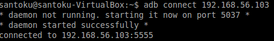
  
* Check if the device is conected or not by running the following command:

		adb devices
  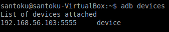

* Open the drozer application in running emulator and click the OFF button in the bottom of the app which will start a Embedded Server.

	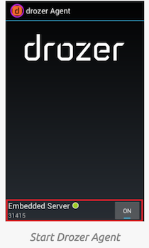
	   

* By default the server is listening on Port Number 31415 so in order to forward all commands of drozer client to drozer server we will use Android Debug Bridge[ADB] to forward the connection

		adb forward tcp:31415 tcp:31415
		
	
      

 * Run the following command to connect to the agent from the workstation.

 		drozer console connect

 	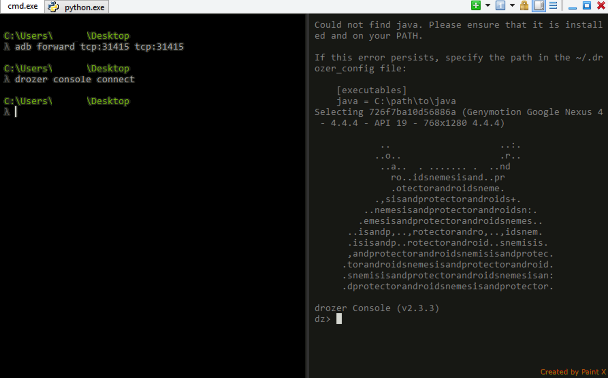
      

 **Listing out all the modules**

 * To show the list of all Drozer modules that can be executed in the current session,give the followming command

      `dz>list`

   	 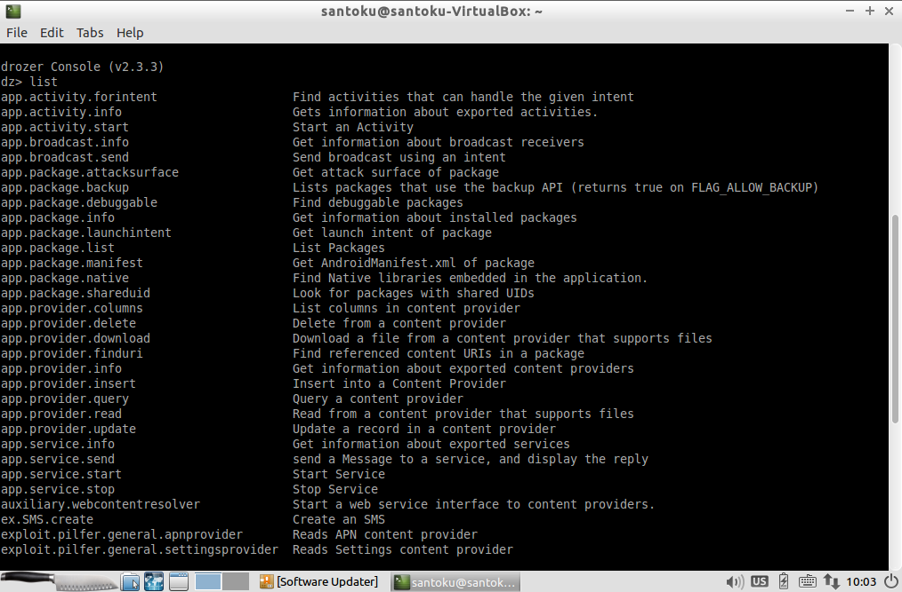
     
  **Retrieving package information**  
 
  * To list out all the packages installed on the emulator, run the following command:

     `dz>run app.package.list`
  
  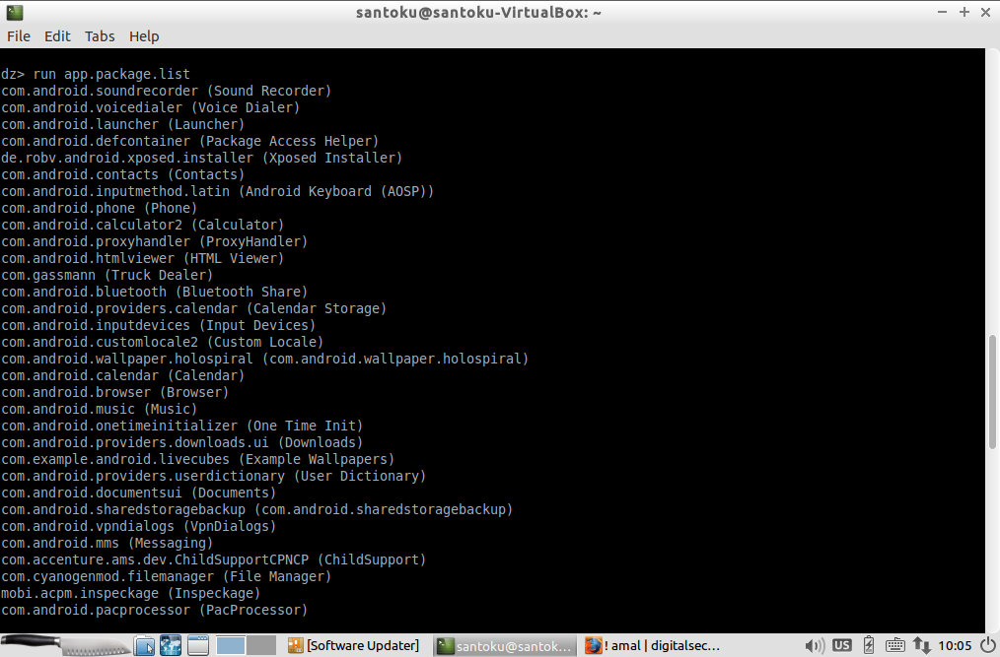
  

  * To figure out the package name of a specific app, we can specify the flag “-f” with the string we are looking for:

    `dz> run app.package.list –f (string to be searched)`

    
  
  * To see some basic information about the package, we can run the following command:

       `dz> run app.package.info –a (package name)`

       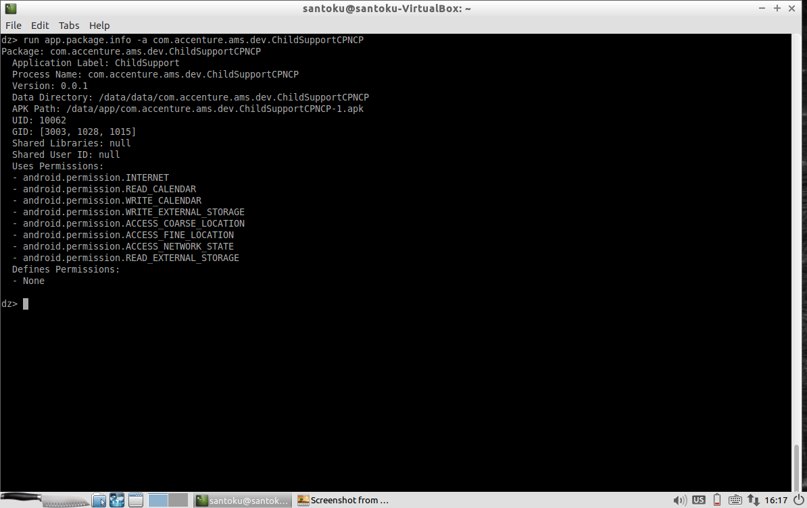
  
   **Identifying the attack surface**    

* To identify the exported applications components,run the following command:
 
  `dz> run app.package.attacksurface (package name)`

   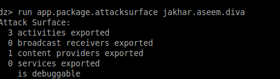 

   **Attacks on exported Activities**

* To identify the the list of Activities exported in the target application,execute the following command:

 `run app.activity.info -a (package name)`

  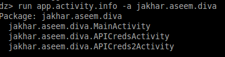 

 * To launch the activities exported,run the following command:

 `dz> run app.activity.start --component (package name) (component name)`
 
  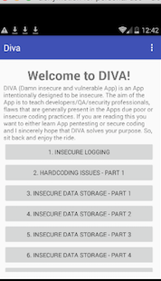

   **Attacks on Broadcast Receivers**

 * To get the list of exported Broadcast Receivers,run the following command:

  `dz>run app.broadcast.info --package (package name)`

 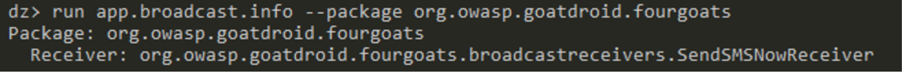

 * In the AndroidManifest.xml file of FourGoats application,find action name is org.owasp.goatdroid.fourgoats.SOCIAL_SMS and component name as org.owasp.goatdroid.fourgoats.broadcastreceivers.SendSMSNowReceiver 

  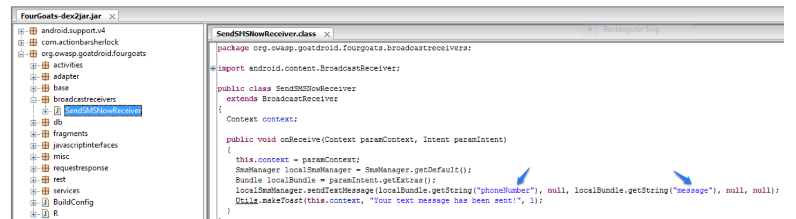 

 * While passing the intent we have to give two inputs “phoneNumber” and “message”

  `adb shell am broadcast -a (action name)  -n (component name ) --es  phonenumber (phonenumber) (component name)  --es message (msg)`
  
  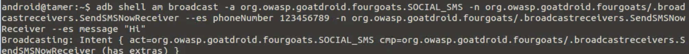 

  The above command will try to send the messgae to the number 123456789 with message Hi

  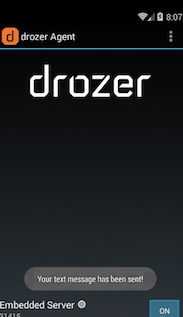

   **Attacks on Content Providers**

Here we have used Sieve Application for showcasing the attack on Content Providers:

* To identify the the list of content providers exported in the application,execute the following command:

 `run app.provider.finduri (package name)`

   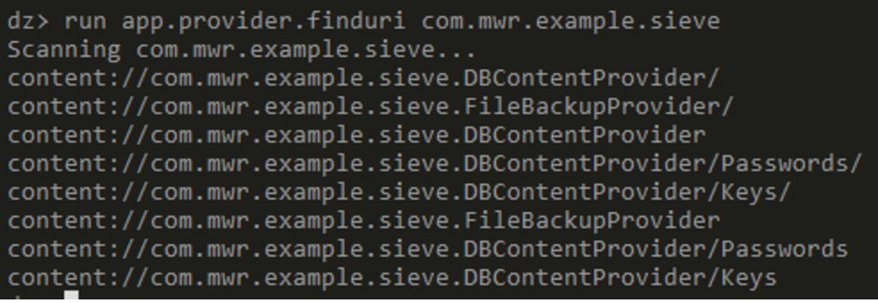

 * We can see that there are two similar URIS

	content://com.mwr.example.sieve.DBContentProvider/keys

	&

	content://com.mwr.example.sieve.DBContentProvider/keys/  

  * Lets open first URI  : <font face="verdana" color="Blue" font size="2"> content://com.mwr.example.sieve.DBContentProvider/keys</font>,run the following command:

     `run app.provider.query (URI)`


    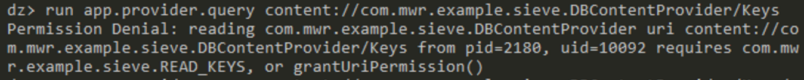 
   Here upon accessing,it  need com.mwr.example.sieve.READ_KEYS permission 

  * Lets open second URI : <font face="verdana" color="Blue" font size="2"> content://com.mwr.example.sieve.DBContentProvider/keys/</font>
  
     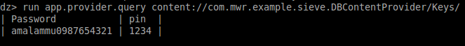 

    Here it doesn’t need any permission.So now we have the master password and pin of the App which manages other Apps password.  

  * Let’s try to change the value of Password from amalammu0987654321 to ammuamal12345 by executing the fowllowing command:

    `run app.provider.update (URI) --selection "pin=(pinno)" --string  Password "newpassword"`
 
     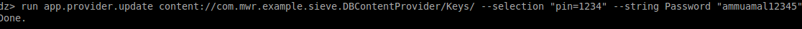

  * After changing the password again try to read the value of password,

     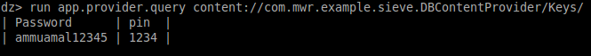 

   **Attacks on Services**

* To identify the the list of services exported in the application,execute the following command:

    `run app.service.info -a (package name)`

   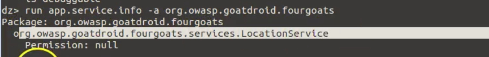 

* To launch the services exported,run the following command: 

    `run  app.service.start  --action (action name)  --component (package name) (component name)`

   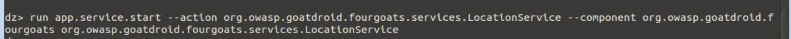 

 *  After running the above command notify that the application got crashed

     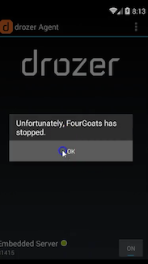


**Using Modules:**

Out of the box, Drozer provides modules to investigate various aspects of the Android platform, and a few
remote exploits. You can extend Drozer's functionality by downloading and installing additional modules.

**Finding Modules:**

The official Drozer module repository is hosted alongside the main project on Github. This is automatically set
up in your copy of Drozer. You can search for modules using the `module` command:

```bash
dz> module search tool
kernelerror.tools.misc.installcert
metall0id.tools.setup.nmap
mwrlabs.tools.setup.sqlite3
```

For more information about a module, pass the `–d` option to view the module's description:

```
dz> module  search url -d
mwrlabs.urls
    Finds URLs with the HTTP or HTTPS schemes by searching the strings
    inside APK files.

        You can, for instance, use this for finding API servers, C&C
    servers within malicious APKs and checking for presence of advertising
    networks.

```

**Installing Modules:**

You can install modules using the `module` command:

```
dz> module install mwrlabs.tools.setup.sqlite3
Processing mwrlabs.tools.setup.sqlite3... Already Installed.
Successfully installed 1 modules, 0 already installed
```

This will install any module that matches your query. Newly installed modules are dynamically loaded into the
console and are available for immediate use.

#### Firebase/Google Cloud Messaging (FCM/GCM)

Firebase Cloud Messaging (FCM) is the successor of Google Cloud Messaging (GCM) and is a free service offered by Google and allows to send messages between an application server and client apps. The server and client app are communicating via the FCM/GCM connection server that is handling the downstream and upstream messages.


Downstream messages are sent from the application server to the client app (push notifications); upstream messages are sent from the client app to the server.

FCM is available for Android and also for iOS and Chrome. FCM provides two connection server protocols at the moment: HTTP and XMPP and there are several differences in the implementation, as described in the official documentation<sup>[24]</sup>. The following example demonstrates how to intercept both protocols.

##### Preparation

For a full dynamic analysis of an Android app FCM should be intercepted. To be able to intercept the messages several steps should be considered for preparation.

* Install the CA certificate of your interception proxy into your Android phone<sup>[2]</sup>.
* A Man-in-the-middle attack should be executed so all traffic from the mobile device is redirected to your testing machine. This can be done by using a tool like ettercap<sup>[24]</sup>. It can be installed by using brew on Mac OS X.

```bash
$ brew install ettercap
```

Ettercap can also be installed through `apt-get` on Debian based linux distributions.

```bash
sudo apt-get install zlib1g zlib1g-dev
sudo apt-get install build-essential
sudo apt-get install ettercap
```

FCM can use two different protocols to communicate with the Google backend, either XMPP or HTTP.

**HTTP**

The ports used by FCM for HTTP are 5228, 5229, and 5230. Typically only 5228 is used, but sometimes also 5229 or 5230 is used.

* Configure a local port forwarding on your machine for the ports used by FCM. The following example can be used on Mac OS X<sup>[23]</sup>:

```bash
$ echo "
rdr pass inet proto tcp from any to any port 5228-> 127.0.0.1 port 8080
rdr pass inet proto tcp from any to any port 5229 -> 127.0.0.1 port 8080
rdr pass inet proto tcp from any to any port 5239 -> 127.0.0.1 port 8080
" | sudo pfctl -ef -
```

* The interception proxy need to listen to the port specified in the port forwarding rule above, which is 8080.

**XMPP**

The ports used by FCM over XMPP are 5235 (Production) and 5236 (Testing)<sup>[26]</sup>.

* Configure a local port forwarding on your machine for the ports used by FCM. The following example can be used on Mac OS X<sup>[23]</sup>:

```bash
$ echo "
rdr pass inet proto tcp from any to any port 5235-> 127.0.0.1 port 8080
rdr pass inet proto tcp from any to any port 5236 -> 127.0.0.1 port 8080
" | sudo pfctl -ef -
```

* The interception proxy need to listen to the port specified in the port forwarding rule above, which is 8080.

##### Intercepting Messages

Your testing machine and the Android device need to be in the same wireless network. Start ettercap with the following command and replace the IP addresses with the one of the Android device and the network gateway in the wireless network.

```bash
$ ettercap -T -i eth0 -M arp:remote /192.168.0.1// /192.168.0.105//
```

Start using the app and trigger a function that uses FCM. You should see HTTP messages showing up in your interception proxy.


Interception proxies like Burp or OWASP ZAP will not show this traffic, as they are not capable of decoding it properly by default. There are however Burp plugins such as Burp-non-HTTP-Extension<sup>[28]</sup> and Mitm-relay<sup>[27]</sup> that visualize XMPP traffic.

As an alternative to a MITM attack executed on your machine, a Wifi Access Point (AP) or router can also be used instead. The setup would become a little bit more complicated, as port forwarding needs to be configured on the AP or router and need to point to your interception proxy that need to listen on the external interface of your machine. For this test setup tools like ettercap are not needed anymore.

Tools like Wireshark can be used to monitor and record the traffic for further investigation either locally on your machine or through a span port, if the router or Wifi AP offers this functionality.

#### Potential Obstacles

For the following security controls that might be implemented into the app you are about to test, it should be discussed with the project team if it is possible to provide a debug build. A debug build has several benefits when provided during a (white box) test, as it allows a more comprehensive analysis.

##### SSL Pinning

SSL Pinning is a mechanism to make dynamic analysis harder. Certificates provided by an interception proxy to enable a Man-in-the-middle position are declined and the app will not make any requests. To be able to efficiently test during a white box test, a debug build with deactivated SSL Pinning should be provided.

For a black box test, there are several ways to bypass SSL Pinning, for example SSLUnpinning<sup>[11]</sup> or Android-SSL-TrustKiller<sup>[12]</sup>. Therefore bypassing can be done within seconds, but only if the app uses the API functions that are covered for these tools. If the app is using a different framework or library to implement SSL Pinning that is not implemented yet in those tools, the patching and deactivation of SSL Pinning needs to be done manually and can become time consuming.

To manually deactivate SSL Pinning there are two ways:
* Dynamical Patching while running the App, by using Frida<sup>[9] [13]</sup> or ADBI<sup>[10]</sup>
* Disassembling the APK, identify the SSL Pinning logic in smali code, patch it and reassemble the APK<sup>[7] [22]</sup>

Once successful, the prerequisites for a dynamic analysis are met and the apps communication can be investigated.

See also test case "Testing Custom Certificate Stores and SSL Pinning" for further details.

##### Root Detection

Root detection can be implemented using pre-made libraries like RootBeer<sup>[14]</sup> or custom checks. An extensive list of root detection methods is presented in the "Testing Anti-Reversing Defenses on Android" chapter.

In a typical mobile app security build, you'll usually want to test a debug build with root detection disabled. If such a build is not available for testing, root detection can be disabled using a variety of methods which will be introduced later in this book.

### References

- [1] Configuring an Android Device to Work With Burp - https://support.portswigger.net/customer/portal/articles/1841101-Mobile%20Set-up_Android%20Device.html
- [2] Installing Burp's CA Certificate in an Android Device - https://support.portswigger.net/customer/portal/articles/1841102-installing-burp-s-ca-certificate-in-an-android-device
- [3] Creating an Ad-hoc Wireless Network in OS X - https://support.portswigger.net/customer/portal/articles/1841150-Mobile%20Set-up_Ad-hoc%20network_OSX.html
- [4] Android Application Security Testing Guide: Part 2 - http://resources.infosecinstitute.com/android-app-sec-test-guide-part-2/#gref
- [5] Create and Manage Virtual Devices - https://developer.android.com/studio/run/managing-avds.html
- [6] GPS Emulation - https://developer.android.com/studio/run/emulator-commandline.html#geo
- [7] SMS Emulation - https://developer.android.com/studio/run/emulator-commandline.html#sms
- [8] Mobile Security Certificate Pinning -  http://blog.dewhurstsecurity.com/2015/11/10/mobile-security-certificate-pining.html
- [9] Frida - https://www.frida.re/docs/android/
- [10] ADBI - https://github.com/crmulliner/adbi
- [11] SSLUnpinning - https://github.com/ac-pm/SSLUnpinning_Xposed
- [12] Android-SSL-TrustKiller - https://github.com/iSECPartners/Android-SSL-TrustKiller
- [13] Defeating SSL Pinning in Coin's Android Application -  http://rotlogix.com/2015/09/13/defeating-ssl-pinning-in-coin-for-android/
- [14] RootBeet - https://github.com/scottyab/rootbeer
- [15] Android Lint - https://sites.google.com/a/android.com/tools/tips/lint/
- [16] devknox - https://devknox.io/
- [17] Android application package - https://en.wikipedia.org/wiki/Android_application_package
- [18] QARK - https://github.com/linkedin/qark/
- [19] Androbugs - https://github.com/AndroBugs/AndroBugs_Framework
- [20] JAADAS - https://github.com/flankerhqd/JAADAS
- [21] Guide to root mobile devices - https://www.xda-developers.com/root/
- [22] Bypassing SSL Pinning in Android Applications - https://serializethoughts.com/2016/08/18/bypassing-ssl-pinning-in-android-applications/
- [23] Mac OS X Port Forwarding - https://salferrarello.com/mac-pfctl-port-forwarding/
- [23] Ettercap - https://ettercap.github.io
- [24] Differences of HTTP and XMPP in FCM: https://firebase.google.com/docs/cloud-messaging/server#choose
- [25] Drozer on GitHub - https://github.com/mwrlabs/drozer
- [26] Drozer Website - https://labs.mwrinfosecurity.com/tools/drozer/
- [27] Firebase via XMPP - https://firebase.google.com/docs/cloud-messaging/xmpp-server-ref
- [28] Mitm-relay - https://github.com/jrmdev/mitm_relay
- [29] Burp-non-HTTP-Extension - https://github.com/summitt/Burp-Non-HTTP-Extension
