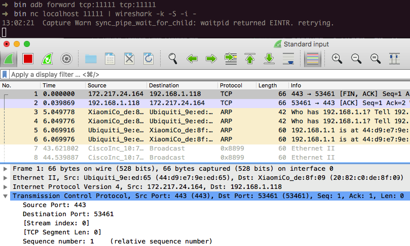

## Setting up a Testing Environment for Android Apps

By now, you should have a basic understanding of the way Android apps are structured and deployed. In this chapter, we'll talk about setting up a security testing environment and describe basic testing processes you'll be using. This chapter is the foundation for the more detailed testing methods discussed in later chapters.

You can set up a fully functioning test environment on almost any machine running Windows, Linux, or Mac OS.

#### Software Needed on the Host PC or Mac

At the very least, you'll need [Android Studio](https://developer.android.com/studio/index.html "Android Studio") (which comes with the Android SDK) platform tools, an emulator, and an app to manage the various SDK versions and framework components. Android Studio also comes with an Android Virtual Device (AVD) Manager application for creating emulator images. Make sure that the newest [SDK tools](https://developer.android.com/studio/index.html#downloads) and [platform tools](https://developer.android.com/studio/releases/platform-tools.html) packages are installed on your system.

#### Setting up the Android SDK

Local Android SDK installations are managed via Android Studio. Create an empty project in Android Studio and select "Tools->Android->SDK Manager" to open the SDK Manager GUI. The "SDK Platforms" tab is where you install SDKs for multiple API levels. Recent API levels:

- API 23: Android 6.0
- API 24: Android 7.0
- API 25: Android 7.1
- API 26: Android 8.0


Installed SDKs are on the following paths:

```
Windows:

C:\Users\<username>\AppData\Local\Android\sdk

MacOS:

/Users/<username>/Library/Android/sdk
```

Note: On Linux, you need to choose an SDK directory. `/opt`, `/srv`, and `/usr/local` are common choices.

#### Testing on a Real Device

For dynamic analysis, you'll need an Android device to run the target app on. In principle, you can do without a real Android device and test on the emulator. However, apps execute quite slowly on the emulator, and this can make security testing tedious. Testing on a real device makes for a smoother process and a more realistic environment.

*Rooting* (i.e., modifying the OS so that you can run commands as the root user) is recommended for testing on a real device. This gives you full control over the operating system and allows you to bypass restrictions such as app sandboxing. These privileges in turn allow you to use techniques like code injection and function hooking more easily.

Note that rooting is risky, and three main consequences need to be clarified before you proceed. Rooting can have the following negative effects:

- voiding the device warranty (always check the manufacturer's policy before taking any action)
- "bricking" the device, i.e., rendering it inoperable and unusable
- creating additional security risks (because built-in exploit mitigations are often removed)

You should not root a personal device that you store your private information on. We recommend getting a cheap, dedicated test device instead. Many older devices, such as Google's Nexus series, can run the newest Android versions and are perfectly fine for testing.

**You need to understand that rooting your device is ultimately YOUR decision and that OWASP shall in no way be held responsible for any damage. If you're uncertain, seek expert advice before starting the rooting process.**

###### Which Mobiles Can Be Rooted?

Virtually any Android mobile can be rooted. Commercial versions of Android OS (which are Linux OS evolutions at the kernel level) are optimized for the mobile world. Some features have been removed or disabled for these versions, for example, non-privileged users' ability to become the 'root' user (who has elevated privileges). Rooting a phone means allowing users to become the root user, e.g., adding a standard Linux executable called `su`, which is used to change to another user account.

To root a mobile device, first unlock its boot loader. The unlocking procedure depends on the device manufacturer. However, for practical reasons, rooting some mobile devices is more popular than rooting others, particularly when it comes to security testing: devices created by Google and manufactured by companies like Samsung, LG, and Motorola are among the most popular, particularly because they are used by many developers. The device warranty is not nullified when the boot loader is unlocked and Google provides many tools to support the root itself. A curated list of guides for rooting all major brand devices is posted on the [XDA forums](https://www.xda-developers.com/root/ "Guide to rooting mobile devices").

##### Network Setup

The available network setup options must be evaluated first. The mobile device used for testing and the machine running the interception proxy must be connected to the same Wi-Fi network. Use either an (existing) access point or create [an ad-hoc wireless network](https://support.portswigger.net/customer/portal/articles/1841150-Mobile%20Set-up_Ad-hoc%20network_OSX.html "Creating an Ad-hoc Wireless Network in OS X").

Once you've configured the network and established a connection between the testing machine and the mobile device, several steps remain.

- The proxy must be [configured to point to the interception proxy](https://support.portswigger.net/customer/portal/articles/1841101-Mobile%20Set-up_Android%20Device.html "Configuring an Android Device to Work With Burp").
- The [interception proxy's CA certificate must be added to the trusted certificates in the Android device's certificate storage](https://support.portswigger.net/customer/portal/articles/1841102-installing-burp-s-ca-certificate-in-an-android-device "Installing Burp's CA Certificate in an Android Device"). The location of the menu used to store CA certificates may depend on the Android version and Android OEM modifications of the settings menu.

After completing these steps and starting the app, the requests should show up in the interception proxy.

#### Testing on the Emulator

All the above steps for preparing a hardware testing device also apply if an emulator is used. Several tools and VMs that can be used to test an app within an emulator environment are available for dynamic testing:

- AppUse
- MobSF
- Nathan

You can also easily create AVDs via Android Studio.

##### Setting Up a Web Proxy on a Virtual Device

The following procedure, which works on the Android emulator that ships with Android Studio 2.x, is for setting up an HTTP proxy on the emulator:

1. Set up your proxy to listen on localhost. Reverse-forward the proxy port from the emulator to the host, e.g.:

```bash
$ adb reverse tcp:8080 tcp:8080
```

2. Configure the HTTP proxy with the device's access point settings:
- Open the Settings Menu
- Tap on "Wireless & Networks" -> "Cellular Networks" or "Wireless & Networks" -> "Mobile Networks"
- Open "Access Point Names"
- Open the existing APN (e.g., "T-Mobile US")
- Enter "127.0.0.1" in the "Proxy" field and your proxy port in the "Port" field (e.g., "8080")
- Open the menu at the top right and tap "save"


HTTP and HTTPS requests should now be routed over the proxy on the host machine. If not, try toggling airplane mode off and on.

##### Installing a CA Certificate on the Virtual Device

An easy way to install a CA certificate is to push the certificate to the device and add it to the certificate store via Security Settings. For example, you can install the PortSwigger (Burp) CA certificate as follows:

1. Start Burp and use a web browser on the host to navigate to http://burp/, then download `cacert.der` by clicking the "CA Certificate" button.
2. Change the file extension from `.der` to `.cer`.
3. Push the file to the emulator:

```bash
$ adb push cacert.cer /sdcard/
```

4. Navigate to "Settings" -> "Security" -> "Install from SD Card."
5. Scroll down and tap `cacert.cer`.

You should then be prompted to confirm installation of the certificate (you'll also be asked to set a device PIN if you haven't already).

##### Connecting to an Android Virtual Device (AVD) as Root

You can create an Android Virtual Device with the AVD manager, which is [available within Android Studio](https://developer.android.com/studio/run/managing-avds.html "Create and Manage Virtual Devices"). You can also start the AVD manager from the command line with the `android` command, which is found  in the tools directory of the Android SDK:

```bash
$ ./android avd
```

Once the emulator is up and running, you can establish a root connection with the `adb` command.

```bash
$ adb root
$ adb shell
root@generic_x86:/ $ id
uid=0(root) gid=0(root) groups=0(root),1004(input),1007(log),1011(adb),1015(sdcard_rw),1028(sdcard_r),3001(net_bt_admin),3002(net_bt),3003(inet),3006(net_bw_stats) context=u:r:su:s0
```

Rooting an emulator is therefore unnecessary; root access can be established with `adb`.

##### Restrictions When Testing on an Emulator

There are several downsides to using an emulator. You may not be able to test an app properly in an emulator if the app relies on a specific mobile network or uses NFC or Bluetooth. Testing within an emulator is also usually slower, and the testing itself may cause issues.

Nevertheless, you can emulate many hardware characteristics, such as [GPS](https://developer.android.com/studio/run/emulator-commandline.html#geo "GPS Emulation") and [SMS](https://developer.android.com/studio/run/emulator-commandline.html#sms "SMS").

### Testing Methods

#### Manual Static Analysis

In Android app security testing, black-box testing (with access to the compiled binary, but not the original source code) is almost equivalent to white-box testing. The majority of apps can be decompiled easily, and having some reverse engineering knowledge and access to bytecode and binary code is almost as good as having the original code unless the release build has been purposefully obfuscated.

For source code testing, you'll need a setup similar to the developer's setup, including a test environment that includes the Android SDK and an IDE. Access to either a physical device or an emulator (for debugging the app) is recommended.

During **black box testing**, you won't have access to the original form of the source code. You'll usually have the application package in [Android's .apk format](https://en.wikipedia.org/wiki/Android_application_package "Android application package"), which can be installed on an Android device or reverse engineered to help you retrieve parts of the source code.

The following pull the APK from the device:

```bash
$ adb shell pm list packages
(...)
package:com.awesomeproject
(...)
$ adb shell pm path com.awesomeproject
package:/data/app/com.awesomeproject-1/base.apk
$ adb pull /data/app/com.awesomeproject-1/base.apk
```

`apkx` provides an easy method of retrieving an APK's source code via the command line. It also packages `dex2jar` and CFR and automates the extraction, conversion, and decompilation steps. Install it as follows:

```
$ git clone https://github.com/b-mueller/apkx
$ cd apkx
$ sudo ./install.sh
```

This should copy `apkx` to `/usr/local/bin`. Run it on the APK that you want to test as follows:

```bash
$ apkx UnCrackable-Level1.apk
Extracting UnCrackable-Level1.apk to UnCrackable-Level1
Converting: classes.dex -> classes.jar (dex2jar)
dex2jar UnCrackable-Level1/classes.dex -> UnCrackable-Level1/classes.jar
Decompiling to UnCrackable-Level1/src (cfr)
```

If the application is based solely on Java and doesn't have any native libraries (C/C++ code), the reverse engineering process is relatively easy and recovers almost all the source code. Nevertheless, if the code is obfuscated, this process may be very time-consuming and unproductive. This also applies to applications that contain a native library. They can still be reverse engineered, but the process is not automated and requires knowledge of low-level details.

The "Tampering and Reverse Engineering on Android" section contains more details about reverse engineering Android.

#### Automated Static Analysis

You should use tools for efficient static analysis. They allow the tester to focus on the more complicated business logic. A plethora of static code analyzers are available, ranging from open source scanners to full-blown enterprise-ready scanners. The best tool for the job depends on budget, client requirements, and the tester's preferences.

Some static analyzers rely on the availability of the source code; others take the compiled APK as input.
Keep in mind that static analyzers may not be able to find all problems by themselves even though they can help us focus on potential problems. Review each finding carefully and try to understand what the app is doing to improve your chances of finding vulnerabilities.

Configure the static analyzer properly to reduce the likelihood of false positives. and maybe only select several vulnerability categories in the scan. The results generated by static analyzers can otherwise be overwhelming, and your efforts can be counterproductive if you must manually investigate a large report.

There are several open source tools for automated security analysis of an APK.

- [QARK](https://github.com/linkedin/qark/ "QARK")
- [Androbugs](https://github.com/AndroBugs/AndroBugs_Framework "Androbugs")
- [JAADAS](https://github.com/flankerhqd/JAADAS "JAADAS")

For enterprise tools, see the section "Static Source Code Analysis" in the chapter "Testing Tools."

#### Dynamic Analysis

Unlike static analysis, dynamic analysis is performed while executing the mobile app. The test cases range from investigating the file system to monitoring communication.

Several tools support the dynamic analysis of applications that rely on the HTTP(S) protocol. The most important tools are the so-called interception proxies; OWASP ZAP and Burp Suite Professional are the most famous. An interception proxy gives the tester a man-in-the-middle position. This position is useful for reading and/or modifying all app requests and endpoint responses, which are used for testing Authorization, Session, Management, etc.

##### Drozer

[Drozer](https://github.com/mwrlabs/drozer "Drozer on GitHub") is an Android security assessment framework that allows you to search for security vulnerabilities in apps and devices by assuming the role of a third-party app interacting with the other application's IPC endpoints and the underlying OS. The following section documents the steps necessary to install and use Drozer.

###### Installing Drozer

**On Linux:**

Pre-built packages for many Linux distributions are available on the [Drozer website](https://labs.mwrinfosecurity.com/tools/drozer/ "Drozer Website"). If your distribution is not listed, you can build Drozer from source as follows:

```
git clone https://github.com/mwrlabs/drozer/
cd drozer
make apks
source ENVIRONMENT
python setup.py build
sudo env "PYTHONPATH=$PYTHONPATH:$(pwd)/src" python setup.py install
```

**On Mac:**

On Mac, Drozer is a bit more difficult to install due to missing dependencies. Mac OS versions from El Capitan onwards don't have OpenSSL installed, so compiling pyOpenSSL won't work. You can resolve this issue by [installing OpenSSL manually]. To install openSSL, run:

```
$ brew install openssl
```

Drozer depends on older versions of some libraries. Avoid messing up the system's Python installation by installing Python with homebrew and creating a dedicated environment with virtualenv. (Using a Python version management tool such as [pyenv](https://github.com/pyenv/pyenv "pyenv") is even better, but this is beyond the scope of this book).

Install virtualenv via pip:

```
$ pip install virtualenv
```

Create a project directory to work in; you'll download several files into it. Navigate into the newly created directory and run the command `virtualenv drozer`. This creates a "drozer" folder, which contains the Python executable files and a copy of the pip library.

```
$ virtualenv drozer
$ source drozer/bin/activate
(drozer) $
```

You're now ready to install the required version of pyOpenSSL and build it against the OpenSSL headers installed previously. A typo in the source of the pyOpenSSL version Drozer prevents successful compilation, so you'll need to fix the source before compiling. Fortunately, ropnop has figured out the necessary steps and documented them in a [blog post](https://blog.ropnop.com/installing-drozer-on-os-x-el-capitan/ "ropnop Blog - Installing Drozer on OS X El Capitan").
Run the following commands:

```
$ wget https://pypi.python.org/packages/source/p/pyOpenSSL/pyOpenSSL-0.13.tar.gz
$ tar xzvf pyOpenSSL-0.13.tar.gz
$ cd pyOpenSSL-0.13
$ sed -i '' 's/X509_REVOKED_dup/X509_REVOKED_dupe/' OpenSSL/crypto/crl.c
$ python setup.py build_ext -L/usr/local/opt/openssl/lib -I/usr/local/opt/openssl/include
$ python setup.py build
$ python setup.py install
```

With that out of the way, you can install the remaining dependencies.

```
$ easy_install protobuf==2.4.1 twisted==10.2.0
```

Finally, download and install the Python .egg from the MWR labs website:

```
$ wget https://github.com/mwrlabs/drozer/releases/download/2.3.4/drozer-2.3.4.tar.gz
$ tar xzf drozer-2.3.4.tar.gz
$ easy_install drozer-2.3.4-py2.7.egg
```

**Installing the Agent:**

Drozer agent is the software component that runs on the device itself. Download the latest Drozer Agent [here](https://github.com/mwrlabs/drozer/releases/) and install it with adb.

```
$ adb install drozer.apk
```

**Starting a Session:**

You should now have the Drozer console installed on your host machine and the Agent running on your USB-connected device or emulator. Now you need to connect the two to start exploring.

Open the Drozer application in the running emulator and click the OFF button at the bottom of the app to start an Embedded Server.


The server listens on port 31415 by default. Use adb to forward this port to the localhost interface, then run Drozer on the host to connect to the agent.

```bash
$ adb forward tcp:31415 tcp:31415
$ drozer console connect
```

 Use the "list" command to view all Drozer modules that can be executed in the current session.

**Basic Drozer Commands:**

- To list all the packages installed on the emulator, execute the following command:

	`dz> run app.package.list`

 - To find the package name of a specific app, pass  "-f" and a search string:

	`dz> run app.package.list –f (string to be searched)`

- To see basic information about the package, execute the following command:

  	`dz> run app.package.info –a (package name)`

- To identify the exported application components, execute the following command:

  	`dz> run app.package.attacksurface (package name)`

- To identify the list of exported Activities in the target application, execute the following command:

  	`dz> run app.activity.info -a (package name)`

- To launch the exported Activities, execute the following command:

   	`dz> run app.activity.start --component (package name) (component name)`

- To identify the list of exported Broadcast receivers in the target application, execute the following command:

    `dz> run app.broadcast.info -a (package name)`

* To send a message to a Broadcast receiver, execute the following command:

	`dz> run app.broadcast.send --action (broadcast receiver name) -- extra (number of arguments)`

**Using Modules:**

Out of the box, Drozer provides modules for investigating various aspects of the Android platform and a few remote exploits. You can extend Drozer's functionality by downloading and installing additional modules.

**Finding Modules:**

The official Drozer module repository is hosted alongside the main project on GitHub. This is automatically set up in your copy of Drozer. You can search for modules with the `module` command:

```bash
dz> module search tool
kernelerror.tools.misc.installcert
metall0id.tools.setup.nmap
mwrlabs.tools.setup.sqlite3
```

For more information about a module, pass the `–d` option to view the module's description:

```
dz> module  search url -d
mwrlabs.urls
    Finds URLs with the HTTP or HTTPS schemes by searching the strings
    inside APK files.

        You can, for instance, use this for finding API servers, C&C
    servers within malicious APKs and checking for presence of advertising
    networks.

```

**Installing Modules:**

You can install modules with the `module` command:

```
dz> module install mwrlabs.tools.setup.sqlite3
Processing mwrlabs.tools.setup.sqlite3... Already Installed.
Successfully installed 1 modules, 0 already installed
```

This will install any module that matches your query. Newly installed modules are dynamically loaded into the console and are available immediately.

#### Network Monitoring/Sniffing

 [Remotely sniffing all Android traffic in real-time is possible with tcpdump, netcat (nc), and Wireshark](http://blog.dornea.nu/2015/02/20/android-remote-sniffing-using-tcpdump-nc-and-wireshark/ "Android remote sniffing using Tcpdump, nc and Wireshark"). First, make sure that you have the latest version of [Android tcpdump](http://www.androidtcpdump.com/) on your phone. Here are the [installation steps](https://wladimir-tm4pda.github.io/porting/tcpdump.html "Installing tcpdump"):

```
# adb root
# adb remount
# adb push /wherever/you/put/tcpdump /system/xbin/tcpdump
```

If execution of `adb root` returns the  error `adbd cannot run as root in production builds`, install tcpdump as follows:

```
# adb push /wherever/you/put/tcpdump /data/local/tmp/tcpdump
# adb shell
# su
$ mount -o rw,remount /system;
$ cp /data/local/tmp/tcpdump /system/xbin/
```

> Remember: To use tcpdump, you need root privileges on the phone!

Execute `tcpdump` once to see if it works. Once a few packets have come in, you can stop tcpdump by pressing CTRL+c.

```
# tcpdump
tcpdump: verbose output suppressed, use -v or -vv for full protocol decode
listening on wlan0, link-type EN10MB (Ethernet), capture size 262144 bytes
04:54:06.590751 00:9e:1e:10:7f:69 (oui Unknown) > Broadcast, RRCP-0x23 reply
04:54:09.659658 00:9e:1e:10:7f:69 (oui Unknown) > Broadcast, RRCP-0x23 reply
04:54:10.579795 00:9e:1e:10:7f:69 (oui Unknown) > Broadcast, RRCP-0x23 reply
^C
3 packets captured
3 packets received by filter
0 packets dropped by kernel
```

To remotely sniff the Android phone's network traffic, first execute `tcpdump` and pipe its output to netcat (nc):

```
$ tcpdump -i wlan0 -s0 -w - | nc -l -p 11111
```

The tcpdump command above involves
- listening on the wlan0 interface,
- defining the size (snapshot length) of the capture in bytes to get everything (-s0), and
- writing to a file (-w). Instead of a filename, we pass `-`, which will make tcpdump write to stdout.

With the pipe (`|`), we sent all output from tcpdump to netcat, which opens a listener on port 11111. You'll usually want to monitor the wlan0 interface. If you need another interface, list the available options with the command `$ ip addr`.

To access port 11111, you need to forward the port to your machine via adb.

```
$ adb forward tcp:11111
```

The following command connects you to the forwarded port via netcat and piping to Wireshark.

```
$ nc localhost 11111 | wireshark -k -S -i -
```

Wireshark should start immediately (-k). It gets all data from stdin (-i -) via netcat, which is connected to the forwarded port. You should see all the phone's traffic from the wlan0 interface.



#### Firebase/Google Cloud Messaging (FCM/GCM)

Firebase Cloud Messaging (FCM), the successor to Google Cloud Messaging (GCM), is a free service offered by Google that allows you to send messages between an application server and client apps. The server and client app communicate via the FCM/GCM connection server, which handles downstream and upstream messages.


Downstream messages (push notifications) are sent from the application server to the client app; upstream messages are sent from the client app to the server.

FCM is available for Android, iOS, and Chrome. FCM currently provides two connection server protocols: HTTP and XMPP. As described in the [official documentation](https://firebase.google.com/docs/cloud-messaging/server#choose "Differences of HTTP and XMPP in FCM"), these protocols are implemented differently. The following example demonstrates how to intercept both protocols.

##### Preparation

FCM can use either XMPP or HTTP to communicate with the Google backend.

**HTTP**

FCM uses the ports 5228, 5229, and 5230 for HTTP communication. Usually, only port 5228 is used.

- Configure local port forwarding for the ports used by FCM. The following example applies to Mac OS X:

```bash
$ echo "
rdr pass inet proto tcp from any to any port 5228-> 127.0.0.1 port 8080
rdr pass inet proto tcp from any to any port 5229 -> 127.0.0.1 port 8080
rdr pass inet proto tcp from any to any port 5239 -> 127.0.0.1 port 8080
" | sudo pfctl -ef -
```

- The interception proxy must listen to the port specified in the port forwarding rule above (port 8080).

**XMPP**

For XMPP communication, [FCM uses ports](https://firebase.google.com/docs/cloud-messaging/xmpp-server-ref "Firebase via XMPP") 5235 (Production) and 5236 (Testing).

- Configure local port forwarding for the ports used by FCM. The following example applies to Mac OS X:

```bash
$ echo "
rdr pass inet proto tcp from any to any port 5235-> 127.0.0.1 port 8080
rdr pass inet proto tcp from any to any port 5236 -> 127.0.0.1 port 8080
" | sudo pfctl -ef -
```

- The interception proxy must listen to the port specified in the port forwarding rule above (port 8080).

##### Intercepting Messages

Read the chapter "Testing Network Communication" and the test case "Man-in-the-middle (MITM) attacks" for further preparation and instructions for running ettercap.

Your testing machine and the Android device must be connected to the same wireless network. Start ettercap with the following command, replacing the IP addresses below with the IP addresses of your Android device and the wireless network's gateway.

```bash
$ sudo ettercap -T -i en0 -M arp:remote /192.168.0.1// /192.168.0.105//
```

Start the app and trigger a function that uses FCM. You should see HTTP messages in your interception proxy.


> You need to activate "Support invisible proxying" in Proxy Tab/Options/Edit Interface when using ettercap.

Interception proxies such as Burp and OWASP ZAP won't show this traffic because they aren't capable of decoding it properly by default. There are, however, Burp plugins that visualize XMPP traffic, such as [Burp-non-HTTP-Extension](https://github.com/summitt/Burp-Non-HTTP-Extension) and [Mitm-relay](https://github.com/jrmdev/mitm_relay).


#### Potential Obstacles

Discuss with your project team the possibility of providing a debug build for the following security controls, which may be implemented in the app you're about to test. A debug build provides several benefits for a (white box) test by allowing a more comprehensive analysis.

##### Certificate Pinning

If the app implements certificate pinning, C.509 certificates provided by an interception proxy will be declined and the app will refuse to make any requests through the proxy. To perform an efficient white box test, use a debug build with deactivated certificate pinning.

There are several ways to bypass certificate pinning for a black box test, for example, [SSLUnpinning](https://github.com/ac-pm/SSLUnpinning_Xposed "SSLUnpinning") and [Android-SSL-TrustKiller](https://github.com/iSECPartners/Android-SSL-TrustKiller "Android-SSL-TrustKiller"). Certificate pinning can be bypassed within seconds, but only if the app uses the API functions that are covered for these tools. If the app is implementing SSL Pinning with a framework or library that those tools don't yet implement, the SSL Pinning must be manually patched and deactivated, which can be time-consuming.

There are two ways to manually deactivate SSL Pinning:
- Dynamic Patching with [Frida](https://www.frida.re/docs/android/ "Frida") or [ADBI](https://github.com/crmulliner/adbi "ADBI") while running the app
- [Identifying the SSL Pinning logic in smali code, patching it, and reassembling the APK](https://serializethoughts.com/2016/08/18/bypassing-ssl-pinning-in-android-applications/ "Bypassing SSL Pinning in Android Applications")

Deactivating SSL Pinning satisfies the prerequisites for dynamic analysis, after which the app's communication can be investigated.

See the test case "Testing Custom Certificate Stores and Certificate Pinning" for more details.

##### Root Detection

An extensive list of root detection methods is presented in the "Testing Anti-Reversing Defenses on Android" chapter.

For a typical mobile app security build, you'll usually want to test a debug build with root detection disabled. If such a build is not available for testing, you can disable root detection in a variety of ways that will be introduced later in this book.
