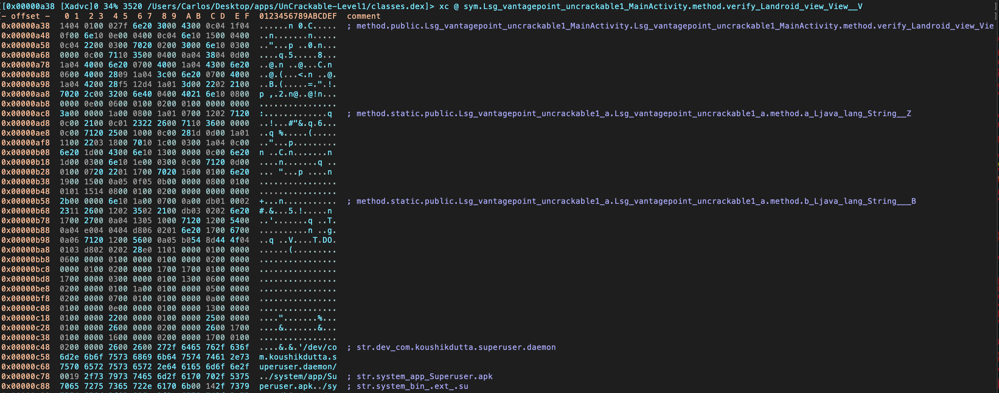
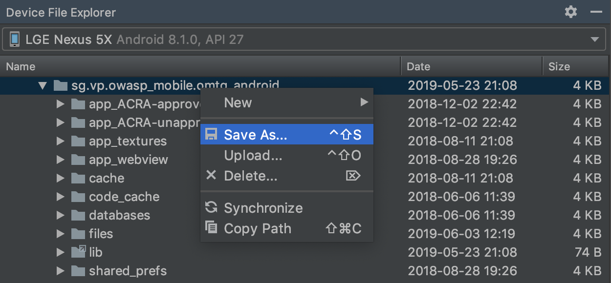
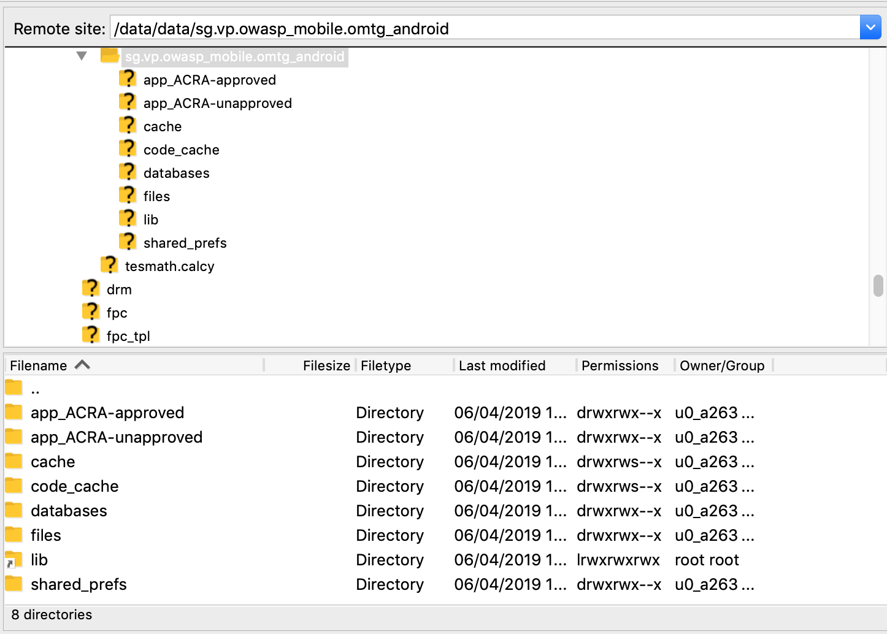

# Android Basic Security Testing

## Basic Android Testing Setup

By now, you should have a basic understanding of the way Android apps are structured and deployed. In this chapter, we'll talk about setting up a security testing environment and describe basic testing processes you'll be using. This chapter is the foundation for the more detailed testing methods discussed in later chapters.

You can set up a fully functioning test environment on almost any machine running Windows, Linux, or Mac OS.

### Host Device

At the very least, you'll need [Android Studio](https://developer.android.com/studio/index.html "Android Studio") (which comes with the Android SDK) platform tools, an emulator, and an app to manage the various SDK versions and framework components. Android Studio also comes with an Android Virtual Device (AVD) Manager application for creating emulator images. Make sure that the newest [SDK tools](https://developer.android.com/studio/releases/sdk-tools) and [platform tools](https://developer.android.com/studio/releases/platform-tools) packages are installed on your system.

In addition, you may want to complete your host setup by installing the [Android NDK](https://developer.android.com/ndk "Android NDK") if you're planing to work with apps containing native libraries (it will be also relevant in the chapter "[Tampering and Reverse Engineering on Android](0x05c-Reverse-Engineering-and-Tampering.md)").

#### Setting up the Android SDK

Local Android SDK installations are managed via Android Studio. Create an empty project in Android Studio and select **Tools** -> **SDK Manager** to open the SDK Manager GUI. The **SDK Platforms** tab is where you install SDKs for multiple API levels. Recent API levels are:

- Android 10.0 (API level 29)
- Android 9.0 (API level 28)
- Android 8.1 (API level 27)
- Android 8.0 (API level 26)

An overview of all Android codenames, their version number and API levels can be found in the [Android Developer Documentation](https://source.android.com/setup/start/build-numbers "Codenames, Tags, and Build Numbers").


Installed SDKs are on the following paths:

Windows:

```bash
C:\Users\<username>\AppData\Local\Android\sdk
```

MacOS:

```bash
/Users/<username>/Library/Android/sdk
```

Note: On Linux, you need to choose an SDK directory. `/opt`, `/srv`, and `/usr/local` are common choices.

#### Setting up the Android NDK

The Android NDK contains prebuilt versions of the native compiler and toolchain. Both the GCC and Clang compilers have traditionally been supported, but active support for GCC ended with NDK revision 14. The device architecture and host OS determine the appropriate version. The prebuilt toolchains are in the `toolchains` directory of the NDK, which contains one subdirectory for each architecture.

|Architecture | Toolchain name|
|------------ | --------------|
|ARM-based|arm-linux-androideabi-&lt;gcc-version&gt;|
|x86-based|x86-&lt;gcc-version&gt;|
|MIPS-based|mipsel-linux-android-&lt;gcc-version&gt;|
|ARM64-based|aarch64-linux-android-&lt;gcc-version&gt;|
|X86-64-based|x86_64-&lt;gcc-version&gt;|
|MIPS64-based|mips64el-linux-android-&lt;gcc-version&gt;|

Besides picking the right architecture, you need to specify the correct sysroot for the native API level you want to target. The sysroot is a directory that contains the system headers and libraries for your target. Native APIs vary by Android API level. Available sysroot directories for each Android API level can be found in `$NDK/platforms/`. Each API level directory contains subdirectories for the various CPUs and architectures.

One possibility for setting up the build system is exporting the compiler path and necessary flags as environment variables. To make things easier, however, the NDK allows you to create a so-called standalone toolchain, which is a temporary toolchain that incorporates the required settings.

To set up a standalone toolchain, download the [latest stable version of the NDK](https://developer.android.com/ndk/downloads/index.html#stable-downloads "Android NDK Downloads"). Extract the ZIP file, change into the NDK root directory, and run the following command:

```bash
$ ./build/tools/make_standalone_toolchain.py --arch arm --api 24 --install-dir /tmp/android-7-toolchain
```

This creates a standalone toolchain for Android 7.0 (API level 24) in the directory `/tmp/android-7-toolchain`. For convenience, you can export an environment variable that points to your toolchain directory, (we'll be using this in the examples). Run the following command or add it to your `.bash_profile` or other startup script:

```bash
$  export TOOLCHAIN=/tmp/android-7-toolchain
```

### Testing Device

For dynamic analysis, you'll need an Android device to run the target app on. In principle, you can test without a real Android device and use only the emulator. However, apps execute quite slowly on a emulator, and simulators may not give realistic results. Testing on a real device makes for a smoother process and a more realistic environment. On the other hand, emulators allow you to easily change SDK versions or create multiple devices. A full overview of the pros and cons of each approach is listed in the table below.

| Property | Physical | Emulator/Simulator |
|---|---|---|
| Ability to restore | Softbricks are always possible, but new firmware can typically still be flashed. Hardbricks are very rare. | Emulators can crash or become corrupt, but a new one can be created or a snapshot can be restored. |
| Reset | Can be restored to factory settings or reflashed. | Emulators can be deleted and recreated. |
| Snapshots | Not possible. | Supported, great for malware analysis. |
| Speed | Much faster than emulators. | Typically slow, but improvements are being made. |
| Cost | Typically start at $200 for a usable device. You may require different devices, such as one with or without a biometric sensor. | Both free and commercial solutions exist. |
| Ease of rooting | Highly dependent on the device. | Typically rooted by default. |
| Ease of emulator detection | It's not an emulator, so emulator checks are not applicable. | Many artefacts will exist, making it easy to detect that the app is running in an emulator. |
| Ease of root detection | Easier to hide root, as many root detection algorithms check for emulator properties. With Magisk Systemless root it's nearly impossible to detect. | Emulators will almost always trigger root detection algorithms due to the fact that they are built for testing with many artefacts that can be found. |
| Hardware interaction | Easy interaction through Bluetooth, NFC, 4G, Wi-Fi, biometrics, camera, GPS, gyroscope, ... | Usually fairly limited, with emulated hardware input (e.g. random GPS coordinates) |
| API level support | Depends on the device and the community. Active communities will keep distributing updated versions (e.g. LineageOS), while less popular devices may only receive a few updates. Switching between versions requires flashing the device, a tedious process. | Always supports the latest versions, including beta releases. Emulators containing specific API levels can easily be downloaded and launched. |
| Native library support | Native libraries are usually built for ARM devices, so they will work on a physical device. | Some emulators run on x86 CPUs, so they may not be able to run packaged native libraries. |
| Malware danger | Malware samples can infect a device, but if you can clear out the device storage and flash a clean firmware, thereby restoring it to factory settings, this should not be a problem. Be aware that there are malware samples that try to exploit the USB bridge. | Malware samples can infect an emulator, but the emulator can simply be removed and recreated. It is also possible to create snapshots and compare different snapshots to help in malware analysis. Be aware that there are malware proofs of concept which try to attack the hypervisor. |

#### Testing on a Real Device

Almost any physical device can be used for testing, but there are a few considerations to be made. First, the device needs to be rootable. This is typically either done through an exploit, or through an unlocked bootloader. Exploits are not always available, and the bootloader may be locked permanently, or it may only be unlocked once the carrier contract has been terminated.

The best candidates are flagship Google pixel devices built for developers. These devices typically come with an unlockable bootloader, opensource firmware, kernel, radio available online and official OS source code. The developer communities prefer Google devices as the OS is closest to the android open source project. These devices generally have the longest support windows with 2 years of OS updates and 1 year of security updates after that.

Alternatively, Google's [Android One](https://www.android.com/one/ "Android One") project contains devices that will receive the same support windows (2 years of OS updates, 1 year of security updates) and have near-stock experiences. While it was originally started as a project for low-end devices, the program has evolved to include mid-range and high-end smartphones, many of which are actively supported by the modding community.

Devices that are supported by the [LineageOS](https://lineageos.org/ "LineageOS") project are also very good candidates for test devices. They have an active community, easy to follow flashing and rooting instructions and the latest Android versions are typically quickly available as a Lineage installation. LineageOS also continues support for new Android versions long after the OEM has stopped distributing updates.

When working with an Android physical device, you'll want to enable Developer Mode and USB debugging on the device in order to use the ADB debugging interface. Since Android 4.2 (API level 16), the **Developer options** sub menu in the Settings app is hidden by default. To activate it, tap the **Build number** section of the **About phone** view seven times. Note that the build number field's location varies slightly by device. For example, on LG Phones, it is under **About phone** -> **Software information**. Once you have done this, **Developer options** will be shown at bottom of the Settings menu. Once developer options are activated, you can enable debugging with the **USB debugging** switch.

#### Testing on an Emulator

Multiple emulators exist, once again with their own strengths and weaknesses:

Free emulators:

- [Android Virtual Device (AVD)](https://developer.android.com/studio/run/managing-avds.html "Create and Manage Virtual Devices") - The official android emulator, distributed with Android Studio.
- [Android X86](https://www.android-x86.org/ "Android X86") - An x86 port of the Android code base

Commercial emulators:

- [Genymotion](https://www.genymotion.com/fun-zone/ "Genymotion") - Mature emulator with many features, both as local and cloud-based solution. Free version available for non-commercial use.
- [Corellium](https://corellium.com/ "Corellium") - Offers custom device virtualization through a cloud-based or on-prem solution.

Although there exist several free Android emulators, we recommend using AVD as it provides enhanced features appropriate for testing your app compared to the others. In the remainder of this guide, we will use the official AVD to perform tests.

AVD supports some hardware emulation, such as [GPS](https://developer.android.com/studio/run/emulator-commandline.html#geo "GPS Emulation"), [SMS](https://developer.android.com/studio/run/emulator-commandline.html#sms "SMS") and [motion sensors](https://developer.android.com/guide/topics/sensors/sensors_overview#test-with-the-android-emulator "Testing motion sensors on emulators").

You can either start an Android Virtual Device (AVD) by using the AVD Manager in Android Studio or start the AVD manager from the command line with the `android` command, which is found in the tools directory of the Android SDK:

```bash
$ ./android avd
```

Several tools and VMs that can be used to test an app within an emulator environment are available:

- [MobSF](https://github.com/MobSF/Mobile-Security-Framework-MobSF "MobSF")
- [Nathan](https://github.com/mseclab/nathan "Nathan") (not updated since 2016)

Please also verify the "[Testing Tools](0x08-Testing-Tools.md)" chapter at the end of this book.

#### Getting Privileged Access

*Rooting* (i.e., modifying the OS so that you can run commands as the root user) is recommended for testing on a real device. This gives you full control over the operating system and allows you to bypass restrictions such as app sandboxing. These privileges in turn allow you to use techniques like code injection and function hooking more easily.

Note that rooting is risky, and three main consequences need to be clarified before you proceed. Rooting can have the following negative effects:

- voiding the device warranty (always check the manufacturer's policy before taking any action)
- "bricking" the device, i.e., rendering it inoperable and unusable
- creating additional security risks (because built-in exploit mitigations are often removed)

You should not root a personal device that you store your private information on. We recommend getting a cheap, dedicated test device instead. Many older devices, such as Google's Nexus series, can run the newest Android versions and are perfectly fine for testing.

**You need to understand that rooting your device is ultimately YOUR decision and that OWASP shall in no way be held responsible for any damage. If you're uncertain, seek expert advice before starting the rooting process.**

##### Which Mobiles Can Be Rooted

Virtually any Android mobile can be rooted. Commercial versions of Android OS (which are Linux OS evolutions at the kernel level) are optimized for the mobile world. Some features have been removed or disabled for these versions, for example, non-privileged users' ability to become the 'root' user (who has elevated privileges). Rooting a phone means allowing users to become the root user, e.g., adding a standard Linux executable called `su`, which is used to change to another user account.

To root a mobile device, first unlock its boot loader. The unlocking procedure depends on the device manufacturer. However, for practical reasons, rooting some mobile devices is more popular than rooting others, particularly when it comes to security testing: devices created by Google and manufactured by companies like Samsung, LG, and Motorola are among the most popular, particularly because they are used by many developers. The device warranty is not nullified when the boot loader is unlocked and Google provides many tools to support the root itself. A curated list of guides for rooting all major brand devices is posted on the [XDA forums](https://www.xda-developers.com/root/ "Guide to rooting mobile devices").

##### Rooting with Magisk

Magisk ("Magic Mask") is one way to root your Android device. It's specialty lies in the way the modifications on the system are performed. While other rooting tools alter the actual data on the system partition, Magisk does not (which is called "systemless"). This enables a way to hide the modifications from root-sensitive applications (e.g. for banking or games) and allows using the official Android OTA upgrades without the need to unroot the device beforehand.

You can get familiar with Magisk reading the official [documentation on GitHub](https://topjohnwu.github.io/Magisk/ "Magisk Documentation"). If you don't have Magisk installed, you can find installation instructions in [the documentation](https://topjohnwu.github.io/Magisk/ "Magisk Documentation"). If you use an official Android version and plan to upgrade it, Magisk provides a [tutorial on GitHub](https://topjohnwu.github.io/Magisk/ota.html "OTA Installation").

Furthermore, developers can use the power of Magisk to create custom modules and [submit](https://github.com/Magisk-Modules-Repo/submission "Submission") them to the official [Magisk Modules repository](https://github.com/Magisk-Modules-Repo "Magisk-Modules-Repo"). Submitted modules can then be installed inside the Magisk Manager application. One of these installable modules is a systemless version of the famous [Xposed Framework](https://repo.xposed.info/module/de.robv.android.xposed.installer "Xposed Installer (framework)") (available for SDK versions up to 27).

##### Root Detection

An extensive list of root detection methods is presented in the "Testing Anti-Reversing Defenses on Android" chapter.

For a typical mobile app security build, you'll usually want to test a debug build with root detection disabled. If such a build is not available for testing, you can disable root detection in a variety of ways that will be introduced later in this book.

### Recommended Tools - Android device

There are many tools and frameworks used throughout this guide to assess the security of Android applications. In the next sections, you will learn more about some of the commands and interesting use cases. Please check the official documentation for installation instructions of the following tools/APKs:

- APK Extractor: App to extract APKs without root.
- Frida server: Server for Frida, the dynamic instrumentation toolkit for developers, reverse-engineers, and security researchers. See [Frida](#frida "Frida section") section below for more information.
- Drozer agent: Agent for drozer, the framework that allows you to search for security vulnerabilities in apps and devices. See [Drozer](#drozer "Drozer section") section below for more information.
- Busybox:  Busybox combines multiple common Unix utilities into a small single executable. The utilities included generally have fewer options than their full-featured GNU counterparts, but are sufficient enough to provide a complete environment on a small or embedded system. Busybox can be installed on a rooted device by downloading the Busybox application from Google Play Store. You can also download the binary directly from the [Busybox website](https://busybox.net "Busybox Website"). Once downloaded, make an `adb push busybox /data/local/tmp` to have the executable available on your phone. A quick overview of how to install and use Busybox can be found in the [Busybox FAQ](https://busybox.net/FAQ.html#getting_started "Busybox FAQ").

#### Xposed

[Xposed](http://repo.xposed.info/module/de.robv.android.xposed.installer "Xposed Installer") is a "framework for modules that can change the behavior of the system and apps without touching any APKs.". Technically, it is an extended version of Zygote that exports APIs for running Java code when a new process is started. Running Java code in the context of the newly instantiated app makes it possible to resolve, hook, and override Java methods belonging to the app. Xposed uses [reflection](https://docs.oracle.com/javase/tutorial/reflect/ "Reflection Tutorial") to examine and modify the running app. Changes are applied in memory and persist only during the process' runtime since the application binaries are not modified.

To use Xposed, you need to first install the Xposed framework on a rooted device as explained on [XDA-Developers Xposed framework hub](https://www.xda-developers.com/xposed-framework-hub/ "Xposed framework hub from XDA"). Modules can be installed through the Xposed Installer app, and they can be toggled on and off through the GUI.

Note: given that a plain installation of the Xposed framework is easily detected with SafetyNet, we recommend using Magisk to install Xposed. This way, applications with SafetyNet attestation should have a higher chance of being testable with Xposed modules.

Xposed has been compared to Frida. When you run Frida server on a rooted device, you will end up with a similarly effective setup. Both frameworks deliver a lot of value when you want to do dynamic instrumentation. When Frida crashes the app, you can try something similar with Xposed. Next, similar to the abundance of Frida scripts, you can easily use one of the many modules that come with Xposed, such as the earlier discussed module to bypass SSL pinning ([JustTrustMe](https://github.com/Fuzion24/JustTrustMe "JustTrustMe") and [SSLUnpinning](https://github.com/ac-pm/SSLUnpinning_Xposed "SSL Unpinning")). Xposed includes other modules, such as [Inspeckage](https://github.com/ac-pm/Inspeckage "Inspeckage") which allow you to do more in depth application testing as well. On top of that, you can create your own modules as well to patch often used security mechanisms of Android applications.

Xposed can also be installed on an emulator through the following script:

```bash
#!/bin/sh
echo "Start your emulator with 'emulator -avd NAMEOFX86A8.0 -writable-system -selinux permissive -wipe-data'"
adb root && adb remount
adb install SuperSU\ v2.79.apk #binary can be downloaded from http://www.supersu.com/download
adb push root_avd-master/SuperSU/x86/su /system/xbin/su
adb shell chmod 0755 /system/xbin/su
adb shell setenforce 0
adb shell su --install
adb shell su --daemon&
adb push busybox /data/busybox #binary can be downloaded from https://busybox.net/
# adb shell "mount -o remount,rw /system && mv /data/busybox /system/bin/busybox && chmod 755 /system/bin/busybox && /system/bin/busybox --install /system/bin"
adb shell chmod 755 /data/busybox
adb shell 'sh -c "./data/busybox --install /data"'
adb shell 'sh -c "mkdir /data/xposed"'
adb push xposed8.zip /data/xposed/xposed.zip #can be downloaded from https://dl-xda.xposed.info/framework/
adb shell chmod 0755 /data/xposed
adb shell 'sh -c "./data/unzip /data/xposed/xposed.zip -d /data/xposed/"'
adb shell 'sh -c "cp /data/xposed/xposed/META-INF/com/google/android/*.* /data/xposed/xposed/"'
echo "Now adb shell and do 'su', next: go to ./data/xposed/xposed, make flash-script.sh executable and run it in that directory after running SUperSU"
echo "Next, restart emulator"
echo "Next, adb install XposedInstaller_3.1.5.apk"
echo "Next, run installer and then adb reboot"
echo "Want to use it again? Start your emulator with 'emulator -avd NAMEOFX86A8.0 -writable-system -selinux permissive'"
```

Please note that Xposed, at the time of this writing, does not work on Android 9 (API level 28). However, it was unofficially ported in 2019 under the name EdXposed, supporting Android 8-10 (API level 26 till 29). You can find the code and usage examples at [EdXposed](https://github.com/ElderDrivers/EdXposed "EdXposed") Github repo.

### Recommended Tools - Host computer

In order to analyze Android apps, you should install the following tools on your host computer. Please check the official documentation for installation instructions of the following tools/frameworks. We'll be referring to them throughout the guide.

#### Adb

[adb](https://developer.android.com/studio/command-line/adb "Android Debug Bridge") (Android Debug Bridge), shipped with the Android SDK, bridges the gap between your local development environment and a connected Android device. You'll usually leverage it to test apps on the emulator or a connected device via USB or Wi-Fi. Use the `adb devices` command to list the connected devices and execute it with the `-l` argument to retrieve more details on them.

```bash
$ adb devices -l
List of devices attached
090c285c0b97f748 device usb:1-1 product:razor model:Nexus_7 device:flo
emulator-5554    device product:sdk_google_phone_x86 model:Android_SDK_built_for_x86 device:generic_x86 transport_id:1
```

adb provides other useful commands such as `adb shell` to start an interactive shell on a target and `adb forward` to forward traffic on a specific host port to a different port on a connect device.

```bash
$ adb forward tcp:<host port> tcp:<device port>
```

```bash
$ adb -s emulator-5554 shell
root@generic_x86:/ # ls
acct
cache
charger
config
...
```

You'll come across different use cases on how you can use adb commands when testing later in this book. Note that you must define the serialnummer of the target device with the `-s` argument (as shown by the previous code snippet) in case you have multiple devices connected.

#### Angr

Angr is a Python framework for analyzing binaries. It is useful for both static and dynamic symbolic ("concolic") analysis. In other words: given a binary and a requested state, Angr will try to get to that state, using formal methods (a technique used for static code analysis) to find a path, as well as brute forcing. Using angr to get to the requested state is often much faster than taking manual steps for debugging and searching the path towards the required state. Angr operates on the VEX intermediate language and comes with a loader for ELF/ARM binaries, so it is perfect for dealing with native code, such as native Android binaries.

Angr allows for disassembly, program instrumentation, symbolic execution, control-flow analysis, data-dependency analysis, decompilation and more, given a large set of plugins.

Since version 8, Angr is based on Python 3, and can be installed with pip on \*nix operating systems, macOS and Windows:

```bash
$ pip install angr
```

> Some of angr's dependencies contain forked versions of the Python modules Z3 and PyVEX, which would overwrite the original versions. If you're using those modules for anything else, you should create a dedicated virtual environment with [Virtualenv](https://docs.python.org/3/tutorial/venv.html "Virtualenv documentation"). Alternatively, you can always use the provided docker container. See the [installation guide](https://docs.angr.io/introductory-errata/install "angr Installation Guide") for more details.

Comprehensive documentation, including an installation guide, tutorials, and usage examples are available on [Angr's Gitbooks page](https://docs.angr.io/ "angr"). A complete [API reference](https://angr.io/api-doc/ "angr API") is also available.

You can use angr from a Python REPL - such as iPython - or script your approaches. Although angr has a bit of a steep learning curve, we do recommend using it when you want to brute force your way to a given state of an executable. Please see the "[Symbolic Execution](0x05c-Reverse-Engineering-and-Tampering.md#symbolic-execution "Symbolic Execution")" section of the "Reverse Engineering and Tampering" chapter as a great example on how this can work.

#### Apktool

[Apktool](https://github.com/iBotPeaches/Apktool) is used to unpack Android app packages (APKs). Simply unzipping APKs with the standard `unzip` utility leaves some files unreadable. `AndroidManifest.xml` is encoded into binary XML format which isn’t readable with a text editor. Also, the app resources are still packaged into a single archive file.

When run with default command line flags, apktool automatically decodes the Android Manifest file to text-based XML format and extracts the file resources (it also disassembles the .DEX files to smali code - a feature that we’ll revisit later in this book).

```bash
$ apktool d base.apk
I: Using Apktool 2.1.0 on base.apk
I: Loading resource table...
I: Decoding AndroidManifest.xml with resources...
I: Loading resource table from file: /Users/sven/Library/apktool/framework/1.apk
I: Regular manifest package...
I: Decoding file-resources...
I: Decoding values */* XMLs...
I: Baksmaling classes.dex...
I: Copying assets and libs...
I: Copying unknown files...
I: Copying original files...
$ cd base
$ ls -alh
total 32
drwxr-xr-x    9 sven  staff   306B Dec  5 16:29 .
drwxr-xr-x    5 sven  staff   170B Dec  5 16:29 ..
-rw-r--r--    1 sven  staff    10K Dec  5 16:29 AndroidManifest.xml
-rw-r--r--    1 sven  staff   401B Dec  5 16:29 apktool.yml
drwxr-xr-x    6 sven  staff   204B Dec  5 16:29 assets
drwxr-xr-x    3 sven  staff   102B Dec  5 16:29 lib
drwxr-xr-x    4 sven  staff   136B Dec  5 16:29 original
drwxr-xr-x  131 sven  staff   4.3K Dec  5 16:29 res
drwxr-xr-x    9 sven  staff   306B Dec  5 16:29 smali
```

The unpacked files are:

- AndroidManifest.xml: The decoded Android Manifest file, which can be opened and edited in a text editor.
- apktool.yml: file containing information about the output of apktool
- original: folder containing the MANIFEST.MF file, which contains information about the files contained in the JAR file
- res: directory containing the app’s resources
- smali: directory containing the disassembled Dalvik bytecode.

You can also use apktool to repackage decoded resources back to binary APK/JAR. See the section "[Exploring the App Package](#exploring-the-app-package "Exploring the App Package")" later on this chapter and section "[Repackaging](0x05c-Reverse-Engineering-and-Tampering.md#repackaging "Repackaging")" in the chapter [Tampering and Reverse Engineering on Android](0x05c-Reverse-Engineering-and-Tampering.md) for more information and practical examples.

#### Apkx

`Apkx` is a Python wrapper to popular free DEX converters and Java decompilers. It automates the extraction, conversion, and decompilation of APKs. Install it as follows:

```bash
$ git clone https://github.com/b-mueller/apkx
$ cd apkx
$ sudo ./install.sh
```

This should copy `apkx` to `/usr/local/bin`. See section "[Decompiling Java Code](0x05c-Reverse-Engineering-and-Tampering.md#decompiling-java-code "Decompiling Java Code")" of the "Reverse Engineering and Tampering" chapter for more information about usage.

#### Burp Suite

Burp Suite is an integrated platform for security testing mobile and web applications. Its tools work together seamlessly to support the entire testing process, from initial mapping and analysis of attack surfaces to finding and exploiting security vulnerabilities. Burp Proxy operates as a web proxy server for Burp Suite, which is positioned as a man-in-the-middle between the browser and web server(s). Burp Suite allows you to intercept, inspect, and modify incoming and outgoing raw HTTP traffic.

Setting up Burp to proxy your traffic is pretty straightforward. We assume that both your iOS device and host computer are connected to a Wi-Fi network that permits client-to-client traffic.

PortSwigger provides a good [tutorial on setting up an Android device to work with Burp](https://support.portswigger.net/customer/portal/articles/1841101-configuring-an-android-device-to-work-with-burp "Configuring an Android Device to Work With Burp") and a [tutorial on installing Burp's CA certificate to an Android device](https://support.portswigger.net/customer/portal/articles/1841102-installing-burp-s-ca-certificate-in-an-android-device "Installing Burp\'s CA Certificate in an Android Device").

#### Drozer

[Drozer](https://github.com/FSecureLABS/drozer "Drozer on GitHub") is an Android security assessment framework that allows you to search for security vulnerabilities in apps and devices by assuming the role of a third-party app interacting with the other application's IPC endpoints and the underlying OS.

The advantage of using drozer consists on its ability to automate several tasks and that it can be expanded through modules. The modules are very helpful and they cover different categories including a scanner category that allows you to scan for known defects with a simple command such as the module `scanner.provider.injection` which detects SQL injections in content providers in all the apps installed in the system. Without drozer, simple tasks such as listing the app's permissions require several steps that include decompiling the APK and manually analyzing the results.

##### Installing Drozer

You can refer to [drozer GitHub page](https://github.com/FSecureLABS/drozer "Drozer on GitHub") (for Linux and Windows, for macOS please refer to this [blog post](https://fi5t.xyz/en/posts/drozer-on-mac/ "(not)Unique experience blog - Installing Drozer on macOS Catalina")) and the [drozer website](https://labs.f-secure.com/tools/drozer/ "Drozer Website") for prerequisites and installation instructions.

##### Using Drozer

Before you can start using drozer, you'll also need the drozer agent that runs on the Android device itself. Download the latest drozer agent [from the GitHub releases page](https://github.com/FSecureLABS/drozer/releases/ "drozer GitHub releases") and install it with `adb install drozer.apk`.

Once the setup is completed you can start a session to an emulator or a device connected per USB by running `adb forward tcp:31415 tcp:31415` and `drozer console connect`. This is called direct mode and you can see the full instructions in the [User Guide in section "Starting a Session"](https://labs.f-secure.com/assets/BlogFiles/mwri-drozer-user-guide-2015-03-23.pdf "Starting a Session"). An alternative is to run Drozer in infrastructure mode, where, you are running a drozer server that can handle multiple consoles and agents, and routes sessions between them. You can find the details of how to setup drozer in this mode in the ["Infrastructure Mode"](https://labs.f-secure.com/assets/BlogFiles/mwri-drozer-user-guide-2015-03-23.pdf "Infrastructure Mode") section of the User Guide.

Now you are ready to begin analyzing apps. A good first step is to enumerate the attack surface of an app which can be done easily with the following command:

```bash
$ dz> run app.package.attacksurface <package>
```

Again, without drozer this would have required several steps. The module `app.package.attacksurface` lists activities, broadcast receivers, content providers and services that are exported, hence, they are public and can be accessed through other apps. Once we have identified our attack surface, we can interact with the IPC endpoints through drozer without having to write a separate standalone app as it would be required for certain tasks such as communicating with a content provider.

For example, if the app has an exported Activity that leaks sensitive information we can invoke it with the Drozer module `app.activity.start`:

```bash
$ dz> run app.activity.start --component <package> <component name>
```

This previous command will start the activity, hopefully leaking some sensitive information. Drozer has modules for every type of IPC mechanism. Download [InsecureBankv2](https://github.com/dineshshetty/Android-InsecureBankv2 "InsecureBankv2 APK") if you would like to try the modules with an intentionally vulnerable application that illustrates common problems related to IPC endpoints. Pay close attention to the modules in the scanner category as they are very helpful automatically detecting vulnerabilities even in system packages, specially if you are using a ROM provided by your cellphone company. Even [SQL injection vulnerabilities in system packages by Google](https://issuetracker.google.com/u/0/issues/36965126 "SQL injection in Android") have been identified in the past with drozer.

##### Other Drozer commands

Here's a non-exhaustive list of commands you can use to start exploring on Android:

```bash
# List all the installed packages
$ dz> run app.package.list

# Find the package name of a specific app
$ dz> run app.package.list -f (string to be searched)

# See basic information
$ dz> run app.package.info -a (package name)

# Identify the exported application components
$ dz> run app.package.attacksurface (package name)

# Identify the list of exported Activities
$ dz> run app.activity.info -a (package name)

# Launch the exported Activities
$ dz> run app.activity.start --component (package name) (component name)

# Identify the list of exported Broadcast receivers
$ dz> run app.broadcast.info -a (package name)

# Send a message to a Broadcast receiver
$ dz> run app.broadcast.send --action (broadcast receiver name) -- extra (number of arguments)

# Detect SQL injections in content providers
$ dz> run scanner.provider.injection -a (package name)
```

##### Other Drozer resources

Other resources where you might find useful information are:

- [Official drozer User Guide](https://labs.f-secure.com/assets/BlogFiles/mwri-drozer-user-guide-2015-03-23.pdf "Drozer User Guide").
- [drozer GitHub page](https://github.com/FSecureLABS/drozer "GitHub repo")
- [drozer Wiki](https://github.com/FSecureLABS/drozer/wiki "drozer Wiki")

#### Frida

[Frida](https://www.frida.re "Frida") is a free and open-source dynamic code instrumentation toolkit that lets you execute snippets of JavaScript into your native apps. It was already introduced in the chapter "[Tampering and Reverse Engineering](0x04c-Tampering-and-Reverse-Engineering.md#frida "Frida")" of the general testing guide.

Frida supports interaction with the Android Java runtime though the [Java API](https://www.frida.re/docs/javascript-api/#java "Frida - Java API"). You'll be able to hook and call both Java and native functions inside the process and its native libraries. Your JavaScript snippets have full access to memory, e.g. to read and/or write any structured data.

Here are some tasks that Frida APIs offers and are relevant or exclusive on Android:

- Instantiate Java objects and call static and non-static class methods ([Java API](https://www.frida.re/docs/javascript-api/#java "Frida - Java API")).
- Replace Java method implementations ([Java API](https://www.frida.re/docs/javascript-api/#java "Frida - Java API")).
- Enumerate live instances of specific classes by scanning the Java heap ([Java API](https://www.frida.re/docs/javascript-api/#java "Frida - Java API")).
- Scan process memory for occurrences of a string ([Memory API](https://www.frida.re/docs/javascript-api/#memory "Frida - Memory API")).
- Intercept native function calls to run your own code at function entry and exit ([Interceptor API](https://www.frida.re/docs/javascript-api/#interceptor "Frida - Interceptor API")).

Remember that on Android, you can also benefit from the built-in tools provided when installing Frida, that includes the Frida CLI (`frida`), `frida-ps`, `frida-ls-devices` and `frida-trace`, to name some of them.

Frida is often compared to Xposed, however this comparison is far from fair as both frameworks were designed with different goals in mind. This is important to understand as an app security tester so that you can know which framework to use in which situation:

- Frida is standalone, all you need is to run the frida-server binary from a known location in your target Android device (see "Installing Frida" below). This means that, in contrast to Xposed, it is not _deep_ installed in the target OS.
- Reversing an app is an iterative process. As a consequence of the previous point, you obtain a shorter feedback loop when testing as you don't need to (soft) reboot to apply or simply update your hooks. So you might prefer to use Xposed when implementing more permanent hooks.
- You may inject and update your Frida JavaScript code on the fly at any point during the runtime of your process (similarly to Cycript on iOS). This way you can perform the so-called _early instrumentation_ by letting Frida spawn your app or you may prefer to attach to a running app that you might have brought to a certain state.
- Frida is able to handle both Java as well as native code (JNI), allowing you to modify both of them. This is unfortunately a limitation of Xposed which lacks of native code support.

> Note that Xposed, as of early 2019, does not work on Android 9 (API level 28) yet.

##### Installing Frida

To install Frida locally, simply run:

```bash
$ pip install frida-tools
```

Or refer to the [installation page](https://www.frida.re/docs/installation/ "Frida Installation") for more details.

The next step is to set up Frida on your Android device:

- If your device is not rooted, you can also use Frida, please refer to section "[Dynamic Analysis on Non-Rooted Devices](0x05c-Reverse-Engineering-and-Tampering.md#dynamic-analysis-on-non-rooted-devices "Dynamic Analysis on Non-Rooted Devices")" of the "Reverse Engineering and Tampering" chapter.
- If you have a rooted device, simply follow the [official instructions](https://www.frida.re/docs/android/ "Frida - Setting up your Android device") or follow the hints below.

We assume a rooted device here unless otherwise noted. Download the frida-server binary from the [Frida releases page](https://github.com/frida/frida/releases). Make sure that you download the right frida-server binary for the architecture of your Android device or emulator: x86, x86_64, arm or arm64. Make sure that the server version (at least the major version number) matches the version of your local Frida installation. PyPI usually installs the latest version of Frida. If you're unsure which version is installed, you can check with the Frida command line tool:

```bash
$ frida --version
```

Or you can run the following command to automatically detect Frida version and download the right frida-server binary:

```bash
$ wget https://github.com/frida/frida/releases/download/$(frida --version)/frida-server-$(frida --version)-android-arm.xz
```

Copy frida-server to the device and run it:

```bash
$ adb push frida-server /data/local/tmp/
$ adb shell "chmod 755 /data/local/tmp/frida-server"
$ adb shell "su -c /data/local/tmp/frida-server &"
```

##### Using Frida on Android

With frida-server running, you should now be able to get a list of running processes with the following command (use the `-U` option to indicate Frida to use a connected USB devices or emulator):

```bash
$ frida-ps -U
  PID  Name
-----  --------------------------------------------------------------
  276  adbd
  956  android.process.media
  198  bridgemgrd
30692  com.android.chrome
30774  com.android.chrome:privileged_process0
30747  com.android.chrome:sandboxed
30834  com.android.chrome:sandboxed
 3059  com.android.nfc
 1526  com.android.phone
17104  com.android.settings
 1302  com.android.systemui
(...)
```

Or restrict the list with the `-Uai` flag combination to get all apps (`-a`) currently installed (`-i`) on the connected USB device (`-U`):

```bash
$ frida-ps -Uai
  PID  Name                                      Identifier
-----  ----------------------------------------  ------------------------------
  766  Android System                            android
30692  Chrome                                    com.android.chrome
 3520  Contacts Storage                          com.android.providers.contacts
    -  Uncrackable1                              sg.vantagepoint.uncrackable1
    -  drozer Agent                              com.mwr.dz
```

This will show the names and identifiers of all apps, if they are currently running it will also show their PIDs. Search for your app in the list and take a note of the PID or its name/identifier. From now on you'll refer to your app by using one of them. A recommendation is to use the identifiers, as the PIDs will change on each run of the app. For example let's take `com.android.chrome`. You can use this string now on all Frida tools, e.g. on the Frida CLI, on frida-trace or from a Python script.

##### Tracing Native Libraries with frida-trace

To trace specific (low-level) library calls, you can use the `frida-trace` command line tool:

```bash
$ frida-trace -U com.android.chrome -i "open"
```

This generates a little JavaScript in `__handlers__/libc.so/open.js`, which Frida injects into the process. The script traces all calls to the `open` function in `libc.so`. You can modify the generated script according to your needs with Frida [JavaScript API](https://www.frida.re/docs/javascript-api/).

Unfortunately tracing high-level methods of Java classes is not yet supported (but might be [in the future](https://github.com/frida/frida-python/issues/70 "Support for tracing high-level methods of Java Classes via patterns")).

##### Frida CLI and the Java API

Use the Frida CLI tool (`frida`) to work with Frida interactively. It hooks into a process and gives you a command line interface to Frida's API.

```bash
$ frida -U com.android.chrome
```

With the `-l` option, you can also use the Frida CLI to load scripts , e.g., to load `myscript.js`:

```bash
$ frida -U -l myscript.js com.android.chrome
```

Frida also provides a [Java API](https://www.frida.re/docs/javascript-api/#java "Frida - Java API"), which is especially helpful for dealing with Android apps. It lets you work with Java classes and objects directly. Here is a script to overwrite the `onResume` function of an Activity class:

```java
Java.perform(function () {
    var Activity = Java.use("android.app.Activity");
    Activity.onResume.implementation = function () {
        console.log("[*] onResume() got called!");
        this.onResume();
    };
});
```

The above script calls `Java.perform` to make sure that your code gets executed in the context of the Java VM. It instantiates a wrapper for the `android.app.Activity` class via `Java.use` and overwrites the `onResume` function. The new `onResume` function implementation prints a notice to the console and calls the original `onResume` method by invoking `this.onResume` every time an activity is resumed in the app.

Frida also lets you search for and work with instantiated objects that are on the heap. The following script searches for instances of `android.view.View` objects and calls their `toString` method. The result is printed to the console:

```java
setImmediate(function() {
    console.log("[*] Starting script");
    Java.perform(function () {
        Java.choose("android.view.View", {
             "onMatch":function(instance){
                  console.log("[*] Instance found: " + instance.toString());
             },
             "onComplete":function() {
                  console.log("[*] Finished heap search")
             }
        });
    });
});
```

The output would look like this:

```bash
[*] Starting script
[*] Instance found: android.view.View{7ccea78 G.ED..... ......ID 0,0-0,0 #7f0c01fc app:id/action_bar_black_background}
[*] Instance found: android.view.View{2809551 V.ED..... ........ 0,1731-0,1731 #7f0c01ff app:id/menu_anchor_stub}
[*] Instance found: android.view.View{be471b6 G.ED..... ......I. 0,0-0,0 #7f0c01f5 app:id/location_bar_verbose_status_separator}
[*] Instance found: android.view.View{3ae0eb7 V.ED..... ........ 0,0-1080,63 #102002f android:id/statusBarBackground}
[*] Finished heap search
```

You can also use Java's reflection capabilities. To list the public methods of the `android.view.View` class, you could create a wrapper for this class in Frida and call `getMethods` from the wrapper's `class` property:

```java
Java.perform(function () {
    var view = Java.use("android.view.View");
    var methods = view.class.getMethods();
    for(var i = 0; i < methods.length; i++) {
        console.log(methods[i].toString());
    }
});
```

This will print a very long list of methods to the terminal:

```java
public boolean android.view.View.canResolveLayoutDirection()
public boolean android.view.View.canResolveTextAlignment()
public boolean android.view.View.canResolveTextDirection()
public boolean android.view.View.canScrollHorizontally(int)
public boolean android.view.View.canScrollVertically(int)
public final void android.view.View.cancelDragAndDrop()
public void android.view.View.cancelLongPress()
public final void android.view.View.cancelPendingInputEvents()
...
```

##### Frida Bindings

In order to extend the scripting experience, Frida offers bindings to programming languages such as Python, C, NodeJS, and Swift.

Taking Python as an example, the first thing to note is that no further installation steps are required. Start your Python script with `import frida` and you're ready to go. See the following script that simply runs the previous JavaScript snippet:

```python
# frida_python.py
import frida

session = frida.get_usb_device().attach('com.android.chrome')

source = """
Java.perform(function () {
    var view = Java.use("android.view.View");
    var methods = view.class.getMethods();
    for(var i = 0; i < methods.length; i++) {
        console.log(methods[i].toString());
    }
});
"""

script = session.create_script(source)
script.load()

session.detach()
```

In this case, running the Python script (`python3 frida_python.py`) has the same result as the previous example: it will print all methods of the `android.view.View` class to the terminal. However, you might want to work with that data from Python. Using `send` instead of `console.log` will send data in JSON format from JavaScript to Python. Please read the comments in the example below:

```python
# python3 frida_python_send.py
import frida

session = frida.get_usb_device().attach('com.android.chrome')

# 1. we want to store method names inside a list
android_view_methods = []

source = """
Java.perform(function () {
    var view = Java.use("android.view.View");
    var methods = view.class.getMethods();
    for(var i = 0; i < methods.length; i++) {
        send(methods[i].toString());
    }
});
"""

script = session.create_script(source)

# 2. this is a callback function, only method names containing "Text" will be appended to the list
def on_message(message, data):
    if "Text" in message['payload']:
        android_view_methods.append(message['payload'])

# 3. we tell the script to run our callback each time a message is received
script.on('message', on_message)

script.load()

# 4. we do something with the collected data, in this case we just print it
for method in android_view_methods:
    print(method)

session.detach()
```

This effectively filters the methods and prints only the ones containing the string "Text":

```java
$ python3 frida_python_send.py
public boolean android.view.View.canResolveTextAlignment()
public boolean android.view.View.canResolveTextDirection()
public void android.view.View.setTextAlignment(int)
public void android.view.View.setTextDirection(int)
public void android.view.View.setTooltipText(java.lang.CharSequence)
...
```

In the end, it is up to you to decide where would you like to work with the data. Sometimes it will be more convenient to do it from JavaScript and in other cases Python will be the best choice. Of course you can also send messages from Python to JavaScript by using `script.post`. Refer to the Frida docs for more information about [sending](https://www.frida.re/docs/messages/#sending-messages-from-a-target-process "Sending messages from a target process") and [receiving](https://www.frida.re/docs/messages/#receiving-messages-in-a-target-process "Receiving messages in a target process") messages.

#### House

[House](https://github.com/nccgroup/house "House") is a runtime mobile application analysis toolkit for Android apps, developed and maintained by the NCC Group and is written in Python.

It's leveraging a running Frida server on a rooted device or the Frida gadget in a repackaged Android app. The intention of House is to allow an easy way of prototyping Frida scripts via its convenient web GUI.

The installation instructions and "how-to guide" of House can be found in the [Readme of the Github repo](https://github.com/nccgroup/house "Github Repo of House").

#### Magisk

`Magisk` ("Magic Mask") is one way to root your Android device. It's specialty lies in the way the modifications on the system are performed. While other rooting tools alter the actual data on the system partition, Magisk does not (which is called "systemless"). This enables a way to hide the modifications from root-sensitive applications (e.g. for banking or games) and allows using the official Android OTA upgrades without the need to unroot the device beforehand.

You can get familiar with Magisk reading the official [documentation on GitHub](https://topjohnwu.github.io/Magisk/ "Magisk Documentation"). If you don't have Magisk installed, you can find installation instructions in [the documentation](https://topjohnwu.github.io/Magisk/install.html "Magisk Installation"). If you use an official Android version and plan to upgrade it, Magisk provides a [tutorial on GitHub](https://topjohnwu.github.io/Magisk/ota.html "OTA Installation").

Learn more about [rooting your device with Magisk](#rooting-with-magisk "Rooting with Magisk").

#### MobSF

[MobSF](https://github.com/MobSF/Mobile-Security-Framework-MobSF "MobSF") is an automated, all-in-one mobile application pentesting framework that also supports Android APK files. The easiest way of getting MobSF started is via Docker.

```bash
$ docker pull opensecurity/mobile-security-framework-mobsf
$ docker run -it -p 8000:8000 opensecurity/mobile-security-framework-mobsf:latest
```

Or install and start it locally on your host computer by running:

```bash
# Setup
git clone https://github.com/MobSF/Mobile-Security-Framework-MobSF.git
cd Mobile-Security-Framework-MobSF
./setup.sh # For Linux and Mac
setup.bat # For Windows

# Installation process
./run.sh # For Linux and Mac
run.bat # For Windows
```

Once you have MobSF up and running you can open it in your browser by navigating to <http://127.0.0.1:8000>. Simply drag the APK you want to analyze into the upload area and MobSF will start its job.

After MobSF is done with its analysis, you will receive a one-page overview of all the tests that were executed. The page is split up into multiple sections giving some first hints on the attack surface of the application.


The following is displayed:

- Basic information about the app and its binary file.
- Some options to:
  - View the `AndroidManifest.xml` file.
  - View the IPC components of the app.
- Signer certificate.
- App permissions.
- A security analysis showing known defects e.g. if the app backups are enabled.
- List of libraries used by the app binary and list of all files inside the unzipped APK.
- Malware analysis that checks for malicious URLs.

Refer to [MobSF documentation](https://github.com/MobSF/Mobile-Security-Framework-MobSF/wiki/1.-Documentation "MobSF documentation") for more details.

#### Objection

[Objection](https://github.com/sensepost/objection "Objection on GitHub") is a "runtime mobile exploration toolkit, powered by Frida". Its main goal is to allow security testing on non-rooted devices through an intuitive interface.

Objection achieves this goal by providing you with the tools to easily inject the Frida gadget into an application by repackaging it. This way, you can deploy the repackaged app to the non-rooted device by sideloading it and interact with the application as explained in the previous section.

However, Objection also provides a REPL that allows you to interact with the application, giving you the ability to perform any action that the application can perform. A full list of the features of Objection can be found on the project's homepage, but here are a few interesting ones:

- Repackage applications to include the Frida gadget
- Disable SSL pinning for popular methods
- Access application storage to download or upload files
- Execute custom Frida scripts
- List the Activities, Services and Broadcast receivers
- Start Activities

The ability to perform advanced dynamic analysis on non-rooted devices is one of the features that makes Objection incredibly useful. An application may contain advanced RASP controls which detect your rooting method and injecting a frida-gadget may be the easiest way to bypass those controls. Furthermore, the included Frida scripts make it very easy to quickly analyze an application, or get around basic security controls.

Finally, in case you do have access to a rooted device, Objection can connect directly to the running Frida server to provide all its functionality without needing to repackage the application.

##### Installing Objection

Objection can be installed through pip as described on [Objection's Wiki](https://github.com/sensepost/objection/wiki/Installation "Objection Wiki - Installation").

```bash
$ pip3 install objection
```

If your device is jailbroken, you are now ready to interact with any application running on the device and you can skip to the "Using Objection" section below.

However, if you want to test on a non-rooted device, you will first need to include the Frida gadget in the application. The [Objection Wiki](https://github.com/sensepost/objection/wiki/Patching-Android-Applications "Patching Android Applications") describes the needed steps in detail, but after making the right preparations, you'll be able to patch an APK by calling the objection command:

```bash
$ objection patchapk --source app-release.apk
```

The patched application then needs to be installed using adb, as explained in "Basic Testing Operations - Installing Apps".

##### Using Objection

Starting up Objection depends on whether you've patched the APK or whether you are using a rooted device running Frida-server. For running a patched APK, objection will automatically find any attached devices and search for a listening Frida gadget. However, when using frida-server, you need to explicitly tell frida-server which application you want to analyze.

```bash
# Connecting to a patched APK
objection explore

# Find the correct name using frida-ps
$ frida-ps -Ua | grep -i telegram
30268  Telegram                               org.telegram.messenger

# Connecting to the Telegram app through Frida-server
$ objection --gadget="org.telegram.messenger" explore
```

Once you are in the Objection REPL, you can execute any of the available commands. Below is an overview of some of the most useful ones:

```bash
# Show the different storage locations belonging to the app
$ env

# Disable popular ssl pinning methods
$ android sslpinning disable

# List items in the keystore
$ android keystore list

# Try to circumvent root detection
$ android root disable

```

More information on using the Objection REPL can be found on the [Objection Wiki](https://github.com/sensepost/objection/wiki/Using-objection "Using Objection")

#### radare2

[radare2](https://rada.re/r/ "Radare2 official website") (r2) is a popular open source reverse engineering framework for disassembling, debugging, patching and analyzing binaries that is scriptable and supports many architectures and file formats including Android and iOS apps. For Android, Dalvik DEX (odex, multidex), ELF (executables, .so, ART) and Java (JNI and Java classes) are supported. It also contains several useful scripts that can help you during mobile application analysis as it offers low level disassembling and safe static analysis that comes in handy when traditional tools fail.

radare2 implements a rich command line interface (CLI) where you can perform the mentioned tasks. However, if you're not really comfortable using the CLI for reverse engineering you may want to consider using the Web UI (via the `-H` flag) or the even more convenient Qt and C++ GUI version called [Cutter](https://github.com/radareorg/cutter "Cutter"). Do keep in mind that the CLI, and more concretely its Visual Mode and its scripting capabilities ([r2pipe](https://github.com/radare/radare2-r2pipe "r2pipe")), are the core of radare2's power and it's definitely worth learning how to use it.

##### Installing radare2

Please refer to [radare2's official installation instructions](https://github.com/radare/radare2/blob/master/README.md "radare2 installation instructions"). We highly recommend to always install radare2 from the GitHub version instead of via common package managers such as APT. Radare2 is in very active development, which means that third party repositories are often outdated.

##### Using radare2

The radare2 framework comprises a set of small utilities that can be used from the r2 shell or independently as CLI tools. These utilities include `rabin2`, `rasm2`, `rahash2`, `radiff2`, `rafind2`, `ragg2`, `rarun2`, `rax2`, and of course `r2`, which is the main one.

For example, you can use `rafind2` to read strings directly from an encoded Android Manifest (AndroidManifest.xml):

```bash
# Permissions
$ rafind2 -ZS permission AndroidManifest.xml
# Activities
$ rafind2 -ZS activity AndroidManifest.xml
# Content providers
$ rafind2 -ZS provider AndroidManifest.xml
# Services
$ rafind2 -ZS service AndroidManifest.xml
# Receivers
$ rafind2 -ZS receiver AndroidManifest.xml
```

Or use `rabin2` to get information about a binary file:

```bash
$ rabin2 -I UnCrackable-Level1/classes.dex
arch     dalvik
baddr    0x0
binsz    5528
bintype  class
bits     32
canary   false
retguard false
class    035
crypto   false
endian   little
havecode true
laddr    0x0
lang     dalvik
linenum  false
lsyms    false
machine  Dalvik VM
maxopsz  16
minopsz  1
nx       false
os       linux
pcalign  0
pic      false
relocs   false
sanitiz  false
static   true
stripped false
subsys   java
va       true
sha1  12-5508c  b7fafe72cb521450c4470043caa332da61d1bec7
adler32  12-5528c  00000000
```

Type `rabin2 -h` to see all options:

```bash
$ rabin2 -h
Usage: rabin2 [-AcdeEghHiIjlLMqrRsSUvVxzZ] [-@ at] [-a arch] [-b bits] [-B addr]
              [-C F:C:D] [-f str] [-m addr] [-n str] [-N m:M] [-P[-P] pdb]
              [-o str] [-O str] [-k query] [-D lang symname] file
 -@ [addr]       show section, symbol or import at addr
 -A              list sub-binaries and their arch-bits pairs
 -a [arch]       set arch (x86, arm, .. or <arch>_<bits>)
 -b [bits]       set bits (32, 64 ...)
 -B [addr]       override base address (pie bins)
 -c              list classes
 -cc             list classes in header format
 -H              header fields
 -i              imports (symbols imported from libraries)
 -I              binary info
 -j              output in json
 ...
```

Use the main `r2` utility to access the **r2 shell**. You can load DEX binaries just like any other binary:

```bash
$ r2 classes.dex
```

Enter `r2 -h` to see all available options. A very commonly used flag is `-A`, which triggers an analysis after loading the target binary. However, this should be used sparingly and with small binaries as it is very time and resource consuming. You can learn more about this in the chapter "[Tampering and Reverse Engineering on Android](0x05c-Reverse-Engineering-and-Tampering.md)".

Once in the r2 shell, you can also access functions offered by the other radare2 utilities. For example, running `i` will print the information of the binary, exactly as `rabin2 -I` does.

To print all the strings use `rabin2 -Z` or the command `iz` (or the less verbose `izq`) from the r2 shell.

```bash
[0x000009c8]> izq
0xc50 39 39 /dev/com.koushikdutta.superuser.daemon/
0xc79 25 25 /system/app/Superuser.apk
...
0xd23 44 44 5UJiFctbmgbDoLXmpL12mkno8HT4Lv8dlat8FxR2GOc=
0xd51 32 32 8d127684cbc37c17616d806cf50473cc
0xd76 6 6 <init>
0xd83 10 10 AES error:
0xd8f 20 20 AES/ECB/PKCS7Padding
0xda5 18 18 App is debuggable!
0xdc0 9 9 CodeCheck
0x11ac 7 7 Nope...
0x11bf 14 14 Root detected!
```

Most of the time you can append special options to your commands such as `q` to make the command less verbose (quiet) or `j` to give the output in JSON format (use `~{}` to prettify the JSON string).

```bash
[0x000009c8]> izj~{}
[
  {
    "vaddr": 3152,
    "paddr": 3152,
    "ordinal": 1,
    "size": 39,
    "length": 39,
    "section": "file",
    "type": "ascii",
    "string": "L2Rldi9jb20ua291c2hpa2R1dHRhLnN1cGVydXNlci5kYWVtb24v"
  },
  {
    "vaddr": 3193,
    "paddr": 3193,
    "ordinal": 2,
    "size": 25,
    "length": 25,
    "section": "file",
    "type": "ascii",
    "string": "L3N5c3RlbS9hcHAvU3VwZXJ1c2VyLmFwaw=="
  },
```

You can print the class names and their methods with the r2 command `ic` (_information classes_).

```bash
[0x000009c8]> ic
...
0x0000073c [0x00000958 - 0x00000abc]    356 class 5 Lsg/vantagepoint/uncrackable1/MainActivity
:: Landroid/app/Activity;
0x00000958 method 0 pC   Lsg/vantagepoint/uncrackable1/MainActivity.method.<init>()V
0x00000970 method 1 P    Lsg/vantagepoint/uncrackable1/MainActivity.method.a(Ljava/lang/String;)V
0x000009c8 method 2 r    Lsg/vantagepoint/uncrackable1/MainActivity.method.onCreate (Landroid/os/Bundle;)V
0x00000a38 method 3 p    Lsg/vantagepoint/uncrackable1/MainActivity.method.verify (Landroid/view/View;)V
0x0000075c [0x00000acc - 0x00000bb2]    230 class 6 Lsg/vantagepoint/uncrackable1/a :: Ljava/lang/Object;
0x00000acc method 0 sp   Lsg/vantagepoint/uncrackable1/a.method.a(Ljava/lang/String;)Z
0x00000b5c method 1 sp   Lsg/vantagepoint/uncrackable1/a.method.b(Ljava/lang/String;)[B
```

You can print the imported methods with the r2 command `ii` (_information imports_).

```bash
[0x000009c8]> ii
[Imports]
Num  Vaddr       Bind      Type Name
...
  29 0x000005cc    NONE    FUNC Ljava/lang/StringBuilder.method.append(Ljava/lang/String;) Ljava/lang/StringBuilder;
  30 0x000005d4    NONE    FUNC Ljava/lang/StringBuilder.method.toString()Ljava/lang/String;
  31 0x000005dc    NONE    FUNC Ljava/lang/System.method.exit(I)V
  32 0x000005e4    NONE    FUNC Ljava/lang/System.method.getenv(Ljava/lang/String;)Ljava/lang/String;
  33 0x000005ec    NONE    FUNC Ljavax/crypto/Cipher.method.doFinal([B)[B
  34 0x000005f4    NONE    FUNC Ljavax/crypto/Cipher.method.getInstance(Ljava/lang/String;) Ljavax/crypto/Cipher;
  35 0x000005fc    NONE    FUNC Ljavax/crypto/Cipher.method.init(ILjava/security/Key;)V
  36 0x00000604    NONE    FUNC Ljavax/crypto/spec/SecretKeySpec.method.<init>([BLjava/lang/String;)V
```

A common approach when inspecting a binary is to search for something, navigate to it and visualize it in order to interpret the code. One of the ways to find something using radare2 is by filtering the output of specific commands, i.e. to grep them using `~` plus a keyword (`~+` for case-insensitive). For example, we might know that the app is verifying something, we can inspect all radare2 flags and see where we find something related to "verify".

> When loading a file, radare2 tags everything it's able to find. These tagged names or references are called flags. You can access them via the command `f`.

In this case we will grep the flags using the keyword "verify":

```bash
[0x000009c8]> f~+verify
0x00000a38 132 sym.Lsg_vantagepoint_uncrackable1_MainActivity.method. \
verify_Landroid_view_View__V
0x00000a38 132 method.public.Lsg_vantagepoint_uncrackable1_MainActivity. \
Lsg_vantagepoint_uncrackable1
        _MainActivity.method.verify_Landroid_view_View__V
0x00001400 6 str.verify
```

It seems that we've found one method in 0x00000a38 (that was tagged two times) and one string in 0x00001400. Let's navigate (seek) to that method by using its flag:

```bash
[0x000009c8]> s sym.Lsg_vantagepoint_uncrackable1_MainActivity.method. \
verify_Landroid_view_View__V
```

And of course you can also use the disassembler capabilities of r2 and print the disassembly with the command `pd` (or `pdf` if you know you're already located in a function).

```bash
[0x00000a38]> pd
```

r2 commands normally accept options (see `pd?`), e.g. you can limit the opcodes displayed by appending a number ("N") to the command `pd N`.


Instead of just printing the disassembly to the console you may want to enter the so-called **Visual Mode** by typing `V`.



By default, you will see the hexadecimal view. By typing `p` you can switch to different views, such as the disassembly view:


Radare2 offers a **Graph Mode** that is very useful to follow the flow of the code. You can access it from the Visual Mode by typing `V`:


This is only a selection of some radare2 commands to start getting some basic information from Android binaries. Radare2 is very powerful and has dozens of commands that you can find on the [radare2 command documentation](https://radare.gitbooks.io/radare2book/basic_commands/intro.html "radare2 command documentation"). Radare2 will be used throughout the guide for different purposes such as reversing code, debugging or performing binary analysis. We will also use it in combination with other frameworks, especially Frida (see the r2frida section for more information).

Please refer to the chapter "[Tampering and Reverse Engineering on Android](0x05c-Reverse-Engineering-and-Tampering.md)" for more detailed use of radare2 on Android, especially when analyzing native libraries. You may also want to read the [official radare2 book](https://radare.gitbooks.io/radare2book/content/ "Radare2 book").

#### r2frida

[r2frida](https://github.com/nowsecure/r2frida "r2frida on Github") is a project that allows radare2 to connect to Frida, effectively merging the powerful reverse engineering capabilities of radare2 with the dynamic instrumentation toolkit of Frida. R2frida allows you to:

- Attach radare2 to any local process or remote frida-server via USB or TCP.
- Read/Write memory from the target process.
- Load Frida information such as maps, symbols, imports, classes and methods into radare2.
- Call r2 commands from Frida as it exposes the r2pipe interface into the Frida Javascript API.

##### Installing r2frida

Please refer to [r2frida's official installation instructions](https://github.com/nowsecure/r2frida/blob/master/README.md#installation "r2frida installation instructions").

##### Using r2frida

With frida-server running, you should now be able to attach to it using the pid, spawn path, host and port, or device-id. For example, to attach to PID 1234:

```bash
$ r2 frida://1234
```

For more examples on how to connect to frida-server, [see the usage section in the r2frida's README page](https://github.com/nowsecure/r2frida/blob/master/README.md#usage "r2frida usage").

Once attached, you should see the r2 prompt with the device-id. r2frida commands must start with `\` or `=!`. For example, you may retrieve target information with the command `\i`:

```bash
[0x00000000]> \i
arch                x86
bits                64
os                  linux
pid                 2218
uid                 1000
objc                false
runtime             V8
java                false
cylang              false
pageSize            4096
pointerSize         8
codeSigningPolicy   optional
isDebuggerAttached  false
```

To search in memory for a specific keyword, you may use the search command `\/`:

```bash
[0x00000000]> \/ unacceptable
Searching 12 bytes: 75 6e 61 63 63 65 70 74 61 62 6c 65
Searching 12 bytes in [0x0000561f05ebf000-0x0000561f05eca000]
...
Searching 12 bytes in [0xffffffffff600000-0xffffffffff601000]
hits: 23
0x561f072d89ee hit12_0 unacceptable policyunsupported md algorithmvar bad valuec
0x561f0732a91a hit12_1 unacceptableSearching 12 bytes: 75 6e 61 63 63 65 70 74 61
```

To output the search results in JSON format, we simply add `j` to our previous search command (just as we do in the r2 shell). This can be used in most of the commands:

```bash
[0x00000000]> \/j unacceptable
Searching 12 bytes: 75 6e 61 63 63 65 70 74 61 62 6c 65
Searching 12 bytes in [0x0000561f05ebf000-0x0000561f05eca000]
...
Searching 12 bytes in [0xffffffffff600000-0xffffffffff601000]
hits: 23
{"address":"0x561f072c4223","size":12,"flag":"hit14_1","content":"unacceptable \
policyunsupported md algorithmvar bad valuec0"},{"address":"0x561f072c4275", \
"size":12,"flag":"hit14_2","content":"unacceptableSearching 12 bytes: 75 6e 61 \
63 63 65 70 74 61"},{"address":"0x561f072c42c8","size":12,"flag":"hit14_3", \
"content":"unacceptableSearching 12 bytes: 75 6e 61 63 63 65 70 74 61 "},
...
```

To list the loaded libraries use the command `\il` and filter the results using the internal grep from radare2 with the command `~`. For example, the following command will list the loaded libraries matching the keywords `keystore`, `ssl` and `crypto`:

```bash
[0x00000000]> \il~keystore,ssl,crypto
0x00007f3357b8e000 libssl.so.1.1
0x00007f3357716000 libcrypto.so.1.1
```

Similarly, to list the exports and filter the results by a specific keyword:

```bash
[0x00000000]> \iE libssl.so.1.1~CIPHER
0x7f3357bb7ef0 f SSL_CIPHER_get_bits
0x7f3357bb8260 f SSL_CIPHER_find
0x7f3357bb82c0 f SSL_CIPHER_get_digest_nid
0x7f3357bb8380 f SSL_CIPHER_is_aead
0x7f3357bb8270 f SSL_CIPHER_get_cipher_nid
0x7f3357bb7ed0 f SSL_CIPHER_get_name
0x7f3357bb8340 f SSL_CIPHER_get_auth_nid
0x7f3357bb7930 f SSL_CIPHER_description
0x7f3357bb8300 f SSL_CIPHER_get_kx_nid
0x7f3357bb7ea0 f SSL_CIPHER_get_version
0x7f3357bb7f10 f SSL_CIPHER_get_id
```

To list or set a breakpoint use the command db. This is useful when analyzing/modifying memory:

```bash
[0x00000000]> \db
```

Finally, remember that you can also run Frida JavaScript code with `\.` plus the name of the script:

```bash
[0x00000000]> \. agent.js
```

You can find more examples on [how to use r2frida](https://github.com/enovella/r2frida-wiki "Using r2frida") on their Wiki project.

#### Bytecode Viewer

[Bytecode Viewer](https://bytecodeviewer.com/ "Bytecode Viewer") (BCV) is a free and open source Java decompiler framework running on all operating systems. It is a versatile tool which can be used to decompile Android apps, view APK Resources (via apktool) and easily edit APKs (via Smali/Baksmali). Apart from APK, DEX, Java Class files and Java Jars can be viewed using BCV. One of the major feature of BCV is support for multiple Java bytecode decompilers under one GUI. Currently BCV includes Procyon, CFR, Fernflower, Krakatau, and JADX-Core decompilers. These decompilers have different strengths and can be easily leveraged while using BCV, especially when dealing with obfuscated programs.

## Basic Testing Operations

### Accessing the Device Shell

One of the most common things you do when testing an app is accessing the device shell. In this section we'll see how to access the Android shell both remotely from your host computer with/without a USB cable and locally from the device itself.

#### Remote Shell

In order to connect to the shell of an Android device from your host computer, [adb](https://developer.android.com/studio/command-line/adb "Android Debug Bridge") is usually your tool of choice (unless you prefer to use remote SSH access, e.g. [via Termux](https://wiki.termux.com/wiki/Remote_Access#Using_the_SSH_server "Using the SSH server")).

For this section we assume that you've properly enabled Developer Mode and USB debugging as explained in "Testing on a Real Device". Once you've connected your Android device via USB, you can access the remote device's shell by running:

```bash
$ adb shell
```

> press Control + D or type `exit` to quit

If your device is rooted or you're using the emulator, you can get root access by running `su` once in the remote shell:

```bash
$ adb shell
bullhead:/ $ su
bullhead:/ # id
uid=0(root) gid=0(root) groups=0(root) context=u:r:su:s0
```

> Only if you're working with an emulator you may alternatively restart adb with root permissions with the command `adb root` so next time you enter `adb shell` you'll have root access already. This also allows to transfer data bidirectionally between your host computer and the Android file system, even with access to locations where only the root user has access to (via `adb push/pull`). See more about data transfer in section "[Host-Device Data Transfer](#host-device-data-transfer "Host-Device Data Transfer")" below.

##### Connect to Multiple Devices

If you have more than one device, remember to include the `-s` flag followed by the device serial ID on all your `adb` commands (e.g. `adb -s emulator-5554 shell` or `adb -s 00b604081540b7c6 shell`). You can get a list of all connected devices and their serial IDs by using the following command:

```bash
$ adb devices
List of devices attached
00c907098530a82c    device
emulator-5554    device
```

##### Connect to a Device over Wi-Fi

You can also access your Android device without using the USB cable. For this you'll have to connect both your host computer and your Android device to the same Wi-Fi network and follow the next steps:

- Connect the device to the host computer with a USB cable and set the target device to listen for a TCP/IP connection on port 5555: `adb tcpip 5555`.
- Disconnect the USB cable from the target device and run `adb connect <device_ip_address>`. Check that the device is now available by running `adb devices`.
- Open the shell with `adb shell`.

However, notice that by doing this you leave your device open to anyone being in the same network and knowing the IP address of your device. You may rather prefer using the USB connection.

> For example, on a Nexus device, you can find the IP address at **Settings** -> **System** -> **About phone** -> **Status** -> **IP address** or by going to the **Wi-Fi** menu and tapping once on the network you're connected to.

See the full instructions and considerations in the [Android Developers Documentation](https://developer.android.com/studio/command-line/adb#wireless "Connect to a device over Wi-Fi").

##### Connect to a Device via SSH

If you prefer, you can also enable SSH access. A convenient option is to use Termux, which you can easily [configure to offer SSH access](https://wiki.termux.com/wiki/Remote_Access#Using_the_SSH_server "Using the SSH server") (with password or public key authentication) and start it with the command `sshd` (starts by default on port 8022). In order to connect to the Termux via SSH you can simply run the command `ssh -p 8022 <ip_address>` (where `ip_address` is the actual remote device IP). This option has some additional benefits as it allows to access the file system via SFTP also on port 8022.

#### On-device Shell App

While usually using an on-device shell (terminal emulator) might be very tedious compared to a remote shell, it can prove handy for debugging in case of, for example, network issues or check some configuration.

Termux is a terminal emulator for Android that provides a Linux environment that works directly with or without rooting and with no setup required. The installation of additional packages is a trivial task thanks to its own APT package manager (which makes a difference in comparison to other terminal emulator apps). You can search for specific packages by using the command `pkg search <pkg_name>` and install packages with `pkg install <pkg_name>`. You can install Termux straight from [Google Play](https://play.google.com/store/apps/details?id=com.termux "Install Termux").

### Host-Device Data Transfer

#### Using adb

You can copy files to and from a device by using the commands `adb pull <remote> <local>` and `adb push <local> <remote>` [commands](https://developer.android.com/studio/command-line/adb#copyfiles "Copy files to/from a device"). Their usage is very straightforward. For example, the following will copy `foo.txt` from your current directory (local) to the `sdcard` folder (remote):

```bash
$ adb push foo.txt /sdcard/foo.txt
```

This approach is commonly used when you know exactly what you want to copy and from/to where and also supports bulk file transfer, e.g. you can pull (copy) a whole directory from the Android device to your host computer.

```bash
$ adb pull /sdcard
/sdcard/: 1190 files pulled. 14.1 MB/s (304526427 bytes in 20.566s)
```

#### Using Android Studio Device File Explorer

Android Studio has a [built-in Device File Explorer](https://developer.android.com/studio/debug/device-file-explorer "Device File Explorer") which you can open by going to **View** -> **Tool Windows** -> **Device File Explorer**.



If you're using a rooted device you can now start exploring the whole file system. However, when using a non-rooted device accessing the app sandboxes won't work unless the app is debuggable and even then you are "jailed" within the app sandbox.

#### Using objection

This option is useful when you are working on a specific app and want to copy files you might encounter inside its sandbox (notice that you'll only have access to the files that the target app has access to). This approach works without having to set the app as debuggable, which is otherwise required when using Android Studio's Device File Explorer.

First, connect to the app with Objection as explained in "Recommended Tools - Objection". Then, use `ls` and `cd` as you normally would on your terminal to explore the available files:

```bash
$ frida-ps -U | grep -i owasp
21228  sg.vp.owasp_mobile.omtg_android

$ objection -g sg.vp.owasp_mobile.omtg_android explore

...g.vp.owasp_mobile.omtg_android on (google: 8.1.0) [usb] # cd ..
/data/user/0/sg.vp.owasp_mobile.omtg_android

...g.vp.owasp_mobile.omtg_android on (google: 8.1.0)  [usb] # ls
Type       ...  Name
---------  ...  -------------------
Directory  ...  cache
Directory  ...  code_cache
Directory  ...  lib
Directory  ...  shared_prefs
Directory  ...  files
Directory  ...  app_ACRA-approved
Directory  ...  app_ACRA-unapproved
Directory  ...  databases

Readable: True  Writable: True
```

One you have a file you want to download you can just run `file download <some_file>`. This will download that file to your working directory. The same way you can upload files using `file upload`.

```bash
...[usb] # ls
Type    ...  Name
------  ...  -----------------------------------------------
File    ...  sg.vp.owasp_mobile.omtg_android_preferences.xml

Readable: True  Writable: True
...[usb] # file download sg.vp.owasp_mobile.omtg_android_preferences.xml
Downloading ...
Streaming file from device...
Writing bytes to destination...
Successfully downloaded ... to sg.vp.owasp_mobile.omtg_android_preferences.xml

```

The downside is that, at the time of this writing, objection does not support bulk file transfer yet, so you're restricted to copy individual files. Still, this can come handy in some scenarios where you're already exploring the app using objection anyway and find some interesting file. Instead of e.g. taking note of the full path of that file and use `adb pull <path_to_some_file>` from a separate terminal, you might just want to directly do `file download <some_file>`.

#### Using Termux

If you have a rooted device and have [Termux](https://play.google.com/store/apps/details?id=com.termux "Termux on Google Play") installed and have [properly configured SSH access](https://wiki.termux.com/wiki/Remote_Access#Using_the_SSH_server "Using the SSH server") on it, you should have an SFTP (SSH File Transfer Protocol) server already running on port 8022. You may access it from your terminal:

```bash
$ sftp -P 8022 root@localhost
...
sftp> cd /data/data
sftp> ls -1
...
sg.vantagepoint.helloworldjni
sg.vantagepoint.uncrackable1
sg.vp.owasp_mobile.omtg_android
```

Or simply by using an SFTP-capable client like [FileZilla](https://filezilla-project.org/download.php "Download FileZilla"):



Check the [Termux Wiki](https://wiki.termux.com/wiki/Remote_Access "Termux Remote Access") to learn more about remote file access methods.

### Obtaining and Extracting Apps

There are several ways of extracting APK files from a device. You will need to decide which one is the easiest method depending if the app is public or private.

#### Alternative App Stores

One of the easiest options is to download the APK from websites that mirror public applications from the Google Play Store. However, keep in mind that these sites are not official and there is no guarantee that the application hasn't been repackaged or contain malware. A few reputable websites that host APKs and are not known for modifying apps and even list SHA-1 and SHA-256 checksums of the apps are:

- [APKMirror](https://apkmirror.com "APKMirror")
- [APKPure](https://apkpure.com "APKPure")

Beware that you do not have control over these sites and you cannot guarantee what they do in the future. Only use them if it's your only option left.

#### Using gplaycli

[gplaycli](https://github.com/matlink/gplaycli "gplaycli") is a Python based CLI tool to search, install and update Android applications from the Google Play Store. Follow the [installation steps](https://github.com/matlink/gplaycli#installation "gplaycli Installation") and you're ready to run it. gplaycli offers several options, please refer to its help (`-h`) for more information.

If you're unsure about the package name (or AppID) of an app, you may perform a keyword based search for APKs (`-s`):

```bash
$ gplaycli -s "google keep"

Title                          Creator     Size      Last Update  AppID                                    Version

Google Keep - notes and lists  Google LLC  15.78MB   4 Sep 2019   com.google.android.keep                  193510330
Maps - Navigate & Explore      Google LLC  35.25MB   16 May 2019  com.google.android.apps.maps             1016200134
Google                         Google LLC  82.57MB   30 Aug 2019  com.google.android.googlequicksearchbox  301008048
```

> Note that regional (Google Play) restrictions apply when using gplaycli. In order to access apps that are restricted in your country you can use alternative app stores such as the ones described in "[Alternative App Stores](#alternative-app-stores "Alternative App Stores")".

Next, you can download (`-d`) the selected APK by specifying its AppID (add `-p` to show a progress bar and `-v` for verbosity):

```bash
$ gplaycli -p -v -d com.google.android.keep
[INFO] GPlayCli version 3.26 [Python3.7.4]
[INFO] Configuration file is ~/.config/gplaycli/gplaycli.conf
[INFO] Device is bacon
[INFO] Using cached token.
[INFO] Using auto retrieved token to connect to API
[INFO] 1 / 1 com.google.android.keep
[################################] 15.78MB/15.78MB - 00:00:02 6.57MB/s/s
[INFO] Download complete
```

The `com.google.android.keep.apk` file will be in your current directory. As you might imagine, this approach is a very convenient way to download APKs, especially with regards to automation.

> You may use your own Google Play credentials or token. By default, gplaycli will use [an internally provided token](https://github.com/matlink/gplaycli/blob/3.26/gplaycli/gplaycli.py#L106 "gplaycli Fallback Token").

#### Extracting the App Package from the Device

Obtaining app packages from the device is the recommended method as we can guarantee the app hasn't been modified by a third-party. To obtain applications from a rooted or non-rooted device, you can use the following methods:

Use `adb pull` to retrieve the APK. If you don't know the package name, the first step is to list all the applications installed on the device:

```bash
$ adb shell pm list packages
```

Once you have located the package name of the application, you need the full path where it is stored on the system to download it.

```bash
$ adb shell pm path <package name>
```

With the full path to the APK, you can now simply use `adb pull` to extract it.

```bash
$ adb pull <apk path>
```

The APK will be downloaded in your working directory.

Alternatively, there are also apps like [APK Extractor](https://play.google.com/store/apps/details?id=com.ext.ui "APK Extractor") that do not require root and can even share the extracted APK via your preferred method. This can be useful if you don't feel like connecting the device or setting up adb over the network to transfer the file.

### Installing Apps

Use `adb install` to install an APK on an emulator or connected device.

```bash
adb install path_to_apk
```

Note that if you have the original source code and use Android Studio, you do not need to do this because Android Studio handles the packaging and installation of the app for you.

### Information Gathering

One fundamental step when analyzing apps is information gathering. This can be done by inspecting the app package on your host computer or remotely by accessing the app data on the device. You'll find more advanced techniques in the subsequent chapters but, for now, we will focus on the basics: getting a list of all installed apps, exploring the app package and accessing the app data directories on the device itself. This should give you a bit of context about what the app is all about without even having to reverse engineer it or perform more advanced analysis. We will be answering questions such as:

- Which files are included in the package?
- Which native libraries does the app use?
- Which app components does the app define? Any services or content providers?
- Is the app debuggable?
- Does the app contain a network security policy?
- Does the app create any new files when being installed?

#### Listing Installed Apps

When targeting apps that are installed on the device, you'll first have to figure out the correct package name of the application you want to analyze. You can retrieve the installed apps either by using `pm` (Android Package Manager) or by using `frida-ps`:

```bash
$ adb shell pm list packages
package:sg.vantagepoint.helloworldjni
package:eu.chainfire.supersu
package:org.teamsik.apps.hackingchallenge.easy
package:org.teamsik.apps.hackingchallenge.hard
package:sg.vp.owasp_mobile.omtg_android
```

You can include flags to show only third party apps (`-3`) and the location of their APK file (`-f`), which you can use afterwards to download it via `adb pull`:

```bash
$ adb shell pm list packages -3 -f
package:/data/app/sg.vantagepoint.helloworldjni-1/base.apk=sg.vantagepoint.helloworldjni
package:/data/app/eu.chainfire.supersu-1/base.apk=eu.chainfire.supersu
package:/data/app/org.teamsik.apps.hackingchallenge.easy-1/base.apk=org.teamsik.apps.hackingchallenge.easy
package:/data/app/org.teamsik.apps.hackingchallenge.hard-1/base.apk=org.teamsik.apps.hackingchallenge.hard
package:/data/app/sg.vp.owasp_mobile.omtg_android-kR0ovWl9eoU_yh0jPJ9caQ==/base.apk=sg.vp.owasp_mobile.omtg_android
```

This is the same as running `adb shell pm path <app_package_id>` on an app package ID:

```bash
$ adb shell pm path sg.vp.owasp_mobile.omtg_android
package:/data/app/sg.vp.owasp_mobile.omtg_android-kR0ovWl9eoU_yh0jPJ9caQ==/base.apk
```

Use `frida-ps -Uai` to get all apps (`-a`) currently installed (`-i`) on the connected USB device (`-U`):

```bash
$ frida-ps -Uai
  PID  Name                                      Identifier
-----  ----------------------------------------  ---------------------------------------
  766  Android System                            android
21228  Attack me if u can                        sg.vp.owasp_mobile.omtg_android
 4281  Termux                                    com.termux
    -  Uncrackable1                              sg.vantagepoint.uncrackable1
    -  drozer Agent                              com.mwr.dz
```

Note that this also shows the PID of the apps that are running at the moment. Take a note of the "Identifier" and the PID if any as you'll need them afterwards.

#### Exploring the App Package

Once you have collected the package name of the application you want to target, you'll want to start gathering information about it. First, retrieve the APK as explained in "Basic Testing Operations - Obtaining and Extracting Apps".

APK files are actually ZIP files that can be unpacked using a standard unarchiver:

```bash
$ unzip base.apk
$ ls -lah
-rw-r--r--   1 sven  staff    11K Dec  5 14:45 AndroidManifest.xml
drwxr-xr-x   5 sven  staff   170B Dec  5 16:18 META-INF
drwxr-xr-x   6 sven  staff   204B Dec  5 16:17 assets
-rw-r--r--   1 sven  staff   3.5M Dec  5 14:41 classes.dex
drwxr-xr-x   3 sven  staff   102B Dec  5 16:18 lib
drwxr-xr-x  27 sven  staff   918B Dec  5 16:17 res
-rw-r--r--   1 sven  staff   241K Dec  5 14:45 resources.arsc
```

The following files are unpacked:

- AndroidManifest.xml: contains the definition of the app's package name, target and minimum [API level](https://developer.android.com/guide/topics/manifest/uses-sdk-element#ApiLevels "API Levels"), app configuration, app components, permissions, etc.
- META-INF: contains the app's metadata
  - MANIFEST.MF: stores hashes of the app resources
  - CERT.RSA: the app's certificate(s)
  - CERT.SF: list of resources and the SHA-1 digest of the corresponding lines in the MANIFEST.MF file
- assets: directory containing app assets (files used within the Android app, such as XML files, JavaScript files, and pictures), which the [AssetManager](https://developer.android.com/reference/android/content/res/AssetManager "AssetMaanger") can retrieve
- classes.dex: classes compiled in the DEX file format, the Dalvik virtual machine/Android Runtime can process. DEX is Java bytecode for the Dalvik Virtual Machine. It is optimized for small devices
- lib: directory containing 3rd party libraries that are part of the APK.
- res: directory containing resources that haven't been compiled into resources.arsc
- resources.arsc: file containing precompiled resources, such as XML files for the layout

As unzipping with the standard `unzip` utility leaves some files such as the `AndroidManifest.xml` unreadable, you better unpack the APK using apktool as described in "Recommended Tools - apktool". The unpacking results into:

```bash
$ ls -alh
total 32
drwxr-xr-x    9 sven  staff   306B Dec  5 16:29 .
drwxr-xr-x    5 sven  staff   170B Dec  5 16:29 ..
-rw-r--r--    1 sven  staff    10K Dec  5 16:29 AndroidManifest.xml
-rw-r--r--    1 sven  staff   401B Dec  5 16:29 apktool.yml
drwxr-xr-x    6 sven  staff   204B Dec  5 16:29 assets
drwxr-xr-x    3 sven  staff   102B Dec  5 16:29 lib
drwxr-xr-x    4 sven  staff   136B Dec  5 16:29 original
drwxr-xr-x  131 sven  staff   4.3K Dec  5 16:29 res
drwxr-xr-x    9 sven  staff   306B Dec  5 16:29 smali
```

##### The Android Manifest

The Android Manifest is the main source of information, it includes a lot of interesting information such as the package name, the permissions, app components, etc.

Here's a non-exhaustive list of some info and the corresponding keywords that you can easily search for in the Android Manifest by just inspecting the file or by using `grep -i <keyword> AndroidManifest.xml`:

- App permissions: `permission` (see "Android Platform APIs")
- Backup allowance: `android:allowBackup` (see "Data Storage on Android")
- App components: `activity`, `service`, `provider`, `receiver` (see "Android Platform APIs" and "Data Storage on Android")
- Debuggable flag: `debuggable` (see "Code Quality and Build Settings of Android Apps")

Please refer to the mentioned chapters to learn more about how to test each of these points.

##### App Binary

As seen above in "[Exploring the App Package](#exploring-the-app-package "Exploring the App Package")", the app binary (`classes.dex`) can be found in the root directory of the app package. It is a so-called DEX (Dalvik Executable) file that contains compiled Java code. Due to its nature, after applying some conversions you'll be able to use a decompiler to produce Java code. We've also seen the folder `smali` that was obtained after we run apktool. This contains the disassembled Dalvik bytecode in an intermediate language called smali, which is a human-readable representation of the Dalvik executable.

Refer to the section "[Reviewing Decompiled Java Code](0x05c-Reverse-Engineering-and-Tampering.md#reviewing-decompiled-java-code "Reviewing Decompiled Java Code")" in the chapter "[Tampering and Reverse Engineering on Android](0x05c-Reverse-Engineering-and-Tampering.md)" for more information about how to reverse engineer DEX files.

##### Native Libraries

You can inspect the `lib` folder in the APK:

```bash
$ ls -1 lib/armeabi/
libdatabase_sqlcipher.so
libnative.so
libsqlcipher_android.so
libstlport_shared.so
```

or from the device with objection:

```bash
...g.vp.owasp_mobile.omtg_android on (google: 8.1.0) [usb] # ls lib
Type    ...  Name
------  ...  ------------------------
File    ...  libnative.so
File    ...  libdatabase_sqlcipher.so
File    ...  libstlport_shared.so
File    ...  libsqlcipher_android.so
```

For now this is all information you can get about the native libraries unless you start reverse engineering them, which is done using a different approach than the one used to reverse the app binary as this code cannot be decompiled but only disassembled. Refer to the section "[Reviewing Disassemble Native Code](0x05c-Reverse-Engineering-and-Tampering.md#reviewing-disassembled-native-code "Reviewing Disassemble Native Code")" in the chapter "[Tampering and Reverse Engineering on Android](0x05c-Reverse-Engineering-and-Tampering.md)" for more information about how to reverse engineer these libraries.

##### Other App Resources

It is normally worth taking a look at the rest of the resources and files that you may find in the root folder of the APK as some times they contain additional goodies like key stores, encrypted databases, certificates, etc.

#### Accessing App Data Directories

Once you have installed the app, there is further information to explore, where tools like objection come in handy.

When using objection you can retrieve different kinds of information, where `env` will show you all the directory information of the app.

```bash
$ objection -g sg.vp.owasp_mobile.omtg_android explore

...g.vp.owasp_mobile.omtg_android on (google: 8.1.0) [usb] # env

Name                    Path
----------------------  ---------------------------------------------------------------------------
cacheDirectory          /data/user/0/sg.vp.owasp_mobile.omtg_android/cache
codeCacheDirectory      /data/user/0/sg.vp.owasp_mobile.omtg_android/code_cache
externalCacheDirectory  /storage/emulated/0/Android/data/sg.vp.owasp_mobile.omtg_android/cache
filesDirectory          /data/user/0/sg.vp.owasp_mobile.omtg_android/files
obbDir                  /storage/emulated/0/Android/obb/sg.vp.owasp_mobile.omtg_android
packageCodePath         /data/app/sg.vp.owasp_mobile.omtg_android-kR0ovWl9eoU_yh0jPJ9caQ==/base.apk
```

Among this information we find:

- The internal data directory (aka. sandbox directory) which is at `/data/data/[package-name]` or `/data/user/0/[package-name]`
- The external data directory at `/storage/emulated/0/Android/data/[package-name]` or `/sdcard/Android/data/[package-name]`
- The path to the app package in `/data/app/`

The internal data directory is used by the app to store data created during runtime and has the following basic structure:

```bash
...g.vp.owasp_mobile.omtg_android on (google: 8.1.0)  [usb] # ls
Type       ...  Name
---------  ...  -------------------
Directory  ...  cache
Directory  ...  code_cache
Directory  ...  lib
Directory  ...  shared_prefs
Directory  ...  files
Directory  ...  databases

Readable: True  Writable: True
```

Each folder has its own purpose:

- **cache**: This location is used for data caching. For example, the WebView cache is found in this directory.
- **code_cache**: This is the location of the file system's application-specific cache directory designed for storing cached code. On devices running Android 5.0 (API level 21) or later, the system will delete any files stored in this location when the app or the entire platform is upgraded.
- **lib**: This folder stores native libraries written in C/C++. These libraries can have one of several file extensions, including .so and .dll (x86 support). This folder contains subdirectories for the platforms the app has native libraries for, including
  - armeabi: compiled code for all ARM-based processors
  - armeabi-v7a: compiled code for all ARM-based processors, version 7 and above only
  - arm64-v8a: compiled code for all 64-bit ARM-based processors, version 8 and above based only
  - x86: compiled code for x86 processors only
  - x86_64: compiled code for x86_64 processors only
  - mips: compiled code for MIPS processors
- **shared_prefs**: This folder contains an XML file that stores values saved via the [SharedPreferences APIs](https://developer.android.com/training/basics/data-storage/shared-preferences.html "SharedPreferences APIs").
- **files**: This folder stores regular files created by the app.
- **databases**: This folder stores SQLite database files generated by the app at runtime, e.g., user data files.

However, the app might store more data not only inside these folders but also in the parent folder (`/data/data/[package-name]`).

Refer to the "Testing Data Storage" chapter for more information and best practices on securely storing sensitive data.

#### Monitoring System Logs

On Android you can easily inspect the log of system messages by using [`Logcat`](https://developer.android.com/tools/debugging/debugging-log.html "Debugging with Logcat"). There are two ways to execute Logcat:

- Logcat is part of _Dalvik Debug Monitor Server_ (DDMS) in Android Studio. If the app is running in debug mode, the log output will be shown in the Android Monitor on the Logcat tab. You can filter the app's log output by defining patterns in Logcat.


- You can execute Logcat with adb to store the log output permanently:

```bash
$ adb logcat > logcat.log
```

With the following command you can specifically grep for the log output of the app in scope, just insert the package name. Of course your app needs to be running for `ps` to be able to get its PID.

```bash
$ adb logcat | grep "$(adb shell ps | grep <package-name> | awk '{print $2}')"
```

## Setting up a Network Testing Environment

### Basic Network Monitoring/Sniffing

[Remotely sniffing all Android traffic in real-time is possible with tcpdump, netcat (nc), and Wireshark](https://blog.dornea.nu/2015/02/20/android-remote-sniffing-using-tcpdump-nc-and-wireshark/ "Android remote sniffing using Tcpdump, nc and Wireshark"). First, make sure that you have the latest version of [Android tcpdump](https://www.androidtcpdump.com/) on your phone. Here are the [installation steps](https://wladimir-tm4pda.github.io/porting/tcpdump.html "Installing tcpdump"):

```bash
$ adb root
$ adb remount
$ adb push /wherever/you/put/tcpdump /system/xbin/tcpdump
```

If execution of `adb root` returns the error `adbd cannot run as root in production builds`, install tcpdump as follows:

```bash
$ adb push /wherever/you/put/tcpdump /data/local/tmp/tcpdump
$ adb shell
$ su
$ mount -o rw,remount /system;
$ cp /data/local/tmp/tcpdump /system/xbin/
$ cd /system/xbin
$ chmod 755 tcpdump
```

In certain production builds, you might encounter an error `mount: '/system' not in /proc/mounts`.

In that case, you can replace the above line `$ mount -o rw,remount /system;` with `$ mount -o rw,remount /`, as described in [this Stack Overflow post](https://stackoverflow.com/a/28018008 "How can I remount my Android/system as read-write in a bash script using adb?").

> Remember: To use tcpdump, you need root privileges on the phone!

Execute `tcpdump` once to see if it works. Once a few packets have come in, you can stop tcpdump by pressing CTRL+c.

```bash
$ tcpdump
tcpdump: verbose output suppressed, use -v or -vv for full protocol decode
listening on wlan0, link-type EN10MB (Ethernet), capture size 262144 bytes
04:54:06.590751 00:9e:1e:10:7f:69 (oui Unknown) > Broadcast, RRCP-0x23 reply
04:54:09.659658 00:9e:1e:10:7f:69 (oui Unknown) > Broadcast, RRCP-0x23 reply
04:54:10.579795 00:9e:1e:10:7f:69 (oui Unknown) > Broadcast, RRCP-0x23 reply
^C
3 packets captured
3 packets received by filter
0 packets dropped by kernel
```

To remotely sniff the Android phone's network traffic, first execute `tcpdump` and pipe its output to `netcat` (nc):

```bash
$ tcpdump -i wlan0 -s0 -w - | nc -l -p 11111
```

The tcpdump command above involves

- listening on the wlan0 interface,
- defining the size (snapshot length) of the capture in bytes to get everything (-s0), and
- writing to a file (-w). Instead of a filename, we pass `-`, which will make tcpdump write to stdout.

By using the pipe (`|`), we sent all output from tcpdump to netcat, which opens a listener on port 11111. You'll usually want to monitor the wlan0 interface. If you need another interface, list the available options with the command `$ ip addr`.

To access port 11111, you need to forward the port to your host computer via adb.

```bash
$ adb forward tcp:11111 tcp:11111
```

The following command connects you to the forwarded port via netcat and piping to Wireshark.

```bash
$ nc localhost 11111 | wireshark -k -S -i -
```

Wireshark should start immediately (-k). It gets all data from stdin (-i -) via netcat, which is connected to the forwarded port. You should see all the phone's traffic from the wlan0 interface.


You can display the captured traffic in a human-readable format with Wireshark. Figure out which protocols are used and whether they are unencrypted. Capturing all traffic (TCP and UDP) is important, so you should execute all functions of the tested application and analyze it.


This neat little trick allows you now to identify what kind of protocols are used and to which endpoints the app is talking to. The questions is now, how can I test the endpoints if Burp is not capable of showing the traffic? There is no easy answer for this, but a few Burp plugins that can get you started.

#### Firebase/Google Cloud Messaging (FCM/GCM)

Firebase Cloud Messaging (FCM), the successor to Google Cloud Messaging (GCM), is a free service offered by Google that allows you to send messages between an application server and client apps. The server and client app communicate via the FCM/GCM connection server, which handles downstream and upstream messages.


Downstream messages (push notifications) are sent from the application server to the client app; upstream messages are sent from the client app to the server.

FCM is available for Android, iOS, and Chrome. FCM currently provides two connection server protocols: HTTP and XMPP. As described in the [official documentation](https://firebase.google.com/docs/cloud-messaging/server#choose "Differences of HTTP and XMPP in FCM"), these protocols are implemented differently. The following example demonstrates how to intercept both protocols.

##### Preparation of Test Setup

You need to either configure iptables on your phone or use bettercap to be able to intercept traffic.

FCM can use either XMPP or HTTP to communicate with the Google backend.

##### HTTP

FCM uses the ports 5228, 5229, and 5230 for HTTP communication. Usually, only port 5228 is used.

- Configure local port forwarding for the ports used by FCM. The following example applies to macOS:

```bash
$ echo "
rdr pass inet proto tcp from any to any port 5228-> 127.0.0.1 port 8080
rdr pass inet proto tcp from any to any port 5229 -> 127.0.0.1 port 8080
rdr pass inet proto tcp from any to any port 5230 -> 127.0.0.1 port 8080
" | sudo pfctl -ef -
```

- The interception proxy must listen to the port specified in the port forwarding rule above (port 8080).

##### XMPP

For XMPP communication, [FCM uses ports](https://firebase.google.com/docs/cloud-messaging/xmpp-server-ref "Firebase via XMPP") 5235 (Production) and 5236 (Testing).

- Configure local port forwarding for the ports used by FCM. The following example applies to macOS:

```bash
$ echo "
rdr pass inet proto tcp from any to any port 5235-> 127.0.0.1 port 8080
rdr pass inet proto tcp from any to any port 5236 -> 127.0.0.1 port 8080
" | sudo pfctl -ef -
```

##### Intercepting the Requests

The interception proxy must listen to the port specified in the port forwarding rule above (port 8080).

Start the app and trigger a function that uses FCM. You should see HTTP messages in your interception proxy.


##### End-to-End Encryption for Push Notifications

As an additional layer of security, push notifications can be encrypted by using [Capillary](https://github.com/google/capillary "Capillary"). Capillary is a library to simplify the sending of end-to-end (E2E) encrypted push messages from Java-based application servers to Android clients.

### Setting Up an Interception Proxy

Several tools support the network analysis of applications that rely on the HTTP(S) protocol. The most important tools are the so-called interception proxies; OWASP ZAP and Burp Suite Professional are the most famous. An interception proxy gives the tester a man-in-the-middle position. This position is useful for reading and/or modifying all app requests and endpoint responses, which are used for testing Authorization, Session, Management, etc.

#### Interception Proxy for a Virtual Device

##### Setting Up a Web Proxy on an Android Virtual Device (AVD)

The following procedure, which works on the Android emulator that ships with Android Studio 3.x, is for setting up an HTTP proxy on the emulator:

1. Set up your proxy to listen on localhost and for example port 8080.
2. Configure the HTTP proxy in the emulator settings:

    - Click on the three dots in the emulator menu bar
    - Open the **Settings** Menu
    - Click on the **Proxy** tab
    - Select **Manual proxy configuration**
    - Enter "127.0.0.1" in the **Host Name** field and your proxy port in the **Port number** field (e.g., "8080")
    - Tap **Apply**


HTTP and HTTPS requests should now be routed over the proxy on the host computer. If not, try toggling airplane mode off and on.

A proxy for an AVD can also be configured on the command line by using the [emulator command](https://developer.android.com/studio/run/emulator-commandline "Emulator Command") when starting an AVD. The following example starts the AVD Nexus_5X_API_23 and setting a proxy to 127.0.0.1 and port 8080.

```bash
$ emulator @Nexus_5X_API_23 -http-proxy 127.0.0.1:8080
```

##### Installing a CA Certificate on the Virtual Device

An easy way to install a CA certificate is to push the certificate to the device and add it to the certificate store via Security Settings. For example, you can install the PortSwigger (Burp) CA certificate as follows:

1. Start Burp and use a web browser on the host to navigate to burp/, then download `cacert.der` by clicking the "CA Certificate" button.
2. Change the file extension from `.der` to `.cer`.
3. Push the file to the emulator:

    ```bash
    $ adb push cacert.cer /sdcard/
    ```

4. Navigate to **Settings** -> **Security** -> **Install from SD Card**.
5. Scroll down and tap `cacert.cer`.

You should then be prompted to confirm installation of the certificate (you'll also be asked to set a device PIN if you haven't already).

For Android 7.0 (API level 24) and above follow the same procedure described in the "[Bypassing the Network Security Configuration](#bypassing-the-network-security-configuration "Bypassing the Network Security Configuration")" section.

#### Interception Proxy for a Physical Device

The available network setup options must be evaluated first. The mobile device used for testing and the host computer running the interception proxy must be connected to the same Wi-Fi network. Use either an (existing) access point or create [an ad-hoc wireless network](https://support.portswigger.net/customer/portal/articles/1841150-Mobile%20Set-up_Ad-hoc%20network_OSX.html "Creating an Ad-hoc Wireless Network in OS X").

Once you've configured the network and established a connection between the testing host computer and the mobile device, several steps remain.

- The proxy must be [configured to point to the interception proxy](https://support.portswigger.net/customer/portal/articles/1841101-Mobile%20Set-up_Android%20Device.html "Configuring an Android Device to Work With Burp").
- The [interception proxy's CA certificate must be added to the trusted certificates in the Android device's certificate storage](https://support.portswigger.net/customer/portal/articles/1841102-installing-burp-s-ca-certificate-in-an-android-device "Installing Burp\'s CA Certificate in an Android Device"). The location of the menu used to store CA certificates may depend on the Android version and Android OEM modifications of the settings menu.
- Some application (e.g. the [Chrome browser](https://bugs.chromium.org/p/chromium/issues/detail?id=475745 "Chromium Issue 475745")) may show `NET::ERR_CERT_VALIDITY_TOO_LONG` errors, if the leaf certificate happens to have a validity extending a certain time (39 months in case of Chrome). This happens if the default Burp CA certificate is used, since the Burp Suite issues leaf certificates with the same validity as its CA certificate. You can circumvent this by creating your own CA certificate and import it to the Burp Suite, as explained in a [blog post on nviso.be](https://blog.nviso.be/2018/01/31/using-a-custom-root-ca-with-burp-for-inspecting-android-n-traffic/ "Using a custom root CA with Burp for inspecting Android N traffic").

After completing these steps and starting the app, the requests should show up in the interception proxy.

> A video of setting up OWASP ZAP with an Android device can be found on [secure.force.com](https://security.secure.force.com/security/tools/webapp/zapandroidsetup "Setting up ZAP for Android").

A few other differences: from Android 8.0 (API level 26) onward, the network behavior of the app changes when HTTPS traffic is tunneled through another connection. And from Android 9 (API level 28) onward, the SSLSocket and SSLEngine will behave a little bit different in terms of error handling when something goes wrong during the handshakes.

As mentioned before, starting with Android 7.0 (API level 24), the Android OS will no longer trust user CA certificates by default, unless specified in the application. In the following section, we explain two methods to bypass this Android security control.

#### Bypassing the Network Security Configuration

From Android 7.0 (API level 24) onwards, the network security configuration allows apps to customize their network security settings, by defining which CA certificates the app will be trusting.

In order to implement the network security configuration for an app, you would need to create a new xml resource file with the name `network_security_config.xml`. This is explained in detail in one of the [Google Android Codelabs](https://codelabs.developers.google.com/codelabs/android-network-security-config/#3 "Basic Network Security Configuration").

After the creation, the apps must also include an entry in the manifest file to point to the new network security configuration file.

```xml
<?xml version="1.0" encoding="utf-8"?>
<manifest ... >
    <application android:networkSecurityConfig="@xml/network_security_config"
                    ... >
        ...
    </application>
</manifest>
```

The network security configuration uses an XML file where the app specifies which CA certificates will be trusted. There are various ways to bypass the Network Security Configuration, which will be described below. Please also see the [Security Analyst’s Guide to Network Security Configuration in Android P](https://www.nowsecure.com/blog/2018/08/15/a-security-analysts-guide-to-network-security-configuration-in-android-p/ "Security Analyst’s Guide to Network Security Configuration in Android P") for further information.

##### Adding the User Certificates to the Network Security Configuration

There are different configurations available for the Network Security Configuration to [add non-system Certificate Authorities](https://developer.android.com/training/articles/security-config#CustomTrust "Custom Trust") via the src attribute:

```xml
<certificates src=["system" | "user" | "raw resource"]
              overridePins=["true" | "false"] />
```

Each certificate can be one of the following:

- a "raw resource" ID pointing to a file containing X.509 certificates
- "system" for the pre-installed system CA certificates
- "user" for user-added CA certificates

The CA certificates trusted by the app can be a system trusted CA as well as a user CA. Usually you will have added the certificate of your interception proxy already as additional CA in Android. Therefore we will focus on the "user" setting, which allows you to force the Android app to trust this certificate with the following Network Security Configuration configuration below:

```xml
<network-security-config>
   <base-config>
      <trust-anchors>
          <certificates src="system" />
          <certificates src="user" />
      </trust-anchors>
   </base-config>
</network-security-config>
```

To implement this new setting you must follow the steps below:

- Decompile the app using a decompilation tool like apktool:

    ```bash
    $ apktool d <filename>.apk
    ```

- Make the application trust user certificates by creating a network security configuration that includes `<certificates src="user" />` as explained above
- Go into the directory created by apktool when decompiling the app and rebuild the app using apktool. The new apk will be in the `dist` directory.

    ```bash
    $ apktool b
    ```

- You need to repackage the app, as explained in the "[Repackaging](0x05c-Reverse-Engineering-and-Tampering.md#repackaging "Repackaging")" section of the "Reverse Engineering and Tampering" chapter. For more details on the repackaging process you can also consult the [Android developer documentation](https://developer.android.com/studio/publish/app-signing#signing-manually), that explains the process as a whole.

Note that even if this method is quite simple its major drawback is that you have to apply this operation for each application you want to evaluate which is additional overhead for testing.

> Bear in mind that if the app you are testing has additional hardening measures, like verification of the app signature you might not be able to start the app anymore. As part of the repackaging you will sign the app with your own key and therefore the signature changes will result in triggering such checks that might lead to immediate termination of the app. You would need to identify and disable such checks either by patching them during repackaging of the app or dynamic instrumentation through Frida.

There is a python script available that automates the steps described above called [Android-CertKiller](https://github.com/51j0/Android-CertKiller "Android-CertKiller"). This Python script can extract the APK from an installed Android app, decompile it, make it debuggable, add a new network security config that allows user certificates, builds and signs the new APK and installs the new APK with the SSL Bypass.

```bash
python main.py -w

***************************************
Android CertKiller (v0.1)
***************************************

CertKiller Wizard Mode
---------------------------------
List of devices attached
4200dc72f27bc44d    device

---------------------------------

Enter Application Package Name: nsc.android.mstg.owasp.org.android_nsc

Package: /data/app/nsc.android.mstg.owasp.org.android_nsc-1/base.apk

I. Initiating APK extraction from device
   complete
------------------------------
I. Decompiling
   complete
------------------------------
I. Applying SSL bypass
   complete
------------------------------
I. Building New APK
   complete
------------------------------
I. Signing APK
   complete
------------------------------

Would you like to install the APK on your device(y/N): y
------------------------------------
 Installing Unpinned APK
------------------------------
Finished
```

##### Adding the Proxy's certificate among system trusted CAs using Magisk

In order to avoid the obligation of configuring the Network Security Configuration for each application, we must force the device to accept the proxy's certificate as one of the systems trusted certificates.

There is a [Magisk module](https://github.com/NVISO-BE/MagiskTrustUserCerts "Magisk Trust User Certs") that will automatically add all user-installed CA certificates to the list of system trusted CAs.

Download the latest version of the module at the [Github Release page](https://github.com/NVISO-BE/MagiskTrustUserCerts/releases "Magisk Trust User Certs - Releases"), push the downloaded file over to the device and import it in the Magisk Manager's "Module" view by clicking on the `+` button. Finally, a restart is required by Magisk Manager to let changes take effect.

From now on, any CA certificate that is installed by the user via "Settings", "Security & location", "Encryption & credentials", "Install from storage" (location may differ) is automatically pushed into the system's trust store by this Magisk module. Reboot and verify that the CA certificate is listed in "Settings", "Security & location", "Encryption & credentials", "Trusted credentials" (location may differ).

##### Manually adding the Proxy's certificate among system trusted CAs

Alternatively, you can follow the following steps manually in order to achieve the same result:

- Make the /system partition writable, which is only possible on a rooted device. Run the 'mount' command to make sure the /system is writable: `mount -o rw,remount /system`. If this command fails, try running the following command `mount -o rw,remount -t ext4 /system`
- Prepare the proxy's CA certificates to match system certificates format. Export the proxy's certificates in `der` format (this is the default format in Burp Suite) then run the following commands:

    ```bash
    $ openssl x509 -inform DER -in cacert.der -out cacert.pem
    $ openssl x509 -inform PEM -subject_hash_old -in cacert.pem | head -1
    mv cacert.pem <hash>.0
    ```

- Finally, copy the `<hash>.0` file into the directory /system/etc/security/cacerts and then run the following command:

    ```bash
    chmod 644 <hash>.0
    ```

By following the steps described above you allow any application to trust the proxy's certificate, which allows you to intercept its traffic, unless of course the application uses SSL pinning.

### Potential Obstacles

Applications often implement security controls that make it more difficult to perform a security review of the application, such as root detection and certificate pinning. Ideally, you would acquire both a version of the application that has these controls enabled, and one where the controls are disabled. This allows you to analyze the proper implementation of the controls, after which you can continue with the less-secure version for further tests.

Of course, this is not always possible, and you may need to perform a black-box assessment on an application where all security controls are enabled. The section below shows you how you can circumvent certificate pinning for different applications.

#### Client Isolation in Wireless Networks

Once you have setup an interception proxy and have a MITM position you might still not be able to see anything. This might be due to restrictions in the app (see next section) but can also be due to so called client isolation in the Wi-Fi that you are connected to.

[Wireless Client Isolation](https://documentation.meraki.com/MR/Firewall_and_Traffic_Shaping/Wireless_Client_Isolation "Wireless Client Isolation") is a security feature that prevents wireless clients from communicating with one another. This feature is useful for guest and BYOD SSIDs adding a level of security to limit attacks and threats between devices connected to the wireless networks.

What to do if the Wi-Fi we need for testing has client isolation?

You can configure the proxy on your Android device to point to 127.0.0.1:8080, connect your phone via USB to your host computer and use adb to make a reverse port forwarding:

```bash
$ adb reverse tcp:8080 tcp:8080
```

Once you have done this all proxy traffic on your Android phone will be going to port 8080 on 127.0.0.1 and it will be redirected via adb to 127.0.0.1:8080 on your host computer and you will see now the traffic in your Burp. With this trick you are able to test and intercept traffic also in Wi-Fis that have client isolation.

#### Non-Proxy Aware Apps

Once you have setup an interception proxy and have a MITM position you might still not be able to see anything. This is mainly due to the following reasons:

- The app is using a framework like Xamarin that simply is not using the proxy settings of the Android OS or
- The app you are testing is verifying if a proxy is set and is not allowing now any communication.

In both scenarios you would need additional steps to finally being able to see the traffic. In the sections below we are describing two different solutions, bettercap and iptables.

You could also use an access point that is under your control to redirect the traffic, but this would require additional hardware and we focus for now on software solutions.

> For both solutions you need to activate "Support invisible proxying" in Burp, in Proxy Tab/Options/Edit Interface.

##### iptables

You can use iptables on the Android device to redirect all traffic to your interception proxy. The following command would redirect port 80 to your proxy running on port 8080

```bash
$ iptables -t nat -A OUTPUT -p tcp --dport 80 -j DNAT --to-destination <Your-Proxy-IP>:8080
```

Verify the iptables settings and check the IP and port.

```bash
$ iptables -t nat -L
Chain PREROUTING (policy ACCEPT)
target     prot opt source               destination

Chain INPUT (policy ACCEPT)
target     prot opt source               destination

Chain OUTPUT (policy ACCEPT)
target     prot opt source               destination
DNAT       tcp  --  anywhere             anywhere             tcp dpt:5288 to:<Your-Proxy-IP>:8080

Chain POSTROUTING (policy ACCEPT)
target     prot opt source               destination

Chain natctrl_nat_POSTROUTING (0 references)
target     prot opt source               destination

Chain oem_nat_pre (0 references)
target     prot opt source               destination
```

In case you want to reset the iptables configuration you can flush the rules:

```bash
$ iptables -t nat -F
```

##### bettercap

Read the chapter "Testing Network Communication" and the test case "Simulating a Man-in-the-Middle Attack" for further preparation and instructions for running bettercap.

The host computer where you run your proxy and the Android device must be connected to the same wireless network. Start bettercap with the following command, replacing the IP address below (X.X.X.X) with the IP address of your Android device.

```bash
$ sudo bettercap -eval "set arp.spoof.targets X.X.X.X; arp.spoof on; set arp.spoof.internal true; set arp.spoof.fullduplex true;"
bettercap v2.22 (built for darwin amd64 with go1.12.1) [type 'help' for a list of commands]

[19:21:39] [sys.log] [inf] arp.spoof enabling forwarding
[19:21:39] [sys.log] [inf] arp.spoof arp spoofer started, probing 1 targets.
```

#### Proxy Detection

Some mobile apps are trying to detect if a proxy is set. If that's the case they will assume that this is malicious and will not work properly.

In order to bypass such a protection mechanism you could either setup bettercap or configure iptables that don't need a proxy setup on your Android phone. A third option we didn't mention before and that is applicable in this scenario is using Frida. It is possible on Android to detect if a system proxy is set by querying the [`ProxyInfo`](https://developer.android.com/reference/android/net/ProxyInfo "ProxyInfo") class and check the getHost() and getPort() methods. There might be various other methods to achieve the same task and you would need to decompile the APK in order to identify the actual class and method name.

Below you can find boiler plate source code for a Frida script that will help you to overload the method (in this case called isProxySet) that is verifying if a proxy is set and will always return false. Even if a proxy is now configured the app will now think that none is set as the function returns false.

```javascript
setTimeout(function(){
    Java.perform(function (){
        console.log("[*] Script loaded")

        var Proxy = Java.use("<package-name>.<class-name>")

        Proxy.isProxySet.overload().implementation = function() {
            console.log("[*] isProxySet function invoked")
            return false
        }
    });
});
```

#### Certificate Pinning

Some applications will implement SSL Pinning, which prevents the application from accepting your intercepting certificate as a valid certificate. This means that you will not be able to monitor the traffic between the application and the server.

For information on disabling SSL Pinning both statically and dynamically, refer to "Bypassing SSL Pinning" in the "Testing Network Communication" chapter.

## References

- Signing Manually (Android developer documentation) - <https://developer.android.com/studio/publish/app-signing#signing-manually>
- Custom Trust - <https://developer.android.com/training/articles/security-config#CustomTrust>
- Basic Network Security Configuration - <https://codelabs.developers.google.com/codelabs/android-network-security-config/#3>
- Security Analyst’s Guide to Network Security Configuration in Android P - <https://www.nowsecure.com/blog/2018/08/15/a-security-analysts-guide-to-network-security-configuration-in-android-p/>
- Android developer documentation - <https://developer.android.com/studio/publish/app-signing#signing-manually>
- Android 8.0 Behavior Changes - <https://developer.android.com/about/versions/oreo/android-8.0-changes>
- Android 9.0 Behavior Changes - <https://developer.android.com/about/versions/pie/android-9.0-changes-all#device-security-changes>
- Codenames, Tags and Build Numbers - <https://source.android.com/setup/start/build-numbers>
- Create and Manage Virtual Devices - <https://developer.android.com/studio/run/managing-avds.html>
- Guide to rooting mobile devices - <https://www.xda-developers.com/root/>
- API Levels - <https://developer.android.com/guide/topics/manifest/uses-sdk-element#ApiLevels>
- AssetManager - <https://developer.android.com/reference/android/content/res/AssetManager>
- SharedPreferences APIs - <https://developer.android.com/training/basics/data-storage/shared-preferences.html>
- Debugging with Logcat - <https://developer.android.com/tools/debugging/debugging-log.html>
- Android's APK format - <https://en.wikipedia.org/wiki/Android_application_package>
- Android remote sniffing using Tcpdump, nc and Wireshark - <https://blog.dornea.nu/2015/02/20/android-remote-sniffing-using-tcpdump-nc-and-wireshark/>
- Wireless Client Isolation - <https://documentation.meraki.com/MR/Firewall_and_Traffic_Shaping/Wireless_Client_Isolation>

### Tools

- adb - <https://developer.android.com/studio/command-line/adb>
- Androbugs - <https://github.com/AndroBugs/AndroBugs_Framework>
- Android NDK Downloads - <https://developer.android.com/ndk/downloads/index.html#stable-downloads>
- Android Platform Tools - <https://developer.android.com/studio/releases/platform-tools.html>
- Android Studio - <https://developer.android.com/studio/index.html>
- Android tcpdump - <https://www.androidtcpdump.com/>
- Android-CertKiller - <https://github.com/51j0/Android-CertKiller>
- Android-SSL-TrustKiller - <https://github.com/iSECPartners/Android-SSL-TrustKiller>
- angr - <https://github.com/angr/angr>
- APK Extractor - <https://play.google.com/store/apps/details?id=com.ext.ui>
- APKMirror - <https://apkmirror.com>
- APKPure - <https://apkpure.com>
- apktool - <https://github.com/iBotPeaches/Apktool>
- apkx - <https://github.com/b-mueller/apkx>
- Burp Suite Professional - <https://portswigger.net/burp/>
- Burp-non-HTTP-Extension - <https://github.com/summitt/Burp-Non-HTTP-Extension>
- Capillary - <https://github.com/google/capillary>
- Device File Explorer - <https://developer.android.com/studio/debug/device-file-explorer>
- Drozer - <https://labs.f-secure.com/tools/drozer/>
- FileZilla - <https://filezilla-project.org/download.php>
- Frida - <https://www.frida.re/docs/android/>
- Frida CLI - <https://www.frida.re/docs/frida-cli/>
- frida-ls-devices - <https://www.frida.re/docs/frida-ls-devices/>
- frida-ps - <https://www.frida.re/docs/frida-ps/>
- frida-trace - <https://www.frida.re/docs/frida-trace/>
- gplaycli - <https://github.com/matlink/gplaycli>
- House - <https://github.com/nccgroup/house>
- InsecureBankv2 - <https://github.com/dineshshetty/Android-InsecureBankv2>
- Inspeckage - <https://github.com/ac-pm/Inspeckage>
- JAADAS - <https://github.com/flankerhqd/JAADAS>
- JustTrustMe - <https://github.com/Fuzion24/JustTrustMe>
- Magisk Modules repository - <https://github.com/Magisk-Modules-Repo>
- Magisk Trust User Certs module - <https://github.com/NVISO-BE/MagiskTrustUserCerts/releases>
- Mitm-relay - <https://github.com/jrmdev/mitm_relay>
- MobSF - <https://github.com/MobSF/Mobile-Security-Framework-MobSF>
- Nathan - <https://github.com/mseclab/nathan>
- Objection - <https://github.com/sensepost/objection>
- OWASP ZAP - <https://www.owasp.org/index.php/OWASP_Zed_Attack_Proxy_Project>
- QARK - <https://github.com/linkedin/qark/>
- R2frida - <https://github.com/nowsecure/r2frida/>
- Radare2 - <https://rada.re/r/>
- SDK tools - <https://developer.android.com/studio/index.html#downloads>
- SSLUnpinning - <https://github.com/ac-pm/SSLUnpinning_Xposed>
- Termux - <https://play.google.com/store/apps/details?id=com.termux>
- Wireshark - <https://www.wireshark.org/>
- Xposed - <https://www.xda-developers.com/xposed-framework-hub/>
