## Tampering and Reverse Engineering on Android

Android's openness makes it a favorable environment for reverse engineers. In the following chapter, we'll look at some peculiarities of Android reversing and OS-specific tools as processes.

Android offers reverse engineers big advantages that are not available with "the other" mobile OS. Because Android is open source, you can study its source code at the Android Open Source Project (AOSP) and modify the OS and its standard tools any way you want. Even on standard retail devices it is possible to do things like activating developer mode and sideloading apps without jumping through many hoops. From the powerful tools shipping with the SDK to the wide range of available reverse engineering tools, there's a lot of niceties to make your life easier.

However, there are also a few Android-specific challenges. For example, you'll need to deal with both Java bytecode and native code. Java Native Interface (JNI) is sometimes deliberately used to confuse reverse engineers (to be fair, there are legitimate reasons for using JNI, such as improving performance or supporting legacy code). Developers sometimes use the native layer to "hide" data and functionality, and they may structure their apps such that execution frequently jumps between the two layers.

You'll need at least a working knowledge of both the Java-based Android environment and the Linux OS and Kernel, on which Android is based. You'll also need the right toolset to deal with both native code and bytecode running on the Java virtual machine.

Note that we'll use the [OWASP Mobile Testing Guide Crackmes](https://github.com/OWASP/owasp-mstg/blob/master/Crackmes/ "UnCrackable Mobile Apps") as examples for demonstrating various reverse engineering techniques in the following sections, so expect partial and full spoilers. We encourage you to have a crack at the challenges yourself before reading on!

### What You Need

Make sure that the following is installed on your system:

- The newest SDK Tools and SDK Platform-Tools packages. These packages include the Android Debugging Bridge (ADB) client and other tools that interface with the Android platform.

- The Android NDK. This is the Native Development Kit that contains prebuilt toolchains for cross-compiling native code for different architectures.

In addition to the SDK and NDK, you'll also need something to make Java bytecode more human-readable. Fortunately, Java decompilers generally handle Android bytecode well. Popular free decompilers include [JD](http://jd.benow.ca/ "JD"), [JAD](http://www.javadecompilers.com/jad "JAD"), [Proycon]( http://proycon.com/en/ "Procyon"), and [CFR](http://www.benf.org/other/cfr/ "CFR"). For convenience, we have packed some of these decompilers into our [apkx wrapper script](https://github.com/b-mueller/apkx "apkx - APK Decompilation for the Lazy"). This script completely automates the process of extracting Java code from release APK files and makes it easy to experiment with different backends (we'll also use it in some of the following examples).

Other tools are really a matter of preference and budget. A ton of free and commercial disassemblers, decompilers, and frameworks with different strengths and weaknesses exist; we'll cover some of them.

#### Setting up the Android SDK

Local Android SDK installations are managed through Android Studio. Create an empty project in Android Studio and select "Tools->Android->SDK Manager" to open the SDK Manager GUI. The "SDK Platforms" tab lets you install SDKs for multiple API levels. Recent API levels are:

- API 23: Android 6.0
- API 24: Android 7.0
- API 25: Android 7.1
- API 26: Android 8.0


Installed SDKs are found at the following locations:

```
Windows:

C:\Users\<username>\AppData\Local\Android\sdk

MacOS:

/Users/<username>/Library/Android/sdk
```

Note: On Linux, you'll need to pick your own SDK location. `/opt`, `/srv`, and `/usr/local` are common locations.

#### Setting up the Android NDK

The Android NDK contains prebuilt versions of the native compiler and toolchain. Both the GCC and Clang compilers have traditionally been supported, but active support for GCC ended with NDK revision 14. The device architecture and host OS determine the appropriate version. The prebuilt toolchains are in the `toolchains` directory of the NDK, which contains one subdirectory for each architecture.

|Architecture | Toolchain name|
|------------ | --------------|
|ARM-based|arm-linux-androideabi-&lt;gcc-version&gt;|
|x86-based|x86-&lt;gcc-version&gt;|
|MIPS-based|mipsel-linux-android-&lt;gcc-version&gt;|
|ARM64-based|aarch64-linux-android-&lt;gcc-version&gt;|
|X86-64-based|x86_64-&lt;gcc-version&gt;|
|MIPS64-based|mips64el-linux-android-&lt;gcc-version&gt;|

Besides picking the right architecture, you need to specify the correct sysroot for the native API level you want to target. The sysroot is a directory that contains the system headers and libraries for your target. Native APIs vary by Android API level. Possible sysroots for each Android API level are in `$NDK/platforms/`. Each API level directory contains subdirectories for the various CPUs and architectures.

One possibility for setting up the build system is exporting the compiler path and necessary flags as environment variables. To make things easier, however, the NDK allows you to create a so-called standalone toolchain—a "temporary" toolchain that incorporates the required settings.

To set up a standalone toolchain, download the [latest stable version of the NDK](https://developer.android.com/ndk/downloads/index.html#stable-downloads "Android NDK Downloads"). Extract the ZIP file, change into the NDK root directory, and run the following command:


```bash
$ ./build/tools/make_standalone_toolchain.py --arch arm --api 24 --install-dir /tmp/android-7-toolchain
```

This creates a standalone toolchain for Android 7.0 in the directory `/tmp/android-7-toolchain`. For convenience, you can export an environment variable that points to your toolchain directory, (we'll be using this in the examples). Run the following command or add it to your `.bash_profile` or other startup script:

```bash
$  export TOOLCHAIN=/tmp/android-7-toolchain
```

### Enabling Developer Mode

You must enable USB debugging on the device in order to use the ADB debugging interface. Since Android 4.2, the "Developer options" sub menu in the Settings app is hidden by default. To activate it, tap the "Build number" section of the "About phone" view seven times. Note that the build number field's location varies slightly by device—for example, on LG Phones, it is under "About phone -> Software information." Once you have done this, "Developer options" will be shown at bottom of the Settings menu. Once developer options are activated, you can enable debugging with the "USB debugging" switch.

Once USB debugging is enabled, connected devices can be viewed with the following command:

```bash
$ adb devices
List of devices attached
BAZ5ORFARKOZYDFA	device
```

### Building a Reverse Engineering Environment for Free

With a little effort, you can build a reasonable GUI-based reverse engineering environment for free.

For navigating the decompiled sources, we recommend [IntelliJ](https://www.jetbrains.com/idea/ "IntelliJ IDEA"), a relatively lightweight IDE that works great for browsing code and allows basic on-device debugging of the decompiled apps. However, if you prefer something that's clunky, slow, and complicated to use, [Eclipse](https://eclipse.org/ide/ "Eclipse") is the right IDE for you (based on the author's personal bias).

If you don't mind looking at Smali instead of Java, you can use the [smalidea plugin for IntelliJ](https://github.com/JesusFreke/smali/wiki/smalidea "Smalidea") for debugging. Smalidea supports single-stepping through the bytecode and identifier renaming, and it watches for non-named registers, which makes it much more powerful than a JD + IntelliJ setup.

[APKTool](https://ibotpeaches.github.io/Apktool/ "APKTool") is a popular free tool that can extract and disassemble resources directly from the APK archive and disassemble Java bytecode to Smali format (Smali/Baksmali is an assembler/disassembler for the Dex format. It's also Icelandic for "Assembler/Disassembler"). APKTool allows you to reassemble the package, which is useful for patching and applying changes to the Manifest.

You can accomplish more elaborate tasks (such as program analysis and automated de-obfuscation) with open source reverse engineering frameworks such as [Radare2](https://www.radare.org "Radare2") and [Angr](http://angr.io/ "Angr"). You'll find usage examples for many of these free tools and frameworks throughout the guide.

#### Commercial Tools

Although working with a completely free setup is possible, you should consider investing in commercial tools. The main advantage of these tools is convenience: they come with a nice GUI, lots of automation, and end user support. If you earn your daily bread as a reverse engineer, they will save you a lot of time.

##### JEB

[JEB](https://www.pnfsoftware.com "JEB Decompiler"), a commercial decompiler, packs all the functionality necessary for static and dynamic analysis of Android apps into an all-in-one package. It is reasonably reliable and includes prompt support. It has a built-in debugger, which allows for an efficient workflow—setting breakpoints directly in the decompiled (and annotated) sources is invaluable, especially with ProGuard-obfuscated bytecode. Of course, convenience like this doesn't come cheap, and now that JEB is provided fvia a subscription-based license, you'll have to pay a monthly fee to use it.

##### IDA Pro

[IDA Pro]( https://www.hex-rays.com/products/ida/ "IDA Pro") is compatible with ARM, MIPS, Java bytecode, and, of course, Intel ELF binaries. It also comes with debuggers for both Java applications and native processes. With its powerful scripting, disassembling, and extension capabilities, IDA Pro works great for static analysis of native programs and libraries. However, the static analysis facilities it offers for Java code are rather basic—you get the Smali disassembly but not much more. You can't navigate the package and class structure, and some actions (such as renaming classes) can't performed, which can make working with more complex Java apps tedious.

### Reverse Engineering

Reverse engineering is the process of taking an app apart to find out how it works. You can do this by examining the compiled app (static analysis), observing the app during run time (dynamic analysis), or a combination of both.

#### Statically Analyzing Java Code

Java bytecode can be converted back into source code without many problems unless some nasty, tool-breaking anti-decompilation tricks have been applied. We'll be using UnCrackable App for Android Level 1 in the following examples, so download it if you haven't already. First, let's install the app on a device or emulator and run it to see what the crackme is about.

```
$ wget https://github.com/OWASP/owasp-mstg/raw/master/Crackmes/Android/Level_01/UnCrackable-Level1.apk
$ adb install UnCrackable-Level1.apk
```


Seems like we're expected to find some kind of secret code!

We're looking for a secret string stored somewhere inside the app, so the next step is to look inside. First, unzip the APK file and look at the content.

```
$ unzip UnCrackable-Level1.apk -d UnCrackable-Level1
Archive:  UnCrackable-Level1.apk
  inflating: UnCrackable-Level1/AndroidManifest.xml  
  inflating: UnCrackable-Level1/res/layout/activity_main.xml  
  inflating: UnCrackable-Level1/res/menu/menu_main.xml  
 extracting: UnCrackable-Level1/res/mipmap-hdpi-v4/ic_launcher.png  
 extracting: UnCrackable-Level1/res/mipmap-mdpi-v4/ic_launcher.png  
 extracting: UnCrackable-Level1/res/mipmap-xhdpi-v4/ic_launcher.png  
 extracting: UnCrackable-Level1/res/mipmap-xxhdpi-v4/ic_launcher.png  
 extracting: UnCrackable-Level1/res/mipmap-xxxhdpi-v4/ic_launcher.png  
 extracting: UnCrackable-Level1/resources.arsc  
  inflating: UnCrackable-Level1/classes.dex  
  inflating: UnCrackable-Level1/META-INF/MANIFEST.MF  
  inflating: UnCrackable-Level1/META-INF/CERT.SF  
  inflating: UnCrackable-Level1/META-INF/CERT.RSA  

```

In the standard setup, all the Java bytecode and app data is in the file `classes.dex` in the app root directory. This file conforms to the Dalvik Executable Format (DEX), an Android-specific way of packaging Java programs. Most Java decompilers take plain class files or JARs as input, so you need to convert the classes.dex file into a JAR first. You can do this with `dex2jar` or `enjarify`.

Once you have a JAR file, you can use any free decompiler to produce Java code. In this example, we'll use the CFR decompiler. CFR is under active development, and brand-new releases are available on the author's website. CFR was released under an MIT license, so you can use it freely even though its source code is not available.

The easiest way to run CFR is through `apkx`, which also packages `dex2jar` and automates extraction, conversion, and decompilation. Install it:

```
$ git clone https://github.com/b-mueller/apkx
$ cd apkx
$ sudo ./install.sh
```

This should copy `apkx` to `/usr/local/bin`. Run it on `UnCrackable-Level1.apk`:

```bash
$ apkx UnCrackable-Level1.apk
Extracting UnCrackable-Level1.apk to UnCrackable-Level1
Converting: classes.dex -> classes.jar (dex2jar)
dex2jar UnCrackable-Level1/classes.dex -> UnCrackable-Level1/classes.jar
Decompiling to UnCrackable-Level1/src (cfr)
```

You should now find the decompiled sources in the directory `Uncrackable-Level1/src`. To view the sources, a simple text editor (preferably with syntax highlighting) is fine, but loading the code into a Java IDE makes navigation easier. Let's import the code into IntelliJ, which also provides on-device debugging functionality.

Open IntelliJ and select "Android" as the project type in the left tab of the "New Project" dialog. Enter "Uncrackable1" as the application name and "vantagepoint.sg" as the company name. This results in the package name "sg.vantagepoint.uncrackable1," which matches the original package name. Using a matching package name is important if you want to attach the debugger to the running app later on because Intellij uses the package name to identify the correct process.


In the next dialog, pick any API number; you don't actually want to compile the project, so the number doesn't matter. Click "next" and choose "Add no Activity," then click "finish."

Once you have created the project, expand the "1: Project" view on the left and navigate to the folder `app/src/main/java`. Right-click and delete the default package "sg.vantagepoint.uncrackable1" created by IntelliJ.

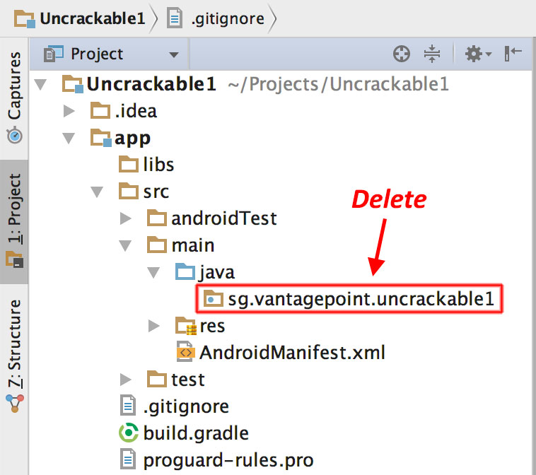

Now, open the `Uncrackable-Level1/src` directory in a file browser and drag the `sg` directory into the now empty `Java` folder in the IntelliJ project view (hold the "alt" key to copy the folder instead of moving it).


You'll end up with a structure that resembles the original Android Studio project from which the app was built.

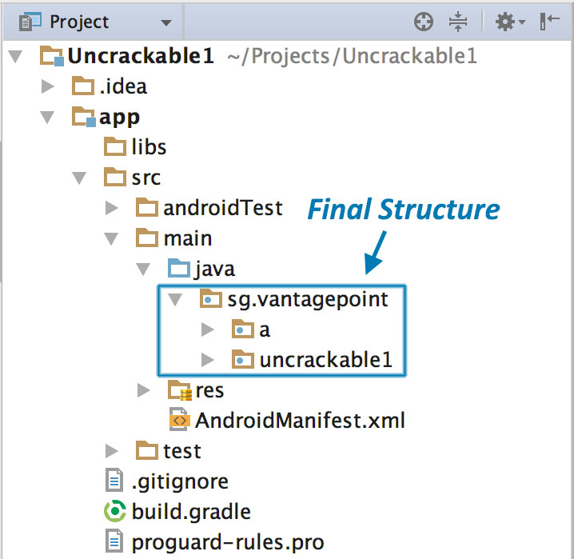

As soon as IntelliJ has indexed the code, you can browse it just like you'd browse any other Java project. Note that many of the decompiled packages, classes, and methods have weird one-letter names; this is because the bytecode has been "minified" with ProGuard at build time. This is a basic type of obfuscation that makes the bytecode a little more difficult to read, but with a fairly simple app like this one it won't cause you much of a headache. When you're analyzing a more complex app, however, it can get quite annoying.

When analyzing obfuscated code, annotating class names, method names, and other identifiers as you go along is a good practice. Open the `MainActivity` class in the package `sg.vantagepoint.uncrackable1`. The method `verify` is  called when you tap the "verify" button. This method passes user input to a static method called `a.a`, which returns a boolean value. It seems plausible that `a.a` verifies user input, so we'll refactor the code to reflect this.


Right-click the class name—the first `a` in `a.a`—and select Refactor->Rename from the drop-down menu (or press Shift-F6). Change the class name to something that makes more sense given what you know about the class so far. For example, you could call it "Validator" (you can always revise the name later). `a.a` now becomes `Validator.a`. Follow the same procedure to rename the static method `a` to `check_input`.


Congratulations—you just learned the fundamentals of static analysis! It is all about theorizing, annotating, and gradually revising theories about the analyzed program until you understand it completely—or, at least, well enough for whatever you want to achieve.

Next, Ctrl+click (or Command+click on Mac) on the `check_input` method. This takes you to the method definition. The decompiled method looks like this:

```java
    public static boolean check_input(String string) {
        byte[] arrby = Base64.decode((String)"5UJiFctbmgbDoLXmpL12mkno8HT4Lv8dlat8FxR2GOc=", (int)0);
        byte[] arrby2 = new byte[]{};
        try {
            arrby = sg.vantagepoint.a.a.a(Validator.b("8d127684cbc37c17616d806cf50473cc"), arrby);
            arrby2 = arrby;
        }sa
        catch (Exception exception) {
            Log.d((String)"CodeCheck", (String)("AES error:" + exception.getMessage()));
        }
        if (string.equals(new String(arrby2))) {
            return true;
        }
        return false;
    }
```

So, you have a base64-encoded String that's passed to the function `a` in the package `sg.vantagepoint.a.a` (again, everything is called `a`) along with something that looks suspiciously like a hex-encoded encryption key (16 hex bytes = 128bit, a common key length). What exactly does this particular `a` do? Ctrl-click it to find out.

```java
public class a {
    public static byte[] a(byte[] object, byte[] arrby) {
        object = new SecretKeySpec((byte[])object, "AES/ECB/PKCS7Padding");
        Cipher cipher = Cipher.getInstance("AES");
        cipher.init(2, (Key)object);
        return cipher.doFinal(arrby);
    }
}
```

Now you're getting somewhere: it's simply standard AES-ECB. Looks like the base64 string stored in `arrby1` in `check_input` is a ciphertext. It is decrypted with 128bit AES, then compared with the user input. As a bonus task, try to decrypt the extracted ciphertext and find the secret value!

A faster way to get the decrypted string is to add dynamic analysis—we'll revisit UnCrackable Level 1 later to show how, so don't delete the project yet!

#### Statically Analyzing Native Code

Dalvik and ART both support the Java Native Interface (JNI), which defines a way for Java code to interact with native code written in C/C++. As on other Linux-based operating systems, native code is packaged into ELF dynamic libraries ("*.so"), which the Android app loads at run time via the `System.load` method.

Android JNI functions are written in native code that has been compiled into Linux ELF libraries. It's standard Linux fare. However, instead of relying on widely used C libraries (such as glibc) Android binaries are built against a custom libc named [Bionic](https://github.com/android/platform_bionic "Bionic libc"). Bionic adds support for important Android-specific services such as system properties and logging, and it is not fully POSIX-compatible.

Download HelloWorld-JNI.apk from the OWASP MSTG repository. Installing and running it on your emulator or Android device is optional.

```bash
$ wget HelloWord-JNI.apk
$ adb install HelloWord-JNI.apk
```

This app is not exactly spectacular—all it does is show a label with the text "Hello from C++." This is the app Android generates by default when you create a new project with C/C++ support— it's just enough to show the basic principles of JNI calls.


Decompile the APK with `apkx`. This extracts the source code into the `HelloWorld/src` directory.

```bash
$ wget https://github.com/OWASP/owasp-mstg/raw/master/Samples/Android/01_HelloWorld-JNI/HelloWord-JNI.apk
$ apkx HelloWord-JNI.apk
Extracting HelloWord-JNI.apk to HelloWord-JNI
Converting: classes.dex -> classes.jar (dex2jar)
dex2jar HelloWord-JNI/classes.dex -> HelloWord-JNI/classes.jar
```

The MainActivity is found in the file `MainActivity.java`. The "Hello World" text view is populated in the `onCreate()` method:

```java
public class MainActivity
extends AppCompatActivity {
    static {
        System.loadLibrary("native-lib");
    }

    @Override
    protected void onCreate(Bundle bundle) {
        super.onCreate(bundle);
        this.setContentView(2130968603);
        ((TextView)this.findViewById(2131427422)).setText((CharSequence)this.stringFromJNI());
    }

    public native String stringFromJNI();
}

}
```

Note the declaration of `public native String stringFromJNI` at the bottom. The   keyword "native" tells the Java compiler that this method is  implemented in a native language. The corresponding function is resolved during run time, but only if a native library that exports a global symbol with the expected signature is loaded (signatures comprise a package name, class name, and method name). In this example, this requirement is satisfied by the following C or C++ function:

```c
JNIEXPORT jstring JNICALL Java_sg_vantagepoint_helloworld_MainActivity_stringFromJNI(JNIEnv *env, jobject)
```

So where is the native implementation of this function? If you look into the `lib` directory of the APK archive, you'll see eight subdirectories named after different processor architectures. Each of these directories contains a version of the native library `libnative-lib.so` that has been compiled for the processor architecture in question. When `System.loadLibrary` is called, the loader selects the correct version based on the device that the app is running on.

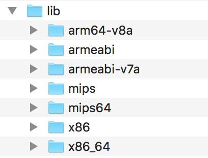

Following the naming convention mentioned above, you can expect the library to export a symbol called `Java_sg_vantagepoint_helloworld_MainActivity_stringFromJNI`. On Linux systems, you can retrieve the list of symbols with `readelf` (included in GNU binutils) or `nm`. Do this on Mac OS with the `greadelf` tool, which you can install via Macports or Homebrew. The following example uses `greadelf`:

```
$ greadelf -W -s libnative-lib.so | grep Java
     3: 00004e49   112 FUNC    GLOBAL DEFAULT   11 Java_sg_vantagepoint_helloworld_MainActivity_stringFromJNI
```

This is the native function that eventually gets executed when the `stringFromJNI` native method is called.

To disassemble the code, you can load `libnative-lib.so` into any disassembler that understands ELF binaries (i.e., any disassembler). If the app ships with binaries for different architectures, you can theoretically pick the architecture you're most familiar with, as long as it is compatible with the disassembler. Each version is compiled from the same source and implements the same functionality. However, if you're planning to debug the library on a live device later, it's usually wise to pick an ARM build.

To support both older and newer ARM processors, Android apps ship with multiple ARM builds compiled for different Application Binary Interface (ABI) versions. The ABI defines how the application's machine code is supposed to interact with the system at run time. The following ABIs are supported:

- armeabi: ABI is for ARM-based CPUs that support at least the ARMv5TE instruction set.
- armeabi-v7a: This ABI extends armeabi to include several CPU instruction set extensions.
- arm64-v8a: ABI for ARMv8-based CPUs that support AArch64, the new 64-bit ARM architecture.

Most disassemblers can handle any of those architectures. Below, we'll be viewing the `armeabi-v7a` version in IDA Pro. It is in `lib/armeabi-v7a/libnative-lib.so`. If you don't own an IDA Pro license, you can do the same thing with the demo or evaluation version available on the Hex-Rays website.

Open the file in IDA Pro. In the "Load new file" dialog, choose "ELF for ARM (Shared Object)" as the file type (IDA should detect this automatically), and "ARM Little-Endian" as the processor type.


Once the file is open, click into the "Functions" window on the left and press `Alt+t` to open the search dialog. Enter "java" and hit enter. This should highlight the `Java_sg_vantagepoint_helloworld_MainActivity_stringFromJNI` function. Double-click the function to jump to its address in the disassembly Window. "Ida View-A" should now show the disassembly of the function.

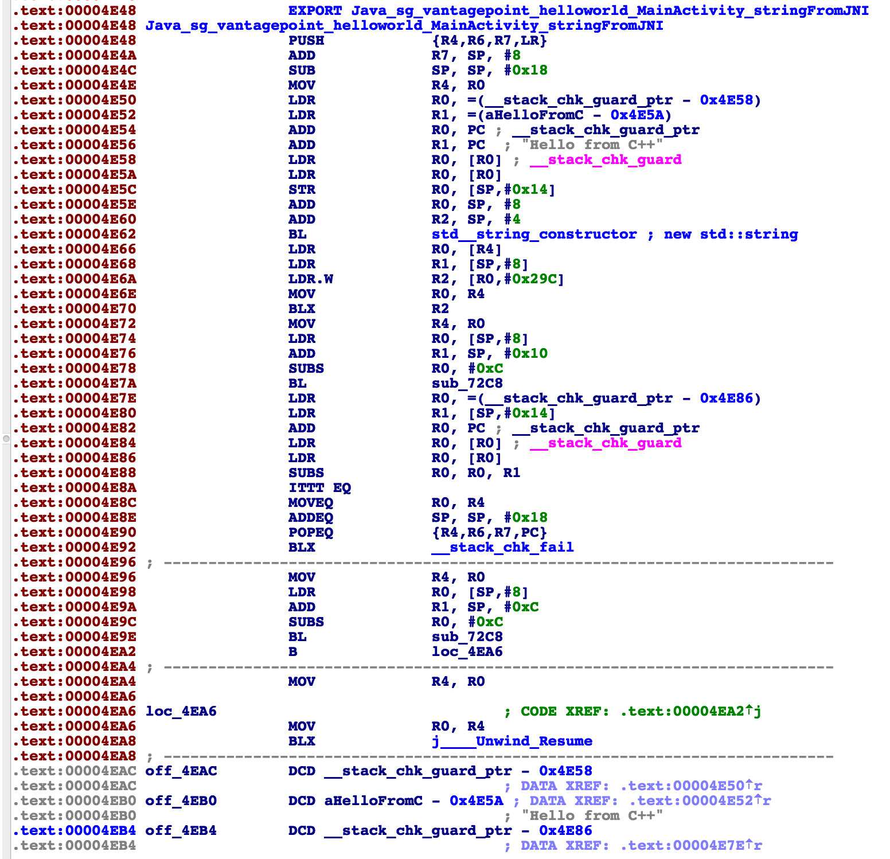

Not a lot of code there, but you should analyze it. The first thing you need to know is that the first argument passed to every JNI is a JNI interface pointer. An interface pointer is a pointer to a pointer. This pointer points to a function table—an array of even more pointers, each of which points to a JNI interface function (is your head spinning yet?). The function table is initialized by the Java VM and allows the native function to interact with the Java environment.


With that in mind, let's have a look at each line of assembly code.

```
LDR  R2, [R0]
```

Remember: the first argument (in R0) is a pointer to the JNI function table pointer. The `LDR` instruction loads this function table pointer into R2.

```
LDR  R1, =aHelloFromC
```

This instruction loads into R1 the pc-relative offset of the string "Hello from C++." Note that this string comes directly after the end of the function block at offset 0xe84. Addressing relative to the program counter allows the code to run independently of its position in memory.

```
LDR.W  R2, [R2, #0x29C]
```

This instruction loads the function pointer from offset 0x29C into the JNI function pointer table pointed to by R2. This is the `NewStringUTF` function. You can look at the list of function pointers in jni.h, which is included in the Android NDK. The function prototype looks like this:

```
jstring     (*NewStringUTF)(JNIEnv*, const char*);
```

The function takes two arguments: the JNIEnv pointer (already in R0) and a String pointer. Next, the current value of PC is added to R1, resulting in the absolute address of the static string "Hello from C++" (PC + offset).

```
ADD  R1, PC
```

Finally, the program executes a branch instruction to the `NewStringUTF` function pointer loaded into R2:

```
BX   R2
```

When this function returns, R0 contains a pointer to the newly constructed UTF string. This is the final return value, so R0 is left unchanged and the function returns.

#### Debugging and Tracing

So far, you've been using static analysis techniques without running the target apps. In the real world—especially when reversing malware or more complex apps—pure static analysis is very difficult. Observing and manipulating an app during run time makes it much, much easier to decipher its behavior. Next, we'll have a look at dynamic analysis methods that help you do just that.

Android apps support two different types of debugging: Debugging on the level of the Java runtime with the Java Debug Wire Protocol (JDWP), and Linux/Unix-style ptrace-based debugging on the native layer, both of which are valuable to reverse engineers.

##### Debugging Release Apps

Dalvik and ART support the JDWP, a protocol for communication between the debugger and the Java virtual machine (VM) that it debugs. JDWP is a standard debugging protocol that's supported by all command line tools and Java IDEs, including JDB, JEB, IntelliJ, and Eclipse. Android's implementation of JDWP also includes hooks for supporting extra features implemented by the Dalvik Debug Monitor Server (DDMS.

A JDWP debugger allows you to step through Java code, set breakpoints on Java methods, and inspect and modify local and instance variables. You'll use a JDWP debugger most of the time you debug "normal" Android apps (i.e., apps that don't make many calls to native libraries).

In the following section, we'll show how to solve the UnCrackable App for Android Level 1 with JDB alone. Note that this is not an *efficient* way to solve this crackme—you can do it much faster with Frida and other methods, which we'll introduce later in the guide. This, however, serves as an introduction to the capabilities of the Java debugger.

###### Repackaging

Every debugger-enabled process runs an extra thread for handling JDWP protocol packets. This thread is started only for apps that have the `android:debuggable="true"` tag set in their manifest file's `<application>` element. This is the typical configuration of Android devices shipped to end users.

When reverse engineering apps, you'll often have access to the target app's release build only. Release builds aren't meant to be debugged—after all, that's the purpose of *debug builds*. If the system property `ro.debuggable` is set to "0," Android disallows both JDWP and native debugging of release builds. Although this is easy to bypass, you're still likely to encounter limitations, such as a lack of line breakpoints. Nevertheless, even an imperfect debugger is still an invaluable tool— being able to inspect the run time state of a program makes understanding the program *a lot* easier.

To "convert" a release build into a debuggable build, you need to modify a flag in the app's manifest file. This modification breaks the code signature, so you'll also have to re-sign the altered APK archive.

To re-sign, you first need a code-signing certificate. If you have built a project in Android Studio before, the IDE has already created a debug keystore and certificate in `$HOME/.android/debug.keystore`. The default password for this keystore is "android," and the key is called "androiddebugkey."

The standard Java distribution includes `keytool` for managing keystores and certificates. You can create your own signing certificate and key, then add it to the debug keystore:

```
$ keytool -genkey -v -keystore ~/.android/debug.keystore -alias signkey -keyalg RSA -keysize 2048 -validity 20000
```

After the certificate is available, you can repackage the UnCrackable-Level1.apk according to the following steps. Note that the Android Studio build tools directory must be in the path. It is located at `[SDK-Path]/build-tools/[version]`. The `zipalign` and `apksigner` tools are in this directory.
1. Use `apktool` to unpack the app and decode AndroidManifest.xml:

```bash
$ apktool d --no-src UnCrackable-Level1.apk
```

2. Add android:debuggable = "true" to the manifest using a text editor:

```xml
<application android:allowBackup="true" android:debuggable="true" android:icon="@drawable/ic_launcher" android:label="@string/app_name" android:name="com.xxx.xxx.xxx" android:theme="@style/AppTheme">
```

Note: To get `apktool` to do this for you automatically, use the `-d` or `--debug` flag while building the APK. This will add `debuggable="true"` to the AndroidManifest file.

3. Repackage and sign the APK.

```bash
$ cd UnCrackable-Level1
$ apktool b
$ zipalign -v 4 dist/UnCrackable-Level1.apk ../UnCrackable-Repackaged.apk
$ cd ..
$ apksigner sign --ks  ~/.android/debug.keystore --ks-key-alias signkey UnCrackable-Repackaged.apk
```

Note: If you experience JRE compatibility issues with `apksigner`, you can use `jarsigner` instead. When you do this, `zipalign` is called *after* signing.

```bash
$ jarsigner -verbose -keystore ~/.android/debug.keystore UnCrackable-Repackaged.apk signkey
$ zipalign -v 4 dist/UnCrackable-Level1.apk ../UnCrackable-Repackaged.apk
```

4. Reinstall the app:

```bash
$ adb install UnCrackable-Repackaged.apk
```

##### The “Wait For Debugger” Feature

The UnCrackable App is not stupid: it notices that it has been run in debuggable mode and reacts by shutting down. A modal dialog is shown immediately, and the crackme terminates once you tap "OK."

Fortunately, Android's "Developer options" contain the useful "Wait for Debugger" feature, which allows you to automatically suspend an app doing startup until a JDWP debugger connects. With this feature, you can connect the debugger before the detection mechanism runs, and trace, debug, and deactivate that mechanism. It's really an unfair advantage, but, on the other hand, reverse engineers never play fair!


In the Developer options, pick `Uncrackable1` as the debugging application and activate the "Wait for Debugger" switch.


Note: Even with `ro.debuggable` set to 1 in `default.prop`, an app won't show up in the "debug app" list unless the `android:debuggable` flag is set to `true` in the Manifest.

##### The Android Debug Bridge

The `adb` command line tool, which ships with the Android SDK, bridges the gap between your local development environment and a connected Android device. You'll usually debug apps on the emulator or a device connected via USB. Use the `adb devices` command to list the connected devices.

```bash
$ adb devices
List of devices attached
090c285c0b97f748  device
```

The `adb jdwp` command lists the process ids of all debuggable processes running on the connected device (i.e., processes hosting a JDWP transport). With the `adb forward` command, you can open a listening socket on your host machine and forward this socket's incoming TCP connections to the JDWP transport of a chosen process.

```bash
$ adb jdwp
12167
$ adb forward tcp:7777 jdwp:12167
```

You're now ready to attach JDB. Attaching the debugger, however, causes the app to resume, which you don't want. You want to keep it suspended so that you can explore first. To prevent the process from resuming, pipe the `suspend` command into jdb:

```bash
$ { echo "suspend"; cat; } | jdb -attach localhost:7777
Initializing jdb ...
> All threads suspended.
>
```

You're now attached to the suspended process and ready to go ahead with the jdb commands. Entering `?` prints the complete list of commands. Unfortunately, the Android VM doesn't support all available JDWP features. For example, the `redefine` command, which would let you redefine a class' code is not supported. Another important restriction is that line breakpoints won't work because the release bytecode doesn't contain line information. Method breakpoints do work, however. Useful working commands include:

- *classes: list all loaded classes
- class/method/fields <class id>: Print details about a class and list its method and fields
- locals: print local variables in current stack frame
- print/dump <expr>: print information about an object
- stop in <method>: set a method breakpoint
- clear <method>: remove a method breakpoint
- set <lvalue> = <expr>:  assign new value to field/variable/array element

Let's revisit the decompiled code from the UnCrackable App Level 1 and think about possible solutions. A good approach would be suspending the app in a state where the secret string is held in a variable in plain text so you can retrieve it. Unfortunately, you won't get that far unless you deal with the root/tampering detection first.

Review the code and you'll see that the method `sg.vantagepoint.uncrackable1.MainActivity.a` displays the "This in unacceptable..." message box. This method creates an `AlertDialog` and sets a listener class for the `onClick` event. This class (named `b`) has a callback method will terminates the app once the user taps the “OK” button. To prevent the user from simply canceling the dialog, the `setCancelable` method is called.

```java
  private void a(final String title) {
        final AlertDialog create = new AlertDialog$Builder((Context)this).create();
        create.setTitle((CharSequence)title);
        create.setMessage((CharSequence)"This in unacceptable. The app is now going to exit.");
        create.setButton(-3, (CharSequence)"OK", (DialogInterface$OnClickListener)new b(this));
        create.setCancelable(false);
        create.show();
    }
```

You can bypass this with a little run time tampering. With the app still suspended, set a method breakpoint on `android.app.Dialog.setCancelable` and resume the app.

```
> stop in android.app.Dialog.setCancelable                        
Set breakpoint android.app.Dialog.setCancelable
> resume
All threads resumed.
>
Breakpoint hit: "thread=main", android.app.Dialog.setCancelable(), line=1,110 bci=0
main[1]
```

The app is now suspended at the first instruction of the `setCancelable` method. You can print the arguments passed to `setCancelable` with the `locals` command (the arguments are shown incorrectly under "local variables").

```
main[1] locals
Method arguments:
Local variables:
flag = true
```

`setCancelable(true)` was called, so this can't be the call we're looking for. Resume the process with the `resume` command.

```
main[1] resume
Breakpoint hit: "thread=main", android.app.Dialog.setCancelable(), line=1,110 bci=0
main[1] locals
flag = false
```

You've now reached a call to `setCancelable` with the argument `false`. Set the variable to true with the `set` command and resume.

```
main[1] set flag = true
 flag = true = true
main[1] resume
```

Repeat this process, setting `flag` to `true` each time the breakpoint is reached, until the alert box is finally displayed (the breakpoint will be reached five or six times). The alert box should now be cancelable! Tap the screen next to the box and it will close without terminating the app.

Now that the anti-tampering is out of the way, you're ready to extract the secret string! In the "static analysis" section, you saw that the string is decrypted with AES, then compared with the string input to the message box. The method `equals` of the `java.lang.String` class compares the string input with the secret string. Set a method breakpoint on `java.lang.String.equals`, enter an arbitrary text string in the edit field, and tap the "verify" button. Once the breakpoint is reached, you can read the method argument with the `locals` command.

```
> stop in java.lang.String.equals
Set breakpoint java.lang.String.equals
>    
Breakpoint hit: "thread=main", java.lang.String.equals(), line=639 bci=2

main[1] locals
Method arguments:
Local variables:
other = "radiusGravity"
main[1] cont

Breakpoint hit: "thread=main", java.lang.String.equals(), line=639 bci=2

main[1] locals
Method arguments:
Local variables:
other = "I want to believe"
main[1] cont     
```

This is the plaintext string you're looking for!

###### Debugging with an IDE

Setting up a project in an IDE with the decompiled sources is a neat trick that allows you to set method breakpoints directly in the source code. In most cases, you should be able single-step through the app and inspect the state of variables with the GUI. The experience won't be perfect—it's not the original source code after all, so you won't be able to set line breakpoints and things will sometimes simply not work correctly. Then again, reversing code is never easy, and efficiently navigating and debugging plain old Java code is a pretty convenient way of doing it. A similar method has been described in the [NetSPI blog](https://blog.netspi.com/attacking-android-applications-with-debuggers/ "NetSPI Blog - Attacking Android Applications with Debuggers").

To set up IDE debugging, first create your Android project in IntelliJ and copy the decompiled Java sources into the source folder as described above in the "Statically Analyzing Java Code" section. On the device, choose the app as “debug app” on the Developer options” (Uncrackable1 in this tutorial), and make sure you've switched on the "Wait For Debugger" feature.

Once you tap the Uncrackable app icon from the launcher, it will be suspended in "wait for a debugger" mode.

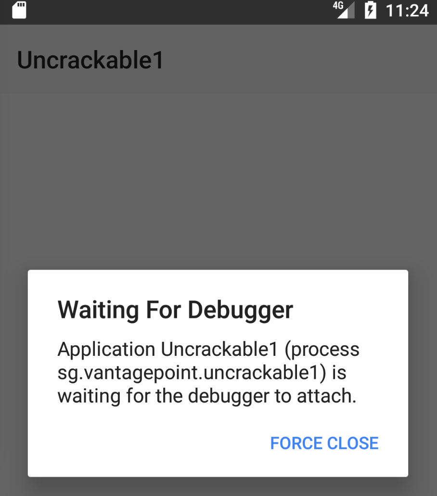

Now you can set breakpoints and attach to the Uncrackable1 app process with the "Attach Debugger" toolbar button.

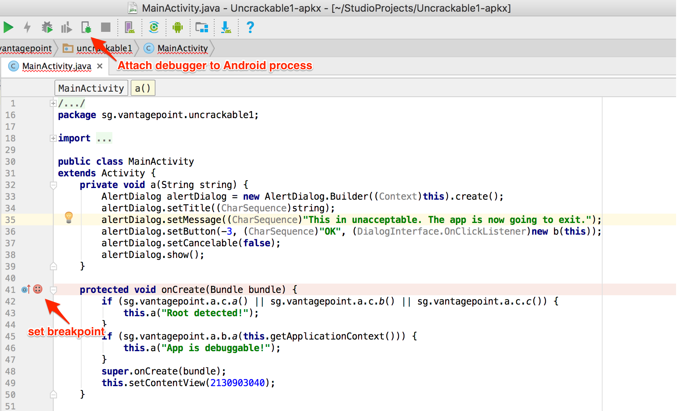

Note that only method breakpoints work when debugging an app from decompiled sources. Once a method breakpoint is reached, you'll get the chance to single step during the method execution.


After you choose the Uncrackable1 application from the list, the debugger will attach to the app process and you'll reach the breakpoint that was set on the `onCreate()` method. Uncrackable1 app triggers anti-debugging and anti-tampering controls within the `onCreate()` method. That's why setting a breakpoint on the `onCreate()` method just before the anti-tampering and anti-debugging checks are performed is a good idea.

Next, single-step through the `onCreate()` method by clicking "Force Step Into" in Debugger view. The "Force Step Into" option allows you to debug the Android framework functions and core Java classes that are normally ignored by debuggers.


Once you "Force Step Into," the debugger will stop at the beginning of the next method, which is the `a()` method of the class `sg.vantagepoint.a.c`.

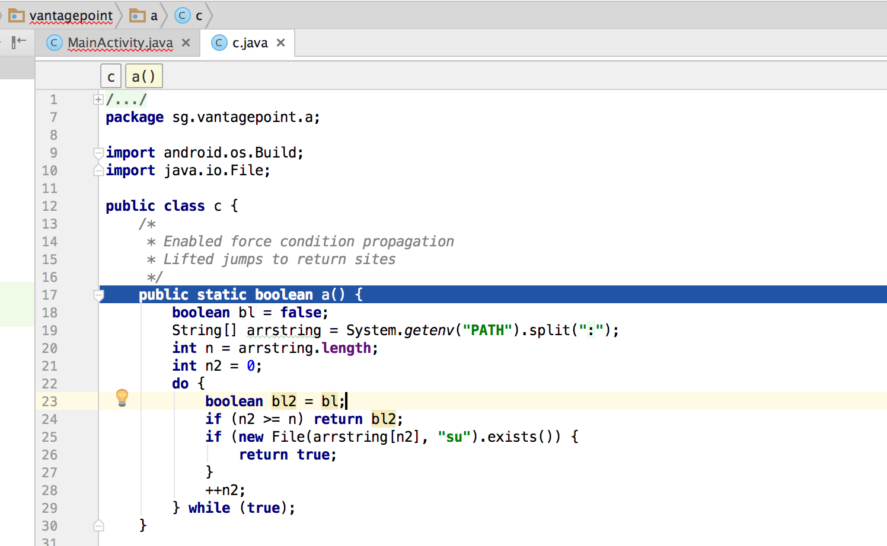

This method searches for the "su" binary within a list of directories (`/system/xbin` and others). Since you're running the app on a rooted device/emulator, you need to defeat this check by manipulating variables and/or function return values.


You can see the directory names inside the "Variables" window by clicking "Step Over" the Debugger view to step into and through the `a()` method .


Step into the `System.getenv` method with the "Force Step Into" feature.

After you get the colon-separated directory names, the debugger cursor will return to the beginning of the `a()` method, not to the next executable line. This happens because you're working on the decompiled code instead of the source code. This skipping makes following the code flow crucial to debugging decompiled applications. Otherwise, identifying the next line to be executed would become complicated.

If you don't want to debug core Java and Android classes, you can step out of the function by clicking "Step Out" in the Debugger view. Using "Force Step Into" might be a good idea  once you reach the decompiled sources and "Step Out" of the core Java and Android classes. This will help speed up debugging while you keep an eye on the return values of the core class functions.

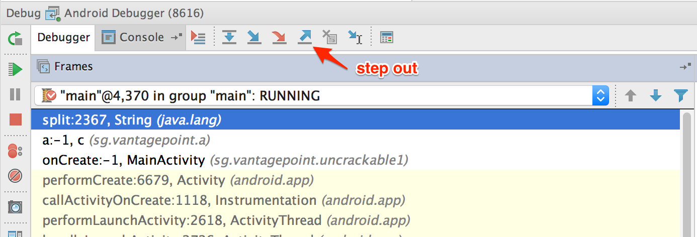

After the `a()` method gets the directory names,  it will search for the `su` binary within these directories. To defeat this check, step through the detection method and inspect the variable content. Once execution reaches a location where the `su` binary would be detected, modify one of the varibales holding the file name or directory name by pressing F2 or right-clicking and choosing "Set Value".


Once you modify the binary name or the directory name, `File.exists` should return `false`.


This defeats the first root detection control of Uncrackable App Level 1. The remaining anti-tampering and anti-debugging controls can be defeated in similar ways so that you can finally reach the secret string verification functionality.

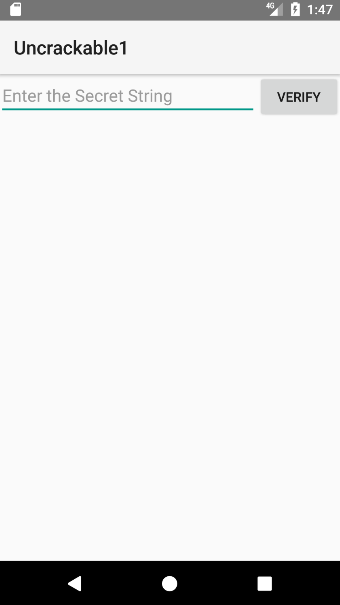

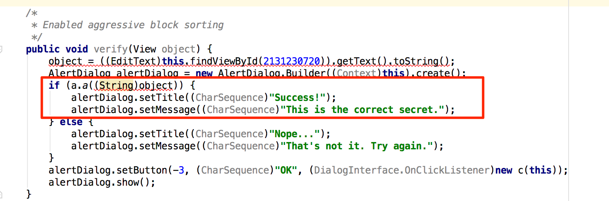

The secret code is verified by the method `a()` of class `sg.vantagepoint.uncrackable1.a`. Set a breakpoint on method `a()` and "Force Step Into" when you reach the breakpoint. Then, single-step until you reach the call to `String.equals`. This is where user input is compared with the secret string.

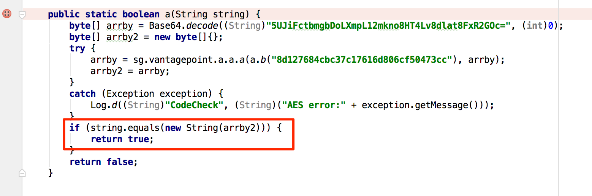

You can see the secret string in the "Variables" view when you reach the `String.equals` method call.

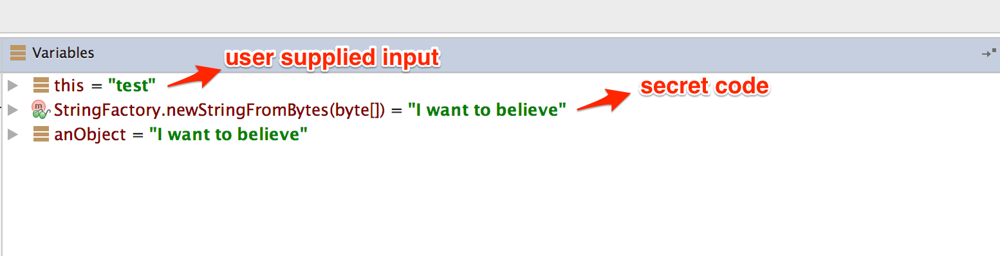

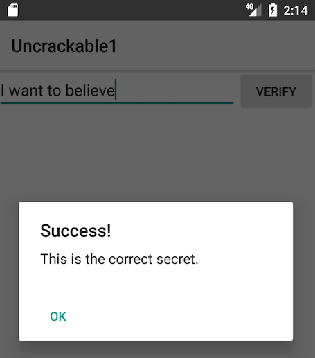

##### Debugging Native Code

Native code on Android is packed into ELF shared libraries and runs just like any other native Linux program. Consequently, you can debug it with standard tools (including GDB and built-in IDE debuggers  such as IDA Pro and JEB) as long as they support the device's processor architecture (most devices are based on ARM chipsets, so this is usually not an issue).

You'll now set up your JNI demo app, HelloWorld-JNI.apk, for debugging. It's the same APK you downloaded in "Statically Analyzing Native Code." Use `adb install` to install it on your device or on an emulator.

```bash
$ adb install HelloWorld-JNI.apk
```

If you followed the instructions at the beginning of this chapter, you should already have the Android NDK. It contains prebuilt versions of gdbserver for various architectures. Copy the gdbserver binary to your device:

```bash
$ adb push $NDK/prebuilt/android-arm/gdbserver/gdbserver /data/local/tmp
```

The `gdbserver --attach` command causes gdbserver to attach to the running process and bind to the IP address and port specified in `comm`, which in this case is a HOST:PORT descriptor. Start HelloWorld-JNI on the device, then connect to the device and determine the PID of the HelloWorld process. Then switch to the root user and attach `gdbserver`:

```bash
$ adb shell
$ ps | grep helloworld
u0_a164   12690 201   1533400 51692 ffffffff 00000000 S sg.vantagepoint.helloworldjni
$ su
# /data/local/tmp/gdbserver --attach localhost:1234 12690
Attached; pid = 12690
Listening on port 1234
```

The process is now suspended, and `gdbserver` is listening for debugging clients on port `1234`. With the device connected via USB, you can forward this port to a local port on the host with the `abd forward` command:

```bash
$ adb forward tcp:1234 tcp:1234
```

You'll now use the prebuilt version of `gdb` included in the NDK toolchain (if you haven't already, follow the instructions above to install it).

```
$ $TOOLCHAIN/bin/gdb libnative-lib.so
GNU gdb (GDB) 7.11
(...)
Reading symbols from libnative-lib.so...(no debugging symbols found)...done.
(gdb) target remote :1234
Remote debugging using :1234
0xb6e0f124 in ?? ()
```

You have successfully attached to the process! The only problem is that you're already too late to debug the JNI function `StringFromJNI`; it only runs once, at startup. You can solve this problem by activating the "Wait for Debugger" option. Go to "Developer Options" -> "Select debug app" and pick HelloWorldJNI, then activate the "Wait for debugger" switch. Then terminate and re-launch the app. It should be suspended automatically.

Our objective is to set a breakpoint at the first instruction of the native function `Java_sg_vantagepoint_helloworldjni_MainActivity_stringFromJNI` before resuming the app. Unfortunately, this isn't possible at this point in the execution because `libnative-lib.so` isn't yet mapped into process memory—it is loaded dynamically during run time. To get this working, you'll first use JDB to gently change the process into the desired state.

First, resume execution of the Java VM by attaching JDB. You don't want the process to resume immediately though, so pipe the `suspend` command into JDB:

```bash
$ adb jdwp
14342
$ adb forward tcp:7777 jdwp:14342
$ { echo "suspend"; cat; } | jdb -attach localhost:7777
```

Next, suspend the process where the Java runtime loads `libnative-lib.so`. In JDB, set a breakpoint at the `java.lang.System.loadLibrary` method and resume the process. After the breakpoint has been reached, execute the `step up` command, which will resume the process until `loadLibrary()`returns. At this point, `libnative-lib.so` has been loaded.

```
> stop in java.lang.System.loadLibrary
> resume
All threads resumed.
Breakpoint hit: "thread=main", java.lang.System.loadLibrary(), line=988 bci=0
> step up
main[1] step up
>
Step completed: "thread=main", sg.vantagepoint.helloworldjni.MainActivity.<clinit>(), line=12 bci=5

main[1]
```

Execute `gdbserver` to attach to the suspended app. This will cause the app to be suspended by both the Java VM and the Linux kernel (creating a state of “double-suspension”).


```bash
$ adb forward tcp:1234 tcp:1234
$ $TOOLCHAIN/arm-linux-androideabi-gdb libnative-lib.so
GNU gdb (GDB) 7.7
Copyright (C) 2014 Free Software Foundation, Inc.
(...)
(gdb) target remote :1234
Remote debugging using :1234
0xb6de83b8 in ?? ()
```

Execute the `resume` command in JDB to resume execution of the Java runtime (you're done with JDB, so you can detach it too). You can start exploring the process with GDB. The `info sharedlibrary` command displays the loaded libraries, which should include libnative-lib.so. The `info functions` command retrieves a list of all known functions. The JNI function `java_sg_vantagepoint_helloworldjni_MainActivity_stringFromJNI` should be listed as a non-debugging symbol. Set a breakpoint at the address of that function and resume the process.

```bash
(gdb) info sharedlibrary
(...)
0xa3522e3c  0xa3523c90  Yes (*)     libnative-lib.so
(gdb) info functions
All defined functions:

Non-debugging symbols:
0x00000e78  Java_sg_vantagepoint_helloworldjni_MainActivity_stringFromJNI
(...)
0xa3522e78  Java_sg_vantagepoint_helloworldjni_MainActivity_stringFromJNI
(...)
(gdb) b *0xa3522e78
Breakpoint 1 at 0xa3522e78
(gdb) cont
```

Your breakpoint should be reached when the first instruction of the JNI function is executed. You can now display a disassembled version of the function with the `disassemble` command.

```
Breakpoint 1, 0xa3522e78 in Java_sg_vantagepoint_helloworldjni_MainActivity_stringFromJNI() from libnative-lib.so
(gdb) disass $pc
Dump of assembler code for function Java_sg_vantagepoint_helloworldjni_MainActivity_stringFromJNI:
=> 0xa3522e78 <+0>: ldr r2, [r0, #0]
   0xa3522e7a <+2>: ldr r1, [pc, #8]  ; (0xa3522e84 <Java_sg_vantagepoint_helloworldjni_MainActivity_stringFromJNI+12>)
   0xa3522e7c <+4>: ldr.w r2, [r2, #668]  ; 0x29c
   0xa3522e80 <+8>: add r1, pc
   0xa3522e82 <+10>:  bx  r2
   0xa3522e84 <+12>:  lsrs  r4, r7, #28
   0xa3522e86 <+14>:  movs  r0, r0
End of assembler dump.
```

From here on, you can single-step through the program, print the contents of registers and memory, or tamper with them to explore the JNI function (which, in this case, simply returns a string). Use the `help` command to get more information on debugging, running, and examining data.

##### Execution Tracing

Besides being useful for debugging, the JDB command line tool offers basic execution tracing functionality. To trace an app right from the start, you can pause the app with the Android "Wait for Debugger" feature or a `kill –STOP` command and attach JDB to set a deferred method breakpoint on any initialization method. Once the breakpoint is reached, activate method tracing with the `trace go methods` command and resume execution. JDB will dump all method entries and exits from that point onwards.

```bash
$ adb forward tcp:7777 jdwp:7288
$ { echo "suspend"; cat; } | jdb -attach localhost:7777
Set uncaught java.lang.Throwable
Set deferred uncaught java.lang.Throwable
Initializing jdb ...
> All threads suspended.
> stop in com.acme.bob.mobile.android.core.BobMobileApplication.<clinit>()          
Deferring breakpoint com.acme.bob.mobile.android.core.BobMobileApplication.<clinit>().
It will be set after the class is loaded.
> resume
All threads resumed.M
Set deferred breakpoint com.acme.bob.mobile.android.core.BobMobileApplication.<clinit>()

Breakpoint hit: "thread=main", com.acme.bob.mobile.android.core.BobMobileApplication.<clinit>(), line=44 bci=0
main[1] trace go methods
main[1] resume
Method entered: All threads resumed.
```

The Dalvik Debug Monitor Server (DDMS) is a GUI tool included with Android Studio. It may not look like much, but its Java method tracer is one of the most awesome tools you can have in your arsenal, and it is indispensable for analyzing obfuscated bytecode.

DDMS is somewhat confusing, however; it can be launched several ways, and different trace viewers will be launched depending on how a method was traced. There's a standalone tool called "Traceview" as well as a built-in viewer in Android Studio, both of which offer different ways to navigate the trace. You'll usually use Android studio's built-in viewer,  which gives you a zoom-able hierarchical timeline of all method calls. The standalone tool, however, is also useful—it has a profile panel that shows the time spent in each method and the parents and children of each method.

To record an execution trace in Android Studio, open the "Android" tab at the bottom of the GUI. Select the target process in the list and click the little "stop watch" button on the left. This starts the recording. Once you're done, click the same button to stop the recording. The integrated trace view will open and show the recorded trace. You can scroll and zoom the timeline view with the mouse or trackpad.

Execution traces can also be recorded in the standalone Android Device Monitor. The Device Monitor can be started within Android Studio (Tools -> Android -> Android Device Monitor) or from the shell with the `ddms` command.

To start recording tracing information, select the target process in the "Devices" tab and click "Start Method Profiling". Click the stop button to stop recording, after which the Traceview tool will open and show the recorded trace. Clicking any of the methods in the profile panel highlights the selected method in the timeline panel.

DDMS also offers a convenient heap dump button that will dump the Java heap of a process to a `.hprof` file. The Android Studio user guide contains more information about Traceview .

###### Tracing System Calls

Moving down a level in the OS hierarchy, you arrive at privileged functions that require the powers of the Linux kernel. These functions are available to normal processes via the system call interface. Instrumenting and intercepting calls into the kernel is an effective method for getting a rough idea of what a user process is doing, and  often the most efficient way to deactivate low-level tampering defenses.

Strace is a standard Linux utility that monitors interaction between processes and the kernel. The utility is not included with Android by default, but can easily be built from source via the Android NDK. Strace is a very convenient way to monitor a process' system calls. Strace depends, however on the `ptrace()` system call to attach to the target process, so it only works up to the point at which anti-debugging measures start up.

If the Android "stop application at startup" feature is unavailable, you can use a shell script to launch the process and immediately attach strace (not an elegant solution, but it works):

```bash
$ while true; do pid=$(pgrep 'target_process' | head -1); if [[ -n "$pid" ]]; then strace -s 2000 - e "!read" -ff -p "$pid"; break; fi; done
```

###### Ftrace

Ftrace is a tracing utility built directly into the Linux kernel. On a rooted device, ftrace can trace kernel system calls more transparently than strace can (strace relies on the ptrace system call to attach to the target process).

Conveniently, the stock Android kernel on both Lollipop and Marshmallow include ftrace functionality. The feature can be enabled with the following command:

```bash
$ echo 1 > /proc/sys/kernel/ftrace_enabled
```

The `/sys/kernel/debug/tracing` directory holds all control and output files related to ftrace. The following files are found in this directory:

- available_tracers: This file lists the available tracers compiled into the kernel.
- current_tracer: This file sets or displays the current tracer.
- tracing_on: Echo 1 into this file to allow/start update of the ring buffer. Echoing 0 will prevent further writes into the ring buffer.

###### KProbes

The KProbes interface provides an even more powerful way to instrument the kernel: it allows you to insert probes into (almost) arbitrary code addresses within kernel memory. KProbes inserts a breakpoint instruction at the specified address. Once the breakpoint is reached, control passes to the KProbes system, which then executes the user-defined handler function(s) and the original instruction. Besides being great for function tracing, KProbes can implement rootkit-like functionality, such as file hiding.

Jprobes and Kretprobes are other KProbes-based probe types that allow hooking of function entries and exits.

The stock Android kernel comes without loadable module support, which is a problem because Kprobes are usually deployed as kernel modules. The strict memory protection the Android kernel is compiled with is another issue becauseit prevents the patching of some parts of Kernel memory. Elfmaster's system call hooking method causes a Kernel panic on stock Lollipop and Marshmallow because the sys_call_table is non-writable. You can, however, use KProbes in a sandbox by compiling your own, more lenient Kernel (more on this later).

##### Emulation-based Analysis

The Android emulator is based on QEMU, a generic and open source machine emulator. QEMU emulates a guest CPU by translating the guest instructions on-the-fly into instructions the host processor can understand. Each basic block of guest instructions is disassembled and translated into an intermediate representation called Tiny Code Generator (TCG). The TCG block is compiled into a block of host instructions, stored in a code cache, and executed. After execution of the basic block, QEMU repeats the process for the next block of guest instructions (or loads the already translated block from the cache). The whole process is called dynamic binary translation.

Because the Android emulator is a fork of QEMU, it comes with all QEMU features, including monitoring, debugging, and tracing facilities. QEMU-specific parameters can be passed to the emulator with the -qemu command line flag. Youcan use QEMU's built-in tracing facilities to log executed instructions and virtual register values. Starting qemu with the "-d" command line flag will cause it to dump the blocks of guest code, micro operations, or host instructions being executed. With the –d_asm option, QEMU logs all basic blocks of guest code as they enter QEMU's translation function. The following command logs all translated blocks to a file:

```bash
$ emulator -show-kernel -avd Nexus_4_API_19 -snapshot default-boot -no-snapshot-save -qemu -d in_asm,cpu 2>/tmp/qemu.log
```

Unfortunately, generating a complete guest instruction trace with QEMU is impossible because code blocks are written to the log only at the time they are translated—not when they're taken from the cache. For example, if a block is repeatedly executed in a loop, only the first iteration will be printed to the log. There's no way to disable TB caching in QEMU (besides hacking the source code). Nevertheless, the functionality is sufficient for basic tasks, such as reconstructing the disassembly of a natively executed cryptographic algorithm.

Dynamic analysis frameworks, such as PANDA and DroidScope, build on QEMU's tracing functionality. PANDA/PANDROID is the best choice if you're going for a CPU-trace based analysis because it allows you to easily record and replay a full trace and is relatively easy to set up if you follow the build instructions for Ubuntu.

###### DroidScope

DroidScope—an extension to the [DECAF dynamic analysis framework](https://github.com/sycurelab/DECAF)—is a malware analysis engine based on QEMU. It instrumentats the emulated environment on several context levels, making it possible to fully reconstruct the semantics on the hardware, Linux and Java levels.

DroidScope exports instrumentation APIs that mirror the different context levels (hardware, OS, and Java) of a real Android device. Analysis tools can use these APIs to query or set information and register callbacks for various events. For example, a plugin can register callbacks for native instruction start and end, memory reads and writes, register reads and writes, system calls, and Java method calls.

All of this makes it possible to build tracers that are practically transparent to the target application (as long as we can hide the fact that it is running in an emulator). One limitation is that DroidScope is compatible with the Dalvik VM only.

###### PANDA

[PANDA](https://github.com/moyix/panda/blob/master/docs/) is another QEMU-based dynamic analysis platform. Similar to DroidScope, PANDA can be extended by registering callbacks that are triggered by certain QEMU events. The twist PANDA adds is its record/replay feature. This allows an iterative workflow: the reverse engineer records an execution trace of the target app (or some part of it), then replays it repeatedly, refining the analysis plugins with each iteration.

PANDA comes with pre-made plugins, including a stringsearch tool and a syscall tracer. Most importantly, it supports Android guests, and some of the DroidScope code has even been ported. Building and running PANDA for Android ("PANDROID") is relatively straightforward. To test it, clone Moiyx's git repository and build PANDA:

~~~
$ cd qemu
$ ./configure --target-list=arm-softmmu --enable-android $ makee
~~~

As of this writing, Android versions up to 4.4.1 run fine in PANDROID, but anything newer than that won't boot. Also, the Java level introspection code only works on the Android 2.3 Dalvik runtime. Older versions of Android seem to run much faster in the emulator, so sticking with Gingerbread is probably best if you plan to use PANDA. For more information, check out the extensive documentation in the PANDA git repo.

##### VxStripper

Another very useful tool built on QEMU is [VxStripper by Sébastien Josse](http://vxstripper.pagesperso-orange.fr). VXStripper is specifically designed for de-obfuscating binaries. By instrumenting QEMU's dynamic binary translation mechanisms, it dynamically extracts an intermediate representation of a binary. It then applies simplifications to the extracted intermediate representation and recompiles the simplified binary with LLVM. This is a very powerful way of normalizing obfuscated programs. See [Sébastien's paper](http://ieeexplore.ieee.org/document/6759227/ "Dynamic Malware Recompilation") for more information.

### Tampering and Runtime Instrumentation

First, we'll look at some simple ways to modify and instrument mobile apps. *Tampering* means making patches or run-time changes to the app to affect its behavior. For example, you may want to deactivate SSL pinning or binary protections that hinder the testing process. *Runtime Instrumentation* encompasses adding hooks and runtime patches to observe the app's behavior. In mobile app-sec however, the term loosely refers to all kinds of run-time manipulation, including overriding methods to change behavior.

#### Patching and Re-Packaging

Making small changes to the app Manifest or bytecode is often the quickest way to fix small annoyances that prevent you from testing or reverse engineering an app. On Android, two issues in particular happen regularly:

1. You can't attach a debugger to the app because the android:debuggable flag is not set to true in the Manifest.
2. You can't intercept HTTPS traffic with a proxy because the app employs SSL pinning.

In most cases, both issues can be fixed by making minor changes to the app and then re-signing and re-packaging it. Apps that run additional integrity checks beyond default Android code-signing are an exception—in these cases, you have to patch the additional checks as well.

##### Example: Disabling Certificate Pinning

Certificate pinning is an issue for security testers who want to intercept HTTPS communication for legitimate reasons. Patching bytecode to deactivate SSL pinning can help with this. To demonstrate bypassing certificate pinning, we'll walk through an implementation in an example application.

The first step is disassembling the APK with `apktool`:

```bash
$ apktool d target_apk.apk
```

You then locate the certificate pinning checks in the Smali source code. Searching the code for keywords such as "X509TrustManager" should point you in the right direction.

In our example, a search for "X509TrustManager" returns one class that implements a custom Trustmanager. The derived class implements the methods `checkClientTrusted`, `checkServerTrusted`, and `getAcceptedIssuers`.

To bypass the pinning check, add the `return-void` opcode to the first line of each method. This opcode causes the checks to return immediately. With this modification, no certificate checks are performed, and the application accepts all certificates.

```smali
.method public checkServerTrusted([LJava/security/cert/X509Certificate;Ljava/lang/String;)V
  .locals 3
  .param p1, "chain"  # [Ljava/security/cert/X509Certificate;
  .param p2, "authType"   # Ljava/lang/String;

  .prologue     
  return-void      # <-- OUR INSERTED OPCODE!
  .line 102
  iget-object v1, p0, Lasdf/t$a;->a:Ljava/util/ArrayList;

  invoke-virtual {v1}, Ljava/util/ArrayList;->iterator()Ljava/util/Iterator;

  move-result-object v1

  :goto_0
  invoke-interface {v1}, Ljava/util/Iterator;->hasNext()Z
```

##### Patching React Native applications

If the [React Native](http://facebook.github.io/react-native "React Native") framework has been used for developing then the main application code is located in the file `assets/index.android.bundle`. This file contains the JavaScript code. Most of the time, the JavaScript code in this file is minified. By using the tool [JStillery](https://mindedsecurity.github.io/jstillery "JStillery") a human readable version of the file can be retried, allowing code analysis. The [CLI version of JStillery](https://github.com/mindedsecurity/jstillery/ "CLI version of JStillery") or the local server should be preferred instead of using the online version as otherwise source code is sent and disclosed to a 3rd party.  

The following approach can be used in order to patch the JavaScript file:

1. Unpack the APK archive using `APKTool` tool.
2. Copy the content of the file `assets/index.android.bundle` into a temporary file.
3. Use `JStillery` to beautify and deobfuscate the content of the temporary file.
4. Identify where the code should be patched in the temporary file and implement the changes.
5. Put the *patched code* on a single line and copy it in the original `assets/index.android.bundle` file.
6. Repack the APK archive using `APKTool` tool and sign it before to install it on the target device/emulator.

#### Hooking Java Methods with Xposed

[Xposed](http://repo.xposed.info/module/de.robv.android.xposed.installer) is a "framework for modules that can change the behavior of the system and apps without touching any APKs." Technically, it is an extended version of Zygote that exports APIs for running Java code when a new process is started. Running Java code in the context of the newly instantiated app makes it possible to resolve, hook, and override Java methods belonging to the app. Xposed uses [reflection](https://docs.oracle.com/javase/tutorial/reflect/ "Reflection Tutorial") to examine and modify the running app. Changes are applied in memory and persist only during the process' run times—no patches to the application files are made.

To use Xposed, you need to first install the Xposed framework on a rooted device. Deploy modifications deployed in the form of separate apps ("modules"), which can be toggled on and off in the Xposed GUI.

##### Example: Bypassing Root Detection with XPosed

Let's assume you're testing an app that's stubbornly quitting on your rooted device. You decompile the app and find the following highly suspect method:

```java
package com.example.a.b

public static boolean c() {
  int v3 = 0;
  boolean v0 = false;

  String[] v1 = new String[]{"/sbin/", "/system/bin/", "/system/xbin/", "/data/local/xbin/",
    "/data/local/bin/", "/system/sd/xbin/", "/system/bin/failsafe/", "/data/local/"};

    int v2 = v1.length;

    for(int v3 = 0; v3 < v2; v3++) {
      if(new File(String.valueOf(v1[v3]) + "su").exists()) {
         v0 = true;
         return v0;
      }
    }

    return v0;
}
```

This method iterates through a list of directories and returns "true" (device rooted) if it finds the `su` binary in any of them. Checks like this are easy to deactivate all you have to do is replace the code with something that returns "false." Method hooking with an Xposed module is one way to do this.

The method  `XposedHelpers.findAndHookMethod` allows you to override existing class methods. By inspecting the decompiled source code, you can find out that the method performing the check is `c()`. This method is located in the class `com.example.a.b`. The following is an Xposed module that overrides the function so that it always returns false:

```java
package com.awesome.pentestcompany;

import static de.robv.android.xposed.XposedHelpers.findAndHookMethod;
import de.robv.android.xposed.IXposedHookLoadPackage;
import de.robv.android.xposed.XposedBridge;
import de.robv.android.xposed.XC_MethodHook;
import de.robv.android.xposed.callbacks.XC_LoadPackage.LoadPackageParam;

public class DisableRootCheck implements IXposedHookLoadPackage {

    public void handleLoadPackage(final LoadPackageParam lpparam) throws Throwable {
        if (!lpparam.packageName.equals("com.example.targetapp"))
            return;

        findAndHookMethod("com.example.a.b", lpparam.classLoader, "c", new XC_MethodHook() {
            @Override

            protected void beforeHookedMethod(MethodHookParam param) throws Throwable {
                XposedBridge.log("Caught root check!");
                param.setResult(false);
            }

        });
    }
}
```

Just like regular Android apps, modules for Xposed are developed and deployed with Android Studio. For more details on writing, compiling, and installing Xposed modules, refer to the tutorial provided by its author, [rovo89](https://www.xda-developers.com/rovo89-updates-on-the-situation-regarding-xposed-for-nougat/ "Rovo89: Update on Development of Xposed for Nougat").

#### Dynamic Instrumentation with FRIDA

[Frida](https://www.frida.re "frida") "lets you inject snippets of JavaScript or your own library into native apps on Windows, macOS, Linux, iOS, Android, and QNX." Although it was originally based on Google's V8 JavaScript runtime, Frida has used Duktape since version 9.

Code can be injected in several ways. For example, Xposed permanently modifies the Android app loader, providing hooks for running your own code every time a new process is started.
In contrast, Frida implements code injection by writing code directly into process memory. When attached to a running app, Frida uses ptrace to hijack a thread of a running process. This thread is used to allocate a chunk of memory and populate it with a mini-bootstrapper. The bootstrapper starts a fresh thread, connects to the Frida debugging server that's running on the device, and loads a dynamically generated library file that contains the Frida agent and instrumentation code. The hijacked thread resumes after being restored to its original state, and process execution continues as usual.

Frida injects a complete JavaScript runtime into the process, along with a powerful API that provides a lot of useful functionality, including calling and hooking native functions and injecting structured data into memory. It also supports interaction with the Android Java runtime.


*FRIDA Architecture, source: http://www.frida.re/docs/hacking/*

Here are some more APIs FRIDA offers on Android:

- Instantiate Java objects and call static and non-static class methods
- Replace Java method implementations
- Enumerate live instances of specific classes by scanning the Java heap (Dalvik only)
- Scan process memory for occurrences of a string
- Intercept native function calls to run your own code at function entry and exit

The FRIDA Stalker —a code tracing engine based on dynamic recompilation— is available for Android (with support for ARM64), including various enhancements, since Frida version 10.5 (https://www.frida.re/news/2017/08/25/frida-10-5-released/). Some features have limitted support on current Android devices, such as support for ART (https://www.frida.re/docs/android/), so it is recommended to start out with the Dalvik runtime.

##### Installing Frida

To install Frida locally, simply use PyPI:

~~~
$ sudo pip install frida
~~~

Your Android device doesn't need to be rooted to run Frida, but it's the easiest setup. We assume a rooted device here unless otherwise noted. Download the frida-server binary from the [Frida releases page](https://github.com/frida/frida/releases). Make sure that you download the right frida-server binary for the architecture of your Android device or emulator: x86, x86_64, arm or arm64. Make sure that the server version (at least the major version number) matches the version of your local Frida installation. PyPI usually installs the latest version of Frida. If you're unsure which version is installed, you can check with the Frida command line tool:

~~~
$ frida --version
9.1.10
$ wget https://github.com/frida/frida/releases/download/9.1.10/frida-server-9.1.10-android-arm.xz
~~~

Or you can run the following command to automatically detect frida version and download the right frida-server binary:

```bash
$ wget https://github.com/frida/frida/releases/download/$(frida --version)/frida-server-$(frida --version)-android-arm.xz
```
Copy frida-server to the device and run it:

~~~
$ adb push frida-server /data/local/tmp/
$ adb shell "chmod 755 /data/local/tmp/frida-server"
$ adb shell "su -c /data/local/tmp/frida-server &"
~~~

With frida-server running, you should now be able to get a list of running processes with the following command:

~~~
$ frida-ps -U
  PID  Name
-----  --------------------------------------------------------------
  276  adbd
  956  android.process.media
  198  bridgemgrd
 1191  com.android.nfc
 1236  com.android.phone
 5353  com.android.settings
  936  com.android.systemui
(...)
~~~

The -U option lets Frida search for USB devices or emulators.

To trace specific (low-level) library calls, you can use the `frida-trace` command line tool:

~~~
frida-trace -i "open" -U com.android.chrome
~~~

This generates a little JavaScript in `__handlers__/libc.so/open.js`, which Frida injects into the process. The script traces all calls to the `open` function in `libc.so`. You can modify the generated script according to your needs with Frida [JavaScript API](https://www.frida.re/docs/javascript-api/).

Use `frida CLI` to work with Frida interactively. It hooks into a process and gives you a command line interface to Frida's API.

~~~
frida -U com.android.chrome
~~~

With the `-l` option, you can also use the Frida CLI to load scripts , e.g., to load `myscript.js`:

~~~
frida -U -l myscript.js com.android.chrome
~~~

Frida also provides a Java API, which is especially helpful for dealing with Android apps. It lets you work with Java classes and objects directly. Here is a script to overwrite the `onResume` function of an Activity class:

~~~
Java.perform(function () {
    var Activity = Java.use("android.app.Activity");
    Activity.onResume.implementation = function () {
        console.log("[*] onResume() got called!");
        this.onResume();
    };
});
~~~

The above script calls `Java.perform` to make sure that your code gets executed in the context of the Java VM. It instantiates a wrapper for the `android.app.Activity` class via `Java.use` and overwrites the `onResume()` function. The new `onResume()` function implementation prints a notice to the console and calls the original `onResume()` method by invoking `this.onResume()` every time an activity is resumed in the app.

Frida also lets you search for and work with instantiated objects that are on the heap. The following script searches for instances of `android.view.View` objects and calls their `toString` method. The result is printed to the console:

~~~
setImmediate(function() {
    console.log("[*] Starting script");
    Java.perform(function () {
        Java.choose("android.view.View", {
             "onMatch":function(instance){
                  console.log("[*] Instance found: " + instance.toString());
             },
             "onComplete":function() {
                  console.log("[*] Finished heap search")
             }
        });
    });
});
~~~

The output would look like this:

~~~
[*] Starting script
[*] Instance found: android.view.View{7ccea78 G.ED..... ......ID 0,0-0,0 #7f0c01fc app:id/action_bar_black_background}
[*] Instance found: android.view.View{2809551 V.ED..... ........ 0,1731-0,1731 #7f0c01ff app:id/menu_anchor_stub}
[*] Instance found: android.view.View{be471b6 G.ED..... ......I. 0,0-0,0 #7f0c01f5 app:id/location_bar_verbose_status_separator}
[*] Instance found: android.view.View{3ae0eb7 V.ED..... ........ 0,0-1080,63 #102002f android:id/statusBarBackground}
[*] Finished heap search
~~~

You can also use Java's reflection capabilities. To list the public methods of the `android.view.View` class, you could create a wrapper for this class in Frida and call `getMethods()` from the wrapper's `class` property:

~~~
Java.perform(function () {
    var view = Java.use("android.view.View");
    var methods = view.class.getMethods();
    for(var i = 0; i < methods.length; i++) {
        console.log(methods[i].toString());
    }
});
~~~

Frida also provides bindings for various languages, including Python, C, NodeJS, and Swift.

##### Solving the OWASP Uncrackable Crackme Level1 with Frida

Frida makes it easy to solve the OWASP UnCrackable Crackme Level 1. You have already seen that you can hook method calls with Frida.

When you start the App on an emulator or a rooted device, you'll find that the app presents a dialog box and exits as soon as you press "Ok" because it detected root:


Let's see how we can prevent this.
The main method (decompiled with CFR) looks like this:

```
package sg.vantagepoint.uncrackable1;

import android.app.Activity;
import android.app.AlertDialog;
import android.content.Context;
import android.content.DialogInterface;
import android.os.Bundle;
import android.text.Editable;
import android.view.View;
import android.widget.EditText;
import sg.vantagepoint.uncrackable1.a;
import sg.vantagepoint.uncrackable1.b;
import sg.vantagepoint.uncrackable1.c;

public class MainActivity
extends Activity {
    private void a(String string) {
        AlertDialog alertDialog = new AlertDialog.Builder((Context)this).create();
        alertDialog.setTitle((CharSequence)string);
        alertDialog.setMessage((CharSequence)"This in unacceptable. The app is now going to exit.");
        alertDialog.setButton(-3, (CharSequence)"OK", (DialogInterface.OnClickListener)new b(this));
        alertDialog.show();
    }

    protected void onCreate(Bundle bundle) {
        if (sg.vantagepoint.a.c.a() || sg.vantagepoint.a.c.b() || sg.vantagepoint.a.c.c()) {
            this.a("Root detected!"); //This is the message we are looking for
        }
        if (sg.vantagepoint.a.b.a((Context)this.getApplicationContext())) {
            this.a("App is debuggable!");
        }
        super.onCreate(bundle);
        this.setContentView(2130903040);
    }

    public void verify(View object) {
        object = ((EditText)this.findViewById(2131230720)).getText().toString();
        AlertDialog alertDialog = new AlertDialog.Builder((Context)this).create();
        if (a.a((String)object)) {
            alertDialog.setTitle((CharSequence)"Success!");
            alertDialog.setMessage((CharSequence)"This is the correct secret.");
        } else {
            alertDialog.setTitle((CharSequence)"Nope...");
            alertDialog.setMessage((CharSequence)"That's not it. Try again.");
        }
        alertDialog.setButton(-3, (CharSequence)"OK", (DialogInterface.OnClickListener)new c(this));
        alertDialog.show();
    }
}
```

Notice the "Root detected" message in the `onCreate` method and the various methods called in the preceding `if`-statement (which perform the actual root checks). Also note the "This is unacceptable..." message from the first method of the class, `private void a`. Obviously, this displays the dialog box. There is an `alertDialog.onClickListener` callback set in the `setButton` method call, which  closes the application via `System.exit(0)` after successful root detection. With Frida, you can prevent the app from exiting by hooking the callback.

The `onClickListener` implementation for the dialog button doesn't do much:

```
package sg.vantagepoint.uncrackable1;

class b implements android.content.DialogInterface$OnClickListener {
    final sg.vantagepoint.uncrackable1.MainActivity a;

    b(sg.vantagepoint.uncrackable1.MainActivity a0)
    {
        this.a = a0;
        super();
    }

    public void onClick(android.content.DialogInterface a0, int i)
    {
        System.exit(0);
    }
}
```

It just exits the app. Now intercept it with Frida to prevent the app from exiting after root detection:

```
setImmediate(function() { //prevent timeout
    console.log("[*] Starting script");

    Java.perform(function() {
      bClass = Java.use("sg.vantagepoint.uncrackable1.b");
      bClass.onClick.implementation = function(v) {
         console.log("[*] onClick called");
      };
      console.log("[*] onClick handler modified");

    });
});
```

Wrap your code in the function `setImmediate` to prevent timeouts (you may or may not need to do this), then call `Java.perform` to use Frida's methods for dealing with Java. Afterwards retrieve a wrapper for the class that implements the `OnClickListener` interface and overwrite its `onClick` method. Unlike the original, the new version of `onClick` just writes console output and *doesn't exit the app*. If you inject your version of this method via Frida, the app should not exit when you click the "OK" dialog button.

Save the above script as `uncrackable1.js` and load it:

```
frida -U -l uncrackable1.js sg.vantagepoint.uncrackable1
```

After you see the "onClickHandler modified" message, you can safely press "OK". The app will not exit anymore.

You can now try to input a "secret string." But where do you get it?

If you look at the class `sg.vantagepoint.uncrackable1.a`, you can see the encrypted string with which your input gets compared:

```
package sg.vantagepoint.uncrackable1;

import android.util.Base64;
import android.util.Log;

public class a {
    public static boolean a(String string) {
        byte[] arrby = Base64.decode((String)"5UJiFctbmgbDoLXmpL12mkno8HT4Lv8dlat8FxR2GOc=", (int)0);
        byte[] arrby2 = new byte[]{};
        try {
            arrby2 = arrby = sg.vantagepoint.a.a.a((byte[])a.b((String)"8d127684cbc37c17616d806cf50473cc"), (byte[])arrby);
        }
        catch (Exception var2_2) {
            Log.d((String)"CodeCheck", (String)("AES error:" + var2_2.getMessage()));
        }
        if (!string.equals(new String(arrby2))) return false;
        return true;
    }

    public static byte[] b(String string) {
        int n = string.length();
        byte[] arrby = new byte[n / 2];
        int n2 = 0;
        while (n2 < n) {
            arrby[n2 / 2] = (byte)((Character.digit(string.charAt(n2), 16) << 4) + Character.digit(string.charAt(n2 + 1), 16));
            n2 += 2;
        }
        return arrby;
    }
}
```

Notice the `string.equals` comparison at the end of the `a` method and the creation of the string `arrby2` in the `try` block above. `arrby2` is the return value of the function `sg.vantagepoint.a.a.a`. `string.equals` comparison compares your input with `arrby2`. So we want the return value of `sg.vantagepoint.a.a.a.`

Instead of reversing the decryption routines to reconstruct the secret key, you can simply ignore all the decryption logic in the app and hook the `sg.vantagepoint.a.a.a` function to catch its return value.
Here is the complete script that prevents exiting on root and intercepts the decryption of the secret string:

```
setImmediate(function() {
    console.log("[*] Starting script");

    Java.perform(function() {
        bClass = Java.use("sg.vantagepoint.uncrackable1.b");
        bClass.onClick.implementation = function(v) {
         console.log("[*] onClick called.");
        };
        console.log("[*] onClick handler modified");

        aaClass = Java.use("sg.vantagepoint.a.a");
        aaClass.a.implementation = function(arg1, arg2) {
            retval = this.a(arg1, arg2);
            password = '';
            for(i = 0; i < retval.length; i++) {
               password += String.fromCharCode(retval[i]);
            }

            console.log("[*] Decrypted: " + password);
            return retval;
        };
        console.log("[*] sg.vantagepoint.a.a.a modified");

    });
});
```

After running the script in Frida and seeing the "[*] sg.vantagepoint.a.a.a modified" message in the console, enter a random value for "secret string" and press verify. You should get an output similar to the following:

```
michael@sixtyseven:~/Development/frida$ frida -U -l uncrackable1.js sg.vantagepoint.uncrackable1
     ____
    / _  |   Frida 9.1.16 - A world-class dynamic instrumentation framework
   | (_| |
    > _  |   Commands:
   /_/ |_|       help      -> Displays the help system
   . . . .       object?   -> Display information about 'object'
   . . . .       exit/quit -> Exit
   . . . .
   . . . .   More info at http://www.frida.re/docs/home/

[*] Starting script
[USB::Android Emulator 5554::sg.vantagepoint.uncrackable1]-> [*] onClick handler modified
[*] sg.vantagepoint.a.a.a modified
[*] onClick called.
[*] Decrypted: I want to believe
```
The hooked function outputted the decrypted string. You extracted the secret string without having to dive too deep into the application code and its decryption routines.

You've now covered the basics of static/dynamic analysis on Android. Of course, the only way to *really* learn it is hands-on experience: build your own projects in Android Studio, observe how your code gets translated into bytecode and native code, and try to crack our challenges.

In the remaining sections, we'll introduce a few advanced subjects, including kernel modules and dynamic execution.

### Binary Analysis Frameworks

Binary analysis frameworks give you powerful ways to automate tasks that would be almost impossible to do manually. In this section, we'll look at Angr, a Python framework for analyzing binaries. It is useful for both static and dynamic symbolic ("concolic") analysis. Angr operates on the VEX intermediate language and comes with a loader for ELF/ARM binaries, so it is perfect for dealing with native Android binaries.

Our target program is a simple license key validation program. Granted, you won't usually find license key validators like this, but the example should demonstrate the basics of static/symbolic analysis of native code. You can use the same techniques on Android apps that ship with obfuscated native libraries (in fact, obfuscated code is often put into native libraries specifically to make de-obfuscation more difficult).

#### Installing Angr

Angr is written in Python 2, and it's available from PyPI. With pip, it's easy to install on \*nix operating systems and Mac OS:

```
$ pip install angr
```

Creating a dedicated virtual environment with Virtualenv is recommended because some of its dependencies contain forked versions Z3 and PyVEX, which overwrite the original versions. You can skip this step if you don't use these libraries for anything else.

Comprehensive Angr documentation, including an installation guide, tutorials, and usage examples [5], is available on Gitbooks. A complete API reference is also available [6].

#### Using the Disassembler Backends - Symbolic Execution

Symbolic execution allows you to determine the conditions necessary to reach a specific target. It translates the program's semantics into a logical formula in which some variables are represented by symbols with specific constraints. By resolving the constraints, you can find the conditions necessary for the execution of some branch of the program.

Symbolic execution is useful when you need to find the right input for reaching a certain block of code. In the following example, you'll use Angr to solve a simple Android crackme in an automated fashion. The crackme takes the form of a native ELF binary that you can download here:

https://github.com/angr/angr-doc/tree/master/examples/android_arm_license_validation

Running the executable on any Android device should give you the following output:

```bash
$ adb push validate /data/local/tmp
[100%] /data/local/tmp/validate
$ adb shell chmod 755 /data/local/tmp/validate
$ adb shell /data/local/tmp/validate
Usage: ./validate <serial>
$ adb shell /data/local/tmp/validate 12345
Incorrect serial (wrong format).
```

So far so good, but you know nothing about what a valid license key looks like. Where do we start? Fire up IDA Pro to get a good look at what is happening.

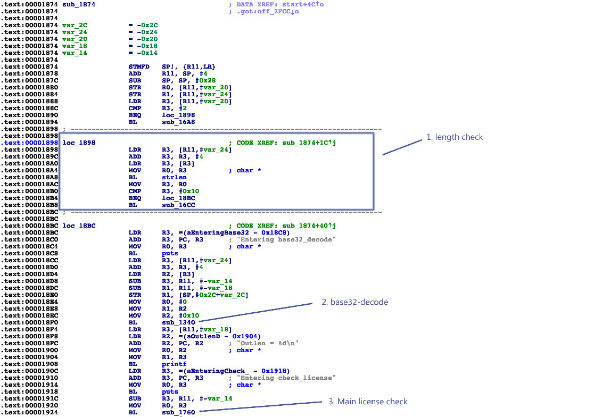

The main function is located at address 0x1874 in the disassembly (note that this is a PIE-enabled binary, and IDA Pro chooses 0x0 as the image base address). Function names have been stripped, but you can see some references to debugging strings. The input string appears  to be base32-decoded (call to sub_1340). At the beginning of `main`, there's a length check at loc_1898. It makes sure that the length of the input string is exactly 16 characters. So you're looking for a base32-encoded 16-character string! The decoded input is then passed to the function sub_1760, which validates the license key.

The decoded 16-character input string totals 10 bytes, so you know that the validation function expects a 10-byte binary string. Next, look at the core validation function at 0x1760:

```assembly_x68
.text:00001760 ; =============== S U B R O U T I N E =======================================
.text:00001760
.text:00001760 ; Attributes: bp-based frame
.text:00001760
.text:00001760 sub_1760                                ; CODE XREF: sub_1874+B0
.text:00001760
.text:00001760 var_20          = -0x20
.text:00001760 var_1C          = -0x1C
.text:00001760 var_1B          = -0x1B
.text:00001760 var_1A          = -0x1A
.text:00001760 var_19          = -0x19
.text:00001760 var_18          = -0x18
.text:00001760 var_14          = -0x14
.text:00001760 var_10          = -0x10
.text:00001760 var_C           = -0xC
.text:00001760
.text:00001760                 STMFD   SP!, {R4,R11,LR}
.text:00001764                 ADD     R11, SP, #8
.text:00001768                 SUB     SP, SP, #0x1C
.text:0000176C                 STR     R0, [R11,#var_20]
.text:00001770                 LDR     R3, [R11,#var_20]
.text:00001774                 STR     R3, [R11,#var_10]
.text:00001778                 MOV     R3, #0
.text:0000177C                 STR     R3, [R11,#var_14]
.text:00001780                 B       loc_17D0
.text:00001784 ; ---------------------------------------------------------------------------
.text:00001784
.text:00001784 loc_1784                                ; CODE XREF: sub_1760+78
.text:00001784                 LDR     R3, [R11,#var_10]
.text:00001788                 LDRB    R2, [R3]
.text:0000178C                 LDR     R3, [R11,#var_10]
.text:00001790                 ADD     R3, R3, #1
.text:00001794                 LDRB    R3, [R3]
.text:00001798                 EOR     R3, R2, R3
.text:0000179C                 AND     R2, R3, #0xFF
.text:000017A0                 MOV     R3, #0xFFFFFFF0
.text:000017A4                 LDR     R1, [R11,#var_14]
.text:000017A8                 SUB     R0, R11, #-var_C
.text:000017AC                 ADD     R1, R0, R1
.text:000017B0                 ADD     R3, R1, R3
.text:000017B4                 STRB    R2, [R3]
.text:000017B8                 LDR     R3, [R11,#var_10]
.text:000017BC                 ADD     R3, R3, #2
.text:000017C0                 STR     R3, [R11,#var_10]
.text:000017C4                 LDR     R3, [R11,#var_14]
.text:000017C8                 ADD     R3, R3, #1
.text:000017CC                 STR     R3, [R11,#var_14]
.text:000017D0
.text:000017D0 loc_17D0                                ; CODE XREF: sub_1760+20
.text:000017D0                 LDR     R3, [R11,#var_14]
.text:000017D4                 CMP     R3, #4
.text:000017D8                 BLE     loc_1784
.text:000017DC                 LDRB    R4, [R11,#var_1C]
.text:000017E0                 BL      sub_16F0
.text:000017E4                 MOV     R3, R0
.text:000017E8                 CMP     R4, R3
.text:000017EC                 BNE     loc_1854
.text:000017F0                 LDRB    R4, [R11,#var_1B]
.text:000017F4                 BL      sub_170C
.text:000017F8                 MOV     R3, R0
.text:000017FC                 CMP     R4, R3
.text:00001800                 BNE     loc_1854
.text:00001804                 LDRB    R4, [R11,#var_1A]
.text:00001808                 BL      sub_16F0
.text:0000180C                 MOV     R3, R0
.text:00001810                 CMP     R4, R3
.text:00001814                 BNE     loc_1854
.text:00001818                 LDRB    R4, [R11,#var_19]
.text:0000181C                 BL      sub_1728
.text:00001820                 MOV     R3, R0
.text:00001824                 CMP     R4, R3
.text:00001828                 BNE     loc_1854
.text:0000182C                 LDRB    R4, [R11,#var_18]
.text:00001830                 BL      sub_1744
.text:00001834                 MOV     R3, R0
.text:00001838                 CMP     R4, R3
.text:0000183C                 BNE     loc_1854
.text:00001840                 LDR     R3, =(aProductActivat - 0x184C)
.text:00001844                 ADD     R3, PC, R3      ; "Product activation passed. Congratulati"...
.text:00001848                 MOV     R0, R3          ; char *
.text:0000184C                 BL      puts
.text:00001850                 B       loc_1864
.text:00001854 ; ---------------------------------------------------------------------------
.text:00001854
.text:00001854 loc_1854                                ; CODE XREF: sub_1760+8C
.text:00001854                                         ; sub_1760+A0 ...
.text:00001854                 LDR     R3, =(aIncorrectSer_0 - 0x1860)
.text:00001858                 ADD     R3, PC, R3      ; "Incorrect serial."
.text:0000185C                 MOV     R0, R3          ; char *
.text:00001860                 BL      puts
.text:00001864
.text:00001864 loc_1864                                ; CODE XREF: sub_1760+F0
.text:00001864                 SUB     SP, R11, #8
.text:00001868                 LDMFD   SP!, {R4,R11,PC}
.text:00001868 ; End of function sub_1760
```

You can see a loop with some XOR-magic happening at loc_1784, which supposedly decodes the input string. Starting from loc_17DC, you can see a series of decoded values compared with values from further subfunction calls. Even though this doesn't look like highly sophisticated stuff, you'd still need to analyze more to completely reverse this check and generate a license key that passes it. Now comes the twist: dynamic symbolic execution enables you to construct a valid key automatically! The symbolic execution engine maps a path between the first instruction of the license check (0x1760) and the code that prints the "Product activation passed" message (0x1840) to determine the constraints on each byte of the input string. The solver engine then finds an input that satisfies those constraints: the valid license key.

You need to provide several inputs to the symbolic execution engine:

- An address from which execution will start. Initialize the state with the first instruction of the serial validation function. This makes the problem significantly easier to solve because you avoid symbolically executing the base32 implementation.

- The address of the code block you want execution to reach. You need to find a path to the code responsible for printing the "Product activation passed" message. This code block starts at 0x1840.

- Addresses you don't want to reach. You're not interested in any path that ends with the block of code that prints the "Incorrect serial" message (0x1854).

Note that the Angr loader will load the PIE executable with a base address of 0x400000, so you must add this to the addresses above. The solution is

```python
#!/usr/bin/python

# This is how we defeat the Android license check using Angr!
# The binary is available for download on GitHub:
# https://github.com/b-mueller/obfuscation-metrics/tree/master/crackmes/android/01_license_check_1
# Written by Bernhard -- bernhard [dot] mueller [at] owasp [dot] org

import angr
import claripy
import base64

load_options = {}

# Android NDK library path:
load_options['custom_ld_path'] = ['/Users/berndt/Tools/android-ndk-r10e/platforms/android-21/arch-arm/usr/lib']

b = angr.Project("./validate", load_options = load_options)

# The key validation function starts at 0x401760, so that's where we create the initial state.
# This speeds things up a lot because we're bypassing the Base32-encoder.

state = b.factory.blank_state(addr=0x401760)

initial_path = b.factory.path(state)
path_group = b.factory.path_group(state)

# 0x401840 = Product activation passed
# 0x401854 = Incorrect serial

path_group.explore(find=0x401840, avoid=0x401854)
found = path_group.found[0]

# Get the solution string from *(R11 - 0x24).

addr = found.state.memory.load(found.state.regs.r11 - 0x24, endness='Iend_LE')
concrete_addr = found.state.se.any_int(addr)
solution = found.state.se.any_str(found.state.memory.load(concrete_addr,10))

print base64.b32encode(solution)
```

Note the last part of the program, where the final input string is retrieved—it appears as if you were simply reading the solution from memory. You are, however, reading from symbolic memory—neither the string nor the pointer to it actually exist! Actually, the solver is computing concrete values that you could find  in that program state if you observed the actual program run up to that point.

Running this script should return the following:

```
(angr) $ python solve.py
WARNING | 2017-01-09 17:17:03,664 | cle.loader | The main binary is a position-independent executable. It is being loaded with a base address of 0x400000.
JQAE6ACMABNAAIIA
```

### Customizing Android for Reverse Engineering

Working on real devices has advantages, especially for interactive, debugger-supported static/dynamic analysis. For example, working on a real device is simply faster. Also, Running the target app on a real device is less likely to trigger defenses. Instrumenting the live environment at strategic points gives you useful tracing functionality and the ability to manipulate the environment, which will help you bypass any anti-tampering defenses the app might implement.

#### Customizing the RAMDisk

Initramfs is a small CPIO archive stored inside the boot image. It contains a few files that are required at boot, before the actual root file system is mounted. On Android, initramfs stays mounted indefinitely. It contains an important configuration file, default.prop, that defines some basic system properties. Changing this file can make the Android environment easier to reverse engineer. For our purposes, the most important settings in default.prop are `ro.debuggable` and `ro.secure`.

```bash
$ cat /default.prop                                         
#
# ADDITIONAL_DEFAULT_PROPERTIES
#
ro.secure=1
ro.allow.mock.location=0
ro.debuggable=1
ro.zygote=zygote32
persist.radio.snapshot_enabled=1
persist.radio.snapshot_timer=2
persist.radio.use_cc_names=true
persist.sys.usb.config=mtp
rild.libpath=/system/lib/libril-qc-qmi-1.so
camera.disable_zsl_mode=1
ro.adb.secure=1
dalvik.vm.dex2oat-Xms=64m
dalvik.vm.dex2oat-Xmx=512m
dalvik.vm.image-dex2oat-Xms=64m
dalvik.vm.image-dex2oat-Xmx=64m
ro.dalvik.vm.native.bridge=0
```

Setting ro.debuggable to 1 makes all running apps debuggable (i.e., the debugger thread will run in every process), regardless of the value of the android:debuggable attribute in the app's Manifest. Setting ro.secure to 0 causes adbd to run as root.
To modify initrd on any Android device, back up the original boot image with TWRP or dump it with the following command:

```bash
$ adb shell cat /dev/mtd/mtd0 >/mnt/sdcard/boot.img
$ adb pull /mnt/sdcard/boot.img /tmp/boot.img
```

To extract the contents of the boot image, use the abootimg tool as described in Krzysztof Adamski's how-to :

```bash
$ mkdir boot
$ cd boot
$ ../abootimg -x /tmp/boot.img
$ mkdir initrd
$ cd initrd
$ cat ../initrd.img | gunzip | cpio -vid
```

Note the boot parameters written to bootimg.cfg; you'll need them when booting your new kernel and ramdisk.

```bash
$ ~/Desktop/abootimg/boot$ cat bootimg.cfg
bootsize = 0x1600000
pagesize = 0x800
kerneladdr = 0x8000
ramdiskaddr = 0x2900000
secondaddr = 0xf00000
tagsaddr = 0x2700000
name =
cmdline = console=ttyHSL0,115200,n8 androidboot.hardware=hammerhead user_debug=31 maxcpus=2 msm_watchdog_v2.enable=1
```

Modify default.prop and package your new ramdisk:

```bash
$ cd initrd
$ find . | cpio --create --format='newc' | gzip > ../myinitd.img
```

#### Customizing the Android Kernel

The Android kernel is a powerful ally to the reverse engineer. Although regular Android apps are hopelessly restricted and sandboxed, you, the reverser, can customize and alter the behavior of the operating system and kernel any way you wish. This gives you an advantage because most integrity checks and anti-tampering features ultimately rely on services performed by the kernel. Deploying a kernel that abuses this trust and unabashedly lies about itself and the environment, goes a long way in defeating most reversing defenses that malware authors (or normal developers) can throw at you.

Android apps have several ways to interact with the OS. Interacting through the Android Application Framework's APIs is standard. At the lowest level, however, many important functions (such as allocating memory and accessing files) are translated into old-school Linux system calls. On ARM Linux, system calls are invoked via the SVC instruction, which triggers a software interrupt. This interrupt calls the `vector_swi()` kernel function, which then uses the system call number as an offset into a table (known as sys_call_table on Android) of function pointers.

The most straightforward way to intercept system calls is to inject your own code into kernel memory, then overwrite the original function in the system call table to redirect execution. Unfortunately, current stock Android kernels enforce memory restrictions that prevent this. Specifically, stock Lollipop and Marshmallow kernels are built with the CONFIG_STRICT_MEMORY_RWX option enabled. This prevents writing to kernel memory regions marked as read-only, so any attempt to patch kernel code or the system call table result in a segmentation fault and reboot. To get around this, build your own kernel. You can then deactivate this protection and make many other useful customizations that simplify reverse engineering. If you reverse Android apps on a regular basis, building your own reverse engineering sandbox is a no-brainer.

For hacking, I recommend an AOSP-supported device. Google's Nexus smartphones and tablets are the most logical candidates because kernels and system components built from the AOSP run on them without issues. Sony's Xperia series is also known for its openness. To build the AOSP kernel, you need a toolchain (a set of programs for cross-compiling the sources) and the appropriate version of the kernel sources. Follow Google's instructions to identify the correct git repo and branch for a given device and Android version.

https://source.android.com/source/building-kernels.html#id-version

For example, to get kernel sources for Lollipop that are compatible with the Nexus 5, you need to clone the `msm` repo and check out one of the `android-msm-hammerhead` branches (hammerhead is the codename of the Nexus 5, and finding the right branch is confusing). Once you have downloaded the sources, create the default kernel config with the command `make hammerhead_defconfig` (replacing "hammerhead" with your target device).

```bash
$ git clone https://android.googlesource.com/kernel/msm.git
$ cd msm
$ git checkout origin/android-msm-hammerhead-3.4-lollipop-mr1
$ export ARCH=arm
$ export SUBARCH=arm
$ make hammerhead_defconfig
$ vim .config
```

I recommend using the following settings to add loadable module support, enable the most important tracing facilities, and open kernel memory for patching.

```
CONFIG_MODULES=Y
CONFIG_STRICT_MEMORY_RWX=N
CONFIG_DEVMEM=Y
CONFIG_DEVKMEM=Y
CONFIG_KALLSYMS=Y
CONFIG_KALLSYMS_ALL=Y
CONFIG_HAVE_KPROBES=Y
CONFIG_HAVE_KRETPROBES=Y
CONFIG_HAVE_FUNCTION_TRACER=Y
CONFIG_HAVE_FUNCTION_GRAPH_TRACER=Y
CONFIG_TRACING=Y
CONFIG_FTRACE=Y
CONFIG KDB=Y
```

Once you're finished editing save the .config file, build the kernel.

```bash
$ export ARCH=arm
$ export SUBARCH=arm
$ export CROSS_COMPILE=/path_to_your_ndk/arm-eabi-4.8/bin/arm-eabi-
$ make
```

You can now create a standalone toolchain for cross-compiling the kernel and subsequent tasks. To create a toolchain for Android Nougat, run make-standalone-toolchain.sh from the Android NDK package:

```bash
$ cd android-ndk-rXXX
$ build/tools/make-standalone-toolchain.sh --arch=arm --platform=android-24 --install-dir=/tmp/my-android-toolchain
```

Set the CROSS_COMPILE environment variable to point to your NDK directory and run "make" to build
the kernel.

```bash
$ export CROSS_COMPILE=/tmp/my-android-toolchain/bin/arm-eabi-
$ make
```

#### Booting the Custom Environment

Before booting into the new kernel, make a copy of your device's original boot image. Find the boot partition:

```bash
root@hammerhead:/dev # ls -al /dev/block/platform/msm_sdcc.1/by-name/         
lrwxrwxrwx root     root              1970-08-30 22:31 DDR -> /dev/block/mmcblk0p24
lrwxrwxrwx root     root              1970-08-30 22:31 aboot -> /dev/block/mmcblk0p6
lrwxrwxrwx root     root              1970-08-30 22:31 abootb -> /dev/block/mmcblk0p11
lrwxrwxrwx root     root              1970-08-30 22:31 boot -> /dev/block/mmcblk0p19
(...)
lrwxrwxrwx root     root              1970-08-30 22:31 userdata -> /dev/block/mmcblk0p28
```

Then dump the whole thing into a file:

```bash
$ adb shell "su -c dd if=/dev/block/mmcblk0p19 of=/data/local/tmp/boot.img"
$ adb pull /data/local/tmp/boot.img
```

Next, extract the ramdisk and information about the structure of the boot image. There are various tools that can do this;  I used Gilles Grandou's abootimg tool. Install the tool and run the following command on your boot image:

```bash
$ abootimg -x boot.img
```

This should create the files bootimg.cfg, initrd.img, and zImage (your original kernel) in the local directory.

You can now use fastboot to test the new kernel. The `fastboot boot` command allows you to run the kernel without actually flashing it (once you're sure everything works, you can make the changes permanent with fastboot flash, but you don't have to). Restart the device in fastboot mode with the following command:

```bash
$ adb reboot bootloader
```

Then use the `fastboot boot` command to boot Android with the new kernel. Specify the kernel offset, ramdisk offset, tags offset, and command line (use the values listed in your extracted bootimg.cfg) in addition to the newly built kernel and the original ramdisk.

```bash
$ fastboot boot zImage-dtb initrd.img --base 0 --kernel-offset 0x8000 --ramdisk-offset 0x2900000 --tags-offset 0x2700000 -c "console=ttyHSL0,115200,n8 androidboot.hardware=hammerhead user_debug=31 maxcpus=2 msm_watchdog_v2.enable=1"
```

The system should now boot normally. To quickly verify that the correct kernel is running, navigate to Settings->About phone and check the "kernel version" field.


#### System Call Hooking with Kernel Modules

System call hooking allows you to attack any anti-reversing defenses that depend on kernel-provided functionality . With your custom kernel in place, you can now use an LKM to load additional code into the kernel. You also have access to the /dev/kmem interface, which you can use to patch kernel memory on-the-fly. This is a classic Linux rootkit technique that has been described for Android by Dong-Hoon You [1].


You first need the address of sys_call_table. Fortunately, it is exported as a symbol in the Android kernel (iOS reversers aren't so lucky). You can look up the address in the /proc/kallsyms file:

```bash
$ adb shell "su -c echo 0 > /proc/sys/kernel/kptr_restrict"
$ adb shell cat /proc/kallsyms | grep sys_call_table
c000f984 T sys_call_table
```

This is the only memory address you need for writing your kernel module—you can calculate everything else with offsets taken from the kernel headers (hopefully, you didn't delete them yet).

##### Example: File Hiding

In this how-to, we will use a Kernel module to hide a file. Create a file on the device so you can hide it later:

```bash
$ adb shell "su -c echo ABCD > /data/local/tmp/nowyouseeme"             
$ adb shell cat /data/local/tmp/nowyouseeme
ABCD
```bash

It's time to write the kernel module. For file-hiding, you'll need to hook one of the system calls used to open (or check for the existence of) files. There are many of these—open, openat, access, accessat, facessat, stat, fstat, etc. For now, you'll only hook the openat system call.  This is the syscall the /bin/cat program uses when accessing a file, so the call should be suitable for a demonstration.

You can find the function prototypes for all system calls in the kernel header file arch/arm/include/asm/unistd.h. Create a file called kernel_hook.c with the following code:

```c
#include <linux/kernel.h>
#include <linux/module.h>
#include <linux/moduleparam.h>
#include <linux/unistd.h>
#include <linux/slab.h>
#include <asm/uaccess.h>

asmlinkage int (*real_openat)(int, const char __user*, int);

void **sys_call_table;

int new_openat(int dirfd, const char \__user* pathname, int flags)
{
  char *kbuf;
  size_t len;

  kbuf=(char*)kmalloc(256,GFP_KERNEL);
  len = strncpy_from_user(kbuf,pathname,255);

  if (strcmp(kbuf, "/data/local/tmp/nowyouseeme") == 0) {
    printk("Hiding file!\n");
    return -ENOENT;
  }

  kfree(kbuf);

  return real_openat(dirfd, pathname, flags);
}

int init_module() {

  sys_call_table = (void*)0xc000f984;
  real_openat = (void*)(sys_call_table[__NR_openat]);

return 0;

}
```

To build the kernel module, you need the kernel sources and a working toolchain. Since you've already built a complete kernel, you're all set. Create a Makefile with the following content:

```make
KERNEL=[YOUR KERNEL PATH]
TOOLCHAIN=[YOUR TOOLCHAIN PATH]

obj-m := kernel_hook.o

all:
        make ARCH=arm CROSS_COMPILE=$(TOOLCHAIN)/bin/arm-eabi- -C $(KERNEL) M=$(shell pwd) CFLAGS_MODULE=-fno-pic modules

clean:
        make -C $(KERNEL) M=$(shell pwd) clean
```

Run make to compile the code—this should create the file kernel_hook.ko. Copy kernel_hook.ko to the device and load it with the `insmod` command. Using the `lsmod` command, verify that the module has been loaded successfully.

```bash
$ make
(...)
$ adb push kernel_hook.ko /data/local/tmp/
[100%] /data/local/tmp/kernel_hook.ko
$ adb shell su -c insmod /data/local/tmp/kernel_hook.ko
$ adb shell lsmod
kernel_hook 1160 0 [permanent], Live 0xbf000000 (PO)
```

Now you'll access /dev/kmem to overwrite the original function pointer in sys_call_table with the address of your newly injected function (this could have been done directly in the kernel module, but /dev/kmem provides an easy way to toggle your hooks on and off). I have adapted the code from [Dong-Hoon You's Phrack article](http://phrack.org/issues/68/6.html "Phrack Magazine - Android Platform based Linux kernel rootkit") for this purpose. However, I used the file interface instead of mmap() because I found that the latter caused kernel panics. Create a file called kmem_util.c with the following code:

```c
#include <stdio.h>
#include <stdlib.h>
#include <fcntl.h>
#include <asm/unistd.h>
#include <sys/mman.h>

#define MAP_SIZE 4096UL
#define MAP_MASK (MAP_SIZE - 1)

int kmem;
void read_kmem2(unsigned char *buf, off_t off, int sz)
{
  off_t offset; ssize_t bread;
  offset = lseek(kmem, off, SEEK_SET);
  bread = read(kmem, buf, sz);
  return;
}

void write_kmem2(unsigned char *buf, off_t off, int sz) {
  off_t offset; ssize_t written;
  offset = lseek(kmem, off, SEEK_SET);
  if (written = write(kmem, buf, sz) == -1) { perror("Write error");
    exit(0);
  }
  return;
}

int main(int argc, char *argv[]) {

  off_t sys_call_table;
  unsigned int addr_ptr, sys_call_number;

  if (argc < 3) {
    return 0;
  }

  kmem=open("/dev/kmem",O_RDWR);

  if(kmem<0){
    perror("Error opening kmem"); return 0;
  }

  sscanf(argv[1], "%x", &sys_call_table); sscanf(argv[2], "%d", &sys_call_number);
  sscanf(argv[3], "%x", &addr_ptr); char buf[256];
  memset (buf, 0, 256); read_kmem2(buf,sys_call_table+(sys_call_number*4),4);
  printf("Original value: %02x%02x%02x%02x\n", buf[3], buf[2], buf[1], buf[0]);       
  write_kmem2((void*)&addr_ptr,sys_call_table+(sys_call_number*4),4);
  read_kmem2(buf,sys_call_table+(sys_call_number*4),4);
  printf("New value: %02x%02x%02x%02x\n", buf[3], buf[2], buf[1], buf[0]);
  close(kmem);

  return 0;
}
```

Beginning with Android Lollipop, all executables must be compiled with PIE support. Build kmem_util.c with the prebuilt toolchain and copy it to the device :

```bash
$ /tmp/my-android-toolchain/bin/arm-linux-androideabi-gcc -pie -fpie -o kmem_util kmem_util.c
$ adb push kmem_util /data/local/tmp/
$ adb shell chmod 755 /data/local/tmp/kmem_util
```

Before you start accessing kernel memory, you still need to know the correct offset into the system call table. The openat system call is defined in unistd.h, which is in the kernel sources:

```bash
$ grep -r "__NR_openat" arch/arm/include/asm/unistd.h
\#define __NR_openat            (__NR_SYSCALL_BASE+322)
```

The final piece of the puzzle is the address of your replacement-openat. Again, you can get this address from /proc/kallsyms.

```bash
$ adb shell cat /proc/kallsyms | grep new_openat
bf000000 t new_openat    [kernel_hook]
```

Now you have everything you need to overwrite the sys_call_table entry. The syntax for kmem_util is:

```bash
./kmem_util <syscall_table_base_address> <offset> <func_addr>
```

The following command patches the openat system call table so that it points to your new function.

```bash
$ adb shell su -c /data/local/tmp/kmem_util c000f984 322 bf000000
Original value: c017a390
New value: bf000000
```


Assuming that everything worked, /bin/cat shouldn't be able to "see" the file.

```bash
$ adb shell su -c cat /data/local/tmp/nowyouseeme
tmp-mksh: cat: /data/local/tmp/nowyouseeme: No such file or directory
```

Voilà! The file "nowyouseeme" is now somewhat hidden from all usermode processes (note that you need to do a lot more to properly hide a file, including hooking stat(), access(), and other system calls).

File-hiding is of course only the tip of the iceberg: you can accomplish a lot using kernel modules, including bypassing many root detection measures, integrity checks, and anti-debugging measures. You can find more examples in the "case studies" section of [Bernhard Mueller's Hacking Soft Tokens Paper](https://packetstormsecurity.com/files/138504/HITB_Hacking_Soft_Tokens_v1.2.pdf).
