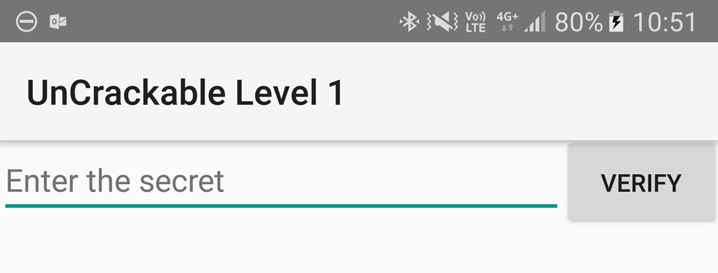
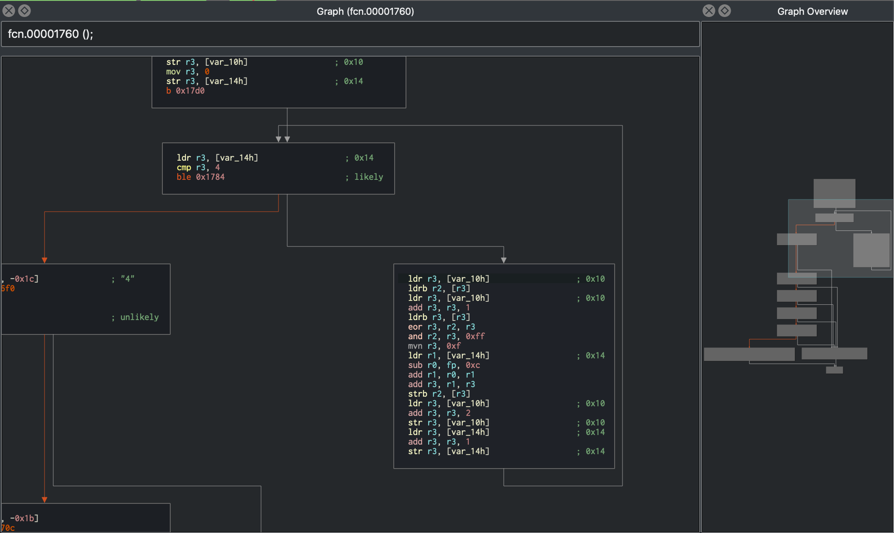
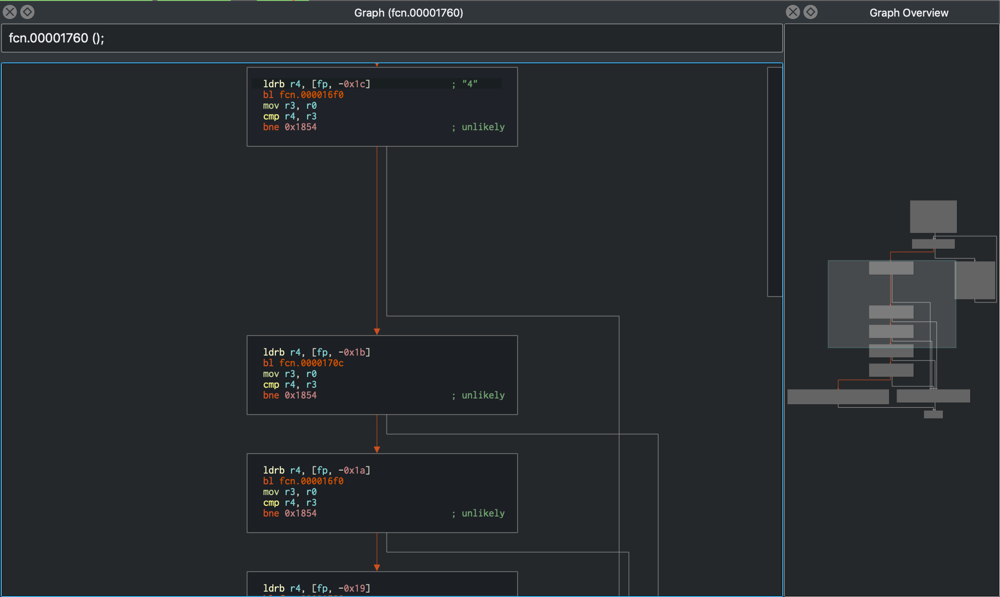
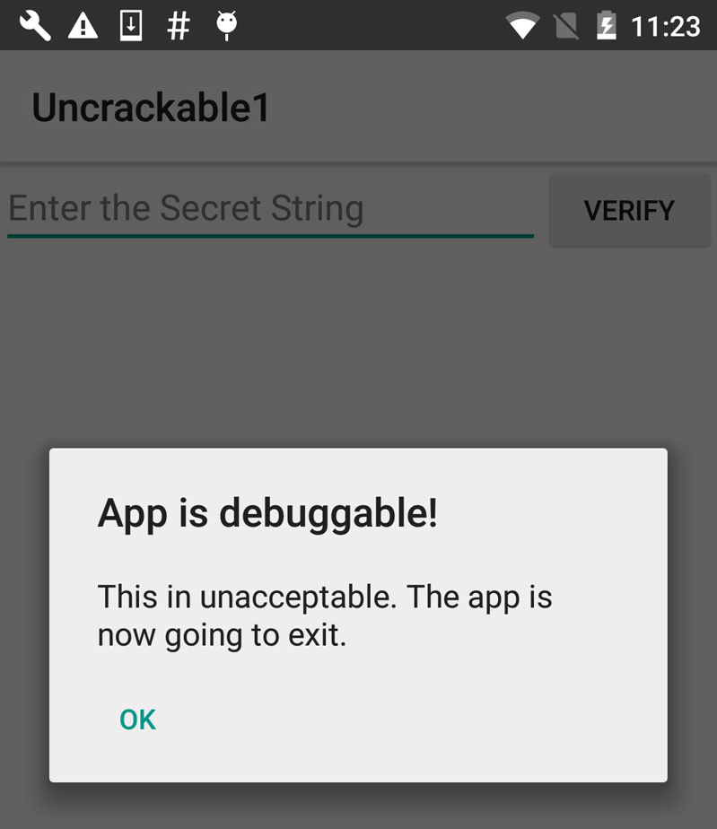

## Tampering and Reverse Engineering on Android

Android's openness makes it a favorable environment for reverse engineers. In the following chapter, we'll look at some peculiarities of Android reversing and OS-specific tools as processes.

Android offers reverse engineers big advantages that are not available with iOS. Because Android is open source, you can study its source code at the Android Open Source Project (AOSP) and modify the OS and its standard tools any way you want. Even on standard retail devices it is possible to do things like activating developer mode and sideloading apps without jumping through many hoops. From the powerful tools shipping with the SDK to the wide range of available reverse engineering tools, there's a lot of niceties to make your life easier.

However, there are also a few Android-specific challenges. For example, you'll need to deal with both Java bytecode and native code. Java Native Interface (JNI) is sometimes deliberately used to confuse reverse engineers (to be fair, there are legitimate reasons for using JNI, such as improving performance or supporting legacy code). Developers sometimes use the native layer to "hide" data and functionality, and they may structure their apps such that execution frequently jumps between the two layers.

You'll need at least a working knowledge of both the Java-based Android environment and the Linux OS and Kernel, on which Android is based. You'll also need the right toolset to deal with both bytecode running on the Java virtual machine and native code.

Note that we'll use the [OWASP Mobile Testing Guide Crackmes](https://github.com/OWASP/owasp-mstg/blob/master/Crackmes/ "UnCrackable Mobile Apps") as examples for demonstrating various reverse engineering techniques in the following sections, so expect partial and full spoilers. We encourage you to have a crack at the challenges yourself before reading on!

### Reverse Engineering

Reverse engineering is the process of taking an app apart to find out how it works. You can do this by examining the compiled app (static analysis), observing the app during run time (dynamic analysis), or a combination of both.

#### Tooling

Make sure that the following is installed on your system (see the "[Android Basic Security Testing](0x05b-Basic-Security_Testing.md)" chapter for installation instructions):

- The newest SDK Tools and SDK Platform-Tools packages. These packages include the Android Debugging Bridge (ADB) client and other tools that interface with the Android platform.
- The Android NDK. This is the Native Development Kit that contains prebuilt toolchains for cross-compiling native code for different architectures. You'll need it if you plan to deal with native code, e.g. to inspect it or to be able to debug or trace it (the NDK contains useful prebuilt versions of such as gdbserver or strace for various architectures).

In addition to the SDK and NDK, you'll also need something to make Java bytecode more human-readable. Fortunately, Java decompilers generally handle Android bytecode well. Popular free decompilers include [JD](http://jd.benow.ca/ "JD"), [JAD](http://www.javadecompilers.com/jad "JAD"), [Procyon](https://bitbucket.org/mstrobel/procyon/overview "Procyon"), and [CFR](https://www.benf.org/other/cfr/ "CFR"). For convenience, we have packed some of these decompilers into our [apkx wrapper script](https://github.com/b-mueller/apkx "apkx - APK Decompilation for the Lazy"). This script completely automates the process of extracting Java code from release APK files and makes it easy to experiment with different backends (we'll also use it in some of the following examples).

Other tools are really a matter of preference and budget. A ton of free and commercial disassemblers, decompilers, and frameworks with different strengths and weaknesses exist. We'll be covering some of them in this chapter.

##### Building a Reverse Engineering Environment for Free

With a little effort, you can build a reasonable GUI-based reverse engineering environment for free.

For navigating the decompiled sources, we recommend [IntelliJ](https://www.jetbrains.com/idea/ "IntelliJ IDEA"), a relatively lightweight IDE that works great for browsing code and allows basic on-device debugging of the decompiled apps. However, if you prefer something that's clunky, slow, and complicated to use, [Eclipse](https://eclipse.org/ide/ "Eclipse") is the right IDE for you (based on the author's personal bias).

If you don't mind looking at Smali instead of Java, you can use the [smalidea plugin for IntelliJ](https://github.com/JesusFreke/smali/wiki/smalidea "Smalidea") for debugging. Smalidea supports single-stepping through the bytecode and identifier renaming, and it watches for non-named registers, which makes it much more powerful than a JD + IntelliJ setup.

[apktool](https://ibotpeaches.github.io/Apktool/ "apktool") is a popular free tool that can extract and disassemble resources directly from the APK archive and disassemble Java bytecode to Smali format (Smali/Baksmali is an assembler/disassembler for the Dex format. It's also Icelandic for "Assembler/Disassembler"). apktool allows you to reassemble the package, which is useful for patching and applying changes to the Android Manifest.

You can accomplish more elaborate tasks (such as program analysis and automated de-obfuscation) with open source reverse engineering frameworks such as [Radare2](https://www.radare.org "Radare2") and [Angr](https://angr.io/ "Angr"). You'll find usage examples for many of these free tools and frameworks throughout the guide.

##### Commercial Tools

Building a reverse engineering environment for free is possible. However, there are some commercial alternatives. The most commonly used are:

- [JEB](https://www.pnfsoftware.com "JEB Decompiler"), a commercial decompiler, packs all the functionality necessary for static and dynamic analysis of Android apps into an all-in-one package. It is reasonably reliable and includes prompt support. It has a built-in debugger, which allows for an efficient workflow—setting breakpoints directly in the decompiled (and annotated) sources is invaluable, especially with ProGuard-obfuscated bytecode. Of course, convenience like this doesn't come cheap, and now that JEB is provided via a subscription-based license, you'll have to pay a monthly fee to use it.

- [IDA Pro](https://www.hex-rays.com/products/ida/ "IDA Pro") in its paid version is compatible with ARM, MIPS, Java bytecode, and, of course, Intel ELF binaries. It also comes with debuggers for both Java applications and native processes. With its powerful scripting, disassembling, and extension capabilities, IDA Pro usually works great for static analysis of native programs and libraries. However, the static analysis facilities it offers for Java code are rather basic: you get the Smali disassembly but not much more. You can't navigate the package and class structure, and some actions (such as renaming classes) can't performed, which can make working with more complex Java apps tedious. In addition, unless you can afford the paid version, it won't be of help when reversing native code as the freeware version does not support the ARM processor type.

#### Disassembling and Decompiling

In Android app security testing, if the application is based solely on Java and doesn't have any native code (C/C++ code), the reverse engineering process is relatively easy and recovers (decompiles) almost all the source code. In those cases, black-box testing (with access to the compiled binary, but not the original source code) can get pretty close to white-box testing.

Nevertheless, if the code has been purposefully obfuscated (or some tool-breaking anti-decompilation tricks have been applied), the reverse engineering process may be very time-consuming and unproductive. This also applies to applications that contain native code. They can still be reverse engineered, but the process is not automated and requires knowledge of low-level details.

##### Decompiling Java Code

The process of decompilation consists of converting Java bytecode back into Java source code. We'll be using UnCrackable App for Android Level 1 in the following examples, so download it if you haven't already. First, let's install the app on a device or emulator and run it to see what the crackme is about.

```shell
$ wget https://github.com/OWASP/owasp-mstg/raw/master/Crackmes/Android/Level_01/UnCrackable-Level1.apk
$ adb install UnCrackable-Level1.apk
```



Seems like we're expected to find some kind of secret code!

We're looking for a secret string stored somewhere inside the app, so the next step is to look inside. First, unzip the APK file and look at the content.

```shell
$ unzip UnCrackable-Level1.apk -d UnCrackable-Level1
Archive:  UnCrackable-Level1.apk
  inflating: UnCrackable-Level1/AndroidManifest.xml  
  inflating: UnCrackable-Level1/res/layout/activity_main.xml  
  inflating: UnCrackable-Level1/res/menu/menu_main.xml  
 extracting: UnCrackable-Level1/res/mipmap-hdpi-v4/ic_launcher.png  
 extracting: UnCrackable-Level1/res/mipmap-mdpi-v4/ic_launcher.png  
 extracting: UnCrackable-Level1/res/mipmap-xhdpi-v4/ic_launcher.png  
 extracting: UnCrackable-Level1/res/mipmap-xxhdpi-v4/ic_launcher.png  
 extracting: UnCrackable-Level1/res/mipmap-xxxhdpi-v4/ic_launcher.png  
 extracting: UnCrackable-Level1/resources.arsc  
  inflating: UnCrackable-Level1/classes.dex  
  inflating: UnCrackable-Level1/META-INF/MANIFEST.MF  
  inflating: UnCrackable-Level1/META-INF/CERT.SF  
  inflating: UnCrackable-Level1/META-INF/CERT.RSA  

```

In the standard setup, all the Java bytecode and app data is in the file `classes.dex` in the app root directory. This file conforms to the Dalvik Executable Format (DEX), an Android-specific way of packaging Java programs. Most Java decompilers take plain class files or JARs as input, so you need to convert the classes.dex file into a JAR first. You can do this with `dex2jar` or `enjarify`.

Once you have a JAR file, you can use any free decompiler to produce Java code. In this example, we'll use the [CFR decompiler](https://www.benf.org/other/cfr/ "CFR decompiler"). CFR is under active development, and brand-new releases are available on the author's website. CFR was released under an MIT license, so you can use it freely even though its source code is not available.

The easiest way to run CFR is through `apkx`, which also packages `dex2jar` and automates extraction, conversion, and decompilation. Install it:

```shell
$ git clone https://github.com/b-mueller/apkx
$ cd apkx
$ sudo ./install.sh
```

This should copy `apkx` to `/usr/local/bin`. Run it on `UnCrackable-Level1.apk`:

```shell
$ apkx UnCrackable-Level1.apk
Extracting UnCrackable-Level1.apk to UnCrackable-Level1
Converting: classes.dex -> classes.jar (dex2jar)
dex2jar UnCrackable-Level1/classes.dex -> UnCrackable-Level1/classes.jar
Decompiling to UnCrackable-Level1/src (cfr)
```

You should now find the decompiled sources in the directory `Uncrackable-Level1/src`. To view the sources, a simple text editor (preferably with syntax highlighting) is fine, but loading the code into a Java IDE makes navigation easier. Let's import the code into IntelliJ, which also provides on-device debugging functionality.

Open IntelliJ and select "Android" as the project type in the left tab of the "New Project" dialog. Enter "Uncrackable1" as the application name and "vantagepoint.sg" as the company name. This results in the package name "sg.vantagepoint.uncrackable1", which matches the original package name. Using a matching package name is important if you want to attach the debugger to the running app later on because Intellij uses the package name to identify the correct process.


In the next dialog, pick any API number; you don't actually want to compile the project, so the number doesn't matter. Click "next" and choose "Add no Activity", then click "finish".

Once you have created the project, expand the "1: Project" view on the left and navigate to the folder `app/src/main/java`. Right-click and delete the default package "sg.vantagepoint.uncrackable1" created by IntelliJ.


Now, open the `Uncrackable-Level1/src` directory in a file browser and drag the `sg` directory into the now empty `Java` folder in the IntelliJ project view (hold the "alt" key to copy the folder instead of moving it).


You'll end up with a structure that resembles the original Android Studio project from which the app was built.


See the section "[Reviewing Decompiled Java Code](#reviewing-decompiled-java-code "Reviewing Decompiled Java Code")" below to learn on how to proceed when inspecting the decompiled Java code.

##### Disassembling Native Code

Dalvik and ART both support the Java Native Interface (JNI), which defines a way for Java code to interact with native code written in C/C++. As on other Linux-based operating systems, native code is packaged (compiled) into ELF dynamic libraries (\*.so), which the Android app loads at run time via the `System.load` method. However, instead of relying on widely used C libraries (such as glibc), Android binaries are built against a custom libc named [Bionic](https://github.com/android/platform_bionic "Bionic libc"). Bionic adds support for important Android-specific services such as system properties and logging, and it is not fully POSIX-compatible.

When reversing Android apps containing native code you'll have to consider this especial layer between Java and native code (JNI). It worths also noticing that when reversing the native code you'll need a disassembler. Once your binary is loaded, you'll be looking at disassembly, which is not _easy_ to look at as Java code.

In the next example we'll reverse the HelloWorld-JNI.apk from the OWASP MSTG repository. Installing and running it on your emulator or Android device is optional.

```shell
$ wget https://github.com/OWASP/owasp-mstg/raw/master/Samples/Android/01_HelloWorld-JNI/HelloWord-JNI.apk
```

> This app is not exactly spectacular—all it does is show a label with the text "Hello from C++". This is the app Android generates by default when you create a new project with C/C++ support— it's just enough to show the basic principles of JNI calls.


Decompile the APK with `apkx`.

```shell
$ apkx HelloWord-JNI.apk
Extracting HelloWord-JNI.apk to HelloWord-JNI
Converting: classes.dex -> classes.jar (dex2jar)
dex2jar HelloWord-JNI/classes.dex -> HelloWord-JNI/classes.jar
Decompiling to HelloWord-JNI/src (cfr)
```

This extracts the source code into the `HelloWord-JNI/src` directory. The main activity is found in the file `HelloWord-JNI/src/sg/vantagepoint/helloworldjni/MainActivity.java`. The "Hello World" text view is populated in the `onCreate` method:

```java
public class MainActivity
extends AppCompatActivity {
    static {
        System.loadLibrary("native-lib");
    }

    @Override
    protected void onCreate(Bundle bundle) {
        super.onCreate(bundle);
        this.setContentView(2130968603);
        ((TextView)this.findViewById(2131427422)).setText((CharSequence)this.stringFromJNI());
    }

    public native String stringFromJNI();
}
```

Note the declaration of `public native String stringFromJNI` at the bottom. The keyword "native" tells the Java compiler that this method is implemented in a native language. The corresponding function is resolved during run time, but only if a native library that exports a global symbol with the expected signature is loaded (signatures comprise a package name, class name, and method name). In this example, this requirement is satisfied by the following C or C++ function:

```c
JNIEXPORT jstring JNICALL Java_sg_vantagepoint_helloworld_MainActivity_stringFromJNI(JNIEnv *env, jobject)
```

So where is the native implementation of this function? If you look into the `lib` directory of the APK archive, you'll see eight subdirectories named after different processor architectures. Each of these directories contains a version of the native library `libnative-lib.so` that has been compiled for the processor architecture in question. When `System.loadLibrary` is called, the loader selects the correct version based on the device that the app is running on.


Following the naming convention mentioned above, you can expect the library to export a symbol called `Java_sg_vantagepoint_helloworld_MainActivity_stringFromJNI`. On Linux systems, you can retrieve the list of symbols with `readelf` (included in GNU binutils) or `nm`. Do this on Mac OS with the `greadelf` tool, which you can install via Macports or Homebrew. The following example uses `greadelf`:

```shell
$ greadelf -W -s libnative-lib.so | grep Java
     3: 00004e49   112 FUNC    GLOBAL DEFAULT   11 Java_sg_vantagepoint_helloworld_MainActivity_stringFromJNI
```

You can also see this using radare2's rabin2:

```shell
$ rabin2 -s HelloWord-JNI/lib/armeabi-v7a/libnative-lib.so | grep -i Java
003 0x00000e78 0x00000e78 GLOBAL   FUNC   16 Java_sg_vantagepoint_helloworldjni_MainActivity_stringFromJNI
```

This is the native function that eventually gets executed when the `stringFromJNI` native method is called.

To disassemble the code, you can load `libnative-lib.so` into any disassembler that understands ELF binaries (i.e., any disassembler). If the app ships with binaries for different architectures, you can theoretically pick the architecture you're most familiar with, as long as it is compatible with the disassembler. Each version is compiled from the same source and implements the same functionality. However, if you're planning to debug the library on a live device later, it's usually wise to pick an ARM build.

To support both older and newer ARM processors, Android apps ship with multiple ARM builds compiled for different Application Binary Interface (ABI) versions. The ABI defines how the application's machine code is supposed to interact with the system at run time. The following ABIs are supported:

- armeabi: ABI is for ARM-based CPUs that support at least the ARMv5TE instruction set.
- armeabi-v7a: This ABI extends armeabi to include several CPU instruction set extensions.
- arm64-v8a: ABI for ARMv8-based CPUs that support AArch64, the new 64-bit ARM architecture.

Most disassemblers can handle any of those architectures. Below, we'll be viewing the armeabi-v7a version (located in `HelloWord-JNI/lib/armeabi-v7a/libnative-lib.so`) in radare2 and in IDA Pro. See the section "[Reviewing Disassembled Native Code](#reviewing-disassembled-native-code "Reviewing Disassembled Native Code")" below to learn on how to proceed when inspecting the disassembled native code.

###### radare2

To open the file in radare2 you only have to run `r2 -A HelloWord-JNI/lib/armeabi-v7a/libnative-lib.so`. The chapter "Android Basic Security Testing" already introduces radare2. Remember that you can use the flag `-A` to run the `aaa` command right after loading the binary in order to _analyze all referenced code_.

```shell
$ r2 -A HelloWord-JNI/lib/armeabi-v7a/libnative-lib.so

[x] Analyze all flags starting with sym. and entry0 (aa)
[x] Analyze function calls (aac)
[x] Analyze len bytes of instructions for references (aar)
[x] Check for objc references
[x] Check for vtables
[x] Finding xrefs in noncode section with anal.in=io.maps
[x] Analyze value pointers (aav)
[x] Value from 0x00000000 to 0x00001dcf (aav)
[x] 0x00000000-0x00001dcf in 0x0-0x1dcf (aav)
[x] Emulate code to find computed references (aae)
[x] Type matching analysis for all functions (aaft)
[x] Use -AA or aaaa to perform additional experimental analysis.
 -- Print the contents of the current block with the 'p' command
[0x00000e3c]>
```

Note that for bigger binaries, starting directly with the flag `-A` might be very time consuming as well as unnecessary. Depending on your purpose, you may open the binary without this option and then apply a less complex analysis like `aa` or a more concrete type of analysis such as the ones offered in `aa` (basic analysis of all functions) or `aac` (analyze function calls). Remember to always type `?` to get the help or attach it to commands to see even more command or options. For example, if you enter `aa?` you'll get the full list of analysis commands.

```bash
[0x00001760]> aa?
Usage: aa[0*?]   # see also 'af' and 'afna'
| aa                  alias for 'af@@ sym.*;af@entry0;afva'
| aaa[?]              autoname functions after aa (see afna)
| aab                 abb across bin.sections.rx
| aac [len]           analyze function calls (af @@ `pi len~call[1]`)
| aac* [len]          flag function calls without performing a complete analysis
| aad [len]           analyze data references to code
| aae [len] ([addr])  analyze references with ESIL (optionally to address)
| aaf[e|t]            analyze all functions (e anal.hasnext=1;afr @@c:isq) (aafe=aef@@f)
| aaF [sym*]          set anal.in=block for all the spaces between flags matching glob
| aaFa [sym*]         same as aaF but uses af/a2f instead of af+/afb+ (slower but more accurate)
| aai[j]              show info of all analysis parameters
| aan                 autoname functions that either start with fcn.* or sym.func.*
| aang                find function and symbol names from golang binaries
| aao                 analyze all objc references
| aap                 find and analyze function preludes
| aar[?] [len]        analyze len bytes of instructions for references
| aas [len]           analyze symbols (af @@= `isq~[0]`)
| aaS                 analyze all flags starting with sym. (af @@ sym.*)
| aat [len]           analyze all consecutive functions in section
| aaT [len]           analyze code after trap-sleds
| aau [len]           list mem areas (larger than len bytes) not covered by functions
| aav [sat]           find values referencing a specific section or map
```

There is a thing that is worth noticing about radare2 vs other disassemblers like e.g. IDA Pro. The following quote from an [article](http://radare.today/posts/analysis-by-default/ "radare2 - Analysis By Default") of radare2's blog (<http://radare.today/>) pretty summarizes this.

> Code analysis is not a quick operation, and not even predictable or taking a linear time to be processed. This makes starting times pretty heavy, compared to just loading the headers and strings information like it’s done by default.
>
> People that are used to IDA or Hopper just load the binary, go out to make a coffee and then when the analysis is done, they start doing the manual analysis to understand what the program is doing. It’s true that those tools perform the analysis in background, and the GUI is not blocked. But this takes a lot of CPU time, and r2 aims to run in many more platforms than just high-end desktop computers.

This said, please see section "[Reviewing Disassembled Native Code](#reviewing-disassembled-native-code "Reviewing Disassembled Native Code")" to learn more bout how radare2 can help us performing our reversing tasks much faster. For example, getting the disassembly of an specific function is a trivial task that can be performed in one command.

###### IDA Pro

If you own an IDA Pro license, open the file and once in the "Load new file" dialog, choose "ELF for ARM (Shared Object)" as the file type (IDA should detect this automatically), and "ARM Little-Endian" as the processor type.


> The freeware version of IDA Pro unfortunately does not support the ARM processor type.

### Static Analysis

For white-box source code testing, you'll need a setup similar to the developer's setup, including a test environment that includes the Android SDK and an IDE. Access to either a physical device or an emulator (for debugging the app) is recommended.

During **black-box testing**, you won't have access to the original form of the source code. You'll usually have the application package in [Android's APK format](https://en.wikipedia.org/wiki/Android_application_package "Android application package"), which can be installed on an Android device or reverse engineered as explained in the section "Disassembling and Decompiling".

#### Manual (Reversed) Code Review

##### Reviewing Decompiled Java Code

Following the example from "Decompiling Java Code", we assume that you've successfully decompiled and opened the crackme app in IntelliJ. As soon as IntelliJ has indexed the code, you can browse it just like you'd browse any other Java project. Note that many of the decompiled packages, classes, and methods have weird one-letter names; this is because the bytecode has been "minified" with ProGuard at build time. This is a basic type of obfuscation that makes the bytecode a little more difficult to read, but with a fairly simple app like this one it won't cause you much of a headache. When you're analyzing a more complex app, however, it can get quite annoying.

When analyzing obfuscated code, annotating class names, method names, and other identifiers as you go along is a good practice. Open the `MainActivity` class in the package `sg.vantagepoint.uncrackable1`. The method `verify` is called when you tap the "verify" button. This method passes user input to a static method called `a.a`, which returns a boolean value. It seems plausible that `a.a` verifies user input, so we'll refactor the code to reflect this.


Right-click the class name (the first `a` in `a.a`) and select Refactor -> Rename from the drop-down menu (or press Shift-F6). Change the class name to something that makes more sense given what you know about the class so far. For example, you could call it "Validator" (you can always revise the name later). `a.a` now becomes `Validator.a`. Follow the same procedure to rename the static method `a` to `check_input`.


Congratulations, you just learned the fundamentals of static analysis! It is all about theorizing, annotating, and gradually revising theories about the analyzed program until you understand it completely or, at least, well enough for whatever you want to achieve.

Next, Ctrl+click (or Command+click on Mac) on the `check_input` method. This takes you to the method definition. The decompiled method looks like this:

```java
    public static boolean check_input(String string) {
        byte[] arrby = Base64.decode((String)"5UJiFctbmgbDoLXmpL12mkno8HT4Lv8dlat8FxR2GOc=", (int)0);
        byte[] arrby2 = new byte[]{};
        try {
            arrby = sg.vantagepoint.a.a.a(Validator.b("8d127684cbc37c17616d806cf50473cc"), arrby);
            arrby2 = arrby;
        }sa
        catch (Exception exception) {
            Log.d((String)"CodeCheck", (String)("AES error:" + exception.getMessage()));
        }
        if (string.equals(new String(arrby2))) {
            return true;
        }
        return false;
    }
```

So, you have a Base64-encoded String that's passed to the function `a` in the package `sg.vantagepoint.a.a` (again, everything is called `a`) along with something that looks suspiciously like a hex-encoded encryption key (16 hex bytes = 128bit, a common key length). What exactly does this particular `a` do? Ctrl-click it to find out.

```java
public class a {
    public static byte[] a(byte[] object, byte[] arrby) {
        object = new SecretKeySpec((byte[])object, "AES/ECB/PKCS7Padding");
        Cipher cipher = Cipher.getInstance("AES");
        cipher.init(2, (Key)object);
        return cipher.doFinal(arrby);
    }
}
```

Now you're getting somewhere: it's simply standard AES-ECB. Looks like the Base64 string stored in `arrby1` in `check_input` is a ciphertext. It is decrypted with 128bit AES, then compared with the user input. As a bonus task, try to decrypt the extracted ciphertext and find the secret value!

A faster way to get the decrypted string is to add dynamic analysis. We'll revisit UnCrackable App for Android Level 1 later to show how (e.g. in the Debugging section), so don't delete the project yet!

##### Reviewing Disassembled Native Code

Following the example from "Disassembling Native Code" we will use different disassemblers to review the disassembled native code.

###### radare2

Once you've opened your file in radare2 you should first get the address of the function you're looking for. You can do this by listing or getting information `i` about the symbols `s` (`is`) and grepping (`~` radare2's built-in grep) for some keyword, in our case we're looking for JNI relates symbols so we enter "Java":

```shell
$ r2 -A HelloWord-JNI/lib/armeabi-v7a/libnative-lib.so
...
[0x00000e3c]> is~Java
003 0x00000e78 0x00000e78 GLOBAL   FUNC   16 Java_sg_vantagepoint_helloworldjni_MainActivity_stringFromJNI
```

The method can be found at address `0x00000e78`. To display its disassembly simply run the following commands:

```shell
[0x00000e3c]> e emu.str=true;
[0x00000e3c]> s 0x00000e78
[0x00000e78]> af
[0x00000e78]> pdf
╭ (fcn) sym.Java_sg_vantagepoint_helloworldjni_MainActivity_stringFromJNI 12
│   sym.Java_sg_vantagepoint_helloworldjni_MainActivity_stringFromJNI (int32_t arg1);
│           ; arg int32_t arg1 @ r0
│           0x00000e78  ~   0268           ldr r2, [r0]                ; arg1
│           ;-- aav.0x00000e79:
│           ; UNKNOWN XREF from aav.0x00000189 (+0x3)
│           0x00000e79                    unaligned
│           0x00000e7a      0249           ldr r1, aav.0x00000f3c      ; [0xe84:4]=0xf3c aav.0x00000f3c
│           0x00000e7c      d2f89c22       ldr.w r2, [r2, 0x29c]
│           0x00000e80      7944           add r1, pc                  ; "Hello from C++" section..rodata
╰           0x00000e82      1047           bx r2
```

Let's explain the previous commands:

- `e emu.str=true;` enables radare2's string emulation. Thanks to this, we can see the string we're looking for ("Hello from C++").
- `s 0x00000e78` is a _seek_ to the address `s 0x00000e78`, where our target function is located. We do this so that the following commands apply to this address.
- `pdf` means _print disassembly of function_.

Using radare2 you can quickly run commands and exit by using the flags `-qc '<commands>'`. From the previous steps we know already what to do so we will simply put everything together:

```shell
$ r2 -qc 'e emu.str=true; s 0x00000e78; af; pdf' HelloWord-JNI/lib/armeabi-v7a/libnative-lib.so

╭ (fcn) sym.Java_sg_vantagepoint_helloworldjni_MainActivity_stringFromJNI 12
│   sym.Java_sg_vantagepoint_helloworldjni_MainActivity_stringFromJNI (int32_t arg1);
│           ; arg int32_t arg1 @ r0
│           0x00000e78      0268           ldr r2, [r0]                ; arg1
│           0x00000e7a      0249           ldr r1, [0x00000e84]        ; [0xe84:4]=0xf3c
│           0x00000e7c      d2f89c22       ldr.w r2, [r2, 0x29c]
│           0x00000e80      7944           add r1, pc                  ; "Hello from C++" section..rodata
╰           0x00000e82      1047           bx r2
```

Notice that in this case we're not starting with the `-A` flag not running `aaa`. Instead, we just tell radare2 to analyze that one function by using the _analyze function_ `af` command. This is one fo those cases where we can speed up our workflow because you're focusing on some specific part of an app.

###### IDA Pro

We assume that you've successfully opened `lib/armeabi-v7a/libnative-lib.so` in IDA pro. Once the file is loaded, click into the "Functions" window on the left and press `Alt+t` to open the search dialog. Enter "java" and hit enter. This should highlight the `Java_sg_vantagepoint_helloworld_MainActivity_stringFromJNI` function. Double-click the function to jump to its address in the disassembly Window. "Ida View-A" should now show the disassembly of the function.


Not a lot of code there, but you should analyze it. The first thing you need to know is that the first argument passed to every JNI function is a JNI interface pointer. An interface pointer is a pointer to a pointer. This pointer points to a function table: an array of even more pointers, each of which points to a JNI interface function (is your head spinning yet?). The function table is initialized by the Java VM and allows the native function to interact with the Java environment.


With that in mind, let's have a look at each line of assembly code.

```arm
LDR  R2, [R0]
```

Remember: the first argument (in R0) is a pointer to the JNI function table pointer. The `LDR` instruction loads this function table pointer into R2.

```arm
LDR  R1, =aHelloFromC
```

This instruction loads into R1 the PC-relative offset of the string "Hello from C++". Note that this string comes directly after the end of the function block at offset 0xe84. Addressing relative to the program counter allows the code to run independently of its position in memory.

```arm
LDR.W  R2, [R2, #0x29C]
```

This instruction loads the function pointer from offset 0x29C into the JNI function pointer table pointed to by R2. This is the `NewStringUTF` function. You can look at the list of function pointers in jni.h, which is included in the Android NDK. The function prototype looks like this:

```c
jstring     (*NewStringUTF)(JNIEnv*, const char*);
```

The function takes two arguments: the JNIEnv pointer (already in R0) and a String pointer. Next, the current value of PC is added to R1, resulting in the absolute address of the static string "Hello from C++" (PC + offset).

```arm
ADD  R1, PC
```

Finally, the program executes a branch instruction to the `NewStringUTF` function pointer loaded into R2:

```arm
BX   R2
```

When this function returns, R0 contains a pointer to the newly constructed UTF string. This is the final return value, so R0 is left unchanged and the function returns.

#### Automated Static Analysis

You should use tools for efficient static analysis. They allow the tester to focus on the more complicated business logic. A plethora of static code analyzers are available, ranging from open source scanners to full-blown enterprise-ready scanners. The best tool for the job depends on budget, client requirements, and the tester's preferences.

Some static analyzers rely on the availability of the source code; others take the compiled APK as input.
Keep in mind that static analyzers may not be able to find all problems by themselves even though they can help us focus on potential problems. Review each finding carefully and try to understand what the app is doing to improve your chances of finding vulnerabilities.

Configure the static analyzer properly to reduce the likelihood of false positives. and maybe only select several vulnerability categories in the scan. The results generated by static analyzers can otherwise be overwhelming, and your efforts can be counterproductive if you must manually investigate a large report.

There are several open source tools for automated security analysis of an APK.

- [QARK](https://github.com/linkedin/qark/ "QARK")
- [Androbugs](https://github.com/AndroBugs/AndroBugs_Framework "Androbugs")
- [JAADAS](https://github.com/flankerhqd/JAADAS "JAADAS")
- [MobSF](https://github.com/MobSF/Mobile-Security-Framework-MobSF "MobSF")

For commercial tools, see the section "[Static Source Code Analysis (Commercial Tools)](0x08-Testing-Tools.md#static-source-code-analysis-commercial-tools "Static Source Code Analysis (Commercial Tools)")" in the chapter "Testing Tools".

### Dynamic Analysis

Dynamic Analysis tests the mobile app by executing and running the app binary and analyzing its workflows for vulnerabilities. For example, vulnerabilities regarding data storage might be sometimes hard to catch during static analysis, but in dynamic analysis you can easily spot what information is stored persistently and if the information is protected properly. Besides this, dynamic analysis allows the tester to properly identify:

- Business logic flaws
- Vulnerabilities in the tested environments
- Weak input validation and bad input/output encoding as they are processed through one or multiple services

Analysis can be assisted by automated tools, such as [MobSF](https://github.com/MobSF/Mobile-Security-Framework-MobSF/ "MobSF"), while assessing an application. An application can be assessed by side-loading it, re-packaging it, or by simply attacking the installed version.

#### Dynamic Analysis on Non-Rooted Devices

Non-rooted devices provide the tester with two benefits:

- Replicate an environment that the application is intended to run on.
- Thanks to tools like objection, you can patch the app in order to test it like if you were on a rooted device (but of course being jailed to that one app).

In order to dynamically analyze the application, you can also rely on [objection](https://github.com/sensepost/objection "objection") which is leveraging Frida. However, in order to be able to use objection on non-rooted devices you have to perform one additional step: [patch the APK](https://github.com/sensepost/objection/wiki/Patching-Android-Applications#patching---patching-an-apk "patching - patching an APK") to include the [Frida gadget](https://www.frida.re/docs/gadget/ "Frida Gadget") library. Objection communicates then using a Python API with the mobile phone through the installed Frida gadget.

In order to accomplish this, the following commands can set you up and running:

```bash
# Download the Uncrackable APK
$ wget https://raw.githubusercontent.com/OWASP/owasp-mstg/master/Crackmes/Android/Level_01/UnCrackable-Level1.apk
# Patch the APK with the Frida Gadget
$ objection patchapk --source UnCrackable-Level1.apk
# Install the patched APK on the android phone
$ adb install UnCrackable-Level1.objection.apk
# After running the mobile phone, objection will detect the running frida-server through the APK
$ objection explore
```

#### Debugging

So far, you've been using static analysis techniques without running the target apps. In the real world, especially when reversing malware or more complex apps, pure static analysis is very difficult. Observing and manipulating an app during run time makes it much, much easier to decipher its behavior. Next, we'll have a look at dynamic analysis methods that help you do just that.

Android apps support two different types of debugging: Debugging on the level of the Java runtime with the Java Debug Wire Protocol (JDWP), and Linux/Unix-style ptrace-based debugging on the native layer, both of which are valuable to reverse engineers.

##### Debugging Release Apps

Dalvik and ART support the JDWP, a protocol for communication between the debugger and the Java virtual machine (VM) that it debugs. JDWP is a standard debugging protocol that's supported by all command line tools and Java IDEs, including jdb, JEB, IntelliJ, and Eclipse. Android's implementation of JDWP also includes hooks for supporting extra features implemented by the Dalvik Debug Monitor Server (DDMS).

A JDWP debugger allows you to step through Java code, set breakpoints on Java methods, and inspect and modify local and instance variables. You'll use a JDWP debugger most of the time you debug "normal" Android apps (i.e., apps that don't make many calls to native libraries).

In the following section, we'll show how to solve the UnCrackable App for Android Level 1 with jdb alone. Note that this is not an *efficient* way to solve this crackme. Actually you can do it much faster with Frida and other methods, which we'll introduce later in the guide. This, however, serves as an introduction to the capabilities of the Java debugger.

##### Debugging with jdb

The `adb` command line tool was introduced in the "Android Basic Security Testing" chapter. You can use its `adb jdwp` command to list the process ids of all debuggable processes running on the connected device (i.e., processes hosting a JDWP transport). With the `adb forward` command, you can open a listening socket on your host machine and forward this socket's incoming TCP connections to the JDWP transport of a chosen process.

```shell
$ adb jdwp
12167
$ adb forward tcp:7777 jdwp:12167
```

You're now ready to attach jdb. Attaching the debugger, however, causes the app to resume, which you don't want. You want to keep it suspended so that you can explore first. To prevent the process from resuming, pipe the `suspend` command into jdb:

```shell
$ { echo "suspend"; cat; } | jdb -attach localhost:7777
Initializing jdb ...
> All threads suspended.
>
```

You're now attached to the suspended process and ready to go ahead with the jdb commands. Entering `?` prints the complete list of commands. Unfortunately, the Android VM doesn't support all available JDWP features. For example, the `redefine` command, which would let you redefine a class' code is not supported. Another important restriction is that line breakpoints won't work because the release bytecode doesn't contain line information. Method breakpoints do work, however. Useful working commands include:

- \*classes: list all loaded classes
- class/method/fields _class id_: Print details about a class and list its method and fields
- locals: print local variables in current stack frame
- print/dump _expr_: print information about an object
- stop in _method_: set a method breakpoint
- clear _method_: remove a method breakpoint
- set _lvalue_ = _expr_:  assign new value to field/variable/array element

Let's revisit the decompiled code from the UnCrackable App for Android Level 1 and think about possible solutions. A good approach would be suspending the app in a state where the secret string is held in a variable in plain text so you can retrieve it. Unfortunately, you won't get that far unless you deal with the root/tampering detection first.

Review the code and you'll see that the method `sg.vantagepoint.uncrackable1.MainActivity.a` displays the "This in unacceptable..." message box. This method creates an `AlertDialog` and sets a listener class for the `onClick` event. This class (named `b`) has a callback method will terminates the app once the user taps the “OK” button. To prevent the user from simply canceling the dialog, the `setCancelable` method is called.

```java
  private void a(final String title) {
        final AlertDialog create = new AlertDialog$Builder((Context)this).create();
        create.setTitle((CharSequence)title);
        create.setMessage((CharSequence)"This in unacceptable. The app is now going to exit.");
        create.setButton(-3, (CharSequence)"OK", (DialogInterface$OnClickListener)new b(this));
        create.setCancelable(false);
        create.show();
    }
```

You can bypass this with a little run time tampering. With the app still suspended, set a method breakpoint on `android.app.Dialog.setCancelable` and resume the app.

```shell
> stop in android.app.Dialog.setCancelable
Set breakpoint android.app.Dialog.setCancelable
> resume
All threads resumed.
>
Breakpoint hit: "thread=main", android.app.Dialog.setCancelable(), line=1,110 bci=0
main[1]
```

The app is now suspended at the first instruction of the `setCancelable` method. You can print the arguments passed to `setCancelable` with the `locals` command (the arguments are shown incorrectly under "local variables").

```shell
main[1] locals
Method arguments:
Local variables:
flag = true
```

`setCancelable(true)` was called, so this can't be the call we're looking for. Resume the process with the `resume` command.

```shell
main[1] resume
Breakpoint hit: "thread=main", android.app.Dialog.setCancelable(), line=1,110 bci=0
main[1] locals
flag = false
```

You've now reached a call to `setCancelable` with the argument `false`. Set the variable to `true` with the `set` command and resume.

```shell
main[1] set flag = true
 flag = true = true
main[1] resume
```

Repeat this process, setting `flag` to `true` each time the breakpoint is reached, until the alert box is finally displayed (the breakpoint will be reached five or six times). The alert box should now be cancelable! Tap the screen next to the box and it will close without terminating the app.

Now that the anti-tampering is out of the way, you're ready to extract the secret string! In the "static analysis" section, you saw that the string is decrypted with AES, then compared with the string input to the message box. The method `equals` of the `java.lang.String` class compares the string input with the secret string. Set a method breakpoint on `java.lang.String.equals`, enter an arbitrary text string in the edit field, and tap the "verify" button. Once the breakpoint is reached, you can read the method argument with the `locals` command.

```shell
> stop in java.lang.String.equals
Set breakpoint java.lang.String.equals
>
Breakpoint hit: "thread=main", java.lang.String.equals(), line=639 bci=2

main[1] locals
Method arguments:
Local variables:
other = "radiusGravity"
main[1] cont

Breakpoint hit: "thread=main", java.lang.String.equals(), line=639 bci=2

main[1] locals
Method arguments:
Local variables:
other = "I want to believe"
main[1] cont
```

This is the plaintext string you're looking for!

##### Debugging with an IDE

Setting up a project in an IDE with the decompiled sources is a neat trick that allows you to set method breakpoints directly in the source code. In most cases, you should be able single-step through the app and inspect the state of variables with the GUI. The experience won't be perfect—it's not the original source code after all, so you won't be able to set line breakpoints and things will sometimes simply not work correctly. Then again, reversing code is never easy, and efficiently navigating and debugging plain old Java code is a pretty convenient way of doing it. A similar method has been described in the [NetSPI blog](https://blog.netspi.com/attacking-android-applications-with-debuggers/ "NetSPI Blog - Attacking Android Applications with Debuggers").

To set up IDE debugging, first create your Android project in IntelliJ and copy the decompiled Java sources into the source folder as described above in the "[Reviewing Decompiled Java Code](#reviewing-decompiled-java-code ""Reviewing Decompiled Java Code"")" section. On the device, choose the app as “debug app” on the Developer options” (Uncrackable1 in this tutorial), and make sure you've switched on the "Wait For Debugger" feature.

Once you tap the Uncrackable app icon from the launcher, it will be suspended in "Wait For Debugger" mode.


Now you can set breakpoints and attach to the Uncrackable1 app process with the "Attach Debugger" toolbar button.


Note that only method breakpoints work when debugging an app from decompiled sources. Once a method breakpoint is reached, you'll get the chance to single step during the method execution.


After you choose the Uncrackable1 application from the list, the debugger will attach to the app process and you'll reach the breakpoint that was set on the `onCreate` method. Uncrackable1 app triggers anti-debugging and anti-tampering controls within the `onCreate` method. That's why setting a breakpoint on the `onCreate` method just before the anti-tampering and anti-debugging checks are performed is a good idea.

Next, single-step through the `onCreate` method by clicking "Force Step Into" in Debugger view. The "Force Step Into" option allows you to debug the Android framework functions and core Java classes that are normally ignored by debuggers.


Once you "Force Step Into", the debugger will stop at the beginning of the next method, which is the `a` method of the class `sg.vantagepoint.a.c`.


This method searches for the "su" binary within a list of directories (`/system/xbin` and others). Since you're running the app on a rooted device/emulator, you need to defeat this check by manipulating variables and/or function return values.


You can see the directory names inside the "Variables" window by clicking "Step Over" the Debugger view to step into and through the `a` method.


Step into the `System.getenv` method with the "Force Step Into" feature.

After you get the colon-separated directory names, the debugger cursor will return to the beginning of the `a` method, not to the next executable line. This happens because you're working on the decompiled code instead of the source code. This skipping makes following the code flow crucial to debugging decompiled applications. Otherwise, identifying the next line to be executed would become complicated.

If you don't want to debug core Java and Android classes, you can step out of the function by clicking "Step Out" in the Debugger view. Using "Force Step Into" might be a good idea once you reach the decompiled sources and "Step Out" of the core Java and Android classes. This will help speed up debugging while you keep an eye on the return values of the core class functions.


After the `a` method gets the directory names,  it will search for the `su` binary within these directories. To defeat this check, step through the detection method and inspect the variable content. Once execution reaches a location where the `su` binary would be detected, modify one of the variables holding the file name or directory name by pressing F2 or right-clicking and choosing "Set Value".


Once you modify the binary name or the directory name, `File.exists` should return `false`.


This defeats the first root detection control of UnCrackable App for Android Level 1 . The remaining anti-tampering and anti-debugging controls can be defeated in similar ways so that you can finally reach the secret string verification functionality.


The secret code is verified by the method `a` of class `sg.vantagepoint.uncrackable1.a`. Set a breakpoint on method `a` and "Force Step Into" when you reach the breakpoint. Then, single-step until you reach the call to `String.equals`. This is where user input is compared with the secret string.


You can see the secret string in the "Variables" view when you reach the `String.equals` method call.


##### Debugging Native Code

Native code on Android is packed into ELF shared libraries and runs just like any other native Linux program. Consequently, you can debug it with standard tools (including GDB and built-in IDE debuggers such as IDA Pro and JEB) as long as they support the device's processor architecture (most devices are based on ARM chipsets, so this is usually not an issue).

You'll now set up your JNI demo app, HelloWorld-JNI.apk, for debugging. It's the same APK you downloaded in "Statically Analyzing Native Code". Use `adb install` to install it on your device or on an emulator.

```shell
$ adb install HelloWorld-JNI.apk
```

If you followed the instructions at the beginning of this chapter, you should already have the Android NDK. It contains prebuilt versions of gdbserver for various architectures. Copy the gdbserver binary to your device:

```shell
$ adb push $NDK/prebuilt/android-arm/gdbserver/gdbserver /data/local/tmp
```

The `gdbserver --attach` command causes gdbserver to attach to the running process and bind to the IP address and port specified in `comm`, which in this case is a HOST:PORT descriptor. Start HelloWorldJNI on the device, then connect to the device and determine the PID of the HelloWorldJNI process (sg.vantagepoint.helloworldjni). Then switch to the root user and attach `gdbserver`:

```shell
$ adb shell
$ ps | grep helloworld
u0_a164   12690 201   1533400 51692 ffffffff 00000000 S sg.vantagepoint.helloworldjni
$ su
# /data/local/tmp/gdbserver --attach localhost:1234 12690
Attached; pid = 12690
Listening on port 1234
```

The process is now suspended, and `gdbserver` is listening for debugging clients on port `1234`. With the device connected via USB, you can forward this port to a local port on the host with the `abd forward` command:

```shell
$ adb forward tcp:1234 tcp:1234
```

You'll now use the prebuilt version of `gdb` included in the NDK toolchain.

```shell
$ $TOOLCHAIN/bin/gdb libnative-lib.so
GNU gdb (GDB) 7.11
(...)
Reading symbols from libnative-lib.so...(no debugging symbols found)...done.
(gdb) target remote :1234
Remote debugging using :1234
0xb6e0f124 in ?? ()
```

You have successfully attached to the process! The only problem is that you're already too late to debug the JNI function `StringFromJNI`; it only runs once, at startup. You can solve this problem by activating the "Wait for Debugger" option. Go to "Developer Options" -> "Select debug app" and pick HelloWorldJNI, then activate the "Wait for debugger" switch. Then terminate and re-launch the app. It should be suspended automatically.

Our objective is to set a breakpoint at the first instruction of the native function `Java_sg_vantagepoint_helloworldjni_MainActivity_stringFromJNI` before resuming the app. Unfortunately, this isn't possible at this point in the execution because `libnative-lib.so` isn't yet mapped into process memory—it is loaded dynamically during run time. To get this working, you'll first use JDB to gently change the process into the desired state.

First, resume execution of the Java VM by attaching JDB. You don't want the process to resume immediately though, so pipe the `suspend` command into JDB:

```shell
$ adb jdwp
14342
$ adb forward tcp:7777 jdwp:14342
$ { echo "suspend"; cat; } | jdb -attach localhost:7777
```

Next, suspend the process where the Java runtime loads `libnative-lib.so`. In JDB, set a breakpoint at the `java.lang.System.loadLibrary` method and resume the process. After the breakpoint has been reached, execute the `step up` command, which will resume the process until `loadLibrary`returns. At this point, `libnative-lib.so` has been loaded.

```shell
> stop in java.lang.System.loadLibrary
> resume
All threads resumed.
Breakpoint hit: "thread=main", java.lang.System.loadLibrary(), line=988 bci=0
> step up
main[1] step up
>
Step completed: "thread=main", sg.vantagepoint.helloworldjni.MainActivity.<clinit>(), line=12 bci=5

main[1]
```

Execute `gdbserver` to attach to the suspended app. This will cause the app to be suspended by both the Java VM and the Linux kernel (creating a state of “double-suspension”).

```shell
$ adb forward tcp:1234 tcp:1234
$ $TOOLCHAIN/arm-linux-androideabi-gdb libnative-lib.so
GNU gdb (GDB) 7.7
Copyright (C) 2014 Free Software Foundation, Inc.
(...)
(gdb) target remote :1234
Remote debugging using :1234
0xb6de83b8 in ?? ()
```

#### Tracing

##### Execution Tracing

Besides being useful for debugging, the JDB command line tool offers basic execution tracing functionality. To trace an app right from the start, you can pause the app with the Android "Wait for Debugger" feature or a `kill –STOP` command and attach JDB to set a deferred method breakpoint on any initialization method. Once the breakpoint is reached, activate method tracing with the `trace go methods` command and resume execution. JDB will dump all method entries and exits from that point onwards.

```shell
$ adb forward tcp:7777 jdwp:7288
$ { echo "suspend"; cat; } | jdb -attach localhost:7777
Set uncaught java.lang.Throwable
Set deferred uncaught java.lang.Throwable
Initializing jdb ...
> All threads suspended.
> stop in com.acme.bob.mobile.android.core.BobMobileApplication.<clinit>()
Deferring breakpoint com.acme.bob.mobile.android.core.BobMobileApplication.<clinit>().
It will be set after the class is loaded.
> resume
All threads resumed.M
Set deferred breakpoint com.acme.bob.mobile.android.core.BobMobileApplication.<clinit>()

Breakpoint hit: "thread=main", com.acme.bob.mobile.android.core.BobMobileApplication.<clinit>(), line=44 bci=0
main[1] trace go methods
main[1] resume
Method entered: All threads resumed.
```

The Dalvik Debug Monitor Server (DDMS) is a GUI tool included with Android Studio. It may not look like much, but its Java method tracer is one of the most awesome tools you can have in your arsenal, and it is indispensable for analyzing obfuscated bytecode.

DDMS is somewhat confusing, however; it can be launched several ways, and different trace viewers will be launched depending on how a method was traced. There's a standalone tool called "Traceview" as well as a built-in viewer in Android Studio, both of which offer different ways to navigate the trace. You'll usually use Android studio's built-in viewer,  which gives you a zoom-able hierarchical timeline of all method calls. The standalone tool, however, is also useful—it has a profile panel that shows the time spent in each method and the parents and children of each method.

To record an execution trace in Android Studio, open the "Android" tab at the bottom of the GUI. Select the target process in the list and click the little "stop watch" button on the left. This starts the recording. Once you're done, click the same button to stop the recording. The integrated trace view will open and show the recorded trace. You can scroll and zoom the timeline view with the mouse or trackpad.

Execution traces can also be recorded in the standalone Android Device Monitor. The Device Monitor can be started within Android Studio (Tools -> Android -> Android Device Monitor) or from the shell with the `ddms` command.

To start recording tracing information, select the target process in the "Devices" tab and click "Start Method Profiling". Click the stop button to stop recording, after which the Traceview tool will open and show the recorded trace. Clicking any of the methods in the profile panel highlights the selected method in the timeline panel.

DDMS also offers a convenient heap dump button that will dump the Java heap of a process to a `.hprof` file. The Android Studio user guide contains more information about Traceview.

###### Tracing System Calls

Moving down a level in the OS hierarchy, you arrive at privileged functions that require the powers of the Linux kernel. These functions are available to normal processes via the system call interface. Instrumenting and intercepting calls into the kernel is an effective method for getting a rough idea of what a user process is doing, and often the most efficient way to deactivate low-level tampering defenses.

Strace is a standard Linux utility that monitors interaction between processes and the kernel. The utility is not included with Android by default, but can easily be built from source via the Android NDK. Strace is a very convenient way to monitor a process' system calls. Strace depends, however on the `ptrace` system call to attach to the target process, so it only works up to the point at which anti-debugging measures start up.

If the Android "stop application at startup" feature is unavailable, you can use a shell script to launch the process and immediately attach strace (not an elegant solution, but it works):

```shell
$ while true; do pid=$(pgrep 'target_process' | head -1); if [[ -n "$pid" ]]; then strace -s 2000 - e "!read" -ff -p "$pid"; break; fi; done
```

###### Ftrace

Ftrace is a tracing utility built directly into the Linux kernel. On a rooted device, ftrace can trace kernel system calls more transparently than strace can (strace relies on the ptrace system call to attach to the target process).

Conveniently, the stock Android kernel on both Lollipop and Marshmallow include ftrace functionality. The feature can be enabled with the following command:

```shell
$ echo 1 > /proc/sys/kernel/ftrace_enabled
```

The `/sys/kernel/debug/tracing` directory holds all control and output files related to ftrace. The following files are found in this directory:

- available_tracers: This file lists the available tracers compiled into the kernel.
- current_tracer: This file sets or displays the current tracer.
- tracing_on: Echo "1" into this file to allow/start update of the ring buffer. Echoing "0" will prevent further writes into the ring buffer.

###### KProbes

The KProbes interface provides an even more powerful way to instrument the kernel: it allows you to insert probes into (almost) arbitrary code addresses within kernel memory. KProbes inserts a breakpoint instruction at the specified address. Once the breakpoint is reached, control passes to the KProbes system, which then executes the user-defined handler function(s) and the original instruction. Besides being great for function tracing, KProbes can implement rootkit-like functionality, such as file hiding.

Jprobes and Kretprobes are other KProbes-based probe types that allow hooking of function entries and exits.

The stock Android kernel comes without loadable module support, which is a problem because Kprobes are usually deployed as kernel modules. The strict memory protection the Android kernel is compiled with is another issue because it prevents the patching of some parts of Kernel memory. Elfmaster's system call hooking method causes a Kernel panic on stock Lollipop and Marshmallow because the sys_call_table is non-writable. You can, however, use KProbes in a sandbox by compiling your own, more lenient Kernel (more on this later).

#### Emulation-based Analysis

The Android emulator is based on QEMU, a generic and open source machine emulator. QEMU emulates a guest CPU by translating the guest instructions on-the-fly into instructions the host processor can understand. Each basic block of guest instructions is disassembled and translated into an intermediate representation called Tiny Code Generator (TCG). The TCG block is compiled into a block of host instructions, stored in a code cache, and executed. After execution of the basic block, QEMU repeats the process for the next block of guest instructions (or loads the already translated block from the cache). The whole process is called dynamic binary translation.

Because the Android emulator is a fork of QEMU, it comes with all QEMU features, including monitoring, debugging, and tracing facilities. QEMU-specific parameters can be passed to the emulator with the `-qemu` command line flag. You can use QEMU's built-in tracing facilities to log executed instructions and virtual register values. Starting QEMU with the `-d` command line flag will cause it to dump the blocks of guest code, micro operations, or host instructions being executed. With the `–d_asm` flag, QEMU logs all basic blocks of guest code as they enter QEMU's translation function. The following command logs all translated blocks to a file:

```shell
$ emulator -show-kernel -avd Nexus_4_API_19 -snapshot default-boot -no-snapshot-save -qemu -d in_asm,cpu 2>/tmp/qemu.log
```

Unfortunately, generating a complete guest instruction trace with QEMU is impossible because code blocks are written to the log only at the time they are translated—not when they're taken from the cache. For example, if a block is repeatedly executed in a loop, only the first iteration will be printed to the log. There's no way to disable TB caching in QEMU (besides hacking the source code). Nevertheless, the functionality is sufficient for basic tasks, such as reconstructing the disassembly of a natively executed cryptographic algorithm.

Dynamic analysis frameworks, such as PANDA and DroidScope, build on QEMU's tracing functionality. PANDA/PANDROID is the best choice if you're going for a CPU-trace based analysis because it allows you to easily record and replay a full trace and is relatively easy to set up if you follow the build instructions for Ubuntu.

##### DroidScope

DroidScope (an extension to the [DECAF dynamic analysis framework](https://github.com/sycurelab/DECAF "DECAF dynamic analysis framework"))is a malware analysis engine based on QEMU. It instruments the emulated environment on several context levels, making it possible to fully reconstruct the semantics on the hardware, Linux and Java levels.

DroidScope exports instrumentation APIs that mirror the different context levels (hardware, OS, and Java) of a real Android device. Analysis tools can use these APIs to query or set information and register callbacks for various events. For example, a plugin can register callbacks for native instruction start and end, memory reads and writes, register reads and writes, system calls, and Java method calls.

All of this makes it possible to build tracers that are practically transparent to the target application (as long as we can hide the fact that it is running in an emulator). One limitation is that DroidScope is compatible with the Dalvik VM only.

##### PANDA

[PANDA](https://github.com/moyix/panda/blob/master/docs/ "PANDA Docs") is another QEMU-based dynamic analysis platform. Similar to DroidScope, PANDA can be extended by registering callbacks that are triggered by certain QEMU events. The twist PANDA adds is its record/replay feature. This allows an iterative workflow: the reverse engineer records an execution trace of the target app (or some part of it), then replays it repeatedly, refining the analysis plugins with each iteration.

PANDA comes with pre-made plugins, including a string search tool and a syscall tracer. Most importantly, it supports Android guests, and some of the DroidScope code has even been ported. Building and running PANDA for Android ("PANDROID") is relatively straightforward. To test it, clone Moiyx's git repository and build PANDA:

```shell
$ cd qemu
$ ./configure --target-list=arm-softmmu --enable-android $ makee
```

As of this writing, Android versions up to 4.4.1 run fine in PANDROID, but anything newer than that won't boot. Also, the Java level introspection code only works on the Android 2.3 (API level 9) Dalvik runtime. Older versions of Android seem to run much faster in the emulator, so sticking with Gingerbread is probably best if you plan to use PANDA. For more information, check out the extensive documentation in the PANDA git repository.

##### VxStripper

Another very useful tool built on QEMU is [VxStripper by Sébastien Josse](http://vxstripper.pagesperso-orange.fr "VxStripper"). VXStripper is specifically designed for de-obfuscating binaries. By instrumenting QEMU's dynamic binary translation mechanisms, it dynamically extracts an intermediate representation of a binary. It then applies simplifications to the extracted intermediate representation and recompiles the simplified binary with LLVM. This is a very powerful way of normalizing obfuscated programs. See [Sébastien's paper](http://ieeexplore.ieee.org/document/6759227/ "Dynamic Malware Recompilation") for more information.

#### Binary Analysis

Binary analysis frameworks give you powerful ways to automate tasks that would be almost impossible to do manually. Binary analysis frameworks typically use a technique called symbolic execution, which allow to determine the conditions necessary to reach a specific target. It translates the program's semantics into a logical formula in which some variables are represented by symbols with specific constraints. By resolving the constraints, you can find the conditions necessary for the execution of some branch of the program.

##### Symbolic Execution

Symbolic execution is useful when you need to find the right input for reaching a certain block of code. In the following example, you'll use Angr to solve a simple Android crackme in an automated fashion. Refer to the "Android Basic Security Testing" chapter for installation instructions and basics.

The target crackme is a simple license key validation Android app. Granted, you won't usually find license key validators like this, but the example should demonstrate the basics of static/symbolic analysis of native code. You can use the same techniques on Android apps that ship with obfuscated native libraries (in fact, obfuscated code is often put into native libraries specifically to make de-obfuscation more difficult).

The crackme takes the form of a native ELF binary that you can download here:

<https://github.com/angr/angr-doc/tree/master/examples/android_arm_license_validation>

Running the executable on any Android device should give you the following output:

```shell
$ adb push validate /data/local/tmp
[100%] /data/local/tmp/validate
$ adb shell chmod 755 /data/local/tmp/validate
$ adb shell /data/local/tmp/validate
Usage: ./validate <serial>
$ adb shell /data/local/tmp/validate 12345
Incorrect serial (wrong format).
```

So far so good, but you know nothing about what a valid license key looks like. Where do we start? Fire up Cutter to get a good look at what is happening. The main function is located at address 0x00001874 in the disassembly (note that this is a PIE-enabled binary, and Cutter chooses 0x0 as the image base address).


Function names have been stripped, but you can see some references to debugging strings. The input string appears to be Base32-decoded (call to fcn.00001340). At the beginning of `main`, there's a length check at 0x00001898. It makes sure that the length of the input string is exactly 16 characters. So you're looking for a Base32-encoded 16-character string! The decoded input is then passed to the function fcn.00001760, which validates the license key.


The decoded 16-character input string totals 10 bytes, so you know that the validation function expects a 10-byte binary string. Next, look at the core validation function at 0x00001760:

```assembly_x86
╭ (fcn) fcn.00001760 268
│   fcn.00001760 (int32_t arg1);
│           ; var int32_t var_20h @ fp-0x20
│           ; var int32_t var_14h @ fp-0x14
│           ; var int32_t var_10h @ fp-0x10
│           ; arg int32_t arg1 @ r0
│           ; CALL XREF from fcn.00001760 (+0x1c4)
│           0x00001760      push {r4, fp, lr}
│           0x00001764      add fp, sp, 8
│           0x00001768      sub sp, sp, 0x1c
│           0x0000176c      str r0, [var_20h]                          ; 0x20 ; "$!" ; arg1
│           0x00001770      ldr r3, [var_20h]                          ; 0x20 ; "$!" ; entry.preinit0
│           0x00001774      str r3, [var_10h]                          ; str.
│                                                                      ; 0x10
│           0x00001778      mov r3, 0
│           0x0000177c      str r3, [var_14h]                          ; 0x14
│       ╭─< 0x00001780      b 0x17d0
│       │   ; CODE XREF from fcn.00001760 (0x17d8)
│      ╭──> 0x00001784      ldr r3, [var_10h]                          ; str.
│       │                                                              ; 0x10 ; entry.preinit0
│      ╎│   0x00001788      ldrb r2, [r3]
│      ╎│   0x0000178c      ldr r3, [var_10h]                          ; str.
│      ╎│                                                              ; 0x10 ; entry.preinit0
│      ╎│   0x00001790      add r3, r3, 1
│      ╎│   0x00001794      ldrb r3, [r3]
│      ╎│   0x00001798      eor r3, r2, r3
│      ╎│   0x0000179c      and r2, r3, 0xff
│      ╎│   0x000017a0      mvn r3, 0xf
│      ╎│   0x000017a4      ldr r1, [var_14h]                          ; 0x14 ; entry.preinit0
│      ╎│   0x000017a8      sub r0, fp, 0xc
│      ╎│   0x000017ac      add r1, r0, r1
│      ╎│   0x000017b0      add r3, r1, r3
│      ╎│   0x000017b4      strb r2, [r3]
│      ╎│   0x000017b8      ldr r3, [var_10h]                          ; str.
│      ╎│                                                              ; 0x10 ; entry.preinit0
│      ╎│   0x000017bc      add r3, r3, 2                              ; "ELF\x01\x01\x01" ; aav.0x00000001
│      ╎│   0x000017c0      str r3, [var_10h]                          ; str.
│      ╎│                                                              ; 0x10
│      ╎│   0x000017c4      ldr r3, [var_14h]                          ; 0x14 ; entry.preinit0
│      ╎│   0x000017c8      add r3, r3, 1
│      ╎│   0x000017cc      str r3, [var_14h]                          ; 0x14
│      ╎│   ; CODE XREF from fcn.00001760 (0x1780)
│      ╎╰─> 0x000017d0      ldr r3, [var_14h]                          ; 0x14 ; entry.preinit0
│      ╎    0x000017d4      cmp r3, 4                                  ; aav.0x00000004 ; aav.0x00000001 ; aav.0x00000001
│      ╰──< 0x000017d8      ble 0x1784                                 ; likely
│           0x000017dc      ldrb r4, [fp, -0x1c]                       ; "4"
│           0x000017e0      bl fcn.000016f0
│           0x000017e4      mov r3, r0
│           0x000017e8      cmp r4, r3
│       ╭─< 0x000017ec      bne 0x1854                                 ; likely
│       │   0x000017f0      ldrb r4, [fp, -0x1b]
│       │   0x000017f4      bl fcn.0000170c
│       │   0x000017f8      mov r3, r0
│       │   0x000017fc      cmp r4, r3
│      ╭──< 0x00001800      bne 0x1854                                 ; likely
│      ││   0x00001804      ldrb r4, [fp, -0x1a]
│      ││   0x00001808      bl fcn.000016f0
│      ││   0x0000180c      mov r3, r0
│      ││   0x00001810      cmp r4, r3
│     ╭───< 0x00001814      bne 0x1854                                 ; likely
│     │││   0x00001818      ldrb r4, [fp, -0x19]
│     │││   0x0000181c      bl fcn.00001728
│     │││   0x00001820      mov r3, r0
│     │││   0x00001824      cmp r4, r3
│    ╭────< 0x00001828      bne 0x1854                                 ; likely
│    ││││   0x0000182c      ldrb r4, [fp, -0x18]
│    ││││   0x00001830      bl fcn.00001744
│    ││││   0x00001834      mov r3, r0
│    ││││   0x00001838      cmp r4, r3
│   ╭─────< 0x0000183c      bne 0x1854                                 ; likely
│   │││││   0x00001840      ldr r3, [0x0000186c]                       ; [0x186c:4]=0x270 section..hash ; section..hash
│   │││││   0x00001844      add r3, pc, r3                             ; 0x1abc ; "Product activation passed. Congratulations!"
│   │││││   0x00001848      mov r0, r3                                 ; 0x1abc ; "Product activation passed. Congratulations!" ;
│   │││││   0x0000184c      bl sym.imp.puts                            ; int puts(const char *s)
│   │││││                                                              ; int puts("Product activation passed. Congratulations!")
│  ╭──────< 0x00001850      b 0x1864
│  ││││││   ; CODE XREFS from fcn.00001760 (0x17ec, 0x1800, 0x1814, 0x1828, 0x183c)
│  │╰╰╰╰╰─> 0x00001854      ldr r3, aav.0x00000288                     ; [0x1870:4]=0x288 aav.0x00000288
│  │        0x00001858      add r3, pc, r3                             ; 0x1ae8 ; "Incorrect serial." ;
│  │        0x0000185c      mov r0, r3                                 ; 0x1ae8 ; "Incorrect serial." ;
│  │        0x00001860      bl sym.imp.puts                            ; int puts(const char *s)
│  │                                                                   ; int puts("Incorrect serial.")
│  │        ; CODE XREF from fcn.00001760 (0x1850)
│  ╰──────> 0x00001864      sub sp, fp, 8
╰           0x00001868      pop {r4, fp, pc}                           ; entry.preinit0 ; entry.preinit0 ;
```

If you look in the graph view you can see a loop with some XOR-magic happening at 0x00001784, which supposedly decodes the input string.



Starting from 0x000017dc, you can see a series of decoded values compared with values from further subfunction calls.



Even though this doesn't look highly sophisticated, you'd still need to analyze more to completely reverse this check and generate a license key that passes it. Now comes the twist: dynamic symbolic execution enables you to construct a valid key automatically! The symbolic execution engine maps a path between the first instruction of the license check (0x00001760) and the code that prints the "Product activation passed" message (0x00001840) to determine the constraints on each byte of the input string.


The solver engine then finds an input that satisfies those constraints: the valid license key.

You need to provide several inputs to the symbolic execution engine:

- An address from which execution will start. Initialize the state with the first instruction of the serial validation function. This makes the problem significantly easier to solve because you avoid symbolically executing the Base32 implementation.

- The address of the code block you want execution to reach. You need to find a path to the code responsible for printing the "Product activation passed" message. This code block starts at 0x1840.

- Addresses you don't want to reach. You're not interested in any path that ends with the block of code that prints the "Incorrect serial" message (0x00001854).

Note that the Angr loader will load the PIE executable with a base address of 0x400000, so you must add this to the addresses above. The solution is:

```python
#!/usr/bin/python

# This is how we defeat the Android license check using Angr!
# The binary is available for download on GitHub:
# https://github.com/b-mueller/obfuscation-metrics/tree/master/crackmes/android/01_license_check_1
# Written by Bernhard -- bernhard [dot] mueller [at] owasp [dot] org

import angr
import claripy
import base64

load_options = {}

# Android NDK library path:
load_options['custom_ld_path'] = ['/Users/berndt/Tools/android-ndk-r10e/platforms/android-21/arch-arm/usr/lib']

b = angr.Project("./validate", load_options = load_options)

# The key validation function starts at 0x401760, so that's where we create the initial state.
# This speeds things up a lot because we're bypassing the Base32-encoder.

state = b.factory.blank_state(addr=0x401760)

initial_path = b.factory.path(state)
path_group = b.factory.path_group(state)

# 0x401840 = Product activation passed
# 0x401854 = Incorrect serial

path_group.explore(find=0x401840, avoid=0x401854)
found = path_group.found[0]

# Get the solution string from *(R11 - 0x24).

addr = found.state.memory.load(found.state.regs.r11 - 0x24, endness='Iend_LE')
concrete_addr = found.state.se.any_int(addr)
solution = found.state.se.any_str(found.state.memory.load(concrete_addr,10))

print base64.b32encode(solution)
```

Note the last part of the program, where the final input string is retrieved—it appears as if you were simply reading the solution from memory. You are, however, reading from symbolic memory—neither the string nor the pointer to it actually exist! Actually, the solver is computing concrete values that you could find in that program state if you observed the actual program run up to that point.

Running this script should return the following:

```shell
(angr) $ python solve.py
WARNING | 2017-01-09 17:17:03,664 | cle.loader | The main binary is a position-independent executable. It is being loaded with a base address of 0x400000.
JQAE6ACMABNAAIIA
```

### Tampering and Runtime Instrumentation

First, we'll look at some simple ways to modify and instrument mobile apps. *Tampering* means making patches or run-time changes to the app to affect its behavior. For example, you may want to deactivate SSL pinning or binary protections that hinder the testing process. *Runtime Instrumentation* encompasses adding hooks and runtime patches to observe the app's behavior. In mobile app-sec however, the term loosely refers to all kinds of run-time manipulation, including overriding methods to change behavior.

#### Patching, Repackaging, and Re-Signing

Making small changes to the Android Manifest or bytecode is often the quickest way to fix small annoyances that prevent you from testing or reverse engineering an app. On Android, two issues in particular happen regularly:

1. You can't intercept HTTPS traffic with a proxy because the app employs SSL pinning.
2. You can't attach a debugger to the app because the `android:debuggable` flag is not set to `"true"` in the Android Manifest.

In most cases, both issues can be fixed by making minor changes to the app (aka. patching) and then re-signing and repackaging it. Apps that run additional integrity checks beyond default Android code-signing are an exception—in these cases, you have to patch the additional checks as well.

The first step is unpacking and disassembling the APK with `apktool`:

```shell
$ apktool d target_apk.apk
```

> Note: To save time, you may use the flag `--no-src` if you only want to unpack the APK but not disassemble the code. For example, when you only want to modify the Android Manifest and repack immediately.

##### Patching Example: Disabling Certificate Pinning

Certificate pinning is an issue for security testers who want to intercept HTTPS communication for legitimate reasons. Patching bytecode to deactivate SSL pinning can help with this. To demonstrate bypassing certificate pinning, we'll walk through an implementation in an example application.

Once you've unpacked and disassembled the APK, it's time to find the certificate pinning checks in the Smali source code. Searching the code for keywords such as "X509TrustManager" should point you in the right direction.

In our example, a search for "X509TrustManager" returns one class that implements a custom TrustManager. The derived class implements the methods `checkClientTrusted`, `checkServerTrusted`, and `getAcceptedIssuers`.

To bypass the pinning check, add the `return-void` opcode to the first line of each method. This opcode causes the checks to return immediately. With this modification, no certificate checks are performed, and the application accepts all certificates.

```smali
.method public checkServerTrusted([LJava/security/cert/X509Certificate;Ljava/lang/String;)V
  .locals 3
  .param p1, "chain"  # [Ljava/security/cert/X509Certificate;
  .param p2, "authType"   # Ljava/lang/String;

  .prologue
  return-void      # <-- OUR INSERTED OPCODE!
  .line 102
  iget-object v1, p0, Lasdf/t$a;->a:Ljava/util/ArrayList;

  invoke-virtual {v1}, Ljava/util/ArrayList;->iterator()Ljava/util/Iterator;

  move-result-object v1

  :goto_0
  invoke-interface {v1}, Ljava/util/Iterator;->hasNext()Z
```

This modification will break the APK signature, so you'll also have to re-sign the altered APK archive after repackaging it.

##### Patching Example: Making an App Debuggable

Every debugger-enabled process runs an extra thread for handling JDWP protocol packets. This thread is started only for apps that have the `android:debuggable="true"` flag set in their manifest file's `<application>` element. This is the typical configuration of Android devices shipped to end users.

When reverse engineering apps, you'll often have access to the target app's release build only. Release builds aren't meant to be debugged—after all, that's the purpose of *debug builds*. If the system property `ro.debuggable` is set to "0", Android disallows both JDWP and native debugging of release builds. Although this is easy to bypass, you're still likely to encounter limitations, such as a lack of line breakpoints. Nevertheless, even an imperfect debugger is still an invaluable tool, being able to inspect the run time state of a program makes understanding the program *a lot* easier.

To _convert_ a release build into a debuggable build, you need to modify a flag in the Android Manifest file (AndroidManifest.xml). Once you've unpacked the app (e.g. `apktool d --no-src UnCrackable-Level1.apk`) and decoded the Android Manifest, add `android:debuggable="true"` to it using a text editor:

```xml
<application android:allowBackup="true" android:debuggable="true" android:icon="@drawable/ic_launcher" android:label="@string/app_name" android:name="com.xxx.xxx.xxx" android:theme="@style/AppTheme">
```

Note: To get `apktool` to do this for you automatically, use the `-d` or `--debug` flag while building the APK. This will add `android:debuggable="true"` to the Android Manifest.

Even if we haven't altered the source code, this modification also breaks the APK signature, so you'll also have to re-sign the altered APK archive.

##### Repackaging

You can easily repackage an app by doing the following:

```shell
$ cd UnCrackable-Level1
$ apktool b
$ zipalign -v 4 dist/UnCrackable-Level1.apk ../UnCrackable-Repackaged.apk
```

Note that the Android Studio build tools directory must be in the path. It is located at `[SDK-Path]/build-tools/[version]`. The `zipalign` and `apksigner` tools are in this directory.

##### Re-Signing

Before re-signing, you first need a code-signing certificate. If you have built a project in Android Studio before, the IDE has already created a debug keystore and certificate in `$HOME/.android/debug.keystore`. The default password for this KeyStore is "android" and the key is called "androiddebugkey".

The standard Java distribution includes `keytool` for managing KeyStores and certificates. You can create your own signing certificate and key, then add it to the debug KeyStore:

```shell
$ keytool -genkey -v -keystore ~/.android/debug.keystore -alias signkey -keyalg RSA -keysize 2048 -validity 20000
```

After the certificate is available, you can re-sign the APK with it. Be sure that `apksigner` is in the path and that you run it from the folder where your repackaged APK is located.

```shell
$ apksigner sign --ks  ~/.android/debug.keystore --ks-key-alias signkey UnCrackable-Repackaged.apk
```

Note: If you experience JRE compatibility issues with `apksigner`, you can use `jarsigner` instead. When you do this, `zipalign` must be called **after** signing.

```shell
$ jarsigner -verbose -keystore ~/.android/debug.keystore ../UnCrackable-Repackaged.apk signkey
$ zipalign -v 4 dist/UnCrackable-Level1.apk ../UnCrackable-Repackaged.apk
```

Now you may reinstall the app:

```shell
$ adb install UnCrackable-Repackaged.apk
```

##### The “Wait For Debugger” Feature

The UnCrackable App is not stupid: it notices that it has been run in debuggable mode and reacts by shutting down. A modal dialog is shown immediately, and the crackme terminates once you tap "OK".

Fortunately, Android's "Developer options" contain the useful "Wait for Debugger" feature, which allows you to automatically suspend an app doing startup until a JDWP debugger connects. With this feature, you can connect the debugger before the detection mechanism runs, and trace, debug, and deactivate that mechanism. It's really an unfair advantage, but, on the other hand, reverse engineers never play fair!



In the Developer options, pick `Uncrackable1` as the debugging application and activate the "Wait for Debugger" switch.


Note: Even with `ro.debuggable` set to "1" in `default.prop`, an app won't show up in the "debug app" list unless the `android:debuggable` flag is set to `"true"` in the Android Manifest.

##### Patching React Native applications

If the [React Native](https://facebook.github.io/react-native "React Native") framework has been used for developing then the main application code is located in the file `assets/index.android.bundle`. This file contains the JavaScript code. Most of the time, the JavaScript code in this file is minified. By using the tool [JStillery](https://mindedsecurity.github.io/jstillery "JStillery") a human readable version of the file can be retried, allowing code analysis. The [CLI version of JStillery](https://github.com/mindedsecurity/jstillery/ "CLI version of JStillery") or the local server should be preferred instead of using the online version as otherwise source code is sent and disclosed to a 3rd party.  

The following approach can be used in order to patch the JavaScript file:

1. Unpack the APK archive using `apktool` tool.
2. Copy the content of the file `assets/index.android.bundle` into a temporary file.
3. Use `JStillery` to beautify and deobfuscate the content of the temporary file.
4. Identify where the code should be patched in the temporary file and implement the changes.
5. Put the *patched code* on a single line and copy it in the original `assets/index.android.bundle` file.
6. Repack the APK archive using `apktool` tool and sign it before to install it on the target device/emulator.

#### Dynamic Instrumentation

##### Method Hooking

###### Xposed

Let's assume you're testing an app that's stubbornly quitting on your rooted device. You decompile the app and find the following highly suspect method:

```java
package com.example.a.b

public static boolean c() {
  int v3 = 0;
  boolean v0 = false;

  String[] v1 = new String[]{"/sbin/", "/system/bin/", "/system/xbin/", "/data/local/xbin/",
    "/data/local/bin/", "/system/sd/xbin/", "/system/bin/failsafe/", "/data/local/"};

    int v2 = v1.length;

    for(int v3 = 0; v3 < v2; v3++) {
      if(new File(String.valueOf(v1[v3]) + "su").exists()) {
         v0 = true;
         return v0;
      }
    }

    return v0;
}
```

This method iterates through a list of directories and returns `true` (device rooted) if it finds the `su` binary in any of them. Checks like this are easy to deactivate all you have to do is replace the code with something that returns "false". Method hooking with an Xposed module is one way to do this (see "Android Basic Security Testing" for more details on Xposed installation and basics).

The method  `XposedHelpers.findAndHookMethod` allows you to override existing class methods. By inspecting the decompiled source code, you can find out that the method performing the check is `c`. This method is located in the class `com.example.a.b`. The following is an Xposed module that overrides the function so that it always returns false:

```java
package com.awesome.pentestcompany;

import static de.robv.android.xposed.XposedHelpers.findAndHookMethod;
import de.robv.android.xposed.IXposedHookLoadPackage;
import de.robv.android.xposed.XposedBridge;
import de.robv.android.xposed.XC_MethodHook;
import de.robv.android.xposed.callbacks.XC_LoadPackage.LoadPackageParam;

public class DisableRootCheck implements IXposedHookLoadPackage {

    public void handleLoadPackage(final LoadPackageParam lpparam) throws Throwable {
        if (!lpparam.packageName.equals("com.example.targetapp"))
            return;

        findAndHookMethod("com.example.a.b", lpparam.classLoader, "c", new XC_MethodHook() {
            @Override

            protected void beforeHookedMethod(MethodHookParam param) throws Throwable {
                XposedBridge.log("Caught root check!");
                param.setResult(false);
            }

        });
    }
}
```

Just like regular Android apps, modules for Xposed are developed and deployed with Android Studio. For more details on writing, compiling, and installing Xposed modules, refer to the tutorial provided by its author, [rovo89](https://www.xda-developers.com/rovo89-updates-on-the-situation-regarding-xposed-for-nougat/ "Rovo89: Update on Development of Xposed for Nougat").

###### Frida

We'll use Frida to solve the UnCrackable App for Android Level 1 and demonstrate how we can easily bypass root detection and extract secret data from the app.

When you start the crackme app on an emulator or a rooted device, you'll find that the it presents a dialog box and exits as soon as you press "OK" because it detected root:


Let's see how we can prevent this.

The main method (decompiled with CFR) looks like this:

```java
package sg.vantagepoint.uncrackable1;

import android.app.Activity;
import android.app.AlertDialog;
import android.content.Context;
import android.content.DialogInterface;
import android.os.Bundle;
import android.text.Editable;
import android.view.View;
import android.widget.EditText;
import sg.vantagepoint.uncrackable1.a;
import sg.vantagepoint.uncrackable1.b;
import sg.vantagepoint.uncrackable1.c;

public class MainActivity
extends Activity {
    private void a(String string) {
        AlertDialog alertDialog = new AlertDialog.Builder((Context)this).create();
        alertDialog.setTitle((CharSequence)string);
        alertDialog.setMessage((CharSequence)"This in unacceptable. The app is now going to exit.");
        alertDialog.setButton(-3, (CharSequence)"OK", (DialogInterface.OnClickListener)new b(this));
        alertDialog.show();
    }

    protected void onCreate(Bundle bundle) {
        if (sg.vantagepoint.a.c.a() || sg.vantagepoint.a.c.b() || sg.vantagepoint.a.c.c()) {
            this.a("Root detected!"); //This is the message we are looking for
        }
        if (sg.vantagepoint.a.b.a((Context)this.getApplicationContext())) {
            this.a("App is debuggable!");
        }
        super.onCreate(bundle);
        this.setContentView(2130903040);
    }

    public void verify(View object) {
        object = ((EditText)this.findViewById(2131230720)).getText().toString();
        AlertDialog alertDialog = new AlertDialog.Builder((Context)this).create();
        if (a.a((String)object)) {
            alertDialog.setTitle((CharSequence)"Success!");
            alertDialog.setMessage((CharSequence)"This is the correct secret.");
        } else {
            alertDialog.setTitle((CharSequence)"Nope...");
            alertDialog.setMessage((CharSequence)"That's not it. Try again.");
        }
        alertDialog.setButton(-3, (CharSequence)"OK", (DialogInterface.OnClickListener)new c(this));
        alertDialog.show();
    }
}
```

Notice the "Root detected" message in the `onCreate` method and the various methods called in the preceding `if`-statement (which perform the actual root checks). Also note the "This is unacceptable..." message from the first method of the class, `private void a`. Obviously, this displays the dialog box. There is an `alertDialog.onClickListener` callback set in the `setButton` method call, which closes the application via `System.exit(0)` after successful root detection. With Frida, you can prevent the app from exiting by hooking the callback.

The `onClickListener` implementation for the dialog button doesn't do much:

```java
package sg.vantagepoint.uncrackable1;

class b implements android.content.DialogInterface$OnClickListener {
    final sg.vantagepoint.uncrackable1.MainActivity a;

    b(sg.vantagepoint.uncrackable1.MainActivity a0)
    {
        this.a = a0;
        super();
    }

    public void onClick(android.content.DialogInterface a0, int i)
    {
        System.exit(0);
    }
}
```

It just exits the app. Now intercept it with Frida to prevent the app from exiting after root detection:

```java
setImmediate(function() { //prevent timeout
    console.log("[*] Starting script");

    Java.perform(function() {
      bClass = Java.use("sg.vantagepoint.uncrackable1.b");
      bClass.onClick.implementation = function(v) {
         console.log("[*] onClick called");
      };
      console.log("[*] onClick handler modified");

    });
});
```

Wrap your code in the function `setImmediate` to prevent timeouts (you may or may not need to do this), then call `Java.perform` to use Frida's methods for dealing with Java. Afterwards retrieve a wrapper for the class that implements the `OnClickListener` interface and overwrite its `onClick` method. Unlike the original, the new version of `onClick` just writes console output and *doesn't exit the app*. If you inject your version of this method via Frida, the app should not exit when you click the "OK" dialog button.

Save the above script as `uncrackable1.js` and load it:

```shell
$ frida -U -l uncrackable1.js sg.vantagepoint.uncrackable1
```

After you see the "onClickHandler modified" message, you can safely press "OK". The app will not exit anymore.

You can now try to input a "secret string". But where do you get it?

If you look at the class `sg.vantagepoint.uncrackable1.a`, you can see the encrypted string with which your input gets compared:

```java
package sg.vantagepoint.uncrackable1;

import android.util.Base64;
import android.util.Log;

public class a {
    public static boolean a(String string) {
        byte[] arrby = Base64.decode((String)"5UJiFctbmgbDoLXmpL12mkno8HT4Lv8dlat8FxR2GOc=", (int)0);
        byte[] arrby2 = new byte[]{};
        try {
            arrby2 = arrby = sg.vantagepoint.a.a.a((byte[])a.b((String)"8d127684cbc37c17616d806cf50473cc"), (byte[])arrby);
        }
        catch (Exception var2_2) {
            Log.d((String)"CodeCheck", (String)("AES error:" + var2_2.getMessage()));
        }
        if (!string.equals(new String(arrby2))) return false;
        return true;
    }

    public static byte[] b(String string) {
        int n = string.length();
        byte[] arrby = new byte[n / 2];
        int n2 = 0;
        while (n2 < n) {
            arrby[n2 / 2] = (byte)((Character.digit(string.charAt(n2), 16) << 4) + Character.digit(string.charAt(n2 + 1), 16));
            n2 += 2;
        }
        return arrby;
    }
}
```

Notice the `string.equals` comparison at the end of the `a` method and the creation of the string `arrby2` in the `try` block above. `arrby2` is the return value of the function `sg.vantagepoint.a.a.a`. `string.equals` comparison compares your input with `arrby2`. So we want the return value of `sg.vantagepoint.a.a.a.`

Instead of reversing the decryption routines to reconstruct the secret key, you can simply ignore all the decryption logic in the app and hook the `sg.vantagepoint.a.a.a` function to catch its return value.
Here is the complete script that prevents exiting on root and intercepts the decryption of the secret string:

```java
setImmediate(function() {
    console.log("[*] Starting script");

    Java.perform(function() {
        bClass = Java.use("sg.vantagepoint.uncrackable1.b");
        bClass.onClick.implementation = function(v) {
         console.log("[*] onClick called.");
        };
        console.log("[*] onClick handler modified");

        aaClass = Java.use("sg.vantagepoint.a.a");
        aaClass.a.implementation = function(arg1, arg2) {
            retval = this.a(arg1, arg2);
            password = '';
            for(i = 0; i < retval.length; i++) {
               password += String.fromCharCode(retval[i]);
            }

            console.log("[*] Decrypted: " + password);
            return retval;
        };
        console.log("[*] sg.vantagepoint.a.a.a modified");

    });
});
```

After running the script in Frida and seeing the "[\*] sg.vantagepoint.a.a.a modified" message in the console, enter a random value for "secret string" and press verify. You should get an output similar to the following:

```shell
$ frida -U -l uncrackable1.js sg.vantagepoint.uncrackable1

[*] Starting script
[USB::Android Emulator 5554::sg.vantagepoint.uncrackable1]-> [*] onClick handler modified
[*] sg.vantagepoint.a.a.a modified
[*] onClick called.
[*] Decrypted: I want to believe
```

The hooked function outputted the decrypted string. You extracted the secret string without having to dive too deep into the application code and its decryption routines.

You've now covered the basics of static/dynamic analysis on Android. Of course, the only way to *really* learn it is hands-on experience: build your own projects in Android Studio, observe how your code gets translated into bytecode and native code, and try to crack our challenges.

In the remaining sections, we'll introduce a few advanced subjects, including process exploration, kernel modules and dynamic execution.

##### Process Exploration

When testing an app, process exploration can provide the tester with deep insights into the app process memory. It can be achieved via runtime instrumentation and allows to perform tasks such as:

- Retrieving the memory map and loaded libraries.
- Searching for occurrences of certain data.
- After doing a search, obtaining the location of a certain offset in the memory map.
- Performing a memory dump and inspect or reverse engineer the binary data _offline_.
- Reverse engineering a native library while it's running.

As you can see, these passive tasks help us collect information. Information is often used for other techniques, such as method hooking.

In the following sections you will be using r2frida to retrieve information straight from the app runtime. Please refer to [r2frida's official installation instructions](https://github.com/nowsecure/r2frida/blob/master/README.md#installation "r2frida installation instructions"). First start by opening an r2frida session to the target app (e.g. [HelloWorld JNI](https://github.com/OWASP/owasp-mstg/raw/master/Samples/Android/01_HelloWorld-JNI/HelloWord-JNI.apk "HelloWorld JNI") APK) that should be running on your Android phone (connected per USB). Use the following command:

```bash
$ r2 frida://usb//sg.vantagepoint.helloworldjni
```

> See all options with `r2 frida://?`.

Once in the r2frida session, all commands start with `\`. For example, in radare2 you'd run `i` to display the binary information, but in r2frida you'd use `\i`.

###### Memory Maps and Inspection

You can retrieve the app's memory maps by running `\dm`, The output in Android can get very long (e.g. between 1500 and 2000 lines), to narrow your search and see only what directly belongs to the app apply a grep (`~`) by package name `\dm~<package_name>`:

```bash
[0x00000000]> \dm~sg.vantagepoint.helloworldjni
0x000000009b2dc000 - 0x000000009b361000 rw- /dev/ashmem/dalvik-/data/app/sg.vantagepoint.helloworldjni-1/oat/arm64/base.art (deleted)
0x000000009b361000 - 0x000000009b36e000 --- /dev/ashmem/dalvik-/data/app/sg.vantagepoint.helloworldjni-1/oat/arm64/base.art (deleted)
0x000000009b36e000 - 0x000000009b371000 rw- /dev/ashmem/dalvik-/data/app/sg.vantagepoint.helloworldjni-1/oat/arm64/base.art (deleted)
0x0000007d103be000 - 0x0000007d10686000 r-- /data/app/sg.vantagepoint.helloworldjni-1/oat/arm64/base.vdex
0x0000007d10dd0000 - 0x0000007d10dee000 r-- /data/app/sg.vantagepoint.helloworldjni-1/oat/arm64/base.odex
0x0000007d10dee000 - 0x0000007d10e2b000 r-x /data/app/sg.vantagepoint.helloworldjni-1/oat/arm64/base.odex
0x0000007d10e3a000 - 0x0000007d10e3b000 r-- /data/app/sg.vantagepoint.helloworldjni-1/oat/arm64/base.odex
0x0000007d10e3b000 - 0x0000007d10e3c000 rw- /data/app/sg.vantagepoint.helloworldjni-1/oat/arm64/base.odex
0x0000007d1c499000 - 0x0000007d1c49a000 r-x /data/app/sg.vantagepoint.helloworldjni-1/lib/arm64/libnative-lib.so
0x0000007d1c4a9000 - 0x0000007d1c4aa000 r-- /data/app/sg.vantagepoint.helloworldjni-1/lib/arm64/libnative-lib.so
0x0000007d1c4aa000 - 0x0000007d1c4ab000 rw- /data/app/sg.vantagepoint.helloworldjni-1/lib/arm64/libnative-lib.so
0x0000007d1c516000 - 0x0000007d1c54d000 r-- /data/app/sg.vantagepoint.helloworldjni-1/base.apk
0x0000007dbd23c000 - 0x0000007dbd247000 r-- /data/app/sg.vantagepoint.helloworldjni-1/base.apk
0x0000007dc05db000 - 0x0000007dc05dc000 r-- /data/app/sg.vantagepoint.helloworldjni-1/oat/arm64/base.art
```

While you're searching or exploring the app memory, you can always verify where you're located in each moment (where your current offset is located) in the memory map. Instead of noting and searching for the memory address in this list you can simply run `\dm.`. You'll find an example in the following section "In-Memory Search".

If you're only interested into the modules (binaries and libraries) that the app has loaded, you can use the command `\il` to list them all:

```shell
[0x00000000]> \il
0x000000558b1fd000 app_process64
0x0000007dbc859000 libandroid_runtime.so
0x0000007dbf5d7000 libbinder.so
0x0000007dbff4d000 libcutils.so
0x0000007dbfd13000 libhwbinder.so
0x0000007dbea00000 liblog.so
0x0000007dbcf17000 libnativeloader.so
0x0000007dbf21c000 libutils.so
0x0000007dbde4b000 libc++.so
0x0000007dbe09b000 libc.so
...
0x0000007d10dd0000 base.odex
0x0000007d1c499000 libnative-lib.so
0x0000007d2354e000 frida-agent-64.so
0x0000007dc065d000 linux-vdso.so.1
0x0000007dc065f000 linker64
```

As you might expect you can correlate the addresses of the libraries with the memory maps: e.g. the native library of the app is located at `0x0000007d1c499000` and optimized dex (base.odex) at `0x0000007d10dd0000`.

You can also use objection to display the same information.

```shell
$ objection --gadget sg.vantagepoint.helloworldjni explore

sg.vantagepoint.helloworldjni on (google: 8.1.0) [usb] # memory list modules
Save the output by adding `--json modules.json` to this command

Name                                             Base          Size                  Path
-----------------------------------------------  ------------  --------------------  --------------------------------------------------------------------
app_process64                                    0x558b1fd000  32768 (32.0 KiB)      /system/bin/app_process64
libandroid_runtime.so                            0x7dbc859000  1982464 (1.9 MiB)     /system/lib64/libandroid_runtime.so
libbinder.so                                     0x7dbf5d7000  557056 (544.0 KiB)    /system/lib64/libbinder.so
libcutils.so                                     0x7dbff4d000  77824 (76.0 KiB)      /system/lib64/libcutils.so
libhwbinder.so                                   0x7dbfd13000  163840 (160.0 KiB)    /system/lib64/libhwbinder.so
base.odex                                        0x7d10dd0000  442368 (432.0 KiB)    /data/app/sg.vantagepoint.helloworldjni-1/oat/arm64/base.odex
libnative-lib.so                                 0x7d1c499000  73728 (72.0 KiB)      /data/app/sg.vantagepoint.helloworldjni-1/lib/arm64/libnative-lib.so
```

You can even directly see the size and the path to that binary in the Android file system.

###### In-Memory Search

In-memory search is a very useful technique to test for sensitive data that might be present in the app memory.

See r2frida's help on the search command (`\/?`) to learn about the search command and get a list of options. The following shows only a subset of them:

```bash
[0x00000000]> \/?
 /      search
 /j     search json
 /w     search wide
 /wj    search wide json
 /x     search hex
 /xj    search hex json
...
```

You can adjust your search by using the search settings `\e~search`. For example, `\e search.quiet=true;` will print only the results and hide search progress:

```bash
[0x00000000]> \e~search
e search.in=perm:r--
e search.quiet=false
```

For now, we'll continue with the defaults and concentrate on string search. This app is actually very simple, it loads the string "Hello from C++" from its native library and displays it to us. You can start by searching for "Hello" and see what r2frida finds:

```bash
[0x00000000]> \/ Hello
Searching 5 bytes: 48 65 6c 6c 6f
...
hits: 11
0x13125398 hit0_0 HelloWorldJNI
0x13126b90 hit0_1 Hello World!
0x1312e220 hit0_2 Hello from C++
0x70654ec5 hit0_3 Hello
0x7d1c499560 hit0_4 Hello from C++
0x7d1c4a9560 hit0_5 Hello from C++
0x7d1c51cef9 hit0_6 HelloWorldJNI
0x7d30ba11bc hit0_7 Hello World!
0x7d39cd796b hit0_8 Hello.java
0x7d39d2024d hit0_9 Hello;
0x7d3aa4d274 hit0_10 Hello
```

Now you'd like to know where are these addresses actually. You may do so by running the `\dm.` command for all `@@` hits matching the glob `hit0_*`:

```bash
[0x00000000]> \dm.@@ hit0_*
0x0000000013100000 - 0x0000000013140000 rw- /dev/ashmem/dalvik-main space (region space) (deleted)
0x0000000013100000 - 0x0000000013140000 rw- /dev/ashmem/dalvik-main space (region space) (deleted)
0x0000000013100000 - 0x0000000013140000 rw- /dev/ashmem/dalvik-main space (region space) (deleted)
0x00000000703c2000 - 0x00000000709b5000 rw- /data/dalvik-cache/arm64/system@framework@boot-framework.art
0x0000007d1c499000 - 0x0000007d1c49a000 r-x /data/app/sg.vantagepoint.helloworldjni-1/lib/arm64/libnative-lib.so
0x0000007d1c4a9000 - 0x0000007d1c4aa000 r-- /data/app/sg.vantagepoint.helloworldjni-1/lib/arm64/libnative-lib.so
0x0000007d1c516000 - 0x0000007d1c54d000 r-- /data/app/sg.vantagepoint.helloworldjni-1/base.apk
0x0000007d30a00000 - 0x0000007d30c00000 rw-
0x0000007d396bc000 - 0x0000007d3a998000 r-- /system/framework/arm64/boot-framework.vdex
0x0000007d396bc000 - 0x0000007d3a998000 r-- /system/framework/arm64/boot-framework.vdex
0x0000007d3a998000 - 0x0000007d3aa9c000 r-- /system/framework/arm64/boot-ext.vdex
```

Additionally, you can search for occurrences of the [wide version of the string](https://en.wikipedia.org/wiki/Wide_character "Wide character") (`\/w`) and, again, check their memory regions:

```bash
[0x00000000]> \/w Hello
Searching 10 bytes: 48 00 65 00 6c 00 6c 00 6f 00
hits: 6
0x13102acc hit1_0 480065006c006c006f00
0x13102b9c hit1_1 480065006c006c006f00
0x7d30a53aa0 hit1_2 480065006c006c006f00
0x7d30a872b0 hit1_3 480065006c006c006f00
0x7d30bb9568 hit1_4 480065006c006c006f00
0x7d30bb9a68 hit1_5 480065006c006c006f00

[0x00000000]> \dm.@@ hit1_*
0x0000000013100000 - 0x0000000013140000 rw- /dev/ashmem/dalvik-main space (region space) (deleted)
0x0000000013100000 - 0x0000000013140000 rw- /dev/ashmem/dalvik-main space (region space) (deleted)
0x0000007d30a00000 - 0x0000007d30c00000 rw-
0x0000007d30a00000 - 0x0000007d30c00000 rw-
0x0000007d30a00000 - 0x0000007d30c00000 rw-
0x0000007d30a00000 - 0x0000007d30c00000 rw-
```

They are in the same rw- region as one of the previous strings (`0x0000007d30a00000`). Note that searching for the wide versions of strings is sometimes the only way to find them as you'll see in the following section.

In-memory search can be very useful to quickly know if certain data is located in the main app binary, inside a shared library or in another region. You may also use it to test the behavior of the app regarding how the data is kept in memory. For instance, you could analyze an app that performs a login and search for occurrences of the user password. Also, you may check if you still can find the password in memory after the login is completed to verify if this sensitive data is wiped from memory after its use.

In addition, you could use this approach to locate and extract cryptographic keys. For instance, in the case of an app encrypting/decrypting data and handling keys in memory instead of using the AndroidKeyStore API. See the section "[Testing Key Management](0x05e-Testing-Cryptography.md#testing-key-management-mstg-storage-1-mstg-crypto-1-and-mstg-crypto-5 "Testing Key Management")" in the chapter "[Android Cryptographic APIs](0x05e-Testing-Cryptography.md)" for more details.

###### Memory Dump

You can dump the app's process memory with [objection](https://github.com/sensepost/objection "Objection") and [Fridump](https://github.com/Nightbringer21/fridump "Fridump"). To take advantage of these tools on a non-rooted device, the Android app must be repackaged with `frida-gadget.so` and re-signed. A detailed explanation of this process is in the section "[Dynamic Analysis on Non-Rooted Devices](#dynamic-analysis-on-non-rooted-devices "Dynamic Analysis on Non-Rooted Devices"). To use these tools on a rooted phone, simply have frida-server installed and running.

With objection it is possible to dump all memory of the running process on the device by using the command `memory dump all`.

```shell
$ objection --gadget sg.vantagepoint.helloworldjni explore

sg.vantagepoint.helloworldjni on (google: 8.1.0) [usb] # memory dump all /Users/foo/memory_Android/memory

Will dump 719 rw- images, totalling 1.6 GiB
Dumping 1002.8 MiB from base: 0x14140000  [------------------------------------]    0%  00:11:03(session detach message) process-terminated
Dumping 8.0 MiB from base: 0x7fc753e000  [####################################]  100%
Memory dumped to file: /Users/foo/memory_Android/memory
```

In this case there was an error but it could obtain part of the binary. We are able to find the "Hello from C++" strings with radare2:

```bash
$ r2 /Users/foo/memory_Android/memory
[0x00000000]> izz~Hello from
1136 0x00065270 0x00065270  14  15 () ascii Hello from C++
```

Alternatively you can use Fridump. This time, we will input a string and see if we can find it in the memory dump. For this, open the [MSTG Hacking Playground](https://github.com/OWASP/MSTG-Hacking-Playground/tree/master/Android "MSTG Hacking Playground") app, navigate to "OMTG_DATAST_002_LOGGING" and enter "owasp-mstg" to the password field. Next, run Fridump:

```bash
python3 fridump.py -U sg.vp.owasp_mobile.omtg_android -s

Current Directory: /Users/foo/git/fridump
Output directory is set to: /Users/foo/git/fridump/dump
Starting Memory dump...
Oops, memory access violation!-------------------------------] 0.28% Complete
Progress: [##################################################] 99.58% Complete
Running strings on all files:
Progress: [##################################################] 100.0% Complete

Finished!
```

It will take a while until it's completed (you might get several memory access violation errors) and you'll get a collection of *.data files inside the dump folder. When you add the `-s` flag, all strings are extracted from the dumped raw memory files and added to the file `strings.txt`, which is also stored in the dump directory.

```bash
ls dump/
dump/1007943680_dump.data dump/357826560_dump.data  dump/630456320_dump.data ... strings.txt
```

Finally, search for the input string in the dump directory:

```bash
$ grep -nri owasp-mstg dump/
Binary file dump//316669952_dump.data matches
Binary file dump//strings.txt matches
```

The "owasp-mstg" string can be found in one of the dump files as well as in the processed strings file.

###### Runtime Reverse Engineering

Runtime reverse engineering can be seen as the on-the-fly version of reverse engineering where you don't have the binary data to your host computer. Instead, you'll analyze it straight from the memory of the app.

We'll keep using the HelloWorld JNI app, open a session with r2frida `r2 frida://usb//sg.vantagepoint.helloworldjni` and you can start by displaying the target binary information by using the `\i` command:

```shell
[0x00000000]> \i
arch                arm
bits                64
os                  linux
pid                 13215
uid                 10096
objc                false
runtime             V8
java                true
cylang              false
pageSize            4096
pointerSize         8
codeSigningPolicy   optional
isDebuggerAttached  false
cwd                 /
dataDir             /data/user/0/sg.vantagepoint.helloworldjni
codeCacheDir        /data/user/0/sg.vantagepoint.helloworldjni/code_cache
extCacheDir         /storage/emulated/0/Android/data/sg.vantagepoint.helloworldjni/cache
obbDir              /storage/emulated/0/Android/obb/sg.vantagepoint.helloworldjni
filesDir            /data/user/0/sg.vantagepoint.helloworldjni/files
noBackupDir         /data/user/0/sg.vantagepoint.helloworldjni/no_backup
codePath            /data/app/sg.vantagepoint.helloworldjni-1/base.apk
packageName         sg.vantagepoint.helloworldjni
androidId           c92f43af46f5578d
cacheDir            /data/local/tmp
jniEnv              0x7d30a43c60
```

Search all symbols of a certain module with `\is <lib>`, e.g. `\is libnative-lib.so`.

```bash
[0x00000000]> \is libnative-lib.so

[0x00000000]>
```

Which are empty in this case. Alternatively, you might prefer to look into the imports/exports. For example, list the imports with `\ii <lib>`:

```bash
[0x00000000]> \ii libnative-lib.so
0x7dbe1159d0 f __cxa_finalize /system/lib64/libc.so
0x7dbe115868 f __cxa_atexit /system/lib64/libc.so
```

And list the exports with `\iE <lib>`:

```bash
[0x00000000]> \iE libnative-lib.so
0x7d1c49954c f Java_sg_vantagepoint_helloworldjni_MainActivity_stringFromJNI
```

> For big binaries it's recommended to pipe the output to the internal less program by appending `~..`, i.e. `\ii libandroid_runtime.so~..` (if not, for this binary, you'd get almost 2500 lines printed to your terminal).

The next thing you might want to look at are the **currently loaded** Java classes:

```shell
[0x00000000]> \ic~sg.vantagepoint.helloworldjni
sg.vantagepoint.helloworldjni.MainActivity
```

List class fields:

```shell
[0x00000000]> \ic sg.vantagepoint.helloworldjni.MainActivity~sg.vantagepoint.helloworldjni
public native java.lang.String sg.vantagepoint.helloworldjni.MainActivity.stringFromJNI()
public sg.vantagepoint.helloworldjni.MainActivity()
```

Note that we've filtered by package name as this is the `MainActivity` and it includes all methods from Android's `Activity` class.

You can also display information about the class loader:

```bash
[0x00000000]> \icL
dalvik.system.PathClassLoader[
 DexPathList[
  [
   directory "."]
  ,
  nativeLibraryDirectories=[
   /system/lib64,
    /vendor/lib64,
    /system/lib64,
    /vendor/lib64]
  ]
 ]
java.lang.BootClassLoader@b1f1189dalvik.system.PathClassLoader[
 DexPathList[
  [
   zip file "/data/app/sg.vantagepoint.helloworldjni-1/base.apk"]
  ,
  nativeLibraryDirectories=[
   /data/app/sg.vantagepoint.helloworldjni-1/lib/arm64,
    /data/app/sg.vantagepoint.helloworldjni-1/base.apk!/lib/arm64-v8a,
    /system/lib64,
    /vendor/lib64]
  ]
 ]
```

Next, imagine that you are interested into the method exported by libnative-lib.so `0x7d1c49954c f Java_sg_vantagepoint_helloworldjni_MainActivity_stringFromJNI`. You can seek to that address with `s 0x7d1c49954c`, analyze that function `af` and print 10 lines of its disassembly `pd 10`:

```shell
[0x7d1c49954c]> pdf
            ;-- sym.fun.Java_sg_vantagepoint_helloworldjni_MainActivity_stringFromJNI:
╭ (fcn) fcn.7d1c49954c 18
│   fcn.7d1c49954c (int32_t arg_40f942h);
│           ; arg int32_t arg_40f942h @ x29+0x40f942
│           0x7d1c49954c      080040f9       ldr x8, [x0]
│           0x7d1c499550      01000090       adrp x1, 0x7d1c499000
│           0x7d1c499554      21801591       add x1, x1, 0x560         ; hit0_4
│           0x7d1c499558      029d42f9       ldr x2, [x8, 0x538]       ; [0x538:4]=-1 ; 1336
│           0x7d1c49955c      4000           invalid
```

Note that the line tagged with `; hit0_4` corresponds to the string that we've previously found: `0x7d1c499560 hit0_4 Hello from C++`.

To learn more, please refer to the [r2frida wiki](https://github.com/enovella/r2frida-wiki/blob/master/README.md "r2frida Wiki").

### Customizing Android for Reverse Engineering

Working on real devices has advantages, especially for interactive, debugger-supported static/dynamic analysis. For example, working on a real device is simply faster. Also, Running the target app on a real device is less likely to trigger defenses. Instrumenting the live environment at strategic points gives you useful tracing functionality and the ability to manipulate the environment, which will help you bypass any anti-tampering defenses the app might implement.

#### Customizing the RAMDisk

Initramfs is a small CPIO archive stored inside the boot image. It contains a few files that are required at boot, before the actual root file system is mounted. On Android, initramfs stays mounted indefinitely. It contains an important configuration file, default.prop, that defines some basic system properties. Changing this file can make the Android environment easier to reverse engineer. For our purposes, the most important settings in default.prop are `ro.debuggable` and `ro.secure`.

```shell
$ cat /default.prop
#
# ADDITIONAL_DEFAULT_PROPERTIES
#
ro.secure=1
ro.allow.mock.location=0
ro.debuggable=1
ro.zygote=zygote32
persist.radio.snapshot_enabled=1
persist.radio.snapshot_timer=2
persist.radio.use_cc_names=true
persist.sys.usb.config=mtp
rild.libpath=/system/lib/libril-qc-qmi-1.so
camera.disable_zsl_mode=1
ro.adb.secure=1
dalvik.vm.dex2oat-Xms=64m
dalvik.vm.dex2oat-Xmx=512m
dalvik.vm.image-dex2oat-Xms=64m
dalvik.vm.image-dex2oat-Xmx=64m
ro.dalvik.vm.native.bridge=0
```

Setting `ro.debuggable` to "1" makes all running apps debuggable (i.e., the debugger thread will run in every process), regardless of the value of the `android:debuggable` attribute in the Android Manifest. Setting `ro.secure` to "0" causes adbd to run as root.
To modify initrd on any Android device, back up the original boot image with TWRP or dump it with the following command:

```shell
$ adb shell cat /dev/mtd/mtd0 >/mnt/sdcard/boot.img
$ adb pull /mnt/sdcard/boot.img /tmp/boot.img
```

To extract the contents of the boot image, use the abootimg tool as described in Krzysztof Adamski's how-to :

```shell
$ mkdir boot
$ cd boot
$ ../abootimg -x /tmp/boot.img
$ mkdir initrd
$ cd initrd
$ cat ../initrd.img | gunzip | cpio -vid
```

Note the boot parameters written to bootimg.cfg; you'll need them when booting your new kernel and ramdisk.

```shell
$ ~/Desktop/abootimg/boot$ cat bootimg.cfg
bootsize = 0x1600000
pagesize = 0x800
kerneladdr = 0x8000
ramdiskaddr = 0x2900000
secondaddr = 0xf00000
tagsaddr = 0x2700000
name =
cmdline = console=ttyHSL0,115200,n8 androidboot.hardware=hammerhead user_debug=31 maxcpus=2 msm_watchdog_v2.enable=1
```

Modify default.prop and package your new ramdisk:

```shell
$ cd initrd
$ find . | cpio --create --format='newc' | gzip > ../myinitd.img
```

#### Customizing the Android Kernel

The Android kernel is a powerful ally to the reverse engineer. Although regular Android apps are hopelessly restricted and sandboxed, you, the reverser, can customize and alter the behavior of the operating system and kernel any way you wish. This gives you an advantage because most integrity checks and anti-tampering features ultimately rely on services performed by the kernel. Deploying a kernel that abuses this trust and unabashedly lies about itself and the environment, goes a long way in defeating most reversing defenses that malware authors (or normal developers) can throw at you.

Android apps have several ways to interact with the OS. Interacting through the Android Application Framework's APIs is standard. At the lowest level, however, many important functions (such as allocating memory and accessing files) are translated into old-school Linux system calls. On ARM Linux, system calls are invoked via the SVC instruction, which triggers a software interrupt. This interrupt calls the `vector_swi` kernel function, which then uses the system call number as an offset into a table (known as sys_call_table on Android) of function pointers.

The most straightforward way to intercept system calls is to inject your own code into kernel memory, then overwrite the original function in the system call table to redirect execution. Unfortunately, current stock Android kernels enforce memory restrictions that prevent this. Specifically, stock Lollipop and Marshmallow kernels are built with the CONFIG_STRICT_MEMORY_RWX option enabled. This prevents writing to kernel memory regions marked as read-only, so any attempt to patch kernel code or the system call table result in a segmentation fault and reboot. To get around this, build your own kernel. You can then deactivate this protection and make many other useful customizations that simplify reverse engineering. If you reverse Android apps on a regular basis, building your own reverse engineering sandbox is a no-brainer.

For hacking, I recommend an AOSP-supported device. Google's Nexus smartphones and tablets are the most logical candidates because kernels and system components built from the AOSP run on them without issues. Sony's Xperia series is also known for its openness. To build the AOSP kernel, you need a toolchain (a set of programs for cross-compiling the sources) and the appropriate version of the kernel sources. Follow Google's instructions to identify the correct git repo and branch for a given device and Android version.

<https://source.android.com/source/building-kernels.html#id-version>

For example, to get kernel sources for Lollipop that are compatible with the Nexus 5, you need to clone the `msm` repository and check out one of the `android-msm-hammerhead` branches (hammerhead is the codename of the Nexus 5, and finding the right branch is confusing). Once you have downloaded the sources, create the default kernel config with the command `make hammerhead_defconfig` (replacing "hammerhead" with your target device).

```shell
$ git clone https://android.googlesource.com/kernel/msm.git
$ cd msm
$ git checkout origin/android-msm-hammerhead-3.4-lollipop-mr1
$ export ARCH=arm
$ export SUBARCH=arm
$ make hammerhead_defconfig
$ vim .config
```

I recommend using the following settings to add loadable module support, enable the most important tracing facilities, and open kernel memory for patching.

```shell
CONFIG_MODULES=Y
CONFIG_STRICT_MEMORY_RWX=N
CONFIG_DEVMEM=Y
CONFIG_DEVKMEM=Y
CONFIG_KALLSYMS=Y
CONFIG_KALLSYMS_ALL=Y
CONFIG_HAVE_KPROBES=Y
CONFIG_HAVE_KRETPROBES=Y
CONFIG_HAVE_FUNCTION_TRACER=Y
CONFIG_HAVE_FUNCTION_GRAPH_TRACER=Y
CONFIG_TRACING=Y
CONFIG_FTRACE=Y
CONFIG KDB=Y
```

Once you're finished editing save the .config file, build the kernel.

```shell
$ export ARCH=arm
$ export SUBARCH=arm
$ export CROSS_COMPILE=/path_to_your_ndk/arm-eabi-4.8/bin/arm-eabi-
$ make
```

You can now create a standalone toolchain for cross-compiling the kernel and subsequent tasks. To create a toolchain for Android 7.0 (API level 24), run make-standalone-toolchain.sh from the Android NDK package:

```shell
$ cd android-ndk-rXXX
$ build/tools/make-standalone-toolchain.sh --arch=arm --platform=android-24 --install-dir=/tmp/my-android-toolchain
```

Set the CROSS_COMPILE environment variable to point to your NDK directory and run "make" to build
the kernel.

```shell
$ export CROSS_COMPILE=/tmp/my-android-toolchain/bin/arm-eabi-
$ make
```

#### Booting the Custom Environment

Before booting into the new kernel, make a copy of your device's original boot image. Find the boot partition:

```shell
root@hammerhead:/dev # ls -al /dev/block/platform/msm_sdcc.1/by-name/
lrwxrwxrwx root     root              1970-08-30 22:31 DDR -> /dev/block/mmcblk0p24
lrwxrwxrwx root     root              1970-08-30 22:31 aboot -> /dev/block/mmcblk0p6
lrwxrwxrwx root     root              1970-08-30 22:31 abootb -> /dev/block/mmcblk0p11
lrwxrwxrwx root     root              1970-08-30 22:31 boot -> /dev/block/mmcblk0p19
(...)
lrwxrwxrwx root     root              1970-08-30 22:31 userdata -> /dev/block/mmcblk0p28
```

Then dump the whole thing into a file:

```shell
$ adb shell "su -c dd if=/dev/block/mmcblk0p19 of=/data/local/tmp/boot.img"
$ adb pull /data/local/tmp/boot.img
```

Next, extract the ramdisk and information about the structure of the boot image. There are various tools that can do this;  I used Gilles Grandou's abootimg tool. Install the tool and run the following command on your boot image:

```shell
$ abootimg -x boot.img
```

This should create the files bootimg.cfg, initrd.img, and zImage (your original kernel) in the local directory.

You can now use fastboot to test the new kernel. The `fastboot boot` command allows you to run the kernel without actually flashing it (once you're sure everything works, you can make the changes permanent with fastboot flash, but you don't have to). Restart the device in fastboot mode with the following command:

```shell
$ adb reboot bootloader
```

Then use the `fastboot boot` command to boot Android with the new kernel. Specify the kernel offset, ramdisk offset, tags offset, and command line (use the values listed in your extracted bootimg.cfg) in addition to the newly built kernel and the original ramdisk.

```shell
$ fastboot boot zImage-dtb initrd.img --base 0 --kernel-offset 0x8000 --ramdisk-offset 0x2900000 --tags-offset 0x2700000 -c "console=ttyHSL0,115200,n8 androidboot.hardware=hammerhead user_debug=31 maxcpus=2 msm_watchdog_v2.enable=1"
```

The system should now boot normally. To quickly verify that the correct kernel is running, navigate to Settings->About phone and check the "kernel version" field.


#### System Call Hooking with Kernel Modules

System call hooking allows you to attack any anti-reversing defenses that depend on kernel-provided functionality . With your custom kernel in place, you can now use an LKM to load additional code into the kernel. You also have access to the /dev/kmem interface, which you can use to patch kernel memory on-the-fly. This is a classic Linux rootkit technique that has been described for Android by Dong-Hoon You [1].


You first need the address of sys_call_table. Fortunately, it is exported as a symbol in the Android kernel (iOS reversers aren't so lucky). You can look up the address in the /proc/kallsyms file:

```shell
$ adb shell "su -c echo 0 > /proc/sys/kernel/kptr_restrict"
$ adb shell cat /proc/kallsyms | grep sys_call_table
c000f984 T sys_call_table
```

This is the only memory address you need for writing your kernel module—you can calculate everything else with offsets taken from the kernel headers (hopefully, you didn't delete them yet).

##### Example: File Hiding

In this how-to, we will use a Kernel module to hide a file. Create a file on the device so you can hide it later:

```shell
$ adb shell "su -c echo ABCD > /data/local/tmp/nowyouseeme"
$ adb shell cat /data/local/tmp/nowyouseeme
ABCD
```

It's time to write the kernel module. For file-hiding, you'll need to hook one of the system calls used to open (or check for the existence of) files. There are many of these—open, openat, access, accessat, facessat, stat, fstat, etc. For now, you'll only hook the openat system call.  This is the syscall the /bin/cat program uses when accessing a file, so the call should be suitable for a demonstration.

You can find the function prototypes for all system calls in the kernel header file arch/arm/include/asm/unistd.h. Create a file called kernel_hook.c with the following code:

```c
#include <linux/kernel.h>
#include <linux/module.h>
#include <linux/moduleparam.h>
#include <linux/unistd.h>
#include <linux/slab.h>
#include <asm/uaccess.h>

asmlinkage int (*real_openat)(int, const char __user*, int);

void **sys_call_table;

int new_openat(int dirfd, const char \__user* pathname, int flags)
{
  char *kbuf;
  size_t len;

  kbuf=(char*)kmalloc(256,GFP_KERNEL);
  len = strncpy_from_user(kbuf,pathname,255);

  if (strcmp(kbuf, "/data/local/tmp/nowyouseeme") == 0) {
    printk("Hiding file!\n");
    return -ENOENT;
  }

  kfree(kbuf);

  return real_openat(dirfd, pathname, flags);
}

int init_module() {

  sys_call_table = (void*)0xc000f984;
  real_openat = (void*)(sys_call_table[\__NR_openat]);

return 0;

}
```

To build the kernel module, you need the kernel sources and a working toolchain. Since you've already built a complete kernel, you're all set. Create a Makefile with the following content:

```make
KERNEL=[YOUR KERNEL PATH]
TOOLCHAIN=[YOUR TOOLCHAIN PATH]

obj-m := kernel_hook.o

all:
        make ARCH=arm CROSS_COMPILE=$(TOOLCHAIN)/bin/arm-eabi- -C $(KERNEL) M=$(shell pwd) CFLAGS_MODULE=-fno-pic modules

clean:
        make -C $(KERNEL) M=$(shell pwd) clean
```

Run make to compile the code—this should create the file kernel_hook.ko. Copy kernel_hook.ko to the device and load it with the `insmod` command. Using the `lsmod` command, verify that the module has been loaded successfully.

```shell
$ make
(...)
$ adb push kernel_hook.ko /data/local/tmp/
[100%] /data/local/tmp/kernel_hook.ko
$ adb shell su -c insmod /data/local/tmp/kernel_hook.ko
$ adb shell lsmod
kernel_hook 1160 0 [permanent], Live 0xbf000000 (PO)
```

Now you'll access /dev/kmem to overwrite the original function pointer in sys_call_table with the address of your newly injected function (this could have been done directly in the kernel module, but /dev/kmem provides an easy way to toggle your hooks on and off). I have adapted the code from [Dong-Hoon You's Phrack article](http://phrack.org/issues/68/6.html "Phrack Magazine - Android Platform based Linux kernel rootkit") for this purpose. However, I used the file interface instead of mmap() because I found that the latter caused kernel panics. Create a file called kmem_util.c with the following code:

```c
#include <stdio.h>
#include <stdlib.h>
#include <fcntl.h>
#include <asm/unistd.h>
#include <sys/mman.h>

#define MAP_SIZE 4096UL
#define MAP_MASK (MAP_SIZE - 1)

int kmem;
void read_kmem2(unsigned char *buf, off_t off, int sz)
{
  off_t offset; ssize_t bread;
  offset = lseek(kmem, off, SEEK_SET);
  bread = read(kmem, buf, sz);
  return;
}

void write_kmem2(unsigned char *buf, off_t off, int sz) {
  off_t offset; ssize_t written;
  offset = lseek(kmem, off, SEEK_SET);
  if (written = write(kmem, buf, sz) == -1) { perror("Write error");
    exit(0);
  }
  return;
}

int main(int argc, char *argv[]) {

  off_t sys_call_table;
  unsigned int addr_ptr, sys_call_number;

  if (argc < 3) {
    return 0;
  }

  kmem=open("/dev/kmem",O_RDWR);

  if(kmem<0){
    perror("Error opening kmem"); return 0;
  }

  sscanf(argv[1], "%x", &sys_call_table); sscanf(argv[2], "%d", &sys_call_number);
  sscanf(argv[3], "%x", &addr_ptr); char buf[256];
  memset (buf, 0, 256); read_kmem2(buf,sys_call_table+(sys_call_number*4),4);
  printf("Original value: %02x%02x%02x%02x\n", buf[3], buf[2], buf[1], buf[0]);
  write_kmem2((void*)&addr_ptr,sys_call_table+(sys_call_number*4),4);
  read_kmem2(buf,sys_call_table+(sys_call_number*4),4);
  printf("New value: %02x%02x%02x%02x\n", buf[3], buf[2], buf[1], buf[0]);
  close(kmem);

  return 0;
}
```

Beginning with Android Lollipop, all executables must be compiled with PIE support. Build kmem_util.c with the prebuilt toolchain and copy it to the device :

```shell
$ /tmp/my-android-toolchain/bin/arm-linux-androideabi-gcc -pie -fpie -o kmem_util kmem_util.c
$ adb push kmem_util /data/local/tmp/
$ adb shell chmod 755 /data/local/tmp/kmem_util
```

Before you start accessing kernel memory, you still need to know the correct offset into the system call table. The openat system call is defined in unistd.h, which is in the kernel sources:

```shell
$ grep -r "__NR_openat" arch/arm/include/asm/unistd.h
\#define __NR_openat            (__NR_SYSCALL_BASE+322)
```

The final piece of the puzzle is the address of your replacement-openat. Again, you can get this address from /proc/kallsyms.

```shell
$ adb shell cat /proc/kallsyms | grep new_openat
bf000000 t new_openat    [kernel_hook]
```

Now you have everything you need to overwrite the sys_call_table entry. The syntax for kmem_util is:

```shell
$ ./kmem_util <syscall_table_base_address> <offset> <func_addr>
```

The following command patches the openat system call table so that it points to your new function.

```shell
$ adb shell su -c /data/local/tmp/kmem_util c000f984 322 bf000000
Original value: c017a390
New value: bf000000
```

Assuming that everything worked, /bin/cat shouldn't be able to "see" the file.

```shell
$ adb shell su -c cat /data/local/tmp/nowyouseeme
tmp-mksh: cat: /data/local/tmp/nowyouseeme: No such file or directory
```

Voilà! The file "nowyouseeme" is now somewhat hidden from all usermode processes (note that you need to do a lot more to properly hide a file, including hooking stat(), access(), and other system calls).

File-hiding is of course only the tip of the iceberg: you can accomplish a lot using kernel modules, including bypassing many root detection measures, integrity checks, and anti-debugging measures. You can find more examples in the "case studies" section of Bernhard Mueller's Hacking Soft Tokens Paper [#mueller].

### References

- Bionic - <https://github.com/android/platform_bionic>
- Attacking Android Applications with Debuggers - <https://blog.netspi.com/attacking-android-applications-with-debuggers/>
- Dynamic Malware Recompilation - <http://ieeexplore.ieee.org/document/6759227/>
- Update on Development of Xposed for Nougat - <https://www.xda-developers.com/rovo89-updates-on-the-situation-regarding-xposed-for-nougat/>
- Android Platform based Linux kernel rootkit - <http://phrack.org/issues/68/6.html>
- [#mueller] Bernhard Mueller, Hacking Soft Tokens. Advanced Reverse Engineering on Android. - <https://packetstormsecurity.com/files/138504/HITB_Hacking_Soft_Tokens_v1.2.pdf>

#### Tools

- Angr - <https://angr.io/>
- apktool - <https://ibotpeaches.github.io/apktool/>
- apkx - <https://github.com/b-mueller/apkx>
- CFR Decompiler - <https://www.benf.org/other/cfr/>
- IDA Pro - <https://www.hex-rays.com/products/ida/>
- JAD Decompiler - <http://www.javadecompilers.com/jad>
- JD (Java Decompiler) - <http://jd.benow.ca/>
- JEB Decompiler - <https://www.pnfsoftware.com>
- OWASP Mobile Testing Guide Crackmes - <https://github.com/OWASP/owasp-mstg/blob/master/Crackmes/>
- Procyon Decompiler - <https://bitbucket.org/mstrobel/procyon/overview>
- Radare2 - <https://www.radare.org>
- smalidea plugin for IntelliJ - <https://github.com/JesusFreke/smali/wiki/smalidea>
- VxStripper - <http://vxstripper.pagesperso-orange.fr>
