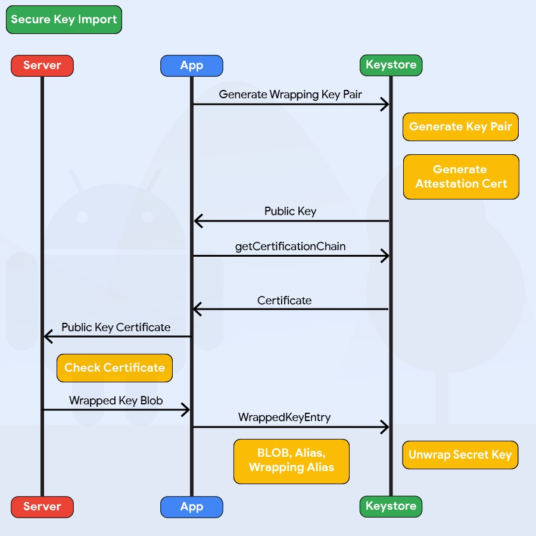

# Android Data Storage

Protecting authentication tokens, private information, and other sensitive data is key to mobile security. In this chapter, you will learn about the APIs Android offers for local data storage and best practices for using them.

The guidelines for saving data can be summarized quite easily: Public data should be available to everyone, but sensitive and private data must be protected, or, better yet, kept out of device storage.

Note that the meaning of "sensitive data" depends on the app that handles it. Data classification is described in detail in the "[Identifying Sensitive Data](0x04b-Mobile-App-Security-Testing.md#identifying-sensitive-data "Identifying Sensitive Data")" section of the chapter "Mobile App Security Testing".

Next to protecting sensitive data, you need to ensure that data read from any storage source is validated and possibly sanitized. The validation often does not go beyond ensuring that the data presented is of the type requested, but with using additional cryptographic controls, such as an HMAC, you can validate the correctness of the data.

## Testing Local Storage for Sensitive Data (MSTG-STORAGE-1 and MSTG-STORAGE-2)

### Overview

Conventional wisdom suggests that as little sensitive data as possible should be stored on permanent local storage. In most practical scenarios, however, some type of user data must be stored. For example, asking the user to enter a very complex password every time the app starts isn't a great idea in terms of usability. Most apps must locally cache some kind of authentication token to avoid this. Personally identifiable information (PII) and other types of sensitive data may also be saved if a given scenario calls for it.

Sensitive data is vulnerable when it is not properly protected by the app that is persistently storing it. The app may be able to store the data in several places, for example, on the device or on an external SD card. When you're trying to exploit these kinds of issues, consider that a lot of information may be processed and stored in different locations. Identifying at the outset the kind of information processed by the mobile application and input by the user is important. Identifying information that may be valuable to attackers (e.g., passwords, credit card information, PII) is also important.

Disclosing sensitive information has several consequences, including decrypted information. In general, an attacker may identify this information and use it for additional attacks, such as social engineering (if PII has been disclosed), account hijacking (if session information or an authentication token has been disclosed), and gathering information from apps that have a payment option (to attack and abuse them).

[Storing data](https://developer.android.com/guide/topics/data/data-storage.html "Storing Data in Android") is essential for many mobile apps. For example, some apps use data storage to keep track of user settings or user-provided data. Data can be stored persistently in several ways. The following list of storage techniques are widely used on the Android platform:

- Shared Preferences
- SQLite Databases
- Realm Databases
- Internal Storage
- External Storage

The following code snippets demonstrate bad practices that disclose sensitive information. They also illustrate Android storage mechanisms in detail. For more information, check out the [Security Tips for Storing Data](https://developer.android.com/training/articles/security-tips.html#StoringData "Security Tips for Storing Data") in the Android developer's guide.

#### Shared Preferences

The SharedPreferences API is commonly used to permanently save small collections of key-value pairs. Data stored in a SharedPreferences object is written to a plain-text XML file. The SharedPreferences object can be declared world-readable (accessible to all apps) or private.
Misuse of the SharedPreferences API can often lead to exposure of sensitive data. Consider the following example:

Example for Java:

```java
SharedPreferences sharedPref = getSharedPreferences("key", MODE_WORLD_READABLE);
SharedPreferences.Editor editor = sharedPref.edit();
editor.putString("username", "administrator");
editor.putString("password", "supersecret");
editor.commit();
```

Example for Kotlin:

```kotlin
var sharedPref = getSharedPreferences("key", Context.MODE_WORLD_READABLE)
var editor = sharedPref.edit()
editor.putString("username", "administrator")
editor.putString("password", "supersecret")
editor.commit()
```

Once the activity has been called, the file key.xml will be created with the provided data. This code violates several best practices.

- The username and password are stored in clear text in `/data/data/<package-name>/shared_prefs/key.xml`.

```xml
<?xml version='1.0' encoding='utf-8' standalone='yes' ?>
<map>
  <string name="username">administrator</string>
  <string name="password">supersecret</string>
</map>
```

- `MODE_WORLD_READABLE` allows all applications to access and read the contents of `key.xml`.

```bash
root@hermes:/data/data/sg.vp.owasp_mobile.myfirstapp/shared_prefs # ls -la
-rw-rw-r-- u0_a118    170 2016-04-23 16:51 key.xml
```

> Please note that `MODE_WORLD_READABLE` and `MODE_WORLD_WRITEABLE` were deprecated starting on API level 17. Although newer devices may not be affected by this, applications compiled with an `android:targetSdkVersion` value less than 17 may be affected if they run on an OS version that was released before Android 4.2 (API level 17).

#### SQLite Database (Unencrypted)

SQLite is an SQL database engine that stores data in `.db` files. The Android SDK has built-in support for SQLite databases. The main package used to manage the databases is `android.database.sqlite`.
You may use the following code to store sensitive information within an activity:

Example in Java:

```java
SQLiteDatabase notSoSecure = openOrCreateDatabase("privateNotSoSecure", MODE_PRIVATE, null);
notSoSecure.execSQL("CREATE TABLE IF NOT EXISTS Accounts(Username VARCHAR, Password VARCHAR);");
notSoSecure.execSQL("INSERT INTO Accounts VALUES('admin','AdminPass');");
notSoSecure.close();
```

Example in Kotlin:

```kotlin
var notSoSecure = openOrCreateDatabase("privateNotSoSecure", Context.MODE_PRIVATE, null)
notSoSecure.execSQL("CREATE TABLE IF NOT EXISTS Accounts(Username VARCHAR, Password VARCHAR);")
notSoSecure.execSQL("INSERT INTO Accounts VALUES('admin','AdminPass');")
notSoSecure.close()
```

Once the activity has been called, the database file `privateNotSoSecure` will be created with the provided data and stored in the clear text file `/data/data/<package-name>/databases/privateNotSoSecure`.

The database's directory may contain several files besides the SQLite database:

- [Journal files](https://www.sqlite.org/tempfiles.html "SQLite Journal files"): These are temporary files used to implement atomic commit and rollback.
- [Lock files](https://www.sqlite.org/lockingv3.html "SQLite Lock Files"): The lock files are part of the locking and journaling feature, which was designed to improve SQLite concurrency and reduce the writer starvation problem.

Sensitive information should not be stored in unencrypted SQLite databases.

#### SQLite Databases (Encrypted)

With the library [SQLCipher](https://www.zetetic.net/sqlcipher/sqlcipher-for-android/ "SQLCipher"), SQLite databases can be password-encrypted.

Example in Java:

```java
SQLiteDatabase secureDB = SQLiteDatabase.openOrCreateDatabase(database, "password123", null);
secureDB.execSQL("CREATE TABLE IF NOT EXISTS Accounts(Username VARCHAR,Password VARCHAR);");
secureDB.execSQL("INSERT INTO Accounts VALUES('admin','AdminPassEnc');");
secureDB.close();
```

Example in Kotlin:

```kotlin
var secureDB = SQLiteDatabase.openOrCreateDatabase(database, "password123", null)
secureDB.execSQL("CREATE TABLE IF NOT EXISTS Accounts(Username VARCHAR,Password VARCHAR);")
secureDB.execSQL("INSERT INTO Accounts VALUES('admin','AdminPassEnc');")
secureDB.close()
```

If encrypted SQLite databases are used, determine whether the password is hard-coded in the source, stored in shared preferences, or hidden somewhere else in the code or filesystem.
Secure ways to retrieve the key include:

- Asking the user to decrypt the database with a PIN or password once the app is opened (weak passwords and PINs are vulnerable to brute force attacks)
- Storing the key on the server and allowing it to be accessed from a web service only (so that the app can be used only when the device is online)

#### Firebase Real-time Databases

Firebase is a development platform with more than 15 products, and one of them is Firebase Real-time Database. It can be leveraged by application developers to store and sync data with a NoSQL cloud-hosted database. The data is stored as JSON and is synchronized in real-time to every connected client and also remains available even when the application goes offline.

A misconfigured Firebase instance can be identified by making the following network call:

`https://_firebaseProjectName_.firebaseio.com/.json`

The _firebaseProjectName_ can be retrieved from the mobile application by reverse engineering the application. Alternatively, the analysts can use [Firebase Scanner](https://github.com/shivsahni/FireBaseScanner "Firebase Scanner"), a python script that automates the task above as shown below:

```bash
python FirebaseScanner.py -p <pathOfAPKFile>

python FirebaseScanner.py -f <commaSeperatedFirebaseProjectNames>
```

#### Realm Databases

The [Realm Database for Java](https://realm.io/docs/java/latest/ "Realm Database") is becoming more and more popular among developers. The database and its contents can be encrypted with a key stored in the configuration file.

```java
//the getKey() method either gets the key from the server or from a KeyStore, or is derived from a password.
RealmConfiguration config = new RealmConfiguration.Builder()
  .encryptionKey(getKey())
  .build();

Realm realm = Realm.getInstance(config);

```

If the database is not encrypted, you should be able to obtain the data. If the database *is* encrypted, determine whether the key is hard-coded in the source or resources and whether it is stored unprotected in shared preferences or some other location.

#### Internal Storage

You can save files to the device's [internal storage](https://developer.android.com/guide/topics/data/data-storage.html#filesInternal "Using Internal Storage"). Files saved to internal storage are containerized by default and cannot be accessed by other apps on the device. When the user uninstalls your app, these files are removed.
The following code snippets would persistently store sensitive data to internal storage.

Example for Java:

```java
FileOutputStream fos = null;
try {
   fos = openFileOutput(FILENAME, Context.MODE_PRIVATE);
   fos.write(test.getBytes());
   fos.close();
} catch (FileNotFoundException e) {
   e.printStackTrace();
} catch (IOException e) {
   e.printStackTrace();
}
```

Example for Kotlin:

```kotlin
var fos: FileOutputStream? = null
fos = openFileOutput("FILENAME", Context.MODE_PRIVATE)
fos.write(test.toByteArray(Charsets.UTF_8))
fos.close()
```

You should check the file mode to make sure that only the app can access the file. You can set this access with `MODE_PRIVATE`. Modes such as `MODE_WORLD_READABLE` (deprecated) and `MODE_WORLD_WRITEABLE` (deprecated) may pose a security risk.

Search for the class `FileInputStream` to find out which files are opened and read within the app.

#### External Storage

Every Android-compatible device supports [shared external storage](https://developer.android.com/guide/topics/data/data-storage.html#filesExternal "Using External Storage"). This storage may be removable (such as an SD card) or internal (non-removable).
Files saved to external storage are world-readable. The user can modify them when USB mass storage is enabled.
You can use the following code snippets to persistently store sensitive information to external storage as the contents of the file `password.txt`.

Example for Java:

```java
File file = new File (Environment.getExternalFilesDir(), "password.txt");
String password = "SecretPassword";
FileOutputStream fos;
    fos = new FileOutputStream(file);
    fos.write(password.getBytes());
    fos.close();
```

Example for Kotlin:

```kotlin
val password = "SecretPassword"
val path = context.getExternalFilesDir(null)
val file = File(path, "password.txt")
file.appendText(password)
```

The file will be created and the data will be stored in a clear text file in external storage once the activity has been called.

It's also worth knowing that files stored outside the application folder (`data/data/<package-name>/`) will not be deleted when the user uninstalls the application.
Finally, it's worth noting that the external storage can be used by an attacker to allow for arbitrary control of the application in some cases. For more information: [see the blog from Checkpoint](https://blog.checkpoint.com/2018/08/12/man-in-the-disk-a-new-attack-surface-for-android-apps/ "Man in the disk").

### Static Analysis

#### Local Storage

As previously mentioned, there are several ways to store information on an Android device. You should therefore check several sources to determine the kind of storage used by the Android app and to find out whether the app processes sensitive data insecurely.

- Check `AndroidManifest.xml` for read/write external storage permissions, for example, `uses-permission android:name="android.permission.WRITE_EXTERNAL_STORAGE"`.
- Check the source code for keywords and API calls that are used to store data:
  - File permissions, such as:
    - `MODE_WORLD_READABLE` or `MODE_WORLD_WRITABLE`: You should avoid using `MODE_WORLD_WRITEABLE` and `MODE_WORLD_READABLE` for files because any app will be able to read from or write to the files, even if they are stored in the app's private data directory. If data must be shared with other applications, consider a content provider. A content provider offers read and write permissions to other apps and can grant dynamic permission on a case-by-case basis.
  - Classes and functions, such as:
    - the `SharedPreferences` class ( stores key-value pairs)
    - the `FileOutPutStream` class (uses internal or external storage)
    - the `getExternal*` functions (use external storage)
    - the `getWritableDatabase` function (returns a SQLiteDatabase for writing)
    - the `getReadableDatabase` function (returns a SQLiteDatabase for reading)
    - the `getCacheDir` and `getExternalCacheDirs` function (use cached files)

Encryption should be implemented using proven SDK functions. The following describes bad practices to look for in the source code:

- Locally stored sensitive information "encrypted" via simple bit operations like XOR or bit flipping. These operations should be avoided because the encrypted data can be recovered easily.
- Keys used or created without Android onboard features, such as the Android KeyStore
- Keys disclosed by hard-coding

A typical misuse are hard-coded cryptographic keys. Hard-coded and world-readable cryptographic keys significantly increase the possibility that encrypted data will be recovered. Once an attacker obtains the data, decrypting it is trivial. Symmetric cryptography keys must be stored on the device, so identifying them is just a matter of time and effort. Consider the following code:

```java
this.db = localUserSecretStore.getWritableDatabase("SuperPassword123");
```

Obtaining the key is trivial because it is contained in the source code and identical for all installations of the app. Encrypting data this way is not beneficial. Look for hard-coded API keys/private keys and other valuable data; they pose a similar risk. Encoded/encrypted keys represent another attempt to make it harder but not impossible to get the crown jewels.

Consider the following code:

Example in Java:

```java
//A more complicated effort to store the XOR'ed halves of a key (instead of the key itself)
private static final String[] myCompositeKey = new String[]{
  "oNQavjbaNNSgEqoCkT9Em4imeQQ=","3o8eFOX4ri/F8fgHgiy/BS47"
};
```

Example in Kotlin:

```kotlin
private val myCompositeKey = arrayOf<String>("oNQavjbaNNSgEqoCkT9Em4imeQQ=", "3o8eFOX4ri/F8fgHgiy/BS47")
```

The algorithm for decoding the original key might be something like this:

Example in Java:

```java
public void useXorStringHiding(String myHiddenMessage) {
  byte[] xorParts0 = Base64.decode(myCompositeKey[0],0);
  byte[] xorParts1 = Base64.decode(myCompositeKey[1],0);

  byte[] xorKey = new byte[xorParts0.length];
  for(int i = 0; i < xorParts1.length; i++){
    xorKey[i] = (byte) (xorParts0[i] ^ xorParts1[i]);
  }
  HidingUtil.doHiding(myHiddenMessage.getBytes(), xorKey, false);
}
```

Example in Kotlin:

```kotlin
fun useXorStringHiding(myHiddenMessage:String) {
  val xorParts0 = Base64.decode(myCompositeKey[0], 0)
  val xorParts1 = Base64.decode(myCompositeKey[1], 0)
  val xorKey = ByteArray(xorParts0.size)
  for (i in xorParts1.indices)
  {
    xorKey[i] = (xorParts0[i] xor xorParts1[i]).toByte()
  }
  HidingUtil.doHiding(myHiddenMessage.toByteArray(), xorKey, false)
}
```

Verify common locations of secrets:

- resources (typically at res/values/strings.xml)
  Example:

  ```xml
  <resources>
      <string name="app_name">SuperApp</string>
      <string name="hello_world">Hello world!</string>
      <string name="action_settings">Settings</string>
      <string name="secret_key">My_Secret_Key</string>
    </resources>
  ```

- build configs, such as in local.properties or gradle.properties
  Example:

  ```default
  buildTypes {
    debug {
      minifyEnabled true
      buildConfigField "String", "hiddenPassword", "\"${hiddenPassword}\""
    }
  }
  ```

#### KeyStore

The [Android KeyStore](https://www.androidauthority.com/use-android-keystore-store-passwords-sensitive-information-623779/ "Use Android KeyStore") supports relatively secure credential storage. As of Android 4.3 (API level 18), it provides public APIs for storing and using app-private keys. An app can use a public key to create a new private/public key pair for encrypting application secrets, and it can decrypt the secrets with the private key.

You can protect keys stored in the Android KeyStore with user authentication in a confirm credential flow. The user's lock screen credentials (pattern, PIN, password, or fingerprint) are used for authentication.

You can use stored keys in one of two modes:

1. Users are authorized to use keys for a limited period of time after authentication. In this mode, all keys can be used as soon as the user unlocks the device. You can customize the period of authorization for each key. You can use this option only if the secure lock screen is enabled. If the user disables the secure lock screen, all stored keys will become permanently invalid.

2. Users are authorized to use a specific cryptographic operation that is associated with one key. In this mode, users must request a separate authorization for each operation that involves the key. Currently, fingerprint authentication is the only way to request such authorization.

The level of security afforded by the Android KeyStore depends on its implementation, which depends on the device. Most modern devices offer a [hardware-backed KeyStore implementation](0x05d-Testing-Data-Storage.md#hardware-backed-android-keyStore): keys are generated and used in a Trusted Execution Environment (TEE) or a Secure Element (SE), and the operating system can't access them directly. This means that the encryption keys themselves can't be easily retrieved, even from a rooted device. You can verify hardware-backed keys with [Key Attestation](0x05d-Testing-Data-Storage.md#key-attestation) You can determine whether the keys are inside the secure hardware by checking the return value of the `isInsideSecureHardware` method, which is part of the [`KeyInfo` class](https://developer.android.com/reference/android/security/keystore/KeyInfo.html "Class KeyInfo").

>Note that the relevant KeyInfo indicates that secret keys and HMAC keys are insecurely stored on several devices despite private keys being correctly stored on the secure hardware.

The keys of a software-only implementation are encrypted with a [per-user encryption master key](https://nelenkov.blogspot.sg/2013/08/credential-storage-enhancements-android-43.html "Nikolay Elenvok - Credential storage enhancements in Android 4.3"). An attacker can access all keys stored on rooted devices that have this implementation in the folder `/data/misc/keystore/`. Because the user's lock screen pin/password is used to generate the master key, the Android KeyStore is unavailable when the device is locked. For more security Android 9 (API level 28) introduces the `unlockedDeviceRequied` flag. By passing `true` to the `setUnlockedDeviceRequired` method the app prevents its keys stored in `AndroidKeystore` from being decrypted when the device is locked, and it requires the screen to be unlocked before allowing decryption.

##### Hardware-backed Android KeyStore

As mentioned before, hardware-backed Android KeyStore gives another layer to defense-in-depth security concept for Android. Keymaster Hardware Abstraction Layer (HAL) was introduced with Android 6 (API level 23). Applications can verify if the key is stored inside the security hardware (by checking if `KeyInfo.isinsideSecureHardware` returns `true`). Devices running Android 9 (API level 28) and higher can have a `StrongBox Keymaster` module, an implementation of the Keymaster HAL that resides in a hardware security module which has its own CPU, Secure storage, a true random number generator and a mechanism to resist package tampering. To use this feature, `true` must be passed to the `setIsStrongBoxBacked` method in either the `KeyGenParameterSpec.Builder` class or the `KeyProtection.Builder` class when generating or importing keys using `AndroidKeystore`. To make sure that StrongBox is used during runtime, check that `isInsideSecureHardware` returns `true` and that the system does not throw `StrongBoxUnavailableException` which gets thrown if the StrongBox Keymaster isn't available for the given algorithm and key size associated with a key. Description of features on hardware-based keystore can be found on [AOSP pages](https://source.android.com/security/keystore "AOSP Hardware-based KeyStore").

Keymaster HAL is an interface to hardware-backed components - Trusted Execution Environment (TEE) or a Secure Element (SE), which is used by Android Keystore. An example of such a hardware-backed component is [Titan M](https://android-developers.googleblog.com/2018/10/building-titan-better-security-through.html "Building a Titan: Better security through a tiny chip").

##### Key Attestation

For the applications which heavily rely on Android Keystore for business-critical operations such as multi-factor authentication through cryptographic primitives, secure storage of sensitive data at the client-side, etc. Android provides the feature of [Key Attestation](https://developer.android.com/training/articles/security-key-attestation "Key Attestation") which helps to analyze the security of cryptographic material managed through Android Keystore. From Android 8.0 (API level 26), the key attestation was made mandatory for all new (Android 7.0 or higher) devices that need to have device certification for Google apps. Such devices use attestation keys signed by the [Google hardware attestation root certificate](https://developer.android.com/training/articles/security-key-attestation#root_certificate "Google Hardware Attestation Root Certificate") and the same can be verified through the key attestation process.

During key attestation, we can specify the alias of a key pair and in return, get a certificate chain, which we can use to verify the properties of that key pair. If the root certificate of the chain is the [Google Hardware Attestation Root certificate](https://developer.android.com/training/articles/security-key-attestation#root_certificate "Google Hardware Attestation Root certificate") and the checks related to key pair storage in hardware are made it gives an assurance that the device supports hardware-level key attestation and the key is in the hardware-backed keystore that Google believes to be secure. Alternatively, if the attestation chain has any other root certificate, then Google does not make any claims about the security of the hardware.

Although the key attestation process can be implemented within the application directly but it is recommended that it should be implemented at the server-side for security reasons. The following are the high-level guidelines for the secure implementation of Key Attestation:

- The server should initiate the key attestation process by creating a random number securely using CSPRNG(Cryptographically Secure Random Number Generator) and the same should be sent to the user as a challenge.
- The client should call the `setAttestationChallenge` API with the challenge received from the server and should then retrieve the attestation certificate chain using the `KeyStore.getCertificateChain` method.
- The attestation response should be sent to the server for the verification and following checks should be performed for the verification of the key attestation response:
  - Verify the certificate chain, up to the root and perform certificate sanity checks such as validity, integrity and trustworthiness. Check the [Certificate Revocation Status List](https://developer.android.com/training/articles/security-key-attestation#root_certificat "Certificate Revocation Status List") maintained by Google, if none of the certificates in the chain was revoked.
  - Check if the root certificate is signed with the Google attestation root key which makes the attestation process trustworthy.
  - Extract the attestation [certificate extension data](https://developer.android.com/training/articles/security-key-attestation#certificate_schema "Certificate extension data schema"), which appears within the first element of the certificate chain and perform the following checks:
    - Verify that the attestation challenge is having the same value which was generated at the server while initiating the attestation process.
    - Verify the signature in the key attestation response.
    - Verify the security level of the Keymaster to determine if the device has secure key storage mechanism. Keymaster is a piece of software that runs in the security context and provides all the secure keystore operations. The security level will be one of `Software`, `TrustedEnvironment` or `StrongBox`. The client supports hardware-level key attestation if security level is `TrustedEnvironment` or `StrongBox` and attestation certificate chain contains a root certificate singed with Google attestation root key.
    - Verify client's status to ensure full chain of trust - verified boot key, locked bootloader and verified boot state.
    - Additionally, you can verify the key pair's attributes such as purpose, access time, authentication requirement, etc.

> Note, if for any reason that process fails, it means that the key is not in security hardware. That does not mean that the key is compromised.

The typical example of Android Keystore attestation response looks like this:

```json
{
    "fmt": "android-key",
    "authData": "9569088f1ecee3232954035dbd10d7cae391305a2751b559bb8fd7cbb229bd...",
    "attStmt": {
        "alg": -7,
        "sig": "304402202ca7a8cfb6299c4a073e7e022c57082a46c657e9e53...",
        "x5c": [
            "308202ca30820270a003020102020101300a06082a8648ce3d040302308188310b30090603550406130...",
            "308202783082021ea00302010202021001300a06082a8648ce3d040302308198310b300906035504061...",
            "3082028b30820232a003020102020900a2059ed10e435b57300a06082a8648ce3d040302308198310b3..."
        ]
    }
}
```

In the above JSON snippet, the keys have the following meaning:
        `fmt`: Attestation statement format identifier
        `authData`: It denotes the authenticator data for the attestation
        `alg`: The algorithm that is used for the Signature
        `sig`: Signature
        `x5c`: Attestation certificate chain

Note: The `sig` is generated by concatenating `authData` and `clientDataHash` (challenge sent by the server) and signing through the credential private key using the `alg` signing algorithm and the same is verified at the server-side by using the public key in the first certificate.

For more understanding on the implementation guidelines, [Google Sample Code](https://github.com/googlesamples/android-key-attestation/blob/master/server/src/main/java/com/android/example/KeyAttestationExample.java "Google Sample Code For Android Key Attestation") can be referred.

For the security analysis perspective the analysts may perform the following checks for the secure implementation of Key Attestation:

- Check if the key attestation is totally implemented at the client-side. In such scenario, the same can be easily bypassed by tampering the application, method hooking, etc.
- Check if the server uses random challenge while initiating the key attestation. As failing to do that would lead to insecure implementation thus making it vulnerable to replay attacks. Also, checks pertaining to the randomness of the challenge should be performed.
- Check if the server verifies the integrity of key attestation response.
- Check if the server performs basic checks such as integrity verification, trust verification, validity, etc. on the certificates in the chain.

##### Secure Key Import into Keystore

Android 9 (API level 28) adds the ability to import keys securely into the `AndroidKeystore`. First `AndroidKeystore` generates a key pair using `PURPOSE_WRAP_KEY` which should also be protected with an attestation certificate, this pair aims to protect the Keys being imported to `AndroidKeystore`. The encrypted keys are generated as ASN.1-encoded message in the `SecureKeyWrapper` format which also contains a description of the ways the imported key is allowed to be used. The keys are then decrypted inside the `AndroidKeystore` hardware belonging to the specific device that generated the wrapping key so they never appear as plaintext in the device's host memory.



Example in Java:

```java
KeyDescription ::= SEQUENCE {
    keyFormat INTEGER,
    authorizationList AuthorizationList
}

SecureKeyWrapper ::= SEQUENCE {
    wrapperFormatVersion INTEGER,
    encryptedTransportKey OCTET_STRING,
    initializationVector OCTET_STRING,
    keyDescription KeyDescription,
    secureKey OCTET_STRING,
    tag OCTET_STRING
}
```

The code above present the different parameters to be set when generating the encrypted keys in the SecureKeyWrapper format. Check the Android documentation on [`WrappedKeyEntry`](https://developer.android.com/reference/android/security/keystore/WrappedKeyEntry "WrappedKeyEntry") for more details.

When defining the KeyDescription AuthorizationList, the following parameters will affect the encrypted keys security:

- The `algorithm` parameter Specifies the cryptographic algorithm with which the key is used
- The `keySize` parameter Specifies the size, in bits, of the key, measuring in the normal way for the key's algorithm
- The `digest` parameter Specifies the digest algorithms that may be used with the key to perform signing and verification operations

##### Older KeyStore Implementations

Older Android versions don't include KeyStore, but they *do* include the KeyStore interface from JCA (Java Cryptography Architecture). You can use KeyStores that implement this interface to ensure the secrecy and integrity of keys stored with KeyStore; BouncyCastle KeyStore (BKS) is recommended. All implementations are based on the fact that files are stored on the filesystem; all files are password-protected.
To create one, you can use the `KeyStore.getInstance("BKS", "BC") method`, where "BKS" is the KeyStore name (BouncyCastle Keystore) and "BC" is the provider (BouncyCastle). You can also use SpongyCastle as a wrapper and initialize the KeyStore as follows: `KeyStore.getInstance("BKS", "SC")`.

Be aware that not all KeyStores properly protect the keys stored in the KeyStore files.

#### KeyChain

The [KeyChain class](https://developer.android.com/reference/android/security/KeyChain.html "Android KeyChain") is used to store and retrieve *system-wide* private keys and their corresponding certificates (chain). The user will be prompted to set a lock screen pin or password to protect the credential storage if something is being imported into the KeyChain for the first time. Note that the KeyChain is system-wide, every application can access the materials stored in the KeyChain.

Inspect the source code to determine whether native Android mechanisms identify sensitive information. Sensitive information should be encrypted, not stored in clear text. For sensitive information that must be stored on the device, several API calls are available to protect the data via the `KeyChain` class. Complete the following steps:

- Make sure that the app is using the Android KeyStore and Cipher mechanisms to securely store encrypted information on the device. Look for the patterns `AndroidKeystore`, `import java.security.KeyStore`, `import javax.crypto.Cipher`, `import java.security.SecureRandom`, and corresponding usages.
- Use the `store(OutputStream stream, char[] password)` function to store the KeyStore to disk with a password. Make sure that the password is provided by the user, not hard-coded.

#### Storing a Key - example

To mitigate unauthorized use of keys on the Android device, Android KeyStore lets apps specify authorized uses of their keys when generating or importing the keys. Once made, authorizations cannot be changed.

Storing a Key - from most secure to least secure:

- the key is stored in hardware-backed Android KeyStore
- all keys are stored on server and are available after strong authentication
- master key is stored on server and use to encrypt other keys, which are stored in Android SharedPreferences
- the key is derived each time from a strong user provided passphrase with sufficient length and salt
- the key is stored in software implementation of Android KeyStore
- master key is stored in software implementation of Android Keystore and use to encrypt other keys, which are stored in SharedPreferences
- [not recommended] all keys are stored in SharedPreferences
- [not recommended] hardcoded encryption keys in the source code
- [not recommended] predictable key derivation function based on stable attributes
- [not recommended] stored generated keys in public places (like `/sdcard/`)

The most secure way of handling key material, is simply never storing it on the device. That can be achieved by using [hardware-backed Android KeyStore](0x05d-Testing-Data-Storage.md#hardware-backed-android-keystore) if device is running Android 7.0 (API level 24) and above with available hardware component (Trusted Execution Environment (TEE) or a Secure Element (SE)). That can be check by using guidelines provided for [the secure implementation of Key Attestation](0x05d-Testing-Data-Storage.md#key-attestation). If hardware component is not available and/or support for Android 6.0 (API level 23) and below is required, then that can be achieved by storing a key on remote server and make a key available after authentication.

> Please note that if the keys are stored on the server, the app need to be online to decrypt the data. This might be a limitation in some use case of mobile apps and should be carefully thought through as this becomes part of the architecture of the app.

A more common solution (regarding Android API level), however less-user friendly and with some weaknesses is to derive a key from user provided passphrase. This means that the user should be prompted to input a passphrase every time the application needs to perform a cryptographic operation. This is not the ideal implementation from a user point of view and passwords or pass-phrases might be reused by the user or easy to guess. However this approach makes a key available in an array in memory while it is being used and when the key is not needed anymore, the array can be zeroed out. This limits the available ways of attacks on a key as no key material and its artifacts (like a passphrase) touch the filesystem and they are not stored. However there are some weaknesses which need to be taken into consideration. First of all, a key derived from passphrase has [its own weaknesses](0x04g-Testing-Cryptography.md#weak-key-generation-functions). Additionally, the key material should be cleared out from memory as soon as it is not need anymore. However, note that some ciphers do not properly clean up their byte-arrays. For instance, the AES Cipher in BouncyCastle does not always clean up its latest working key leaving some copies of the byte-array in memory. Next, BigInteger based keys (e.g. private keys) cannot be removed from the heap nor zeroed out just like that. Clearing byte array can be achieved by writing a wrapper which implements [Destroyable](https://docs.oracle.com/javase/8/docs/api/javax/security/auth/Destroyable.html#destroy--).

More user-friendly and recommended way is to use the [Android KeyStore API](https://developer.android.com/reference/java/security/KeyStore.html "Android AndroidKeyStore API") system (itself or through KeyChain) to store key material. If it is possible, hardware-backed storage should be used. Otherwise, it should fallback to software implementation of Android Keystore. However, be aware that the `AndroidKeyStore` API has been changed significantly throughout various versions of Android. In earlier versions, the `AndroidKeyStore` API only supported storing public/private key pairs (e.g., RSA). Symmetric key support has only been added since Android 6.0 (API level 23). As a result, a developer needs to handle the different Android API levels to securely store symmetric keys.

In order to securely store symmetric keys on devices running on Android 5.1 (API level 22) or lower, we need to generate a public/private key pair. We encrypt the symmetric key using the public key and store the private key in the `AndroidKeyStore`. The encrypted symmetric key can encoded using base64 and stored in the `SharedPreferences`. Whenever we need the symmetric key, the application retrieves the private key from the `AndroidKeyStore` and decrypts the symmetric key.

A less secure way of storing encryption keys, is in the SharedPreferences of Android. When [SharedPreferences](https://developer.android.com/reference/android/content/SharedPreferences.html "Android SharedPreference API") are used, the file is only readable by the application that created it. However, on rooted devices any other application with root access can simply read the SharedPreference file of other apps. This is not the case for the AndroidKeyStore. Since AndroidKeyStore access is managed on kernel level, which needs considerably more work and skill to bypass without the AndroidKeyStore clearing or destroying the keys.

The last three options are to use hardcoded encryption keys in the source code, having a predictable key derivation function based on stable attributes, and storing generated keys in public places like `/sdcard/`. Obviously, hardcoded encryption keys are not the way to go. This means every instance of the application uses the same encryption key. An attacker needs only to do the work once, to extract the key from the source code - whether stored natively or in Java/Kotlin. Consequently, an attacker can decrypt any other data which was encrypted by the application.
Next, when you have a predictable key derivation function based on identifiers which are accessible to other applications, the attacker only needs to find the KDF and apply it to the device in order to find the key. Lastly, storing encryption keys publicly also is highly discouraged as other applications can have permission to read the public partition and steal the keys.

#### Third Party libraries

There are several different open-source libraries that offer encryption capabilities specific for the Android platform.

- **[Java AES Crypto](https://github.com/tozny/java-aes-crypto "Java AES Crypto")** - A simple Android class for encrypting and decrypting strings.
- **[SQL Cipher](https://www.zetetic.net/sqlcipher/sqlcipher-for-android/ "SQL Cipher")** - SQLCipher is an open source extension to SQLite that provides transparent 256-bit AES encryption of database files.
- **[Secure Preferences](https://github.com/scottyab/secure-preferences "Secure Preferences")** - Android Shared preference wrapper than encrypts the keys and values of Shared Preferences.

> Please keep in mind that as long as the key is not stored in the KeyStore, it is always possible to easily retrieve the key on a rooted device and then decrypt the values you are trying to protect.

### Dynamic Analysis

Install and use the app, executing all functions at least once. Data can be generated when entered by the user, sent by the endpoint, or shipped with the app. Then complete the following:

- Identify development files, backup files, and old files that shouldn't be included with a production release.
- Determine whether SQLite databases are available and whether they contain sensitive information. SQLite databases are stored in `/data/data/<package-name>/databases`.
- Check Shared Preferences that are stored as XML files (in `/data/data/<package-name>/shared_prefs`) for sensitive information. Avoid using Shared Preferences and other mechanisms that can't protect data when you are storing sensitive information. Shared Preferences is insecure and unencrypted by default. You can use [secure-preferences](https://github.com/scottyab/secure-preferences "Secure-preferences encrypts the values of Shared Preferences") to encrypt the values stored in Shared Preferences, but the Android KeyStore should be your first choice for storing data securely.
- Check the permissions of the files in `/data/data/<package-name>`. Only the user and group created when you installed the app (e.g., u0_a82) should have user read, write, and execute permissions (`rwx`). Other users should not have permission to access files, but they may have execute permissions for directories.
- Determine whether a Realm database is available in `/data/data/<package-name>/files/`, whether it is unencrypted, and whether it contains sensitive information. By default, the file extension is `realm` and the file name is `default`. Inspect the Realm database with the [Realm Browser](https://github.com/realm/realm-browser-osx "Realm Browser for macOS").
- Check external storage for data. Don't use external storage for sensitive data because it is readable and writeable system-wide.

Files saved to internal storage are by default private to your application; neither the user nor other applications can access them. When users uninstall your application, these files are removed.

## Testing Local Storage for Input Validation (MSTG-PLATFORM-2)

For any publicly accessible data storage, any process can override the data. This means that input validation needs to be applied the moment the data is read back again.

> Note: Similar holds for private accessible data on a rooted device

### Static analysis

#### Using Shared Preferences

When you use the `SharedPreferences.Editor` to read or write int/boolean/long values, you cannot check whether the data is overridden or not. However: it can hardly be used for actual attacks other than chaining the values (e.g. no additional exploits can be packed which will take over the control flow). In the case of a `String` or a `StringSet` you should be careful with how the data is interpreted.
Using reflection based persistence? Check the section on "Testing Object Persistence" for Android to see how it should be validated.
Using the `SharedPreferences.Editor` to store and read certificates or keys? Make sure you have patched your security provider given vulnerabilities such as found in [Bouncy Castle](https://www.cvedetails.com/cve/CVE-2018-1000613/ "Key reading vulnerability due to unsafe reflection").

In all cases, having the content HMACed can help to ensure that no additions and/or changes have been applied.

#### Using Other Storage Mechanisms

In case other public storage mechanisms (than the `SharedPreferences.Editor`) are used, the data needs to be validated the moment it is read from the storage mechanism.

## Testing Logs for Sensitive Data (MSTG-STORAGE-3)

### Overview

There are many legitimate reasons to create log files on a mobile device, such as keeping track of crashes, errors, and usage statistics. Log files can be stored locally when the app is offline and sent to the endpoint once the app is online. However, logging sensitive data may expose the data to attackers or malicious applications, and it violates user confidentiality.
You can create log files in several ways. The following list includes two classes that are available for Android:

- [Log Class](https://developer.android.com/reference/android/util/Log.html "Log Class")
- [Logger Class](https://developer.android.com/reference/java/util/logging/Logger.html "Logger Class")

Use a centralized logging class and mechanism and remove logging statements from the production release because other applications may be able to read them.

### Static Analysis

You should check the apps' source code for logging mechanisms by searching for the following keywords:

- Functions and classes, such as:
  - `android.util.Log`
  - `Log.d` | `Log.e` | `Log.i` | `Log.v` | `Log.w` | `Log.wtf`
  - `Logger`

- Keywords and system output:
  - `System.out.print` | `System.err.print`
  - logfile
  - logging
  - logs

While preparing the production release, you can use tools like `ProGuard` (included in Android Studio). [ProGuard](https://www.guardsquare.com/en/products/proguard "ProGuard") is a free Java class file shrinker, optimizer, obfuscator, and preverifier. It detects and removes unused classes, fields, methods, and attributes and can also be used to delete logging-related code.

To determine whether all logging functions from the `android.util.Log` class have been removed, check the ProGuard configuration file (proguard-rules.pro) for the following options (according to this [example of removing logging code](https://www.guardsquare.com/en/products/proguard/manual/examples#logging "ProGuard\'s exmaple of removing logging code") and this article about [enabling ProGuard in an Android Studio project](https://developer.android.com/studio/build/shrink-code#enable "Android Developer - Enable shrinking, obfuscation, and optimization")):

```java
-assumenosideeffects class android.util.Log
{
  public static boolean isLoggable(java.lang.String, int);
  public static int v(...);
  public static int i(...);
  public static int w(...);
  public static int d(...);
  public static int e(...);
  public static int wtf(...);
}
```

Note that the example above only ensures that calls to the Log class' methods will be removed. If the string that will be logged is dynamically constructed, the code that constructs the string may remain in the bytecode. For example, the following code issues an implicit `StringBuilder` to construct the log statement:

Example in Java:

```java
Log.v("Private key tag", "Private key [byte format]: " + key);
```

Example in Kotlin:

```kotlin
Log.v("Private key tag", "Private key [byte format]: $key")
```

The compiled bytecode, however, is equivalent to the bytecode of the following log statement, which constructs the string explicitly:

Example in Java:

```java
Log.v("Private key tag", new StringBuilder("Private key [byte format]: ").append(key.toString()).toString());
```

Example in Kotlin:

```kotlin
Log.v("Private key tag", StringBuilder("Private key [byte format]: ").append(key).toString())
```

ProGuard guarantees removal of the `Log.v` method call. Whether the rest of the code (`new StringBuilder ...`) will be removed depends on the complexity of the code and the [ProGuard version](https://stackoverflow.com/questions/6009078/removing-unused-strings-during-proguard-optimisation "Removing unused strings during ProGuard optimization ").

This is a security risk because the (unused) string leaks plain text data into memory, which can be accessed via a debugger or memory dumping.

Unfortunately, no silver bullet exists for this issue, but one option would be to implement a custom logging facility that takes simple arguments and constructs the log statements internally.

```java
SecureLog.v("Private key [byte format]: ", key);
```

Then configure ProGuard to strip its calls.

### Dynamic Analysis

Use all the mobile app functions at least once, then identify the application's data directory and look for log files (`/data/data/<package-name>`). Check the application logs to determine whether log data has been generated; some mobile applications create and store their own logs in the data directory.

Many application developers still use `System.out.println` or `printStackTrace` instead of a proper logging class. Therefore, your testing strategy must include all output generated while the application is starting, running and closing. To determine what data is directly printed by `System.out.println` or `printStackTrace`, you can use [`Logcat`](https://developer.android.com/tools/debugging/debugging-log.html "Debugging with Logcat") as explained in the chapter "Basic Security Testing", section "Monitoring System Logs".

Remember that you can target a specific app by filtering the Logcat output as follows:

```bash
$ adb logcat | grep "$(adb shell ps | grep <package-name> | awk '{print $2}')"
```

> If you already know the app PID you may give it directly using `--pid` flag.

You may also want to apply further filters or regular expressions (using `logcat`'s regex flags `-e <expr>, --regex=<expr>` for example) if you expect certain strings or patterns to come up in the logs.

## Determining Whether Sensitive Data is Sent to Third Parties (MSTG-STORAGE-4)

### Overview

You can embed third-party services in apps. These services can implement tracker services, monitor user behavior, sell banner advertisements, improve the user experience, and more.

The downside is a lack of visibility: you can't know exactly what code third-party libraries execute. Consequently, you should make sure that only necessary, non-sensitive information will be sent to the service.

Most third-party services are implemented in one of two ways:

- With a standalone library, such as an Android project Jar that is included in the APK
- With a full SDK

### Static Analysis

You can automatically integrate third-party libraries into apps by using an IDE wizard or manually adding a library or SDK. In either case, review the permissions in the `AndroidManifest.xml`. In particular, you should determine whether permissions for accessing `SMS (READ_SMS)`, contacts (`READ_CONTACTS`), and location (`ACCESS_FINE_LOCATION`) are really necessary (see `Testing App Permissions`). Developers should check the source code for changes after the library has been added to the project.

Check the source code for API calls and third-party library functions or SDKs. Review code changes for security best practices.

Review loaded libraries to determine whether they are necessary and whether they are out of date or contain known vulnerabilities.

All data sent to third-party services should be anonymized. Data (such as application IDs) that can be traced to a user account or session should not be sent to a third party.

### Dynamic Analysis

Check all requests to external services for embedded sensitive information.
To intercept traffic between the client and server, you can perform dynamic analysis by launching a man-in-the-middle (MITM) attack with _Burp Suite Professional_ or _OWASP ZAP_. Once you route the traffic through the interception proxy, you can try to sniff the traffic that passes between the app and server. All app requests that aren't sent directly to the server on which the main function is hosted should be checked for sensitive information, such as PII in a tracker or ad service.

## Determining Whether the Keyboard Cache Is Disabled for Text Input Fields (MSTG-STORAGE-5)

### Overview

When users type in input fields, the software automatically suggests data. This feature can be very useful for messaging apps. However, the keyboard cache may disclose sensitive information when the user selects an input field that takes this type of information.

### Static Analysis

In the layout definition of an activity, you can define `TextViews` that have XML attributes. If the XML attribute `android:inputType` is given the value `textNoSuggestions`, the keyboard cache will not be shown when the input field is selected. The user will have to type everything manually.

```xml
   <EditText
        android:id="@+id/KeyBoardCache"
        android:inputType="textNoSuggestions" />
```

The code for all input fields that take sensitive information should include this XML attribute to [disable the keyboard suggestions](https://developer.android.com/reference/android/text/InputType.html#TYPE_TEXT_FLAG_NO_SUGGESTIONS "Disable keyboard suggestions").

### Dynamic Analysis

Start the app and click in the input fields that take sensitive data. If strings are suggested, the keyboard cache has not been disabled for these fields.

## Determining Whether Sensitive Stored Data Has Been Exposed via IPC Mechanisms (MSTG-STORAGE-6)

### Overview

As part of Android's IPC mechanisms, content providers allow an app's stored data to be accessed and modified by other apps. If not properly configured, these mechanisms may leak sensitive data.

### Static Analysis

The first step is to look at `AndroidManifest.xml` to detect content providers exposed by the app. You can identify content providers by the `<provider>` element. Complete the following steps:

- Determine whether the value of the export tag (`android:exported`) is `"true"`. Even if it is not, the tag will be set to `"true"` automatically if an `<intent-filter>` has been defined for the tag. If the content is meant to be accessed only by the app itself, set `android:exported` to `"false"`. If not, set the flag to `"true"` and define proper read/write permissions.
- Determine whether the data is being protected by a permission tag (`android:permission`). Permission tags limit exposure to other apps.
- Determine whether the `android:protectionLevel` attribute has the value `signature`. This setting indicates that the data is intended to be accessed only by apps from the same enterprise (i.e., signed with the same key). To make the data accessible to other apps, apply a security policy with the `<permission>` element and set a proper `android:protectionLevel`. If you use `android:permission`, other applications must declare corresponding `<uses-permission>` elements in their manifests to interact with your content provider. You can use the `android:grantUriPermissions` attribute to grant more specific access to other apps; you can limit access with the `<grant-uri-permission>` element.

Inspect the source code to understand how the content provider is meant to be used. Search for the following keywords:

- `android.content.ContentProvider`
- `android.database.Cursor`
- `android.database.sqlite`
- `.query`
- `.update`
- `.delete`

> To avoid SQL injection attacks within the app, use parameterized query methods, such as `query`, `update`, and `delete`. Be sure to properly sanitize all method arguments; for example, the `selection` argument could lead to SQL injection if it is made up of concatenated user input.

 If you expose a content provider, determine whether parameterized [query methods](https://developer.android.com/reference/android/content/ContentProvider.html#query%28android.net.Uri%2C%20java.lang.String[]%2C%20java.lang.String%2C%20java.lang.String[]%2C%20java.lang.String%29 "Query method in ContentProvider Class") (`query`, `update`, and `delete`) are being used to prevent SQL injection. If so, make sure all their arguments are properly sanitized.

We will use the vulnerable password manager app [Sieve](https://github.com/mwrlabs/drozer/releases/download/2.3.4/sieve.apk "Sieve - Vulnerable Password Manager") as an example of a vulnerable content provider.

#### Inspect the Android Manifest

Identify all defined `<provider>` elements:

```xml
<provider
      android:authorities="com.mwr.example.sieve.DBContentProvider"
      android:exported="true"
      android:multiprocess="true"
      android:name=".DBContentProvider">
    <path-permission
          android:path="/Keys"
          android:readPermission="com.mwr.example.sieve.READ_KEYS"
          android:writePermission="com.mwr.example.sieve.WRITE_KEYS"
     />
</provider>
<provider
      android:authorities="com.mwr.example.sieve.FileBackupProvider"
      android:exported="true"
      android:multiprocess="true"
      android:name=".FileBackupProvider"
/>
```

As shown in the `AndroidManifest.xml` above, the application exports two content providers. Note that one path ("/Keys") is protected by read and write permissions.

#### Inspect the source code

Inspect the `query` function in the `DBContentProvider.java` file to determine whether any sensitive information is being leaked:

Example in Java:

```java
public Cursor query(final Uri uri, final String[] array, final String s, final String[] array2, final String s2) {
    final int match = this.sUriMatcher.match(uri);
    final SQLiteQueryBuilder sqLiteQueryBuilder = new SQLiteQueryBuilder();
    if (match >= 100 && match < 200) {
        sqLiteQueryBuilder.setTables("Passwords");
    }
    else if (match >= 200) {
        sqLiteQueryBuilder.setTables("Key");
    }
    return sqLiteQueryBuilder.query(this.pwdb.getReadableDatabase(), array, s, array2, (String)null, (String)null, s2);
}
```

Example in Kotlin:

```kotlin
fun query(uri: Uri?, array: Array<String?>?, s: String?, array2: Array<String?>?, s2: String?): Cursor {
        val match: Int = this.sUriMatcher.match(uri)
        val sqLiteQueryBuilder = SQLiteQueryBuilder()
        if (match >= 100 && match < 200) {
            sqLiteQueryBuilder.tables = "Passwords"
        } else if (match >= 200) {
            sqLiteQueryBuilder.tables = "Key"
        }
        return sqLiteQueryBuilder.query(this.pwdb.getReadableDatabase(), array, s, array2, null as String?, null as String?, s2)
    }
```

Here we see that there are actually two paths, "/Keys" and "/Passwords", and the latter is not being protected in the manifest and is therefore vulnerable.

 When accessing a URI, the query statement returns all passwords and the path `Passwords/`. We will address this in the "Dynamic Analysis" section and show the exact URI that is required.

### Dynamic Analysis

#### Testing Content Providers

To dynamically analyze an application's content providers, first enumerate the attack surface: pass the app's package name to the Drozer module `app.provider.info`:

```bash
dz> run app.provider.info -a com.mwr.example.sieve
  Package: com.mwr.example.sieve
  Authority: com.mwr.example.sieve.DBContentProvider
  Read Permission: null
  Write Permission: null
  Content Provider: com.mwr.example.sieve.DBContentProvider
  Multiprocess Allowed: True
  Grant Uri Permissions: False
  Path Permissions:
  Path: /Keys
  Type: PATTERN_LITERAL
  Read Permission: com.mwr.example.sieve.READ_KEYS
  Write Permission: com.mwr.example.sieve.WRITE_KEYS
  Authority: com.mwr.example.sieve.FileBackupProvider
  Read Permission: null
  Write Permission: null
  Content Provider: com.mwr.example.sieve.FileBackupProvider
  Multiprocess Allowed: True
  Grant Uri Permissions: False
```

In this example, two content providers are exported. Both can be accessed without permission, except for the `/Keys` path in the `DBContentProvider`. With this information, you can reconstruct part of the content URIs to access the `DBContentProvider` (the URIs begin with `content://`).

To identify content provider URIs within the application, use Drozer's `scanner.provider.finduris` module. This module guesses paths and determines accessible content URIs in several ways:

```bash
dz> run scanner.provider.finduris -a com.mwr.example.sieve
Scanning com.mwr.example.sieve...
Unable to Query content://com.mwr.example.sieve.DBContentProvider/
...
Unable to Query content://com.mwr.example.sieve.DBContentProvider/Keys
Accessible content URIs:
content://com.mwr.example.sieve.DBContentProvider/Keys/
content://com.mwr.example.sieve.DBContentProvider/Passwords
content://com.mwr.example.sieve.DBContentProvider/Passwords/
```

Once you have a list of accessible content providers, try to extract data from each provider with the `app.provider.query` module:

```bash
dz> run app.provider.query content://com.mwr.example.sieve.DBContentProvider/Passwords/ --vertical
_id: 1
service: Email
username: incognitoguy50
password: PSFjqXIMVa5NJFudgDuuLVgJYFD+8w== (Base64 - encoded)
email: incognitoguy50@gmail.com
```

You can also use Drozer to insert, update, and delete records from a vulnerable content provider:

- Insert record

  ```bash
  dz> run app.provider.insert content://com.vulnerable.im/messages
                  --string date 1331763850325
                  --string type 0
                  --integer _id 7
  ```

- Update record

  ```bash
  dz> run app.provider.update content://settings/secure
                  --selection "name=?"
                  --selection-args assisted_gps_enabled
                  --integer value 0
  ```

- Delete record

  ```bash
  dz> run app.provider.delete content://settings/secure
                  --selection "name=?"
                  --selection-args my_setting
  ```

#### SQL Injection in Content Providers

The Android platform promotes SQLite databases for storing user data. Because these databases are based on SQL, they may be vulnerable to SQL injection. You can use the Drozer module `app.provider.query` to test for SQL injection by manipulating the projection and selection fields that are passed to the content provider:

```bash
dz> run app.provider.query content://com.mwr.example.sieve.DBContentProvider/Passwords/ --projection "'"
unrecognized token: "' FROM Passwords" (code 1): , while compiling: SELECT ' FROM Passwords

dz> run app.provider.query content://com.mwr.example.sieve.DBContentProvider/Passwords/ --selection "'"
unrecognized token: "')" (code 1): , while compiling: SELECT * FROM Passwords WHERE (')
```

If an application is vulnerable to SQL Injection, it will return a verbose error message. SQL Injection on Android may be used to modify or query data from the vulnerable content provider. In the following example, the Drozer module `app.provider.query` is used to list all the database tables:

```bash
dz> run app.provider.query content://com.mwr.example.sieve.DBContentProvider/Passwords/ --projection "*
FROM SQLITE_MASTER WHERE type='table';--"
| type  | name             | tbl_name         | rootpage | sql              |
| table | android_metadata | android_metadata | 3        | CREATE TABLE ... |
| table | Passwords        | Passwords        | 4        | CREATE TABLE ... |
| table | Key              | Key              | 5        | CREATE TABLE ... |
```

SQL Injection may also be used to retrieve data from otherwise protected tables:

```bash
dz> run app.provider.query content://com.mwr.example.sieve.DBContentProvider/Passwords/ --projection "* FROM Key;--"
| Password | pin |
| thisismypassword | 9876 |
```

You can automate these steps with the `scanner.provider.injection` module, which automatically finds vulnerable content providers within an app:

```bash
dz> run scanner.provider.injection -a com.mwr.example.sieve
Scanning com.mwr.example.sieve...
Injection in Projection:
  content://com.mwr.example.sieve.DBContentProvider/Keys/
  content://com.mwr.example.sieve.DBContentProvider/Passwords
  content://com.mwr.example.sieve.DBContentProvider/Passwords/
Injection in Selection:
  content://com.mwr.example.sieve.DBContentProvider/Keys/
  content://com.mwr.example.sieve.DBContentProvider/Passwords
  content://com.mwr.example.sieve.DBContentProvider/Passwords/
```

#### File System Based Content Providers

Content providers can provide access to the underlying filesystem. This allows apps to share files (the Android sandbox normally prevents this). You can use the Drozer modules `app.provider.read` and `app.provider.download` to read and download files, respectively, from exported file-based content providers. These content providers are susceptible to directory traversal, which allows otherwise protected files in the target application's sandbox to be read.

```bash
dz> run app.provider.download content://com.vulnerable.app.FileProvider/../../../../../../../../data/data/com.vulnerable.app/database.db /home/user/database.db
Written 24488 bytes
```

Use the `scanner.provider.traversal` module to automate the process of finding content providers that are susceptible to directory traversal:

```bash
dz> run scanner.provider.traversal -a com.mwr.example.sieve
Scanning com.mwr.example.sieve...
Vulnerable Providers:
  content://com.mwr.example.sieve.FileBackupProvider/
  content://com.mwr.example.sieve.FileBackupProvider
```

Note that `adb` can also be used to query content providers:

```bash
$ adb shell content query --uri content://com.owaspomtg.vulnapp.provider.CredentialProvider/credentials
Row: 0 id=1, username=admin, password=StrongPwd
Row: 1 id=2, username=test, password=test
...
```

## Checking for Sensitive Data Disclosure Through the User Interface (MSTG-STORAGE-7)

### Overview

Many apps require users to enter several kinds of data to, for example, register an account or make a payment. Sensitive data may be exposed if the app doesn't properly mask it, when displaying data in clear text.

Masking of sensitive data, by showing asterisk or dots instead of clear text should be enforced within an app's activity to prevent disclosure and mitigate risks such as shoulder surfing.

### Static Analysis

To make sure an application is masking sensitive user input, check for the following attribute in the definition of EditText:

```xml
android:inputType="textPassword"
```

With this setting, dots (instead of the input characters) will be displayed in the text field, preventing the app from leaking passwords or pins to the user interface.

### Dynamic Analysis

To determine whether the application leaks any sensitive information to the user interface, run the application and identify components that either show such information or take it as input.

If the information is masked by, for example, replacing input with asterisks or dots, the app isn't leaking data to the user interface.

## Testing Backups for Sensitive Data (MSTG-STORAGE-8)

### Overview

Like other modern mobile operating systems, Android offers auto-backup features. The backups usually include copies of data and settings for all installed apps. Whether sensitive user data stored by the app may leak to those data backups is an obvious concern.

Given its diverse ecosystem, Android supports many backup options:

- Stock Android has built-in USB backup facilities. When USB debugging is enabled, you can use the `adb backup` command to create full data backups and backups of an app's data directory.

- Google provides a "Back Up My Data" feature that backs up all app data to Google's servers.

- Two Backup APIs are available to app developers:

  - [Key/Value Backup](https://developer.android.com/guide/topics/data/keyvaluebackup.html "Key/Value Backup") (Backup API or Android Backup Service) uploads to the Android Backup Service cloud.

  - [Auto Backup for Apps](https://developer.android.com/guide/topics/data/autobackup.html "Auto Backup for Apps"): With Android 6.0 (API level 23) and above, Google added the "Auto Backup for Apps feature". This feature automatically syncs at most 25MB of app data with the user's Google Drive account.

- OEMs may provide additional options. For example, HTC devices have a "HTC Backup" option that performs daily backups to the cloud when activated.

### Static Analysis

#### Local

Android provides an attribute called [`allowBackup`](https://developer.android.com/guide/topics/manifest/application-element.html#allowbackup "allowBackup attribute") to back up all your application data. This attribute is set in the `AndroidManifest.xml` file. If the value of this attribute is **true**, the device allows users to back up the application with Android Debug Bridge (ADB) via the command `$ adb backup`.

To prevent the app data backup, set the `android:allowBackup` attribute to **false**. When this attribute is unavailable, the allowBackup setting is enabled by default, and backup must be manually deactivated.

> Note: If the device was encrypted, then the backup files will be encrypted as well.

Check the `AndroidManifest.xml` file for the following flag:

```xml
android:allowBackup="true"
```

If the flag value is **true**, determine whether the app saves any kind of sensitive data (check the test case "Testing for Sensitive Data in Local Storage").

#### Cloud

Regardless of whether you use key/value backup or auto backup, you must determine the following:

- which files are sent to the cloud (e.g., SharedPreferences)
- whether the files contain sensitive information
- whether sensitive information is encrypted before being sent to the cloud.

> If you don't want to share files with Google Cloud, you can exclude them from [Auto Backup](https://developer.android.com/guide/topics/data/autobackup.html#IncludingFiles "Exclude files from Auto Backup"). Sensitive information stored at rest on the device should be encrypted before being sent to the cloud.

- **Auto Backup**: You configure Auto Backup via the boolean attribute `android:allowBackup` within the application's manifest file. [Auto Backup](https://developer.android.com/guide/topics/data/autobackup.html#EnablingAutoBackup "Enabling AutoBackup") is enabled by default for applications that target Android 6.0 (API level 23). You can use the attribute `android:fullBackupOnly` to activate auto backup when implementing a backup agent, but this attribute is available for Android versions 6.0 and above only. Other Android versions use key/value backup instead.

```xml
android:fullBackupOnly
```

Auto backup includes almost all the app files and stores up 25 MB of them per app in the user's Google Drive account. Only the most recent backup is stored; the previous backup is deleted.

- **Key/Value Backup**: To enable key/value backup, you must define the backup agent in the manifest file. Look in `AndroidManifest.xml` for the following attribute:

```xml
android:backupAgent
```

To implement key/value backup, extend one of the following classes:

- [BackupAgent](https://developer.android.com/reference/android/app/backup/BackupAgent.html "BackupAgent")
- [BackupAgentHelper](https://developer.android.com/reference/android/app/backup/BackupAgentHelper.html "BackupAgentHelper")

To check for key/value backup implementations, look for these classes in the source code.

### Dynamic Analysis

After executing all available app functions, attempt to back up via `adb`. If the backup is successful, inspect the backup archive for sensitive data. Open a terminal and run the following command:

```bash
$ adb backup -apk -nosystem <package-name>
```

ADB should respond now with "Now unlock your device and confirm the backup operation" and you should be asked on the Android phone for a password. This is an optional step and you don't need to provide one. If the phone does not prompt this message, try the following command including the quotes:

```bash
$ adb backup "-apk -nosystem <package-name>"
```

The problem happens when your device has an adb version prior to 1.0.31. If that's the case you must use an adb version of 1.0.31 also on your host computer. Versions of adb after 1.0.32 [broke the backwards compatibility.](https://issuetracker.google.com/issues/37096097 "adb backup is broken since ADB version 1.0.32")

Approve the backup from your device by selecting the _Back up my data_ option. After the backup process is finished, the file _.ab_ will be in your working directory.
Run the following command to convert the .ab file to tar.

```bash
$ dd if=mybackup.ab bs=24 skip=1|openssl zlib -d > mybackup.tar
```

In case you get the error `openssl:Error: 'zlib' is an invalid command.` you can try to use Python instead.

```bash
$ dd if=backup.ab bs=1 skip=24 | python -c "import zlib,sys;sys.stdout.write(zlib.decompress(sys.stdin.read()))" > backup.tar
```

The [_Android Backup Extractor_](https://github.com/nelenkov/android-backup-extractor "Android Backup Extractor") is another alternative backup tool. To make the tool to work, you have to download the Oracle JCE Unlimited Strength Jurisdiction Policy Files for [JRE7](https://www.oracle.com/technetwork/java/javase/downloads/jce-7-download-432124.html "Oracle JCE Unlimited Strength Jurisdiction Policy Files JRE7") or [JRE8](http://www.oracle.com/technetwork/java/javase/downloads/jce8-download-2133166.html "Oracle JCE Unlimited Strength Jurisdiction Policy Files JRE8") and place them in the JRE lib/security folder. Run the following command to convert the tar file:

```bash
$ java -jar abe.jar unpack backup.ab
```

if it shows some Cipher information and usage, which means it hasn't unpacked successfully. In this case you can give a try with more arguments:

```bash
$ abe [-debug] [-useenv=yourenv] unpack <backup.ab> <backup.tar> [password]
```

[password]: is the password when your android device asked you earlier. For example here is: 123

```bash
$ java -jar abe.jar unpack backup.ab backup.tar 123
```

Extract the tar file to your working directory.

```bash
$ tar xvf mybackup.tar
```

## Finding Sensitive Information in Auto-Generated Screenshots (MSTG-STORAGE-9)

### Overview

Manufacturers want to provide device users with an aesthetically pleasing experience at application startup and exit, so they introduced the screenshot-saving feature for use when the application is backgrounded. This feature may pose a security risk. Sensitive data may be exposed if the user deliberately screenshots the application while sensitive data is displayed. A malicious application that is running on the device and able to continuously capture the screen may also expose data. Screenshots are written to local storage, from which they may be recovered by a rogue application (if the device is rooted) or someone who has stolen the device.

For example, capturing a screenshot of a banking application may reveal information about the user's account, credit, transactions, and so on.

### Static Analysis

 A screenshot of the current activity is taken when an Android app goes into background and displayed for aesthetic purposes when the app returns to the foreground. However, this may leak sensitive information.

To determine whether the application may expose sensitive information via the app switcher, find out whether the [`FLAG_SECURE`](https://developer.android.com/reference/android/view/Display.html#FLAG_SECURE "FLAG_SECURE Option") option has been set. You should find something similar to the following code snippet:

Example in Java:

```java
getWindow().setFlags(WindowManager.LayoutParams.FLAG_SECURE,
                WindowManager.LayoutParams.FLAG_SECURE);

setContentView(R.layout.activity_main);
```

Example in Kotlin:

```kotlin
window.setFlags(WindowManager.LayoutParams.FLAG_SECURE,
                WindowManager.LayoutParams.FLAG_SECURE)

setContentView(R.layout.activity_main)
```

If the option has not been set, the application is vulnerable to screen capturing.

### Dynamic Analysis

While black-box testing the app, navigate to any screen that contains sensitive information and click the home button to send the app to the background, then press the app switcher button to see the snapshot. As shown below, if `FLAG_SECURE` is set (left image), the snapshot will be empty; if the flag has not been set (right image), activity information will be shown:


On devices supporting [file-based encryption (FBE)](https://source.android.com/security/encryption/file-based "FBE"), snapshots are stored in the `/data/system_ce/<USER_ID>/<IMAGE_FOLDER_NAME>` folder. `<IMAGE_FOLDER_NAME>` depends on the vendor but most common names are `snapshots` and `recent_images`. If the device doesn't support FBE, the `/data/system/<IMAGE_FOLDER_NAME>` folder is used.

> Accessing these folders and the snapshots requires root.

## Checking Memory for Sensitive Data (MSTG-STORAGE-10)

### Overview

Analyzing memory can help developers identify the root causes of several problems, such as application crashes. However, it can also be used to access sensitive data. This section describes how to check for data disclosure via process memory.

First identify sensitive information that is stored in memory. Sensitive assets have likely been loaded into memory at some point. The objective is to verify that this information is exposed as briefly as possible.

To investigate an application's memory, you must first create a memory dump. You can also analyze the memory in real-time, e.g., via a debugger. Regardless of your approach, memory dumping is a very error-prone process in terms of verification because each dump contains the output of executed functions. You may miss executing critical scenarios. In addition, overlooking data during analysis is probable unless you know the data's footprint (either the exact value or the data format). For example, if the app encrypts with a randomly generated symmetric key, you likely won't be able to spot it in memory unless you can recognize the key's value in another context.

Therefore, you are better off starting with static analysis.

### Static Analysis

For an overview of possible sources of data exposure, check the documentation and identify application components before you examine the source code. For example, sensitive data from a backend may be in the HTTP client, the XML parser, etc. You want all these copies to be removed from memory as soon as possible.

In addition, understanding the application's architecture and the architecture's role in the system will help you identify sensitive information that doesn't have to be exposed in memory at all. For example, assume your app receives data from one server and transfers it to another without any processing. That data can be handled in an encrypted format, which prevents exposure in memory.

However, if you need to expose sensitive data in memory, you should make sure that your app is designed to expose as few data copies as possible as briefly as possible. In other words, you want the handling of sensitive data to be centralized (i.e., with as few components as possible) and based on primitive, mutable data structures.

The latter requirement gives developers direct memory access. Make sure that they use this access to overwrite the sensitive data with dummy data (typically zeroes). Examples of preferable data types include `byte []` and `char []`, but not `String` or `BigInteger`. Whenever you try to modify an immutable object like `String`, you create and change a copy of the object.

Using non-primitive mutable types like `StringBuffer` and `StringBuilder` may be acceptable, but it's indicative and requires care. Types like `StringBuffer` are used to modify content (which is what you want to do). To access such a type's value, however, you would use the `toString` method, which would create an immutable copy of the data. There are several ways to use these data types without creating an immutable copy, but they require more effort than simply using a primitive array. Safe memory management is one benefit of using types like `StringBuffer` , but this can be a two-edged sword. If you try to modify the content of one of these types and the copy exceeds the buffer capacity, the buffer size will automatically increase. The buffer content may be copied to a different location, leaving the old content without a reference you can use to overwrite it.

Unfortunately, few libraries and frameworks are designed to allow sensitive data to be overwritten. For example, destroying a key, as shown below, doesn't really remove the key from memory:

Example in Java:

```java
SecretKey secretKey = new SecretKeySpec("key".getBytes(), "AES");
secretKey.destroy();
```

Example in Kotlin:

```kotlin
val secretKey: SecretKey = SecretKeySpec("key".toByteArray(), "AES")
secretKey.destroy()
```

Overwriting the backing byte-array from `secretKey.getEncoded` doesn't remove the key either; the SecretKeySpec-based key returns a copy of the backing byte-array. See the sections below for the proper way to remove a `SecretKey` from memory.

The RSA key pair is based on the `BigInteger` type and therefore resides in memory after its first use outside the `AndroidKeyStore`. Some ciphers (such as the AES `Cipher` in `BouncyCastle`) do not properly clean up their byte-arrays.

User-provided data (credentials, social security numbers, credit card information, etc.) is another type of data that may be exposed in memory. Regardless of whether you flag it as a password field, `EditText` delivers content to the app via the `Editable` interface. If your app doesn't provide `Editable.Factory`, user-provided data will probably be exposed in memory for longer than necessary. The default `Editable` implementation, the `SpannableStringBuilder`, causes the same issues as Java's `StringBuilder` and `StringBuffer` cause (discussed above).

In summary, when performing static analysis to identify sensitive data that is exposed in memory, you should:

- Try to identify application components and map where data is used.
- Make sure that sensitive data is handled by as few components as possible.
- Make sure that object references are properly removed once the object containing the sensitive data is no longer needed.
- Make sure that garbage collection is requested after references have been removed.
- Make sure that sensitive data gets overwritten as soon as it is no longer needed.
  - Don't represent such data with immutable data types (such as `String` and `BigInteger`).
  - Avoid non-primitive data types (such as `StringBuilder`).
  - Overwrite references before removing them, outside the `finalize` method.
  - Pay attention to third-party components (libraries and frameworks).
    Public APIs are good indicators. Determine whether the public API handles the sensitive data as described in this chapter.

**The following section describes pitfalls of data leakage in memory and best practices for avoiding them.**

Don't use immutable structures (e.g., `String` and `BigInteger`) to represent secrets. Nullifying these structures will be ineffective: the garbage collector may collect them, but they may remain on the heap after garbage collection. Nevertheless, you should ask for garbage collection after every critical operation (e.g., encryption, parsing server responses that contain sensitive information). When copies of the information have not been properly cleaned (as explained below), your request will help reduce the length of time for which these copies are available in memory.

To properly clean sensitive information from memory, store it in primitive data types, such as byte-arrays (`byte[]`) and char-arrays (`char[]`). As described in the "Static Analysis" section above, you should avoid storing the information in mutable non-primitive data types.

Make sure to overwrite the content of the critical object once the object is no longer needed. Overwriting the content with zeroes is one simple and very popular method:

Example in Java:

```java
byte[] secret = null;
try{
    //get or generate the secret, do work with it, make sure you make no local copies
} finally {
    if (null != secret) {
        Arrays.fill(secret, (byte) 0);
    }
}
```

Example in Kotlin:

```kotlin
val secret: ByteArray? = null
try {
     //get or generate the secret, do work with it, make sure you make no local copies
} finally {
    if (null != secret) {
        Arrays.fill(secret, 0.toByte())
    }
}
```

This doesn't, however, guarantee that the content will be overwritten at runtime. To optimize the bytecode, the compiler will analyze and decide not to overwrite data because it will not be used afterwards (i.e., it is an unnecessary operation). Even if the code is in the compiled DEX, the optimization may occur during the just-in-time or ahead-of-time compilation in the VM.

There is no silver bullet for this problem because different solutions have different consequences. For example, you may perform additional calculations (e.g., XOR the data into a dummy buffer), but you'll have no way to know the extent of the compiler's optimization analysis. On the other hand, using the overwritten data outside the compiler's scope (e.g., serializing it in a temp file) guarantees that it will be overwritten but obviously impacts performance and maintenance.

Then, using `Arrays.fill` to overwrite the data is a bad idea because the method is an obvious hooking target (see the chapter "[Tampering and Reverse Engineering on Android](0x05c-Reverse-Engineering-and-Tampering.md)" for more details).

The final issue with the above example is that the content was overwritten with zeroes only. You should try to overwrite critical objects with random data or content from non-critical objects. This will make it really difficult to construct scanners that can identify sensitive data on the basis of its management.

Below is an improved version of the previous example:

Example in Java:

```java
byte[] nonSecret = somePublicString.getBytes("ISO-8859-1");
byte[] secret = null;
try{
    //get or generate the secret, do work with it, make sure you make no local copies
} finally {
    if (null != secret) {
        for (int i = 0; i < secret.length; i++) {
            secret[i] = nonSecret[i % nonSecret.length];
        }

        FileOutputStream out = new FileOutputStream("/dev/null");
        out.write(secret);
        out.flush();
        out.close();
    }
}
```

Example in Kotlin:

```kotlin
val nonSecret: ByteArray = somePublicString.getBytes("ISO-8859-1")
val secret: ByteArray? = null
try {
     //get or generate the secret, do work with it, make sure you make no local copies
} finally {
    if (null != secret) {
        for (i in secret.indices) {
            secret[i] = nonSecret[i % nonSecret.size]
        }

        val out = FileOutputStream("/dev/null")
        out.write(secret)
        out.flush()
        out.close()
        }
}
```

For more information, take a look at [Securely Storing Sensitive Data in RAM](https://www.nowsecure.com/resources/secure-mobile-development/coding-practices/securely-store-sensitive-data-in-ram/ "Securely store sensitive data in RAM").

In the "Static Analysis" section, we mentioned the proper way to handle cryptographic keys when you are using `AndroidKeyStore` or `SecretKey`.

For a better implementation of `SecretKey`, look at the `SecureSecretKey` class below. Although the implementation is probably missing some boilerplate code that would make the class compatible with `SecretKey`, it addresses the main security concerns:

- No cross-context handling of sensitive data. Each copy of the key can be cleared from within the scope in which it was created.
- The local copy is cleared according to the recommendations given above.

Example in Java:

```java
  public class SecureSecretKey implements javax.crypto.SecretKey, Destroyable {
      private byte[] key;
      private final String algorithm;

      /** Constructs SecureSecretKey instance out of a copy of the provided key bytes.
        * The caller is responsible of clearing the key array provided as input.
        * The internal copy of the key can be cleared by calling the destroy() method.
        */
      public SecureSecretKey(final byte[] key, final String algorithm) {
          this.key = key.clone();
          this.algorithm = algorithm;
      }

      public String getAlgorithm() {
          return this.algorithm;
      }

      public String getFormat() {
          return "RAW";
      }

      /** Returns a copy of the key.
        * Make sure to clear the returned byte array when no longer needed.
        */
      public byte[] getEncoded() {
          if(null == key){
              throw new NullPointerException();
          }

          return key.clone();
      }

      /** Overwrites the key with dummy data to ensure this copy is no longer present in memory.*/
      public void destroy() {
          if (isDestroyed()) {
              return;
          }

          byte[] nonSecret = new String("RuntimeException").getBytes("ISO-8859-1");
          for (int i = 0; i < key.length; i++) {
            key[i] = nonSecret[i % nonSecret.length];
          }

          FileOutputStream out = new FileOutputStream("/dev/null");
          out.write(key);
          out.flush();
          out.close();

          this.key = null;
          System.gc();
      }

      public boolean isDestroyed() {
          return key == null;
      }
  }
```

Example in Kotlin:

```kotlin
class SecureSecretKey(key: ByteArray, algorithm: String) : SecretKey, Destroyable {
    private var key: ByteArray?
    private val algorithm: String
    override fun getAlgorithm(): String {
        return algorithm
    }

    override fun getFormat(): String {
        return "RAW"
    }

    /** Returns a copy of the key.
     * Make sure to clear the returned byte array when no longer needed.
     */
    override fun getEncoded(): ByteArray {
        if (null == key) {
            throw NullPointerException()
        }
        return key!!.clone()
    }

    /** Overwrites the key with dummy data to ensure this copy is no longer present in memory. */
    override fun destroy() {
        if (isDestroyed) {
            return
        }
        val nonSecret: ByteArray = String("RuntimeException").toByteArray(charset("ISO-8859-1"))
        for (i in key!!.indices) {
            key!![i] = nonSecret[i % nonSecret.size]
        }
        val out = FileOutputStream("/dev/null")
        out.write(key)
        out.flush()
        out.close()
        key = null
        System.gc()
    }

    override fun isDestroyed(): Boolean {
        return key == null
    }

    /** Constructs SecureSecretKey instance out of a copy of the provided key bytes.
     * The caller is responsible of clearing the key array provided as input.
     * The internal copy of the key can be cleared by calling the destroy() method.
     */
    init {
        this.key = key.clone()
        this.algorithm = algorithm
    }
}
```

Secure user-provided data is the final secure information type usually found in memory. This is often managed by implementing a custom input method, for which you should follow the recommendations given here. However, Android allows information to be partially erased from `EditText` buffers via a custom `Editable.Factory`.

```java
EditText editText = ...; //  point your variable to your EditText instance
EditText.setEditableFactory(new Editable.Factory() {
  public Editable newEditable(CharSequence source) {
  ... // return a new instance of a secure implementation of Editable.
  }
});
```

Refer to the `SecureSecretKey` example above for an example `Editable` implementation. Note that you will be able to securely handle all copies made by `editText.getText` if you provide your factory. You can also try to overwrite the internal `EditText` buffer by calling `editText.setText`, but there is no guarantee that the buffer will not have been copied already. If you choose to rely on the default input method and `EditText`, you will have no control over the keyboard or other components that are used. Therefore, you should use this approach for semi-confidential information only.

In all cases, make sure that sensitive data in memory is cleared when a user signs out of the application. Finally, make sure that highly sensitive information is cleared out the moment an Activity or Fragment's `onPause` event is triggered.

> Note that this might mean that a user has to re-authenticate every time the application resumes.

### Dynamic Analysis

Static analysis will help you identify potential problems, but it can't provide statistics about how long data has been exposed in memory, nor can it help you identify problems in closed-source dependencies. This is where dynamic analysis comes into play.

There are various ways to analyze the memory of a process, e.g. live analysis via a debugger/dynamic instrumentation and analyzing one or more memory dumps.

#### Retrieving and Analyzing a Memory Dump

Wether you are using a rooted or a non-rooted device, you can dump the app's process memory with [objection](https://github.com/sensepost/objection "Objection") and [Fridump](https://github.com/Nightbringer21/fridump "Fridump"). You can find a detailed explanation of this process in the section "[Memory Dump](0x05c-Reverse-Engineering-and-Tampering.md#memory-dump "Memory Dump")", in the chapter "Tampering and Reverse Engineering on Android".

After the memory has been dumped (e.g. to a file called "memory"), depending on the nature of the data you're looking for, you'll need a set of different tools to process and analyze that memory dump. For instance, if you're focusing on strings, it might be sufficient for you to execute the command `strings` or `rabin2 -zz` to extract those strings.

```bash
# using strings
$ strings memory > strings.txt

# using rabin2
$ rabin2 -ZZ memory > strings.txt
```

Open `strings.txt` in your favorite editor and dig through it to identify sensitive information.

However if you'd like to inspect other kind of data, you'd rather want to use radare2 and its search capabilities. See radare2's help on the search command (`/?`) for more information and a list of options. The following shows only a subset of them:

```bash
$ r2 <name_of_your_dump_file>

[0x00000000]> /?
Usage: /[!bf] [arg]  Search stuff (see 'e??search' for options)
|Use io.va for searching in non virtual addressing spaces
| / foo\x00                    search for string 'foo\0'
| /c[ar]                       search for crypto materials
| /e /E.F/i                    match regular expression
| /i foo                       search for string 'foo' ignoring case
| /m[?][ebm] magicfile         search for magic, filesystems or binary headers
| /v[1248] value               look for an `cfg.bigendian` 32bit value
| /w foo                       search for wide string 'f\0o\0o\0'
| /x ff0033                    search for hex string
| /z min max                   search for strings of given size
...
```

#### Runtime Memory Analysis

Instead of dumping the memory to your host computer, you can alternatively use r2frida. With it, you can analyze and inspect the app's memory while it's running.
For example, you may run the previous search commands from r2frida and search the memory for a string, hexadecimal values, etc. When doing so, remember to prepend the search command (and any other r2frida specific commands) with a backslash `\` after starting the session with `r2 frida://usb//<name_of_your_app>`.

For more information, options and approaches, please refer to section "[In-Memory Search](0x05c-Reverse-Engineering-and-Tampering.md#in-memory-search "In-Memory Search")" in the chapter "Tampering and Reverse Engineering on Android".

#### Explicitly Dumping and Analyzing the Java Heap

For rudimentary analysis, you can use Android Studio's built-in tools. They are on the _Android Monitor_ tab. To dump memory, select the device and app you want to analyze and click _Dump Java Heap_. This will create a _.hprof_ file in the _captures_ directory, which is on the app's project path.


To navigate through class instances that were saved in the memory dump, select the Package Tree View in the tab showing the _.hprof_ file.


For more advanced analysis of the memory dump, use the Eclipse Memory Analyzer Tool (MAT). It is available as an Eclipse plugin and as a standalone application.

To analyze the dump in MAT, use the _hprof-conv_ platform tool, which comes with the Android SDK.

```bash
$ ./hprof-conv memory.hprof memory-mat.hprof
```

MAT provides several tools for analyzing the memory dump. For example, the _Histogram_ provides an estimate of the number of objects that have been captured from a given type, and the _Thread Overview_ shows processes' threads and stack frames. The _Dominator Tree_ provides information about keep-alive dependencies between objects. You can use regular expressions to filter the results these tools provide.

_Object Query Language_ studio is a MAT feature that allows you to query objects from the memory dump with an SQL-like language. The tool allows you to transform simple objects by invoking Java methods on them, and it provides an API for building sophisticated tools on top of the MAT.

```sql
SELECT * FROM java.lang.String
```

In the example above, all `String` objects present in the memory dump will be selected. The results will include the object's class, memory address, value, and retain count. To filter this information and see only the value of each string, use the following code:

```sql
SELECT toString(object) FROM java.lang.String object
```

Or

```sql
SELECT object.toString() FROM java.lang.String object
```

SQL supports primitive data types as well, so you can do something like the following to access the content of all `char` arrays:

```sql
SELECT toString(arr) FROM char[] arr
```

Don't be surprised if you get results that are similar to the previous results; after all, `String` and other Java data types are just wrappers around primitive data types. Now let's filter the results. The following sample code will select all byte arrays that contain the ASN.1 OID of an RSA key. This doesn't imply that a given byte array actually contains an RSA (the same byte sequence may be part of something else), but this is probable.

```sql
SELECT * FROM byte[] b WHERE toString(b).matches(".*1\.2\.840\.113549\.1\.1\.1.*")
```

Finally, you don't have to select whole objects. Consider an SQL analogy: classes are tables, objects are rows, and fields are columns. If you want to find all objects that have a "password" field, you can do something like the following:

```sql
SELECT password FROM ".*" WHERE (null != password)
```

During your analysis, search for:

- Indicative field names: "password", "pass", "pin", "secret", "private", etc.
- Indicative patterns (e.g., RSA footprints) in strings, char arrays, byte arrays, etc.
- Known secrets (e.g., a credit card number that you've entered or an authentication token provided by the backend)
- etc.

Repeating tests and memory dumps will help you obtain statistics about the length of data exposure. Furthermore, observing the way a particular memory segment (e.g., a byte array) changes may lead you to some otherwise unrecognizable sensitive data (more on this in the "Remediation" section below).

## Testing the Device-Access-Security Policy (MSTG-STORAGE-11)

### Overview

Apps that process or query sensitive information should run in a trusted and secure environment. To create this environment, the app can check the device for the following:

- PIN- or password-protected device locking
- Recent Android OS version
- USB Debugging activation
- Device encryption
- Device rooting (see also "Testing Root Detection")

### Static Analysis

To test the device-access-security policy that the app enforces, a written copy of the policy must be provided. The policy should define available checks and their enforcement. For example, one check could require that the app run only on Android 6.0 (API level 23) or a more recent version, closing the app or displaying a warning if the Android version is less than 6.0.

Check the source code for functions that implement the policy and determine whether it can be bypassed.

You can implement checks on the Android device by querying  [_Settings.Secure_](https://developer.android.com/reference/android/provider/Settings.Secure.html "Settings.Secure") for system preferences. [_Device Administration API_](https://developer.android.com/guide/topics/admin/device-admin.html "Device Administration API") offers techniques for creating applications that can enforce password policies and device encryption.

### Dynamic Analysis

The dynamic analysis depends on the checks enforced by the app and their expected behavior. If the checks can be bypassed, they must be validated.

## References

### OWASP MASVS

- MSTG-STORAGE-1: "System credential storage facilities need to be used to store sensitive data, such as PII, user credentials or cryptographic keys."
- MSTG-STORAGE-2: "No sensitive data should be stored outside of the app container or system credential storage facilities."
- MSTG-STORAGE-3: "No sensitive data is written to application logs."
- MSTG-STORAGE-4: "No sensitive data is shared with third parties unless it is a necessary part of the architecture."
- MSTG-STORAGE-5: "The keyboard cache is disabled on text inputs that process sensitive data."
- MSTG-STORAGE-6: "No sensitive data is exposed via IPC mechanisms."
- MSTG-STORAGE-7: "No sensitive data, such as passwords or pins, is exposed through the user interface."
- MSTG-STORAGE-8: "No sensitive data is included in backups generated by the mobile operating system."
- MSTG-STORAGE-9: "The app removes sensitive data from views when moved to the background."
- MSTG-STORAGE-10: "The app does not hold sensitive data in memory longer than necessary, and memory is cleared explicitly after use."
- MSTG-STORAGE-11: "The app enforces a minimum device-access-security policy, such as requiring the user to set a device passcode."
- MSTG-PLATFORM-2: "All inputs from external sources and the user are validated and if necessary sanitized. This includes data received via the UI, IPC mechanisms such as intents, custom URLs, and network sources."

### Tools

- Android Backup Extractor - <https://github.com/nelenkov/android-backup-extractor>
- Burp Suite Professional - <https://portswigger.net/burp/>
- Drozer - <https://labs.mwrinfosecurity.com/tools/drozer/>
- Eclipse Memory Analyzer (MAT) - <https://eclipse.org/mat/downloads.php>
- Firebase Scanner - <https://github.com/shivsahni/FireBaseScanner>
- Fridump - <https://github.com/Nightbringer21/fridump>
- LiME - <https://github.com/504ensicsLabs/LiME>
- Logcat - <http://developer.android.com/tools/help/logcat.html>
- Memory Monitor - <http://developer.android.com/tools/debugging/debugging-memory.html#ViewHeap>
- OWASP ZAP - <https://www.owasp.org/index.php/OWASP_Zed_Attack_Proxy_Project>
- ProGuard - <http://proguard.sourceforge.net/>
- Realm Browser - Realm Browser - <https://github.com/realm/realm-browser-osx>
- Sqlite3 - <http://www.sqlite.org/cli.html>

### Libraries

- Java AES Crypto - <https://github.com/tozny/java-aes-crypto>
- SQL Cipher - <https://www.zetetic.net/sqlcipher/sqlcipher-for-android>
- Secure Preferences - <https://github.com/scottyab/secure-preferences>
