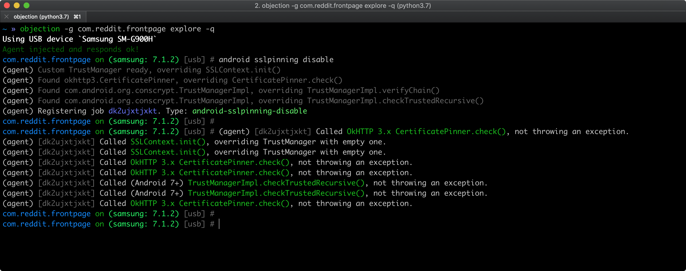

# Android Network Communication

## Overview

Almost every Android app acts as a client to one or more remote services. As this network communication usually takes place over untrusted networks such as public Wi-Fi, classical network based-attacks become a potential issue.

Most modern mobile apps use variants of HTTP-based web services, as these protocols are well-documented and supported.

### Android Network Security Configuration

Starting on Android 7.0 (API level 24), Android apps can customize their network security settings using the so-called [Network Security Configuration](https://developer.android.com/training/articles/security-config) feature which offers the following key capabilities:

- **Cleartext traffic**: Protect apps from accidental usage of cleartext traffic (or enables it).
- **Custom trust anchors**: Customize which Certificate Authorities (CAs) are trusted for an app's secure connections. For example, trusting particular self-signed certificates or restricting the set of public CAs that the app trusts.
- **Certificate pinning**: Restrict an app's secure connection to particular certificates.
- **Debug-only overrides**: Safely debug secure connections in an app without added risk to the installed base.

If an app defines a custom Network Security Configuration, you can obtain its location by searching for `android:networkSecurityConfig` in the AndroidManifest.xml file.

```xml
<application android:networkSecurityConfig="@xml/network_security_config"
```

In this case the file is located at `@xml` (equivalent to /res/xml) and has the name "network_security_config" (which might vary). You should be able to find it as "res/xml/network_security_config.xml". If a configuration exists, the following event should be visible in the [system logs](0x05b-Basic-Security_Testing.md#monitoring-system-logs):

```bash
D/NetworkSecurityConfig: Using Network Security Config from resource network_security_config
```

The Network Security Configuration is [XML-based](https://developer.android.com/training/articles/security-config#FileFormat) and can be used to configure app-wide and domain-specific settings:

- `base-config` applies to all connections that the app attempts to make.
- `domain-config` overrides `base-config` for specific domains (it can contain multiple `domain` entries).

For example, the following configuration uses the `base-config` to prevent cleartext traffic for all domains. But it overrides that rule using a `domain-config`, explicitly allowing cleartext traffic for `localhost`.

```xml
<?xml version="1.0" encoding="utf-8"?>
<network-security-config>
    <base-config cleartextTrafficPermitted="false" />
    <domain-config cleartextTrafficPermitted="true">
        <domain>localhost</domain>
    </domain-config>
</network-security-config>
```

Learn more:

- ["A Security Analyst’s Guide to Network Security Configuration in Android P"](https://www.nowsecure.com/blog/2018/08/15/a-security-analysts-guide-to-network-security-configuration-in-android-p/)
- [Android Developers - Network Security Configuration](https://developer.android.com/training/articles/security-config)
- [Android Codelab - Network Security Configuration](https://developer.android.com/codelabs/android-network-security-config)

#### Default Configurations

The default configuration for apps targeting Android 9 (API level 28) and higher is as follows:

```xml
<base-config cleartextTrafficPermitted="false">
    <trust-anchors>
        <certificates src="system" />
    </trust-anchors>
</base-config>
```

The default configuration for apps targeting Android 7.0 (API level 24) to Android 8.1 (API level 27) is as follows:

```xml
<base-config cleartextTrafficPermitted="true">
    <trust-anchors>
        <certificates src="system" />
    </trust-anchors>
</base-config>
```

The default configuration for apps targeting Android 6.0 (API level 23) and lower is as follows:

```xml
<base-config cleartextTrafficPermitted="true">
    <trust-anchors>
        <certificates src="system" />
        <certificates src="user" />
    </trust-anchors>
</base-config>
```

## Testing Data Encryption on the Network (MSTG-NETWORK-1)

### Static Analysis

#### Testing Network Requests over Secure Protocols

First, you should identify all network requests in the source code and ensure that no plain HTTP URLs are used. Make sure that sensitive information is sent over secure channels by using [`HttpsURLConnection`](https://developer.android.com/reference/javax/net/ssl/HttpsURLConnection.html "HttpsURLConnection") or [`SSLSocket`](https://developer.android.com/reference/javax/net/ssl/SSLSocket.html "SSLSocket") (for socket-level communication using TLS).

#### Testing Network API Usage

Next, even when using a low-level API which is supposed to make secure connections (such as `SSLSocket`), be aware that it has to be securely implemented. For instance, `SSLSocket` **doesn't** verify the hostname. Use `getDefaultHostnameVerifier` to verify the hostname. The Android developer documentation includes a [code example](https://developer.android.com/training/articles/security-ssl.html#WarningsSslSocket "Warnings About Using SSLSocket Directly").

#### Testing for Cleartext Traffic

Next, you should ensure that the app is not allowing cleartext HTTP traffic. Since Android 9 (API level 28) cleartext HTTP traffic is blocked by default (thanks to the [default Network Security Configuration](#default-configurations)) but there are multiple ways in which an application can still send it:

- Setting the [`android:usesCleartextTraffic`](https://developer.android.com/guide/topics/manifest/application-element#usesCleartextTraffic "Android documentation - usesCleartextTraffic flag") attribute of the `<application>` tag in the AndroidManifest.xml file. Note that this flag is ignored in case the Network Security Configuration is configured.
- Configuring the Network Security Configuration to enable cleartext traffic by setting the `cleartextTrafficPermitted` attribute to true on `<domain-config>` elements.
- Using low-level APIs (e.g. [`Socket`](https://developer.android.com/reference/java/net/Socket "Socket class")) to set up a custom HTTP connection.
- Using a cross-platform framework (e.g. Flutter, Xamarin, ...), as these typically have their own implementations for HTTP libraries.

All of the above cases must be carefully analyzed as a whole. For example, even if the app does not permit cleartext traffic in its Android Manifest or Network Security Configuration, it might actually still be sending HTTP traffic. That could be the case if it's using a low-level API (for which Network Security Configuration is ignored) or a badly configured cross-platform framework.

For more information refer to the article ["Security with HTTPS and SSL"](https://developer.android.com/training/articles/security-ssl.html).

### Dynamic Analysis

Intercept the tested app's incoming and outgoing network traffic and make sure that this traffic is encrypted. You can intercept network traffic in any of the following ways:

- Capture all HTTP(S) and Websocket traffic with an interception proxy like [OWASP ZAP](0x08a-Testing-Tools.md#owasp-zap) or [Burp Suite](0x08a-Testing-Tools.md#burp-suite) and make sure all requests are made via HTTPS instead of HTTP.
- Interception proxies like Burp and OWASP ZAP will show HTTP(S) traffic only. You can, however, use a Burp plugin such as [Burp-non-HTTP-Extension](https://github.com/summitt/Burp-Non-HTTP-Extension "Burp-non-HTTP-Extension") or the tool [mitm-relay](https://github.com/jrmdev/mitm_relay "mitm-relay") to decode and visualize communication via XMPP and other protocols.

> Some applications may not work with proxies like Burp and OWASP ZAP because of Certificate Pinning. In such a scenario, please check ["Testing Custom Certificate Stores and Certificate Pinning"](#testing-custom-certificate-stores-and-certificate-pinning-mstg-network-4).

For more details refer to:

- ["Intercepting Traffic on the Network Layer"](0x04f-Testing-Network-Communication.md#intercepting-traffic-on-the-network-layer) from chapter "Mobile App Network Communication"
- ["Setting up a Network Testing Environment"](0x05b-Basic-Security_Testing.md#setting-up-a-network-testing-environment) from chapter "Android Basic Security Testing"

## Testing the TLS Settings (MSTG-NETWORK-2)

Refer to section ["Verifying the TLS Settings"](0x04f-Testing-Network-Communication.md#verifying-the-tls-settings) in chapter "Mobile App Network Communication" for details.

## Testing Endpoint Identify Verification (MSTG-NETWORK-3)

### Static Analysis

Using TLS to transport sensitive information over the network is essential for security. However, encrypting communication between a mobile application and its backend API is not trivial. Developers often decide on simpler but less secure solutions (e.g., those that accept any certificate) to facilitate the development process, and sometimes these weak solutions [make it into the production version](https://saschafahl.de/static/paper/androidssl2012.pdf "Hunting Down Broken SSL in Android Apps"), potentially exposing users to [man-in-the-middle attacks](https://cwe.mitre.org/data/definitions/295.html "CWE-295: Improper Certificate Validation").

Two key issues should be addressed:

- Verify that a certificate comes from a trusted source, i.e. a trusted CA (Certificate Authority).
- Determine whether the endpoint server presents the right certificate.

Make sure that the hostname and the certificate itself are verified correctly. Examples and common pitfalls are available in the [official Android documentation](https://developer.android.com/training/articles/security-ssl.html "Android Documentation - SSL"). Search the code for examples of `TrustManager` and `HostnameVerifier` usage. In the sections below, you can find examples of the kind of insecure usage that you should look for.

> Note that from Android 8.0 (API level 26) onward, there is no support for SSLv3 and `HttpsURLConnection` will no longer perform a fallback to an insecure TLS/SSL protocol.

#### Verifying the Target SDK Version

Applications targeting Android 7.0 (API level 24) or higher will use a **default Network Security Configuration that doesn't trust any user supplied CAs**, reducing the possibility of MITM attacks by luring users to install malicious CAs.

[Decode the app using apktool](0x05b-Basic-Security_Testing.md#exploring-the-app-package) and verify that the `targetSdkVersion` in apktool.yml is equal to or higher than `24`.

```txt
grep targetSdkVersion UnCrackable-Level3/apktool.yml
  targetSdkVersion: '28'
```

However, even if `targetSdkVersion >=24`, the developer can disable default protections by using a custom Network Security Configuration defining a custom trust anchor **forcing the app to trust user supplied CAs**. See ["Analyzing Custom Trust Anchors"](#analyzing-custom-trust-anchors).

#### Analyzing Custom Trust Anchors

Search for the [Network Security Configuration](#android-network-security-configuration) file and inspect any custom `<trust-anchors>` defining `<certificates src="user">` (which should be avoided).

You should carefully analyze the [precedence of entries](https://developer.android.com/training/articles/security-config#ConfigInheritance):

- If a value is not set in a `<domain-config>` entry or in a parent `<domain-config>`, the configurations in place will be based on the `<base-config>`
- If not defined in this entry, the [default configurations](#default-configurations) will be used.

Take a look at this example of a Network Security Configuration for an app targeting Android 9 (API level 28):

```xml
<?xml version="1.0" encoding="utf-8"?>
<network-security-config>
    <domain-config>
        <domain includeSubdomains="false">owasp.org</domain>
        <trust-anchors>
            <certificates src="system" />
            <certificates src="user" />
        </trust-anchors>
    </domain-config>
</network-security-config>
```

Some observations:

- There's no `<base-config>`, meaning that the [default configuration](#default-configurations) for Android 9 (API level 28) or higher will be used for all other connections (only `system` CA will be trusted in principle).
- However, the `<domain-config>` overrides the default configuration allowing the app to trust both `system` and `user` CAs for the indicated `<domain>` (owasp.org).
- This doesn't affect subdomains because of `includeSubdomains="false"`.

Putting all together we can _translate_ the above Network Security Configuration to: "the app trusts system and user CAs for the owasp.org domain, excluding its subdomains. For any other domains the app will trust the system CAs only".

#### Verifying the Server Certificate

`TrustManager` is a means of verifying conditions necessary for establishing a trusted connection in Android. The following conditions should be checked at this point:

- Has the certificate been signed by a trusted CA?
- Has the certificate expired?
- Is the certificate self-signed?

The following code snippet is sometimes used during development and will accept any certificate, overwriting the functions `checkClientTrusted`, `checkServerTrusted`, and `getAcceptedIssuers`. Such implementations should be avoided, and, if they are necessary, they should be clearly separated from production builds to avoid built-in security flaws.

```java
TrustManager[] trustAllCerts = new TrustManager[] {
    new X509TrustManager() {
        @Override
        public X509Certificate[] getAcceptedIssuers() {
            return new java.security.cert.X509Certificate[] {};
        }

        @Override
        public void checkClientTrusted(X509Certificate[] chain, String authType)
            throws CertificateException {
        }

        @Override
        public void checkServerTrusted(X509Certificate[] chain, String authType)
            throws CertificateException {
        }
    }
 };

// SSLContext context
context.init(null, trustAllCerts, new SecureRandom());
```

#### WebView Server Certificate Verification

Sometimes applications use a WebView to render the website associated with the application. This is true of HTML/JavaScript-based frameworks such as Apache Cordova, which uses an internal WebView for application interaction. When a WebView is used, the mobile browser performs the server certificate validation. Ignoring any TLS error that occurs when the WebView tries to connect to the remote website is a bad practice.

The following code will ignore TLS issues, exactly like the WebViewClient custom implementation provided to the WebView:

```java
WebView myWebView = (WebView) findViewById(R.id.webview);
myWebView.setWebViewClient(new WebViewClient(){
    @Override
    public void onReceivedSslError(WebView view, SslErrorHandler handler, SslError error) {
        //Ignore TLS certificate errors and instruct the WebViewClient to load the website
        handler.proceed();
    }
});
```

#### Apache Cordova Certificate Verification

Implementation of the Apache Cordova framework's internal WebView usage will ignore [TLS errors](https://github.com/apache/cordova-android/blob/master/framework/src/org/apache/cordova/engine/SystemWebViewClient.java "TLS errors ignoring by Apache Cordova in WebView") in the method `onReceivedSslError` if the flag `android:debuggable` is enabled in the application manifest. Therefore, make sure that the app is not debuggable. See the test case "Testing If the App is Debuggable".

#### Hostname Verification

Another security flaw in client-side TLS implementations is the lack of hostname verification. Development environments usually use internal addresses instead of valid domain names, so developers often disable hostname verification (or force an application to allow any hostname) and simply forget to change it when their application goes to production. The following code disables hostname verification:

```java
final static HostnameVerifier NO_VERIFY = new HostnameVerifier() {
    public boolean verify(String hostname, SSLSession session) {
        return true;
    }
};
```

With a built-in `HostnameVerifier`, accepting any hostname is possible:

```java
HostnameVerifier NO_VERIFY = org.apache.http.conn.ssl.SSLSocketFactory
                             .ALLOW_ALL_HOSTNAME_VERIFIER;
```

Make sure that your application verifies a hostname before setting a trusted connection.

### Dynamic Analysis

When testing an app targeting Android 7.0 (API level 24) or higher it should be effectively applying the Network Security Configuration and you shouldn't able to see the decrypted HTTPS traffic at first. However, if the app targets API levels below 24, the app will automatically accept the installed user certificates.

To test improper certificate verification launch a MITM attack using an interception proxy such as Burp. Try the following options:

- **Self-signed certificate:**
  1. In Burp, go to the **Proxy** tab and select the **Options** tab.
  2. Go to the **Proxy Listeners** section, highlight your listener, and click **Edit**.
  3. Go to the **Certificate** tab, check **Use a self-signed certificate**, and click **Ok**.
  4. Run your application. If you're able to see HTTPS traffic, your application is accepting self-signed certificates.
- **Accepting certificates with an untrusted CA:**
  1. In Burp, go to the **Proxy** tab and select the **Options** tab.
  2. Go to the **Proxy Listeners** section, highlight your listener, and click **Edit**.
  3. Go to the **Certificate** tab, check **Generate a CA-signed certificate with a specific hostname**, and type in the backend server's hostname.
  4. Run your application. If you're able to see HTTPS traffic, your application is accepting certificates with an untrusted CA.
- **Accepting incorrect hostnames:**
  1. In Burp, go to the **Proxy** tab and select the **Options** tab.
  2. Go to the **Proxy Listeners** section, highlight your listener, and click **Edit**.
  3. Go to the **Certificate** tab, check **Generate a CA-signed certificate with a specific hostname**, and type in an invalid hostname, e.g., example.org.
  4. Run your application. If you're able to see HTTPS traffic, your application is accepting all hostnames.

If you're still not able to see any decrypted HTTPS traffic, your application might be implementing [certificate pinning](#testing-custom-certificate-stores-and-certificate-pinning-mstg-network-4).

## Testing Custom Certificate Stores and Certificate Pinning (MSTG-NETWORK-4)

### Static Analysis

#### Certificate Pinning in the Network Security Configuration

The [Network Security Configuration](#android-network-security-configuration) can also be used to pin [declarative certificates](https://developer.android.com/training/articles/security-config.html#CertificatePinning "Certificate Pinning using Network Security Configuration") to specific domains. This is done by providing a `<pin-set>` in the Network Security Configuration, which is a set of digests (hashes) of the public key (`SubjectPublicKeyInfo`) of the corresponding X.509 certificate.

When attempting to establish a connection to a remote endpoint, the system will:

- Get and validate the incoming certificate.
- Extract the public key.
- Calculate a digest over the extracted public key.
- Compare the digest with the set of local pins.

If at least one of the pinned digests matches, the certificate chain will be considered valid and the connection will proceed.

```xml
<?xml version="1.0" encoding="utf-8"?>
<network-security-config>
    <domain-config>
        Use certificate pinning for OWASP website access including sub domains
        <domain includeSubdomains="true">owasp.org</domain>
        <pin-set expiration="2018/8/10">
            <!-- Hash of the public key (SubjectPublicKeyInfo of the X.509 certificate) of
            the Intermediate CA of the OWASP website server certificate -->
            <pin digest="SHA-256">YLh1dUR9y6Kja30RrAn7JKnbQG/uEtLMkBgFF2Fuihg=</pin>
            <!-- Hash of the public key (SubjectPublicKeyInfo of the X.509 certificate) of
            the Root CA of the OWASP website server certificate -->
            <pin digest="SHA-256">Vjs8r4z+80wjNcr1YKepWQboSIRi63WsWXhIMN+eWys=</pin>
        </pin-set>
    </domain-config>
</network-security-config>
```

Inspect the `<pin-set>` elements for any `expiration` date. If expired, certificate pinning will be disabled for the affected domains.

> **Testing Tip**: If a certificate pinning validation check has failed, the following event should be logged in the [system logs](0x05b-Basic-Security_Testing.md#monitoring-system-logs):

```bash
I/X509Util: Failed to validate the certificate chain, error: Pin verification failed
```

#### TrustManager

Implementing certificate pinning involves three main steps:

- Obtain the certificate of the desired host(s).
- Make sure the certificate is in .bks format.
- Pin the certificate to an instance of the default Apache Httpclient.

To analyze the correct implementation of certificate pinning, the HTTP client should load the KeyStore:

```java
InputStream in = resources.openRawResource(certificateRawResource);
keyStore = KeyStore.getInstance("BKS");
keyStore.load(resourceStream, password);
```

Once the KeyStore has been loaded, we can use the TrustManager that trusts the CAs in our KeyStore:

```java
String tmfAlgorithm = TrustManagerFactory.getDefaultAlgorithm();
TrustManagerFactory tmf = TrustManagerFactory.getInstance(tmfAlgorithm);
tmf.init(keyStore);
// Create an SSLContext that uses the TrustManager
// SSLContext context = SSLContext.getInstance("TLS");
sslContext.init(null, tmf.getTrustManagers(), null);
```

The app's implementation may be different, pinning against the certificate's public key only, the whole certificate, or a whole certificate chain.

#### Network Libraries and WebViews

Applications that use third-party networking libraries may utilize the libraries' certificate pinning functionality. For example, [okhttp](https://github.com/square/okhttp/wiki/HTTPS "okhttp library") can be set up with the `CertificatePinner` as follows:

```java
OkHttpClient client = new OkHttpClient.Builder()
        .certificatePinner(new CertificatePinner.Builder()
            .add("example.com", "sha256/UwQAapahrjCOjYI3oLUx5AQxPBR02Jz6/E2pt0IeLXA=")
            .build())
        .build();
```

Applications that use a WebView component may utilize the WebViewClient's event handler for some kind of "certificate pinning" of each request before the target resource is loaded. The following code shows an example verification:

```java
WebView myWebView = (WebView) findViewById(R.id.webview);
myWebView.setWebViewClient(new WebViewClient(){
    private String expectedIssuerDN = "CN=Let's Encrypt Authority X3,O=Let's Encrypt,C=US;";

    @Override
    public void onLoadResource(WebView view, String url)  {
        //From Android API documentation about "WebView.getCertificate()":
        //Gets the SSL certificate for the main top-level page
        //or null if there is no certificate (the site is not secure).
        //
        //Available information on SslCertificate class are "Issuer DN", "Subject DN" and validity date helpers
        SslCertificate serverCert = view.getCertificate();
        if(serverCert != null){
            //apply either certificate or public key pinning comparison here
                //Throw exception to cancel resource loading...
            }
        }
    }
});
```

Alternatively, it is better to use an OkHttpClient with configured pins and let it act as a proxy overriding `shouldInterceptRequest` of the `WebViewClient`.

#### Xamarin Applications

Applications developed in Xamarin will typically use ServicePointManager to implement pinning.

Normally a function is created to check the certificate(s) and return the boolean value to the method ServerCertificateValidationCallback:

```cs
[Activity(Label = "XamarinPinning", MainLauncher = true)]
    public class MainActivity : Activity
    {
        // SupportedPublicKey - Hexadecimal value of the public key.
        // Use GetPublicKeyString() method to determine the public key of the certificate we want to pin. Uncomment the debug code in the ValidateServerCertificate function a first time to determine the value to pin.
        private const string SupportedPublicKey = "3082010A02820101009CD30CF05AE52E47B7725D3783B..."; // Shortened for readability

        private static bool ValidateServerCertificate(
                object sender,
                X509Certificate certificate,
                X509Chain chain,
                SslPolicyErrors sslPolicyErrors
            )
        {
            //Log.Debug("Xamarin Pinning",chain.ChainElements[X].Certificate.GetPublicKeyString());
            //return true;
            return SupportedPublicKey == chain.ChainElements[1].Certificate.GetPublicKeyString();
        }

        protected override void OnCreate(Bundle savedInstanceState)
        {
            System.Net.ServicePointManager.ServerCertificateValidationCallback += ValidateServerCertificate;
            base.OnCreate(savedInstanceState);
            SetContentView(Resource.Layout.Main);
            TesteAsync("https://security.claudio.pt");

        }
```

In this particular example we are pinning the intermediate CA of the certificate chain. The output of the HTTP response will be available in the system logs.

Sample Xamarin app with the previous example can be obtained on the [MSTG repository](https://github.com/OWASP/owasp-mastg/raw/master/Samples/Android/02_CertificatePinning/certificatePinningXamarin.apk "Xamarin app with certificate pinning")

After decompressing the APK file, use a .NET decompiler like dotPeak, ILSpy or dnSpy to decompile the app dlls stored inside the 'Assemblies' folder and confirm the usage of the ServicePointManager.

#### Cordova Applications

Hybrid applications based on Cordova do not support Certificate Pinning natively, so plugins are used to achieve this. The most common one is PhoneGap SSL Certificate Checker. The `check` method is used to confirm the fingerprint and callbacks will determine the next steps.

```javascript
  // Endpoint to verify against certificate pinning.
  var server = "https://www.owasp.org";
  // SHA256 Fingerprint (Can be obtained via "openssl s_client -connect hostname:443 | openssl x509 -noout -fingerprint -sha256"
  var fingerprint = "D8 EF 3C DF 7E F6 44 BA 04 EC D5 97 14 BB 00 4A 7A F5 26 63 53 87 4E 76 67 77 F0 F4 CC ED 67 B9";

  window.plugins.sslCertificateChecker.check(
          successCallback,
          errorCallback,
          server,
          fingerprint);

   function successCallback(message) {
     alert(message);
     // Message is always: CONNECTION_SECURE.
     // Now do something with the trusted server.
   }

   function errorCallback(message) {
     alert(message);
     if (message === "CONNECTION_NOT_SECURE") {
       // There is likely a man in the middle attack going on, be careful!
     } else if (message.indexOf("CONNECTION_FAILED") >- 1) {
       // There was no connection (yet). Internet may be down. Try again (a few times) after a little timeout.
     }
   }
```

After decompressing the APK file, Cordova/Phonegap files will be located in the /assets/www folder. The 'plugins' folder will give you the visibility of the plugins used. We will need to search for this methods in the JavaScript code of the application to confirm its usage.

### Dynamic Analysis

Follow the instructions from ["Testing Endpoint Identify Verification > Dynamic Analysis"](#testing-endpoint-identify-verification-mstg-network-3). If doing so doesn't lead to traffic being proxied, it may mean that certificate pinning is actually implemented and all security measures are in place. Does the same happen for all domains?

As a quick smoke test, you can try to bypass certificate pinning using [objection](0x08a-Testing-Tools.md#objection) as described in ["Bypassing Certificate Pinning"](0x05b-Basic-Security_Testing.md#bypassing-certificate-pinning). Pinning related APIs being hooked by objection should appear in objection's output.



However, keep in mind that:

- the APIs might not be complete.
- if nothing is hooked, that doesn't necessarily mean that the app doesn't implement pinning.

In both cases, the app or some of its components might implement custom pinning in a way that is [supported by objection](https://github.com/sensepost/objection/blob/master/agent/src/android/pinning.ts). Please check the static analysis section for specific pinning indicators and more in-depth testing.

## Testing the Security Provider (MSTG-NETWORK-6)

### Overview

Android relies on a security provider to provide SSL/TLS-based connections. The problem with this kind of security provider (one example is [OpenSSL](https://www.openssl.org/news/vulnerabilities.html "OpenSSL Vulnerabilities")), which comes with the device, is that it often has bugs and/or vulnerabilities.
To avoid known vulnerabilities, developers need to make sure that the application will install a proper security provider.
Since July 11, 2016, Google [has been rejecting Play Store application submissions](https://support.google.com/faqs/answer/6376725?hl=en "How to address OpenSSL vulnerabilities in your apps") (both new applications and updates) that use vulnerable versions of OpenSSL.

### Static Analysis

Applications based on the Android SDK should depend on GooglePlayServices. For example, in the gradle build file, you will find `compile 'com.google.android.gms:play-services-gcm:x.x.x'` in the dependencies block. You need to make sure that the `ProviderInstaller` class is called with either `installIfNeeded` or `installIfNeededAsync`. `ProviderInstaller` needs to be called by a component of the application as early as possible. Exceptions thrown by these methods should be caught and handled correctly.
If the application cannot patch its security provider, it can either inform the API of its less secure state or restrict user actions (because all HTTPS traffic should be deemed riskier in this situation).

Here are two [examples from the Android Developer documentation](https://developer.android.com/training/articles/security-gms-provider.html "Updating Your Security Provider to Protect Against SSL Exploits") that show how to update Security Provider to prevent SSL exploits. In both cases, the developer needs to handle the exceptions properly, and reporting to the backend when the application is working with an unpatched security provider may be wise.

Patching Synchronously:

```java
//this is a sync adapter that runs in the background, so you can run the synchronous patching.
public class SyncAdapter extends AbstractThreadedSyncAdapter {

  ...

  // This is called each time a sync is attempted; this is okay, since the
  // overhead is negligible if the security provider is up-to-date.
  @Override
  public void onPerformSync(Account account, Bundle extras, String authority,
      ContentProviderClient provider, SyncResult syncResult) {
    try {
      ProviderInstaller.installIfNeeded(getContext());
    } catch (GooglePlayServicesRepairableException e) {

      // Indicates that Google Play services is out of date, disabled, etc.

      // Prompt the user to install/update/enable Google Play services.
      GooglePlayServicesUtil.showErrorNotification(
          e.getConnectionStatusCode(), getContext());

      // Notify the SyncManager that a soft error occurred.
      syncResult.stats.numIOExceptions++;
      return;

    } catch (GooglePlayServicesNotAvailableException e) {
      // Indicates a non-recoverable error; the ProviderInstaller is not able
      // to install an up-to-date Provider.

      // Notify the SyncManager that a hard error occurred.
      //in this case: make sure that you inform your API of it.
      syncResult.stats.numAuthExceptions++;
      return;
    }

    // If this is reached, you know that the provider was already up-to-date,
    // or was successfully updated.
  }
}
```

Patching Asynchronously:

```java
//This is the mainactivity/first activity of the application that's there long enough to make the async installing of the securityprovider work.
public class MainActivity extends Activity
    implements ProviderInstaller.ProviderInstallListener {

  private static final int ERROR_DIALOG_REQUEST_CODE = 1;

  private boolean mRetryProviderInstall;

  //Update the security provider when the activity is created.
  @Override
  protected void onCreate(Bundle savedInstanceState) {
    super.onCreate(savedInstanceState);
    ProviderInstaller.installIfNeededAsync(this, this);
  }

  /**
   * This method is only called if the provider is successfully updated
   * (or is already up-to-date).
   */
  @Override
  protected void onProviderInstalled() {
    // Provider is up-to-date, app can make secure network calls.
  }

  /**
   * This method is called if updating fails; the error code indicates
   * whether the error is recoverable.
   */
  @Override
  protected void onProviderInstallFailed(int errorCode, Intent recoveryIntent) {
    if (GooglePlayServicesUtil.isUserRecoverableError(errorCode)) {
      // Recoverable error. Show a dialog prompting the user to
      // install/update/enable Google Play services.
      GooglePlayServicesUtil.showErrorDialogFragment(
          errorCode,
          this,
          ERROR_DIALOG_REQUEST_CODE,
          new DialogInterface.OnCancelListener() {
            @Override
            public void onCancel(DialogInterface dialog) {
              // The user chose not to take the recovery action
              onProviderInstallerNotAvailable();
            }
          });
    } else {
      // Google Play services is not available.
      onProviderInstallerNotAvailable();
    }
  }

  @Override
  protected void onActivityResult(int requestCode, int resultCode,
      Intent data) {
    super.onActivityResult(requestCode, resultCode, data);
    if (requestCode == ERROR_DIALOG_REQUEST_CODE) {
      // Adding a fragment via GooglePlayServicesUtil.showErrorDialogFragment
      // before the instance state is restored throws an error. So instead,
      // set a flag here, which will cause the fragment to delay until
      // onPostResume.
      mRetryProviderInstall = true;
    }
  }

  /**
   * On resume, check to see if we flagged that we need to reinstall the
   * provider.
   */
  @Override
  protected void onPostResume() {
    super.onPostResult();
    if (mRetryProviderInstall) {
      // We can now safely retry installation.
      ProviderInstall.installIfNeededAsync(this, this);
    }
    mRetryProviderInstall = false;
  }

  private void onProviderInstallerNotAvailable() {
    // This is reached if the provider cannot be updated for some reason.
    // App should consider all HTTP communication to be vulnerable, and take
    // appropriate action (e.g. inform backend, block certain high-risk actions, etc.).
  }
}

```

Make sure that NDK-based applications bind only to a recent and properly patched library that provides SSL/TLS functionality.

### Dynamic Analysis

When you have the source code:

- Run the application in debug mode, then create a breakpoint where the app will first contact the endpoint(s).
- Right click the highlighted code and select `Evaluate Expression`.
- Type `Security.getProviders()` and press enter.
- Check the providers and try to find `GmsCore_OpenSSL`, which should be the new top-listed provider.

When you do not have the source code:

- Use Xposed to hook into the `java.security` package, then hook into `java.security.Security` with the method `getProviders` (with no arguments). The return value will be an array of `Provider`.
- Determine whether the first provider is `GmsCore_OpenSSL`.

## References

### OWASP MASVS

- MSTG-NETWORK-1: "Data is encrypted on the network using TLS. The secure channel is used consistently throughout the app."
- MSTG-NETWORK-2: "The TLS settings are in line with current best practices, or as close as possible if the mobile operating system does not support the recommended standards."
- MSTG-NETWORK-3: "The app verifies the X.509 certificate of the remote endpoint when the secure channel is established. Only certificates signed by a trusted CA are accepted."
- MSTG-NETWORK-4: "The app either uses its own certificate store, or pins the endpoint certificate or public key, and subsequently does not establish connections with endpoints that offer a different certificate or key, even if signed by a trusted CA."
- MSTG-NETWORK-6: "The app only depends on up-to-date connectivity and security libraries."

### Android Developer Documentation

- Network Security Configuration - <https://developer.android.com/training/articles/security-config>
- Network Security Configuration (cached alternative) - <https://webcache.googleusercontent.com/search?q=cache:hOONLxvMTwYJ:https://developer.android.com/training/articles/security-config+&cd=10&hl=nl&ct=clnk&gl=nl>

### Xamarin Certificate Pinning

- Certificate and Public Key Pinning with Xamarin - <https://thomasbandt.com/certificate-and-public-key-pinning-with-xamarin>
- ServicePointManager - <https://msdn.microsoft.com/en-us/library/system.net.servicepointmanager(v=vs.110).aspx>

### Cordova Certificate Pinning

- PhoneGap SSL Certificate Checker plugin - <https://github.com/EddyVerbruggen/SSLCertificateChecker-PhoneGap-Plugin>
