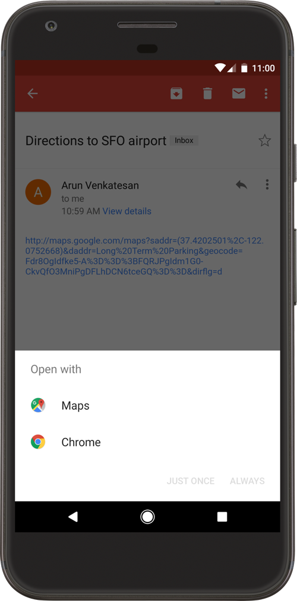

# Android Platform APIs

## Overview

### App Permissions

Android assigns a distinct system identity (Linux user ID and group ID) to every installed app. Because each Android app operates in a process sandbox, apps must explicitly request access to resources and data that are outside their sandbox. They request this access by [declaring the permissions](https://developer.android.com/guide/topics/permissions/overview "Permissions on Android") they need to use system data and features. Depending on how sensitive or critical the data or feature is, the Android system will grant the permission automatically or ask the user to approve the request.

To enhance user privacy and mitigate privacy risks, it is crucial for Android apps to minimize permission requests and only request access to sensitive information when absolutely necessary. The Android developer documentation offers valuable insights and best practices to help apps achieve the same level of functionality without requiring direct access to sensitive resources:

- [Minimize your permission requests](https://developer.android.com/training/permissions/evaluating "Minimize your permission requests")
- [App permissions best practices](https://developer.android.com/training/permissions/usage-notes "App permissions best practices")
- [Permissions and APIs that Access Sensitive Information](https://support.google.com/googleplay/android-developer/answer/9888170 "Permissions and APIs that Access Sensitive Information")

Android permissions can be classified into distinct categories depending on the extent of restricted data access and permitted actions that they grant to an app. This classification includes the so-called ["Protection Level"](https://developer.android.com/guide/topics/manifest/permission-element#plevel "<permission> - android:protectionLevel") as shown on the [permissions API reference page](https://developer.android.com/reference/android/Manifest.permission "Manifest.permission") and [AndroidManifest.xml Source Definitions](https://android.googlesource.com/platform/frameworks/base/+/refs/heads/master/core/res/AndroidManifest.xml#819 "android.googlesource.com - AndroidManifest.xml").

- [**Install-time permissions**](https://developer.android.com/guide/topics/permissions/overview#install-time Install-time permissions): grant limited access to restricted data or let the app perform restricted actions that minimally affect the system or other apps. They are granted automatically at installation time (Android 6.0 (API level 23) or higher).
    - Protection Level: `normal`. Grants apps access to isolated application-level features with minimal risk to other apps, the user, and the system. Example: `android.permission.INTERNET`
    - Protection Level: `signature`. Granted only to apps signed with the same certificate as the one used to sign the declaring app. Example: `android.permission.ACCESS_MOCK_LOCATION`
    - Protection Level: `systemOrSignature`. Reserved for system-embedded apps or those signed with the same certificate as the one used to sign the declaring app. Example: `android.permission.ACCESS_DOWNLOAD_MANAGER`. Old synonym for `signature|privileged`. Deprecated in API level 23.
- [**Runtime permissions**](https://developer.android.com/training/permissions/requesting "Request runtime permissions"): require prompting the user at runtime for explicit approval.
    - Protection Level: `dangerous`. Grant additional access to restricted data or let the app perform restricted actions that more substantially affect the system and other apps.
- [**Special permissions**](https://developer.android.com/training/permissions/requesting-special "Request special permissions"): require the user to navigate to **Settings > Apps > Special app access** and give explicit consent.
    - Protection Level: `appop`. Grant access to system resources that are particularly sensitive such as displaying and drawing over other apps or accessing all storage data.
- [**Custom permissions**](https://developer.android.com/guide/topics/permissions/defining "Define a custom app permission") in order to share their own resources and capabilities with other apps.
    - Protection Level: `normal`, `signature` or `dangerous`.

Independently from the assigned Protection Level, it is important to consider the risk that a permission might be posing considering the additional guarded capabilities, this is especially important for preloaded apps. The following table presents a representative set of Android permissions categorized by associated risk as defined in this [paper](https://www.android-device-security.org/publications/2020-lau-uraniborg/Lau_2020_Uraniborg_Scoring_Whitepaper_20200827.pdf "Uraniborg’s Device Preloaded App Risks Scoring Metrics") which leverages the set of (privileged) permissions and entrance points to an app to estimate its attack surface.

| Risk Category     | Permissions                                         | Protection Level |
|--------------|-----------------------------------------------------|------------------|
| **ASTRONOMICAL** | `android.permission.INSTALL_PACKAGES`           | signature        |
|              |                                                     |                  |
| **CRITICAL** | `android.permission.COPY_PROTECTED_DATA`            | signature        |
|              | `android.permission.WRITE_SECURE_SETTINGS`          | signature        |
|              | `android.permission.READ_FRAME_BUFFER`              | signature        |
|              | `android.permission.MANAGE_CA_CERTIFICATES`         | signature        |
|              | `android.permission.MANAGE_APP_OPS_MODES`           | signature        |
|              | `android.permission.GRANT_RUNTIME_PERMISSIONS`      | signature        |
|              | `android.permission.DUMP`                           | signature        |
|              | `android.permission.CAMERA`                         | dangerous        |
|              | `android.permission.SYSTEM_CAMERA`                  | systemOrSignature|
|              | `android.permission.MANAGE_PROFILE_AND_DEVICE_OWNERS`| signature        |
|              | `android.permission.MOUNT_UNMOUNT_FILESYSTEMS`      | signature        |
|              |                                                     |                  |
| **HIGH**     | `android.permission.INSTALL_GRANT_RUNTIME_PERMISSIONS`| signature        |
|              | `android.permission.READ_SMS`                       | dangerous        |
|              | `android.permission.WRITE_SMS`                      | normal           |
|              | `android.permission.RECEIVE_MMS`                    | dangerous        |
|              | `android.permission.SEND_SMS_NO_CONFIRMATION`       | signature        |
|              | `android.permission.RECEIVE_SMS`                    | dangerous        |
|              | `android.permission.READ_LOGS`                      | signature        |
|              | `android.permission.READ_PRIVILEGED_PHONE_STATE`    | signature        |
|              | `android.permission.LOCATION_HARDWARE`              | signature        |
|              | `android.permission.ACCESS_FINE_LOCATION`           | dangerous        |
|              | `android.permission.ACCESS_BACKGROUND_LOCATION`     | dangerous        |
|              | `android.permission.BIND_ACCESSIBILITY_SERVICE`     | signature        |
|              | `android.permission.ACCESS_WIFI_STATE`              | normal           |
|              | `com.android.voicemail.permission.READ_VOICEMAIL`   | signature        |
|              | `android.permission.RECORD_AUDIO`                   | dangerous        |
|              | `android.permission.CAPTURE_AUDIO_OUTPUT`           | signature        |
|              | `android.permission.ACCESS_NOTIFICATIONS`           | signature        |
|              | `android.permission.INTERACT_ACROSS_USERS_FULL`     | signature        |
|              | `android.permission.BLUETOOTH_PRIVILEGED`           | signature        |
|              | `android.permission.GET_PASSWORD`                   | signature        |
|              | `android.permission.INTERNAL_SYSTEM_WINDOW`         | signature        |
|              |                                                     |                  |
| **MEDIUM**   | `android.permission.ACCESS_COARSE_LOCATION`         | dangerous        |
|              | `android.permission.CHANGE_COMPONENT_ENABLED_STATE` | signature        |
|              | `android.permission.READ_CONTACTS`                  | dangerous        |
|              | `android.permission.WRITE_CONTACTS`                 | dangerous        |
|              | `android.permission.CONNECTIVITY_INTERNAL`          | signature        |
|              | `android.permission.ACCESS_MEDIA_LOCATION`          | dangerous        |
|              | `android.permission.READ_EXTERNAL_STORAGE`          | dangerous        |
|              | `android.permission.WRITE_EXTERNAL_STORAGE`         | dangerous        |
|              | `android.permission.SYSTEM_ALERT_WINDOW`            | signature        |
|              | `android.permission.READ_CALL_LOG`                  | dangerous        |
|              | `android.permission.WRITE_CALL_LOG`                 | dangerous        |
|              | `android.permission.INTERACT_ACROSS_USERS`          | signature        |
|              | `android.permission.MANAGE_USERS`                   | signature        |
|              | `android.permission.READ_CALENDAR`                  | dangerous        |
|              | `android.permission.BLUETOOTH_ADMIN`                | normal           |
|              | `android.permission.BODY_SENSORS`                   | dangerous        |
|              |                                                     |                  |
| **LOW**      | `android.permission.DOWNLOAD_WITHOUT_NOTIFICATION`  | normal           |
|              | `android.permission.PACKAGE_USAGE_STATS`            | signature        |
|              | `android.permission.MASTER_CLEAR`                   | signature        |
|              | `android.permission.DELETE_PACKAGES`                | normal           |
|              | `android.permission.GET_PACKAGE_SIZE`               | normal           |
|              | `android.permission.BLUETOOTH`                      | normal           |
|              | `android.permission.DEVICE_POWER`                   | signature        |
|              |                                                     |                  |
| **NONE**     | `android.permission.ACCESS_NETWORK_STATE`           | normal           |
|              | `android.permission.RECEIVE_BOOT_COMPLETED`         | normal           |
|              | `android.permission.WAKE_LOCK`                      | normal           |
|              | `android.permission.FLASHLIGHT`                     | normal           |
|              | `android.permission.VIBRATE`                        | normal           |
|              | `android.permission.WRITE_MEDIA_STORAGE`            | signature        |
|              | `android.permission.MODIFY_AUDIO_SETTINGS`          | normal           |

Note that this categorization can change over time. The paper gives us an example of that:

> Prior to Android 10, the `READ_PHONE_STATE` permission would be classified as HIGH, due to the permanent device identifiers (e.g. (IMEI/MEID, IMSI, SIM, and build serial) that it guards. However, starting from Android 10, a bulk of the sensitive information that can be used for tracking has been moved, refactored or rescoped into a new permission called `READ_PRIVILEGED_PHONE_STATE`, putting the new permission in the HIGH category, but resulting in the `READ_PHONE_STATE` permission moving to LOW.

#### Permission Changes per API Level

**Android 8.0 (API level 26) Changes:**

The [following changes](https://developer.android.com/about/versions/oreo/android-8.0-changes#atap "Android 8.0 (API level 26) - Changes for all apps") affect all apps running on Android 8.0 (API level 26), even to those apps targeting lower API levels.

- **Contacts provider usage stats change**: when an app requests the [`READ_CONTACTS`](https://developer.android.com/reference/android/Manifest.permission.html#READ_CONTACTS "READ_CONTACTS") permission, queries for contact's usage data will return approximations rather than exact values (the auto-complete API is not affected by this change).

Apps targeting Android 8.0 (API level 26) or higher [are affected](https://developer.android.com/about/versions/oreo/android-8.0-changes#o-apps "Apps targeting Android 8.0") by the following:

- **Account access and discoverability improvements**: Apps can no longer get access to user accounts only by having the [`GET_ACCOUNTS`](https://developer.android.com/reference/android/Manifest.permission.html#GET_ACCOUNTS "GET_ACCOUNTS") permission granted, unless the authenticator owns the accounts or the user grants that access.
- **New telephony permissions**: the following permissions (classified as dangerous) are now part of the `PHONE` permissions group:
    - The `ANSWER_PHONE_CALLS` permission allows to answer incoming phone calls programmatically (via `acceptRingingCall`).
    - The `READ_PHONE_NUMBERS` permission grants read access to the phone numbers stored in the device.
- **Restrictions when granting dangerous permissions**: Dangerous permissions are classified into permission groups (e.g. the `STORAGE` group contains `READ_EXTERNAL_STORAGE` and `WRITE_EXTERNAL_STORAGE`). Before Android 8.0 (API level 26), it was sufficient to request one permission of the group in order to get all permissions of that group also granted at the same time. This has changed [starting at Android 8.0 (API level 26)](https://developer.android.com/about/versions/oreo/android-8.0-changes#rmp "Android 8 Permissions Changes"): whenever an app requests a permission at runtime, the system will grant exclusively that specific permission. However, note that **all subsequent requests for permissions in that permission group will be automatically granted** without showing the permissions dialog to the user. See this example from the Android developer documentation:

    > Suppose an app lists both READ_EXTERNAL_STORAGE and WRITE_EXTERNAL_STORAGE in its manifest. The app requests READ_EXTERNAL_STORAGE and the user grants it. If the app targets API level 25 or lower, the system also grants WRITE_EXTERNAL_STORAGE at the same time, because it belongs to the same STORAGE permission group and is also registered in the manifest. If the app targets Android 8.0 (API level 26), the system grants only READ_EXTERNAL_STORAGE at that time; however, if the app later requests WRITE_EXTERNAL_STORAGE, the system immediately grants that privilege without prompting the user.

    You can see the list of permission groups in the [Android developer documentation](https://developer.android.com/guide/topics/permissions/overview.html#permission-groups "Permission groups"). To make this a bit more confusing, [Google also warns](https://developer.android.com/guide/topics/permissions/overview.html#perm-groups "Permission groups") that particular permissions might be moved from one group to another in future versions of the Android SDK and therefore, the logic of the app shouldn't rely on the structure of these permission groups. The best practice is to explicitly request every permission whenever it's needed.

**Android 9 (API Level 28) Changes:**

The [following changes](https://developer.android.com/about/versions/pie/android-9.0-changes-all "Behavior changes: all apps") affect all apps running on Android 9, even to those apps targeting API levels lower than 28.

- **Restricted access to call logs**: `READ_CALL_LOG`, `WRITE_CALL_LOG`, and `PROCESS_OUTGOING_CALLS` (dangerous) permissions are moved from `PHONE` to the new `CALL_LOG` permission group. This means that being able to make phone calls (e.g. by having the permissions of the `PHONE` group granted) is not sufficient to get access to the call logs.
- **Restricted access to phone numbers**: apps wanting to read the phone number require the `READ_CALL_LOG` permission when running on Android 9 (API level 28).
- **Restricted access to Wi-Fi location and connection information**: SSID and BSSID values cannot be retrieved (e.g. via [`WifiManager.getConnectionInfo`](https://developer.android.com/reference/android/net/wifi/WifiManager#getConnectionInfo%28%29 "WifiManager.getConnectionInfo") unless _all_ of the following is true:
    - The `ACCESS_FINE_LOCATION` or `ACCESS_COARSE_LOCATION` permission.
    - The `ACCESS_WIFI_STATE` permission.
    - Location services are enabled (under **Settings** -> **Location**).

Apps targeting Android 9 (API level 28) or higher [are affected](https://developer.android.com/about/versions/pie/android-9.0-changes-28 "Behavior changes: apps targeting API level 28+") by the following:

- **Build serial number deprecation**: device's hardware serial number cannot be read (e.g. via [`Build.getSerial`](https://developer.android.com/reference/android/os/Build.html#getSerial%28%29 "getSerial")) unless the `READ_PHONE_STATE` (dangerous) permission is granted.

**Android 10 (API level 29) Changes:**

Android 10 (API level 29) introduces several [user privacy enhancements](https://developer.android.com/about/versions/10/highlights#privacy_for_users "Android 10 for Developers: Privacy for users"). The changes regarding permissions affect to all apps running on Android 10 (API level 29), including those targeting lower API levels.

- **Restricted Location access**: new permission option for location access "only while using the app".
- **Scoped storage by default**: apps targeting Android 10 (API level 29) don't need to declare any storage permission to access their files in the app specific directory in external storage as well as for files creates from the media store.
- **Restricted access to screen contents**: `READ_FRAME_BUFFER`, `CAPTURE_VIDEO_OUTPUT`, and `CAPTURE_SECURE_VIDEO_OUTPUT` permissions are now signature-access only, which prevents silent access to the device's screen contents.
- **User-facing permission check on legacy apps**: when running an app targeting Android 5.1 (API level 22) or lower for the first time, users will be prompted with a permissions screen where they can revoke access to specific _legacy permissions_ (which previously would be automatically granted at installation time).

#### Permission Enforcement

**Activity Permission Enforcement:**

Permissions are applied via `android:permission` attribute within the `<activity>` tag in the manifest. These permissions restrict which applications can start that Activity. The permission is checked during `Context.startActivity` and `Activity.startActivityForResult`. Not holding the required permission results in a `SecurityException` being thrown from the call.

**Service Permission Enforcement:**

Permissions applied via `android:permission` attribute within the `<service>` tag in the manifest restrict who can start or bind to the associated Service. The permission is checked during `Context.startService`, `Context.stopService` and `Context.bindService`. Not holding the required permission results in a `SecurityException` being thrown from the call.

**Broadcast Permission Enforcement:**

Permissions applied via `android:permission` attribute within the `<receiver>` tag restrict access to send broadcasts to the associated `BroadcastReceiver`. The held permissions are checked after `Context.sendBroadcast` returns, while trying to deliver the sent broadcast to the given receiver. Not holding the required permissions doesn't throw an exception, the result is an unsent broadcast.

A permission can be supplied to `Context.registerReceiver` to control who can broadcast to a programmatically registered receiver. Going the other way, a permission can be supplied when calling `Context.sendBroadcast` to restrict which broadcast receivers are allowed to receive the broadcast.

Note that both a receiver and a broadcaster can require a permission. When this happens, both permission checks must pass for the intent to be delivered to the associated target. For more information, please reference the section "[Restricting broadcasts with permissions](https://developer.android.com/guide/components/broadcasts#restrict-broadcasts-permissions "Restricting broadcasts with permissions")" in the Android Developers Documentation.

**Content Provider Permission Enforcement:**

Permissions applied via `android:permission` attribute within the `<provider>` tag restrict access to data in a ContentProvider. Content providers have an important additional security facility called URI permissions which is described next. Unlike the other components, ContentProviders have two separate permission attributes that can be set, `android:readPermission` restricts who can read from the provider, and `android:writePermission` restricts who can write to it. If a ContentProvider is protected with both read and write permissions, holding only the write permission does not also grant read permissions.

Permissions are checked when you first retrieve a provider and as operations are performed using the ContentProvider. Using `ContentResolver.query` requires holding the read permission; using `ContentResolver.insert`, `ContentResolver.update`, `ContentResolver.delete` requires the write permission. A `SecurityException` will be thrown from the call if proper permissions are not held in all these cases.

**Content Provider URI Permissions:**

The standard permission system is not sufficient when being used with content providers. For example a content provider may want to limit permissions to READ permissions in order to protect itself, while using custom URIs to retrieve information. An application should only have the permission for that specific URI.

The solution is per-URI permissions. When starting or returning a result from an activity, the method can set `Intent.FLAG_GRANT_READ_URI_PERMISSION` and/or `Intent.FLAG_GRANT_WRITE_URI_PERMISSION`. This grants permission to the activity for
the specific URI regardless if it has permissions to access to data from the content provider.

This allows a common capability-style model where user interaction drives ad-hoc granting of fine-grained permission. This can be a key facility for reducing the permissions needed by apps to only those directly related to their behavior. Without this model in place malicious users may access other member's email attachments or harvest contact lists for future use via unprotected URIs. In the manifest the [`android:grantUriPermissions`](https://developer.android.com/guide/topics/manifest/provider-element#gprmsn "android:grantUriPermissions") attribute or the node help restrict the URIs.

Here you can find more information about APIs related to URI Permissions:

- [grantUriPermission](https://developer.android.com/reference/android/content/Context.html#grantUriPermission%28java.lang.String,%20android.net.Uri,%20int%29 "grantUriPermission")
- [revokeUriPermission](https://developer.android.com/reference/android/content/Context#revokeUriPermission%28android.net.Uri,%20int%29 "revokeUriPermission")
- [checkUriPermission](https://developer.android.com/reference/android/content/Context#checkUriPermission%28android.net.Uri,%20int,%20int,%20int%29 "checkUriPermission")

#### Custom Permissions

Android allows apps to expose their services/components to other apps. Custom permissions are required for app access to the exposed components. You can define [custom permissions](https://developer.android.com/guide/topics/permissions/defining.html "Custom Permissions") in `AndroidManifest.xml` by creating a permission tag with two mandatory attributes: `android:name` and `android:protectionLevel`.

It is crucial to create custom permissions that adhere to the _Principle of Least Privilege_: permission should be defined explicitly for its purpose, with a meaningful and accurate label and description.

Below is an example of a custom permission called `START_MAIN_ACTIVITY`, which is required when launching the `TEST_ACTIVITY` Activity.

The first code block defines the new permission, which is self-explanatory. The label tag is a summary of the permission, and the description is a more detailed version of the summary. You can set the protection level according to the types of permissions that will be granted. Once you've defined your permission, you can enforce it by adding it to the application's manifest. In our example, the second block represents the component that we are going to restrict with the permission we created. It can be enforced by adding the `android:permission` attributes.

```xml
<permission android:name="com.example.myapp.permission.START_MAIN_ACTIVITY"
        android:label="Start Activity in myapp"
        android:description="Allow the app to launch the activity of myapp app, any app you grant this permission will be able to launch main activity by myapp app."
        android:protectionLevel="normal" />

<activity android:name="TEST_ACTIVITY"
    android:permission="com.example.myapp.permission.START_MAIN_ACTIVITY">
    <intent-filter>
        <action android:name="android.intent.action.MAIN" />
        <category android:name="android.intent.category.LAUNCHER" />
     </intent-filter>
</activity>
```

Once the permission `START_MAIN_ACTIVITY` has been created, apps can request it via the `uses-permission` tag in the `AndroidManifest.xml` file. Any application granted the custom permission `START_MAIN_ACTIVITY` can then launch the `TEST_ACTIVITY`. Please note `<uses-permission android:name="myapp.permission.START_MAIN_ACTIVITY" />` must be declared before the `<application>` or an exception will occur at runtime. Please see the example below that is based on the [permission overview](https://developer.android.com/guide/topics/permissions/overview "permission overview") and [manifest-intro](https://developer.android.com/guide/topics/manifest/manifest-intro#filestruct "manifest-intro").

```xml
<manifest>
<uses-permission android:name="com.example.myapp.permission.START_MAIN_ACTIVITY" />
        <application>
            <activity>
            </activity>
        </application>
</manifest>
```

We recommend using a reverse-domain annotation when registering a permission, as in the example above (e.g. `com.domain.application.permission`) in order to avoid collisions with other applications.

### WebViews

#### URL Loading in WebViews

WebViews are Android's embedded components which allow your app to open web pages within your application. In addition to mobile apps related threats, WebViews may expose your app to common web threats (e.g. XSS, Open Redirect, etc.).

One of the most important things to do when testing WebViews is to make sure that only trusted content can be loaded in it. Any newly loaded page could be potentially malicious, try to exploit any WebView bindings or try to phish the user. Unless you're developing a browser app, usually you'd like to restrict the pages being loaded to the domain of your app. A good practice is to prevent the user from even having the chance to input any URLs inside WebViews (which is the default on Android) nor navigate outside the trusted domains. Even when navigating on trusted domains there's still the risk that the user might encounter and click on other links to untrustworthy content (e.g. if the page allows for other users to post comments). In addition, some developers might even override some default behavior which can be potentially dangerous for the user.

#### SafeBrowsing API

To provide a safer web browsing experience, Android 8.1 (API level 27) introduces the [`SafeBrowsing API`](https://developers.google.com/safe-browsing/v4), which allows your application to detect URLs that Google has classified as a known threat.

By default, WebViews show a warning to users about the security risk with the option to load the URL or stop the page from loading. With the SafeBrowsing API you can customize your application's behavior by either reporting the threat to SafeBrowsing or performing a particular action such as returning back to safety each time it encounters a known threat. Please check the [Android Developers documentation](https://developer.android.com/about/versions/oreo/android-8.1#safebrowsing) for usage examples.

You can use the SafeBrowsing API independently from WebViews using the [SafetyNet library](https://developer.android.com/training/safetynet/safebrowsing), which implements a client for Safe Browsing Network Protocol v4. SafetyNet allows you to analyze all the URLs that your app is supposed load. You can check URLs with different schemes (e.g. http, file) since SafeBrowsing is agnostic to URL schemes, and against `TYPE_POTENTIALLY_HARMFUL_APPLICATION` and `TYPE_SOCIAL_ENGINEERING` threat types.

> When sending URLs or files to be checked for known threats make sure they don't contain sensitive data which could compromise a user's privacy, or expose sensitive content from your application.

#### Virus Total API

Virus Total provides an API for analyzing URLs and local files for known threats. The API Reference is available on [Virus Total developers page](https://developers.virustotal.com/reference#getting-started "Getting Started").

#### JavaScript Execution in WebViews

JavaScript can be injected into web applications via reflected, stored, or DOM-based Cross-Site Scripting (XSS). Mobile apps are executed in a sandboxed environment and don't have this vulnerability when implemented natively. Nevertheless, WebViews may be part of a native app to allow web page viewing. Every app has its own WebView cache, which isn't shared with the native Browser or other apps. On Android, WebViews use the WebKit rendering engine to display web pages, but the pages are stripped down to minimal functions, for example, pages don't have address bars. If the WebView implementation is too lax and allows usage of JavaScript, JavaScript can be used to attack the app and gain access to its data.

#### WebView Protocol Handlers

Several default [schemas](https://developer.android.com/guide/appendix/g-app-intents.html "Intent List") are available for Android URLs. They can be triggered within a WebView with the following:

- http(s)://
- file://
- tel://

WebViews can load remote content from an endpoint, but they can also load local content from the app data directory or external storage. If the local content is loaded, the user shouldn't be able to influence the filename or the path used to load the file, and users shouldn't be able to edit the loaded file.

#### Java Objects Exposed Through WebViews

Android offers a way for JavaScript execution in a WebView to call and use native functions of an Android app (annotated with `@JavascriptInterface`) by using the [`addJavascriptInterface`](https://developer.android.com/reference/android/webkit/WebView.html#addJavascriptInterface%28java.lang.Object,%20java.lang.String%29 "Method addJavascriptInterface()") method. This is known as a _WebView JavaScript bridge_ or _native bridge_.

Please note that **when you use `addJavascriptInterface`, you're explicitly granting access to the registered JavaScript Interface object to all pages loaded within that WebView**. This implies that, if the user navigates outside your app or domain, all other external pages will also have access to those JavaScript Interface objects which might present a potential security risk if any sensitive data is being exposed though those interfaces.

> Warning: Take extreme care with apps targeting Android versions below Android 4.2 (API level 17) as they are [vulnerable to a flaw](https://labs.withsecure.com/publications/webview-addjavascriptinterface-remote-code-execution "WebView addJavascriptInterface Remote Code Execution") in the implementation of `addJavascriptInterface`: an attack that is abusing reflection, which leads to remote code execution when malicious JavaScript is injected into a WebView. This was due to all Java Object methods being accessible by default (instead of only those annotated).

#### WebViews Cleanup

Clearing the WebView resources is a crucial step when an app accesses any sensitive data within a WebView. This includes any files stored locally, the RAM cache and any loaded JavaScript.

As an additional measure, you could use server-side headers such as `no-cache`, which prevent an application from caching particular content.

> Starting on Android 10 (API level 29) apps are able to detect if a WebView has become [unresponsive](https://developer.android.com/about/versions/10/features?hl=en#webview-hung "WebView hung renderer detection"). If this happens, the OS will automatically call the `onRenderProcessUnresponsive` method.

You can find more security best practices when using WebViews on [Android Developers](https://developer.android.com/training/articles/security-tips?hl=en#WebView "Security Tips - Use WebView").

### Deep Links

_Deep links_ are URIs of any scheme that take users directly to specific content in an app. An app can [set up deep links](https://developer.android.com/training/app-links/deep-linking) by adding _intent filters_ on the Android Manifest and extracting data from incoming intents to navigate users to the correct activity.

Android supports two types of deep links:

- **Custom URL Schemes**, which are deep links that use any custom URL scheme, e.g. `myapp://` (not verified by the OS).
- **Android App Links** (Android 6.0 (API level 23) and higher), which are deep links that use the `http://` and `https://` schemes and contain the `autoVerify` attribute (which triggers OS verification).

**Deep Link Collision:**

Using unverified deep links can cause a significant issue- any other apps installed on a user's device can declare and try to handle the same intent, which is known as **deep link collision**. Any arbitrary application can declare control over the exact same deep link belonging to another application.

In recent versions of Android this results in a so-called _disambiguation dialog_ shown to the user that asks them to select the application that should handle the deep link. The user could make the mistake of choosing a malicious application instead of the legitimate one.



**Android App Links:**

In order to solve the deep link collision issue, Android 6.0 (API Level 23) introduced [**Android App Links**](https://developer.android.com/training/app-links), which are [verified deep links](https://developer.android.com/training/app-links/verify-site-associations "Verify Android App Links") based on a website URL explicitly registered by the developer. Clicking on an App Link will immediately open the app if it's installed.

There are some key differences from unverified deep links:

- App Links only use `http://` and `https://` schemes, any other custom URL schemes are not allowed.
- App Links require a live domain to serve a [Digital Asset Links file](https://developers.google.com/digital-asset-links/v1/getting-started "Digital Asset Link") via HTTPS.
- App Links do not suffer from deep link collision since they don't show a disambiguation dialog when a user opens them.

### Sensitive Functionality Exposure Through IPC

During implementation of a mobile application, developers may apply traditional techniques for IPC (such as using shared files or network sockets). The IPC system functionality offered by mobile application platforms should be used because it is much more mature than traditional techniques. Using IPC mechanisms with no security in mind may cause the application to leak or expose sensitive data.

The following is a list of Android IPC Mechanisms that may expose sensitive data:

- [Binders](https://developer.android.com/reference/android/os/Binder.html "IPCBinder")
- [Services](https://developer.android.com/guide/components/services.html "IPCServices")
- [Bound Services](https://developer.android.com/guide/components/bound-services.html "BoundServices")
- [AIDL](https://developer.android.com/guide/components/aidl.html "AIDL")
- [Intents](https://developer.android.com/reference/android/content/Intent.html "IPCIntent")
- [Content Providers](https://developer.android.com/reference/android/content/ContentProvider.html "IPCContentProviders")

#### Pending Intents

Often while dealing with complex flows during app development, there are situations where an app A wants another app B to perform a certain action in the future, on app A's behalf. Trying to implement this by only using `Intent`s leads to various security problems, like having multiple exported components. To handle this use case in a secure manner, Android provides the [`PendingIntent`](https://developer.android.com/reference/android/app/PendingIntent "PendingIntent") API.

`PendingIntent` are most commonly used for [notifications](https://developer.android.com/develop/ui/views/notifications "Android Notifications"), [app widgets](https://developer.android.com/develop/ui/views/appwidgets/advanced#user-interaction "app widgets"), [media browser services](https://developer.android.com/guide/topics/media-apps/audio-app/building-a-mediabrowserservice "media browser services"), etc. When used for notifications, `PendingIntent` is used to declare an intent to be executed when a user performs an action with an application's notification. The notification requires a callback to the application to trigger an action when the user clicks on it.

Internally, a `PendingIntent` object wraps a normal `Intent` object (referred as base intent) that will eventually be used to invoke an action. For example, the base intent specifies that an activity A should be started in an application. The receiving application of the `PendingIntent`, will unwrap and retrieve this base intent and invoke the activity A by calling the `PendingIntent.send` function.

A typical implementation for using `PendingIntent` is below:

```java
Intent intent = new Intent(applicationContext, SomeActivity.class);     // base intent

// create a pending intent
PendingIntent pendingIntent = PendingIntent.getActivity(applicationContext, 0, intent, PendingIntent.FLAG_IMMUTABLE);

// send the pending intent to another app
Intent anotherIntent = new Intent();
anotherIntent.setClassName("other.app", "other.app.MainActivity");
anotherIntent.putExtra("pendingIntent", pendingIntent);
startActivity(anotherIntent);
```

What makes a `PendingIntent` secure is that, unlike a normal `Intent`, it grants permission to a foreign application to use the `Intent` (the base intent) it contains, as if it were being executed by your application's own process. This allows an application to freely use them to create callbacks without the need to create exported activities.

If not implemented correctly, a malicious application can **hijack** a `PendingIntent`. For example, in the notification example above, a malicious application with `android.permission.BIND_NOTIFICATION_LISTENER_SERVICE` can bind to the notification listener service and retrieve the pending intent.

There are certain security pitfalls when implementing `PendingIntent`s, which are listed below:

- **Mutable fields**: A `PendingIntent` can have mutable and empty fields that can be filled by a malicious application. This can lead to a malicious application gaining access to non-exported application components. Using the [`PendingIntent.FLAG_IMMUTABLE` flag](https://developer.android.com/reference/android/app/PendingIntent#FLAG_IMMUTABLE "FLAG_IMMUTABLE") makes the `PendingIntent` immutable and prevents any changes to the fields. Prior to Android 12 (API level 31), the `PendingIntent` was mutable by default, while since Android 12 (API level 31) it is changed to [immutable by default](https://developer.android.com/reference/android/app/PendingIntent#FLAG_MUTABLE "immutable by default") to prevent accidental vulnerabilities.

- **Use of implicit intent**: A malicious application can receive a `PendingIntent` and then update the base intent to target the component and package within the malicious application. As a mitigation, ensure that you explicitly specify the exact package, action and component that will receive the base intent.

The most common case of `PendingIntent` attack is when a malicious application is able to intercept it.

For further details, check the Android documentation on [using a pending intent](https://developer.android.com/guide/components/intents-filters#PendingIntent "using a pending intent").

#### Implicit Intents

An Intent is a messaging object that you can use to request an action from another application component. Although intents facilitate communication between components in a variety of ways, there are three basic use cases: starting an activity, starting a service, and delivering a broadcast.

According to the [Android Developers Documentation](https://developer.android.com/guide/components/intents-filters#Types), Android provides two types of intents:

- **Explicit intents** specify which application will satisfy the intent by providing either the target app's package name or a fully qualified component class name. Typically, you'll use an explicit intent to start a component in your own app, because you know the class name of the activity or service you want to start. For example, you might want to start a new activity in your app in response to a user action, or start a service to download a file in the background.

  ```java
  // Note the specification of a concrete component (DownloadActivity) that is started by the intent.
  Intent downloadIntent = new Intent(this, DownloadActivity.class);
  downloadIntent.setAction("android.intent.action.GET_CONTENT")
  startActivityForResult(downloadIntent);
  ```

- **Implicit intents** do not name a specific component, but instead declare a general action to be performed that another app's component can handle. For example, if you want to show the user a location on a map, you can use an implicit intent to ask another capable app to show a specific location on a map. Another example is when the user clicks on an email address within an app, where the calling app does not want to specify a specific email app and leaves that choice up to the user.

  ```java
  // Developers can also start an activity by just setting an action that is matched by the intended app.
  Intent downloadIntent = new Intent();
  downloadIntent.setAction("android.intent.action.GET_CONTENT")
  startActivityForResult(downloadIntent);
  ```

The use of implicit intents can lead to multiple security risks, e.g. if the calling app processes the return value of the implicit intent without proper verification or if the intent contains sensitive data, it can be accidentally leaked to unauthorized third-parties.

You can refer to this [blog post](https://blog.oversecured.com/Interception-of-Android-implicit-intents/ "Interception of Android implicit intents"), [this article](https://wiki.sei.cmu.edu/confluence/display/android/DRD03-J.+Do+not+broadcast+sensitive+information+using+an+implicit+intent "DRD03-J. Do not broadcast sensitive information using an implicit intent") and [CWE-927](https://cwe.mitre.org/data/definitions/927.html "CWE-927: Use of Implicit Intent for Sensitive Communication") for more information about the mentioned problem, concrete attack scenarios and recommendations.

### Object Persistence

There are several ways to persist an object on Android:

#### Object Serialization

An object and its data can be represented as a sequence of bytes. This is done in Java via [object serialization](https://developer.android.com/reference/java/io/Serializable.html "Serializable"). Serialization is not inherently secure. It is just a binary format (or representation) for locally storing data in a .ser file. Encrypting and signing HMAC-serialized data is possible as long as the keys are stored safely. Deserializing an object requires a class of the same version as the class used to serialize the object. After classes have been changed, the `ObjectInputStream` can't create objects from older .ser files. The example below shows how to create a `Serializable` class by implementing the `Serializable` interface.

```java
import java.io.Serializable;

public class Person implements Serializable {
  private String firstName;
  private String lastName;

  public Person(String firstName, String lastName) {
    this.firstName = firstName;
    this.lastName = lastName;
    }
  //..
  //getters, setters, etc
  //..

}

```

Now you can read/write the object with `ObjectInputStream`/`ObjectOutputStream` in another class.

#### JSON

There are several ways to serialize the contents of an object to JSON. Android comes with the `JSONObject` and `JSONArray` classes. A wide variety of libraries, including [GSON](https://github.com/google/gson "Google Gson"), [Jackson](https://github.com/FasterXML/jackson-core "Jackson core"), [Moshi](https://github.com/square/moshi "Moshi"), can also be used. The main differences between the libraries are whether they use reflection to compose the object, whether they support annotations, whether the create immutable objects, and the amount of memory they use. Note that almost all the JSON representations are String-based and therefore immutable. This means that any secret stored in JSON will be harder to remove from memory.
JSON itself can be stored anywhere, e.g., a (NoSQL) database or a file. You just need to make sure that any JSON that contains secrets has been appropriately protected (e.g., encrypted/HMACed). See the chapter "[Data Storage on Android](0x05d-Testing-Data-Storage.md)" for more details. A simple example (from the GSON User Guide) of writing and reading JSON with GSON follows. In this example, the contents of an instance of the `BagOfPrimitives` is serialized into JSON:

```java
class BagOfPrimitives {
  private int value1 = 1;
  private String value2 = "abc";
  private transient int value3 = 3;
  BagOfPrimitives() {
    // no-args constructor
  }
}

// Serialization
BagOfPrimitives obj = new BagOfPrimitives();
Gson gson = new Gson();
String json = gson.toJson(obj);

// ==> json is {"value1":1,"value2":"abc"}

```

#### XML

There are several ways to serialize the contents of an object to XML and back. Android comes with the `XmlPullParser` interface which allows for easily maintainable XML parsing. There are two implementations within Android: `KXmlParser` and `ExpatPullParser`. The [Android Developer Guide](https://developer.android.com/training/basics/network-ops/xml#java "Instantiate the parser") provides a great write-up on how to use them. Next, there are various alternatives, such as a `SAX` parser that comes with the Java runtime. For more information, see [a blogpost from ibm.com](https://www.ibm.com/developerworks/opensource/library/x-android/index.html "Working with XML on Android on IBM Developer").
Similarly to JSON, XML has the issue of working mostly String based, which means that String-type secrets will be harder to remove from memory. XML data can be stored anywhere (database, files), but do need additional protection in case of secrets or information that should not be changed. See the chapter "[Data Storage on Android](0x05d-Testing-Data-Storage.md)" for more details. As stated earlier: the true danger in XML lies in the [XML eXternal Entity (XXE)](https://owasp.org/www-community/vulnerabilities/XML_External_Entity_%28XXE%29_Processing "XML eXternal Entity attack (XXE)") attack as it might allow for reading external data sources that are still accessible within the application.

#### ORM

There are libraries that provide functionality for directly storing the contents of an object in a database and then instantiating the object with the database contents. This is called Object-Relational Mapping (ORM). Libraries that use the SQLite database include

- [OrmLite](http://ormlite.com/ "OrmLite"),
- [SugarORM](https://satyan.github.io/sugar/ "Sugar ORM"),
- [GreenDAO](https://github.com/greenrobot/greenDAO "GreenDAO") and
- [ActiveAndroid](http://www.activeandroid.com/ "ActiveAndroid").

[Realm](https://www.mongodb.com/docs/realm/sdk/java/ "Realm Java"), on the other hand, uses its own database to store the contents of a class. The amount of protection that ORM can provide depends primarily on whether the database is encrypted. See the chapter "[Data Storage on Android](0x05d-Testing-Data-Storage.md)" for more details. The Realm website includes a nice [example of ORM Lite](https://github.com/j256/ormlite-examples/tree/master/android/HelloAndroid "OrmLite example").

#### Parcelable

[`Parcelable`](https://developer.android.com/reference/android/os/Parcelable.html "Parcelable") is an interface for classes whose instances can be written to and restored from a [`Parcel`](https://developer.android.com/reference/android/os/Parcel.html "Parcel"). Parcels are often used to pack a class as part of a `Bundle` for an `Intent`. Here's an Android developer documentation example that implements `Parcelable`:

```java
public class MyParcelable implements Parcelable {
     private int mData;

     public int describeContents() {
         return 0;
     }

     public void writeToParcel(Parcel out, int flags) {
         out.writeInt(mData);
     }

     public static final Parcelable.Creator<MyParcelable> CREATOR
             = new Parcelable.Creator<MyParcelable>() {
         public MyParcelable createFromParcel(Parcel in) {
             return new MyParcelable(in);
         }

         public MyParcelable[] newArray(int size) {
             return new MyParcelable[size];
         }
     };

     private MyParcelable(Parcel in) {
         mData = in.readInt();
     }
 }
```

Because this mechanism that involves Parcels and Intents may change over time, and the `Parcelable` may contain `IBinder` pointers, storing data to disk via `Parcelable` is not recommended.

#### Protocol Buffers

[Protocol Buffers](https://developers.google.com/protocol-buffers/ "Google Documentation") by Google, are a platform- and language neutral mechanism for serializing structured data by means of the [Binary Data Format](https://developers.google.com/protocol-buffers/docs/encoding "Encoding").
There have been a few vulnerabilities with Protocol Buffers, such as [CVE-2015-5237](https://www.cvedetails.com/cve/CVE-2015-5237/ "CVE-2015-5237").
Note that Protocol Buffers do not provide any protection for confidentiality: there is no built in encryption.

### Overlay Attacks

Screen overlay attacks occur when a malicious application manages to put itself on top of another application which remains working normally as if it were on the foreground. The malicious app might create UI elements mimicking the look and feel and the original app or even the Android system UI. The intention is typically to make users believe that they keep interacting with the legitimate app and then try to elevate privileges (e.g by getting some permissions granted), stealthy phishing, capture user taps and keystrokes etc.

There are several attacks affecting different Android versions including:

- [**Tapjacking**](https://medium.com/devknoxio/what-is-tapjacking-in-android-and-how-to-prevent-it-50140e57bf44 "What is Tapjacking in Android and How to Prevent It") (Android 6.0 (API level 23) and lower) abuses the screen overlay feature of Android listening for taps and intercepting any information being passed to the underlying activity.
- [**Cloak & Dagger**](https://cloak-and-dagger.org/ "Cloak & Dagger") attacks affect apps targeting Android 5.0 (API level 21) to Android 7.1 (API level 25). They abuse one or both of the `SYSTEM_ALERT_WINDOW` ("draw on top") and `BIND_ACCESSIBILITY_SERVICE` ("a11y") permissions that, in case the app is installed from the Play Store, the users do not need to explicitly grant and for which they are not even notified.
- [**Toast Overlay**](https://unit42.paloaltonetworks.com/unit42-android-toast-overlay-attack-cloak-and-dagger-with-no-permissions/ "Android Toast Overlay Attack: Cloak and Dagger with No Permissions") is quite similar to Cloak & Dagger but do not require specific Android permissions to be granted by users. It was closed with CVE-2017-0752 on Android 8.0 (API level 26).

Usually, this kind of attacks are inherent to an Android system version having certain vulnerabilities or design issues. This makes them challenging and often virtually impossible to prevent unless the app is upgraded targeting a safe Android version (API level).

Over the years many known malware like MazorBot, BankBot or MysteryBot have been abusing the screen overlay feature of Android to target business critical applications, namely in the banking sector. This [blog](https://www.infosecurity-magazine.com/opinions/overlay-attacks-safeguard-mobile/ "Dealing with Overlay Attacks: Adopting Built-in Security to Safeguard Mobile Experience") discusses more about this type of malware.

### Enforced Updating

Starting from Android 5.0 (API level 21), together with the Play Core Library, apps can be forced to be updated. This mechanism is based on using the `AppUpdateManager`. Before that, other mechanisms were used, such as doing http calls to the Google Play Store, which are not as reliable as the APIs of the Play Store might change. Alternatively, Firebase could be used to check for possible forced updates as well (see this [blog](https://medium.com/@sembozdemir/force-your-users-to-update-your-app-with-using-firebase-33f1e0bcec5a "Force users to update the app using Firebase")).
Enforced updating can be really helpful when it comes to public key pinning (see the Testing Network communication for more details) when a pin has to be refreshed due to a certificate/public key rotation. Next, vulnerabilities are easily patched by means of forced updates.

Please note that newer versions of an application will not fix security issues that are living in the backends to which the app communicates. Allowing an app not to communicate with it might not be enough. Having proper API-lifecycle management is key here.
Similarly, when a user is not forced to update, do not forget to test older versions of your app against your API and/or use proper API versioning.
