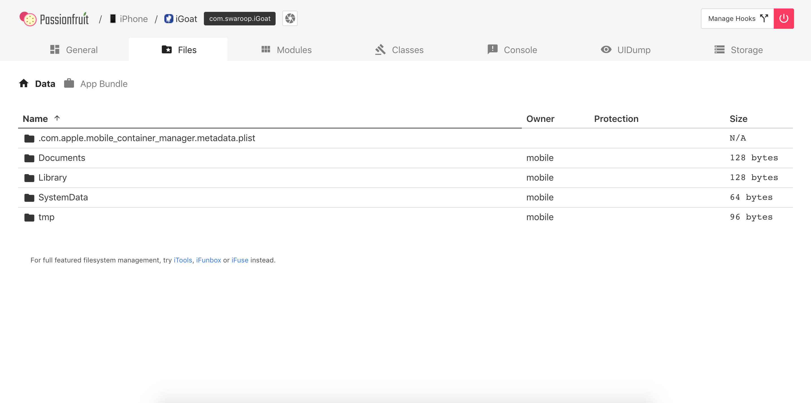
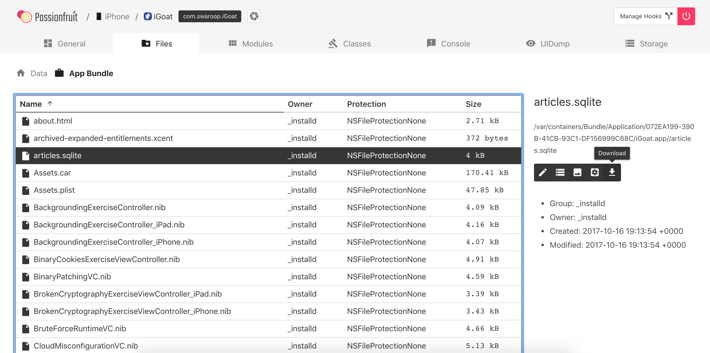
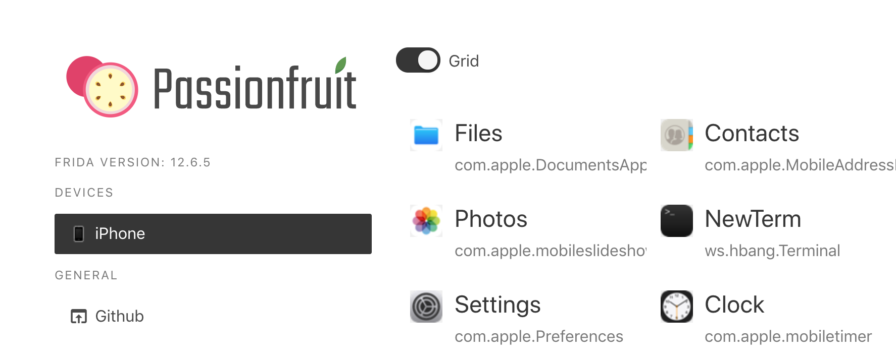
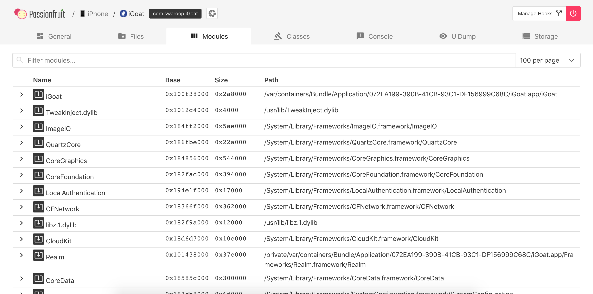
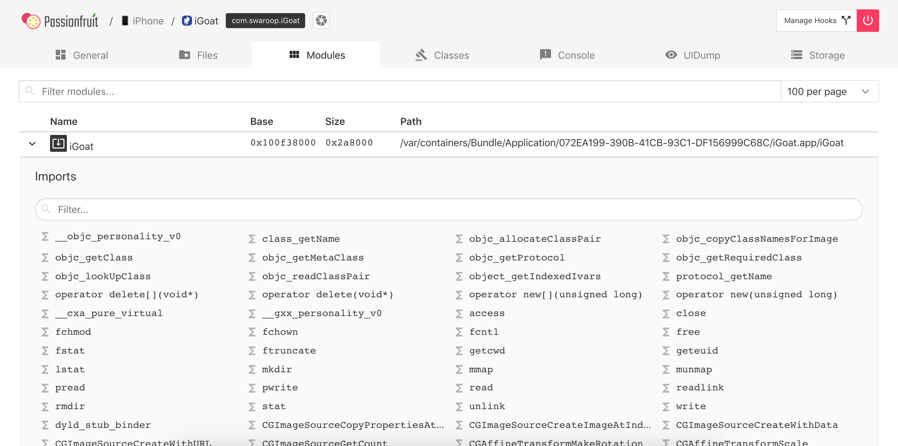
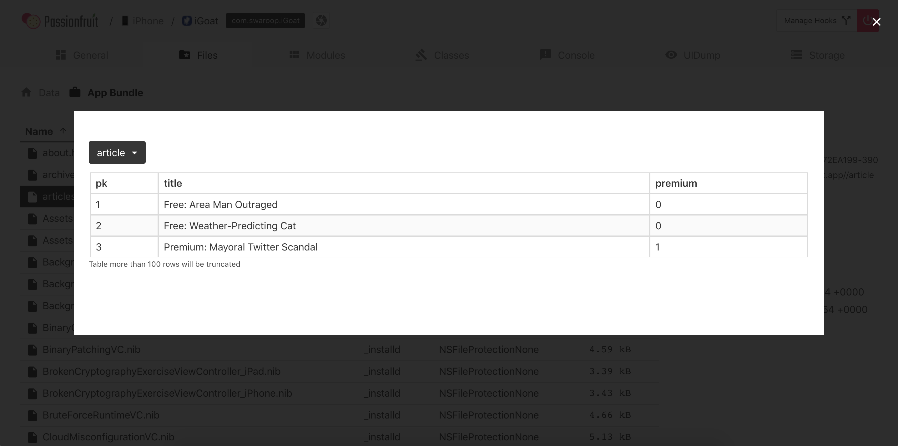
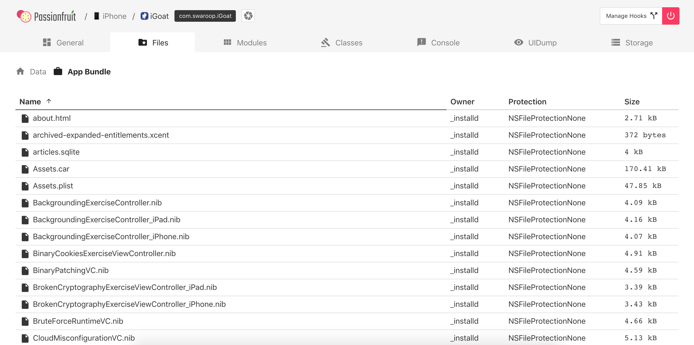
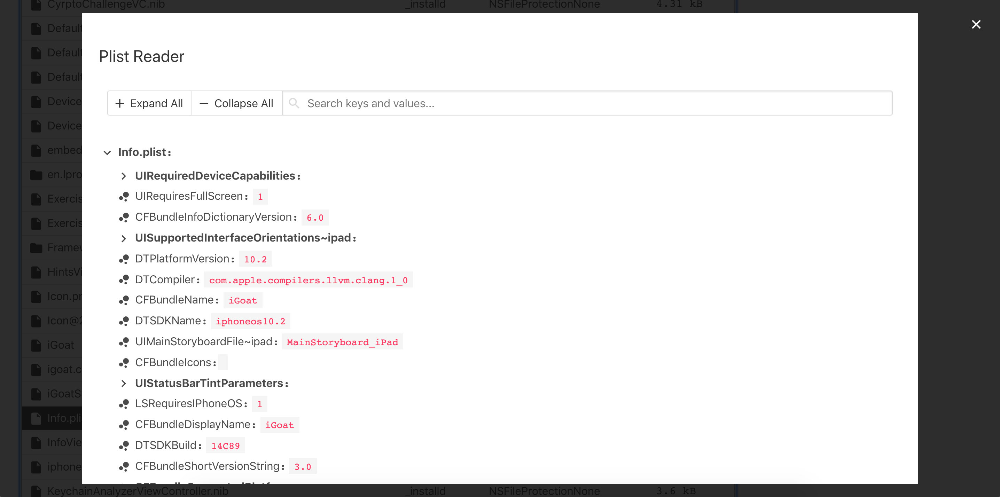
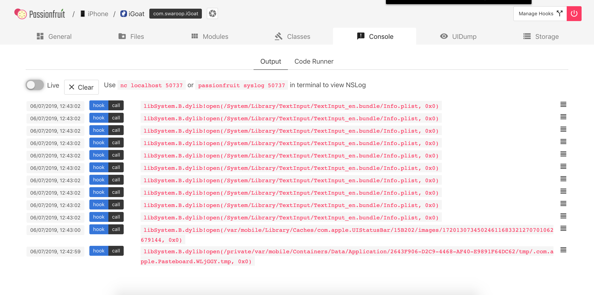
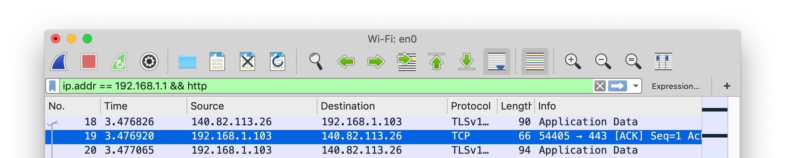

## iOS Basic Security Testing

In the previous chapter, we provided an overview of the iOS platform and described the structure of iOS apps. In this chapter, we'll introduce basic processes and techniques you can use to test iOS apps for security flaws. These basic processes are the foundation for the test cases outlined in the following chapters.

### iOS Testing Setup

#### Host Device

Although you can use a Linux or Windows machine for testing, you'll find that many tasks are difficult or impossible on these platforms. In addition, the Xcode development environment and the iOS SDK are only available for macOS. This means that you'll definitely want to work on macOS for source code analysis and debugging (it also makes black box testing easier).

The following is the most basic iOS app testing setup:

- Ideally macOS machine with admin rights.
- Wi-Fi network that permits client-to-client traffic.
- At least one jailbroken iOS device (of the desired iOS version).
- Burp Suite or other interception proxy tool.

##### Setting up Xcode and Command Line Tools

Xcode is an Integrated Development Environment (IDE) for macOS that contains a suite of tools for developing software for macOS, iOS, watchOS, and tvOS. You can [download Xcode for free from the official Apple website](https://developer.apple.com/xcode/ide/ "Apple Xcode IDE"). Xcode will offer you different tools and functions to interact with an iOS device that can be helpful during a penetration test, such as analyzing logs or sideloading of apps.

All development tools are already included within Xcode, but they are not available within your terminal. In order to make them available systemwide, it is recommended to install the Command Line Tools package. This will be handy during testing of iOS apps as some of the tools you will be using later (e.g. objection) are also relying on the availability of this package. You can [download it from the official Apple website](https://developer.apple.com/download/more/ "Apple iOS SDK") or install it straight away from your terminal:

```shell
$ xcode-select --install
```

#### Testing Device

##### Getting the UDID of an iOS device

The UDID is a 40-digit unique sequence of letters and numbers to identify an iOS device. You can find the [UDID of your iOS device via iTunes](http://www.iclarified.com/52179/how-to-find-your-iphones-udid "How to Find Your iPhone\'s UDID"), by selecting your device and clicking on "Serial Number" in the summary tab. When clicking on this you will iterate through different meta-data of the iOS device including its UDID.

It is also possible to get the UDID via various command line tools while the device is attached via USB:

- By using the [I/O Registry Explorer](https://developer.apple.com/library/archive/documentation/DeviceDrivers/Conceptual/IOKitFundamentals/TheRegistry/TheRegistry.html "I/O Registry Explorer") tool `ioreg` (macOS only):

    ```sh
    $ ioreg -p IOUSB -l | grep "USB Serial"
    |         "USB Serial Number" = "9e8ada44246cee813e2f8c1407520bf2f84849ec"
    ```

- By using [ideviceinstaller](https://github.com/libimobiledevice/ideviceinstaller) (macOS / Linux):

    ```sh
    $ brew install ideviceinstaller
    $ idevice_id -l
    316f01bd160932d2bf2f95f1f142bc29b1c62dbc
    ```

- By using the system_profiler (macOS only):

    ```sh
    $ system_profiler SPUSBDataType | sed -n -e '/iPad/,/Serial/p;/iPhone/,/Serial/p;/iPod/,/Serial/p' | grep "Serial Number:"
    2019-09-08 10:18:03.920 system_profiler[13251:1050356] SPUSBDevice: IOCreatePlugInInterfaceForService failed 0xe00002be
                Serial Number: 64655621de6ef5e56a874d63f1e1bdd14f7103b1
    ```

- By using instruments (macOS only):

    ```sh
    $ instruments -s devices
    ```

##### Testing on a real device (Jailbroken)

You should have a jailbroken iPhone or iPad for running tests. These devices allow root access and tool installation, making the security testing process more straightforward. If you don't have access to a jailbroken device, you can apply the workarounds described later in this chapter, but be prepared for a more difficult experience.

##### Testing on the iOS Simulator

Unlike the Android emulator, which fully emulates the hardware of an actual Android device, the iOS SDK simulator offers a higher-level *simulation* of an iOS device. Most importantly, emulator binaries are compiled to x86 code instead of ARM code. Apps compiled for a real device don't run, making the simulator useless for black box analysis and reverse engineering.

##### Getting Privileged Access

iOS jailbreaking is often compared to Android rooting, but the process is actually quite different. To explain the difference, we'll first review the concepts of "rooting" and "flashing" on Android.

- **Rooting**: This typically involves installing the `su` binary on the system or replacing the whole system with a rooted custom ROM. Exploits aren't required to obtain root access as long as the bootloader is accessible.
- **Flashing custom ROMs**: This allows you to replace the OS that's running on the device after you unlock the bootloader. The bootloader may require an exploit to unlock it.

On iOS devices, flashing a custom ROM is impossible because the iOS bootloader only allows Apple-signed images to be booted and flashed. This is why even official iOS images can't be installed if they aren't signed by Apple, and it makes iOS downgrades only possible for as long as the previous iOS version is still signed.

The purpose of jailbreaking is to disable iOS protections (Apple's code signing mechanisms in particular) so that arbitrary unsigned code can run on the device. The word "jailbreak" is a colloquial reference to all-in-one tools that automate the disabling process.

Cydia is an alternative app store developed by Jay Freeman (aka "saurik") for jailbroken devices. It provides a graphical user interface and a version of the Advanced Packaging Tool (APT). You can easily access many "unsanctioned" app packages through Cydia. Most jailbreaks install Cydia automatically.

Since iOS 11 jailbreaks are introducing [Sileo](https://cydia-app.com/sileo/ "Sileo"), which is a new jailbreak app-store for iOS devices. The jailbreak [Chimera](https://chimera.sh/ "Chimera") for iOS 12 is also relying on Sileo as a package manager.

Developing a jailbreak for a given version of iOS is not easy. As a security tester, you'll most likely want to use publicly available jailbreak tools. Still, we recommend studying the techniques that have been used to jailbreak various versions of iOS-you'll encounter many interesting exploits and learn a lot about OS internals. For example, Pangu9 for iOS 9.x [exploited at least five vulnerabilities](https://www.theiphonewiki.com/wiki/Jailbreak_Exploits "Jailbreak Exploits"), including a use-after-free kernel bug (CVE-2015-6794) and an arbitrary file system access vulnerability in the Photos app (CVE-2015-7037).

Some apps attempt to detect whether the iOS device on which they're running is jailbroken. This is because jailbreaking deactivates some of iOS' default security mechanisms. However, there are several ways to get around these detections, and we'll introduce them in the chapters "Reverse Engineering and Tampering on iOS" and "Testing Anti-Reversing Defenses on iOS".

###### Benefits of Jailbreaking

End users often jailbreak their devices to tweak the iOS system's appearance, add new features, and install third-party apps from unofficial app stores. For a security tester, however, jailbreaking an iOS device has even more benefits. They include, but aren't limited to, the following:

- Root access to the file system.
- Possibility of executing applications that haven't been signed by Apple (which includes many security tools).
- Unrestricted debugging and dynamic analysis.
- Access to the Objective-C or Swift runtime.

###### Jailbreak Types

There are *tethered*, *semi-tethered*, *semi-untethered*, and *untethered* jailbreaks.

- Tethered jailbreaks don't persist through reboots, so re-applying jailbreaks requires the device to be connected (tethered) to a computer during every reboot. The device may not reboot at all if the computer is not connected.

- Semi-tethered jailbreaks can't be re-applied unless the device is connected to a computer during reboot. The device can also boot into non-jailbroken mode on its own.

- Semi-untethered jailbreaks allow the device to boot on its own, but the kernel patches (or user-land modifications) for disabling code signing aren't applied automatically. The user must re-jailbreak the device by starting an app or visiting a website (not requiring a connection to a computer, hence the term untethered).

- Untethered jailbreaks are the most popular choice for end users because they need to be applied only once, after which the device will be permanently jailbroken.

###### Caveats and Considerations

Jailbreaking an iOS device is becoming more and more complicated because Apple keeps hardening the system and patching the exploited vulnerabilities. Jailbreaking has become a very time-sensitive procedure because Apple stops signing these vulnerable versions relatively soon after releasing a fix (unless the jailbreak benefits from hardware-based vulnerabilities, such as the [limera1n exploit](https://www.theiphonewiki.com/wiki/Limera1n "limera1n exploit") affecting the BootROM of the iPhone 4 and iPad 1). This means that you can't downgrade to a specific iOS version once Apple stops signing the firmware.

If you have a jailbroken device that you use for security testing, keep it as is unless you're 100% sure that you can re-jailbreak it after upgrading to the latest iOS version. Consider getting one (or multiple) spare device(s) (which will be updated with every major iOS release) and waiting for a jailbreak to be released publicly. Apple is usually quick to release a patch once a jailbreak has been released publicly, so you have only a couple of days to downgrade (if it is still signed by Apple) to the affected iOS version and apply the jailbreak.

iOS upgrades are based on a challenge-response process (generating as a result the named SHSH blobs). The device will allow the OS installation only if the response to the challenge is signed by Apple. This is what researchers call a "signing window", and it is the reason you can't simply store the OTA firmware package you downloaded via iTunes and load it onto the device whenever you want to. During minor iOS upgrades, two versions may both be signed by Apple (the latest one, and the previous iOS version). This is the only situation in which you can downgrade the iOS device. You can check the current signing window and download OTA firmware from the [IPSW Downloads website](https://ipsw.me "IPSW Downloads").

###### Which Jailbreaking Tool to Use

Different iOS versions require different jailbreaking techniques. [Determine whether a public jailbreak is available for your version of iOS](https://canijailbreak.com/ "Can I Jailbreak"). Beware of fake tools and spyware, which are often hiding behind domain names that are similar to the name of the jailbreaking group/author.

The jailbreak Pangu 1.3.0 is available for 64-bit devices running iOS 9.0. If you have a device that's running an iOS version for which no jailbreak is available, you can still jailbreak the device if you downgrade or upgrade to the target _jailbreakable_ iOS version (via IPSW download and iTunes). However, this may not be possible if the required iOS version is no longer signed by Apple.

The iOS jailbreak scene evolves so rapidly that providing up-to-date instructions is difficult. However, we can point you to some sources that are currently reliable.

- [Can I Jailbreak?](https://canijailbreak.com/ "Can I Jailbreak?")
- [The iPhone Wiki](https://www.theiphonewiki.com/ "The iPhone Wiki")
- [Redmond Pie](https://www.redmondpie.com/ "Redmone Pie")
- [Reddit Jailbreak](https://www.reddit.com/r/jailbreak/ "Reddit Jailbreak")

> Note that any modification you make to your device is at your own risk. While jailbreaking is typically safe, things can go wrong and you may end up bricking your device. No other party except yourself can be held accountable for any damage.

#### Recommended Tools - iOS Device

Many tools on a jailbroken device can be installed by using Cydia, which is the unofficial AppStore for iOS devices and allows you to manage repositories. In Cydia you should add (if not already done by default) the following repositories by navigating to **Sources** -> **Edit**, then clicking **Add** in the top left:

- <http://apt.thebigboss.org/repofiles/cydia/>: One of the most popular repositories is BigBoss, which contains various packages, such as the BigBoss Recommended Tools package.
- <https://cydia.akemi.ai/>: Add "Karen's Repo" to get the AppSync package.
- <https://build.frida.re>: Install Frida by adding the repository to Cydia.
- <http://mobiletools.mwrinfosecurity.com/cydia/>: The Needle agent, has its own repository as well and should be added.
- <https://repo.chariz.io>: Useful when managing your jailbreak on iOS 11.
- <https://apt.bingner.com/>: Another repository, with quiet a few good tools, is Elucubratus, which gets installed when you install Cydia on iOS 12 using Unc0ver.
- <https://coolstar.org/publicrepo/>: For Needle you should consider adding the Coolstar repo, to install Darwin CC Tools.

> In case you are using the Sileo App Store, please keep in mind that the Sileo Compatibility Layer shares your sources between Cydia and Sileo, however, Cydia is unable to remove sources added in Sileo, and [Sileo is unable to remove sources added in Cydia](https://www.idownloadblog.com/2019/01/11/install-sileo-package-manager-on-unc0ver-jailbreak/ "You can now install the Sileo package manager on the unc0ver jailbreak"). Keep this in mind when you’re trying to remove sources.

After adding all the suggested repositories above you can install the following useful packages from Cydia to get started:

- adv-cmds: Advanced command line, which includes tools such as finger, fingerd, last, lsvfs, md, and ps.
- AppList: Allows developers to query the list of installed apps and provides a preference pane based on the list.
- Apt: Advanced Package Tool, which you can use to manage the installed packages similarly to DPKG, but in a more friendly way. This allows you to install, uninstall, upgrade, and downgrade packages from your Cydia repositories. Comes from Elucubratus.
- AppSync Unified: Allows you to sync and install unsigned iOS applications.
- BigBoss Recommended Tools: Installs many useful command line tools for security testing including standard Unix utilities that are missing from iOS, including wget, unrar, less, and sqlite3 client.
- Class-dump: A command line tool for examining the Objective-C runtime information stored in Mach-O files and generates header files with class interfaces.
- Class-dump-Z: A command line tool for examining the Swift runtime information stored in Mach-O files and generates header files with class interfaces. This is not available via Cydia, therefore please refer to [installation steps](https://iosgods.com/topic/6706-how-to-install-class-dump-z-on-any-64bit-idevices-how-to-use-it/ "Class-dump-Z installation steps") in order to get class-dump-z running on your iOS device.
- Clutch: Used to decrypt an app executable.
- Cycript: Is an inlining, optimizing, Cycript-to-JavaScript compiler and immediate-mode console environment that can be injected into running processes (associated to Substrate).
- Cydia Substrate: A platform that makes developing third-party iOS add-ons easier via dynamic app manipulation or introspection.
- cURL: Is a well known http client which you can use to download packages faster to your device. This can be a great help when you need to install different versions of Frida-server on your device for instance.
- Darwin CC Tools: Install the Darwin CC Tools from the Coolstar repo as a dependency for Needle.
- IPA Installer Console: Tool for installing IPA application packages from the command line. After installing two commands will be available `installipa` and `ipainstaller` which are both the same.
- Frida: An app you can use for dynamic instrumentation. Please note that Frida has changed its implementation of its APIs over time, which means that some scripts might only work with specific versions of the Frida-server (which forces you to update/downgrade the version also on macOS). Running Frida Server installed via APT or Cydia is recommended. Upgrading/downgrading afterwards can be done, by following the instructions of [this Github issue](https://github.com/AloneMonkey/frida-ios-dump/issues/65#issuecomment-490790602 "Resolving Frida version").
- Grep: Handy tool to filter lines.
- Gzip: A well known ZIP utility.
- Needle-Agent: This agent is part of the Needle framework and need to be installed on the iOS device.
- Open for iOS 11: Tool required to make Needle Agent function.
- PreferenceLoader: A Substrate-based utility that allows developers to add entries to the Settings application, similar to the SettingsBundles that App Store apps use.
- SOcket CAT: a utility with which you can connect to sockets to read and write messages. This can come in handy if you want to trace the syslog on iOS 12 devices.

Besides Cydia there are several other open source tools available and should be installed, such as [Introspy](https://github.com/iSECPartners/Introspy-iOS "Introspy-iOS").

Besides Cydia you can also ssh into your iOS device and you can install the packages directly via apt-get, like for example adv-cmds.

```shell
$ apt-get update
$ apt-get install adv-cmds
```

##### Small note on USB of an iDevice

On an iOS device you cannot make data connections anymore after 1 hour of being in a locked state, unless you unlock it again due to the USB Restricted Mode, which was introduced with iOS 11.4.1

#### Recommended Tools - Host Computer

In order to analyze iOS apps, you should install the following tools on your host computer. We'll be referring to them throughout the guide. Please note that a great number of them will require macOS in order to run and therefore using a macOS computer is normally the recommendation when dealing with iOS apps.

##### Burp Suite

[Burp Suite](https://portswigger.net/burp "Burp Suite") is an interception proxy that can be used to analyze the traffic between the app and the API it's talking to. Please refer to the section below "[Setting up an Interception Proxy](#setting-up-an-interception-proxy "Setting up an Interception Proxy")" for detailed instructions on how to set it up in an iOS environment.

##### Frida

[Frida](https://www.frida.re "Frida") is a free and open-source dynamic code instrumentation toolkit that lets you execute snippets of JavaScript into your native apps. It was already introduced in the chapter "[Tampering and Reverse Engineering](0x04c-Tampering-and-Reverse-Engineering.md#frida "Frida")" of the general testing guide. Frida is used in several of the following sections and chapters.

Frida supports interaction with the Objective-C runtime through the [ObjC API](https://www.frida.re/docs/javascript-api/#objc "Frida - ObjC API"). You'll be able to hook and call both Objective-C and native functions inside the process and its native libraries. Your JavaScript snippets have full access to memory, e.g. to read and/or write any structured data.

Here are some tasks that Frida APIs offers and are relevant or exclusive on iOS:

- Instantiate Objective-C objects and call static and non-static class methods ([ObjC API](https://www.frida.re/docs/javascript-api/#objc "Frida - ObjC API")).
- Trace Objective-C method calls and/or replace their implementations ([Interceptor API](https://www.frida.re/docs/javascript-api/#interceptor "Frida - Interceptor API")).
- Enumerate live instances of specific classes by scanning the heap ([ObjC API](https://www.frida.re/docs/javascript-api/#objc "Frida - ObjC API")).
- Scan process memory for occurrences of a string ([Memory API](https://www.frida.re/docs/javascript-api/#memory "Frida - Memory API")).
- Intercept native function calls to run your own code at function entry and exit ([Interceptor API](https://www.frida.re/docs/javascript-api/#interceptor "Frida - Interceptor API")).

Remember that on iOS, you can also benefit from the built-in tools provided when installing Frida, which include the Frida CLI (`frida`), `frida-ps`, `frida-ls-devices` and `frida-trace`, to name a few.

There's a `frida-trace` feature exclusive on iOS worth highlighting: tracing Objective-C APIs using the `-m` flag and wildcards. For example, tracing all methods including "HTTP" in their name and belonging to any class whose name starts with "NSURL" is as easy as running:

```bash
$ frida-trace -U YourApp -m "*[NSURL* *HTTP*]"
```

For a quick start you can go through the [iOS examples](https://www.frida.re/docs/examples/ios/ "Frida iOS examples").

##### Frida-ios-dump

[Frida-ios-dump](https://github.com/AloneMonkey/frida-ios-dump "frida-ios-dump") allows you to pull a decrypted IPA from an iOS device. Please refer to the section ["Using Frida-ios-dump"](#frida-ios-dump "Using Frida-ios-dump") for detailed instructions on how to use it.

##### IDB

[IDB](https://www.idbtool.com "IDBTool") is an open source tool to simplify some common tasks for iOS app security assessments and research. The [installation instructions for IDB](https://www.idbtool.com/installation/ "IDB Installation") are available in the documentation.

Once you click on the button **Connect to USB/SSH device** in IDB and key in the SSH password in the terminal where you started IDB is ready to go. You can now click on **Select App...**, select the app you want to analyze and get initial meta information of the app. Now you are able to do binary analysis, look at the local storage and investigate IPC.

Please keep in mind that IDB might be unstable and crash after selecting the app.

##### ios-deploy

With [ios-deploy](https://github.com/ios-control/ios-deploy "ios-deploy") you can install and debug iOS apps from the command line, without using Xcode. It can be installed via brew on macOS:

```shell
$ brew install ios-deploy
```

For the usage please refer to the section "ios-deploy" below which is part of "[Installing Apps](#installing-apps "Installing Apps")".

##### iFunBox

[iFunBox](http://www.i-funbox.com/ "iFunBox") is a file and app management tool that supports iOS. You can [download it for Windows and macOS](http://www.i-funbox.com/en_download.html "iFunBox").

It has several features, like app installation, access the app sandbox without jailbreak and others.

##### Keychain-Dumper

[Keychain-dumper](https://github.com/mechanico/Keychain-Dumper "keychain-dumper") is an iOS tool to check which keychain items are available to an attacker once an iOS device has been jailbroken. Please refer to the section "[Keychain-dumper (Jailbroken)](#keychain-dumper-jailbroken "Keychain-dumper (Jailbroken)")" for detailed instructions on how to use it.

##### Mobile-Security-Framework - MobSF

[MobSF](https://github.com/MobSF/Mobile-Security-Framework-MobSF "MobSF") is an automated, all-in-one mobile application pentesting framework that also supports iOS IPA files. The easiest way of getting MobSF started is via Docker.

```shell
$ docker pull opensecurity/mobile-security-framework-mobsf
$ docker run -it -p 8000:8000 opensecurity/mobile-security-framework-mobsf:latest
```

Or install and start it locally on your host computer by running:

```shell
# Setup
git clone https://github.com/MobSF/Mobile-Security-Framework-MobSF.git
cd Mobile-Security-Framework-MobSF
./setup.sh # For Linux and Mac
setup.bat # For Windows

# Installation process
./run.sh # For Linux and Mac
run.bat # For Windows
```

> By running it locally on a macOS host you'll benefit from a slightly better class-dump output.

Once you have MobSF up and running you can open it in your browser by navigating to <http://127.0.0.1:8000>. Simply drag the IPA you want to analyze into the upload area and MobSF will start its job.

After MobSF is done with its analysis, you will receive a one-page overview of all the tests that were executed. The page is split up into multiple sections giving some first hints on the attack surface of the application.


The following is displayed:

- Basic information about the app and its binary file.
- Some options to:
  - View the `Info.plist` file.
  - View the strings contained in the app binary.
  - Download a class-dump, if the app was written in Objective-C; if it is written in Swift no class-dump can be created.
- List all Purpose Strings extracted from the `Info.plist` which give some hints on the app's permissions.
- Exceptions in the App Transport Security (ATS) configuration will be listed.
- A brief binary analysis showing if free binary security features are activated or e.g. if the binary makes use of banned APIs.
- List of libraries used by the app binary and list of all files inside the unzipped IPA.

> In contrast to the Android use case, MobSF does not offer any dynamic analysis features for iOS apps.

Refer to [MobSF documentation](https://github.com/MobSF/Mobile-Security-Framework-MobSF/wiki/1.-Documentation "MobSF documentation") for more details.

##### Needle

[Needle](https://github.com/mwrlabs/needle "Needle") is an all-in-one iOS security assessment framework, which you can compare to as a "Metasploit" for iOS. The [installation guide](https://github.com/mwrlabs/needle/wiki/Installation-Guide "Needle Installation Guide") in the Github wiki contains all the information needed on how to prepare your Kali Linux or macOS and how to install the Needle Agent on your iOS device.

Please also ensure that you install the Darwin CC Tools from the Coolstar repository, to get Needle to work on iOS 12.

In order to configure Needle read the [Quick Start Guide](https://github.com/mwrlabs/needle/wiki/Quick-Start-Guide "Quick Start Guide") and go through the [Command Reference of Needle](https://github.com/mwrlabs/needle/wiki/Command-Reference "Command Reference of Needle") to get familiar with it.

> There are known issues with Needle when running on iOS devices that are [jailbroken with Chimera](https://github.com/mwrlabs/needle/issues/273 "Many modules dont work with chimera jail break"). Instead, the unc0ver jailbreak should be used.

##### Objection

[Objection](https://github.com/sensepost/objection "Objection on GitHub") is a "runtime mobile exploration toolkit, powered by Frida". Its main goal is to allow security testing on non-rooted or jailbroken devices through an intuitive interface.

Objection achieves this goal by providing you with the tools to easily inject the Frida gadget into an application by repackaging it. This way, you can deploy the repackaged app to the non-jailbroken device by sideloading it and interact with the application as explained in the previous section.

However, Objection also provides a REPL that allows you to interact with the application, giving you the ability to perform any action that the application can perform. A full list of the features of Objection can be found on the project's homepage, but here are a few interesting ones:

- Repackage applications to include the Frida gadget
- Disable SSL pinning for popular methods
- Access application storage to download or upload files
- Execute custom Frida scripts
- Dump the Keychain
- Read plist files

All these tasks and more can be easily done by using the commands in objection's REPL. For example, you can obtain the classes used in an app, functions of classes or information about the bundles of an app by running:

```shell
OWASP.iGoat-Swift on (iPhone: 12.0) [usb] # ios hooking list classes
OWASP.iGoat-Swift on (iPhone: 12.0) [usb] # ios hooking list class_methods <ClassName>
OWASP.iGoat-Swift on (iPhone: 12.0) [usb] # ios bundles list_bundles
```

The ability to perform advanced dynamic analysis on non-jailbroken devices is one of the features that makes Objection incredibly useful. It is not always possible to jailbreak the latest version of iOS, or you may have an application with advanced jailbreak detection mechanisms. Furthermore, the included Frida scripts make it very easy to quickly analyze an application, or get around basic security controls.

Finally, in case you do have access to a jailbroken device, Objection can connect directly to the running Frida server to provide all its functionality without needing to repackage the application.

###### Installing Objection

Objection can be installed through pip as described on [Objection's Wiki](https://github.com/sensepost/objection/wiki/Installation "Objection Wiki - Installation").

```shell

$ pip3 install objection

```

If your device is jailbroken, you are now ready to interact with any application running on the device and you can skip to the "Using Objection" section below.

However, if you want to test on a non-jailbroken device, you will first need to include the Frida gadget in the application. The [Objection Wiki](https://github.com/sensepost/objection/wiki/Patching-iOS-Applications "Patching iOS Applications") describes the needed steps in detail, but after making the right preparations, you'll be able to patch an IPA by calling the objection command:

```shell
$ objection patchipa --source my-app.ipa --codesign-signature 0C2E8200Dxxxx
```

Finally, the application needs to be sideloaded and run with debugging communication enabled. Detailed steps can be found on the [Objection Wiki](https://github.com/sensepost/objection/wiki/Running-Patched-iOS-Applications "Running Patched iOS Applications"), but for macOS users it can easily be done by using ios-deploy:

```shell
$ ios-deploy --bundle Payload/my-app.app -W -d
```

###### Using Objection

Starting up Objection depends on whether you've patched the IPA or whether you are using a jailbroken device running Frida-server. For running a patched IPA, objection will automatically find any attached devices and search for a listening frida gadget. However, when using frida-server, you need to explicitly tell frida-server which application you want to analyze.

```shell
# Connecting to a patched IPA
$ objection explore

# Using frida-ps to get the correct application name
$ frida-ps -Ua | grep -i Telegram
983  Telegram

# Connecting to the Telegram app through Frida-server
$ objection --gadget="Telegram" explore
```

Once you are in the Objection REPL, you can execute any of the available commands. Below is an overview of some of the most useful ones:

```shell
# Show the different storage locations belonging to the app
$ env

# Disable popular ssl pinning methods
$ ios sslpinning disable

# Dump the Keychain
$ ios keychain dump

# Dump the Keychain, including access modifiers. The result will be written to the host in myfile.json
$ ios keychain dump --json <myfile.json>

# Show the content of a plist file
$ ios plist cat <myfile.plist>

```

More information on using the Objection REPL can be found on the [Objection Wiki](https://github.com/sensepost/objection/wiki/Using-objection "Using Objection")

##### Passionfruit

[Passionfruit](https://github.com/chaitin/passionfruit/ "Passionfruit") is an iOS app blackbox assessment tool that is using the Frida server on the iOS device and visualizes many standard app data via Vue.js-based GUI. It can be installed with npm.

```shell
$ npm install -g passionfruit
$ passionfruit
listening on http://localhost:31337
```

When you execute the command `passionfruit` a local server will be started on port 31337. Connect your jailbroken device with the Frida server running, or a non-jailbroken device with a repackaged app including Frida to your macOS device via USB. Once you click on the "iPhone" icon you will get an overview of all installed apps:


With Passionfruit it's possible to explore different kinds of information concerning an iOS app. Once you selected the iOS app you can perform many tasks such as:

- Get information about the binary
- View folders and files used by the application and download them
- Inspect the Info.plist
- Get a UI Dump of the app screen shown on the iOS device
- List the modules that are loaded by the app
- Dump class names
- Dump keychain items
- Access to NSLog traces

##### Radare2

[Radare2](https://github.com/radare/radare2 "Radare2") is a complete framework for reverse-engineering and analyzing binaries. The installation instructions can be found in the GitHub repository. To learn more on radare2 you may want to read the [official radare2 book](https://radare.gitbooks.io/radare2book/content/ "Radare2 book").

##### TablePlus

[TablePlus](https://tableplus.io/ "TablePlus") is a tool for Windows and macOS to inspect database files, like Sqlite and others. This can be very useful during iOS engagements when dumping the database files from the iOS device and analyzing the content of them with a GUI tool.

### Basic Testing Operations

#### Accessing the Device Shell

One of the most common things you do when testing an app is accessing the device shell. In this section we'll see how to access the iOS shell both remotely from your host computer with/without a USB cable and locally from the device itself.

##### Remote Shell

In contrast to Android where you can easily access the device shell using the adb tool, on iOS you only have the option to access the remote shell via SSH. This also means that your iOS device must be jailbroken in order to connect to its shell from your host computer. For this section we assume that you've properly jailbroken your device and have either Cydia (see screenshot above) or Sileo installed as explained in "Getting Privileged Access". In the rest of the guide we will reference to Cydia, but the same packages should be available in Sileo.


In order to enable SSH access to your iOS device you can install the OpenSSH package. Once installed, be sure to connect both devices to the same Wi-Fi network and take a note of the device IP address, which you can find in the Settings -> Wi-Fi menu and tapping once on the info icon of the network you're connected to.

You can now access the remote device's shell by running `ssh root@<device_ip_address>`, which will log you in as the root user:

```shell
$ ssh root@192.168.197.234
root@192.168.197.234's password:
iPhone:~ root#
```

Press Control + D or type `exit` to quit.

When accessing your iOS device via SSH consider the following:

- The default users are `root` and `mobile`.
- The default password for both is `alpine`.

> Remember to change the default password for both users `root` and `mobile` as anyone on the same network can find the IP address of your device and connect via the well-known default password, which will give them root access to your device.

If you forget your password and want to reset it to the default `alpine`:

1. Edit the file `/private/etc/master.password` on your jailbroken iOS device (using an on-device shell as shown below)
2. Find the lines:

   ```shell
    root:xxxxxxxxx:0:0::0:0:System Administrator:/var/root:/bin/sh
    mobile:xxxxxxxxx:501:501::0:0:Mobile User:/var/mobile:/bin/sh
   ```

3. Change `xxxxxxxxx` to `/smx7MYTQIi2M` (which is the hashed password `alpine`)
4. Save and exit

###### Connect to a Device via SSH over USB

During a real black box test, a reliable Wi-Fi connection may not be available. In this situation, you can use [usbmuxd](https://github.com/libimobiledevice/usbmuxd "usbmuxd") to connect to your device's SSH server via USB.

Usbmuxd is a socket daemon that monitors USB iPhone connections. You can use it to map the mobile device's localhost listening sockets to TCP ports on your host machine. This allows you to conveniently SSH into your iOS device without setting up an actual network connection. When usbmuxd detects an iPhone running in normal mode, it connects to the phone and begins relaying requests that it receives via `/var/run/usbmuxd`.

Connect macOS to an iOS device by installing and starting iproxy:

```shell
$ brew install libimobiledevice
$ iproxy 2222 22
waiting for connection
```

The above command maps port `22` on the iOS device to port `2222` on localhost. With the following command in a new terminal window, you can connect to the device:

```shell
$ ssh -p 2222 root@localhost
root@localhost's password:
iPhone:~ root#
```

You can also connect to your iPhone's USB via [Needle](https://labs.mwrinfosecurity.com/blog/needle-how-to/ "Needle").

##### On-device Shell App

While usually using an on-device shell (terminal emulator) might be very tedious compared to a remote shell, it can prove handy for debugging in case of, for example, network issues or check some configuration. For example, you can install [NewTerm 2](https://repo.chariz.io/package/ws.hbang.newterm2/ "NewTerm 2") via Cydia for this purpose (it supports iOS 6.0 to 12.1.2 at the time of this writing).

In addition, there are a few jailbreaks that explicitly disable incoming SSH *for security reasons*. In those cases, it is very convenient to have an on-device shell app, which you can use to first SSH out of the device with a reverse shell, and then connect from your host computer to it.

Opening a reverse shell over SSH can be done by running the command `ssh -R <remote_port>:localhost:22 <username>@<host_computer_ip>`.

On the on-device shell app run the following command and, when asked, enter the password of the `mstg` user of the host computer:

```shell
ssh -R 2222:localhost:22 mstg@192.168.197.235
```

On your host computer run the following command and, when asked, enter the password of the `root` user of the iOS device:

```shell
$ ssh -p 2222 root@localhost
```

#### Host-Device Data Transfer

There might be various scenarios where you might need to transfer data from the iOS device or app data sandbox to your workstation or vice versa. The following section will show you different ways on how to achieve that.

##### Copying App Data Files via SSH and SCP

As we know now, files from our app are stored in the Data directory. You can now simply archive the Data directory with `tar` and pull it from the device with `scp`:

```shell
iPhone:~ root# tar czvf /tmp/data.tgz /private/var/mobile/Containers/Data/Application/8C8E7EB0-BC9B-435B-8EF8-8F5560EB0693
iPhone:~ root# exit
$ scp -P 2222 root@localhost:/tmp/data.tgz .
```

##### Passionfruit

After starting Passionfruit you can select the app that is in scope for testing. There are various functions available, of which one is called "Files". When selecting it, you will get a listing of the directories of the app sandbox.



When navigating through the directories and selecting a file, a pop-up will show up and display the data either as hexadecimal or text. When closing this pop-up you have various options available for the file, including:

- Text viewer
- SQLite viewer
- Image viewer
- Plist viewer
- Download



##### Objection

When you are starting objection you will find the prompt within the Bundle directory.

```shell
org.owasp.MSTG on (iPhone: 10.3.3) [usb] # pwd print
Current directory: /var/containers/Bundle/Application/DABF849D-493E-464C-B66B-B8B6C53A4E76/org.owasp.MSTG.app
```

Use the `env` command to get the directories of the app and navigate to the Documents directory.

```shell
org.owasp.MSTG on (iPhone: 10.3.3) [usb] # cd /var/mobile/Containers/Data/Application/72C7AAFB-1D75-4FBA-9D83-D8B4A2D44133/Documents
/var/mobile/Containers/Data/Application/72C7AAFB-1D75-4FBA-9D83-D8B4A2D44133/Documents
```

With the command `file download <filename>` you can download a file from the iOS device to your workstation and can analyze it afterwards.

```shell
org.owasp.MSTG on (iPhone: 10.3.3) [usb] # file download .com.apple.mobile_container_manager.metadata.plist
Downloading /var/mobile/Containers/Data/Application/72C7AAFB-1D75-4FBA-9D83-D8B4A2D44133/.com.apple.mobile_container_manager.metadata.plist to .com.apple.mobile_container_manager.metadata.plist
Streaming file from device...
Writing bytes to destination...
Successfully downloaded /var/mobile/Containers/Data/Application/72C7AAFB-1D75-4FBA-9D83-D8B4A2D44133/.com.apple.mobile_container_manager.metadata.plist to .com.apple.mobile_container_manager.metadata.plist
```

You can also upload files to the iOS device with `file upload <local_file_path>`.

#### Obtaining and Extracting Apps

##### Getting the IPA File from an OTA Distribution Link

During development, apps are sometimes provided to testers via over-the-air (OTA) distribution. In that situation, you'll receive an itms-services link, such as the following:

```http
itms-services://?action=download-manifest&url=https://s3-ap-southeast-1.amazonaws.com/test-uat/manifest.plist
```

You can use the [ITMS services asset downloader](https://www.npmjs.com/package/itms-services "ITMS services asset downloader") tool to download the IPA from an OTA distribution URL. Install it via npm:

```shell
$ npm install -g itms-services
```

Save the IPA file locally with the following command:

```shell
# itms-services -u "itms-services://?action=download-manifest&url=https://s3-ap-southeast-1.amazonaws.com/test-uat/manifest.plist" -o - > out.ipa
```

##### Acquiring the App Binary

1. From an IPA:

   If you have the IPA (probably including an already decrypted app binary), unzip it and you are ready to go. The app binary is located in the main bundle directory (.app), e.g. `Payload/Telegram X.app/Telegram X`. See the following subsection for details on the extraction of the property lists.

    > On macOS's Finder, .app directories are opened by right-clicking them and selecting "Show Package Content". On the terminal you can just `cd` into them.

2. From a Jailbroken device:

    If you don't have the original IPA, then you need a jailbroken device where you will install the app (e.g. via App Store). Once installed, you need to extract the app binary from memory and rebuild the IPA file. Because of DRM, the file is encrypted when it is stored on the iOS device, so simply pulling the binary from the Bundle (either through SSH or Objection) will not be successful. The following shows the output of running class-dump on the Telegram app, which was directly pulled from the installation directory of the iPhone:

```shell
$ class-dump Telegram
//
//     Generated by class-dump 3.5 (64 bit) (Debug version compiled Jun  9 2015 22:53:21).
//
//     class-dump is Copyright (C) 1997-1998, 2000-2001, 2004-2014 by Steve Nygard.
//

#pragma mark -

//
// File: Telegram
// UUID: EAF90234-1538-38CF-85B2-91A84068E904
//
//                           Arch: arm64
//                 Source version: 0.0.0.0.0
//            Minimum iOS version: 8.0.0
//                    SDK version: 12.1.0
//
// Objective-C Garbage Collection: Unsupported
//
//                       Run path: @executable_path/Frameworks
//                               = /Frameworks
//         This file is encrypted:
//                                   cryptid: 0x00000001
//                                  cryptoff: 0x00004000
//                                 cryptsize: 0x000fc000
//
```

In order to retrieve the unencrypted version, we can use tools such as [frida-ios-dump](https://github.com/AloneMonkey/frida-ios-dump "frida-ios-dump") or [Clutch](https://github.com/KJCracks/Clutch "Clutch"). Both will extract the unencrypted version from memory while the application is running on the device. The stability of both Clutch and Frida can vary depending on your iOS version and Jailbreak method, so it's useful to have multiple ways of extracting the binary. In general, all iOS versions lower than 12 should work with Clutch, while iOS 12+ should work with frida-ios-dump or a modified version of Clutch as discussed later.

###### Using Clutch

After building Clutch as explained on the Clutch GitHub page, push it to the iOS device through SCP. Run Clutch with the `-i` flag to list all installed applications:

```shell
root# ./Clutch -i
2019-06-04 20:16:57.807 Clutch[2449:440427] command: Prints installed applications
Installed apps:
...
5:   Telegram Messenger <ph.telegra.Telegraph>
...
```

Once you have the bundle identifier, you can use Clutch to create the IPA:

```shell
root# ./Clutch -d ph.telegra.Telegraph
2019-06-04 20:19:28.460 Clutch[2450:440574] command: Dump specified bundleID into .ipa file
ph.telegra.Telegraph contains watchOS 2 compatible application. It's not possible to dump watchOS 2 apps with Clutch (null) at this moment.
Zipping Telegram.app
2019-06-04 20:19:29.825 clutch[2465:440618] command: Only dump binary files from specified bundleID
...
Successfully dumped framework TelegramUI!
Zipping WebP.framework
Zipping NotificationContent.appex
Zipping NotificationService.appex
Zipping Share.appex
Zipping SiriIntents.appex
Zipping Widget.appex
DONE: /private/var/mobile/Documents/Dumped/ph.telegra.Telegraph-iOS9.0-(Clutch-(null)).ipa
Finished dumping ph.telegra.Telegraph in 20.5 seconds
```

After copying the IPA file over to the host system and unzipping it, you can see that the Telegram application can now be parsed by class-dump, indicating that it is no longer encrypted:

```shell

$ class-dump Telegram
...
//
//     Generated by class-dump 3.5 (64 bit) (Debug version compiled Jun  9 2015 22:53:21).
//
//     class-dump is Copyright (C) 1997-1998, 2000-2001, 2004-2014 by Steve Nygard.
//

#pragma mark Blocks

typedef void (^CDUnknownBlockType)(void); // return type and parameters are unknown

#pragma mark Named Structures

struct CGPoint {
    double _field1;
    double _field2;
};
...

```

Note: when you use Clutch on iOS 12, please check [Clutch Github issue 228](https://github.com/KJCracks/Clutch/issues/228 "Getting Clutch to run on iOS 12")

###### Using Frida-ios-dump

[Frida-ios-dump](https://github.com/AloneMonkey/frida-ios-dump "Frida-ios-dump") is a Python script that helps you retrieve the decrypted version of an iOS app from an iOS device. It supports both Python 2 and Python 3 and requires Frida running on your iOS device (jailbroken or not). This tool uses Frida's [Memory API](https://www.frida.re/docs/javascript-api/#memory "Frida Memory API") to dump the memory of the running app and recreate an IPA file. Because the code is extracted from memory, it is automatically decrypted.

First, make sure that the configuration in `dump.py` is set to either localhost with port 2222 when using iProxy, or to the actual IP address and port of the device from which you want to dump the binary. Next, change the default username (`User = 'root'`) and password (`Password = 'alpine'`) in `dump.py` to the ones you use.

Now you can safely use the tool to enumerate the apps installed:

```shell
$ python dump.py -l
 PID  Name             Identifier
----  ---------------  -------------------------------------
 860  Cydia            com.saurik.Cydia
1130  Settings         com.apple.Preferences
 685  Mail             com.apple.mobilemail
 834  Telegram         ph.telegra.Telegraph
   -  Stocks           com.apple.stocks
   ...
```

and you can dump one of the listed binaries:

```shell
$ python dump.py ph.telegra.Telegraph

Start the target app ph.telegra.Telegraph
Dumping Telegram to /var/folders/qw/gz47_8_n6xx1c_lwq7pq5k040000gn/T
[frida-ios-dump]: HockeySDK.framework has been loaded.
[frida-ios-dump]: Load Postbox.framework success.
[frida-ios-dump]: libswiftContacts.dylib has been dlopen.
...
start dump /private/var/containers/Bundle/Application/14002D30-B113-4FDF-BD25-1BF740383149/Telegram.app/Frameworks/libswiftsimd.dylib
libswiftsimd.dylib.fid: 100%|██████████| 343k/343k [00:00<00:00, 1.54MB/s]
start dump /private/var/containers/Bundle/Application/14002D30-B113-4FDF-BD25-1BF740383149/Telegram.app/Frameworks/libswiftCoreData.dylib
libswiftCoreData.dylib.fid: 100%|██████████| 82.5k/82.5k [00:00<00:00, 477kB/s]
5.m4a: 80.9MB [00:14, 5.85MB/s]
0.00B [00:00, ?B/s]Generating "Telegram.ipa"
```

After this, the `Telegram.ipa` file will be created in your current directory. You can validate the success of the dump by removing the app and reinstalling it (e.g. using `ios-deploy -b Telegram.ipa`). Note that this will only work on jailbroken devices, as otherwise the signature won't be valid.

#### Installing Apps

When you install an application without using Apple's App Store, this is called sideloading. There are various ways of sideloading which are described below. On the iOS device, the actual installation process is then handled by the installd daemon, which will unpack and install the application. To integrate app services or be installed on an iOS device, all applications must be signed with a certificate issued by Apple. This means that the application can be installed only after successful code signature verification. On a jailbroken phone, however, you can circumvent this security feature with [AppSync](http://repo.hackyouriphone.org/appsyncunified "AppSync"), a package available in the Cydia store. It contains numerous useful applications that leverage jailbreak-provided root privileges to execute advanced functionality. AppSync is a tweak that patches installd, allowing the installation of fake-signed IPA packages.

Different methods exist for installing an IPA package onto an iOS device, which are described in detail below.

> Please note that since iTunes 12.7 it is not longer possible to install apps using iTunes.

##### Cydia Impactor

One tool that is available for Windows, macOS and Linux is [Cydia Impactor](http://www.cydiaimpactor.com/ "Cydia Impactor"). This tool was originally created to jailbreak iPhones, but has been rewritten to sign and install IPA packages to iOS devices via sideloading. The tool can even be used to install APK files to Android devices. A [step by step guide and troubleshooting steps can be found here](https://yalujailbreak.net/how-to-use-cydia-impactor/ "How to use Cydia Impactor").

##### libimobiledevice

On Linux and also macOS, you can alternatively use [libimobiledevice](https://www.libimobiledevice.org/ "libimobiledevice"), a cross-platform software protocol library and a set of tools for native communication with iOS devices. This allows you to install apps over a USB connection by executing ideviceinstaller. The connection is implemented with the USB multiplexing daemon [usbmuxd](https://www.theiphonewiki.com/wiki/Usbmux "Usbmux"), which provides a TCP tunnel over USB.

The package for libimobiledevice will be available in your Linux package manager. On macOS you can install libimobiledevice via brew:

```shell
$ brew install libimobiledevice
```

After the installation you have several new command line tools available, such as `ideviceinfo`, `ideviceinstaller` or `idevicedebug`.

```shell
# The following command will show detailed information about the iOS device connected via USB.
$ ideviceinfo
# The following command will install the IPA to your iOS device.
$ ideviceinstaller -i iGoat-Swift_v1.0-frida-codesigned.ipa
WARNING: could not locate iTunesMetadata.plist in archive!
WARNING: could not locate Payload/iGoat-Swift.app/SC_Info/iGoat-Swift.sinf in archive!
Copying 'iGoat-Swift_v1.0-frida-codesigned.ipa' to device... DONE.
Installing 'OWASP.iGoat-Swift'
Install: CreatingStagingDirectory (5%)
Install: ExtractingPackage (15%)
Install: InspectingPackage (20%)
Install: TakingInstallLock (20%)
Install: PreflightingApplication (30%)
Install: InstallingEmbeddedProfile (30%)
Install: VerifyingApplication (40%)
Install: CreatingContainer (50%)
Install: InstallingApplication (60%)
Install: PostflightingApplication (70%)
Install: SandboxingApplication (80%)
Install: GeneratingApplicationMap (90%)
Install: Complete
# The following command will start the app in debug mode, by providing the bundle name. The bundle name can be found in the previous command after "Installing".
$ idevicedebug -d run OWASP.iGoat-Swift
```

##### ipainstaller

The IPA can also be directly installed on the iOS device via the command line with [ipainstaller](https://github.com/autopear/ipainstaller "IPA Installer"). After copying the file over to the device, for example via scp, you can execute the ipainstaller with the IPA's filename:

```shell
$ ipainstaller App_name.ipa
```

##### ios-deploy

On macOS one more tool can be used on the command line called [ios-deploy](https://github.com/ios-control/ios-deploy "ios-deploy"), to allow installation and debugging of iOS apps from the command line. It can be installed via brew:

```shell
$ brew install ios-deploy
```

After the installation, go into the directory of the IPA you want to install and unzip it as ios-deploy installs an app by using the bundle.

```shell
$ unzip Name.ipa
$ ios-deploy --bundle 'Payload/Name.app' -W -d -v
```

After the app is installed on the iOS device, you can simply start it by adding the `-m` flag which will directly start debugging without installing the application again.

```shell
$ ios-deploy --bundle 'Payload/Name.app' -W -d -v -m
```

##### Xcode

It is also possible to use the Xcode IDE to install iOS apps by doing the following steps:

1. Start Xcode
2. Select **Window/Devices and Simulators**
3. Select the connected iOS device and click on the **+** sign in **Installed Apps**.

##### Allow Application Installation on a Non-iPad Device

Sometimes an application can require to be used on an iPad device. If you only have iPhone or iPod touch devices then you can force the application to accept to be installed and used on these kinds of devices. You can do this by changing the value of the property **UIDeviceFamily** to the value **1** in the **Info.plist** file.

```xml
<?xml version="1.0" encoding="UTF-8"?>
<!DOCTYPE plist PUBLIC "-//Apple//DTD PLIST 1.0//EN" "http://www.apple.com/DTDs/PropertyList-1.0.dtd">
<plist version="1.0">
<dict>

  <key>UIDeviceFamily</key>
  <array>
    <integer>1</integer>
  </array>

</dict>
</plist>  
```

It is important to note that changing this value will break the original signature of the IPA file so you need to re-sign the IPA, after the update, in order to install it on a device on which the signature validation has not been disabled.

This bypass might not work if the application requires capabilities that are specific to modern iPads while your iPhone or iPod is a bit older.

Possible values for the property [UIDeviceFamily](https://developer.apple.com/library/archive/documentation/General/Reference/InfoPlistKeyReference/Articles/iPhoneOSKeys.html#//apple_ref/doc/uid/TP40009252-SW11 "UIDeviceFamily property") can be found in the Apple Developer documentation.

#### Information Gathering

One fundamental step when analyzing apps is information gathering. This can be done by inspecting the app package on your workstation or remotely by accessing the app data on the device. You'll find more advance techniques in the subsequent chapters but, for now, we will focus on the basics: getting a list of all installed apps, exploring the app package and accessing the app data directories on the device itself. This should give you a bit of context about what the app is all about without even having to reverse engineer it or perform more advanced analysis. We will be answering questions such as:

- Which files are included in the package?
- Which Frameworks does the app use?
- Which capabilities does the app require?
- Which permissions does the app request to the user and for what reason?
- Does the app allow any unsecured connections?
- Does the app create any new files when being installed?

##### Listing Installed Apps

When targeting apps that are installed on the device, you'll first have to figure out the correct bundle identifier of the application you want to analyze. You can use `frida-ps -Uai` to get all apps (`-a`) currently installed (`-i`) on the connected USB device (`-U`):

```bash
$ frida-ps -Uai
 PID  Name                 Identifier
----  -------------------  -----------------------------------------
6847  Calendar             com.apple.mobilecal
6815  Mail                 com.apple.mobilemail
   -  App Store            com.apple.AppStore
   -  Apple Store          com.apple.store.Jolly
   -  Calculator           com.apple.calculator
   -  Camera               com.apple.camera
   -  iGoat-Swift          OWASP.iGoat-Swift
```

It also shows which of them are currently running. Take a note of the "Identifier" (bundle identifier) and the PID if any as you'll need them afterwards.

You can also directly open passionfruit and after selecting your iOS device you'll get the list of installed apps.



##### Exploring the App Package

Once you have collected the package name of the application you want to target, you'll want to start gathering information about it. First, retrieve the IPA as explained in "Basic Testing Operations - Obtaining and Extracting Apps".

You can unzip the IPA using the standard `unzip` or any other ZIP utility. Inside you'll find a `Payload` folder contaning the so-called Application Bundle (.app). The following is an example in the following output, note that it was truncated for better readability and overview:

```shell
$ ls -1 Payload/iGoat-Swift.app
rutger.html
mansi.html
splash.html
about.html

LICENSE.txt
Sentinel.txt
README.txt

URLSchemeAttackExerciseVC.nib
CutAndPasteExerciseVC.nib
RandomKeyGenerationExerciseVC.nib
KeychainExerciseVC.nib
CoreData.momd
archived-expanded-entitlements.xcent
SVProgressHUD.bundle

Base.lproj
Assets.car
PkgInfo
_CodeSignature
AppIcon60x60@3x.png

Frameworks

embedded.mobileprovision

Credentials.plist
Assets.plist
Info.plist

iGoat-Swift
```

The most relevant items are:

- `Info.plist` contains configuration information for the application, such as its bundle ID, version number, and display name.
- `_CodeSignature/` contains a plist file with a signature over all files in the bundle.
- `Frameworks/` contains the app native libraries as .dylib or .framework files.
- `PlugIns/` may contain app extensions as .appex files (not present in the example).
- `iGoat-Swift` is the app binary containing the app’s code. Its name is the same as the bundle's name minus the .app extension.
- Various resources such as images/icons, `*.nib` files (storing the user interfaces of iOS app), localized content (`<language>.lproj`), text files, audio files, etc.

###### The Info.plist File

The information property list or `Info.plist` (named by convention) is the main source of information for an iOS app. It consists of a structured file containing key-value pairs describing essential configuration information about the app. Actually, all bundled executables (app extensions, frameworks and apps) are expected to have an `Info.plist` file. You can find all possible keys in the [Apple Developer Documentation](https://developer.apple.com/documentation/bundleresources/information_property_list?language=objc "Information Property List").

The file might be formatted in XML or binary (bplist). You can convert it to XML format with one simple command:

- On macOS with `plutil`, which is a tool that comes natively with macOS 10.2 and above versions (no official online documentation is currently available):

  ```bash
  $ plutil -convert xml1 Info.plist
  ```

- On Linux:

  ```bash
  $ apt install libplist-utils
  $ plistutil -i Info.plist -o Info_xml.plist
  ```

Here's a non-exhaustive list of some info and the corresponding keywords that you can easily search for in the `Info.plist` file by just inspecting the file or by using `grep -i <keyword> Info.plist`:

- App permissions Purpose Strings: `UsageDescription` (see "iOS Platform APIs")
- Custom URL schemes: `CFBundleURLTypes` (see "iOS Platform APIs")
- Exported/imported *custom document types*: `UTExportedTypeDeclarations`/`UTImportedTypeDeclarations` (see "iOS Platform APIs")
- App Transport Security (ATS) configuration: `NSAppTransportSecurity` (see "iOS Network APIs")

Please refer to the mentioned chapters to learn more about how to test each of these points.

###### App Binary

iOS app binaries are fat binaries (they can be deployed on all devices 32- and 64-bit). In contrast to Android, where you can actually decompile the app binary to Java code, the iOS app binaries can only be disassembled.

Refer to the chapter "Reverse Engineering and Tampering on iOS" for more details.

###### Native Libraries

iOS native libraries are known as Frameworks.

You can easily visualize them from Passionfruit by clicking on "Modules":



And get a more detailed view including their imports/exports:



They are available in the `Frameworks` folder in the IPA, you can also inspect them from the terminal:

```shell
$ ls -1 Frameworks/
Realm.framework
libswiftCore.dylib
libswiftCoreData.dylib
libswiftCoreFoundation.dylib
```

or from the device with objection (as well as per SSH of course):

```shell
OWASP.iGoat-Swift on (iPhone: 11.1.2) [usb] # ls
NSFileType      Perms  NSFileProtection    ...  Name
------------  -------  ------------------  ...  ----------------------------
Directory         493  None                ...  Realm.framework
Regular           420  None                ...  libswiftCore.dylib
Regular           420  None                ...  libswiftCoreData.dylib
Regular           420  None                ...  libswiftCoreFoundation.dylib
...
```

Please note that this might not be the complete list of native code elements being used by the app as some can be part of the source code, meaning that they'll be compiled in the app binary and therefore cannot be found as standalone libraries or Frameworks in the `Frameworks` folder.

For now this is all information you can get about the Frameworks unless you start reverse engineering them. Refer to the chapter "Tampering and Reverse Engineering on iOS" for more information about how to reverse engineer Frameworks.

###### Other App Resources

It is normally worth taking a look at the rest of the resources and files that you may find in the Application Bundle (.app) inside the IPA as some times they contain additional goodies like encrypted databases, certificates, etc.



##### Accessing App Data Directories

Once you have installed the app, there is further information to explore. Let's go through a short overview of the app folder structure on iOS apps to understand which data is stored where. The following illustration represents the application folder structure:


On iOS, system applications can be found in the `/Applications` directory while user-installed apps are available under `/private/var/containers/`. However, finding the right folder just by navigating the file system is not a trivial task as every app gets a random 128-bit UUID (Universal Unique Identifier) assigned for its directory names.

In order to easily obtain the installation directory information for user-installed apps you can follow the following methods:

Connect to the terminal on the device and run the command `ipainstaller` ([IPA Installer Console](https://cydia.saurik.com/package/com.autopear.installipa "IPA Installer Console")) as follows:

```shell
iPhone:~ root# ipainstaller -l
...
OWASP.iGoat-Swift

iPhone:~ root# ipainstaller -i OWASP.iGoat-Swift
...
Bundle: /private/var/containers/Bundle/Application/3ADAF47D-A734-49FA-B274-FBCA66589E67
Application: /private/var/containers/Bundle/Application/3ADAF47D-A734-49FA-B274-FBCA66589E67/iGoat-Swift.app
Data: /private/var/mobile/Containers/Data/Application/8C8E7EB0-BC9B-435B-8EF8-8F5560EB0693
```

Using objection's command `env` will also show you all the directory information of the app. Connecting to the application with objection is described in the section "[Recommended Tools - Objection](#using-objection "Recommended Tools - Objection")".

```shell
OWASP.iGoat-Swift on (iPhone: 11.1.2) [usb] # env

Name               Path
-----------------  -------------------------------------------------------------------------------------------
BundlePath         /var/containers/Bundle/Application/3ADAF47D-A734-49FA-B274-FBCA66589E67/iGoat-Swift.app
CachesDirectory    /var/mobile/Containers/Data/Application/8C8E7EB0-BC9B-435B-8EF8-8F5560EB0693/Library/Caches
DocumentDirectory  /var/mobile/Containers/Data/Application/8C8E7EB0-BC9B-435B-8EF8-8F5560EB0693/Documents
LibraryDirectory   /var/mobile/Containers/Data/Application/8C8E7EB0-BC9B-435B-8EF8-8F5560EB0693/Library
```

As you can see, apps have two main locations:

- The Bundle directory (`/var/containers/Bundle/Application/3ADAF47D-A734-49FA-B274-FBCA66589E67/`).
- The Data directory (`/var/mobile/Containers/Data/Application/8C8E7EB0-BC9B-435B-8EF8-8F5560EB0693/`).

These folders contain information that must be examined closely during application security assessments (for example when analyzing the stored data for sensitive data).

Bundle directory:

- **AppName.app**
  - This is the Application Bundle as seen before in the IPA, it contains essential application data, static content as well as the application's compiled binary.
  - This directory is visible to users, but users can't write to it.
  - Content in this directory is not backed up.
  - The contents of this folder are used to validate the code signature.

Data directory:

- **Documents/**
  - Contains all the user-generated data. The application end user initiates the creation of this data.
  - Visible to users and users can write to it.
  - Content in this directory is backed up.
  - The app can disable paths by setting `NSURLIsExcludedFromBackupKey`.
- **Library/**
  - Contains all files that aren't user-specific, such as caches, preferences, cookies, and property list (plist) configuration files.
  - iOS apps usually use the `Application Support` and `Caches` subdirectories, but the app can create custom subdirectories.
- **Library/Caches/**
  - Contains semi-persistent cached files.
  - Invisible to users and users can't write to it.
  - Content in this directory is not backed up.
  - The OS may delete this directory's files automatically when the app is not running and storage space is running low.
- **Library/Application Support/**
  - Contains persistent files necessary for running the app.
  - Invisible to users and users can't write to it.
  - Content in this directory is backed up.
  - The app can disable paths by setting `NSURLIsExcludedFromBackupKey`.
- **Library/Preferences/**
  - Used for storing properties that can persist even after an application is restarted.
  - Information is saved, unencrypted, inside the application sandbox in a plist file called [BUNDLE_ID].plist.
  - All the key/value pairs stored using `NSUserDefaults` can be found in this file.
- **tmp/**
  - Use this directory to write temporary files that do not need to persist between app launches.
  - Contains non-persistent cached files.
  - Invisible to users.
  - Content in this directory is not backed up.
  - The OS may delete this directory's files automatically when the app is not running and storage space is running low.

Let's take a closer look at iGoat-Swift's Application Bundle (.app) directory inside the Bundle directory (`/var/containers/Bundle/Application/3ADAF47D-A734-49FA-B274-FBCA66589E67/iGoat-Swift.app`):

```shell
OWASP.iGoat-Swift on (iPhone: 11.1.2) [usb] # ls
NSFileType      Perms  NSFileProtection    ...  Name
------------  -------  ------------------  ...  --------------------------------------
Regular           420  None                ...  rutger.html
Regular           420  None                ...  mansi.html
Regular           420  None                ...  splash.html
Regular           420  None                ...  about.html

Regular           420  None                ...  LICENSE.txt
Regular           420  None                ...  Sentinel.txt
Regular           420  None                ...  README.txt

Directory         493  None                ...  URLSchemeAttackExerciseVC.nib
Directory         493  None                ...  CutAndPasteExerciseVC.nib
Directory         493  None                ...  RandomKeyGenerationExerciseVC.nib
Directory         493  None                ...  KeychainExerciseVC.nib
Directory         493  None                ...  CoreData.momd
Regular           420  None                ...  archived-expanded-entitlements.xcent
Directory         493  None                ...  SVProgressHUD.bundle

Directory         493  None                ...  Base.lproj
Regular           420  None                ...  Assets.car
Regular           420  None                ...  PkgInfo
Directory         493  None                ...  _CodeSignature
Regular           420  None                ...  AppIcon60x60@3x.png

Directory         493  None                ...  Frameworks

Regular           420  None                ...  embedded.mobileprovision

Regular           420  None                ...  Credentials.plist
Regular           420  None                ...  Assets.plist
Regular           420  None                ...  Info.plist

Regular           493  None                ...  iGoat-Swift
```

You can also visualize the Bundle directory from Passionfruit by clicking on **Files** -> **App Bundle**:



Including the `Info.plist` file:



As well as the Data directory in **Files** -> **Data**:


Refer to the "Testing Data Storage" chapter for more information and best practices on securely storing sensitive data.

##### Monitoring System Logs

Many apps log informative (and potentially sensitive) messages to the console log. The log also contains crash reports and other useful information. You can collect console logs through the Xcode **Devices** window as follows:

1. Launch Xcode.
2. Connect your device to your host computer.
3. Choose **Window** -> **Devices and Simulators**.
4. Click on your connected iOS device in the left section of the Devices window.
5. Reproduce the problem.
6. Click on the **Open Console** button located in the upper right-hand area of the Devices window to view the console logs on a separate window.


To save the console output to a text file, go to the top right side of the Console window and click on the **Save** button.


You can also connect to the device shell as explained in "Accessing the Device Shell", install socat via apt-get and run the following command:

```shell
iPhone:~ root# socat - UNIX-CONNECT:/var/run/lockdown/syslog.sock

========================
ASL is here to serve you
> watch
OK

Jun  7 13:42:14 iPhone chmod[9705] <Notice>: MS:Notice: Injecting: (null) [chmod] (1556.00)
Jun  7 13:42:14 iPhone readlink[9706] <Notice>: MS:Notice: Injecting: (null) [readlink] (1556.00)
Jun  7 13:42:14 iPhone rm[9707] <Notice>: MS:Notice: Injecting: (null) [rm] (1556.00)
Jun  7 13:42:14 iPhone touch[9708] <Notice>: MS:Notice: Injecting: (null) [touch] (1556.00)
...
```

Additionally, Passionfruit offers a view of all the NSLog-based application logs. Simply click on the **Console** -> **Output** tab:



Needle also has an option to capture the logs of an iOS application, you can start the monitoring by opening Needle and running the following commands:

```shell
[needle] > use dynamic/monitor/syslog
[needle][syslog] > run
```

##### Dumping KeyChain Data

Dumping the KeyChain data can be done with multiple tools, but not all of them will work on any iOS version. As is more often the case, try the different tools or look up their documentation for information on the latest supported versions.

###### Objection (Jailbroken / non-Jailbroken)

The KeyChain data can easily be viewed using Objection. First, connect objection to the app as described in "Recommended Tools - Objection". Then, use the `ios keychain dump` command to get an overview of the keychain:

```shell
$ objection --gadget="iGoat-Swift" explore
... [usb] # ios keychain dump
...
Note: You may be asked to authenticate using the devices passcode or TouchID
Save the output by adding `--json keychain.json` to this command
Dumping the iOS keychain...
Created                    Accessible                      ACL    Type      Account              Service                     Data
-------------------------  ------------------------------  -----  --------  -------------------  --------------------------  ----------------------------------------------------------------------
2019-06-06 10:53:09 +0000  WhenUnlocked                    None   Password  keychainValue        com.highaltitudehacks.dvia  mypassword123
2019-06-06 10:53:30 +0000  WhenUnlockedThisDeviceOnly      None   Password  SCAPILazyVector      com.toyopagroup.picaboo     (failed to decode)
2019-06-06 10:53:30 +0000  AfterFirstUnlockThisDeviceOnly  None   Password  fideliusDeviceGraph  com.toyopagroup.picaboo     (failed to decode)
2019-06-06 10:53:30 +0000  AfterFirstUnlockThisDeviceOnly  None   Password  SCDeviceTokenKey2    com.toyopagroup.picaboo     00001:FKsDMgVISiavdm70v9Fhv5z+pZfBTTN7xkwSwNvVr2IhVBqLsC7QBhsEjKMxrEjh
2019-06-06 10:53:30 +0000  AfterFirstUnlockThisDeviceOnly  None   Password  SCDeviceTokenValue2  com.toyopagroup.picaboo     CJ8Y8K2oE3rhOFUhnxJxDS1Zp8Z25XzgY2EtFyMbW3U=
OWASP.iGoat-Swift on (iPhone: 12.0) [usb] # quit  
```

Note that currently, the latest versions of frida-server and objection do not correctly decode all keychain data. Different combinations can be tried to increase compatibility. For example, the previous printout was created with `frida-tools==1.3.0`, `frida==12.4.8` and `objection==1.5.0`.

Finally, since the keychain dumper is executed from within the application context, it will only print out keychain items that can be accessed by the application and **not** the entire keychain of the iOS device.

###### Needle (Jailbroken)

Needle can list the content of the keychain through the `storage/data/keychain_dump_frida` module. However, getting Needle up and running can be difficult. First, make sure that `open`, and the `darwin cc tools` are installed. The installation procedure for these tools is described in "Recommended Tools - iOS Device".

Before dumping the keychain, open Needle and use the `device/dependency_installer` plugin to install any other missing dependencies. This module should return without any errors. If an error did pop up, be sure to fix this error before continuing.

Finally, select the `storage/data/keychain_dump_frida` module and run it:

```shell
[needle][keychain_dump_frida] > use storage/data/keychain_dump_frida
[needle][keychain_dump_frida] > run
[*] Checking connection with device...
[+] Already connected to: 192.168.43.91
[+] Target app: OWASP.iGoat-Swift
[*] Retrieving app's metadata...
[*] Pulling: /private/var/containers/Bundle/Application/92E7C59C-2F0B-47C5-94B7-DCF506DBEB34/iGoat-Swift.app/Info.plist -> /Users/razr/.needle/tmp/plist
[*] Setting up local port forwarding to enable communications with the Frida server...
[*] Launching the app...
[*] Attaching to process: 4448
[*] Parsing payload
[*] Keychain Items:
[+] {
    "AccessControls": "",
    "Account": "keychainValue",
    "CreationTime": "2019-06-06 10:53:09 +0000",
    "Data": " (UTF8 String: 'mypassword123')",
    "EntitlementGroup": "C9MEM643RA.org.dummy.fastlane.FastlaneTest",
    "ModifiedTime": "2019-06-06 16:53:38 +0000",
    "Protection": "kSecAttrAccessibleWhenUnlocked",
    "Service": "com.highaltitudehacks.dvia",
    "kSecClass": "kSecClassGenericPassword"
}
...
[+] {
    "AccessControls": "",
    "Account": "<53434465 76696365 546f6b65 6e56616c 756532>",
    "CreationTime": "2019-06-06 10:53:30 +0000",
    "Data": " (UTF8 String: 'CJ8Y8K2oE3rhOFUhnxJxDS1Zp8Z25XzgY2EtFyMbW3U=')",
    "EntitlementGroup": "C9MEM643RA.org.dummy.fastlane.FastlaneTest",
    "ModifiedTime": "2019-06-06 10:53:30 +0000",
    "Protection": "kSecAttrAccessibleAfterFirstUnlockThisDeviceOnly",
    "Service": "com.toyopagroup.picaboo",
    "kSecClass": "kSecClassGenericPassword"
}
[*] Saving output to file: /Users/razr/.needle/output/frida_script_dump_keychain.txt
```

Note that currently only the `keychain_dump_frida` module works on iOS 12, but not the `keychain_dump` module.

###### Passionfruit (Jailbroken / non-Jailbroken)

With Passionfruit it's possible to access the keychain data of the app you have selected. Click on **Storage** -> **Keychain** and you can see a listing of the stored Keychain information.


###### Keychain-dumper (Jailbroken)

[Keychain-dumper](https://github.com/ptoomey3/Keychain-Dumper/ "Keychain-dumper") lets you dump a jailbroken device's KeyChain contents. The easiest way to get the tool is to download the binary from its GitHub repo:

```shell
$ git clone https://github.com/ptoomey3/Keychain-Dumper
$ scp -P 2222 Keychain-Dumper/keychain_dumper root@localhost:/tmp/
$ ssh -p 2222 root@localhost
iPhone:~ root# chmod +x /tmp/keychain_dumper
iPhone:~ root# /tmp/keychain_dumper

(...)

Generic Password
----------------
Service: myApp
Account: key3
Entitlement Group: RUD9L355Y.sg.vantagepoint.example
Label: (null)
Generic Field: (null)
Keychain Data: SmJSWxEs

Generic Password
----------------
Service: myApp
Account: key7
Entitlement Group: RUD9L355Y.sg.vantagepoint.example
Label: (null)
Generic Field: (null)
Keychain Data: WOg1DfuH
```

In newer versions of iOS (iOS 11 and up), additional steps are necessary. See the README.md for more details.
Note that this binary is signed with a self-signed certificate that has a "wildcard" entitlement. The entitlement grants access to *all* items in the Keychain. If you are paranoid or have very sensitive private data on your test device, you may want to build the tool from source and manually sign the appropriate entitlements into your build; instructions for doing this are available in the GitHub repository.

### Setting Up a Network Testing Environment

#### Basic Network Monitoring/Sniffing

You can remotely sniff all traffic in real-time on iOS by [creating a Remote Virtual Interface](https://stackoverflow.com/questions/9555403/capturing-mobile-phone-traffic-on-wireshark/33175819#33175819 "Wireshark + OSX + iOS") for your iOS device. First make sure you have Wireshark installed on your macOS machine.

1. Connect your iOS device to your macOS machine via USB.
2. You would need to know the UDID of your iOS device, before you can start sniffing. Check the section "Getting the UDID of an iOS device" on how to retrieve it. Open the Terminal on macOS and enter the following command, filling in the UDID of your iOS device.

```shell
$ rvictl -s <UDID>
Starting device <UDID> [SUCCEEDED] with interface rvi0
```

1. Launch Wireshark and select "rvi0" as the capture interface.
1. Filter the traffic with Capture Filters in Wireshark to display what you want to monitor (for example, all HTTP traffic sent/received via the IP address 192.168.1.1).

```text
ip.addr == 192.168.1.1 && http
```



The documentation of Wireshark offers many examples for [Capture Filters](https://wiki.wireshark.org/CaptureFilters "Capture Filters") that should help you to filter the traffic to get the information you want.

#### Setting up an Interception Proxy

Burp Suite is an integrated platform for security testing mobile and web applications. Its tools work together seamlessly to support the entire testing process, from initial mapping and analysis of attack surfaces to finding and exploiting security vulnerabilities. Burp Proxy operates as a web proxy server for Burp Suite, which is positioned as a man-in-the-middle between the browser and web server(s). Burp Suite allows you to intercept, inspect, and modify incoming and outgoing raw HTTP traffic.

Setting up Burp to proxy your traffic is pretty straightforward. We assume that you have an iOS device and workstation connected to a Wi-Fi network that permits client-to-client traffic. If client-to-client traffic is not permitted, you can use usbmuxd to connect to Burp via USB.

PortSwigger provides a good [tutorial on setting up an iOS device to work with Burp](https://support.portswigger.net/customer/portal/articles/1841108-configuring-an-ios-device-to-work-with-burp "Configuring an iOS Device to Work With Burp") and a [tutorial on installing Burp's CA certificate to an iOS device](https://support.portswigger.net/customer/portal/articles/1841109-installing-burp-s-ca-certificate-in-an-ios-device "Installing Burp's CA Certificate in an iOS Device").

##### Using Burp via USB on a Jailbroken Device

In the section "Accessing the Device Shell" we've already learned how we can use iproxy to use SSH via USB. When doing dynamic analysis, it's interesting to use the SSH connection to route our traffic to Burp that is running on our computer. Let's get started:

First we need to use iproxy to make SSH from iOS available on localhost.

```shell
$ iproxy 2222 22
waiting for connection
```

The next step is to make a remote port forwarding of port 8080 on the iOS device to the localhost interface on our computer to port 8080.

```shell
ssh -R 8080:localhost:8080 root@localhost -p 2222
```

You should now be able to reach Burp on your iOS device. Open Safari on iOS and go to 127.0.0.1:8080 and you should see the Burp Suite Page. This would also be a good time to [install the CA certificate](https://support.portswigger.net/customer/portal/articles/1841109-installing-burp-s-ca-certificate-in-an-ios-device "Installing Burp's CA Certificate in an iOS Device") of Burp on your iOS device.

The last step would be to set the proxy globally on your iOS device:

1. Go to **Settings** -> **Wi-Fi**
2. Connect to *any* Wi-Fi (you can literally connect to any Wi-Fi as the traffic for port 80 and 443 will be routed through USB, as we are just using the Proxy Setting for the Wi-Fi so we can set a global Proxy)
3. Once connected click on the small blue icon on the right side of the connect Wi-Fi
4. Configure your Proxy by selecting **Manual**
5. Type in 127.0.0.1 as **Server**
6. Type in 8080 as **Port**

Open Safari and go to any webpage, you should see now the traffic in Burp. Thanks @hweisheimer for the [initial idea](https://twitter.com/hweisheimer/status/1095383526885724161 "Port Forwarding via USB on iOS")!

#### Certificate Pinning

Some applications will implement SSL Pinning, which prevents the application from accepting your intercepting certificate as a valid certificate. This means that you will not be able to monitor the traffic between the application and the server.

For information on disabling SSL Pinning both statically and dynamically, refer to "Bypassing SSL Pinning" in the "Testing Network Communication" chapter.

### References

- Jailbreak Exploits - <https://www.theiphonewiki.com/wiki/Jailbreak_Exploits>
- limera1n exploit - <https://www.theiphonewiki.com/wiki/Limera1n>
- IPSW Downloads website - <https://ipsw.me>
- Can I Jailbreak? - <https://canijailbreak.com/>
- The iPhone Wiki - <https://www.theiphonewiki.com/>
- Redmond Pie - <https://www.redmondpie.com/>
- Reddit Jailbreak - <https://www.reddit.com/r/jailbreak/>
- Information Property List - <https://developer.apple.com/documentation/bundleresources/information_property_list?language=objc>
- UIDeviceFamily - <https://developer.apple.com/library/archive/documentation/General/Reference/InfoPlistKeyReference/Articles/iPhoneOSKeys.html#//apple_ref/doc/uid/TP40009252-SW11>

#### Tools

- Apple iOS SDK - <https://developer.apple.com/download/more/>
- AppSync - <http://repo.hackyouriphone.org/appsyncunified>
- Burp Suite - <https://portswigger.net/burp/communitydownload>
- Chimera - <https://chimera.sh/>
- Class-dump - <https://github.com/interference-security/ios-pentest-tools/blob/master/class-dump>
- Class-dump-z - <https://github.com/interference-security/ios-pentest-tools/blob/master/class-dump-z>
- Clutch - <https://github.com/KJCracks/Clutch>
- Cydia Impactor - <http://www.cydiaimpactor.com/>
- Frida - <https://www.frida.re>
- Frida-ios-dump - <https://github.com/AloneMonkey/frida-ios-dump>
- IDB - <https://www.idbtool.com>
- iFunBox - <http://www.i-funbox.com/>
- Introspy - <https://github.com/iSECPartners/Introspy-iOS>
- ios-deploy - <https://github.com/ios-control/ios-deploy>
- IPA Installer Console - <https://cydia.saurik.com/package/com.autopear.installipa>
- ipainstaller - <https://github.com/autopear/ipainstaller>
- iProxy - <https://iphonedevwiki.net/index.php/SSH_Over_USB>
- ITMS services asset downloader - <https://www.npmjs.com/package/itms-services>
- Keychain-dumper - <https://github.com/ptoomey3/Keychain-Dumper/>
- libimobiledevice - <https://www.libimobiledevice.org/>
- MobSF - <https://github.com/MobSF/Mobile-Security-Framework-MobSF>
- Needle - <https://github.com/mwrlabs/needle>
- Objection - <https://github.com/sensepost/objection>
- Passionfruit - <https://github.com/chaitin/passionfruit/>
- Radare2 - <https://github.com/radare/radare2>
- Sileo - <https://cydia-app.com/sileo/>
- SSL Kill Switch 2 - <https://github.com/nabla-c0d3/ssl-kill-switch2>
- TablePlus - <https://tableplus.io/>
- Usbmuxd - <https://github.com/libimobiledevice/usbmuxd>
- Wireshark - <https://www.wireshark.org/download.html>
- Xcode - <https://developer.apple.com/xcode/>
