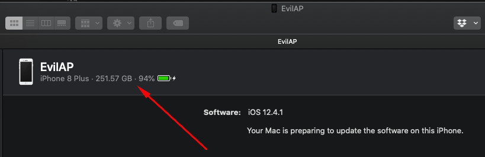

# iOS Basic Security Testing

In the previous chapter, we provided an overview of the iOS platform and described the structure of its apps. In this chapter, we'll talk about setting up a security testing environment and introduce basic processes and techniques you can use to test iOS apps for security flaws. These basic processes are the foundation for the test cases outlined in the following chapters.

## iOS Testing Setup

Although you can use a Linux or Windows host computer for testing, you'll find that many tasks are difficult or impossible on these platforms. In addition, the Xcode development environment and the iOS SDK are only available for macOS. This means that you'll definitely want to work on macOS for source code analysis and debugging (it also makes black box testing easier).

### Host Device

The following is the most basic iOS app testing setup:

- Ideally macOS host computer with admin rights.
  - [Xcode](0x08-Testing-Tools.md#xcode) and [Xcode Command Line Tools](0x08-Testing-Tools.md#xcode-command-line-tools).
  - An interception proxy tool such as [Burp Suite](0x08-Testing-Tools.md#burp-suite).
  - [Frida via python-pip](0x08-Testing-Tools.md#frida)
- At least one jailbroken iOS device (with the target iOS version installed).
  - [Frida for iOS](0x08-Testing-Tools.md#frida-for-ios)
- A Wi-Fi network that permits client-to-client traffic.

### Testing Device

#### Testing on a Real Device

We recommend having a jailbroken iPhone or iPad for testing. These devices allow root access and tool installation, making the security testing process more straightforward. See the next section ["Getting Privileged Access"](#getting-privileged-access) for more information.

If you don't have access to a jailbroken device, you can apply the workarounds described later in this chapter, but be prepared for a more difficult experience.

#### Testing on the iOS Simulator

Unlike the Android emulator, which fully emulates the hardware of an actual Android device, the iOS SDK simulator offers a higher-level *simulation* of an iOS device. Most importantly, emulator binaries are compiled to x86 code instead of ARM code. Apps compiled for a real device don't run, making the simulator useless for black box analysis and reverse engineering.

#### Testing on an Emulator

Corellium is the only publicly available iOS emulator. It is an enterprise SaaS solution with a per user license model and does not offer any trial license.

#### Getting Privileged Access

iOS jailbreaking is often compared to Android rooting, but the process is actually quite different. To explain the difference, we'll first review the concepts of "rooting" and "flashing" on Android.

- **Rooting**: This typically involves installing the `su` binary on the system or replacing the whole system with a rooted custom ROM. Exploits aren't required to obtain root access as long as the bootloader is accessible.
- **Flashing custom ROMs**: This allows you to replace the OS that's running on the device after you unlock the bootloader. The bootloader may require an exploit to unlock it.

On iOS devices, flashing a custom ROM is impossible because the iOS bootloader only allows Apple-signed images to be booted and flashed. This is why even official iOS images can't be installed if they aren't signed by Apple, and it makes iOS downgrades only possible for as long as the previous iOS version is still signed.

The purpose of jailbreaking is to disable iOS protections (Apple's code signing mechanisms in particular) so that arbitrary unsigned code can run on the device (e.g. custom code or downloaded from alternative app stores such as [Cydia](0x08-Testing-Tools.md#cydia) or [Sileo](0x08-Testing-Tools.md#sileo)). The word "jailbreak" is a colloquial reference to all-in-one tools that automate the disabling process.

Developing a jailbreak for a given version of iOS is not easy. As a security tester, you'll most likely want to use publicly available jailbreak tools. Still, we recommend studying the techniques that have been used to jailbreak various versions of iOS-you'll encounter many interesting exploits and learn a lot about OS internals. For example, Pangu9 for iOS 9.x [exploited at least five vulnerabilities](https://www.theiphonewiki.com/wiki/Jailbreak_Exploits "Jailbreak Exploits"), including a use-after-free kernel bug (CVE-2015-6794) and an arbitrary file system access vulnerability in the Photos app (CVE-2015-7037).

##### Benefits of Jailbreaking

End users often jailbreak their devices to tweak the iOS system's appearance, add new features, and install third-party apps from unofficial app stores. For a security tester, however, jailbreaking an iOS device has even more benefits. They include, but aren't limited to, the following:

- Root access to the file system.
- Possibility of executing applications that haven't been signed by Apple (which includes many security tools).
- Unrestricted debugging and dynamic analysis.
- Access to the Objective-C or Swift runtime.

##### Jailbreak Types

There are *tethered*, *semi-tethered*, *semi-untethered*, and *untethered* jailbreaks.

- Tethered jailbreaks don't persist through reboots, so re-applying jailbreaks requires the device to be connected (tethered) to a computer during every reboot. The device may not reboot at all if the computer is not connected.

- Semi-tethered jailbreaks can't be re-applied unless the device is connected to a computer during reboot. The device can also boot into non-jailbroken mode on its own.

- Semi-untethered jailbreaks allow the device to boot on its own, but the kernel patches (or user-land modifications) for disabling code signing aren't applied automatically. The user must re-jailbreak the device by starting an app or visiting a website (not requiring a connection to a computer, hence the term untethered).

- Untethered jailbreaks are the most popular choice for end users because they need to be applied only once, after which the device will be permanently jailbroken. They are usually rare and benefit from vulnerabilities allowing an exploit to write persistent code on the device. Examples include [limera1n](https://www.theiphonewiki.com/wiki/Limera1n), [Pangu9](https://www.theiphonewiki.com/wiki/Pangu9) and [Fugu14](https://github.com/LinusHenze/Fugu14).

##### Jailbreak Device Strategy

Jailbreaking an iOS device has become more and more challenging and a very time-sensitive procedure, which is understandable since Apple keeps hardening the system, patching the exploited vulnerabilities and quickly releasing upgrades.

iOS upgrades are based on a challenge-response process (generating the so-called SHSH blobs as a result). The device will allow the OS installation only if the response to the challenge is signed by Apple. This is what researchers call a "signing window", and it is the reason you can't simply store the OTA firmware package you downloaded and load it onto the device whenever you want to. During minor iOS upgrades, two versions may both be signed by Apple (the latest one, and the previous iOS version). This is the only situation in which you can downgrade the iOS device. You can check the current signing window and download OTA firmware from the [IPSW Downloads website](https://ipsw.me "IPSW Downloads").

**Recommendation:** if you have a jailbroken device that you use for security testing, keep it as-is unless you're 100% sure that you can re-jailbreak it after upgrading to the latest iOS version.

Also consider getting one or more spare devices (which you will be updating with every major iOS release) and wait for new jailbreak software to be released publicly (see next section). Apple is usually quick to release a patch once a jailbreak has been released publicly, so you have only a couple of days to downgrade to the affected iOS version and apply the jailbreak.

##### Jailbreak Software

The iOS jailbreak scene evolves so rapidly that providing up-to-date instructions is very challenging. At the time of this writing we can recommend using the very complete ["Jailbreak Chart by the r/jailbreak Reddit community"](https://docs.google.com/spreadsheets/u/0/d/11DABHIIqwYQKj1L83AK9ywk_hYMjEkcaxpIg6phbTf0/htmlview#).

Other sources that have been, and might still be, reliable include:

- [r/jailbreak Reddit Community Page](https://www.reddit.com/r/jailbreak/ "Reddit Jailbreak")
- [Can I Jailbreak?](https://canijailbreak.com/ "Can I Jailbreak?")
- [Redmond Pie](https://www.redmondpie.com/ "Redmone Pie")

> **IMPORTANT NOTE**:
> Beware of fake tools and spyware, which are often hiding behind domain names that are similar to the name of the jailbreaking group/author.
>
> Note that any modification you make to your device is at your own risk. While jailbreaking is typically safe, things can go wrong and you may end up bricking your device. No other party except yourself can be held accountable for any damage.

##### Testing Jailbreak Detection

Some apps attempt to detect whether the iOS device on which they're running is jailbroken. This is because jailbreaking deactivates some of iOS' default security mechanisms. However, there are several ways to get around these detections, and we'll introduce them in the chapter ["iOS Anti-Reversing Defenses"](0x06j-Testing-Resiliency-Against-Reverse-Engineering.md).

#### Getting the UDID of an iOS device

The UDID is a 40-digit unique sequence of letters and numbers to identify an iOS device. You can find the UDID of your iOS device on macOS Catalina onwards in the Finder app, as iTunes is not available anymore in Catalina. Select the connected iOS device in Finder and click on the information under the name of the iOS device to iterate through it. Besides the UDID, you can find the serial number, IMEI and other useful information.

 \

If you are using a macOS version before Catalina, you can find the [UDID of your iOS device via iTunes](http://www.iclarified.com/52179/how-to-find-your-iphones-udid "How to Find Your iPhone\'s UDID"), by selecting your device and clicking on "Serial Number" in the summary tab. When clicking on this you will iterate through different metadata of the iOS device including its UDID.

It is also possible to get the UDID via various command line tools on macOS while the device is attached via USB:

- By using the [I/O Registry Explorer](https://developer.apple.com/library/archive/documentation/DeviceDrivers/Conceptual/IOKitFundamentals/TheRegistry/TheRegistry.html "I/O Registry Explorer") tool `ioreg`:

    ```sh
    $ ioreg -p IOUSB -l | grep "USB Serial"
    |         "USB Serial Number" = "9e8ada44246cee813e2f8c1407520bf2f84849ec"
    ```

- By using [ideviceinstaller](https://github.com/libimobiledevice/ideviceinstaller) (also available on Linux):

    ```sh
    $ brew install ideviceinstaller
    $ idevice_id -l
    316f01bd160932d2bf2f95f1f142bc29b1c62dbc
    ```

- By using the system_profiler:

    ```sh
    $ system_profiler SPUSBDataType | sed -n -e '/iPad/,/Serial/p;/iPhone/,/Serial/p;/iPod/,/Serial/p' | grep "Serial Number:"
    2019-09-08 10:18:03.920 system_profiler[13251:1050356] SPUSBDevice: IOCreatePlugInInterfaceForService failed 0xe00002be
                Serial Number: 64655621de6ef5e56a874d63f1e1bdd14f7103b1
    ```

- By using instruments:

    ```sh
    $ instruments -s devices
    ```

## Basic Testing Operations

### Accessing the Device Shell

One of the most common things you do when testing an app is accessing the device shell. In this section we'll see how to access the iOS shell both remotely from your host computer with/without a USB cable and locally from the device itself.

#### Remote Shell

In contrast to Android where you can easily access the device shell using the adb tool, on iOS you only have the option to access the remote shell via SSH. This also means that your iOS device must be jailbroken in order to connect to its shell from your host computer. For this section we assume that you've properly jailbroken your device and have either [Cydia](0x08-Testing-Tools.md#cydia) (see screenshot below) or [Sileo](0x08-Testing-Tools.md#sileo) installed. In the rest of the guide we will reference to Cydia, but the same packages should be available in Sileo.

 \

In order to enable SSH access to your iOS device you can install the OpenSSH package. Once installed, be sure to connect both devices to the same Wi-Fi network and take a note of the device IP address, which you can find in the **Settings -> Wi-Fi** menu and tapping once on the info icon of the network you're connected to.

You can now access the remote device's shell by running `ssh root@<device_ip_address>`, which will log you in as the root user:

```bash
$ ssh root@192.168.197.234
root@192.168.197.234's password:
iPhone:~ root#
```

Press Control + D or type `exit` to quit.

When accessing your iOS device via SSH consider the following:

- The default users are `root` and `mobile`.
- The default password for both is `alpine`.

> Remember to change the default password for both users `root` and `mobile` as anyone on the same network can find the IP address of your device and connect via the well-known default password, which will give them root access to your device.

If you forget your password and want to reset it to the default `alpine`:

1. Edit the file `/private/etc/master.password` on your jailbroken iOS device (using an on-device shell as shown below)
2. Find the lines:

   ```bash
    root:xxxxxxxxx:0:0::0:0:System Administrator:/var/root:/bin/sh
    mobile:xxxxxxxxx:501:501::0:0:Mobile User:/var/mobile:/bin/sh
   ```

3. Change `xxxxxxxxx` to `/smx7MYTQIi2M` (which is the hashed password `alpine`)
4. Save and exit

##### Connect to a Device via SSH over USB

During a real black box test, a reliable Wi-Fi connection may not be available. In this situation, you can use [usbmuxd](0x08-Testing-Tools.md#usbmuxd) to connect to your device's SSH server via USB.

Connect macOS to an iOS device by installing and starting [iproxy](0x08-Testing-Tools.md#iproxy):

```bash
$ brew install libimobiledevice
$ iproxy 2222 22
waiting for connection
```

The above command maps port `22` on the iOS device to port `2222` on localhost. You can also [make iproxy run automatically in the background](https://iphonedevwiki.net/index.php/SSH_Over_USB "Making iproxy run automatically in the background on OS X") if you don't want to run the binary every time you want to SSH over USB.

With the following command in a new terminal window, you can connect to the device:

```bash
$ ssh -p 2222 root@localhost
root@localhost's password:
iPhone:~ root#
```

> Small note on USB of an iDevice: on an iOS device you cannot make data connections anymore after 1 hour of being in a locked state, unless you unlock it again due to the USB Restricted Mode, which was introduced with iOS 11.4.1

#### On-device Shell App

While usually using an on-device shell (terminal emulator) might be very tedious compared to a remote shell, it can prove handy for debugging in case of, for example, network issues or check some configuration. For example, you can install [NewTerm 2](https://repo.chariz.io/package/ws.hbang.newterm2/ "NewTerm 2") via Cydia for this purpose (it supports iOS 6.0 to 12.1.2 at the time of this writing).

In addition, there are a few jailbreaks that explicitly disable incoming SSH *for security reasons*. In those cases, it is very convenient to have an on-device shell app, which you can use to first SSH out of the device with a reverse shell, and then connect from your host computer to it.

Opening a reverse shell over SSH can be done by running the command `ssh -R <remote_port>:localhost:22 <username>@<host_computer_ip>`.

On the on-device shell app run the following command and, when asked, enter the password of the `mstg` user of the host computer:

```bash
ssh -R 2222:localhost:22 mstg@192.168.197.235
```

On your host computer run the following command and, when asked, enter the password of the `root` user of the iOS device:

```bash
$ ssh -p 2222 root@localhost
```

### Host-Device Data Transfer

There might be various scenarios where you might need to transfer data from the iOS device or app data sandbox to your host computer or vice versa. The following section will show you different ways on how to achieve that.

#### Copying App Data Files via SSH and SCP

As we know now, files from our app are stored in the Data directory. You can now simply archive the Data directory with `tar` and pull it from the device with `scp`:

```bash
iPhone:~ root# tar czvf /tmp/data.tgz /private/var/mobile/Containers/Data/Application/8C8E7EB0-BC9B-435B-8EF8-8F5560EB0693
iPhone:~ root# exit
$ scp -P 2222 root@localhost:/tmp/data.tgz .
```

#### Passionfruit

After starting [Passionfruit](0x08-Testing-Tools.md#passionfruit) you can select the app that is in scope for testing. There are various functions available, of which one is called "Files". When selecting it, you will get a listing of the directories of the app sandbox.

 \

When navigating through the directories and selecting a file, a pop-up will show up and display the data either as hexadecimal or text. When closing this pop-up you have various options available for the file, including:

- Text viewer
- SQLite viewer
- Image viewer
- Plist viewer
- Download

 \

#### Objection

When you are starting objection you will find the prompt within the Bundle directory.

```bash
org.owasp.MSTG on (iPhone: 10.3.3) [usb] # pwd print
Current directory: /var/containers/Bundle/Application/DABF849D-493E-464C-B66B-B8B6C53A4E76/org.owasp.MSTG.app
```

Use the `env` command to get the directories of the app and navigate to the Documents directory.

```bash
org.owasp.MSTG on (iPhone: 10.3.3) [usb] # cd /var/mobile/Containers/Data/Application/72C7AAFB-1D75-4FBA-9D83-D8B4A2D44133/Documents
/var/mobile/Containers/Data/Application/72C7AAFB-1D75-4FBA-9D83-D8B4A2D44133/Documents
```

With the command `file download <filename>` you can download a file from the iOS device to your host computer and can analyze it afterwards.

```bash
org.owasp.MSTG on (iPhone: 10.3.3) [usb] # file download .com.apple.mobile_container_manager.metadata.plist
Downloading /var/mobile/Containers/Data/Application/72C7AAFB-1D75-4FBA-9D83-D8B4A2D44133/.com.apple.mobile_container_manager.metadata.plist to .com.apple.mobile_container_manager.metadata.plist
Streaming file from device...
Writing bytes to destination...
Successfully downloaded /var/mobile/Containers/Data/Application/72C7AAFB-1D75-4FBA-9D83-D8B4A2D44133/.com.apple.mobile_container_manager.metadata.plist to .com.apple.mobile_container_manager.metadata.plist
```

You can also upload files to the iOS device with `file upload <local_file_path>`.

### Obtaining and Extracting Apps

#### Getting the IPA File from an OTA Distribution Link

During development, apps are sometimes provided to testers via over-the-air (OTA) distribution. In that situation, you'll receive an itms-services link, such as the following:

```default
itms-services://?action=download-manifest&url=https://s3-ap-southeast-1.amazonaws.com/test-uat/manifest.plist
```

You can use the [ITMS services asset downloader](https://www.npmjs.com/package/itms-services "ITMS services asset downloader") tool to download the IPA from an OTA distribution URL. Install it via npm:

```bash
$ npm install -g itms-services
```

Save the IPA file locally with the following command:

```bash
# itms-services -u "itms-services://?action=download-manifest&url=https://s3-ap-southeast-1.amazonaws.com/test-uat/manifest.plist" -o - > out.ipa
```

#### Acquiring the App Binary

1. From an IPA:

   If you have the IPA (probably including an already decrypted app binary), unzip it and you are ready to go. The app binary is located in the main bundle directory (.app), e.g. `Payload/Telegram X.app/Telegram X`. See the following subsection for details on the extraction of the property lists.

    > On macOS's Finder, .app directories are opened by right-clicking them and selecting "Show Package Content". On the terminal you can just `cd` into them.

2. From a Jailbroken device:

    If you don't have the original IPA, then you need a jailbroken device where you will install the app (e.g. via App Store). Once installed, you need to extract the app binary from memory and rebuild the IPA file. Because of DRM, the app binary file is encrypted when it is stored on the iOS device, so simply pulling it from the Bundle (either through SSH or Objection) will not be sufficient to reverse engineer it.

The following shows the output of running [class-dump](0x08-Testing-Tools.md#class-dump) on the Telegram app, which was directly pulled from the installation directory of the iPhone:

```bash
$ class-dump Telegram
//
//     Generated by class-dump 3.5 (64 bit) (Debug version compiled Jun  9 2015 22:53:21).
//
//     class-dump is Copyright (C) 1997-1998, 2000-2001, 2004-2014 by Steve Nygard.
//

#pragma mark -

//
// File: Telegram
// UUID: EAF90234-1538-38CF-85B2-91A84068E904
//
//                           Arch: arm64
//                 Source version: 0.0.0.0.0
//            Minimum iOS version: 8.0.0
//                    SDK version: 12.1.0
//
// Objective-C Garbage Collection: Unsupported
//
//                       Run path: @executable_path/Frameworks
//                               = /Frameworks
//         This file is encrypted:
//                                   cryptid: 0x00000001
//                                  cryptoff: 0x00004000
//                                 cryptsize: 0x000fc000
//
```

In order to retrieve the unencrypted version, you can use tools such as [frida-ios-dump](https://github.com/AloneMonkey/frida-ios-dump "frida-ios-dump") (all iOS versions) or [Clutch](0x08-Testing-Tools.md#clutch) (only up to iOS 11; for iOS 12 and above, it requires a patch). Both will extract the unencrypted version from memory while the application is running on the device. The stability of both Clutch and frida-ios-dump can vary depending on your iOS version and Jailbreak method, so it's useful to have multiple ways of extracting the binary.

##### Using Clutch

Build [Clutch](0x08-Testing-Tools.md#clutch) as explained on the Clutch GitHub page and push it to the iOS device through `scp`. Run Clutch with the `-i` flag to list all installed applications:

```bash
root# ./Clutch -i
2019-06-04 20:16:57.807 Clutch[2449:440427] command: Prints installed applications
Installed apps:
...
5:   Telegram Messenger <ph.telegra.Telegraph>
...
```

Once you have the bundle identifier, you can use Clutch to create the IPA:

```bash
root# ./Clutch -d ph.telegra.Telegraph
2019-06-04 20:19:28.460 Clutch[2450:440574] command: Dump specified bundleID into .ipa file
ph.telegra.Telegraph contains watchOS 2 compatible application. It's not possible to dump watchOS 2 apps with Clutch (null) at this moment.
Zipping Telegram.app
2019-06-04 20:19:29.825 clutch[2465:440618] command: Only dump binary files from specified bundleID
...
Successfully dumped framework TelegramUI!
Zipping WebP.framework
Zipping NotificationContent.appex
Zipping NotificationService.appex
Zipping Share.appex
Zipping SiriIntents.appex
Zipping Widget.appex
DONE: /private/var/mobile/Documents/Dumped/ph.telegra.Telegraph-iOS9.0-(Clutch-(null)).ipa
Finished dumping ph.telegra.Telegraph in 20.5 seconds
```

After copying the IPA file over to the host system and unzipping it, you can see that the Telegram app binary can now be parsed by [class-dump](0x08-Testing-Tools.md#class-dump), indicating that it is no longer encrypted:

```bash
$ class-dump Telegram
...
//
//     Generated by class-dump 3.5 (64 bit) (Debug version compiled Jun  9 2015 22:53:21).
//
//     class-dump is Copyright (C) 1997-1998, 2000-2001, 2004-2014 by Steve Nygard.
//

#pragma mark Blocks

typedef void (^CDUnknownBlockType)(void); // return type and parameters are unknown

#pragma mark Named Structures

struct CGPoint {
    double _field1;
    double _field2;
};
...
```

Note: when you use [Clutch](0x08-Testing-Tools.md#clutch) on iOS 12, please check [Clutch Github issue 228](https://github.com/KJCracks/Clutch/issues/228 "Getting Clutch to run on iOS 12")

##### Using Frida-ios-dump

First, make sure that the configuration in [Frida-ios-dump](0x08-Testing-Tools.md#frida-ios-dump) `dump.py` is set to either localhost with port 2222 when using [iproxy](0x08-Testing-Tools.md#iproxy), or to the actual IP address and port of the device from which you want to dump the binary. Next, change the default username (`User = 'root'`) and password (`Password = 'alpine'`) in `dump.py` to the ones you use.

Now you can safely use the tool to enumerate the apps installed:

```bash
$ python dump.py -l
 PID  Name             Identifier
----  ---------------  -------------------------------------
 860  Cydia            com.saurik.Cydia
1130  Settings         com.apple.Preferences
 685  Mail             com.apple.mobilemail
 834  Telegram         ph.telegra.Telegraph
   -  Stocks           com.apple.stocks
   ...
```

and you can dump one of the listed binaries:

```bash
$ python dump.py ph.telegra.Telegraph

Start the target app ph.telegra.Telegraph
Dumping Telegram to /var/folders/qw/gz47_8_n6xx1c_lwq7pq5k040000gn/T
[frida-ios-dump]: HockeySDK.framework has been loaded.
[frida-ios-dump]: Load Postbox.framework success.
[frida-ios-dump]: libswiftContacts.dylib has been dlopen.
...
start dump /private/var/containers/Bundle/Application/14002D30-B113-4FDF-BD25-1BF740383149/Telegram.app/Frameworks/libswiftsimd.dylib
libswiftsimd.dylib.fid: 100%|██████████| 343k/343k [00:00<00:00, 1.54MB/s]
start dump /private/var/containers/Bundle/Application/14002D30-B113-4FDF-BD25-1BF740383149/Telegram.app/Frameworks/libswiftCoreData.dylib
libswiftCoreData.dylib.fid: 100%|██████████| 82.5k/82.5k [00:00<00:00, 477kB/s]
5.m4a: 80.9MB [00:14, 5.85MB/s]
0.00B [00:00, ?B/s]Generating "Telegram.ipa"
```

After this, the `Telegram.ipa` file will be created in your current directory. You can validate the success of the dump by removing the app and reinstalling it (e.g. using [ios-deploy](0x08-Testing-Tools.md#ios-deploy) `ios-deploy -b Telegram.ipa`). Note that this will only work on jailbroken devices, as otherwise the signature won't be valid.

### Installing Apps

When you install an application without using Apple's App Store, this is called sideloading. There are various ways of sideloading which are described below. On the iOS device, the actual installation process is then handled by the installd daemon, which will unpack and install the application. To integrate app services or be installed on an iOS device, all applications must be signed with a certificate issued by Apple. This means that the application can be installed only after successful code signature verification. On a jailbroken phone, however, you can circumvent this security feature with [AppSync](http://repo.hackyouriphone.org/appsyncunified "AppSync"), a package available in the Cydia store. It contains numerous useful applications that leverage jailbreak-provided root privileges to execute advanced functionality. AppSync is a tweak that patches installd, allowing the installation of fake-signed IPA packages.

Different methods exist for installing an IPA package onto an iOS device, which are described in detail below.

> Please note that iTunes is no longer available in macOS Catalina. If you are using an older version of macOS, iTunes is still available but since iTunes 12.7 it is not possible to install apps.

#### Cydia Impactor

[Cydia Impactor](http://www.cydiaimpactor.com/ "Cydia Impactor") was originally created to jailbreak iPhones, but has been rewritten to sign and install IPA packages to iOS devices via sideloading (and even APK files to Android devices). Cydia Impactor is available for Windows, macOS and Linux. A [step by step guide and troubleshooting steps are available on yalujailbreak.net](https://yalujailbreak.net/how-to-use-cydia-impactor/ "How to use Cydia Impactor").

#### libimobiledevice

On Linux and also macOS, you can alternatively use [libimobiledevice](https://www.libimobiledevice.org/ "libimobiledevice"), a cross-platform software protocol library and a set of tools for native communication with iOS devices. This allows you to install apps over a USB connection by executing ideviceinstaller. The connection is implemented with the USB multiplexing daemon [usbmuxd](https://www.theiphonewiki.com/wiki/Usbmux "Usbmux"), which provides a TCP tunnel over USB.

The package for libimobiledevice will be available in your Linux package manager. On macOS you can install libimobiledevice via brew:

```bash
$ brew install libimobiledevice
$ brew install ideviceinstaller
```

After the installation you have several new command line tools available, such as `ideviceinfo`, `ideviceinstaller` or `idevicedebug`.

```bash
# The following command will show detailed information about the iOS device connected via USB.
$ ideviceinfo
# The following command will install the IPA to your iOS device.
$ ideviceinstaller -i iGoat-Swift_v1.0-frida-codesigned.ipa
...
Install: Complete
# The following command will start the app in debug mode, by providing the bundle name. The bundle name can be found in the previous command after "Installing".
$ idevicedebug -d run OWASP.iGoat-Swift
```

#### ipainstaller

The IPA can also be directly installed on the iOS device via the command line with [ipainstaller](https://github.com/autopear/ipainstaller "IPA Installer"). After copying the file over to the device, for example via scp, you can execute ipainstaller with the IPA's filename:

```bash
$ ipainstaller App_name.ipa
```

#### ios-deploy

On macOS you can also use the [ios-deploy](0x08-Testing-Tools.md#ios-deploy) tool to install iOS apps from the command line. You'll need to unzip your IPA since ios-deploy uses the app bundles to install apps.

```bash
$ unzip Name.ipa
$ ios-deploy --bundle 'Payload/Name.app' -W -d -v
```

After the app is installed on the iOS device, you can simply start it by adding the `-m` flag which will directly start debugging without installing the app again.

```bash
$ ios-deploy --bundle 'Payload/Name.app' -W -d -v -m
```

#### Xcode

It is also possible to use the Xcode IDE to install iOS apps by doing the following steps:

1. Start Xcode
2. Select **Window/Devices and Simulators**
3. Select the connected iOS device and click on the **+** sign in **Installed Apps**.

#### Allow Application Installation on a Non-iPad Device

Sometimes an application can require to be used on an iPad device. If you only have iPhone or iPod touch devices then you can force the application to accept to be installed and used on these kinds of devices. You can do this by changing the value of the property **UIDeviceFamily** to the value **1** in the **Info.plist** file.

```xml
<?xml version="1.0" encoding="UTF-8"?>
<!DOCTYPE plist PUBLIC "-//Apple//DTD PLIST 1.0//EN" "http://www.apple.com/DTDs/PropertyList-1.0.dtd">
<plist version="1.0">
<dict>

  <key>UIDeviceFamily</key>
  <array>
    <integer>1</integer>
  </array>

</dict>
</plist>  
```

It is important to note that changing this value will break the original signature of the IPA file so you need to re-sign the IPA, after the update, in order to install it on a device on which the signature validation has not been disabled.

This bypass might not work if the application requires capabilities that are specific to modern iPads while your iPhone or iPod is a bit older.

Possible values for the property [UIDeviceFamily](https://developer.apple.com/library/archive/documentation/General/Reference/InfoPlistKeyReference/Articles/iPhoneOSKeys.html#//apple_ref/doc/uid/TP40009252-SW11 "UIDeviceFamily property") can be found in the Apple Developer documentation.

### Information Gathering

One fundamental step when analyzing apps is information gathering. This can be done by inspecting the app package on your host computer or remotely by accessing the app data on the device. You'll find more advance techniques in the subsequent chapters but, for now, we will focus on the basics: getting a list of all installed apps, exploring the app package and accessing the app data directories on the device itself. This should give you a bit of context about what the app is all about without even having to reverse engineer it or perform more advanced analysis. We will be answering questions such as:

- Which files are included in the package?
- Which Frameworks does the app use?
- Which capabilities does the app require?
- Which permissions does the app request to the user and for what reason?
- Does the app allow any unsecured connections?
- Does the app create any new files when being installed?

#### Listing Installed Apps

When targeting apps that are installed on the device, you'll first have to figure out the correct bundle identifier of the application you want to analyze. You can use `frida-ps -Uai` to get all apps (`-a`) currently installed (`-i`) on the connected USB device (`-U`):

```bash
$ frida-ps -Uai
 PID  Name                 Identifier
----  -------------------  -----------------------------------------
6847  Calendar             com.apple.mobilecal
6815  Mail                 com.apple.mobilemail
   -  App Store            com.apple.AppStore
   -  Apple Store          com.apple.store.Jolly
   -  Calculator           com.apple.calculator
   -  Camera               com.apple.camera
   -  iGoat-Swift          OWASP.iGoat-Swift
```

It also shows which of them are currently running. Take a note of the "Identifier" (bundle identifier) and the PID if any as you'll need them afterwards.

You can also directly open passionfruit and after selecting your iOS device you'll get the list of installed apps.

 \

#### Exploring the App Package

Once you have collected the package name of the application you want to target, you'll want to start gathering information about it. First, retrieve the IPA as explained in [Basic Testing Operations - Obtaining and Extracting Apps](#obtaining-and-extracting-apps "Obtaining and Extracting Apps").

You can unzip the IPA using the standard `unzip` or any other ZIP utility. Inside you'll find a `Payload` folder containing the so-called Application Bundle (.app). The following is an example in the following output, note that it was truncated for better readability and overview:

```bash
$ ls -1 Payload/iGoat-Swift.app
rutger.html
mansi.html
splash.html
about.html

LICENSE.txt
Sentinel.txt
README.txt

URLSchemeAttackExerciseVC.nib
CutAndPasteExerciseVC.nib
RandomKeyGenerationExerciseVC.nib
KeychainExerciseVC.nib
CoreData.momd
archived-expanded-entitlements.xcent
SVProgressHUD.bundle

Base.lproj
Assets.car
PkgInfo
_CodeSignature
AppIcon60x60@3x.png

Frameworks

embedded.mobileprovision

Credentials.plist
Assets.plist
Info.plist

iGoat-Swift
```

The most relevant items are:

- `Info.plist` contains configuration information for the application, such as its bundle ID, version number, and display name.
- `_CodeSignature/` contains a plist file with a signature over all files in the bundle.
- `Frameworks/` contains the app native libraries as .dylib or .framework files.
- `PlugIns/` may contain app extensions as .appex files (not present in the example).
- `iGoat-Swift` is the app binary containing the app’s code. Its name is the same as the bundle's name minus the .app extension.
- Various resources such as images/icons, `*.nib` files (storing the user interfaces of iOS app), localized content (`<language>.lproj`), text files, audio files, etc.

##### The Info.plist File

The information property list or `Info.plist` (named by convention) is the main source of information for an iOS app. It consists of a structured file containing key-value pairs describing essential configuration information about the app. Actually, all bundled executables (app extensions, frameworks and apps) are expected to have an `Info.plist` file. You can find all possible keys in the [Apple Developer Documentation](https://developer.apple.com/documentation/bundleresources/information_property_list?language=objc "Information Property List").

The file might be formatted in XML or binary (bplist). You can convert it to XML format with one simple command:

- On macOS with `plutil`, which is a tool that comes natively with macOS 10.2 and above versions (no official online documentation is currently available):

  ```bash
  $ plutil -convert xml1 Info.plist
  ```

- On Linux:

  ```bash
  $ apt install libplist-utils
  $ plistutil -i Info.plist -o Info_xml.plist
  ```

Here's a non-exhaustive list of some info and the corresponding keywords that you can easily search for in the `Info.plist` file by just inspecting the file or by using `grep -i <keyword> Info.plist`:

- App permissions Purpose Strings: `UsageDescription` (see "[iOS Platform APIs](0x06h-Testing-Platform-Interaction.md)")
- Custom URL schemes: `CFBundleURLTypes` (see "[iOS Platform APIs](0x06h-Testing-Platform-Interaction.md)")
- Exported/imported *custom document types*: `UTExportedTypeDeclarations` / `UTImportedTypeDeclarations` (see "[iOS Platform APIs](0x06h-Testing-Platform-Interaction.md)")
- App Transport Security (ATS) configuration: `NSAppTransportSecurity` (see "[iOS Network Communication](0x06g-Testing-Network-Communication.md)")

Please refer to the mentioned chapters to learn more about how to test each of these points.

##### App Binary

iOS app binaries are fat binaries (they can be deployed on all devices 32- and 64-bit). In contrast to Android, where you can actually decompile the app binary to Java code, the iOS app binaries can only be disassembled.

Refer to the chapter [Tampering and Reverse Engineering on iOS](0x06c-Reverse-Engineering-and-Tampering.md) for more details.

##### Native Libraries

iOS native libraries are known as Frameworks.

You can easily visualize them from Passionfruit by clicking on "Modules":

 \

And get a more detailed view including their imports/exports:

 \

They are available in the `Frameworks` folder in the IPA, you can also inspect them from the terminal:

```bash
$ ls -1 Frameworks/
Realm.framework
libswiftCore.dylib
libswiftCoreData.dylib
libswiftCoreFoundation.dylib
```

or from the device with objection (as well as per SSH of course):

```bash
OWASP.iGoat-Swift on (iPhone: 11.1.2) [usb] # ls
NSFileType      Perms  NSFileProtection    ...  Name
------------  -------  ------------------  ...  ----------------------------
Directory         493  None                ...  Realm.framework
Regular           420  None                ...  libswiftCore.dylib
Regular           420  None                ...  libswiftCoreData.dylib
Regular           420  None                ...  libswiftCoreFoundation.dylib
...
```

Please note that this might not be the complete list of native code elements being used by the app as some can be part of the source code, meaning that they'll be compiled in the app binary and therefore cannot be found as standalone libraries or Frameworks in the `Frameworks` folder.

For now this is all information you can get about the Frameworks unless you start reverse engineering them. Refer to the chapter [Tampering and Reverse Engineering on iOS](0x06c-Reverse-Engineering-and-Tampering.md) for more information about how to reverse engineer Frameworks.

##### Other App Resources

It is normally worth taking a look at the rest of the resources and files that you may find in the Application Bundle (.app) inside the IPA as some times they contain additional goodies like encrypted databases, certificates, etc.

 \

#### Accessing App Data Directories

Once you have installed the app, there is further information to explore. Let's go through a short overview of the app folder structure on iOS apps to understand which data is stored where. The following illustration represents the application folder structure:

 \

On iOS, system applications can be found in the `/Applications` directory while user-installed apps are available under `/private/var/containers/`. However, finding the right folder just by navigating the file system is not a trivial task as every app gets a random 128-bit UUID (Universal Unique Identifier) assigned for its directory names.

In order to easily obtain the installation directory information for user-installed apps you can follow the following methods:

Connect to the terminal on the device and run the command `ipainstaller` ([IPA Installer Console](https://cydia.saurik.com/package/com.autopear.installipa "IPA Installer Console")) as follows:

```bash
iPhone:~ root# ipainstaller -l
...
OWASP.iGoat-Swift

iPhone:~ root# ipainstaller -i OWASP.iGoat-Swift
...
Bundle: /private/var/containers/Bundle/Application/3ADAF47D-A734-49FA-B274-FBCA66589E67
Application: /private/var/containers/Bundle/Application/3ADAF47D-A734-49FA-B274-FBCA66589E67/iGoat-Swift.app
Data: /private/var/mobile/Containers/Data/Application/8C8E7EB0-BC9B-435B-8EF8-8F5560EB0693
```

Using objection's command `env` will also show you all the directory information of the app. Connecting to the application with objection is described in the section "[Recommended Tools - Objection](#using-objection "Recommended Tools - Objection")".

```bash
OWASP.iGoat-Swift on (iPhone: 11.1.2) [usb] # env

Name               Path
-----------------  -------------------------------------------------------------------------------------------
BundlePath         /var/containers/Bundle/Application/3ADAF47D-A734-49FA-B274-FBCA66589E67/iGoat-Swift.app
CachesDirectory    /var/mobile/Containers/Data/Application/8C8E7EB0-BC9B-435B-8EF8-8F5560EB0693/Library/Caches
DocumentDirectory  /var/mobile/Containers/Data/Application/8C8E7EB0-BC9B-435B-8EF8-8F5560EB0693/Documents
LibraryDirectory   /var/mobile/Containers/Data/Application/8C8E7EB0-BC9B-435B-8EF8-8F5560EB0693/Library
```

As you can see, apps have two main locations:

- The Bundle directory (`/var/containers/Bundle/Application/3ADAF47D-A734-49FA-B274-FBCA66589E67/`).
- The Data directory (`/var/mobile/Containers/Data/Application/8C8E7EB0-BC9B-435B-8EF8-8F5560EB0693/`).

These folders contain information that must be examined closely during application security assessments (for example when analyzing the stored data for sensitive data).

Bundle directory:

- **AppName.app**
  - This is the Application Bundle as seen before in the IPA, it contains essential application data, static content as well as the application's compiled binary.
  - This directory is visible to users, but users can't write to it.
  - Content in this directory is not backed up.
  - The contents of this folder are used to validate the code signature.

Data directory:

- **Documents/**
  - Contains all the user-generated data. The application end user initiates the creation of this data.
  - Visible to users and users can write to it.
  - Content in this directory is backed up.
  - The app can disable paths by setting `NSURLIsExcludedFromBackupKey`.
- **Library/**
  - Contains all files that aren't user-specific, such as caches, preferences, cookies, and property list (plist) configuration files.
  - iOS apps usually use the `Application Support` and `Caches` subdirectories, but the app can create custom subdirectories.
- **Library/Caches/**
  - Contains semi-persistent cached files.
  - Invisible to users and users can't write to it.
  - Content in this directory is not backed up.
  - The OS may delete this directory's files automatically when the app is not running and storage space is running low.
- **Library/Application Support/**
  - Contains persistent files necessary for running the app.
  - Invisible to users and users can't write to it.
  - Content in this directory is backed up.
  - The app can disable paths by setting `NSURLIsExcludedFromBackupKey`.
- **Library/Preferences/**
  - Used for storing properties that can persist even after an application is restarted.
  - Information is saved, unencrypted, inside the application sandbox in a plist file called [BUNDLE_ID].plist.
  - All the key/value pairs stored using `NSUserDefaults` can be found in this file.
- **tmp/**
  - Use this directory to write temporary files that do not need to persist between app launches.
  - Contains non-persistent cached files.
  - Invisible to users.
  - Content in this directory is not backed up.
  - The OS may delete this directory's files automatically when the app is not running and storage space is running low.

Let's take a closer look at iGoat-Swift's Application Bundle (.app) directory inside the Bundle directory (`/var/containers/Bundle/Application/3ADAF47D-A734-49FA-B274-FBCA66589E67/iGoat-Swift.app`):

```bash
OWASP.iGoat-Swift on (iPhone: 11.1.2) [usb] # ls
NSFileType      Perms  NSFileProtection    ...  Name
------------  -------  ------------------  ...  --------------------------------------
Regular           420  None                ...  rutger.html
Regular           420  None                ...  mansi.html
Regular           420  None                ...  splash.html
Regular           420  None                ...  about.html

Regular           420  None                ...  LICENSE.txt
Regular           420  None                ...  Sentinel.txt
Regular           420  None                ...  README.txt

Directory         493  None                ...  URLSchemeAttackExerciseVC.nib
Directory         493  None                ...  CutAndPasteExerciseVC.nib
Directory         493  None                ...  RandomKeyGenerationExerciseVC.nib
Directory         493  None                ...  KeychainExerciseVC.nib
Directory         493  None                ...  CoreData.momd
Regular           420  None                ...  archived-expanded-entitlements.xcent
Directory         493  None                ...  SVProgressHUD.bundle

Directory         493  None                ...  Base.lproj
Regular           420  None                ...  Assets.car
Regular           420  None                ...  PkgInfo
Directory         493  None                ...  _CodeSignature
Regular           420  None                ...  AppIcon60x60@3x.png

Directory         493  None                ...  Frameworks

Regular           420  None                ...  embedded.mobileprovision

Regular           420  None                ...  Credentials.plist
Regular           420  None                ...  Assets.plist
Regular           420  None                ...  Info.plist

Regular           493  None                ...  iGoat-Swift
```

You can also visualize the Bundle directory from Passionfruit by clicking on **Files** -> **App Bundle**:

 \

Including the `Info.plist` file:

 \

As well as the Data directory in **Files** -> **Data**:

 \

Refer to the [Testing Data Storage](0x06d-Testing-Data-Storage.md "Data Storage on iOS") chapter for more information and best practices on securely storing sensitive data.

#### Monitoring System Logs

Many apps log informative (and potentially sensitive) messages to the console log. The log also contains crash reports and other useful information. You can collect console logs through the Xcode **Devices** window as follows:

1. Launch Xcode.
2. Connect your device to your host computer.
3. Choose **Window** -> **Devices and Simulators**.
4. Click on your connected iOS device in the left section of the Devices window.
5. Reproduce the problem.
6. Click on the **Open Console** button located in the upper right-hand area of the Devices window to view the console logs on a separate window.

 \

To save the console output to a text file, go to the top right side of the Console window and click on the **Save** button.

 \

You can also connect to the device shell as explained in [Accessing the Device Shell](0x06b-Basic-Security-Testing.md#accessing-the-device-shell), install socat via apt-get and run the following command:

```bash
iPhone:~ root# socat - UNIX-CONNECT:/var/run/lockdown/syslog.sock

========================
ASL is here to serve you
> watch
OK

Jun  7 13:42:14 iPhone chmod[9705] <Notice>: MS:Notice: Injecting: (null) [chmod] (1556.00)
Jun  7 13:42:14 iPhone readlink[9706] <Notice>: MS:Notice: Injecting: (null) [readlink] (1556.00)
Jun  7 13:42:14 iPhone rm[9707] <Notice>: MS:Notice: Injecting: (null) [rm] (1556.00)
Jun  7 13:42:14 iPhone touch[9708] <Notice>: MS:Notice: Injecting: (null) [touch] (1556.00)
...
```

Additionally, Passionfruit offers a view of all the NSLog-based application logs. Simply click on the **Console** -> **Output** tab:

 \

#### Dumping KeyChain Data

Dumping the KeyChain data can be done with multiple tools, but not all of them will work on any iOS version. As is more often the case, try the different tools or look up their documentation for information on the latest supported versions.

##### Objection (Jailbroken / non-Jailbroken)

The KeyChain data can easily be viewed using Objection. First, connect objection to the app as described in "Recommended Tools - Objection". Then, use the `ios keychain dump` command to get an overview of the keychain:

```bash
$ objection --gadget="iGoat-Swift" explore
... [usb] # ios keychain dump
...
Note: You may be asked to authenticate using the devices passcode or TouchID
Save the output by adding `--json keychain.json` to this command
Dumping the iOS keychain...
Created                    Accessible                      ACL    Type      Account              Service                     Data
-------------------------  ------------------------------  -----  --------  -------------------  --------------------------  ----------------------------------------------------------------------
2019-06-06 10:53:09 +0000  WhenUnlocked                    None   Password  keychainValue        com.highaltitudehacks.dvia  mypassword123
2019-06-06 10:53:30 +0000  WhenUnlockedThisDeviceOnly      None   Password  SCAPILazyVector      com.toyopagroup.picaboo     (failed to decode)
2019-06-06 10:53:30 +0000  AfterFirstUnlockThisDeviceOnly  None   Password  fideliusDeviceGraph  com.toyopagroup.picaboo     (failed to decode)
2019-06-06 10:53:30 +0000  AfterFirstUnlockThisDeviceOnly  None   Password  SCDeviceTokenKey2    com.toyopagroup.picaboo     00001:FKsDMgVISiavdm70v9Fhv5z+pZfBTTN7xkwSwNvVr2IhVBqLsC7QBhsEjKMxrEjh
2019-06-06 10:53:30 +0000  AfterFirstUnlockThisDeviceOnly  None   Password  SCDeviceTokenValue2  com.toyopagroup.picaboo     CJ8Y8K2oE3rhOFUhnxJxDS1Zp8Z25XzgY2EtFyMbW3U=
OWASP.iGoat-Swift on (iPhone: 12.0) [usb] # quit  
```

Note that currently, the latest versions of frida-server and objection do not correctly decode all keychain data. Different combinations can be tried to increase compatibility. For example, the previous printout was created with `frida-tools==1.3.0`, `frida==12.4.8` and `objection==1.5.0`.

Finally, since the keychain dumper is executed from within the application context, it will only print out keychain items that can be accessed by the application and **not** the entire keychain of the iOS device.

##### Passionfruit (Jailbroken / non-Jailbroken)

With [Passionfruit](0x08-Testing-Tools.md#passionfruit) it's possible to access the keychain data of the app you have selected. Click on **Storage** -> **Keychain** and you can see a listing of the stored Keychain information.

 \

##### Keychain-dumper (Jailbroken)

You can use [Keychain-dumper](0x08-Testing-Tools.md#keychain-dumper) dump the jailbroken device's KeyChain contents. Once you have it running on your device:

```bash
iPhone:~ root# /tmp/keychain_dumper

(...)

Generic Password
----------------
Service: myApp
Account: key3
Entitlement Group: RUD9L355Y.sg.vantagepoint.example
Label: (null)
Generic Field: (null)
Keychain Data: SmJSWxEs

Generic Password
----------------
Service: myApp
Account: key7
Entitlement Group: RUD9L355Y.sg.vantagepoint.example
Label: (null)
Generic Field: (null)
Keychain Data: WOg1DfuH
```

In newer versions of iOS (iOS 11 and up), additional steps are necessary. See the README.md for more details.
Note that this binary is signed with a self-signed certificate that has a "wildcard" entitlement. The entitlement grants access to *all* items in the Keychain. If you are paranoid or have very sensitive private data on your test device, you may want to build the tool from source and manually sign the appropriate entitlements into your build; instructions for doing this are available in the GitHub repository.

## Setting Up a Network Testing Environment

### Basic Network Monitoring/Sniffing

You can remotely sniff all traffic in real-time on iOS by [creating a Remote Virtual Interface](https://stackoverflow.com/questions/9555403/capturing-mobile-phone-traffic-on-wireshark/33175819#33175819 "Wireshark + OSX + iOS") for your iOS device. First make sure you have [Wireshark](0x08-Testing-Tools.md#wireshark) installed on your macOS host computer.

1. Connect your iOS device to your macOS host computer via USB.
2. You would need to know the UDID of your iOS device, before you can start sniffing. Check the section "Getting the UDID of an iOS device" on how to retrieve it. Open the Terminal on macOS and enter the following command, filling in the UDID of your iOS device.

```bash
$ rvictl -s <UDID>
Starting device <UDID> [SUCCEEDED] with interface rvi0
```

1. Launch Wireshark and select "rvi0" as the capture interface.
1. Filter the traffic with Capture Filters in Wireshark to display what you want to monitor (for example, all HTTP traffic sent/received via the IP address 192.168.1.1).

```default
ip.addr == 192.168.1.1 && http
```

 \

The documentation of Wireshark offers many examples for [Capture Filters](https://wiki.wireshark.org/CaptureFilters "Capture Filters") that should help you to filter the traffic to get the information you want.

### Setting up an Interception Proxy

[Burp Suite](0x08-Testing-Tools.md#burp-suite) is an integrated platform for security testing mobile and web applications. Its tools work together seamlessly to support the entire testing process, from initial mapping and analysis of attack surfaces to finding and exploiting security vulnerabilities. Burp Proxy operates as a web proxy server for Burp Suite, which is positioned as a man-in-the-middle between the browser and web server(s). Burp Suite allows you to intercept, inspect, and modify incoming and outgoing raw HTTP traffic.

Setting up Burp to proxy your traffic is pretty straightforward. We assume that both your iOS device and host computer are connected to a Wi-Fi network that permits client-to-client traffic. If client-to-client traffic is not permitted, you can use usbmuxd to connect to Burp via USB.

PortSwigger provides a good [tutorial on setting up an iOS device to work with Burp](https://support.portswigger.net/customer/portal/articles/1841108-configuring-an-ios-device-to-work-with-burp "Configuring an iOS Device to Work With Burp") and a [tutorial on installing Burp's CA certificate to an iOS device](https://support.portswigger.net/customer/portal/articles/1841109-installing-burp-s-ca-certificate-in-an-ios-device "Installing Burp\'s CA Certificate in an iOS Device").

#### Using Burp via USB on a Jailbroken Device

In the section [Accessing the Device Shell](0x06b-Basic-Security-Testing.md#accessing-the-device-shell) we've already learned how we can use [iproxy](0x08-Testing-Tools.md#iproxy) to use SSH via USB. When doing dynamic analysis, it's interesting to use the SSH connection to route our traffic to Burp that is running on our computer. Let's get started:

First we need to use iproxy to make SSH from iOS available on localhost.

```bash
$ iproxy 2222 22
waiting for connection
```

The next step is to make a remote port forwarding of port 8080 on the iOS device to the localhost interface on our computer to port 8080.

```bash
ssh -R 8080:localhost:8080 root@localhost -p 2222
```

You should now be able to reach Burp on your iOS device. Open Safari on iOS and go to 127.0.0.1:8080 and you should see the Burp Suite Page. This would also be a good time to [install the CA certificate](https://support.portswigger.net/customer/portal/articles/1841109-installing-burp-s-ca-certificate-in-an-ios-device "Installing Burp\'s CA Certificate in an iOS Device") of Burp on your iOS device.

The last step would be to set the proxy globally on your iOS device:

1. Go to **Settings** -> **Wi-Fi**
2. Connect to *any* Wi-Fi (you can literally connect to any Wi-Fi as the traffic for port 80 and 443 will be routed through USB, as we are just using the Proxy Setting for the Wi-Fi so we can set a global Proxy)
3. Once connected click on the small blue icon on the right side of the connect Wi-Fi
4. Configure your Proxy by selecting **Manual**
5. Type in 127.0.0.1 as **Server**
6. Type in 8080 as **Port**

Open Safari and go to any webpage, you should see now the traffic in Burp. Thanks @hweisheimer for the [initial idea](https://twitter.com/hweisheimer/status/1095383526885724161 "Port Forwarding via USB on iOS")!

### Certificate Pinning

Some applications will implement SSL Pinning, which prevents the application from accepting your intercepting certificate as a valid certificate. This means that you will not be able to monitor the traffic between the application and the server.

For information on disabling SSL Pinning both statically and dynamically, refer to "Bypassing SSL Pinning" in the "Testing Network Communication" chapter.

## References

- Jailbreak Exploits - <https://www.theiphonewiki.com/wiki/Jailbreak_Exploits>
- limera1n exploit - <https://www.theiphonewiki.com/wiki/Limera1n>
- IPSW Downloads website - <https://ipsw.me>
- Can I Jailbreak? - <https://canijailbreak.com/>
- The iPhone Wiki - <https://www.theiphonewiki.com/>
- Redmond Pie - <https://www.redmondpie.com/>
- Reddit Jailbreak - <https://www.reddit.com/r/jailbreak/>
- Information Property List - <https://developer.apple.com/documentation/bundleresources/information_property_list?language=objc>
- UIDeviceFamily - <https://developer.apple.com/library/archive/documentation/General/Reference/InfoPlistKeyReference/Articles/iPhoneOSKeys.html#//apple_ref/doc/uid/TP40009252-SW11>
