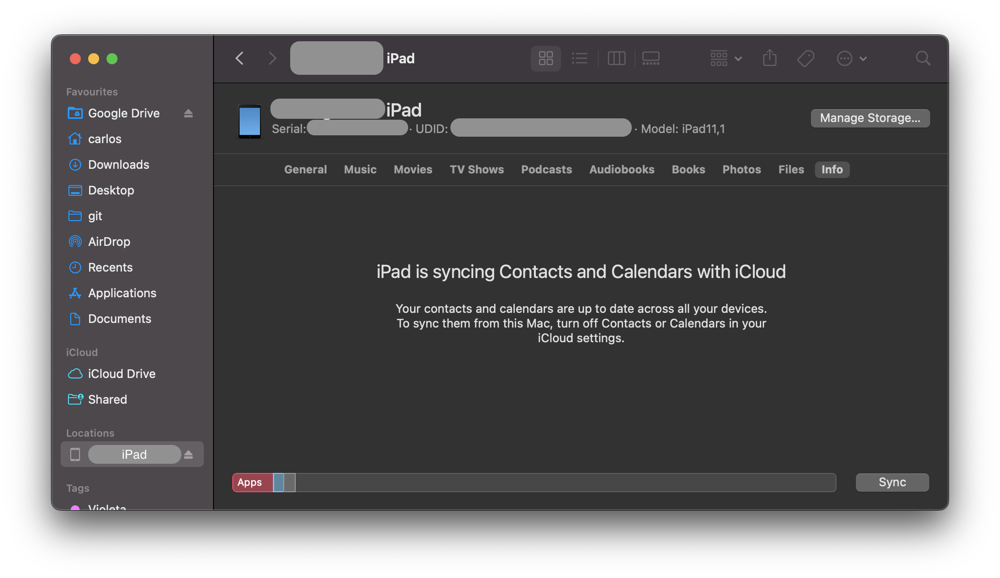

# iOS Security Testing

In this chapter, we'll dive into setting up a security testing environment and introduce you to some practical processes and techniques for testing the security of iOS apps. These are the building blocks for the MASTG test cases.

## iOS Testing Setup

Although you can use a Linux or Windows host computer for testing, you'll find that many tasks are difficult or impossible on these platforms. In addition, the Xcode development environment and the iOS SDK are only available for macOS. This means that you'll definitely want to work on macOS for source code analysis and debugging (it also makes black box testing easier).

### Host Device

The following is the most basic iOS app testing setup:

- Ideally macOS host computer with admin rights
- @MASTG-TOOL-0070 and @MASTG-TOOL-0071 installed.
- Wi-Fi network that permits client-to-client traffic.
- At least one jailbroken iOS device (of the desired iOS version).
- @MASTG-TOOL-0097 or other interception proxy tool.

### Obtaining the UDID of an iOS device

The UDID is a 40-digit unique sequence of letters and numbers to identify an iOS device. You can find the UDID of your iOS device on macOS Catalina onwards in the Finder app, as iTunes is not available anymore in Catalina. Open Finder and select the connected iOS device in the sidebar.


Click on the text containing the model, storage capacity, and battery information, and it will display the serial number, UDID, and model instead:



You can copy the UDID by right clicking on it.

It is also possible to get the UDID via various command line tools on macOS while the device is attached via USB:

- By using the [I/O Registry Explorer](https://developer.apple.com/library/archive/documentation/DeviceDrivers/Conceptual/IOKitFundamentals/TheRegistry/TheRegistry.html "I/O Registry Explorer") tool `ioreg`:

    ```sh
    $ ioreg -p IOUSB -l | grep "USB Serial"
    |         "USB Serial Number" = "9e8ada44246cee813e2f8c1407520bf2f84849ec"
    ```

- By using @MASTG-TOOL-0126:

    ```sh
    $ idevice_id -l
    316f01bd160932d2bf2f95f1f142bc29b1c62dbc
    ```

- By using the system_profiler:

    ```sh
    $ system_profiler SPUSBDataType | sed -n -e '/iPad/,/Serial/p;/iPhone/,/Serial/p;/iPod/,/Serial/p' | grep "Serial Number:"
    2019-09-08 10:18:03.920 system_profiler[13251:1050356] SPUSBDevice: IOCreatePlugInInterfaceForService failed 0xe00002be
                Serial Number: 64655621de6ef5e56a874d63f1e1bdd14f7103b1
    ```

- By using instruments:

    ```sh
    instruments -s devices
    ```

### Testing on a real device (Jailbroken)

You should have a jailbroken iPhone or iPad for running tests. These devices allow root access and tool installation, making the security testing process more straightforward. If you don't have access to a jailbroken device, you can apply the workarounds described later in this chapter, but be prepared for a more difficult experience.

### Testing on the iOS Simulator

Unlike the Android emulator, which fully emulates the hardware of an actual Android device, the iOS SDK simulator offers a higher-level _simulation_ of an iOS device. Most importantly, emulator binaries are compiled to x86 code instead of ARM code. Apps compiled for a real device don't run, making the simulator useless for black box analysis and reverse engineering.

### Testing on an Emulator

@MASTG-TOOL-0108 is the only publicly available iOS emulator. It is an enterprise SaaS solution with a per user license model and does not offer community licenses.

### Getting Privileged Access

iOS jailbreaking is often compared to Android rooting, but the process is actually quite different. To explain the difference, we'll first review the concepts of "rooting" and "flashing" on Android.

- **Rooting**: This typically involves installing the `su` binary on the system or replacing the whole system with a rooted custom ROM. Exploits aren't required to obtain root access as long as the bootloader is accessible.
- **Flashing custom ROMs**: This allows you to replace the OS that's running on the device after you unlock the bootloader. The bootloader may require an exploit to unlock it.

On iOS devices, flashing a custom ROM is impossible because the iOS bootloader only allows Apple-signed images to be booted and flashed. This is why even official iOS images can't be installed if they aren't signed by Apple, and it makes iOS downgrades only possible for as long as the previous iOS version is still signed.

The purpose of jailbreaking is to disable iOS protections (Apple's code signing mechanisms in particular) so that arbitrary unsigned code can run on the device (e.g. custom code or downloaded from alternative app stores such as @MASTG-TOOL-0047 or @MASTG-TOOL-0064). The word "jailbreak" is a colloquial reference to all-in-one tools that automate the disabling process.

Developing a jailbreak for a given version of iOS is not easy. As a security tester, you'll most likely want to use publicly available jailbreak tools. Still, we recommend studying the techniques that have been used to jailbreak various versions of iOS-you'll encounter many interesting exploits and learn a lot about OS internals. For example, Pangu9 for iOS 9.x [exploited at least five vulnerabilities](https://www.theiphonewiki.com/wiki/Jailbreak_Exploits "Jailbreak Exploits"), including a use-after-free kernel bug (CVE-2015-6794) and an arbitrary file system access vulnerability in the Photos app (CVE-2015-7037).

Some apps attempt to detect whether the iOS device on which they're running is jailbroken. This is because jailbreaking deactivates some of iOS' default security mechanisms. However, there are several ways to get around these detections, and we'll introduce them in the chapter ["iOS Anti-Reversing Defenses"](0x06j-Testing-Resiliency-Against-Reverse-Engineering.md).

#### Benefits of Jailbreaking

End users often jailbreak their devices to tweak the iOS system's appearance, add new features, and install third-party apps from unofficial app stores. For a security tester, however, jailbreaking an iOS device has even more benefits. They include, but aren't limited to, the following:

- Root access to the file system.
- Possibility of executing applications that haven't been signed by Apple (which includes many security tools).
- Unrestricted debugging and dynamic analysis.
- Access to the Objective-C or Swift runtime.

#### Jailbreak Types

There are _tethered_, _semi-tethered_, _semi-untethered_, and _untethered_ jailbreaks.

- Tethered jailbreaks don't persist through reboots, so re-applying jailbreaks requires the device to be connected (tethered) to a computer during every reboot. The device may not reboot at all if the computer is not connected.

- Semi-tethered jailbreaks can't be re-applied unless the device is connected to a computer during reboot. The device can also boot into non-jailbroken mode on its own.

- Semi-untethered jailbreaks allow the device to boot on its own, but the kernel patches (or user-land modifications) for disabling code signing aren't applied automatically. The user must re-jailbreak the device by starting an app or visiting a website (not requiring a connection to a computer, hence the term untethered).

- Untethered jailbreaks are the most popular choice for end users because they need to be applied only once, after which the device will be permanently jailbroken.

#### Caveats and Considerations

Developing a jailbreak for iOS is becoming more and more complicated as Apple continues to harden their OS. Whenever Apple becomes aware of a vulnerability, it is patched and a system update is pushed out to all users. As it is not possible to downgrade to a specific version of iOS, and since Apple only allows you to update to the latest iOS version, it is a challenge to have a device which is running a version of iOS for which a jailbreak is available. Some vulnerabilities cannot be patched by software, such as the [checkm8 exploit](https://www.theiphonewiki.com/wiki/Checkm8_Exploit "Checkm8 exploit") affecting the BootROM of all CPUs until A12.

If you have a jailbroken device that you use for security testing, keep it as is unless you're 100% sure that you can re-jailbreak it after upgrading to the latest iOS version. Consider getting one (or multiple) spare device(s) (which will be updated with every major iOS release) and waiting for a jailbreak to be released publicly. Apple is usually quick to release a patch once a jailbreak has been released publicly, so you only have a couple of days to downgrade (if it is still signed by Apple) to the affected iOS version and apply the jailbreak.

iOS upgrades are based on a challenge-response process (generating the so-called SHSH blobs as a result). The device will allow the OS installation only if the response to the challenge is signed by Apple. This is what researchers call a "signing window", and it is the reason you can't simply store the OTA firmware package you downloaded and load it onto the device whenever you want to. During minor iOS upgrades, two versions may both be signed by Apple (the latest one, and the previous iOS version). This is the only situation in which you can downgrade the iOS device. You can check the current signing window and download OTA firmware from the [IPSW Downloads website](https://ipsw.me "IPSW Downloads").

For some devices and iOS versions, it is possible to downgrade to older versions in case the SHSH blobs for that device were collected when the signing window was active. More information on this can be found on the [cfw iOS Guide - Saving Blobs](https://ios.cfw.guide/saving-blobs/)

#### Which Jailbreaking Tool to Use

Different iOS versions require different jailbreaking techniques. [Determine whether a public jailbreak is available for your version of iOS](https://appledb.dev/ "Apple DB"). Beware of fake tools and spyware, which are often hiding behind domain names that are similar to the name of the jailbreaking group/author.

The iOS jailbreak scene evolves so rapidly that providing up-to-date instructions is difficult. However, we can point you to some sources that are currently reliable.

- [AppleDB](https://appledb.dev/ "AppleDB")
- [The iPhone Wiki](https://www.theiphonewiki.com/ "The iPhone Wiki")
- [Redmond Pie](https://www.redmondpie.com/ "Redmone Pie")
- [Reddit Jailbreak](https://www.reddit.com/r/jailbreak/ "Reddit Jailbreak")

> Note that any modification you make to your device is at your own risk. While jailbreaking is typically safe, things can go wrong and you may end up bricking your device. No other party except yourself can be held accountable for any damage.
