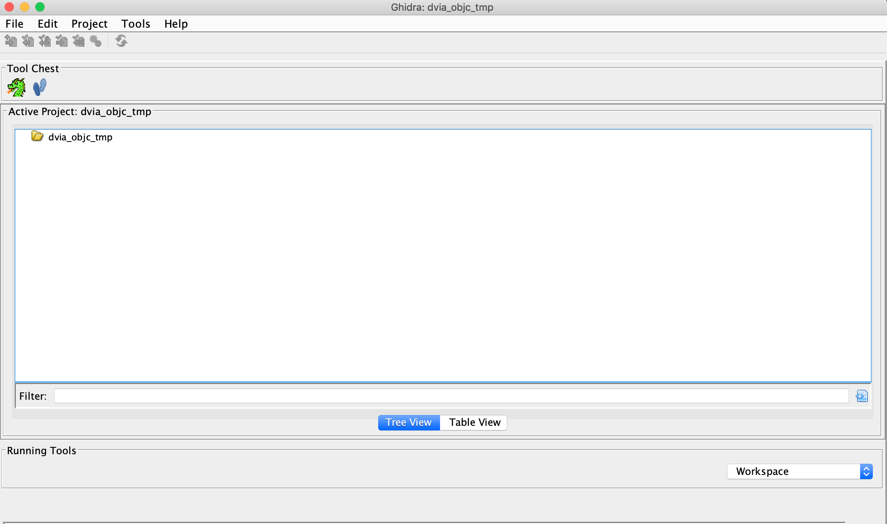
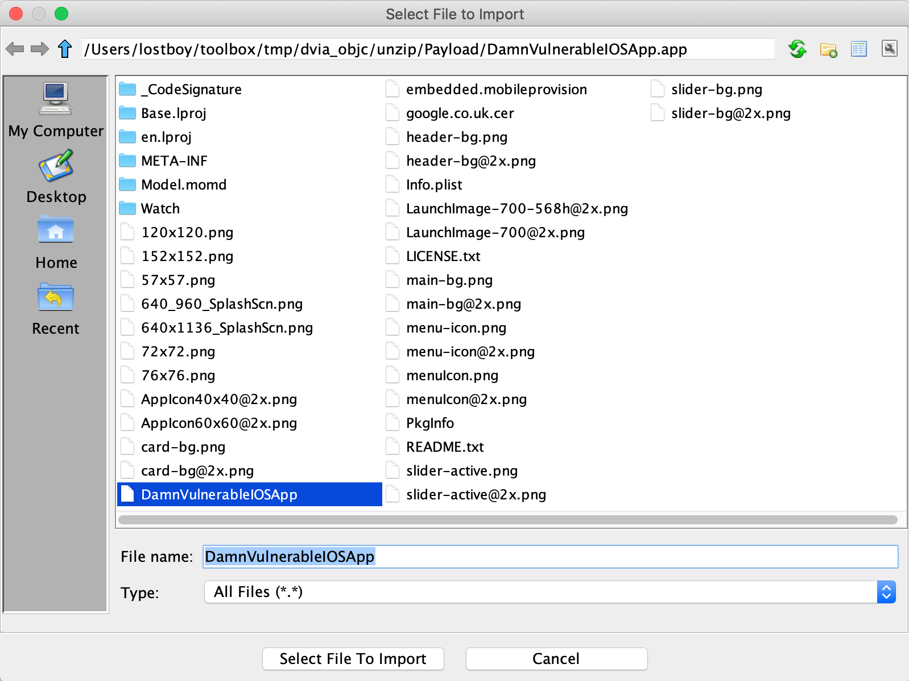
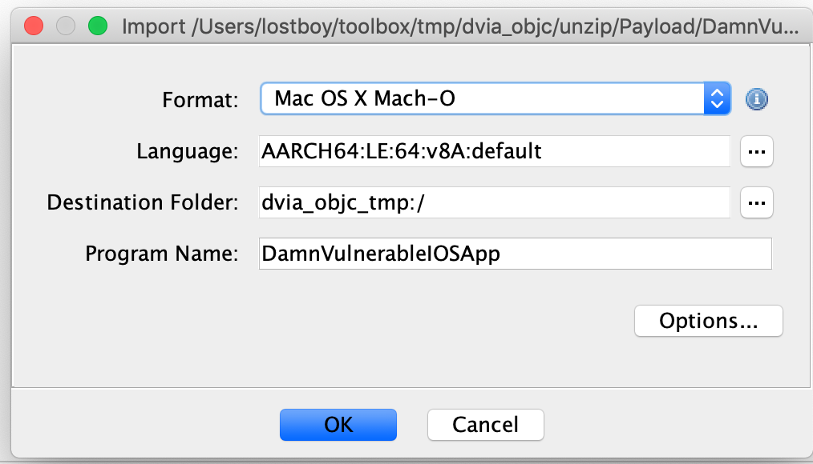
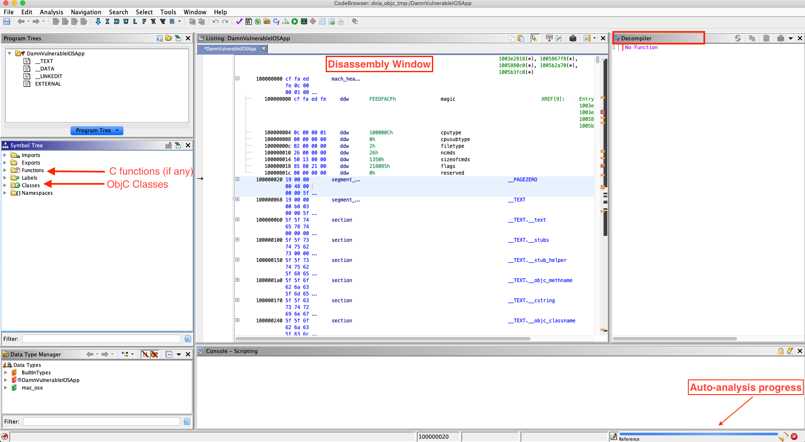
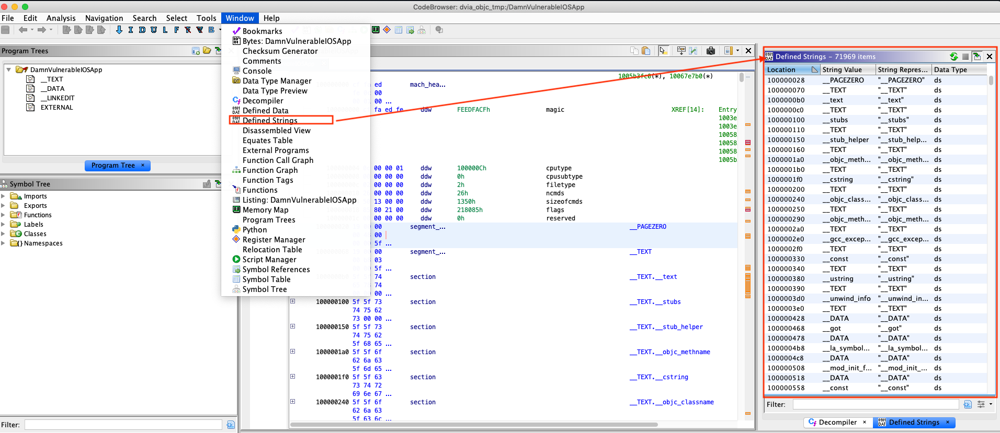
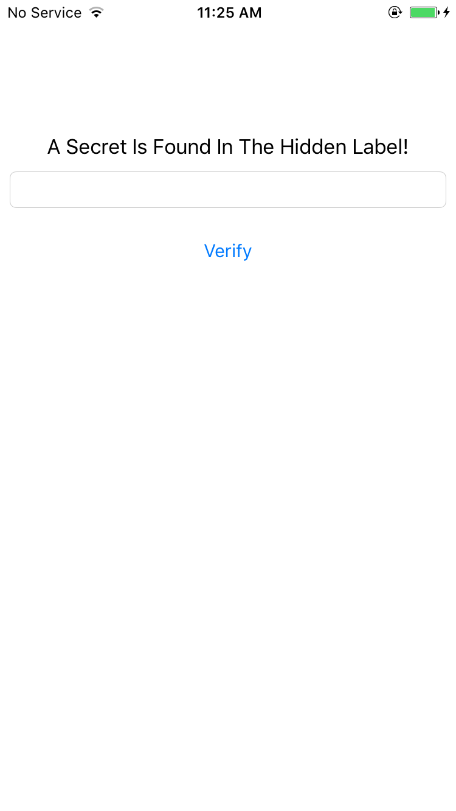

## Tampering and Reverse Engineering on iOS

### Reverse Engineering

iOS reverse engineering is a mixed bag. On one hand, apps programmed in Objective-C and Swift can be disassembled nicely. In Objective-C, object methods are called via dynamic function pointers called "selectors", which are resolved by name during runtime. The advantage of runtime name resolution is that these names need to stay intact in the final binary, making the disassembly more readable. Unfortunately, this also means that no direct cross-references between methods are available in the disassembler and constructing a flow graph is challenging.

In this guide, we'll introduce static and dynamic analysis and instrumentation. Throughout this chapter, we refer to the [OWASP UnCrackable Apps for iOS](https://github.com/OWASP/owasp-mstg/tree/master/Crackmes#ios "OWASP UnCrackable Apps for iOS"), so download them from the MSTG repository if you're planning to follow the examples.

#### Tooling

Make sure that the following is installed on your system:

- [Class-dump by Steve Nygard](http://stevenygard.com/projects/class-dump/ "Class-dump") is a command line utility for examining the Objective-C runtime information stored in Mach-O (Mach object) files. It generates declarations for the classes, categories, and protocols.

- [Class-dump-z](https://code.google.com/archive/p/networkpx/wikis/class_dump_z.wiki "Class-dump-z") is class-dump re-written from scratch in C++, avoiding the use of dynamic calls. Removing these unnecessary calls makes class-dump-z nearly 10 times faster than its predecessor.

- [Class-dump-dyld by Elias Limneos](https://github.com/limneos/classdump-dyld/ "Class-dump-dyld") allows symbols to be dumped and retrieved directly from the shared cache, eliminating the necessity of extracting the files first. It can generate header files from app binaries, libraries, frameworks, bundles, or the whole dyld_shared_cache. Directories or the entirety of dyld_shared_cache can be recursively mass-dumped.

- [MachoOView](https://sourceforge.net/projects/machoview/ "MachOView") is a useful visual Mach-O file browser that also allows in-file editing of ARM binaries.

- [otool](http://www.manpagez.com/man/1/otool/ "otool") is a tool for displaying specific parts of object files or libraries. It works with Mach-O files and universal file formats.

- [nm](http://www.manpagez.com/man/1/nm/osx-10.12.6.php "nm") is a tool that displays the name list (symbol table) of the given binary.

- [Radare2](https://rada.re/r/ "Radare2") is a complete framework for reverse engineering and analyzing. It is built with the Capstone disassembler engine, Keystone assembler, and Unicorn CPU emulation engine. Radare2 supports iOS binaries and many useful iOS-specific features, such as a native Objective-C parser and an iOS debugger.

- [Ghidra](https://ghidra-sre.org/ "Ghidra") is a software reverse engineering (SRE) suite of tools developed by NSA's Research Directorate. Please refer to the [installation guide](https://ghidra-sre.org/InstallationGuide.html "Ghidra Installation Guide") on how to install it and look at the [cheat sheet](https://ghidra-sre.org/CheatSheet.html "Cheat Sheet") for a first overview of available commands and shortcuts.

##### Building a Reverse Engineering Environment for Free

Be sure to follow the instructions from the section "Setting up Xcode and Command Line Tools" of chapter "iOS Basic Security Testing". This way you'll have properly installed [Xcode](https://developer.apple.com/xcode/ide/ "Apple Xcode IDE"). We'll be using standard tools that come with macOS and Xcode in addition to the tools mentioned above. Make sure you have the [Xcode command line developer tools](https://railsapps.github.io/xcode-command-line-tools.html "Xcode Command Line Tools") properly installed or install them straight away from your terminal:

```shell
$ xcode-select --install
```

- [`xcrun`](http://www.manpagez.com/man/1/xcrun/ "xcrun man page") can be used invoke Xcode developer tools from the command-line, without having them in the path. For example you may want to use it to locate and run swift-demangle or simctl.
- swift-demangle is an Xcode tool that demangles Swift symbols. For more information run `xcrun swift-demangle -help` once installed.
- simctl is an Xcode tool that allows you to interact with iOS simulators via the command line to e.g. manage simulators, launch apps, take screenshots or collect their logs.

##### Commercial Tools

Building a reverse engineering environment for free is possible. However, there are some commercial alternatives. The most commonly used are:

- [IDA Pro](https://www.hex-rays.com/products/ida/ "IDA Pro") can deal with iOS binaries. It has a built-in iOS debugger. IDA is widely seen as the gold standard for GUI-based interactive static analysis, but it isn't cheap. For the more budget-minded reverse engineer, [Hopper](https://www.hopperapp.com/ "Hopper") offers similar static analysis features.

- [Hopper](https://www.hopperapp.com/ "Hopper") is a reverse engineering tool for macOS and Linux used to disassemble, decompile and debug 32/64bits Intel Mac, Linux, Windows and iOS executables.

#### Disassembling and Decompiling

Because Objective-C and Swift are fundamentally different, the programming language in which the app is written affects the possibilities for reverse engineering it. For example, Objective-C allows method invocations to be changed at runtime. This makes hooking into other app functions (a technique heavily used by [Cycript](http://www.cycript.org/ "Cycript") and other reverse engineering tools) easy. This "method swizzling" is not implemented the same way in Swift, and the difference makes the technique harder to execute with Swift than with Objective-C.

On iOS, all the application code (both Swift and Objective-C) is compiled to machine code (e.g. ARM). Thus, to analyze iOS applications a disassembler is needed. 

If you want to disassemble an application from the App Store, remove the Fairplay DRM first. Section "[Acquiring the App Binary](0x06b-basic-security-testing.md#acquiring-the-app-binary "Acquiring the App Binary")" in the chapter "iOS Basic Security Testing" explains how. 

In this section the term "app binary" refers to the Macho-O file in the application bundle which contains the compiled code, and should not be confused with the application bundle - the IPA file. See section "[Exploring the App Package](0x06b-basic-security-testing.md#exploring-the-app-package "Exploring the App Package")" in chapter "Basic iOS Security Testing" for more details on the composition of IPA files. 

##### Disassembling With Ghidra

As mentioned in "[Tooling](#tooling "Tooling")" section, Ghidra is an open source software reverse engineering tool. Among multiple functionalities offered by Ghidra, it can also be used to analyze iOS application binaries. 

Start Ghidra using `ghidraRun` (\*nix) or `ghidraRun.bat` (Windows), depending on the platform you are on. Once Ghidra is fired up, create a new project by specifying the project directory. You will be greeted by a window as shown below:  



In your new **Active Project** you can import an app binary by going to **File** -> **Import File** and choosing the desired file. 



If the file can be properly processed, Ghidra will show meta-information about the binary before starting the analysis. 



To get the disassembled code for the binary file chosen above, double click the imported file from the **Active Project** window. Click **yes** and **analyze** for auto-analysis on the subsequent windows. Auto-analysis will take some time depending on the size of the binary, the progress can be tracked in the bottom right corner of the code browser window. Once auto-analysis is completed you can start exploring the binary.  



The most important windows to explore a binary in Ghidra are the **Listing** (Disassembly) window, the **Symbol Tree** window and the **Decompiler** window, which shows the decompiled version of the function selected for disassembly.

> It is important to note that decompilation is not always accurate, but nevertheless very helpful in getting a quick understanding of the function being analyzed. It is always a good idea to keep cross-checking decompiled code against disassembled code for maximum accuracy.

There are many other functionalities available in Ghidra and most of them can be explored by opening the **Window** menu. For example, if you want to examine the strings present in the binary, open the **Defined Strings** option.  



It often happens that the core logic of the application is implemented in a framework and the app binary is just a wrapper around that framework. In such cases, the above approach can be used to analyze *framework* binaries as well. 

##### Disassembling With IDA Pro

If you have a license for IDA Pro, you can analyze the app binary using IDA Pro as well. 

> The free version of IDA unfortunately does not support the ARM processor type.

To get started, simply open the app binary in IDA Pro. 


Upon opening the file, IDA Pro will perform auto-analysis, which can take a while depending on the size of the binary. Once the auto-analysis is completed you can browse the disassembly in the **IDA View** (Disassembly) window and explore functions in the **Functions** window, both shown in the screenshot below. 


A regular IDA Pro license does not include a decompiler by default and requires an additional license for the Hex-Rays decompiler, which is expensive. In contrast, Ghidra comes with a very capable free builtin decompiler, making it a compelling alternative to use for reverse engineering.  

If you have a regular IDA Pro license and do not want to buy the Hex-Rays decompiler, you can use Ghidra's decompiler by installing the [GhIDA plugin](https://github.com/Cisco-Talos/GhIDA/) for IDA Pro. 

The majority of this chapter applies to applications written in Objective-C or having bridged types, which are types compatible with both Swift and Objective-C. The Swift compatibility of most tools that work well with Objective-C is being improved. For example, Frida supports [Swift bindings](https://github.com/frida/frida-swift "Frida-swift").

### Static Analysis

The preferred method of statically analyzing iOS apps involves using the original Xcode project files. Ideally, you will be able to compile and debug the app to quickly identify any potential issues with the source code.

Black box analysis of iOS apps without access to the original source code requires reverse engineering. For example, no decompilers are available for iOS apps (although most commercial and open-source disassemblers can provide a pseudo-source code view of the binary), so a deep inspection requires you to read assembly code.

#### Basic Information Gathering

You can use class-dump to get information about methods in the application's source code. The example below uses the [Damn Vulnerable iOS App](http://damnvulnerableiosapp.com/ "Damn Vulnerable iOS App") to demonstrate this. Our binary is a so-called fat binary, which means that it can be executed on 32- and 64-bit platforms:

```shell
$ unzip DamnVulnerableiOSApp.ipa

$ cd Payload/DamnVulnerableIOSApp.app

$ otool -hv DamnVulnerableIOSApp

DamnVulnerableIOSApp (architecture armv7):
Mach header
     magic cputype cpusubtype  caps    filetype ncmds sizeofcmds      flags
  MH_MAGIC     ARM         V7  0x00     EXECUTE    38       4292   NOUNDEFS DYLDLINK TWOLEVEL WEAK_DEFINES BINDS_TO_WEAK PIE

DamnVulnerableIOSApp (architecture arm64):
Mach header
     magic cputype cpusubtype  caps    filetype ncmds sizeofcmds      flags
MH_MAGIC_64   ARM64        ALL  0x00     EXECUTE    38       4856   NOUNDEFS DYLDLINK TWOLEVEL WEAK_DEFINES BINDS_TO_WEAK PIE

```

Note the architectures: `armv7` (which is 32-bit) and `arm64`. This design of a fat binary allows an application to be deployed on all devices.
To analyze the application with class-dump, we must create a so-called thin binary, which contains one architecture only:

```shell
iOS8-jailbreak:~ root# lipo -thin armv7 DamnVulnerableIOSApp -output DVIA32
```

And then we can proceed to performing class-dump:

```shell
iOS8-jailbreak:~ root# class-dump DVIA32

@interface FlurryUtil : ./DVIA/DVIA/DamnVulnerableIOSApp/DamnVulnerableIOSApp/YapDatabase/Extensions/Views/Internal/
{
}
+ (BOOL)appIsCracked;
+ (BOOL)deviceIsJailbroken;
```

Note the plus sign, which means that this is a class method that returns a BOOL type.
A minus sign would mean that this is an instance method. Refer to later sections to understand the practical difference between these.

Alternatively, you can easily decompile the application with [Hopper Disassembler](https://www.hopperapp.com/ "Hopper Disassembler"). All these steps would be executed automatically, and you'd be able to see the disassembled binary and class information.

The following command is listing shared libraries:

```shell
$ otool -L <binary>
```
#### Manual (Reversed) Code Review

##### Reviewing Disassembled Objective-C and Swift Code

In this section we will be exploring iOS application's binary code manually and perform static analysis on it. Manual analysis can be a slow process and requires immense patience. A good manual analysis can make the dynamic analysis more successful. 

There are no hard written rules for performing static analysis, but there are few rules of thumb which can be used to have a systematic approach to manual analysis: 

- Understand the working of the application under evaluation - the objective of the application and how it behaves in case of wrong input. 
- Explore the various strings present in the application binary, this can be very helpful, for example in spotting interesting functionalities and possible error handling logic in the application. 
- Look for functions and classes having names relevant to our objective 
- Lastly, find the various entry points into the application and follow along from there to explore the application.

> Techniques discussed in this section are generic and applicable irrespective of the tools used for analysis. 

###### Objective-C

In addition to the techniques learned in the "[Disassembling and Decompiling](#disassembling-and-decompiling "Disassembling and Decompiling")" section, for this section you'll need some understanding of the [Objective-C runtime](https://developer.apple.com/documentation/objectivec/objective-c_runtime "Objective-C runtime"). For instance, functions like `_objc_msgSend` or `_objc_release` are specially meaningful for the Objective-C runtime.


We will be using the [UnCrackable Level 1 crackme app](https://github.com/OWASP/owasp-mstg/blob/master/Crackmes/iOS/Level_01/UnCrackable_Level1.ipa "UnCrackable Level 1 iOS App"), which has the simple goal of finding a _secret string_ hidden somewhere in the binary. The application has a single home screen and a user can interact via inputting custom strings in the provided text field. 



When the user inputs the wrong string, the application shows a pop-up with the "Verification Failed" message. 


You can keep note of the strings displayed in the pop-up, as this might be helpful when searching for the code where the input is processed and a decision is being made. Luckily, the complexity and interaction with this application is straightforward, which bodes well for our reversing endeavours.  

> For static analysis in this section, we will be using Ghidra 9.0.4. Ghidra 9.1_beta auto-analysis has a bug and does not show the Objective-C classes. 

In Ghidra we can start with checking the strings present in the binary. There are many strings present in the binary and on deeper analysis, and some experience in reversing Objective-C code, you will find most of the strings are not useful for us. Most of the strings are symbols (function names, class names etc) which are generated for the Objective-C runtime. Few of them are shown in the screenshot below.


On further careful analysis, we can spot the string, "Verification Failed", which is used in the pop-up when a wrong input is given. If you follow the **Xrefs** for this string, you will reach *buttonClick()* function in *ViewController* class. We will look into the *buttonClick()* function later in this section. On continuing checking the other strings in the application, only a few look a likely candidate for a 'hidden flag'. You can try them and verify as well. 


Moving forward, we have two paths to take. Either we can start analysing the `buttonClick` function identified in the above step, or start analysing the application from the various entry points. In real world situation, most times you will be taking the first path, but from a learning perspective, in this section we will take the latter path. 

An iOS application calls different predefined functions provided by the iOS runtime depending on its the state within the [application life cycle](https://developer.apple.com/documentation/uikit/app_and_environment/managing_your_app_s_life_cycle "Managing Your App's Life Cycle"). These functions are known as the entry points of the app. For example:

- `[AppDelegate application:didFinishLaunchingWithOptions:]` is called when the application is started for the first time.
- `[AppDelegate applicationDidBecomeActive:]` is called when the application is moving from inactive to active state.

Many applications execute critical code in these sections and therefore they're normally a good starting point in order to follow the code systematically.

Once we're done with the analysis of all the functions in the `AppDelegate` class, we can conclude that there is no relevant code present. The lack of any code in the above functions raises the question - from where is the application's initialisation code being called? 

Luckily the current application has a small code base, and we can find another `ViewController` class in the **Symbol Tree** view. In this class, function `viewDidLoad` function looks interesting. If you check the documentation of [`viewDidLoad`](https://developer.apple.com/documentation/uikit/uiviewcontroller/1621495-viewdidload "viewDidLoad()"), you can see that it can also be used to perform additional initialization on views. 


If we check the decompilation of this function, there are a few interesting things going on. For instance, there is a call to a native function at line 31 and a label is initialized with a `setHidden` flag set to 1 in lines 27-29. You can keep a note of these observations and continue exploring the other functions in this class. For brevity, exploring the other parts of the function is left as an exercise for the readers. 

In our first step, we observed that the application verifies the input string only when the UI button is pressed. Thus, analysing the `buttonClick` function is an obvious target. As earlier mentioned, this function also contains the string we see in the pop-ups. At line 29 a decision is being made, which is based on the result of `isEqualString` (output saved in `uVar1` at line 23). The input for the comparison is coming from the text input field (from the user) and the value of the `label`. Therefore, we can assume that the hidden flag is stored in that label.  


Now we have followed the complete flow and have all the information about the application flow. We also concluded that the hidden flag is present in a text label and in order to determine the value of the label, we need to revisit `viewDidLoad` function, and understand what is happening in the native function identified. Analysis of the native function is discussed in "[Reviewing Disassembled Native Code](#reviewing-disassembled-native-code "Reviewing Disassembled Native Code")".


##### Reviewing Disassembled Native Code

Analysing disassembled native code requires a good understanding of the calling conventions and instructions used by the underlying platform. In this section we are looking in ARM64 disassembly of the native code. A good starting point to learn about ARM architecture is available at [Introduction to ARM Assembly Basics](https://azeria-labs.com/writing-arm-assembly-part-1/ "Introduction to ARM Assembly Basics") by Azeria Labs Tutorials. This is a quick summary of the things that we will be using in this section:

- In ARM64, a register is of 64 bit in size and referred to as Xn, where n is a number from 0 to 31. If the lower (LSB) 32 bits of the register are used then it's referred to as Wn.
- The input parameters to a function are passed in the X0-X7 registers.
- The return value of the function is passed via the X0 register.
- Load (LDR) and store (STR) instructions are used to read or write to memory from/to a register.
- B, BL, BLX are branch instructions used for calling a function.

As mentioned above as well, Objective-C code is also compiled to native binary code, but analysing C/C++ native can be more challenging. In case of Objective-C there are various symbols (especially function names) present, which eases the understanding of the code. In the above section we've learned that the presence of function names like `setText`, `isEqualStrings` can help us in quickly understanding the semantics of the code. In case of C/C++ native code, if all the binaries are stripped, there can be very few or no symbols present to assist us into analyzing it. 

Decompilers can help us in analyzing native code, but they should be used with caution. Modern decompilers are very sophisticated and among many techniques used by them to decompile code, few are heuristics based. Heuristics based techniques might not always give correct results, one such case being, determining the number of input parameters for a given native function. Having knowledge of analysing disassembled code, assisted with decompilers can make analyzing native code less error prone.  

We will be analyzing the native function identified in `viewDidLoad` function in the previous section. The function is located at offset 0x1000080d4. The return value of this function used in the `setText` function call for the label. This text is used to compare against the user input. Thus, we can be sure that this function will be returning a string or equivalent. 


The first thing we can see in the disassembly of the function is that there is no input to the function. The registers X0-X7 are not read throughout the function. Also, there are multiple calls to other functions like the ones at 0x100008158, 0x10000dbf0 etc. 

The instructions corresponding to one such function calls can be seen below. The branch instruction `bl` is used to call the function at 0x100008158. 

```
1000080f0 1a 00 00 94     bl         FUN_100008158                
1000080f4 60 02 00 39     strb       w0,[x19]=>DAT_10000dbf0
```

The return value from the function (found in W0), is stored to the address in register X19 (`strb` stores a byte to the address in register). We can see the same pattern for other function calls, the returned value is stored in X19 register and each time the offset is one more than the previous function call. This behavior can be associated with populating each index of a string array at a time. Each return value is been written to an index of this string array. There are 11 such calls, and from the current evidence we can make an intelligent guess that length of the hidden flag is 11. Towards the end of the disassembly, the function returns with the address to this string array. 

```
100008148 e0 03 13 aa     mov        x0=>DAT_10000dbf0,x19
```

To determine the value of the 'hidden flag' we need to know the return value of each of the subsequent function calls identified above. On analysing the function *0x100006fb4*, we can observe this function is much bigger and more complex than previous one we analysed. For analysing complex functions, function graphs can be very helpful, as it helps in understanding the control flow of the function. In Ghidra function graphs can be obtained by clicking **Display function graph** icon in the sub-menu.


Manually analysing all the native functions completely will be time consuming and might not be the wisest approach. In such a scenario using dynamic analysis approach is recommended. By using the techniques like hooking or simply debugging the application, we can easily determine the returned values. In case dynamic analysis approach fails, then we can fallback and start manually analysing the functions. Dynamic analysis techniques are discussed in [Dynamic Analysis](#dynamic-analysis "Dynamic Analysis") section.  


#### Automated Static Analysis

Several automated tools for analyzing iOS apps are available; most of them are commercial tools. The free and open source tools [MobSF](https://github.com/MobSF/Mobile-Security-Framework-MobSF "Mobile Security Framework (MobSF)") and [Needle](https://github.com/mwrlabs/needle "Needle") have some static and dynamic analysis functionality. Additional tools are listed in the "Static Source Code Analysis" section of the "Testing Tools" appendix.

Don't shy away from using automated scanners for your analysis - they help you pick low-hanging fruit and allow you to focus on the more interesting aspects of analysis, such as the business logic. Keep in mind that static analyzers may produce false positives and false negatives; always review the findings carefully.

### Dynamic Analysis

Life is easy with a jailbroken device: not only do you gain easy privileged access to the device, the lack of code signing allows you to use more powerful dynamic analysis techniques. On iOS, most dynamic analysis tools are based on Cydia Substrate, a framework for developing runtime patches, or Frida, a dynamic introspection tool. For basic API monitoring, you can get away with not knowing all the details of how Substrate or Frida work - you can simply use existing API monitoring tools.

#### Dynamic Analysis on Non-Jailbroken Devices

##### Automated Repackaging with Objection

[Objection](https://github.com/sensepost/objection "Objection") is a mobile runtime exploration toolkit based on Frida. One of the biggest advantages about Objection is that it enables testing with non-jailbroken devices. It does this by automating the process of app repackaging with the `FridaGadget.dylib` library. A detailed explanation of the repackaging and resigning process can be found in the next chapter "Manual Repackaging".
We won't cover Objection in detail in this guide, as you can find exhaustive documentation on the official [wiki pages](https://github.com/sensepost/objection/wiki "Objection - Documentation").

##### Manual Repackaging

If you don't have access to a jailbroken device, you can patch and repackage the target app to load a dynamic library at startup. This way, you can instrument the app and do pretty much everything you need to do for a dynamic analysis (of course, you can't break out of the sandbox this way, but you won't often need to). However, this technique works only if the app binary isn't FairPlay-encrypted (i.e., obtained from the App Store).

Thanks to Apple's confusing provisioning and code-signing system, re-signing an app is more challenging than you would expect. iOS won't run an app unless you get the provisioning profile and code signature header exactly right. This requires learning many concepts-certificate types, Bundle IDs, application IDs, team identifiers, and how Apple's build tools connect them. Getting the OS to run a binary that hasn't been built via the default method (Xcode) can be a daunting process.

We'll use `optool`, Apple's build tools, and some shell commands. Our method is inspired by [Vincent Tan's Swizzler project](https://github.com/vtky/Swizzler2/ "Swizzler"). [The NCC group](https://www.nccgroup.trust/au/about-us/newsroom-and-events/blogs/2016/october/ios-instrumentation-without-jailbreak/ "NCC blog - iOS instrumentation without jailbreak") has described an alternative repackaging method.

To reproduce the steps listed below, download [UnCrackable iOS App Level 1](https://github.com/OWASP/owasp-mstg/tree/master/Crackmes/iOS/Level_01 "Crackmes - iOS Level 1") from the OWASP Mobile Testing Guide repository. Our goal is to make the UnCrackable app load `FridaGadget.dylib` during startup so we can instrument the app with Frida.

> Please note that the following steps apply to macOS only, as Xcode is only available for macOS.

##### Getting a Developer Provisioning Profile and Certificate

The *provisioning profile* is a plist file signed by Apple. It whitelists your code-signing certificate on one or more devices. In other words, this represents Apple explicitly allowing your app to run for certain reasons, such as debugging on selected devices (development profile). The provisioning profile also includes the *entitlements* granted to your app. The *certificate* contains the private key you'll use to sign.

Depending on whether you're registered as an iOS developer, you can obtain a certificate and provisioning profile in one of the following ways:

**With an iOS developer account:**

If you've developed and deployed iOS apps with Xcode before, you already have your own code-signing certificate installed. Use the *security* tool to list your signing identities:

```shell
$ security find-identity -v
 1) 61FA3547E0AF42A11E233F6A2B255E6B6AF262CE "iPhone Distribution: Vantage Point Security Pte. Ltd."
 2) 8004380F331DCA22CC1B47FB1A805890AE41C938 "iPhone Developer: Bernhard Müller (RV852WND79)"
```

Log into the Apple Developer portal to issue a new App ID, then issue and download the profile. An App ID is a two-part string: a Team ID supplied by Apple and a bundle ID search string that you can set to an arbitrary value, such as `com.example.myapp`. Note that you can use a single App ID to re-sign multiple apps. Make sure you create a *development* profile and not a *distribution* profile so that you can debug the app.

In the examples below, I use my signing identity, which is associated with my company's development team. I created the App ID "sg.vp.repackaged" and the provisioning profile "AwesomeRepackaging" for these examples. I ended up with the file `AwesomeRepackaging.mobileprovision`-replace this with your own filename in the shell commands below.

**With a Regular iTunes Account:**

Apple will issue a free development provisioning profile even if you're not a paying developer. You can obtain the profile via Xcode and your regular Apple account: simply create an empty iOS project and extract `embedded.mobileprovision` from the app container, which is in the Xcode subdirectory of your home directory: `~/Library/Developer/Xcode/DerivedData/<ProjectName>/Build/Products/Debug-iphoneos/<ProjectName>.app/`. The [NCC blog post "iOS instrumentation without jailbreak"](https://www.nccgroup.trust/au/about-us/newsroom-and-events/blogs/2016/october/ios-instrumentation-without-jailbreak/ "iOS instrumentation without jailbreak") explains this process in great detail.

Once you've obtained the provisioning profile, you can check its contents with the *security* tool. You'll find the entitlements granted to the app in the profile, along with the allowed certificates and devices. You'll need these for code-signing, so extract them to a separate plist file as shown below. Have a look at the file contents to make sure everything is as expected.

```shell
$ security cms -D -i AwesomeRepackaging.mobileprovision > profile.plist
$ /usr/libexec/PlistBuddy -x -c 'Print :Entitlements' profile.plist > entitlements.plist
$ cat entitlements.plist
<?xml version="1.0" encoding="UTF-8"?>
<!DOCTYPE plist PUBLIC "-//Apple//DTD PLIST 1.0//EN" "http://www.apple.com/DTDs/PropertyList-1.0.dtd">
<plist version="1.0">
<dict>
 <key>application-identifier</key>
 <string>LRUD9L355Y.sg.vantagepoint.repackage</string>
 <key>com.apple.developer.team-identifier</key>
 <string>LRUD9L355Y</string>
 <key>get-task-allow</key>
 <true/>
 <key>keychain-access-groups</key>
 <array>
   <string>LRUD9L355Y.*</string>
 </array>
</dict>
</plist>
```

Note the application identifier, which is a combination of the Team ID (LRUD9L355Y) and Bundle ID (sg.vantagepoint.repackage). This provisioning profile is only valid for the app that has this App ID. The `get-task-allow` key is also important: when set to `true`, other processes, such as the debugging server, are allowed to attach to the app (consequently, this would be set to `false` in a distribution profile).

##### Other Preparations

To make our app load an additional library at startup, we need some way of inserting an additional load command into the main executable's Mach-O header. [Optool](https://github.com/alexzielenski/optool "Optool") can be used to automate this process:

```shell
$ git clone https://github.com/alexzielenski/optool.git
$ cd optool/
$ git submodule update --init --recursive
$ xcodebuild
$ ln -s <your-path-to-optool>/build/Release/optool /usr/local/bin/optool
```

We'll also use [ios-deploy](https://github.com/phonegap/ios-deploy "ios-deploy"), a tool that allows iOS apps to be deployed and debugged without Xcode:

```shell
$ git clone https://github.com/phonegap/ios-deploy.git
$ cd ios-deploy/
$ xcodebuild
$ cd build/Release
$ ./ios-deploy
$ ln -s <your-path-to-ios-deploy>/build/Release/ios-deploy /usr/local/bin/ios-deploy
```

The last line in both the optool and ios-deploy code snippets creates a symbolic link and makes the executable available system-wide.

Reload your shell to make the new commands available:

```shell
zsh: # . ~/.zshrc
bash: # . ~/.bashrc
```

#### Debugging

Debugging on iOS is generally implemented via Mach IPC. To "attach" to a target process, the debugger process calls the `task_for_pid` function with the process ID of the target process and receives a Mach port. The debugger then registers as a receiver of exception messages and starts handling exceptions that occur in the debugger. Mach IPC calls are used to perform actions such as suspending the target process and reading/writing register states and virtual memory.

The XNU kernel implements the `ptrace` system call, but some of the call's functionality (including reading and writing register states and memory contents) has been eliminated. Nevertheless, `ptrace` is used in limited ways by standard debuggers, such as `lldb` and `gdb`. Some debuggers, including Radare2's iOS debugger, don't invoke `ptrace` at all.

##### Debugging with lldb

iOS ships with the console app debugserver, which allows remote debugging via gdb or lldb. By default, however, debugserver can't be used to attach to arbitrary processes (it is usually used only for debugging self-developed apps deployed with Xcode). To enable debugging of third-party apps, the `task_for_pid` entitlement must be added to the debugserver executable. An easy way to do this is to add the entitlement to the [debugserver binary shipped with Xcode](http://iphonedevwiki.net/index.php/Debugserver "Debug Server on the iPhone Dev Wiki").

To obtain the executable, mount the following DMG image:

```shell
/Applications/Xcode.app/Contents/Developer/Platforms/iPhoneOS.platform/DeviceSupport/<target-iOS-version>/DeveloperDiskImage.dmg
```

You'll find the debugserver executable in the `/usr/bin/` directory on the mounted volume. Copy it to a temporary directory, then create a file called `entitlements.plist` with the following content:

```xml
<?xml version="1.0" encoding="UTF-8"?>
<!DOCTYPE plist PUBLIC "-//Apple//DTD PLIST 1.0//EN" "http://www.apple.com/DTDs/ PropertyList-1.0.dtd">
<plist version="1.0">
<dict>
 <key>com.apple.springboard.debugapplications</key>
 <true/>
 <key>run-unsigned-code</key>
 <true/>
 <key>get-task-allow</key>
 <true/>
 <key>task_for_pid-allow</key>
 <true/>
</dict>
</plist>
```

Apply the entitlement with codesign:

```shell
$ codesign -s - --entitlements entitlements.plist -f debugserver
```

Copy the modified binary to any directory on the test device. The following examples use usbmuxd to forward a local port through USB.

```shell
$ ./tcprelay.py -t 22:2222
$ scp -P2222 debugserver root@localhost:/tmp/
```

You can now attach debugserver to any process running on the device.

```shell
VP-iPhone-18:/tmp root# ./debugserver *:1234 -a 2670
debugserver-@(#)PROGRAM:debugserver  PROJECT:debugserver-320.2.89
for armv7.
Attaching to process 2670...
```

#### Tracing

##### Execution Tracing

Intercepting Objective-C methods is a useful iOS security testing technique. For example, you may be interested in data storage operations or network requests. In the following example, we'll write a simple tracer for logging HTTP(S) requests made via iOS standard HTTP APIs. We'll also show you how to inject the tracer into the Safari web browser.

In the following examples, we'll assume that you are working on a jailbroken device. If that's not the case, you first need to follow the steps outlined in section [Repackaging and Re-Signing](#repackaging-and-re-signing "Repackaging and Re-Signing") to repackage the Safari app.

Frida comes with `frida-trace`, a function tracing tool. `frida-trace` accepts Objective-C methods via the `-m` flag. You can pass it wildcards as well-given `-[NSURL *]`, for example, `frida-trace` will automatically install hooks on all `NSURL` class selectors. We'll use this to get a rough idea about which library functions Safari calls when the user opens a URL.

Run Safari on the device and make sure the device is connected via USB. Then start `frida-trace` as follows:

```shell
$ frida-trace -U -m "-[NSURL *]" Safari
Instrumenting functions...
-[NSURL isMusicStoreURL]: Loaded handler at "/Users/berndt/Desktop/__handlers__/__NSURL_isMusicStoreURL_.js"
-[NSURL isAppStoreURL]: Loaded handler at "/Users/berndt/Desktop/__handlers__/__NSURL_isAppStoreURL_.js"
(...)
Started tracing 248 functions. Press Ctrl+C to stop.
```

Next, navigate to a new website in Safari. You should see traced function calls on the `frida-trace` console. Note that the `initWithURL:` method is called to initialize a new URL request object.

```shell
           /* TID 0xc07 */
  20313 ms  -[NSURLRequest _initWithCFURLRequest:0x1043bca30 ]
 20313 ms  -[NSURLRequest URL]
(...)
 21324 ms  -[NSURLRequest initWithURL:0x106388b00 ]
 21324 ms     | -[NSURLRequest initWithURL:0x106388b00 cachePolicy:0x0 timeoutInterval:0x106388b80
```

### Tampering and Runtime Instrumentation

#### Patching, Repackaging, and Re-Signing

Time to get serious! As you already know, IPA files are actually ZIP archives, so you can use any ZIP tool to unpack the archive.

```shell
$ unzip UnCrackable_Level1.ipa
```

##### Patching Example: Installing Frida Gadget

IF you want to use Frida on non-jailbroken devices you'll need to include `FridaGadget.dylib`. Download it first:

```shell
$ curl -O https://build.frida.re/frida/ios/lib/FridaGadget.dylib
```

Copy `FridaGadget.dylib` into the app directory and use optool to add a load command to the "UnCrackable Level 1" binary.

```shell
$ unzip UnCrackable_Level1.ipa
$ cp FridaGadget.dylib Payload/UnCrackable\ Level\ 1.app/
$ optool install -c load -p "@executable_path/FridaGadget.dylib"  -t Payload/UnCrackable\ Level\ 1.app/UnCrackable\ Level\ 1
Found FAT Header
Found thin header...
Found thin header...
Inserting a LC_LOAD_DYLIB command for architecture: arm
Successfully inserted a LC_LOAD_DYLIB command for arm
Inserting a LC_LOAD_DYLIB command for architecture: arm64
Successfully inserted a LC_LOAD_DYLIB command for arm64
Writing executable to Payload/UnCrackable Level 1.app/UnCrackable Level 1...
```

##### Repackaging and Re-Signing

Of course, tampering an app invalidates the main executable's code signature, so this won't run on a non-jailbroken device. You'll need to replace the provisioning profile and sign both the main executable and the files you've made include (e.g. `FridaGadget.dylib`) with the certificate listed in the profile.

First, let's add our own provisioning profile to the package:

```shell
$ cp AwesomeRepackaging.mobileprovision Payload/UnCrackable\ Level\ 1.app/embedded.mobileprovision
```

Next, we need to make sure that the Bundle ID in `Info.plist` matches the one specified in the profile because the codesign tool will read the Bundle ID from `Info.plist` during signing; the wrong value will lead to an invalid signature.

```shell
$ /usr/libexec/PlistBuddy -c "Set :CFBundleIdentifier sg.vantagepoint.repackage" Payload/UnCrackable\ Level\ 1.app/Info.plist
```

Finally, we use the codesign tool to re-sign both binaries. You need to use *your* signing identity (in this example 8004380F331DCA22CC1B47FB1A805890AE41C938), which you can output by executing the command `security find-identity -v`.

```shell
$ rm -rf Payload/UnCrackable\ Level\ 1.app/_CodeSignature
$ /usr/bin/codesign --force --sign 8004380F331DCA22CC1B47FB1A805890AE41C938  Payload/UnCrackable\ Level\ 1.app/FridaGadget.dylib
Payload/UnCrackable Level 1.app/FridaGadget.dylib: replacing existing signature
```

`entitlements.plist` is the file you created for your empty iOS project.

```shell
$ /usr/bin/codesign --force --sign 8004380F331DCA22CC1B47FB1A805890AE41C938 --entitlements entitlements.plist Payload/UnCrackable\ Level\ 1.app/UnCrackable\ Level\ 1
Payload/UnCrackable Level 1.app/UnCrackable Level 1: replacing existing signature
```

Now you should be ready to run the modified app. Deploy and run the app on the device:

```shell
$ ios-deploy --debug --bundle Payload/UnCrackable\ Level\ 1.app/
```

If everything went well, the app should start in debugging mode with lldb attached. Frida should then be able to attach to the app as well. You can verify this via the frida-ps command:

```shell
$ frida-ps -U
PID  Name
---  ------
499  Gadget
```


When something goes wrong (and it usually does), mismatches between the provisioning profile and code-signing header are the most likely causes. Reading the [official documentation](https://developer.apple.com/support/code-signing/ "Code Signing") helps you understand the code-signing process. Apple's [entitlement troubleshooting page](https://developer.apple.com/library/content/technotes/tn2415/_index.html "Entitlements Troubleshooting") is also a useful resource.

##### Patching React Native applications

If the [React Native](https://facebook.github.io/react-native "React Native") framework has been used for development, the main application code is in the file `Payload/[APP].app/main.jsbundle`. This file contains the JavaScript code. Most of the time, the JavaScript code in this file is minified. With the tool [JStillery](https://mindedsecurity.github.io/jstillery "JStillery"), a human-readable version of the file can be retried, which will allow code analysis. The [CLI version of JStillery](https://github.com/mindedsecurity/jstillery/ "CLI version of JStillery") and the local server are preferable to the online version because the latter discloses the source code to a third party.

At installation time, the application archive is unpacked into the folder `/private/var/containers/Bundle/Application/[GUID]/[APP].app` from iOS 10 onward, so the main JavaScript application file can be modified at this location.

To identify the exact location of the application folder, you can use the tool [ipainstaller](https://cydia.saurik.com/package/com.slugrail.ipainstaller/ "ipainstaller"):

1. Use the command `ipainstaller -l` to list the applications installed on the device. Get the name of the target application from the output list.
2. Use the command `ipainstaller -i [APP_NAME]` to display information about the target application, including the installation and data folder locations.
3. Take the path referenced at the line that starts with `Application:`.

Use the following approach to patch the JavaScript file:

1. Navigate to the application folder.
2. Copy the contents of the file `Payload/[APP].app/main.jsbundle` to a temporary file.
3. Use `JStillery` to beautify and de-obfuscate the contents of the temporary file.
4. Identify the code in the temporary file that should be patched and patch it.
5. Put the *patched code* on a single line and copy it into the original `Payload/[APP].app/main.jsbundle` file.
6. Close and restart the application.

#### Dynamic Instrumentation

##### Tooling

###### Frida

[Frida](https://www.frida.re "Frida") is a runtime instrumentation framework that lets you inject JavaScript snippets or portions of your own library into native Android and iOS apps. If you've already read the Android section of this guide, you should be quite familiar with this tool.

If you haven't already done so, install the Frida Python package on your host machine:

```shell
$ pip install frida
```

To connect Frida to an iOS app, you need a way to inject the Frida runtime into that app. This is easy to do on a jailbroken device: just install `frida-server` through Cydia. Once it has been installed, the Frida server will automatically run with root privileges, allowing you to easily inject code into any process.

Start Cydia and add Frida's repository by navigating to **Manage** -> **Sources** -> **Edit** -> **Add** and entering <https://build.frida.re>. You should then be able to find and install the Frida package.

Connect your device via USB and make sure that Frida works by running the `frida-ps` command and the flag '-U'. This should return the list of processes running on the device:

```shell
$ frida-ps -U
PID  Name
---  ----------------
963  Mail
952  Safari
416  BTServer
422  BlueTool
791  CalendarWidget
451  CloudKeychainPro
239  CommCenter
764  ContactsCoreSpot
(...)
```

We will demonstrate a few more uses for Frida throughout the chapter.

###### Cycript

Cydia Substrate (formerly called MobileSubstrate) is the standard framework for developing Cydia runtime patches (the so-called "Cydia Substrate Extensions") on iOS. It comes with Cynject, a tool that provides code injection support for C.

Cycript is a scripting language developed by Jay Freeman (aka Saurik). It injects a JavaScriptCore VM into a running process. Via the Cycript interactive console, users can then manipulate the process with a hybrid Objective-C++ and JavaScript syntax. Accessing and instantiating Objective-C classes inside a running process is also possible.

In order to install Cycript, first download, unpack, and install the SDK.

```shell
#on iphone
$ wget https://cydia.saurik.com/api/latest/3 -O cycript.zip && unzip cycript.zip
$ sudo cp -a Cycript.lib/*.dylib /usr/lib
$ sudo cp -a Cycript.lib/cycript-apl /usr/bin/cycript
```

To spawn the interactive Cycript shell, run "./cycript" or "cycript" if Cycript is on your path.

```shell
$ cycript
cy#
```

To inject into a running process, we first need to find the process ID (PID). Run the application and make sure the app is in the foreground. Running `cycript -p <PID>` injects Cycript into the process. To illustrate, we will inject into SpringBoard (which is always running).

```shell
$ ps -ef | grep SpringBoard
501 78 1 0 0:00.00 ?? 0:10.57 /System/Library/CoreServices/SpringBoard.app/SpringBoard
$ ./cycript -p 78
cy#
```

One of the first things you can try out is to get the application instance (`UIApplication`), you can use Objective-C syntax:

```shell
cy# [UIApplication sharedApplication]
cy# var a = [UIApplication sharedApplication]
```

Use that variable now to get the application's delegate class:

```shell
cy# a.delegate
```

Let's try to trigger an alert message on SpringBoard with Cycript.

```shell
cy# alertView = [[UIAlertView alloc] initWithTitle:@"OWASP MSTG" message:@"Mobile Security Testing Guide"  delegate:nil cancelButtonitle:@"OK" otherButtonTitles:nil]
#"<UIAlertView: 0x1645c550; frame = (0 0; 0 0); layer = <CALayer: 0x164df160>>"
cy# [alertView show]
cy# [alertView release]
```


Find the app's document directory with Cycript:

```shell
cy# [[NSFileManager defaultManager] URLsForDirectory:NSDocumentDirectory inDomains:NSUserDomainMask][0]
#"file:///var/mobile/Containers/Data/Application/A8AE15EE-DC8B-4F1C-91A5-1FED35212DF/Documents/"
```

The command `[[UIApp keyWindow] recursiveDescription].toString()` returns the view hierarchy of `keyWindow`. The description of every subview and sub-subview of `keyWindow` is shown. The indentation space reflects the relationships between views. For example, `UILabel`, `UITextField`, and `UIButton` are subviews of `UIView`.

```xml
cy# [[UIApp keyWindow] recursiveDescription].toString()
`<UIWindow: 0x16e82190; frame = (0 0; 320 568); gestureRecognizers = <NSArray: 0x16e80ac0>; layer = <UIWindowLayer: 0x16e63ce0>>
  | <UIView: 0x16e935f0; frame = (0 0; 320 568); autoresize = W+H; layer = <CALayer: 0x16e93680>>
  |    | <UILabel: 0x16e8f840; frame = (0 40; 82 20.5); text = 'i am groot!'; hidden = YES; opaque = NO; autoresize = RM+BM; userInteractionEnabled = NO; layer = <_UILabelLayer: 0x16e8f920>>
  |    | <UILabel: 0x16e8e030; frame = (0 110.5; 320 20.5); text = 'A Secret Is Found In The ...'; opaque = NO; autoresize = RM+BM; userInteractionEnabled = NO; layer = <_UILabelLayer: 0x16e8e290>>
  |    | <UITextField: 0x16e8fbd0; frame = (8 141; 304 30); text = ''; clipsToBounds = YES; opaque = NO; autoresize = RM+BM; gestureRecognizers = <NSArray: 0x16e94550>; layer = <CALayer: 0x16e8fea0>>
  |    |    | <_UITextFieldRoundedRectBackgroundViewNeue: 0x16e92770; frame = (0 0; 304 30); opaque = NO; autoresize = W+H; userInteractionEnabled = NO; layer = <CALayer: 0x16e92990>>
  |    | <UIButton: 0x16d901e0; frame = (8 191; 304 30); opaque = NO; autoresize = RM+BM; layer = <CALayer: 0x16d90490>>
  |    |    | <UIButtonLabel: 0x16e72b70; frame = (133 6; 38 18); text = 'Verify'; opaque = NO; userInteractionEnabled = NO; layer = <_UILabelLayer: 0x16e974b0>>
  |    | <_UILayoutGuide: 0x16d92a00; frame = (0 0; 0 20); hidden = YES; layer = <CALayer: 0x16e936b0>>
  |    | <_UILayoutGuide: 0x16d92c10; frame = (0 568; 0 0); hidden = YES; layer = <CALayer: 0x16d92cb0>>`
```

You can also use Cycript's built-in functions such as `choose` which searches the heap for instances of the given Objective-C class:

```shell
cy# choose(SBIconModel)
[#"<SBIconModel: 0x1590c8430>"]
```

Learn more in the [Cycript Manual](http://www.cycript.org/manual/ "Cycript Manual").

##### Method Hooking

###### Frida

In section ["Execution Tracing"](#execution-tracing "Execution Tracing") we've used frida-trace when navigating to a website in Safari and found that the `initWithURL:` method is called to initialize a new URL request object. We can look up the declaration of this method on the [Apple Developer Website](https://developer.apple.com/documentation/foundation/nsbundle/1409352-initwithurl?language=objc "Apple Developer Website - initWithURL Instance Method"):

```objc
- (instancetype)initWithURL:(NSURL *)url;
```

Using this information we can write a Frida script that intercepts the `initWithURL:` method and prints the URL passed to the method. The full script is below. Make sure you read the code and inline comments to understand what's going on.

```python
import sys
import frida


# JavaScript to be injected
frida_code = """

    // Obtain a reference to the initWithURL: method of the NSURLRequest class
    var URL = ObjC.classes.NSURLRequest["- initWithURL:"];

    // Intercept the method
    Interceptor.attach(URL.implementation, {
        onEnter: function(args) {
            // Get a handle on NSString
            var NSString = ObjC.classes.NSString;

            // Obtain a reference to the NSLog function, and use it to print the URL value
            // args[2] refers to the first method argument (NSURL *url)
            var NSLog = new NativeFunction(Module.findExportByName('Foundation', 'NSLog'), 'void', ['pointer', '...']);

            // We should always initialize an autorelease pool before interacting with Objective-C APIs
            var pool = ObjC.classes.NSAutoreleasePool.alloc().init();

            try {
                // Creates a JS binding given a NativePointer.
                var myNSURL = new ObjC.Object(args[2]);

                // Create an immutable ObjC string object from a JS string object.
                var str_url = NSString.stringWithString_(myNSURL.toString());

                // Call the iOS NSLog function to print the URL to the iOS device logs
                NSLog(str_url);

                // Use Frida's console.log to print the URL to your terminal
                console.log(str_url);

            } finally {
                pool.release();
            }
        }
    });
"""

process = frida.get_usb_device().attach("Safari")
script = process.create_script(frida_code)
script.load()

sys.stdin.read()
```

Start Safari on the iOS device. Run the above Python script on your connected host and open the device log (as explained in the section "Monitoring System Logs" from the chapter "iOS Basic Security Testing"). Try opening a new URL in Safari, e.g. <https://github.com/OWASP/owasp-mstg>; you should see Frida's output in the logs as well as in your terminal.


Of course, this example illustrates only one of the things you can do with Frida. To unlock the tool's full potential, you should learn to use its [JavaScript API](https://www.frida.re/docs/javascript-api/ "Frida JavaScript API reference"). The documentation section of the Frida website has a [tutorial](https://www.frida.re/docs/ios/ "Frida Tutorial") and [examples](https://www.frida.re/docs/examples/ios/ "Frida examples") for using Frida on iOS.

##### Process Exploration

When testing an app, process exploration can provide the tester with deep insights into the app process memory. It can be achieved via runtime instrumentation and allows to perform tasks such as:

- Retrieving the memory map and loaded libraries.
- Searching for occurrences of certain data.
- After doing a search, obtaining the location of a certain offset in the memory map.
- Performing a memory dump and inspect or reverse engineer the binary data _offline_.
- Reverse engineering a binary or Framework while it's running.

As you can see, these tasks are rather supportive and/or passive, they'll help us collect data and information that will support other techniques. Therefore, they're normally used in combination with other techniques such as method hooking.

In the following sections you will be using r2frida to retrieve information straight from the app runtime. First start by opening an r2frida session to the target app (e.g. iGoat-Swift) that should be running on your iPhone (connected per USB). Use the following command:

```bash
$ r2 frida://usb//iGoat-Swift
```

> See all options with `r2 frida://?`.

Once in the r2frida session, all commands start with `\`. For example, in radare2 you'd run `i` to display the binary information, but in r2frida you'd use `\i`.

###### Memory Maps and Inspection

You can retrieve the app's memory maps by running `\dm`:

```bash
[0x00000000]> \dm
0x0000000100b7c000 - 0x0000000100de0000 r-x /private/var/containers/Bundle/Application/3ADAF47D-A734-49FA-B274-FBCA66589E67/iGoat-Swift.app/iGoat-Swift
0x0000000100de0000 - 0x0000000100e68000 rw- /private/var/containers/Bundle/Application/3ADAF47D-A734-49FA-B274-FBCA66589E67/iGoat-Swift.app/iGoat-Swift
0x0000000100e68000 - 0x0000000100e97000 r-- /private/var/containers/Bundle/Application/3ADAF47D-A734-49FA-B274-FBCA66589E67/iGoat-Swift.app/iGoat-Swift
...
0x0000000100ea8000 - 0x0000000100eb0000 rw-
0x0000000100eb0000 - 0x0000000100eb4000 r--
0x0000000100eb4000 - 0x0000000100eb8000 r-x /usr/lib/TweakInject.dylib
0x0000000100eb8000 - 0x0000000100ebc000 rw- /usr/lib/TweakInject.dylib
0x0000000100ebc000 - 0x0000000100ec0000 r-- /usr/lib/TweakInject.dylib
0x0000000100f60000 - 0x00000001012dc000 r-x /private/var/containers/Bundle/Application/3ADAF47D-A734-49FA-B274-FBCA66589E67/iGoat-Swift.app/Frameworks/Realm.framework/Realm
```

While you're searching or exploring the app memory, you can always verify where your current offset is located in the memory map. Instead of noting and searching for the memory address in this list you can simply run `\dm.`. You'll find an example in the following section "In-Memory Search".

If you're only interested into the modules (binaries and libraries) that the app has loaded, you can use the command `\il` to list them all:

```shell
[0x00000000]> \il
0x0000000100b7c000 iGoat-Swift
0x0000000100eb4000 TweakInject.dylib
0x00000001862c0000 SystemConfiguration
0x00000001847c0000 libc++.1.dylib
0x0000000185ed9000 Foundation
0x000000018483c000 libobjc.A.dylib
0x00000001847be000 libSystem.B.dylib
0x0000000185b77000 CFNetwork
0x0000000187d64000 CoreData
0x00000001854b4000 CoreFoundation
0x00000001861d3000 Security
0x000000018ea1d000 UIKit
0x0000000100f60000 Realm
```

As you might expect you can correlate the addresses of the libraries with the memory maps: e.g. the main app binary iGoat-Swift is located at `0x0000000100b7c000` and the Realm Framework at `0x0000000100f60000`.

You can also use objection to display the same information.

```shell
$ objection --gadget OWASP.iGoat-Swift explore

OWASP.iGoat-Swift on (iPhone: 11.1.2) [usb] # memory list modules
Save the output by adding `--json modules.json` to this command

Name                              Base         Size                  Path
--------------------------------  -----------  --------------------  ------------------------------------------------------------------------------
iGoat-Swift                       0x100b7c000  2506752 (2.4 MiB)     /var/containers/Bundle/Application/3ADAF47D-A734-49FA-B274-FBCA66589E67/iGo...
TweakInject.dylib                 0x100eb4000  16384 (16.0 KiB)      /usr/lib/TweakInject.dylib
SystemConfiguration               0x1862c0000  446464 (436.0 KiB)    /System/Library/Frameworks/SystemConfiguration.framework/SystemConfiguratio...
libc++.1.dylib                    0x1847c0000  368640 (360.0 KiB)    /usr/lib/libc++.1.dylib
```

###### In-Memory Search

In-memory search is a very useful technique to test for sensitive data that might be present in the app memory.

See r2frida's help on the search command (`\/?`) to learn about the search command and get a list of options. The following shows only a subset of them:

```bash
[0x00000000]> \/?
 /      search
 /j     search json
 /w     search wide
 /wj    search wide json
 /x     search hex
 /xj    search hex json
...
```

You can adjust your search by using the search settings `\e~search`. For example, `\e search.quiet=true;` will print only the results and hide search progress:

```bash
[0x00000000]> \e~search
e search.in=perm:r--
e search.quiet=false
```

For now, we'll continue with the defaults and concentrate on string search. In this first example, you can start by searching for something that you know it should be located in the main binary of the app:

```bash
[0x00000000]> \/ iGoat
Searching 5 bytes: 69 47 6f 61 74
Searching 5 bytes in [0x0000000100b7c000-0x0000000100de0000]
...
hits: 509
0x100d7d332 hit2_0 iGoat_Swift24StringAnalysisExerciseVCC
0x100d7d3b2 hit2_1 iGoat_Swift28BrokenCryptographyExerciseVCC
0x100d7d442 hit2_2 iGoat_Swift23BackgroundingExerciseVCC
0x100d7d4b2 hit2_3 iGoat_Swift9AboutCellC
0x100d7d522 hit2_4 iGoat_Swift12FadeAnimatorV
```

Now take the first hit, seek to it and check your current location in the memory map:

```bash
[0x00000000]> s 0x100d7d332
[0x100d7d332]> \dm.
0x0000000100b7c000 - 0x0000000100de0000 r-x /private/var/containers/Bundle/Application/3ADAF47D-A734-49FA-B274-FBCA66589E67/iGoat-Swift.app/iGoat-Swift
```

As expected, you are located in the region of the main iGoat-Swift binary (r-x, read and execute). In the previous section, you saw that the main binary is located between `0x0000000100b7c000` and `0x0000000100e97000`.

Now, for this second example, you can search for something that's not in the app binary nor in any loaded library, typically user input. Open the iGoat-Swift app and navigate in the menu to **Authentication** -> **Remote Authentication** -> **Start**. There you'll find a password field that you can overwrite. Write the string "owasp-mstg" but do not click on **Login** just yet. Perform the following two steps.

```bash
[0x00000000]> \/ owasp-mstg
hits: 1
0x1c06619c0 hit3_0 owasp-mstg
```

In fact, the string could be found at address `0x1c06619c0`. Seek `s` to there and retrieve the current memory region with `\dm.`.

```bash
[0x100d7d332]> s 0x1c06619c0
[0x1c06619c0]> \dm.
0x00000001c0000000 - 0x00000001c8000000 rw-
```

Now you know that the string is located in a rw- (read and write) region of the memory map.

Additionally, you can search for occurrences of the [wide version of the string](https://en.wikipedia.org/wiki/Wide_character "Wide character") (`\/w`) and, again, check their memory regions:

> This time we run the `\dm.` command for all `@@` hits matching the glob `hit5_*`.

```bash
[0x00000000]> \/w owasp-mstg
Searching 20 bytes: 6f 00 77 00 61 00 73 00 70 00 2d 00 6d 00 73 00 74 00 67 00
Searching 20 bytes in [0x0000000100708000-0x000000010096c000]
...
hits: 2
0x1020d1280 hit5_0 6f0077006100730070002d006d00730074006700
0x1030c9c85 hit5_1 6f0077006100730070002d006d00730074006700

[0x00000000]> \dm.@@ hit5_*
0x0000000102000000 - 0x0000000102100000 rw-
0x0000000103084000 - 0x00000001030cc000 rw-
```

They are in a different rw- region. Note that searching for the wide versions of strings is sometimes the only way to find them as you'll see in the following section.

In-memory search can be very useful to quickly know if certain data is located in the main app binary, inside a shared library or in another region. You may also use it to test the behavior of the app regarding how the data is kept in memory. For instance, you could continue the previous example, this time clicking on Login and searching again for occurrences of the data. Also, you may check if you still can find those strings in memory after the login is completed to verify if this _sensitive data_ is wiped from memory after its use.

###### Memory Dump

You can dump the app's process memory with [objection](https://github.com/sensepost/objection "Objection") and [Fridump](https://github.com/Nightbringer21/fridump "Fridump"). To take advantage of these tools on a non-jailbroken device, the Android app must be repackaged with `frida-gadget.so` and re-signed. A detailed explanation of this process is in the section "[Dynamic Analysis on Non-Jailbroken Devices](#dynamic-analysis-on-non-jailbroken-devices "Dynamic Analysis on Non-Jailbroken Devices"). To use these tools on a jailbroken phone, simply have frida-server installed and running.

With objection it is possible to dump all memory of the running process on the device by using the command `memory dump all`.

```shell
$ objection explore

iPhone on (iPhone: 10.3.1) [usb] # memory dump all /Users/foo/memory_iOS/memory
Dumping 768.0 KiB from base: 0x1ad200000  [####################################]  100%
Memory dumped to file: /Users/foo/memory_iOS/memory
```

Alternatively you can use Fridump. First, you need the name of the app you want to dump, which you can get with `frida-ps`.

```shell
$ frida-ps -U
 PID  Name
----  ------
1026  Gadget
```

Afterwards, specify the app name in Fridump.

```shell
$ python3 fridump.py -u Gadget -s

Current Directory: /Users/foo/PentestTools/iOS/fridump
Output directory is set to: /Users/foo/PentestTools/iOS/fridump/dump
Creating directory...
Starting Memory dump...
Progress: [##################################################] 100.0% Complete

Running strings on all files:
Progress: [##################################################] 100.0% Complete

Finished! Press Ctrl+C
```

When you add the `-s` flag, all strings are extracted from the dumped raw memory files and added to the file `strings.txt`, which is stored in Fridump's dump directory.

In both cases, if you open the file in radare2 you can use its search command (`/`). Note that first we do a standard string search which doesn't succeed and next we search for a [wide string](https://en.wikipedia.org/wiki/Wide_character "Wide character"), which successfully finds our string "owasp-mstg".

```bash
$ r2 memory_ios
[0x00000000]> / owasp-mstg
Searching 10 bytes in [0x0-0x628c000]
hits: 0
[0x00000000]> /w owasp-mstg
Searching 20 bytes in [0x0-0x628c000]
hits: 1
0x0036f800 hit4_0 6f0077006100730070002d006d00730074006700
```

Next, we can seek to its address using `s 0x0036f800`  or `s hit4_0` and print it using `psw` (which stands for _print string wide_) or use `px` to print its raw hexadecimal values:

```bash
[0x0036f800]> psw
owasp-mstg

[0x0036f800]> px 48
- offset -   0 1  2 3  4 5  6 7  8 9  A B  C D  E F  0123456789ABCDEF
0x0036f800  6f00 7700 6100 7300 7000 2d00 6d00 7300  o.w.a.s.p.-.m.s.
0x0036f810  7400 6700 0000 0000 0000 0000 0000 0000  t.g.............
0x0036f820  0000 0000 0000 0000 0000 0000 0000 0000  ................
```

Note that in order to find this string using the `strings` command you'll have to specify an encoding using the `-e` flag and in this case `l` for 16-bit little-endian character.

```bash
$ strings -e l memory_ios | grep owasp-mstg
owasp-mstg
```

###### Runtime Reverse Engineering

Runtime reverse engineering can be seen as the on-the-fly version of reverse engineering where you don't have the binary data to your host computer. Instead, you'll analyze it straight from the memory of the app.

We'll keep using the iGoat-Swift app, open a session with r2frida `r2 frida://usb//iGoat-Swift` and you can start by displaying the target binary information by using the `\i` command:

```shell
[0x00000000]> \i
arch                arm
bits                64
os                  darwin
pid                 2166
uid                 501
objc                true
runtime             V8
java                false
cylang              true
pageSize            16384
pointerSize         8
codeSigningPolicy   optional
isDebuggerAttached  false
cwd                 /
```

Search all symbols of a certain module with `\is <lib>`, e.g. `\is libboringssl.dylib`.

The following does a case-insensitive search (grep) for symbols including "aes" (`~+aes`).

```bash
[0x00000000]> \is libboringssl.dylib~+aes
0x1863d6ed8 s EVP_aes_128_cbc
0x1863d6ee4 s EVP_aes_192_cbc
0x1863d6ef0 s EVP_aes_256_cbc
0x1863d6f14 s EVP_has_aes_hardware
0x1863d6f1c s aes_init_key
0x1863d728c s aes_cipher
0x0 u ccaes_cbc_decrypt_mode
0x0 u ccaes_cbc_encrypt_mode
...
```

Or you might prefer to look into the imports/exports. For example:

- List all imports of the main binary: `\ii iGoat-Swift`.
- List exports of the libc++.1.dylib library: `\iE /usr/lib/libc++.1.dylib`.

> For big binaries it's recommended to pipe the output to the internal less program by appending `~..`, i.e. `\ii iGoat-Swift~..` (if not, for this binary, you'd get almost 5000 lines printed to your terminal).

The next thing you might want to look at are the classes:

```shell
[0x00000000]> \ic~+passcode
PSPasscodeField
_UITextFieldPasscodeCutoutBackground
UIPasscodeField
PasscodeFieldCell
...
```

List class fields:

```shell
[0x19687256c]> \ic UIPasscodeField
0x000000018eec6680 - becomeFirstResponder
0x000000018eec5d78 - appendString:
0x000000018eec6650 - canBecomeFirstResponder
0x000000018eec6700 - isFirstResponder
0x000000018eec6a60 - hitTest:forEvent:
0x000000018eec5384 - setKeyboardType:
0x000000018eec5c8c - setStringValue:
0x000000018eec5c64 - stringValue
...
```

Imagine that you are interested into `0x000000018eec5c8c - setStringValue:`. You can seek to that address with `s 0x000000018eec5c8c`, analyze that function `af` and print 10 lines of its disassembly `pd 10`:

```shell
[0x18eec5c8c]> pd 10
╭ (fcn) fcn.18eec5c8c 35
│   fcn.18eec5c8c (int32_t arg1, int32_t arg3);
│ bp: 0 (vars 0, args 0)
│ sp: 0 (vars 0, args 0)
│ rg: 2 (vars 0, args 2)
│           0x18eec5c8c      f657bd         not byte [rdi - 0x43]      ; arg1
│           0x18eec5c8f      a9f44f01a9     test eax, 0xa9014ff4
│           0x18eec5c94      fd             std
│       ╭─< 0x18eec5c95      7b02           jnp 0x18eec5c99
│       │   0x18eec5c97      a9fd830091     test eax, 0x910083fd
│           0x18eec5c9c      f30300         add eax, dword [rax]
│           0x18eec5c9f      aa             stosb byte [rdi], al
│       ╭─< 0x18eec5ca0      e003           loopne 0x18eec5ca5
│       │   0x18eec5ca2      02aa9b494197   add ch, byte [rdx - 0x68beb665] ; arg3
╰           0x18eec5ca8      f4             hlt
```

Finally, instead of doing a full memory search for strings, you may want to retrieve the strings from a certain binary and filter them, as you'd do _offline_ with radare2. For this you have to find the binary, seek to it and then run the `\iz` command.

> It's recommended to apply a filter with a keyword `~<keyword>`/`~+<keyword>` to minimize the terminal output. If just want to explore all results you can also pipe them to the internal less `\iz~..`.

```bash
[0x00000000]> \il~iGoa
0x00000001006b8000 iGoat-Swift
[0x00000000]> s 0x00000001006b8000
[0x1006b8000]> \iz
Reading 2.390625MB ...
Do you want to print 8568 lines? (y/N) N
[0x1006b8000]> \iz~+hill
Reading 2.390625MB ...
[0x1006b8000]> \iz~+pass
Reading 2.390625MB ...
0x00000001006b93ed  "passwordTextField"
0x00000001006bb11a  "11iGoat_Swift20KeychainPasswordItemV0C5ErrorO"
0x00000001006bb164  "unexpectedPasswordData"
0x00000001006d3f62  "Error reading password from keychain - "
0x00000001006d40f2  "Incorrect Password"
0x00000001006d4112  "Enter the correct password"
0x00000001006d4632  "T@"UITextField",N,W,VpasswordField"
0x00000001006d46f2  "CREATE TABLE IF NOT EXISTS creds (id INTEGER PRIMARY KEY AUTOINCREMENT, username TEXT, password TEXT);"
0x00000001006d4792  "INSERT INTO creds(username, password) VALUES(?, ?)"
```

To learn more, please refer to the [r2frida wiki](https://github.com/enovella/r2frida-wiki/blob/master/README.md "r2frida Wiki").

### References

- Apple's Entitlements Troubleshooting - <https://developer.apple.com/library/content/technotes/tn2415/_index.html>
- Apple's Code Signing - <https://developer.apple.com/support/code-signing/>
- Cycript Manual - <http://www.cycript.org/manual/>
- iOS Instrumentation without Jailbreak - <https://www.nccgroup.trust/au/about-us/newsroom-and-events/blogs/2016/october/ios-instrumentation-without-jailbreak/>
- Frida iOS Tutorial - <https://www.frida.re/docs/ios/>
- Frida iOS Examples - <https://www.frida.re/docs/examples/ios/>
- r2frida Wiki - <https://github.com/enovella/r2frida-wiki/blob/master/README.md>

#### Tools

- Class-dump - <http://stevenygard.com/projects/class-dump/>
- Class-dump-dyld - <https://github.com/limneos/classdump-dyld/>
- Class-dump-z - <https://code.google.com/archive/p/networkpx/wikis/class_dump_z.wiki>
- Cycript - <http://www.cycript.org/>
- Damn Vulnerable iOS App - <http://damnvulnerableiosapp.com/>
- Frida - <https://www.frida.re>
- Ghidra - <https://ghidra-sre.org/>
- Hopper - <https://www.hopperapp.com/>
- ios-deploy - <https://github.com/phonegap/ios-deploy>
- IPA Installer Console - <https://cydia.saurik.com/package/com.autopear.installipa/>
- ipainstaller - <https://cydia.saurik.com/package/com.slugrail.ipainstaller/>
- MachoOView - <https://sourceforge.net/projects/machoview/>
- Objection - <https://github.com/sensepost/objection>
- Optool - <https://github.com/alexzielenski/optool>
- OWASP UnCrackable Apps for iOS - <https://github.com/OWASP/owasp-mstg/tree/master/Crackmes#ios>
- r2frida - <https://github.com/nowsecure/r2frida>
- Radare2 - <https://rada.re/r/>
- Reverse Engineering tools for iOS Apps - <http://iphonedevwiki.net/index.php/Reverse_Engineering_Tools>
- Swizzler project - <https://github.com/vtky/Swizzler2/>
- Xcode command line developer tools - <https://railsapps.github.io/xcode-command-line-tools.html>
