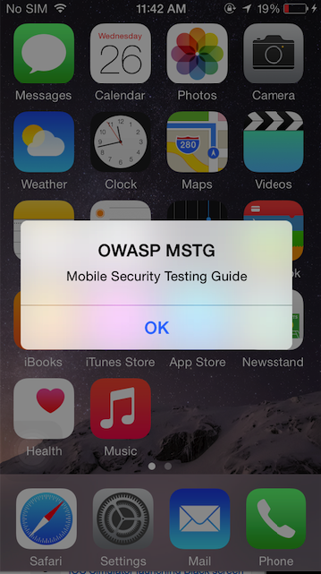

## Tampering and Reverse Engineering on iOS

### Environment and Toolset

-- TODO [Environment Overview] --

#### XCode and iOS SDK

Xcode is an Integrated Development Environment (IDE) for macOS containing a suite of software development tools developed by Apple for developing software for macOS, iOS, watchOS and tvOS. The latest release as of the writing of this book is Xcode 8 and it can be downloaded from the official Apple website<sup>[7]</sup>.

The iOS SDK (Software Development Kit), formerly known as iPhone SDK, is a software development kit developed by Apple for developing native applications for iOS. The latest release as of the writing of this book is iOS 10 SDK and it can be downloaded from the Official Apple website as well<sup>[8]</sup>.

#### Utilities

- Class-dump by Steve Nygard<sup>[1]</sup> is a command-line utility for examining the Objective-C runtime information stored in Mach-O files. It generates declarations for the classes, categories and protocols.

- Class-dump-z<sup>[9]</sup> is re-write of class-dump from scratch using C++, avoiding using dynamic calls. Removing these unnecessary calls makes class-dump-z near 10 times faster than the precedences.

- Class-dump-dyld by Elias Limneos<sup>[2]</sup> allows dumping and retrieving symbols directly from the shared cache, eliminating the need to extract the files first. It can generate header files from app binaries, libraries, frameworks, bundles or the whole dyld_shared_cache. Is is also possible to Mass-dump the whole dyld_shared_cache or directories recursively.

- MachoOView<sup>[3]</sup> is a useful visual Mach-O file browser that also allows for in-file editing of ARM binaries.

- otool is a tool for  displays  specified  parts	of object files or libraries. It understands both Mach-O (Mach object) files and universal file formats.  

#### Reversing Frameworks

Radare2 is a complete framework for reverse-engineering and analyzing. It is built around the Capstone disassembler, Keystone assembler, and Unicorn CPU emulation engine. Radare2 has support for iOS binaries and many useful iOS-specific features, such as a native Objective-C parser, and an iOS debugger.

#### Commercial Disassemblers

IDA Pro can deal with iOS binaries and has a built-in iOS debugger. IDA is widely seen as the gold standard for GUI-based, interactive static analysis, but it isn't cheap. For the more budget-minded reverse engineer, Hopper offers similar static analysis features.

### Jailbreaking iOS

In the iOS world, jailbreaking means disabling Apple's code code signing mechanisms so that apps not signed by Apple can be run. If you're planning to do any form of dynamic security testing on an iOS device, you'll have a much easier time on a jailbroken device, as most useful testing tools are only available outside the app store.

Developing a jailbreak for any given version of iOS is not an easy endeavor. As a security tester, you'll most likely want to use publicly available jailbreak tools (don't worry, we're all script kiddies in some areas). Even so, we recommend studying the techniques used to jailbreak various versions of iOS in the past - you'll encounter many highly interesting exploits and learn a lot about the internals of the OS. For example, Pangu9 for iOS 9.x exploited at least five vulnerabilities, including a use-after-free bug in the kernel (CVE-2015-6794) and an arbitrary file system access vulnerability in the Photos app (CVE-2015-7037) <sup>[4]</sup>.

In jailbreak lingo, we talk about tethered and untethered jailbreaking methods. In the "tethered" scenario, the jailbreak doesn't persist throughout reboots, so the device must be connected (tethered) to a computer during every reboot to re-apply it. "Untethered" jailbreaks need only be applied once, making them the most popular choice for end users.

Some of the benefits of jailbreaking an iOS Device includes the following:

* Removing the security (and other) limitations on the OS imposed by Apple
* Providing root access to the operating system
* Allowing important testing software tools to be installed
* Providing access to the Objective-C Runtime

iOS applications store data in the application sandbox which is not accessible to the public (but is available to root and the application itself). Without root access, it is not possible to assess the application sandbox, analyse the data that were stored in the device and how they were stored. 

#### How to Jailbreak iOS?

The iOS jailbreak scene is evolving so rapidly that it is difficult to provide-up-to-date instructions.

Note that obviously OWASP and the MSTG will not be responsible if you end up bricking your iOS device!

Some reliable resources to read about content regarding jailbreak iOS.

* The iPhone Wiki - https://www.theiphonewiki.com/wiki/Jailbreak
* Redmond Pie - http://www.redmondpie.com/
* Reddit Jailbreak - https://www.reddit.com/r/jailbreak/

#### Dealing with Jailbreak Detection

Some apps attempt to detect whether the iOS device they're installed on is jailbroken. The reason for this jailbreaking deactivates some of iOS' default security mechanisms, leading to a less trustable environment.

The core dilemma with this approach is that, by definition, jailbreaking causes the app's environment to be unreliable: The APIs used to test whether a device is jailbroken can be manipulated, and with code signing disabled, the jailbreak detection code can easily be patched out. It is therefore not a very effective way of impeding reverse engineers. Nevertheless, jailbreak detection can be useful in the context of a larger software protection scheme. We'll revisit this topic in the next chapter.

### Reverse Engineering iOS Apps

iOS reverse engineering is a mixed bag. On the one hand, apps programmed in Objective-C and Swift can be disassembled nicely. In Objective-C, object methods are called through dynamic function pointers called "selectors", which are resolved by name during runtime. The advantage of this is that these names need to stay intact in the final binary, making the disassembly more readable. Unfortunately, this also has the effect that no direct cross-references between methods are available in the disassembler, and constructing a flow graph is challenging. 

In this guide, we'll give an introduction on static and dynamic analysis and instrumentation. Throughtout this chapter, we'll be referring to the OWASP UnCrackable Apps for iOS, so download them from MSTG repository if you're planning to follow the examples.

#### Static Analysis

-- TODO [iOS Static Analysis with examples] --

#### Debugging

-- TODO [iOS Debugging Overview] --

Debugging on iOS is generally implemented via Mach IPC. To "attach" to a target process, the debugger process calls the <code>task_for_pid()</code> function with the process id of the target process to and receives a Mach port. The debugger then registers as a receiver of exception messages and starts handling any exceptions that occur in the debuggee. Mach IPC calls are used to perform actions such as suspending the target process and reading/writing register states and virtual memory.

Even though the XNU kernel implements the <code>ptrace()</code> system call as well, some of its functionality has been removed, including the capability to read and write register states and memory contents. Even so, <code>ptrace()</code> is used in limited ways by standard debuggers such as <code>lldb</code> and <code>gdb</code>. Some debuggers, including Radare2's iOS debugger, don't invoke <code>ptrace</code> at all.

##### Using lldb

iOS ships with a console app, debugserver, that allows for remote debugging using gdb or lldb. By default however, debugserver cannot be used to attach to arbitrary processes (it is usually only used for debugging self-developed apps deployed with XCode). To enable debugging of third-part apps, the task_for_pid entitlement must be added to the debugserver executable. An easy way to do this is adding the entitlement to the debugserver binary shipped with XCode <sup>[5]</sup>.

To obtain the executable mount the following DMG image:

~~~
/Applications/Xcode.app/Contents/Developer/Platforms/iPhoneOS.platform/ DeviceSupport/<target-iOS-version//DeveloperDiskImage.dmg
~~~

You’ll find the debugserver executable in the /usr/bin/ directory on the mounted volume - copy it to a temporary directory. Then, create a file called entitlements.plist with the following content:

~~~
<?xml version="1.0" encoding="UTF-8"?>
<!DOCTYPE plist PUBLIC "-//Apple//DTD PLIST 1.0//EN" "http://www.apple.com/DTDs/ PropertyList-1.0.dtd">
<plist version="1.0">
<dict>
	<key>com.apple.springboard.debugapplications</key>
	<true/>
	<key>run-unsigned-code</key>
	<true/>
	<key>get-task-allow</key>
	<true/>
	<key>task_for_pid-allow</key>
	<true/>
</dict>
</plist>
~~~

And apply the entitlement with codesign:

~~~
codesign -s - --entitlements entitlements.plist -f debugserver
~~~

Copy the modified binary to any directory on the test device (note: The following examples use usbmuxd to forward a local port through USB).

~~~
$ ./tcprelay.py -t 22:2222
$ scp -P2222 debugserver root@localhost:/tmp/
~~~

You can now attach debugserver to any process running on the device.

~~~
VP-iPhone-18:/tmp root# ./debugserver *:1234 -a 2670
debugserver-@(#)PROGRAM:debugserver  PROJECT:debugserver-320.2.89
 for armv7.
Attaching to process 2670...
~~~

-- TODO [Solving UnCrackable App with lldb] --

##### Using Radare2

-- TODO [Write Radare2 tutorial] --

### Tampering and Instrumentation

#### Hooking with MobileSubstrate

#### Cycript and Cynject

Cydia Substrate (formerly called MobileSubstrate) is the de-facto standard framework for developing run-time patches (“Cydia Substrate extensions”) on iOS. It comes with Cynject, a tool that provides code injection support for C. Cycript is a scripting language developed by Jay Freeman (saurik). Cycript injects a JavaScriptCore VM into the running process. Users can then manipulate the process using a hybrid of Objective-C++ and JavaScript syntax through the Cycript interactive console. It is also possible to access and instantiate Objective-C classes inside a running process. Some examples for the use of Cycript are listed in the iOS chapter.

Firt the SDK need to be downloaded, unpacked and installed.
```bash
$ wget https://cydia.saurik.com/api/latest/3 -O cycript.zip && unzip cycript.zip
#on iphone
$ sudo cp -a Cycript.lib/*.dylib /usr/lib
$ sudo cp -a Cycript.lib/cycript-apl /usr/bin/cycript
```
To spawn the interactive cycript shell, you can run “./cyript” or just “cycript” if cycript is on your path.
```bash
$ cycyript
cy#
```
To inject into a running process, we need to first find out the process ID (PID). We can run “cycript -p” with the PID to inject cycript into the process. To illustrate we will inject into springboard.
```bash
$ ps -ef | grep SpringBoard 
501 78 1 0 0:00.00 ?? 0:10.57 /System/Library/CoreServices/SpringBoard.app/SpringBoard
$ ./cycript -p 78
cy#
```
We have injected cycript into SpringBoard, lets try to trigger an alert message on SpringBoard with cycript. 		
```bash
cy# alertView = [[UIAlertView alloc] initWithTitle:@"OWASP MSTG" message:@"Mobile Security Testing Guide"  delegate:nil cancelButtonitle:@"OK" otherButtonTitles:nil]
#"<UIAlertView: 0x1645c550; frame = (0 0; 0 0); layer = <CALayer: 0x164df160>>"
cy# [alertView show]
cy# [alertView release]
```


Discover the document directory with cycript:
```bash
cy# [[NSFileManager defaultManager] URLsForDirectory:NSDocumentDirectory inDomains:NSUserDomainMask][0]
#"file:///var/mobile/Containers/Data/Application/A8AE15EE-DC8B-4F1C-91A5-1FED35212DF/Documents/"
```

Get the delegate class for the application using the command below:
```bash
cy# [UIApplication sharedApplication].delegate
```
The command [[UIApp keyWindow] recursiveDescription].toString() returns the view hierarchy of keyWindow. The description of every subview and sub-subview of keyWindow will be shown and the indentation space reflects the relationships of each views. For an example UILabel, UITextField and UIButton are subviews of UIView. 

```
cy# [[UIApp keyWindow] recursiveDescription].toString()
`<UIWindow: 0x16e82190; frame = (0 0; 320 568); gestureRecognizers = <NSArray: 0x16e80ac0>; layer = <UIWindowLayer: 0x16e63ce0>>
   | <UIView: 0x16e935f0; frame = (0 0; 320 568); autoresize = W+H; layer = <CALayer: 0x16e93680>>
   |    | <UILabel: 0x16e8f840; frame = (0 40; 82 20.5); text = 'i am groot!'; hidden = YES; opaque = NO; autoresize = RM+BM; userInteractionEnabled = NO; layer = <_UILabelLayer: 0x16e8f920>>
   |    | <UILabel: 0x16e8e030; frame = (0 110.5; 320 20.5); text = 'A Secret Is Found In The ...'; opaque = NO; autoresize = RM+BM; userInteractionEnabled = NO; layer = <_UILabelLayer: 0x16e8e290>>
   |    | <UITextField: 0x16e8fbd0; frame = (8 141; 304 30); text = ''; clipsToBounds = YES; opaque = NO; autoresize = RM+BM; gestureRecognizers = <NSArray: 0x16e94550>; layer = <CALayer: 0x16e8fea0>>
   |    |    | <_UITextFieldRoundedRectBackgroundViewNeue: 0x16e92770; frame = (0 0; 304 30); opaque = NO; autoresize = W+H; userInteractionEnabled = NO; layer = <CALayer: 0x16e92990>>
   |    | <UIButton: 0x16d901e0; frame = (8 191; 304 30); opaque = NO; autoresize = RM+BM; layer = <CALayer: 0x16d90490>>
   |    |    | <UIButtonLabel: 0x16e72b70; frame = (133 6; 38 18); text = 'Verify'; opaque = NO; userInteractionEnabled = NO; layer = <_UILabelLayer: 0x16e974b0>>
   |    | <_UILayoutGuide: 0x16d92a00; frame = (0 0; 0 20); hidden = YES; layer = <CALayer: 0x16e936b0>>
   |    | <_UILayoutGuide: 0x16d92c10; frame = (0 568; 0 0); hidden = YES; layer = <CALayer: 0x16d92cb0>>`
```

Obtain references to existing objects

TODO

Instantiate objects from classes

TODO

Hooking native functions

TODO

Hooking objective-C methods

TODO

Cycript tricks:

http://iphonedevwiki.net/index.php/Cycript_Tricks

#### Frida

-- TODO [Develop section on Frida] --

### References

-- TODO [Clean up References] --

* [1] Class-dump - http://stevenygard.com/projects/class-dump/
* [2] Class-dump-dyld - https://github.com/limneos/classdump-dyld/
* [3] MachOView - https://sourceforge.net/projects/machoview/
* [3] Jailbreak Exploits on the iPhone Dev Wiki - https://www.theiphonewiki.com/wiki/Jailbreak_Exploits#Pangu9_.289.0_.2F_9.0.1_.2F_9.0.2.29)
* [4] Stack Overflow - http://stackoverflow.com/questions/413242/how-do-i-detect-that-an-ios-app-is-running-on-a-jailbroken-phone
* [5] Debug Server on the iPhone Dev Wiki - http://iphonedevwiki.net/index.php/Debugserver
* [6] Uninformed - Replacing ptrace() - http://uninformed.org/index.cgi?v=4&a=3&p=14
* [7] Apple Xcode IDE - https://developer.apple.com/xcode/ide/
* [8] Apple iOS 10 SDK - https://developer.apple.com/ios/
* [9] Class-dump-z - https://code.google.com/archive/p/networkpx/wikis/class_dump_z.wiki


- [x] IDA Pro - https://www.hex-rays.com/products/ida/
