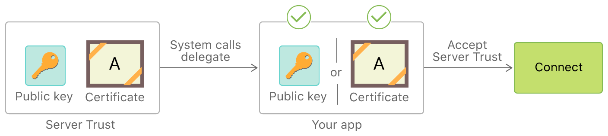
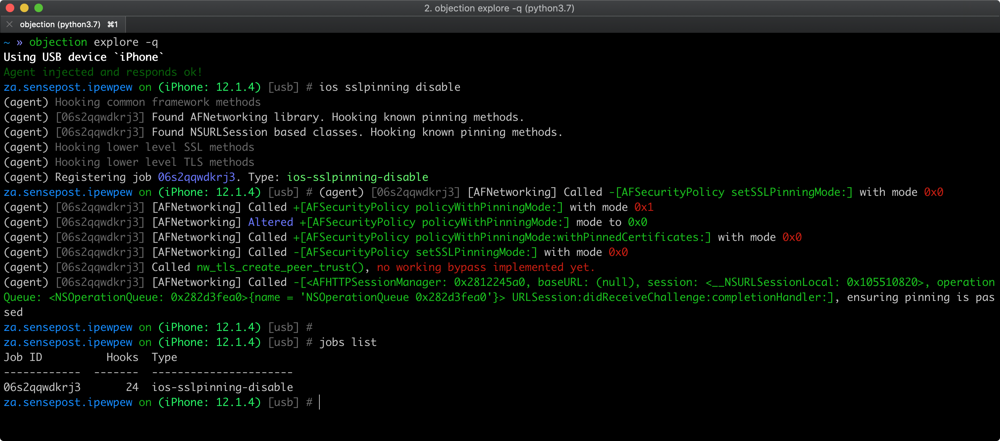

# iOS Network Communication

Almost every iOS app acts as a client to one or more remote services. As this network communication usually takes place over untrusted networks such as public Wi-Fi, classical network based-attacks become a potential issue.

Most modern mobile apps use variants of HTTP-based web services, as these protocols are well-documented and supported.

## Overview

### iOS App Transport Security

Starting with iOS 9, Apple introduced [App Transport Security (ATS)](https://developer.apple.com/documentation/bundleresources/information_property_list/nsapptransportsecurity) which is a set of security checks enforced by the operating system for connections made using the [URL Loading System](https://developer.apple.com/documentation/foundation/url_loading_system) (typically via `URLSession`) to always use HTTPS. Apps should follow [Apple's best practices](https://developer.apple.com/news/?id=jxky8h89) to properly secure their connections.

> [Watch ATS Introductory Video from the Apple WWDC 2015](https://developer.apple.com/videos/play/wwdc2015/711/?time=321).

ATS performs default server trust evaluation and requires a minimum set of security requirements.

**Default Server Trust Evaluation:**

When an app connects to a remote server, the server provides its identity using an X.509 digital certificate. The ATS default server trust evaluation includes validating that the certificate:

- Isn’t expired.
- Has a name that matches the server’s DNS name.
- Has a digital signature that is valid (hasn't been tampered with) and can be traced back to a trusted Certificate Authority (CA) included in the [operating system Trust Store](https://support.apple.com/en-us/HT209143), or be installed on the client by the user or a system administrator.

**Minimum Security Requirements for Connections:**

ATS will block connections that further fail to meet a set of [minimum security requirements](https://developer.apple.com/documentation/security/preventing_insecure_network_connections#3138464) including:

- TLS version 1.2 or greater.
- Data encryption with AES-128 or AES-256.
- The certificate must be signed with an RSA key (2048 bits or greater), or an ECC key (256 bits or greater).
- The certificate's fingerprint must use SHA-256 or greater.
- The link must support perfect forward secrecy (PFS) through Elliptic Curve Diffie-Hellman Ephemeral (ECDHE) key exchange.

**Certificate validity checking:**

[According to Apple](https://support.apple.com/en-gb/guide/security/sec100a75d12/web#sec8b087b1f7), "evaluating the trusted status of a TLS certificate is performed in accordance with established industry standards, as set out in RFC 5280, and incorporates emerging standards such as RFC 6962 (Certificate Transparency). In iOS 11 or later, Apple devices are periodically updated with a current list of revoked and constrained certificates. The list is aggregated from certificate revocation lists (CRLs), which are published by each of the built-in root certificate authorities trusted by Apple, as well as by their subordinate CA issuers. The list may also include other constraints at Apple’s discretion. This information is consulted whenever a network API function is used to make a secure connection. If there are too many revoked certificates from a CA to list individually, a trust evaluation may instead require that an online certificate status response (OCSP) is needed, and if the response isn’t available, the trust evaluation will fail."

#### When does ATS not apply?

- **When using lower-level APIs:** ATS only applies to the [URL Loading System](https://developer.apple.com/documentation/foundation/url_loading_system) including [URLSession](https://developer.apple.com/reference/foundation/urlsession) and APIs layered on top of them. It does not apply to apps that use lower-level APIs (like BSD Sockets), including those that implement TLS on top of those lower-level APIs (see section ["Using ATS in Apple Frameworks"](https://developer.apple.com/library/archive/documentation/General/Reference/InfoPlistKeyReference/Articles/CocoaKeys.html#//apple_ref/doc/uid/TP40009251-SW55) from the Archived Apple Developer Documentation).

- **When connecting to IP addresses, unqualified domain names or local hosts:** ATS applies only to connections made to public host names (see section ["Availability of ATS for Remote and Local Connections"](https://developer.apple.com/library/archive/documentation/General/Reference/InfoPlistKeyReference/Articles/CocoaKeys.html#//apple_ref/doc/uid/TP40009251-SW54) from the Archived Apple Developer Documentation). The system does not provide ATS protection to connections made to:

  - Internet protocol (IP) addresses
  - Unqualified host names
  - Local hosts employing the .local top-level domain (TLD)

- **When including ATS Exceptions:** If the app uses the ATS compatible APIs, it can still disable ATS for specific scenarios using [ATS Exceptions](#ats-exceptions).

Learn more:

- ["ATS and iOS enterprise apps with private networks"](https://developer.apple.com/forums/thread/79662)
- ["ATS and local IP addresses"](https://developer.apple.com/forums/thread/66417)
- ["ATS impact on apps use 3rd party libraries"](https://developer.apple.com/forums/thread/69197)
- ["ATS and SSL pinning / own CA"](https://developer.apple.com/forums/thread/53314)

#### ATS Exceptions

ATS restrictions can be disabled by configuring exceptions in the `Info.plist` file under the `NSAppTransportSecurity` key. These exceptions can be applied to:

- allow insecure connections (HTTP),
- lower the minimum TLS version,
- disable Perfect Forward Secrecy (PFS) or
- allow connections to local domains.

ATS exceptions can be applied globally or per domain basis. The application can globally disable ATS, but opt in for individual domains. The following listing from Apple Developer documentation shows the structure of the [`NSAppTransportSecurity`](https://developer.apple.com/library/content/documentation/General/Reference/InfoPlistKeyReference/Articles/CocoaKeys.html#//apple_ref/doc/plist/info/NSAppTransportSecurity "API Reference NSAppTransportSecurity") dictionary.

```objectivec
NSAppTransportSecurity : Dictionary {
    NSAllowsArbitraryLoads : Boolean
    NSAllowsArbitraryLoadsForMedia : Boolean
    NSAllowsArbitraryLoadsInWebContent : Boolean
    NSAllowsLocalNetworking : Boolean
    NSExceptionDomains : Dictionary {
        <domain-name-string> : Dictionary {
            NSIncludesSubdomains : Boolean
            NSExceptionAllowsInsecureHTTPLoads : Boolean
            NSExceptionMinimumTLSVersion : String
            NSExceptionRequiresForwardSecrecy : Boolean   // Default value is YES
            NSRequiresCertificateTransparency : Boolean
        }
    }
}
```

Source: [Apple Developer Documentation](https://developer.apple.com/library/content/documentation/General/Reference/InfoPlistKeyReference/Articles/CocoaKeys.html "Information Property List Key Reference: Cocoa Keys").

The following table summarizes the global ATS exceptions. For more information about these exceptions, please refer to [table 2 in the official Apple developer documentation](https://developer.apple.com/library/content/documentation/General/Reference/InfoPlistKeyReference/Articles/CocoaKeys.html#//apple_ref/doc/uid/TP40009251-SW34 "App Transport Security dictionary primary keys").

|  Key | Description |
| --------------| ------------|
| `NSAllowsArbitraryLoads` | Disable ATS restrictions globally excepts for individual domains specified under `NSExceptionDomains` |
| `NSAllowsArbitraryLoadsInWebContent` | Disable ATS restrictions for all the connections made from web views |
| `NSAllowsLocalNetworking` | Allow connection to unqualified domain names and .local domains |
| `NSAllowsArbitraryLoadsForMedia` | Disable all ATS restrictions for media loaded through the AV Foundations framework |

The following table summarizes the per-domain ATS exceptions. For more information about these exceptions, please refer to [table 3 in the official Apple developer documentation](https://developer.apple.com/library/content/documentation/General/Reference/InfoPlistKeyReference/Articles/CocoaKeys.html#//apple_ref/doc/uid/TP40009251-SW44 "App Transport Security dictionary primary keys").

|  Key | Description |
| --------------| ------------|
| `NSIncludesSubdomains` | Indicates whether ATS exceptions should apply to subdomains of the named domain |
| `NSExceptionAllowsInsecureHTTPLoads` | Allows HTTP connections to the named domain, but does not affect TLS requirements |
| `NSExceptionMinimumTLSVersion` | Allows connections to servers with TLS versions less than 1.2 |
| `NSExceptionRequiresForwardSecrecy` | Disable perfect forward secrecy (PFS) |

**Justifying Exceptions:**

Starting from January 1 2017, Apple App Store review [requires justification](https://developer.apple.com/documentation/security/preventing_insecure_network_connections#3138036) if one of the following ATS exceptions are defined.

- `NSAllowsArbitraryLoads`
- `NSAllowsArbitraryLoadsForMedia`
- `NSAllowsArbitraryLoadsInWebContent`
- `NSExceptionAllowsInsecureHTTPLoads`
- `NSExceptionMinimumTLSVersion`

This must be carefully revised to determine if it's indeed part of the app intended purpose. Apple warns about exceptions reducing the security of the apps and advises to **configure exceptions only when needed and prefer to server fixes** when faced with an ATS failure.

**Example:**

In the following example, ATS is globally enabled (there's no global `NSAllowsArbitraryLoads` defined) but an exception is **explicitly set** for the `example.com` domain (and its subdomains). Considering that the domain is owned by the application developers and there's a proper justification this exception would be acceptable, since it maintains all the benefits of ATS for all other domains. However, it would be always preferable to fix the server as indicated above.

```xml
<key>NSAppTransportSecurity</key>
<dict>
    <key>NSExceptionDomains</key>
    <dict>
        <key>example.com</key>
        <dict>
            <key>NSIncludesSubdomains</key>
            <true/>
            <key>NSExceptionMinimumTLSVersion</key>
            <string>TLSv1.2</string>
            <key>NSExceptionAllowsInsecureHTTPLoads</key>
            <true/>
            <key>NSExceptionRequiresForwardSecrecy</key>
            <true/>
        </dict>
    </dict>
</dict>
```

For more information on ATS exceptions please consult section "Configure Exceptions Only When Needed; Prefer Server Fixes" from the article "Preventing Insecure Network Connections" in the [Apple Developer Documentation](https://developer.apple.com/documentation/security/preventing_insecure_network_connections#3138482) and the [blog post on ATS](https://www.nowsecure.com/blog/2017/08/31/security-analysts-guide-nsapptransportsecurity-nsallowsarbitraryloads-app-transport-security-ats-exceptions/ "A guide to ATS").

### iOS Network APIs

Since iOS 12.0 the [Network](https://developer.apple.com/documentation/network) framework and the [`URLSession`](https://developer.apple.com/documentation/foundation/urlsession) class provide methods to load network and URL requests asynchronously and synchronously. Older iOS versions can utilize the [Sockets API](https://developer.apple.com/library/archive/documentation/NetworkingInternet/Conceptual/NetworkingTopics/Articles/UsingSocketsandSocketStreams.html).

#### Network Framework

The `Network` framework was introduced at [The Apple Worldwide Developers Conference (WWDC)](https://developer.apple.com/videos/play/wwdc2018/715 "Introducing Network.framework: A modern alternative to Sockets") in 2018 and is a replacement to the Sockets API. This low-level networking framework provides classes to send and receive data with built in dynamic networking, security and performance support.

TLS 1.3 is enabled by default in the `Network` framework, if the argument `using: .tls` is used. It is the preferred option over the legacy [Secure Transport](https://developer.apple.com/documentation/security/secure_transport "API Reference Secure Transport") framework.

#### URLSession

`URLSession` was built upon the `Network` framework and utilizes the same transport services. The class also uses TLS 1.3 by default, if the endpoint is HTTPS.

**`URLSession` should be used for HTTP and HTTPS connections, instead of utilizing the `Network` framework directly.** The `URLSession` class natively supports both URL schemes and is optimized for such connections. It requires less boilerplate code, reducing the possibility for errors and ensuring secure connections by default. The `Network` framework should only be used when there are low-level and/or advanced networking requirements.

The official Apple documentation includes examples of using the `Network` framework to [implement netcat](https://developer.apple.com/documentation/network/implementing_netcat_with_network_framework "Implementing netcat with Network Framework") and `URLSession` to [fetch website data into memory](https://developer.apple.com/documentation/foundation/url_loading_system/fetching_website_data_into_memory "Fetching Website Data into Memory").

### Data Encryption on the Network

All the presented cases must be carefully analyzed as a whole. For example, even if the app does not permit cleartext traffic in its Info.plist, it might actually still be sending HTTP traffic. That could be the case if it's using a low-level API (for which ATS is ignored) or a badly configured cross-platform framework.

> IMPORTANT: You should apply these tests to the app main code but also to any app extensions, frameworks or Watch apps embedded within the app as well.

For more information refer to the article ["Preventing Insecure Network Connections"](https://developer.apple.com/documentation/security/preventing_insecure_network_connections) and ["Fine-tune your App Transport Security settings"](https://developer.apple.com/news/?id=jxky8h89) in the Apple Developer Documentation.

### TLS Settings

Remember to [inspect the corresponding justifications](https://developer.apple.com/documentation/security/preventing_insecure_network_connections#3138036) to discard that it might be part of the app intended purpose.

It is possible to verify which ATS settings can be used when communicating to a certain endpoint. On macOS the command line utility `nscurl` can be used. A permutation of different settings will be executed and verified against the specified endpoint. If the default ATS secure connection test is passing, ATS can be used in its default secure configuration. If there are any fails in the nscurl output, please change the server side configuration of TLS to make the server side more secure, rather than weakening the configuration in ATS on the client. See the article "Identifying the Source of Blocked Connections" in the [Apple Developer Documentation](https://developer.apple.com/documentation/security/preventing_insecure_network_connections/identifying_the_source_of_blocked_connections) for more details.

Refer to section "Verifying the TLS Settings" in chapter [Testing Network Communication](0x04f-Testing-Network-Communication.md#verifying-the-tls-settings-mstg-network-2) for details.

### Endpoint Identity Verification

ATS imposes extended security checks that supplement the default server trust evaluation prescribed by the Transport Layer Security (TLS) protocol. You should test if the app is loosening ATS restrictions because that reduces the security of the app. Apps should prefer alternative ways to improve server security before adding ATS exceptions.

The [Apple Developer Documentation](https://developer.apple.com/documentation/security/preventing_insecure_network_connections) explains that an app can use `URLSession` to automatically handle server trust evaluation. However, apps are also able to customize that process, for example they can:

- bypass or customize certificate expiry.
- loosen/extend trust: accept server credentials that would otherwise be rejected by the system, e.g. to make secure connections to a development server using self-signed certificates embedded in the app.
- tighten trust: reject credentials that would otherwise be accepted by the system (see ["Testing Custom Certificate Stores and Certificate Pinning"](#testing-custom-certificate-stores-and-certificate-pinning-mstg-network-4)).
- etc.



References:

- [Preventing Insecure Network Connections](https://developer.apple.com/documentation/security/preventing_insecure_network_connections)
- [Performing Manual Server Trust Authentication](https://developer.apple.com/documentation/foundation/url_loading_system/handling_an_authentication_challenge/performing_manual_server_trust_authentication)
- [Certificate, Key, and Trust Services](https://developer.apple.com/documentation/security/certificate_key_and_trust_services)

### Custom Certificate Stores and Certificate Pinning

This test verifies if the app properly implements identity pinning (certificate or public key pinning).

For more details refer to section "Identity Pinning" in the general chapter ["Mobile App Network Communication"](0x04f-Testing-Network-Communication.md#identity-pinning).

## Testing Data Encryption on the Network (MSTG-NETWORK-1)

### Static Analysis

#### Testing Network Requests over Secure Protocols

First, you should identify all network requests in the source code and ensure that no plain HTTP URLs are used. Make sure that sensitive information is sent over secure channels by using [`URLSession`](https://developer.apple.com/documentation/foundation/urlsession) (which uses the standard [URL Loading System from iOS](https://developer.apple.com/documentation/foundation/url_loading_system)) or [`Network`](https://developer.apple.com/documentation/network) (for socket-level communication using TLS and access to TCP and UDP).

#### Check for Low-Level Networking API Usage

Identify the network APIs used by the app and see if it uses any low-level networking APIs.

> **Apple Recommendation: Prefer High-Level Frameworks in Your App**: "ATS doesn’t apply to calls your app makes to lower-level networking interfaces like the Network framework or CFNetwork. In these cases, you take responsibility for ensuring the security of the connection. You can construct a secure connection this way, but mistakes are both easy to make and costly. It’s typically safest to rely on the URL Loading System instead" (see [source](https://developer.apple.com/documentation/security/preventing_insecure_network_connections)).

If the app uses any low-level APIs such as [`Network`](https://developer.apple.com/documentation/network) or [`CFNetwork`](https://developer.apple.com/documentation/cfnetwork), you should carefully investigate if they are being used securely. For apps using cross-platform frameworks (e.g. Flutter, Xamarin, ...) and third party frameworks (e.g. Alamofire) you should analyze if they're being configured and used securely according to their best practices.

Make sure that the app:

- verifies the challenge type and the host name and credentials when performing server trust evaluation.
- doesn't ignore TLS errors.
- doesn't use any insecure TLS configurations (see ["Testing the TLS Settings (MSTG-NETWORK-2)"](#testing-the-tls-settings-mstg-network-2))

These checks are orientative, we cannot name specific APIs since every app might use a different framework. Please use this information as a reference when inspecting the code.

#### Testing for Cleartext Traffic

Ensure that the app is not allowing cleartext HTTP traffic. Since iOS 9.0 cleartext HTTP traffic is blocked by default (due to App Transport Security (ATS)) but there are multiple ways in which an application can still send it:

- Configuring ATS to enable cleartext traffic by setting the `NSAllowsArbitraryLoads` attribute to `true` (or `YES`) on `NSAppTransportSecurity` in the app's `Info.plist`.
- [Retrieve the `Info.plist`](0x06b-Basic-Security-Testing.md#the-infoplist-file)
- Check that `NSAllowsArbitraryLoads` is not set to `true` globally of for any domain.

- If the application opens third party web sites in WebViews, then from iOS 10 onwards `NSAllowsArbitraryLoadsInWebContent` can be used to disable ATS restrictions for the content loaded in web views.

> **Apple warns:** Disabling ATS means that unsecured HTTP connections are allowed. HTTPS connections are also allowed, and are still subject to default server trust evaluation. However, extended security checks—like requiring a minimum Transport Layer Security (TLS) protocol version—are disabled. Without ATS, you’re also free to loosen the default server trust requirements, as described in ["Performing Manual Server Trust Authentication"](https://developer.apple.com/documentation/foundation/url_loading_system/handling_an_authentication_challenge/performing_manual_server_trust_authentication).

The following snippet shows a **vulnerable example** of an app disabling ATS restrictions globally.

```xml
<key>NSAppTransportSecurity</key>
<dict>
    <key>NSAllowsArbitraryLoads</key>
    <true/>
</dict>
```

ATS should be examined taking the application's context into consideration. The application may _have to_ define ATS exceptions to fulfill its intended purpose. For example, the [Firefox iOS application has ATS disabled globally](https://github.com/mozilla-mobile/firefox-ios/blob/v97.0/Client/Info.plist#L82). This exception is acceptable because otherwise the application would not be able to connect to any HTTP website that does not have all the ATS requirements. In some cases, apps might disable ATS globally but enable it for certain domains to e.g. securely load metadata or still allow secure login.

ATS should include a [justification string](https://developer.apple.com/documentation/security/preventing_insecure_network_connections#3138036) for this (e.g. "The app must connect to a server managed by another entity that doesn’t support secure connections.").

### Dynamic Analysis

Intercept the tested app's incoming and outgoing network traffic and make sure that this traffic is encrypted. You can intercept network traffic in any of the following ways:

- Capture all HTTP(S) and Websocket traffic with an interception proxy like [OWASP ZAP](0x08a-Testing-Tools.md#owasp-zap) or [Burp Suite](0x08a-Testing-Tools.md#burp-suite) and make sure all requests are made via HTTPS instead of HTTP.
- Interception proxies like Burp and OWASP ZAP will show HTTP(S) traffic only. You can, however, use a Burp plugin such as [Burp-non-HTTP-Extension](https://github.com/summitt/Burp-Non-HTTP-Extension "Burp-non-HTTP-Extension") or the tool [mitm-relay](https://github.com/jrmdev/mitm_relay "mitm-relay") to decode and visualize communication via XMPP and other protocols.

> Some applications may not work with proxies like Burp and OWASP ZAP because of Certificate Pinning. In such a scenario, please check ["Testing Custom Certificate Stores and Certificate Pinning"](#testing-custom-certificate-stores-and-certificate-pinning-mstg-network-4).

For more details refer to:

- "Intercepting Traffic on the Network Layer" from chapter ["Testing Network Communication"](0x04f-Testing-Network-Communication.md#intercepting-traffic-on-the-network-layer)
- "Setting up a Network Testing Environment" from chapter [iOS Basic Security Testing](0x06b-Basic-Security-Testing.md#setting-up-a-network-testing-environment)

## Testing the TLS Settings (MSTG-NETWORK-2)

## Testing Endpoint Identity Verification (MSTG-NETWORK-3)

### Static Analysis

In this section we present several static analysis checks. However, we highly recommend supporting them with the dynamic analysis. If you don't have the source code or the app is difficult to reverse engineer, having a solid dynamic analysis strategy can definitely help. In that case you won't know if the app uses low or high-level APIs but you can still test for different trust evaluation scenarios (e.g. "does the app accept a self-signed certificate?").

#### Check the OS Version

If the app links against an SDK older than iOS 9.0, ATS is disabled no matter which version of the OS the app runs on.

### Dynamic Analysis

Our test approach is to gradually relax security of the SSL handshake negotiation and check which security mechanisms are enabled.

1. Having Burp set up as a proxy, make sure that there is no certificate added to the trust store (**Settings** -> **General** -> **Profiles**) and that tools like SSL Kill Switch are deactivated. Launch your application and check if you can see the traffic in Burp. Any failures will be reported under 'Alerts' tab. If you can see the traffic, it means that there is no certificate validation performed at all. If however, you can't see any traffic and you have an information about SSL handshake failure, follow the next point.
2. Now, install the Burp certificate, as explained in [Burp's user documentation](https://support.portswigger.net/customer/portal/articles/1841109-installing-burp-s-ca-certificate-in-an-ios-device "Installing Burp\'s CA Certificate in an iOS Device"). If the handshake is successful and you can see the traffic in Burp, it means that the certificate is validated against the device's trust store, but no pinning is performed.

If executing the instructions from the previous step doesn't lead to traffic being proxied, it may mean that certificate pinning is actually implemented and all security measures are in place. However, you still need to bypass the pinning in order to test the application. Please refer to the section ["Bypassing Certificate Pinning"](0x06b-Basic-Security-Testing.md#bypassing-certificate-pinning) for more information on this.

## Testing Custom Certificate Stores and Certificate Pinning (MSTG-NETWORK-4)

### Static Analysis

Verify that the server certificate is pinned. Pinning can be implemented on various levels in terms of the certificate tree presented by the server:

1. Including server's certificate in the application bundle and performing verification on each connection. This requires an update mechanisms whenever the certificate on the server is updated.
2. Limiting certificate issuer to e.g. one entity and bundling the intermediate CA's public key into the application. In this way we limit the attack surface and have a valid certificate.
3. Owning and managing your own PKI. The application would contain the intermediate CA's public key. This avoids updating the application every time you change the certificate on the server, due to e.g. expiration. Note that using your own CA would cause the certificate to be self-singed.

The latest approach recommended by Apple is to specify a pinned CA public key in the `Info.plist` file under App Transport Security Settings. You can find an example in their article [Identity Pinning: How to configure server certificates for your app](https://developer.apple.com/news/?id=g9ejcf8y "Identity Pinning: How to configure server certificates for your app").

Another common approach is to use the [`connection:willSendRequestForAuthenticationChallenge:`](https://developer.apple.com/documentation/foundation/nsurlconnectiondelegate/1414078-connection?language=objc "connection:willSendRequestForAuthenticationChallenge:") method of `NSURLConnectionDelegate` to check if the certificate provided by the server is valid and matches the certificate stored in the app. You can find more details in the [HTTPS Server Trust Evaluation](https://developer.apple.com/library/archive/technotes/tn2232/_index.html#//apple_ref/doc/uid/DTS40012884-CH1-SECNSURLCONNECTION "HTTPS Server Trust Evaluation") technical note.

The following third-party libraries include pinning functionality:

- [TrustKit](https://github.com/datatheorem/TrustKit "TrustKit"): here you can pin by setting the public key hashes in your Info.plist or provide the hashes in a dictionary. See their README for more details.
- [AlamoFire](https://github.com/Alamofire/Alamofire "AlamoFire"): here you can define a `ServerTrustPolicy` per domain for which you can define a `PinnedCertificatesTrustEvaluator`. See its [documentation](https://github.com/Alamofire/Alamofire/blob/master/Documentation/AdvancedUsage.md#security) for more details.
- [AFNetworking](https://github.com/AFNetworking/AFNetworking "AfNetworking"): here you can set an `AFSecurityPolicy` to configure your pinning.

### Dynamic Analysis

#### Server certificate pinning

Follow the instructions from ["Testing Endpoint Identify Verification > Dynamic Analysis > Server certificate validation"](#testing-endpoint-identity-verification-mstg-network-3). If doing so doesn't lead to traffic being proxied, it may mean that certificate pinning is actually implemented and all security measures are in place. Does the same happen for all domains?

As a quick smoke test, you can try to bypass certificate pinning using [objection](0x08a-Testing-Tools.md#objection) as described in ["Bypassing Certificate Pinning"](0x06b-Basic-Security-Testing.md#bypassing-certificate-pinning). Pinning related APIs being hooked by objection should appear in objection's output.



However, keep in mind that:

- the APIs might not be complete.
- if nothing is hooked, that doesn't necessarily mean that the app doesn't implement pinning.

In both cases, the app or some of its components might implement custom pinning in a way that is [supported by objection](https://github.com/sensepost/objection/blob/master/agent/src/ios/pinning.ts). Please check the static analysis section for specific pinning indicators and more in-depth testing.

#### Client certificate validation

Some applications use mTLS (mutual TLS), meaning that the application verifies the server's certificate and the server verifies the client's certificate. You can notice this if there is an error in Burp **Alerts** tab indicating that client failed to negotiate connection.

There are a couple of things worth noting:

1. The client certificate contains a private key that will be used for the key exchange.
2. Usually the certificate would also need a password to use (decrypt) it.
3. The certificate can be stored in the binary itself, data directory or in the Keychain.

The most common and improper way of using mTLS is to store the client certificate within the application bundle and hardcode the password. This obviously does not bring much security, because all clients will share the same certificate.

Second way of storing the certificate (and possibly password) is to use the Keychain. Upon first login, the application should download the personal certificate and store it securely in the Keychain.

Sometimes applications have one certificate that is hardcoded and use it for the first login and then the personal certificate is downloaded. In this case, check if it's possible to still use the 'generic' certificate to connect to the server.

Once you have extracted the certificate from the application (e.g. using Frida), add it as client certificate in Burp, and you will be able to intercept the traffic.

## References

### OWASP MASVS

- MSTG-NETWORK-1: "Data is encrypted on the network using TLS. The secure channel is used consistently throughout the app."
- MSTG-NETWORK-2: "The TLS settings are in line with current best practices, or as close as possible if the mobile operating system does not support the recommended standards."
- MSTG-NETWORK-3: "The app verifies the X.509 certificate of the remote endpoint when the secure channel is established. Only certificates signed by a trusted CA are accepted."
- MSTG-NETWORK-4: "The app either uses its own certificate store, or pins the endpoint certificate or public key, and subsequently does not establish connections with endpoints that offer a different certificate or key, even if signed by a trusted CA."
