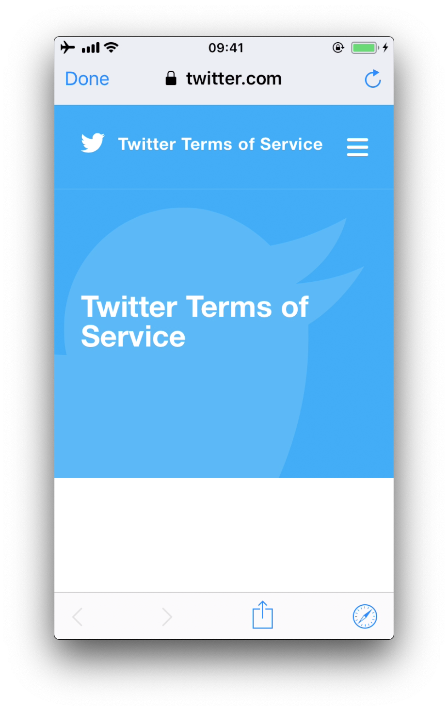
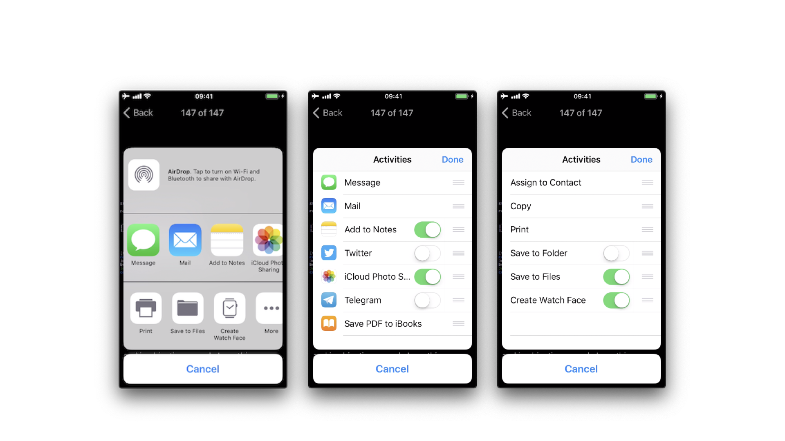
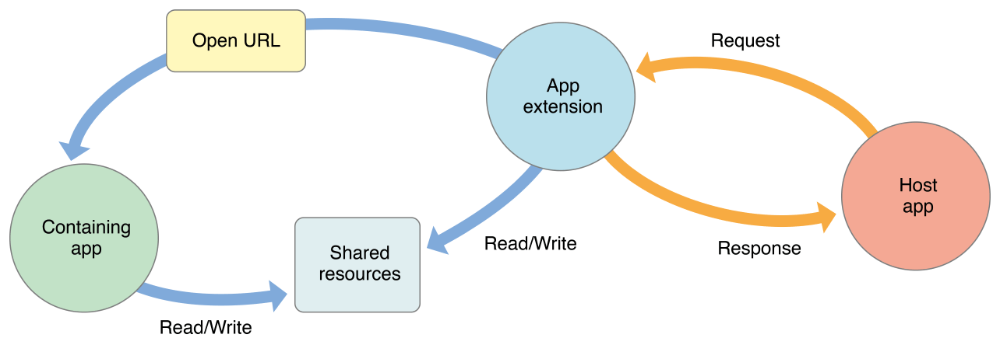

# iOS Platform APIs

## Overview

### Enforced Updating

Enforced updating can be helpful when it comes to public key pinning (see the Testing Network communication for more details) when a pin has to be refreshed due to a certificate/public key rotation. Additionally, vulnerabilities are easily patched by means of forced updates.

The challenge with iOS however, is that Apple does not provide any APIs yet to automate this process, instead, developers will have to create their own mechanism, such as described at various [blogs](https://mobikul.com/show-update-application-latest-version-functionality-ios-app-swift-3/ "Updating version in Swift 3") which boil down to looking up properties of the app using `http://itunes.apple.com/lookup\?id\<BundleId>` or third party libraries, such as [Siren](https://github.com/ArtSabintsev/Siren "Siren") and [react-native-appstore-version-checker](https://www.npmjs.com/package/react-native-appstore-version-checker "Update checker for React"). Most of these implementations will require a certain given version offered by an API or just "latest in the appstore", which means users can be frustrated with having to update the app, even though no business/security need for an update is truly there.

Please note that newer versions of an application will not fix security issues that are living in the backends to which the app communicates. Allowing an app not to communicate with it might not be enough. Having proper API-lifecycle management is key here.
Similarly, when a user is not forced to update, do not forget to test older versions of your app against your API and/or use proper API versioning.

### Object Persistence

There are several ways to persist an object on iOS:

#### Object Encoding

iOS comes with two protocols for object encoding and decoding for Objective-C or `NSObject`s: `NSCoding` and `NSSecureCoding`. When a class conforms to either of the protocols, the data is serialized to `NSData`: a wrapper for byte buffers. Note that `Data` in Swift is the same as `NSData` or its mutable counterpart: `NSMutableData`. The `NSCoding` protocol declares the two methods that must be implemented in order to encode/decode its instance-variables. A class using `NSCoding` needs to implement `NSObject` or be annotated as an @objc class. The `NSCoding` protocol requires to implement encode and init as shown below.

```swift
class CustomPoint: NSObject, NSCoding {

    //required by NSCoding:
    func encode(with aCoder: NSCoder) {
        aCoder.encode(x, forKey: "x")
        aCoder.encode(name, forKey: "name")
    }

    var x: Double = 0.0
    var name: String = ""

    init(x: Double, name: String) {
            self.x = x
            self.name = name
    }

    // required by NSCoding: initialize members using a decoder.
    required convenience init?(coder aDecoder: NSCoder) {
            guard let name = aDecoder.decodeObject(forKey: "name") as? String
                    else {return nil}
            self.init(x:aDecoder.decodeDouble(forKey:"x"),
                                name:name)
    }

    //getters/setters/etc.
}
```

The issue with `NSCoding` is that the object is often already constructed and inserted before you can evaluate the class-type. This allows an attacker to easily inject all sorts of data. Therefore, the `NSSecureCoding` protocol has been introduced. When conforming to [`NSSecureCoding`](https://developer.apple.com/documentation/foundation/NSSecureCoding "NSSecureCoding") you need to include:

```swift

static var supportsSecureCoding: Bool {
        return true
}
```

when `init(coder:)` is part of the class. Next, when decoding the object, a check should be made, e.g.:

```swift
let obj = decoder.decodeObject(of:MyClass.self, forKey: "myKey")
```

The conformance to `NSSecureCoding` ensures that objects being instantiated are indeed the ones that were expected. However, there are no additional integrity checks done over the data and the data is not encrypted. Therefore, any secret data needs additional encryption and data of which the integrity must be protected, should get an additional HMAC.

Note, when `NSData` (Objective-C) or the keyword `let` (Swift) is used: then the data is immutable in memory and cannot be easily removed.

#### Object Archiving with NSKeyedArchiver

`NSKeyedArchiver` is a concrete subclass of `NSCoder` and provides a way to encode objects and store them in a file. The `NSKeyedUnarchiver` decodes the data and recreates the original data. Let's take the example of the `NSCoding` section and now archive and unarchive them:

```swift

// archiving:
NSKeyedArchiver.archiveRootObject(customPoint, toFile: "/path/to/archive")

// unarchiving:
guard let customPoint = NSKeyedUnarchiver.unarchiveObjectWithFile("/path/to/archive") as?
    CustomPoint else { return nil }

```

When decoding a keyed archive, because values are requested by name, values can be decoded out of sequence or not at all. Keyed archives, therefore, provide better support for forward and backward compatibility. This means that an archive on disk could actually contain additional data which is not detected by the program, unless the key for that given data is provided at a later stage.

Note that additional protection needs to be in place to secure the file in case of confidential data, as the data is not encrypted within the file. See the chapter ["Data Storage on iOS"](0x06d-Testing-Data-Storage.md) for more details.

#### Codable

With Swift 4, the `Codable` type alias arrived: it is a combination of the `Decodable` and `Encodable` protocols. A `String`, `Int`, `Double`, `Date`, `Data` and `URL` are `Codable` by nature: meaning they can easily be encoded and decoded without any additional work. Let's take the following example:

```swift
struct CustomPointStruct:Codable {
    var x: Double
    var name: String
}
```

By adding `Codable` to the inheritance list for the `CustomPointStruct` in the example, the methods `init(from:)` and `encode(to:)` are automatically supported. Fore more details about the workings of `Codable` check [the Apple Developer Documentation](https://developer.apple.com/documentation/foundation/archives_and_serialization/encoding_and_decoding_custom_types "Encoding and Decoding Custom Types").
The `Codable`s can easily be encoded / decoded into various representations: `NSData` using `NSCoding`/`NSSecureCoding`, JSON, Property Lists, XML, etc. See the subsections below for more details.

#### JSON and Codable

There are various ways to encode and decode JSON within iOS by using different 3rd party libraries:

- [Mantle](https://github.com/Mantle/Mantle "Mantle")
- [JSONModel library](https://github.com/jsonmodel/jsonmodel "JSONModel")
- [SwiftyJSON library](https://github.com/SwiftyJSON/SwiftyJSON "SwiftyJSON")
- [ObjectMapper library](https://github.com/Hearst-DD/ObjectMapper "ObjectMapper library")
- [JSONKit](https://github.com/johnezang/JSONKit "JSONKit")
- [JSONModel](https://github.com/JSONModel/JSONModel "JSONModel")
- [YYModel](https://github.com/ibireme/YYModel "YYModel")
- [SBJson 5](https://github.com/ibireme/YYModel "SBJson 5")
- [Unbox](https://github.com/JohnSundell/Unbox "Unbox")
- [Gloss](https://github.com/hkellaway/Gloss "Gloss")
- [Mapper](https://github.com/lyft/mapper "Mapper")
- [JASON](https://github.com/delba/JASON "JASON")
- [Arrow](https://github.com/freshOS/Arrow "Arrow")

The libraries differ in their support for certain versions of Swift and Objective-C, whether they return (im)mutable results, speed, memory consumption and actual library size.
Again, note in case of immutability: confidential information cannot be removed from memory easily.

Next, Apple provides support for JSON encoding/decoding directly by combining `Codable` together with a `JSONEncoder` and a `JSONDecoder`:

```swift
struct CustomPointStruct: Codable {
    var point: Double
    var name: String
}

let encoder = JSONEncoder()
encoder.outputFormatting = .prettyPrinted

let test = CustomPointStruct(point: 10, name: "test")
let data = try encoder.encode(test)
let stringData = String(data: data, encoding: .utf8)

// stringData = Optional ({
// "point" : 10,
// "name" : "test"
// })
```

JSON itself can be stored anywhere, e.g., a (NoSQL) database or a file. You just need to make sure that any JSON that contains secrets has been appropriately protected (e.g., encrypted/HMACed). See the chapter ["Data Storage on iOS"](0x06d-Testing-Data-Storage.md) for more details.

#### Property Lists and Codable

You can persist objects to _property lists_ (also called plists in previous sections). You can find two examples below of how to use it:

```swift

// archiving:
let data = NSKeyedArchiver.archivedDataWithRootObject(customPoint)
NSUserDefaults.standardUserDefaults().setObject(data, forKey: "customPoint")

// unarchiving:

if let data = NSUserDefaults.standardUserDefaults().objectForKey("customPoint") as? NSData {
    let customPoint = NSKeyedUnarchiver.unarchiveObjectWithData(data)
}

```

In this first example, the `NSUserDefaults` are used, which is the primary _property list_. We can do the same with the `Codable` version:

```swift
struct CustomPointStruct: Codable {
        var point: Double
        var name: String
    }

    var points: [CustomPointStruct] = [
        CustomPointStruct(point: 1, name: "test"),
        CustomPointStruct(point: 2, name: "test"),
        CustomPointStruct(point: 3, name: "test"),
    ]

    UserDefaults.standard.set(try? PropertyListEncoder().encode(points), forKey: "points")
    if let data = UserDefaults.standard.value(forKey: "points") as? Data {
        let points2 = try? PropertyListDecoder().decode([CustomPointStruct].self, from: data)
    }
```

Note that **`plist` files are not meant to store secret information**. They are designed to hold user preferences for an app.

#### XML

There are multiple ways to do XML encoding. Similar to JSON parsing, there are various third party libraries, such as:

- [Fuzi](https://github.com/cezheng/Fuzi "Fuzi")
- [Ono](https://github.com/mattt/Ono "Ono")
- [AEXML](https://github.com/tadija/AEXML "AEXML")
- [RaptureXML](https://github.com/ZaBlanc/RaptureXML "RaptureXML")
- [SwiftyXMLParser](https://github.com/yahoojapan/SwiftyXMLParser "SwiftyXMLParser")
- [SWXMLHash](https://github.com/drmohundro/SWXMLHash "SWXMLHash")

They vary in terms of speed, memory usage, object persistence and more important: differ in how they handle XML external entities. See [XXE in the Apple iOS Office viewer](https://nvd.nist.gov/vuln/detail/CVE-2015-3784 "CVE-2015-3784") as an example. Therefore, it is key to disable external entity parsing if possible. See the [OWASP XXE prevention cheatsheet](https://cheatsheetseries.owasp.org/cheatsheets/XML_External_Entity_Prevention_Cheat_Sheet.html "XXE Prevention Cheatsheet") for more details.
Next to the libraries, you can make use of Apple's [`XMLParser` class](https://developer.apple.com/documentation/foundation/xmlparser "XMLParser")

When not using third party libraries, but Apple's `XMLParser`, be sure to let `shouldResolveExternalEntities` return `false`.

#### Object-Relational Mapping (CoreData and Realm)

There are various ORM-like solutions for iOS. The first one is [Realm](https://www.mongodb.com/docs/atlas/device-sdks/sdk/swift/realm-files/), which comes with its own storage engine. Realm has settings to encrypt the data as explained in [Realm's documentation](https://www.mongodb.com/docs/atlas/device-sdks/sdk/swift/realm-files/encrypt-a-realm/). This allows for handling secure data. Note that the encryption is turned off by default.

Apple itself supplies `CoreData`, which is well explained in the [Apple Developer Documentation](https://developer.apple.com/library/archive/documentation/Cocoa/Conceptual/CoreData/index.html#//apple_ref/doc/uid/TP40001075-CH2-SW1, "CoreData"). It supports various storage backends as described in [Apple's Persistent Store Types and Behaviors documentation](https://developer.apple.com/library/archive/documentation/Cocoa/Conceptual/CoreData/PersistentStoreFeatures.html "PersistentStoreFeatures"). The issue with the storage backends recommended by Apple, is that none of the type of data stores is encrypted, nor checked for integrity. Therefore, additional actions are necessary in case of confidential data. An alternative can be found in [project iMas](https://github.com/project-imas/encrypted-core-data "Encrypted Core Data"), which does supply out of the box encryption.

#### Protocol Buffers

[Protocol Buffers](https://developers.google.com/protocol-buffers/ "Google Documentation") by Google, are a platform- and language-neutral mechanism for serializing structured data by means of the [Binary Data Format](https://developers.google.com/protocol-buffers/docs/encoding "Protocol Buffers Encoding"). They are available for iOS by means of the [Protobuf](https://github.com/apple/swift-protobuf "Apple\'s swift-protobuf Plugin and Runtime library") library.
There have been a few vulnerabilities with Protocol Buffers, such as [CVE-2015-5237](https://www.cvedetails.com/cve/CVE-2015-5237/ "CVE-2015-5237").
Note that **Protocol Buffers do not provide any protection for confidentiality** as no built-in encryption is available.

### WebViews

WebViews are in-app browser components for displaying interactive web content. They can be used to embed web content directly into an app's user interface. iOS WebViews support JavaScript execution by default, so script injection and Cross-Site Scripting attacks can affect them.

#### Types of WebViews

There are multiple ways to include a WebView in an iOS application:

- `UIWebView`
- `WKWebView`
- `SFSafariViewController`

##### UIWebView

[`UIWebView`](https://developer.apple.com/reference/uikit/uiwebview "UIWebView") is deprecated starting on iOS 12 and [should not be used](https://medium.com/ios-os-x-development/security-flaw-with-uiwebview-95bbd8508e3c "Security Flaw with UIWebView"). Make sure that either `WKWebView` or `SFSafariViewController` are used to embed web content. In addition to that, JavaScript cannot be disabled for `UIWebView` which is another reason to refrain from using it.

##### WKWebView

[`WKWebView`](https://developer.apple.com/reference/webkit/wkwebview "WKWebView") was introduced with iOS 8 and is the appropriate choice for extending app functionality, controlling displayed content (i.e., prevent the user from navigating to arbitrary URLs) and customizing.

`WKWebView` comes with several security advantages over `UIWebView`:

- JavaScript is enabled by default but thanks to the `javaScriptEnabled` property of `WKWebView`, it can be completely disabled, preventing all script injection flaws.
- The `JavaScriptCanOpenWindowsAutomatically` can be used to prevent JavaScript from opening new windows, such as pop-ups.
- The `hasOnlySecureContent` property can be used to verify resources loaded by the WebView are retrieved through encrypted connections.
- `WKWebView` implements out-of-process rendering, so memory corruption bugs won't affect the main app process.

A JavaScript Bridge can be enabled when using `WKWebView` and `UIWebView`. See Section ["Native Functionality Exposed Through WebViews"](#native-functionality-exposed-through-webviews "Native Functionality Exposed Through WebViews") below for more information.

##### SFSafariViewController

[`SFSafariViewController`](https://developer.apple.com/documentation/safariservices/sfsafariviewcontroller "SFSafariViewController") is available starting on iOS 9 and should be used to provide a generalized web viewing experience. These WebViews can be easily spotted as they have a characteristic layout which includes the following elements:

- A read-only address field with a security indicator.
- An Action ("Share") button.
- A Done button, back and forward navigation buttons, and a "Safari" button to open the page directly in Safari.



There are a couple of things to consider:

- JavaScript cannot be disabled in `SFSafariViewController` and this is one of the reasons why the usage of `WKWebView` is recommended when the goal is extending the app's user interface.
- `SFSafariViewController` also shares cookies and other website data with Safari.
- The user's activity and interaction with a `SFSafariViewController` are not visible to the app, which cannot access AutoFill data, browsing history, or website data.
- According to the App Store Review Guidelines, `SFSafariViewController`s may not be hidden or obscured by other views or layers.

This should be sufficient for an app analysis and therefore, `SFSafariViewController`s are out of scope for the Static and Dynamic Analysis sections.

#### Safari Web Inspector

Enabling Safari web inspection on iOS allows you to inspect the contents of a WebView remotely from a macOS device. By default, you can view the contents of any page loaded into the Safari app because the Safari app has the `get-task-allowed` entitlement. Applications installed from the App store will however not have this entitlement, and so cannot be attached to. On jailbroken devices, this entitlement can be added to any application by installing the [Inspectorplus tweak from the BigBoss repo](http://cydia.saurik.com/package/li.oldman.inspectorplus/ "inspectorplus").

Enabling the [Safari Web Inspector](https://developer.apple.com/library/archive/documentation/AppleApplications/Conceptual/Safari_Developer_Guide/GettingStarted/GettingStarted.html) is especially interesting in applications that expose native APIs using a JavaScript bridge, for example in hybrid applications.

To activate the web inspection you have to follow these steps:

1. On the iOS device open the Settings app: Go to **Safari -> Advanced** and toggle on _Web Inspector_.
2. On the macOS device, open Safari: in the menu bar, go to **Safari -> Preferences -> Advanced** and enable _Show Develop menu in menu bar_.
3. Connect your iOS device to the macOS device and unlock it: the iOS device name should appear in the _Develop_ menu.
4. (If not yet trusted) On macOS's Safari, go to the _Develop_ menu, click on the iOS device name, then on "Use for Development" and enable trust.

To open the web inspector and debug a WebView:

1. In iOS, open the app and navigate to the screen that should contain a WebView.
2. In macOS Safari, go to **Developer -> 'iOS Device Name'** and you should see the name of the WebView based context. Click on it to open the Web Inspector.

Now you're able to debug the WebView as you would with a regular web page on your desktop browser.

#### Native Functionality Exposed Through WebViews

In iOS 7, Apple introduced APIs that allow communication between the JavaScript runtime in the WebView and the native Swift or Objective-C objects. If these APIs are used carelessly, important functionality might be exposed to attackers who manage to inject malicious scripts into the WebView (e.g., through a successful Cross-Site Scripting attack).

Both `UIWebView` and `WKWebView` provide a means of communication between the WebView and the native app. Any important data or native functionality exposed to the WebView JavaScript engine would also be accessible to rogue JavaScript running in the WebView.

**UIWebView:**

There are two fundamental ways of how native code and JavaScript can communicate:

- **JSContext**: When an Objective-C or Swift block is assigned to an identifier in a `JSContext`, JavaScriptCore automatically wraps the block in a JavaScript function.
- **JSExport protocol**: Properties, instance methods and class methods declared in a `JSExport`-inherited protocol are mapped to JavaScript objects that are available to all JavaScript code. Modifications of objects that are in the JavaScript environment are reflected in the native environment.

Note that only class members defined in the `JSExport` protocol are made accessible to JavaScript code.

**WKWebView:**

JavaScript code in a `WKWebView` can still send messages back to the native app but in contrast to `UIWebView`, it is not possible to directly reference the `JSContext` of a `WKWebView`. Instead, communication is implemented using a messaging system and using the `postMessage` function, which automatically serializes JavaScript objects into native Objective-C or Swift objects. Message handlers are configured using the method [`add(_ scriptMessageHandler:name:)`](https://developer.apple.com/documentation/webkit/wkusercontentcontroller/1537172-add "WKUserContentController add(_ scriptMessageHandler:name:)").

### App Permissions

In contrast to Android, where each app runs on its own user ID, iOS makes all third-party apps run under the non-privileged `mobile` user. Each app has a unique home directory and is sandboxed, so that they cannot access protected system resources or files stored by the system or by other apps. These restrictions are implemented via sandbox policies (aka. _profiles_), which are enforced by the [Trusted BSD (MAC) Mandatory Access Control Framework](http://www.trustedbsd.org/mac.html "TrustedBSD Mandatory Access Control (MAC) Framework") via a kernel extension. iOS applies a generic sandbox profile to all third-party apps called _container_. Access to protected resources or data (some also known as [app capabilities](https://developer.apple.com/support/app-capabilities/ "Advanced App Capabilities")) is possible, but it's strictly controlled via special permissions known as _entitlements_.

Some permissions can be configured by the app's developers (e.g. Data Protection or Keychain Sharing) and will directly take effect after the installation. However, for others, the user will be explicitly asked the first time the app attempts to access a protected resource, [for example](https://developer.apple.com/library/archive/documentation/iPhone/Conceptual/iPhoneOSProgrammingGuide/ExpectedAppBehaviors/ExpectedAppBehaviors.html#//apple_ref/doc/uid/TP40007072-CH3-SW7 "Data and resources protected by system authorization settings"):

- Bluetooth peripherals
- Calendar data
- Camera
- Contacts
- Health sharing
- Health updating
- HomeKit
- Location
- Microphone
- Motion
- Music and the media library
- Photos
- Reminders
- Siri
- Speech recognition
- the TV provider

Even though Apple urges to protect the privacy of the user and to be [very clear on how to ask permissions](https://developer.apple.com/design/human-interface-guidelines/privacy "Requesting Permission"), it can still be the case that an app requests too many of them for non-obvious reasons.

Verifying the use of some permissions such as Camera, Photos, Calendar Data, Motion, Contacts or Speech Recognition should be pretty straightforward as it should be obvious if the app requires them to fulfill its tasks. Let's consider the following examples regarding the Photos permission, which, if granted, gives the app access to all user photos in the "Camera Roll" (the iOS default system-wide location for storing photos):

- The typical QR Code scanning app obviously requires the camera to function but might be requesting the photos permission as well. If storage is explicitly required, and depending on the sensitivity of the pictures being taken, these apps might better opt to use the app sandbox storage to avoid other apps (having the photos permission) to access them. See the chapter ["Data Storage on iOS"](0x06d-Testing-Data-Storage.md) for more information regarding storage of sensitive data.
- Some apps require photo uploads (e.g. for profile pictures). Recent versions of iOS introduce new APIs such as [`UIImagePickerController`](https://developer.apple.com/documentation/uikit/uiimagepickercontroller "UIImagePickerController") (iOS 11+) and its modern [replacement](https://developer.apple.com/videos/play/wwdc2020/10652/ "replacement") [`PHPickerViewController`](https://developer.apple.com/documentation/photokit/phpickerviewcontroller "PHPickerViewController") (iOS 14+). These APIs run on a separate process from your app and by using them, the app gets read-only access exclusively to the images selected by the user instead of to the whole "Camera Roll". This is considered a best practice to avoid requesting unnecessary permissions.

Verifying other permissions like Bluetooth or Location require a deeper source code inspection. They may be required for the app to properly function but the data being handled by those tasks might not be properly protected.

When collecting or simply handling (e.g. caching) sensitive data, an app should provide proper mechanisms to give the user control over it, e.g. to be able to revoke access or to delete it. However, sensitive data might not only be stored or cached but also sent over the network. In both cases, it has to be ensured that the app properly follows the appropriate best practices, which in this case involve implementing proper data protection and transport security. More information on how to protect this kind of data can be found in the chapter "Network APIs".

As you can see, using app capabilities and permissions mostly involve handling personal data, therefore being a matter of protecting the user's privacy. See the articles ["Protecting the User's Privacy"](https://developer.apple.com/documentation/uikit/core_app/protecting_the_user_s_privacy "Protecting the User\'s Privacy") and ["Accessing Protected Resources"](https://developer.apple.com/documentation/uikit/core_app/protecting_the_user_s_privacy/accessing_protected_resources?language=objc "Accessing Protected Resources") in Apple Developer Documentation for more details.

#### Device Capabilities

Device capabilities are used by the App Store to ensure that only compatible devices are listed and therefore are allowed to download the app. They are specified in the `Info.plist` file of the app under the [`UIRequiredDeviceCapabilities`](https://developer.apple.com/library/archive/documentation/General/Reference/InfoPlistKeyReference/Articles/iPhoneOSKeys.html#//apple_ref/doc/plist/info/UIRequiredDeviceCapabilities "UIRequiredDeviceCapabilities") key.

```xml
<key>UIRequiredDeviceCapabilities</key>
<array>
    <string>arm64</string>
</array>
```

> Typically you'll find the `arm64` capability, meaning that the app is compiled for the arm64 instruction set.

For example, an app might be completely dependent on NFC to work (e.g. a ["NFC Tag Reader"](https://itunes.apple.com/us/app/nfc-taginfo-by-nxp/id1246143596 "NFC TagInfo by NXP") app). According to the [archived iOS Device Compatibility Reference](https://developer.apple.com/library/archive/documentation/DeviceInformation/Reference/iOSDeviceCompatibility/DeviceCompatibilityMatrix/DeviceCompatibilityMatrix.html "iOS Device Compatibility Matrix"), NFC is only available starting on the iPhone 7 (and iOS 11). A developer might want to exclude all incompatible devices by setting the `nfc` device capability.

Regarding testing, you can consider `UIRequiredDeviceCapabilities` as a mere indication that the app is using some specific resources. Unlike the entitlements related to app capabilities, device capabilities do not confer any right or access to protected resources. Additional configuration steps might be required for that, which are very specific to each capability.

For example, if BLE is a core feature of the app, Apple's [Core Bluetooth Programming Guide](https://developer.apple.com/library/archive/documentation/NetworkingInternetWeb/Conceptual/CoreBluetooth_concepts/CoreBluetoothOverview/CoreBluetoothOverview.html#//apple_ref/doc/uid/TP40013257-CH2-SW1 "Core Bluetooth Overview") explains the different things to be considered:

- The `bluetooth-le` device capability can be set in order to _restrict_ non-BLE capable devices from downloading their app.
- App capabilities like `bluetooth-peripheral` or `bluetooth-central` (both `UIBackgroundModes`) should be added if [BLE background processing](https://developer.apple.com/library/archive/documentation/NetworkingInternetWeb/Conceptual/CoreBluetooth_concepts/CoreBluetoothBackgroundProcessingForIOSApps/PerformingTasksWhileYourAppIsInTheBackground.html "Core Bluetooth Background Processing for iOS Apps") is required.

However, this is not yet enough for the app to get access to the Bluetooth peripheral, the `NSBluetoothPeripheralUsageDescription` key has to be included in the `Info.plist` file, meaning that the user has to actively give permission. See "Purpose Strings in the Info.plist File" below for more information.

#### Entitlements

According to [Apple's iOS Security Guide](https://www.apple.com/business/site/docs/iOS_Security_Guide.pdf "iOS Security Guide"):

> Entitlements are key value pairs that are signed in to an app and allow authentication beyond runtime factors, like UNIX user ID. Since entitlements are digitally signed, they can't be changed. Entitlements are used extensively by system apps and daemons to perform specific privileged operations that would otherwise require the process to run as root. This greatly reduces the potential for privilege escalation by a compromised system app or daemon.

Many entitlements can be set using the "Summary" tab of the Xcode target editor. Other entitlements require editing a target's entitlements property list file or are inherited from the iOS provisioning profile used to run the app.

[Entitlement Sources](https://developer.apple.com/library/archive/technotes/tn2415/_index.html#//apple_ref/doc/uid/DTS40016427-CH1-SOURCES "Entitlement Sources"):

1. Entitlements embedded in a provisioning profile that is used to code sign the app, which are composed of:
   - Capabilities defined on the Xcode project's target Capabilities tab, and/or:
   - Enabled Services on the app's App ID which are configured on the Identifiers section of the Certificates, ID's and Profiles website.
   - Other entitlements that are injected by the profile generation service.
2. Entitlements from a code signing entitlements file.

[Entitlement Destinations](https://developer.apple.com/library/archive/technotes/tn2415/_index.html#//apple_ref/doc/uid/DTS40016427-CH1-DESTINATIONS "Entitlement Destinations"):

1. The app's signature.
2. The app's embedded provisioning profile.

The [Apple Developer Documentation](https://developer.apple.com/library/archive/technotes/tn2415/_index.html#//apple_ref/doc/uid/DTS40016427-CH1-APPENTITLEMENTS "Inspect the entitlements of a built app") also explains:

- During code signing, the entitlements corresponding to the app's enabled Capabilities/Services are transferred to the app's signature from the provisioning profile Xcode chose to sign the app.
- The provisioning profile is embedded into the app bundle during the build (`embedded.mobileprovision`).
- Entitlements from the "Code Signing Entitlements" section in Xcode's "Build Settings" tab are transferred to the app's signature.

For example, if you want to set the "Default Data Protection" capability, you would need to go to the **Capabilities** tab in Xcode and enable **Data Protection**. This is directly written by Xcode to the `<appname>.entitlements` file as the `com.apple.developer.default-data-protection` entitlement with default value `NSFileProtectionComplete`. In the IPA we might find this in the `embedded.mobileprovision` as:

```xml
<key>Entitlements</key>
<dict>
    ...
    <key>com.apple.developer.default-data-protection</key>
    <string>NSFileProtectionComplete</string>
</dict>
```

For other capabilities such as HealthKit, the user has to be asked for permission, therefore it is not enough to add the entitlements, special keys and strings have to be added to the `Info.plist` file of the app.

#### Purpose Strings in the Info.plist File

[_Purpose strings_](https://developer.apple.com/documentation/uikit/core_app/protecting_the_user_s_privacy/accessing_protected_resources?language=objc#3037322 "Provide a Purpose String") or_usage description strings_ are custom texts that are offered to users in the system's permission request alert when requesting permission to access protected data or resources.


If linking on or after iOS 10, developers are required to include purpose strings in their app's [`Info.plist`](https://developer.apple.com/library/archive/documentation/iPhone/Conceptual/iPhoneOSProgrammingGuide/ExpectedAppBehaviors/ExpectedAppBehaviors.html#//apple_ref/doc/uid/TP40007072-CH3-SW5 "The Information Property List File") file. Otherwise, if the app attempts to access protected data or resources without having provided the corresponding purpose string, [the access will fail and the app might even crash](https://developer.apple.com/documentation/uikit/core_app/protecting_the_user_s_privacy/accessing_protected_resources?language=objc "Accessing Protected Resources").

For an overview of the different _purpose strings Info.plist keys_ available see Table 1-2 at the [Apple App Programming Guide for iOS](https://developer.apple.com/library/archive/documentation/iPhone/Conceptual/iPhoneOSProgrammingGuide/ExpectedAppBehaviors/ExpectedAppBehaviors.html#//apple_ref/doc/uid/TP40007072-CH3-SW7 "Data and resources protected by system authorization settings"). Click on the provided links to see the full description of each key in the [CocoaKeys reference](https://developer.apple.com/library/archive/documentation/General/Reference/InfoPlistKeyReference/Articles/CocoaKeys.html "Cocoa Keys").

#### Code Signing Entitlements File

Certain capabilities require a [code signing entitlements file](https://developer.apple.com/library/archive/technotes/tn2415/_index.html#//apple_ref/doc/uid/DTS40016427-CH1-ENTITLEMENTSFILE "Code Signing Entitlements files") (`<appname>.entitlements`). It is automatically generated by Xcode but may be manually edited and/or extended by the developer as well.

Here is an example of entitlements file of the [open source app Telegram](https://github.com/peter-iakovlev/Telegram-iOS/blob/77ee5c4dabdd6eb5f1e2ff76219edf7e18b45c00/Telegram-iOS/Telegram-iOS-AppStoreLLC.entitlements#L23 "Telegram-iOS-AppStoreLLC.entitlements Line 23") including the [App Groups entitlement](https://developer.apple.com/documentation/foundation/com_apple_security_application-groups "App Groups entitlement") (`application-groups`):

```xml
<?xml version="1.0" encoding="UTF-8"?>
<!DOCTYPE plist PUBLIC "-//Apple//DTD PLIST 1.0//EN" "http://www.apple.com/DTDs/PropertyList-1.0.dtd">
<plist version="1.0">
<dict>
...
    <key>com.apple.security.application-groups</key>
    <array>
        <string>group.ph.telegra.Telegraph</string>
    </array>
</dict>
...
</plist>
```

The entitlement outlined above does not require any additional permissions from the user. However, it is always a good practice to check all entitlements, as the app might overask the user in terms of permissions and thereby leak information.

As documented at [Apple Developer Documentation](https://developer.apple.com/library/archive/documentation/Miscellaneous/Reference/EntitlementKeyReference/Chapters/EnablingAppSandbox.html#//apple_ref/doc/uid/TP40011195-CH4-SW19 "Adding an App to an App Group"), the App Groups entitlement is required to share information between different apps through IPC or a shared file container, which means that data can be shared on the device directly between the apps.
This entitlement is also required if an app extension requires to [share information with its containing app](https://developer.apple.com/library/archive/documentation/General/Conceptual/ExtensibilityPG/ExtensionScenarios.html "Sharing Data with Your Containing App").

Depending on the data to-be-shared it might be more appropriate to share it using another method such as through a backend where this data could be potentially verified, avoiding tampering by e.g. the user themselves.

### Inter-Process Communication (IPC)

During implementation of a mobile application, developers may apply traditional techniques for IPC (such as using shared files or network sockets). The IPC system functionality offered by mobile application platforms should be used because it is much more mature than traditional techniques. Using IPC mechanisms with no security in mind may cause the application to leak or expose sensitive data.

In contrast to Android's rich Inter-Process Communication (IPC) capability, iOS offers some rather limited options for communication between apps. In fact, there's no way for apps to communicate directly. In this section we will present the different types of indirect communication offered by iOS and how to test them. Here's an overview:

- Custom URL Schemes
- Universal Links
- UIActivity Sharing
- App Extensions
- UIPasteboard

#### Custom URL Schemes

Custom URL schemes [allow apps to communicate via a custom protocol](https://developer.apple.com/library/content/documentation/iPhone/Conceptual/iPhoneOSProgrammingGuide/Inter-AppCommunication/Inter-AppCommunication.html#//apple_ref/doc/uid/TP40007072-CH6-SW1 "Using URL Schemes to Communicate with Apps"). An app must declare support for the schemes and handle incoming URLs that use those schemes.

Apple warns about the improper use of custom URL schemes in the [Apple Developer Documentation](https://developer.apple.com/documentation/uikit/core_app/allowing_apps_and_websites_to_link_to_your_content/defining_a_custom_url_scheme_for_your_app "Defining a Custom URL Scheme for Your App"):

> URL schemes offer a potential attack vector into your app, so make sure to validate all URL parameters and discard any malformed URLs. In addition, limit the available actions to those that do not risk the user's data. For example, do not allow other apps to directly delete content or access sensitive information about the user. When testing your URL-handling code, make sure your test cases include improperly formatted URLs.

They also suggest using universal links instead, if the purpose is to implement deep linking:

> While custom URL schemes are an acceptable form of deep linking, universal links are strongly recommended as a best practice.

Supporting a custom URL scheme is done by:

- defining the format for the app's URLs,
- registering the scheme so that the system directs appropriate URLs to the app,
- handling the URLs that the app receives.

Security issues arise when an app processes calls to its URL scheme without properly validating the URL and its parameters and when users aren't prompted for confirmation before triggering an important action.

One example is the following [bug in the Skype Mobile app](https://www.dhanjani.com/blog/2010/11/insecure-handling-of-url-schemes-in-apples-ios.html "Insecure Handling of URL Schemes in Apple's iOS"), discovered in 2010: The Skype app registered the `skype://` protocol handler, which allowed other apps to trigger calls to other Skype users and phone numbers. Unfortunately, Skype didn't ask users for permission before placing the calls, so any app could call arbitrary numbers without the user's knowledge. Attackers exploited this vulnerability by putting an invisible `<iframe src="skype://xxx?call"></iframe>` (where `xxx` was replaced by a premium number), so any Skype user who inadvertently visited a malicious website called the premium number.

As a developer, you should carefully validate any URL before calling it. You can allow only certain applications which may be opened via the registered protocol handler. Prompting users to confirm the URL-invoked action is another helpful control.

All URLs are passed to the app delegate, either at launch time or while the app is running or in the background. To handle incoming URLs, the delegate should implement methods to:

- retrieve information about the URL and decide whether you want to open it,
- open the resource specified by the URL.

More information can be found in the [archived App Programming Guide for iOS](https://developer.apple.com/library/archive/documentation/iPhone/Conceptual/iPhoneOSProgrammingGuide/Inter-AppCommunication/Inter-AppCommunication.html#//apple_ref/doc/uid/TP40007072-CH6-SW13 "Handling URL Requests") and in the [Apple Secure Coding Guide](https://developer.apple.com/library/archive/documentation/Security/Conceptual/SecureCodingGuide/Articles/ValidatingInput.html "Validating Input and Interprocess Communication").

In addition, an app may also want to send URL requests (aka. queries) to other apps. This is done by:

- registering the application query schemes that the app wants to query,
- optionally querying other apps to know if they can open a certain URL,
- sending the URL requests.

#### Universal Links

Universal links are the iOS equivalent to Android App Links (aka. Digital Asset Links) and are used for deep linking. When tapping a universal link (to the app's website), the user will seamlessly be redirected to the corresponding installed app without going through Safari. If the app isn't installed, the link will open in Safari.

Universal links are standard web links (HTTP/HTTPS) and are not to be confused with custom URL schemes, which originally were also used for deep linking.

For example, the Telegram app supports both custom URL schemes and universal links:

- `tg://resolve?domain=fridadotre` is a custom URL scheme and uses the `tg://` scheme.
- `https://telegram.me/fridadotre` is a universal link and uses the `https://` scheme.

Both result in the same action, the user will be redirected to the specified chat in Telegram ("fridadotre" in this case). However, universal links give several key benefits that are not applicable when using custom URL schemes and are the recommended way to implement deep linking, according to the [Apple Developer Documentation](https://developer.apple.com/library/archive/documentation/General/Conceptual/AppSearch/UniversalLinks.html "Universal Links"). Specifically, universal links are:

- **Unique**: Unlike custom URL schemes, universal links can't be claimed by other apps, because they use standard HTTP or HTTPS links to the app's website. They were introduced as a way to _prevent_ URL scheme hijacking attacks (an app installed after the original app may declare the same scheme and the system might target all new requests to the last installed app).
- **Secure**: When users install the app, iOS downloads and checks a file (the Apple App Site Association or AASA) that was uploaded to the web server to make sure that the website allows the app to open URLs on its behalf. Only the legitimate owners of the URL can upload this file, so the association of their website with the app is secure.
- **Flexible**: Universal links work even when the app is not installed. Tapping a link to the website would open the content in Safari, as users expect.
- **Simple**: One URL works for both the website and the app.
- **Private**: Other apps can communicate with the app without needing to know whether it is installed.

You can learn more about Universal Links in the post ["Learning about Universal Links and Fuzzing URL Schemes on iOS with Frida"](https://grepharder.github.io/blog/0x03_learning_about_universal_links_and_fuzzing_url_schemes_on_ios_with_frida.html "Learning about Universal Links and Fuzzing URL Schemes on iOS with Frida") by Carlos Holguera.

#### UIActivity Sharing

Starting on iOS 6 it is possible for third-party apps to share data (items) via specific mechanisms [like AirDrop, for example](https://developer.apple.com/library/archive/documentation/iPhone/Conceptual/iPhoneOSProgrammingGuide/Inter-AppCommunication/Inter-AppCommunication.html#//apple_ref/doc/uid/TP40007072-CH6-SW3 "Supporting AirDrop"). From a user perspective, this feature is the well-known system-wide "Share Activity Sheet" that appears after clicking on the "Share" button.



The available built-in sharing mechanisms (aka. Activity Types) include:

- airDrop
- assignToContact
- copyToPasteboard
- mail
- message
- postToFacebook
- postToTwitter

A full list can be found in [UIActivity.ActivityType](https://developer.apple.com/documentation/uikit/uiactivity/activitytype "UIActivity ActivityType"). If not considered appropriate for the app, the developers have the possibility to exclude some of these sharing mechanisms.

#### App extensions

Together with iOS 8, Apple introduced App Extensions. According to [Apple App Extension Programming Guide](https://developer.apple.com/library/archive/documentation/General/Conceptual/ExtensibilityPG/index.html#//apple_ref/doc/uid/TP40014214-CH20-SW1 "App Extensions Increase Your Impact"), app extensions let apps offer custom functionality and content to users while they're interacting with other apps or the system. In order to do this, they implement specific, well scoped tasks like, for example, define what happens after the user clicks on the "Share" button and selects some app or action, provide the content for a Today widget or enable a custom keyboard.

Depending on the task, the app extension will have a particular type (and only one), the so-called _extension points_. Some notable ones are:

- Custom Keyboard: replaces the iOS system keyboard with a custom keyboard for use in all apps.
- Share: post to a sharing website or share content with others.
- Today: also called widgets, they offer content or perform quick tasks in the Today view of Notification Center.

##### How do app extensions interact with other apps

There are three important elements here:

- App extension: is the one bundled inside a containing app. Host apps interact with it.
- Host app: is the (third-party) app that triggers the app extension of another app.
- Containing app: is the app that contains the app extension bundled into it.

For example, the user selects text in the _host app_, clicks on the "Share" button and selects one "app" or action from the list. This triggers the _app extension_ of the _containing app_. The app extension displays its view within the context of the host app and uses the items provided by the host app, the selected text in this case, to perform a specific task (post it on a social network, for example). See this picture from the [Apple App Extension Programming Guide](https://developer.apple.com/library/archive/documentation/General/Conceptual/ExtensibilityPG/ExtensionOverview.html#//apple_ref/doc/uid/TP40014214-CH2-SW13 "An app extension can communicate indirectly with its containing app") which pretty good summarizes this:



##### Security Considerations

From the security point of view it is important to note that:

- An app extension does never communicate directly with its containing app (typically, it isn't even running while the contained app extension is running).
- An app extension and the host app communicate via inter-process communication.
- An app extension's containing app and the host app don't communicate at all.
- A Today widget (and no other app extension type) can ask the system to open its containing app by calling the `openURL:completionHandler:` method of the `NSExtensionContext` class.
- Any app extension and its containing app can access shared data in a privately defined shared container.

In addition:

- App extensions cannot access some APIs, for example, HealthKit.
- They cannot receive data using AirDrop but do can send data.
- No long-running background tasks are allowed but uploads or downloads can be initiated.
- App extensions cannot access the camera or microphone on an iOS device (except for iMessage app extensions).

#### Pasteboard

Using the [`UIPasteboard`](https://developer.apple.com/documentation/uikit/uipasteboard) API, apps can access the iOS pasteboard, allowing them to share data either within the app or across apps. However, the system-wide nature of the general pasteboard raises privacy and security concerns, especially when sensitive data is copied programmatically without user interaction.

There are two types of pasteboards:

- **General pasteboard (`UIPasteboard.general`)**: Shared across all foreground apps and, with [Universal Clipboard](https://support.apple.com/en-us/102430), potentially across Apple devices. It is persistent by default across device restarts and app reinstalls unless cleared. As of iOS 16, the general pasteboard requires user interaction for access.
- **Custom or Named Pasteboards (`UIPasteboard(name:create:)` and `UIPasteboard.withUniqueName()`)**: These are [private pasteboards](https://developer.apple.com/library/archive/documentation/StringsTextFonts/Conceptual/TextAndWebiPhoneOS/UsingCopy%2CCut%2CandPasteOperations/UsingCopy%2CCut%2CandPasteOperations.html) that are app- or team-specific, i.e., restricted to the app that created them or other apps from the same team ID. They are non-persistent by default since iOS 10 (deleted upon app termination and system reboot). Apple discourages the use of persistent custom pasteboards and recommends [using App Groups](https://developer.apple.com/documentation/Xcode/configuring-app-groups) for sharing data between apps of the same developer.

The iOS pasteboard API has gone through multiple changes which can impact both the user's privacy and security:

- Since iOS 9, access to the pasteboard has been restricted to apps running in the foreground, which significantly reduces the risk of passive clipboard sniffing. However, if sensitive data remains on the pasteboard and a malicious app is brought to the foreground later (or an app widget that remains in the foreground whenever the user is on the screen where it's located), the app can access that data without the user's consent or knowledge. See the [example attack](https://www.thedailybeast.com/facebook-is-spying-on-your-clipboard).
- Since iOS 10, Universal Clipboard is enabled by default and, when a user signs into iCloud, automatically syncs the general pasteboard content across the user's nearby Apple devices using the same iCloud account. Developers can choose to disable this by restricting the contents of the general pasteboard to the local device using `UIPasteboard.localOnly`. Additionally, they may set expiration times for pasteboard items using `UIPasteboard.expirationDate`.
- Since iOS 14, **the system notifies the user** when an app reads general pasteboard content that was written by a different app without user intent. The system determines user intent based on user interactions, such as tapping a system-provided button or selecting **Paste** from the contextual menu.
- Since iOS 16, the system prompts users with a paste confirmation dialog whenever an app accesses pasteboard content. Therefore, any access to the general pasteboard must be explicitly triggered by user interaction. Apps can also use [`UIPasteControl`](https://developer.apple.com/documentation/uikit/uipastecontrol) to handle paste actions by presenting a special "paste" button whenever they detect compatible data. This isn't necessarily better or more secure; it's an improvement to the user experience. It avoids prompting the user every time, but the user still needs to click, so access occurs only in response to user interaction.
