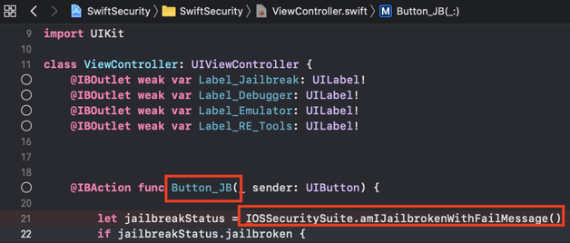

## iOS Anti-Reversing Defenses

### Jailbreak Detection (MSTG-RESILIENCE-1)

#### Overview

Jailbreak detection mechanisms are added to reverse engineering defense to make running the app on a jailbroken device more difficult. This blocks some of the tools and techniques reverse engineers like to use. Like most other types of defense, jailbreak detection is not very effective by itself, but scattering checks throughout the app's source code can improve the effectiveness of the overall anti-tampering scheme. A [list of typical jailbreak detection techniques for iOS was published by Trustwave](https://www.trustwave.com/Resources/SpiderLabs-Blog/Jailbreak-Detection-Methods/ "Jailbreak Detection Methods on the Trustware Spiderlabs Blog").

##### File-based Checks

Check for files and directories typically associated with jailbreaks, such as:

```text
/Applications/Cydia.app
/Applications/FakeCarrier.app
/Applications/Icy.app
/Applications/IntelliScreen.app
/Applications/MxTube.app
/Applications/RockApp.app
/Applications/SBSettings.app
/Applications/WinterBoard.app
/Applications/blackra1n.app
/Library/MobileSubstrate/DynamicLibraries/LiveClock.plist
/Library/MobileSubstrate/DynamicLibraries/Veency.plist
/Library/MobileSubstrate/MobileSubstrate.dylib
/System/Library/LaunchDaemons/com.ikey.bbot.plist
/System/Library/LaunchDaemons/com.saurik.Cydia.Startup.plist
/bin/bash
/bin/sh
/etc/apt
/etc/ssh/sshd_config
/private/var/lib/apt
/private/var/lib/cydia
/private/var/mobile/Library/SBSettings/Themes
/private/var/stash
/private/var/tmp/cydia.log
/usr/bin/sshd
/usr/libexec/sftp-server
/usr/libexec/ssh-keysign
/usr/sbin/sshd
/var/cache/apt
/var/lib/apt
/var/lib/cydia
/usr/sbin/frida-server
/usr/bin/cycript
/usr/local/bin/cycript
/usr/lib/libcycript.dylib
```

##### Checking File Permissions

Another way to check for jailbreaking mechanisms is to try to write to a location that's outside the application's sandbox. You can do this by having the application attempt to create a file in, for example, the `/private directory`. If the file is created successfully, the device has been jailbroken.

```objc
NSError *error;
NSString *stringToBeWritten = @"This is a test.";
[stringToBeWritten writeToFile:@"/private/jailbreak.txt" atomically:YES
         encoding:NSUTF8StringEncoding error:&error];
if(error==nil){
   //Device is jailbroken
   return YES;
 } else {
   //Device is not jailbroken
   [[NSFileManager defaultManager] removeItemAtPath:@"/private/jailbreak.txt" error:nil];
 }
```

##### Checking Protocol Handlers

You can check protocol handlers by attempting to open a Cydia URL. The Cydia app store, which practically every jailbreaking tool installs by default, installs the cydia:// protocol handler.

```objc
if([[UIApplication sharedApplication] canOpenURL:[NSURL URLWithString:@"cydia://package/com.example.package"]]){
```

##### Calling System APIs

Calling the `system` function with a "NULL" argument on a non-jailbroken device will return "0"; doing the same thing on a jailbroken device will return "1". This difference is due to the function's checking for access to `/bin/sh` on jailbroken devices only.

#### Bypassing Jailbreak Detection

Once you start an application that has jailbreak detection enabled on a jailbroken device, you'll notice one of the following things:

1. The application closes immediately, without any notification.
2. A pop-up window indicates that the application won't run on a jailbroken device.

In the first case, make sure the application is fully functional on non-jailbroken devices. The application may be crashing or it may have a bug that causes it to terminate. This may happen while you're testing a preproduction version of the application.

Let's look at bypassing jailbreak detection using the Damn Vulnerable iOS application as an example again. After loading the binary into Hopper, you need to wait until the application is fully disassembled (look at the top bar to check the status). Then look for the "jail" string in the search box. You'll see two classes: `SFAntiPiracy` and `JailbreakDetectionVC`. You may want to decompile the functions to see what they are doing and, in particular, what they return.


As you can see, there's a class method (`+[SFAntiPiracy isTheDeviceJailbroken]`) and an instance method (`-[JailbreakDetectionVC isJailbroken]`). The main difference is that we can inject Cycript in the app and call the class method directly, whereas the instance method requires first looking for instances of the target class. The function `choose` will look in the memory heap for known signatures of a given class and return an array of instances. Putting an application into a desired state (so that the class is indeed instantiated) is important.

Let's inject Cycript into our process (look for your PID with `top`):

```shell
iOS8-jailbreak:~ root# cycript -p 12345
cy# [SFAntiPiracy isTheDeviceJailbroken]
true
```

As you can see, our class method was called directly, and it returned "true". Now, let's call the `-[JailbreakDetectionVC isJailbroken]` instance method. First, we have to call the `choose` function to look for instances of the `JailbreakDetectionVC` class.

```shell
cy# a=choose(JailbreakDetectionVC)
[]
```

Oops! The return value is an empty array. That means that there are no instances of this class registered in the runtime. In fact, we haven't clicked the second "Jailbreak Test" button, which initializes this class:

```shell
cy# a=choose(JailbreakDetectionVC)
[#"<JailbreakDetectionVC: 0x14ee15620>"]
cy# [a[0] isJailbroken]
True
```


Now you understand why having your application in a desired state is important. At this point, bypassing jailbreak detection with Cycript is trivial. We can see that the function returns a boolean; we just need to replace the return value. We can replace the return value by replacing the function implementation with Cycript. Please note that this will actually replace the function under its given name, so beware of side effects if the function modifies anything in the application:

```shell
cy# JailbreakDetectionVC.prototype.isJailbroken=function(){return false}
cy# [a[0] isJailbroken]
false
```


In this case we have bypassed the jailbreak detection of the application!

Now, imagine that the application is closing immediately after detecting that the device is jailbroken. You don't have time to launch Cycript and replace the function implementation. Instead, you have to use CydiaSubstrate, employ a proper hooking function like `MSHookMessageEx`, and compile the tweak. There are [good sources](http://delaat.net/rp/2015-2016/p51/report.pdf "Jailbreak/Root Detection Evasion Study on iOS and Android") for how to do this; however, by using Frida, we can more easily perform early instrumentation and we can build on our gathered skills from previous tests.

One feature of Frida that we will use to bypass jailbreak detection is so-called early instrumentation, that is, we will replace function implementation at startup.

1. Make sure that `frida-server` is running on your iOS Device.
2. Make sure that `Frida` is [installed]( https://www.frida.re/docs/installation/ "Frida Installation") on your workstation.
3. The iOS device must be connected via USB cable.
4. Use `frida-trace` on your workstation:

```shell
$ frida-trace -U -f /Applications/DamnVulnerableIOSApp.app/DamnVulnerableIOSApp  -m "-[JailbreakDetectionVC isJailbroken]"
```

This will start DamnVulnerableIOSApp, trace calls to `-[JailbreakDetectionVC isJailbroken]`, and create a JavaScript hook with the `onEnter` and `onLeave` callback functions. Now, replacing the return value via `value.replace` is trivial, as shown in the following example:

```JavaScript
    onLeave: function (log, retval, state) {
    console.log("Function [JailbreakDetectionVC isJailbroken] originally returned:"+ retval);
    retval.replace(0);  
      console.log("Changing the return value to:"+retval);
    }
```

This will provide the following output:

```shell
$ frida-trace -U -f /Applications/DamnVulnerableIOSApp.app/DamnVulnerableIOSApp  -m "-[JailbreakDetectionVC isJailbroken]:"

Instrumenting functions...                                           `...
-[JailbreakDetectionVC isJailbroken]: Loaded handler at "./__handlers__/__JailbreakDetectionVC_isJailbroken_.js"
Started tracing 1 function. Press Ctrl+C to stop.
Function [JailbreakDetectionVC isJailbroken] originally returned:0x1
Changing the return value to:0x0
           /* TID 0x303 */
  6890 ms  -[JailbreakDetectionVC isJailbroken]
Function [JailbreakDetectionVC isJailbroken] originally returned:0x1
Changing the return value to:0x0
 22475 ms  -[JailbreakDetectionVC isJailbroken]
```

Note the two calls to `-[JailbreakDetectionVC isJailbroken]`, which correspond to two physical taps on the app's GUI.

One more way to bypass Jailbreak detection mechanisms that rely on file system checks is objection. You can find the implementation of the jailbreak bypass in the [jailbreak.ts script](https://github.com/sensepost/objection/blob/master/agent/src/ios/jailbreak.ts "jailbreak.ts").

See below a Python script for hooking Objective-C methods and native functions:

```python
import frida
import sys

try:
    session = frida.get_usb_device().attach("Target Process")
except frida.ProcessNotFoundError:
    print "Failed to attach to the target process. Did you launch the app?"
    sys.exit(0);

script = session.create_script("""

    // Handle fork() based check

    var fork = Module.findExportByName("libsystem_c.dylib", "fork");

    Interceptor.replace(fork, new NativeCallback(function () {
        send("Intercepted call to fork().");
        return -1;
    }, 'int', []));

    var system = Module.findExportByName("libsystem_c.dylib", "system");

    Interceptor.replace(system, new NativeCallback(function () {
        send("Intercepted call to system().");
        return 0;
    }, 'int', []));

    // Intercept checks for Cydia URL handler

    var canOpenURL = ObjC.classes.UIApplication["- canOpenURL:"];

    Interceptor.attach(canOpenURL.implementation, {
        onEnter: function(args) {
          var url = ObjC.Object(args[2]);
          send("[UIApplication canOpenURL:] " + path.toString());
          },
        onLeave: function(retval) {
            send ("canOpenURL returned: " + retval);
        }

    });

    // Intercept file existence checks via [NSFileManager fileExistsAtPath:]

    var fileExistsAtPath = ObjC.classes.NSFileManager["- fileExistsAtPath:"];
    var hideFile = 0;

    Interceptor.attach(fileExistsAtPath.implementation, {
        onEnter: function(args) {
          var path = ObjC.Object(args[2]);
          // send("[NSFileManager fileExistsAtPath:] " + path.toString());

          if (path.toString() == "/Applications/Cydia.app" || path.toString() == "/bin/bash") {
            hideFile = 1;
          }
        },
        onLeave: function(retval) {
            if (hideFile) {
                send("Hiding jailbreak file...");MM
                retval.replace(0);
                hideFile = 0;
            }

            // send("fileExistsAtPath returned: " + retval);
      }
    });


    /* If the above doesn't work, you might want to hook low level file APIs as well

        var openat = Module.findExportByName("libsystem_c.dylib", "openat");
        var stat = Module.findExportByName("libsystem_c.dylib", "stat");
        var fopen = Module.findExportByName("libsystem_c.dylib", "fopen");
        var open = Module.findExportByName("libsystem_c.dylib", "open");
        var faccesset = Module.findExportByName("libsystem_kernel.dylib", "faccessat");

    */

""")

def on_message(message, data):
    if 'payload' in message:
            print(message['payload'])

script.on('message', on_message)
script.load()
sys.stdin.read()
```

### Testing Anti-Debugging Detection (MSTG-RESILIENCE-2)

#### Overview

Exploring applications using a debugger is a very powerful technique during reversing. You can not only track variables containing sensitive data and modify the control flow of the application, but also read and modify memory and registers.

There are several anti-debugging techniques applicable to iOS which can be categorized as preventive or as reactive, a few of them are discussed below. As a first line of defense, you can use preventive techniques impede the debugger from attaching to the application at all. Additionally, you can also apply reactive techniques which allow the application to detect the presence of a debugger and have a chance to diverge from normal behavior. When properly distributed throughout the app, these techniques act as a secondary or supportive measure to increate the overall resilience.

Application developers of apps processing highly sensitive data should be very aware of the fact that preventing debugging is virtually impossible. A very determined attacker (or one with sufficient privileges) will eventually manage to bypass all your anti-debugging checks as they usually consist of patching the app binary or simply putting some dynamic hooks with e.g. Frida.

While [according to Apple](https://developer.apple.com/library/archive/qa/qa1361/_index.html "Detecting the Debugger") "you should restrict use of the above code to the debug build of your program", [research shows that many App Store apps often include these checks](https://seredynski.com/articles/a-security-review-of-1300-appstore-applications.html "A security review of 1,300 AppStore applications - 5 April 2020").

##### Using ptrace

As seen in chapter "[Tampering and Reverse Engineering on iOS](Document/0x06c-Reverse-Engineering-and-Tampering.md#debugging)", the iOS XNU kernel implements a `ptrace` system call that's lacking most of the functionality required to properly debug a process (e.g. it allows attaching/stepping but not read/write of memory and registers).

Nevertheless, the iOS implementation of the `ptrace` syscall contains a nonstandard and very useful feature: preventing the debugging of processes. This feature is implemented as the `PT_DENY_ATTACH` request, as described in the [official BSD System Calls Manual](https://developer.apple.com/library/archive/documentation/System/Conceptual/ManPages_iPhoneOS/man2/ptrace.2.html "PTRACE(2)"). In simple words, it ensures that no other debugger can attach to the calling process; if a debugger attempts to attach, the process will terminate. Using `PT_DENY_ATTACH` is a fairly well-known anti-debugging technique, so you may encounter it often during iOS pentests.

> Before diving into the details, it is important to know that `ptrace` is not part of the public iOS API. Non-public APIs are prohibited, and the App Store may reject apps that include them. Because of this, `ptrace` is not directly called in the code; it's called when a `ptrace` function pointer is obtained via `dlsym`.

The following is an example implementation of the above logic:

```objc
#import <dlfcn.h>
#import <sys/types.h>
#import <stdio.h>
typedef int (*ptrace_ptr_t)(int _request, pid_t _pid, caddr_t _addr, int _data);
void anti_debug() {
  ptrace_ptr_t ptrace_ptr = (ptrace_ptr_t)dlsym(RTLD_SELF, "ptrace");
  ptrace_ptr(31, 0, 0, 0); // PTRACE_DENY_ATTACH = 31
}
```

To demonstrate how to bypass this technique we'll use an example of a disassembled binary that implements this approach:


Let's break down what's happening in the binary. `dlsym` is called with `ptrace` as the second argument (register R1). The return value in register R0 is moved to register R6 at offset 0x1908A. At offset 0x19098, the pointer value in register R6 is called using the BLX R6 instruction. To disable the `ptrace` call, we need to replace the instruction `BLX R6` (0xB0 0x47 in Little Endian) with the `NOP` (0x00 0xBF in Little Endian) instruction. After patching, the code will be similar to the following:


[Armconverter.com](http://armconverter.com/ "Armconverter") is a handy tool for conversion between byte-code and instruction mnemonics.

See other different variants of ptrace-based anti-debugging techniques in [this article](https://alexomara.com/blog/defeating-anti-debug-techniques-macos-ptrace-variants/ "Defeating Anti-Debug Techniques: macOS ptrace variants").

##### Using sysctl

Another approach to detecting a debugger that's attached to the calling process involves `sysctl`. According to the Apple documentation, it allows processes to set system information (if having the appropriate privileges) to simply to retrieve system information (such as whether the process is being debugged). However, note that just the fact that an app uses `sysctl` might be an indicator of anti-debugging but this [won't be always the case](http://www.cocoawithlove.com/blog/2016/03/08/swift-wrapper-for-sysctl.html "Gathering system information in Swift with sysctl").

The following example from the [Apple Documentation Archive](https://developer.apple.com/library/content/qa/qa1361/_index.html "How do I determine if I\'m being run under the debugger?") checks the `info.kp_proc.p_flag` flag returned by the call to `sysctl` with the appropriate parameters:

```C
#include <assert.h>
#include <stdbool.h>
#include <sys/types.h>
#include <unistd.h>
#include <sys/sysctl.h>

static bool AmIBeingDebugged(void)
    // Returns true if the current process is being debugged (either
    // running under the debugger or has a debugger attached post facto).
{
    int                 junk;
    int                 mib[4];
    struct kinfo_proc   info;
    size_t              size;

    // Initialize the flags so that, if sysctl fails for some bizarre
    // reason, we get a predictable result.

    info.kp_proc.p_flag = 0;

    // Initialize mib, which tells sysctl the info we want, in this case
    // we're looking for information about a specific process ID.

    mib[0] = CTL_KERN;
    mib[1] = KERN_PROC;
    mib[2] = KERN_PROC_PID;
    mib[3] = getpid();

    // Call sysctl.

    size = sizeof(info);
    junk = sysctl(mib, sizeof(mib) / sizeof(*mib), &info, &size, NULL, 0);
    assert(junk == 0);

    // We're being debugged if the P_TRACED flag is set.

    return ( (info.kp_proc.p_flag & P_TRACED) != 0 );
}
```

One way to bypass this check is by patching the binary. When the code above is compiled, the disassembled version of the second half of the code is similar to the following:


After the instruction at offset 0xC13C, `MOVNE R0, #1` is patched and changed to `MOVNE R0, #0` (0x00 0x20 in in byte-code), the patched code is similar to the following:


You can also bypass a `sysctl` check by using the debugger itself and setting a breakpoint at the call to `sysctl`. This approach is demonstrated in [iOS Anti-Debugging Protections #2](https://www.coredump.gr/articles/ios-anti-debugging-protections-part-2/ "iOS Anti-Debugging Protections #2").

#### Using getppid

Applications on iOS can detect if they have been started by a debugger by checking their parent PID. Normally, an application is started by the [launchd](http://newosxbook.com/articles/Ch07.pdf) process, which is the first process running in the _user mode_ and has PID=1. However, if a debugger starts an application, we can observe that `getppid` returns a PID different than 1. This detection technique can be implemented in native code (via syscalls), using Objective-C or Swift as shown here:

```swift
func AmIBeingDebugged() -> Bool {
    return getppid() != 1
}
```

Similarly to the other techniques, this has also a trivial bypass (e.g. by patching the binary or by using Frida hooks).

### File Integrity Checks (MSTG-RESILIENCE-3 and MSTG-RESILIENCE-11)

#### Overview

There are two topics related to file integrity:

 1. _Application source code integrity checks:_ In the "Tampering and Reverse Engineering" chapter, we discussed the iOS IPA application signature check. We also saw that determined reverse engineers can easily bypass this check by re-packaging and re-signing an app using a developer or enterprise certificate. One way to make this harder is to add an internal runtime check that determines whether the signatures still match at runtime.

 2. _File storage integrity checks:_ When files are stored by the application, key-value pairs in the Keychain, `UserDefaults`/`NSUserDefaults`, a SQLite database, or a Realm database, their integrity should be protected.

##### Sample Implementation - Application Source Code

Apple takes care of integrity checks with DRM. However, additional controls (such as in the example below) are possible. The `mach_header` is parsed to calculate the start of the instruction data, which is used to generate the signature. Next, the signature is compared to the given signature. Make sure that the generated signature is stored or coded somewhere else.

```c
int xyz(char *dst) {
    const struct mach_header * header;
    Dl_info dlinfo;

    if (dladdr(xyz, &dlinfo) == 0 || dlinfo.dli_fbase == NULL) {
        NSLog(@" Error: Could not resolve symbol xyz");
        [NSThread exit];
    }

    while(1) {

        header = dlinfo.dli_fbase;  // Pointer on the Mach-O header
        struct load_command * cmd = (struct load_command *)(header + 1); // First load command
        // Now iterate through load command
        //to find __text section of __TEXT segment
        for (uint32_t i = 0; cmd != NULL && i < header->ncmds; i++) {
            if (cmd->cmd == LC_SEGMENT) {
                // __TEXT load command is a LC_SEGMENT load command
                struct segment_command * segment = (struct segment_command *)cmd;
                if (!strcmp(segment->segname, "__TEXT")) {
                    // Stop on __TEXT segment load command and go through sections
                    // to find __text section
                    struct section * section = (struct section *)(segment + 1);
                    for (uint32_t j = 0; section != NULL && j < segment->nsects; j++) {
                        if (!strcmp(section->sectname, "__text"))
                            break; //Stop on __text section load command
                        section = (struct section *)(section + 1);
                    }
                    // Get here the __text section address, the __text section size
                    // and the virtual memory address so we can calculate
                    // a pointer on the __text section
                    uint32_t * textSectionAddr = (uint32_t *)section->addr;
                    uint32_t textSectionSize = section->size;
                    uint32_t * vmaddr = segment->vmaddr;
                    char * textSectionPtr = (char *)((int)header + (int)textSectionAddr - (int)vmaddr);
                    // Calculate the signature of the data,
                    // store the result in a string
                    // and compare to the original one
                    unsigned char digest[CC_MD5_DIGEST_LENGTH];
                    CC_MD5(textSectionPtr, textSectionSize, digest);     // calculate the signature
                    for (int i = 0; i < sizeof(digest); i++)             // fill signature
                        sprintf(dst + (2 * i), "%02x", digest[i]);

                    // return strcmp(originalSignature, signature) == 0;    // verify signatures match

                    return 0;
                }
            }
            cmd = (struct load_command *)((uint8_t *)cmd + cmd->cmdsize);
        }
    }

}
```

##### Sample Implementation - Storage

When ensuring the integrity of the application storage itself, you can create an HMAC or signature over either a given key-value pair or a file stored on the device. The CommonCrypto implementation is best for creating an HMAC.
If you need encryption, make sure that you encrypt and then HMAC as described in [Authenticated Encryption](https://cseweb.ucsd.edu/~mihir/papers/oem.html "Authenticated Encryption: Relations among notions and analysis of the generic composition paradigm").

When you generate an HMAC with CC:

1. Get the data as `NSMutableData`.
2. Get the data key (from the Keychain if possible).
3. Calculate the hash value.
4. Append the hash value to the actual data.
5. Store the results of step 4.

```objc
    // Allocate a buffer to hold the digest and perform the digest.
    NSMutableData* actualData = [getData];
    //get the key from the keychain
    NSData* key = [getKey];
    NSMutableData* digestBuffer = [NSMutableData dataWithLength:CC_SHA256_DIGEST_LENGTH];
    CCHmac(kCCHmacAlgSHA256, [actualData bytes], (CC_LONG)[key length], [actualData bytes], (CC_LONG)[actualData length], [digestBuffer mutableBytes]);
    [actualData appendData: digestBuffer];
```

Alternatively, you can use NSData for steps 1 and 3, but you'll need to create a new buffer for step 4.

When verifying the HMAC with CC, follow these steps:

1. Extract the message and the hmacbytes as separate `NSData`.
2. Repeat steps 1-3 of the procedure for generating an HMAC on the `NSData`.
3. Compare the extracted HMAC bytes to the result of step 1.

```objc
  NSData* hmac = [data subdataWithRange:NSMakeRange(data.length - CC_SHA256_DIGEST_LENGTH, CC_SHA256_DIGEST_LENGTH)];
  NSData* actualData = [data subdataWithRange:NSMakeRange(0, (data.length - hmac.length))];
  NSMutableData* digestBuffer = [NSMutableData dataWithLength:CC_SHA256_DIGEST_LENGTH];
  CCHmac(kCCHmacAlgSHA256, [actualData bytes], (CC_LONG)[key length], [actualData bytes], (CC_LONG)[actualData length], [digestBuffer mutableBytes]);
  return [hmac isEqual: digestBuffer];

```

##### Bypassing File Integrity Checks

###### When you're trying to bypass the application-source integrity checks

1. Patch the anti-debugging functionality and disable the unwanted behavior by overwriting the associated code with NOP instructions.
2. Patch any stored hash that's used to evaluate the integrity of the code.
3. Use Frida to hook file system APIs and return a handle to the original file instead of the modified file.

###### When you're trying to bypass the storage integrity checks

1. Retrieve the data from the device, as described in the "[Device Binding](#device-binding-mstg-resilience-10 "Device Binding")" section.
2. Alter the retrieved data and return it to storage.

#### Effectiveness Assessment

*For the application source code integrity checks*
Run the app on the device in an unmodified state and make sure that everything works. Then apply patches to the executable using optool, re-sign the app as described in the chapter "Basic Security Testing", and run it.
The app should detect the modification and respond in some way. At the very least, the app should alert the user and/or terminate the app. Work on bypassing the defenses and answer the following questions:

- Can the mechanisms be bypassed trivially (e.g., by hooking a single API function)?
- How difficult is identifying the anti-debugging code via static and dynamic analysis?
- Did you need to write custom code to disable the defenses? How much time did you need?
- What is your assessment of the difficulty of bypassing the mechanisms?

*For the storage integrity checks*
A similar approach works. Answer the following questions:

- Can the mechanisms be bypassed trivially (e.g., by changing the contents of a file or a key-value pair)?
- How difficult is obtaining the HMAC key or the asymmetric private key?
- Did you need to write custom code to disable the defenses? How much time did you need?
- What is your assessment of the difficulty of bypassing the mechanisms??

### Testing Reverse Engineering Tools Detection (MSTG-RESILIENCE-4)

#### Overview

The presence of tools, frameworks and apps commonly used by reverse engineers may indicate an attempt to reverse engineer the app. Some of these tools can only run on a jailbroken device, while others force the app into debugging mode or depend on starting a background service on the mobile phone. Therefore, there are different ways that an app may implement to detect a reverse engineering attack and react to it, e.g. by terminating itself.

#### Detection Methods

You can detect popular reverse engineering tools that have been installed in an unmodified form by looking for associated application packages, files, processes, or other tool-specific modifications and artifacts. In the following examples, we'll discuss different ways to detect the Frida instrumentation framework, which is used extensively in this guide and also in the real world. Other tools, such as Cydia Substrate or Cycript, can be detected similarly. Note that injection, hooking and DBI (Dynamic Binary Instrumentation) tools can often be detected implicitly, through runtime integrity checks, which are discussed below.

For instance, Frida runs under the name of frida-server in its default configuration (injected mode) on a jailbroken device. When you explicitly attach to a target app (e.g. via frida-trace or the Frida CLI), Frida injects a frida-agent into the memory of the app. Therefore, you may expect to find it there after attaching to the app (and not before). On Android, verifying this is pretty straightforward as you can simply grep for the string "frida" in the memory maps of the process ID in the `proc` directory (`/proc/<pid>/maps`).
However, on iOS the `proc` directory is not available, but you can list the loaded dynamic libraries in an app with the function `_dyld_image_count`.

Frida may also run in the so-called embedded mode, which also works for non-jailbroken devices. It consists of embedding a [frida-gadget](https://www.frida.re/docs/gadget/ "Frida Gadget") into the IPA and _forcing_ the app to load it as one of its native libraries.

The application's static content, including its ARM-compiled binary and its external libraries, is stored inside the `<Application>.app` directory. If you inspect the content of the `/var/containers/Bundle/Application/<UUID>/<Application>.app` directory, you'll find the embedded frida-gadget as FridaGadget.dylib.

```bash
iPhone:/var/containers/Bundle/Application/AC5DC1FD-3420-42F3-8CB5-E9D77C4B287A/SwiftSecurity.app/Frameworks root# ls -alh
total 87M
drwxr-xr-x 10 _installd _installd  320 Nov 19 06:08 ./
drwxr-xr-x 11 _installd _installd  352 Nov 19 06:08 ../
-rw-r--r--  1 _installd _installd  70M Nov 16 06:37 FridaGadget.dylib
-rw-r--r--  1 _installd _installd 3.8M Nov 16 06:37 libswiftCore.dylib
-rw-r--r--  1 _installd _installd  71K Nov 16 06:37 libswiftCoreFoundation.dylib
-rw-r--r--  1 _installd _installd 136K Nov 16 06:38 libswiftCoreGraphics.dylib
-rw-r--r--  1 _installd _installd  99K Nov 16 06:37 libswiftDarwin.dylib
-rw-r--r--  1 _installd _installd 189K Nov 16 06:37 libswiftDispatch.dylib
-rw-r--r--  1 _installd _installd 1.9M Nov 16 06:38 libswiftFoundation.dylib
-rw-r--r--  1 _installd _installd  76K Nov 16 06:37 libswiftObjectiveC.dylib
```

Looking at these _traces_ that Frida _leaves behind_, you might already imagine that detecting Frida would be a trivial task. And while it is trivial to detect these libraries, it is equally trivial to bypass such a detection. Detection of tools is a cat and mouse game and things can get much more complicated. The following table shortly presents a set of some typical Frida detection methods and a short discussion on their effectiveness.

> Some of the following detection methods are implemented in the [iOS Security Suite](https://github.com/securing/IOSSecuritySuite "iOS Security Suite").

| Method | Description | Discussion |
| --- | --- | --- |
| **Check The Environment For Related Artifacts**  | Artifacts can be packaged files, binaries, libraries, processes, and temporary files. For Frida, this could be the frida-server running in the target (jailbroken) system (the daemon responsible for exposing Frida over TCP) or the frida libraries loaded by the app. | Inspecting running services is not possible for an iOS app on a non-jailbroken device. The Swift method [CommandLine](https://developer.apple.com/documentation/swift/commandline "CommandLine") is not available on iOS to query for information about running processes, but there are unofficial ways, such as by using [NSTask](https://stackoverflow.com/a/56619466 "How can I run Command Line commands or tasks with Swift in iOS?"). Nevertheless when using this method, the app will be rejected during the App Store review process. There is no other public API available to query for running processes or execute system commands within an iOS App. Even if it would be possible, bypassing this would be as easy as just renaming the corresponding Frida artifact (frida-server/frida-gadget/frida-agent). Another way to detect Frida, would be to walk through the list of loaded libraries and check for suspicious ones (e.g. those including "frida" in their names), which can be done by using `_dyld_get_image_name`.
| **Checking For Open TCP Ports** | The frida-server process binds to TCP port 27042 by default. Testing whether this port is open is another method of detecting the daemon. | This method detects frida-server in its default mode, but the listening port can be changed via a command line argument, so bypassing this is very trivial. |
| **Checking For Ports Responding To D-Bus Auth** | `frida-server` uses the D-Bus protocol to communicate, so you can expect it to respond to D-Bus AUTH. Send a D-Bus AUTH message to every open port and check for an answer, hoping that `frida-server` will reveal itself. | This is a fairly robust method of detecting `frida-server`, but Frida offers alternative modes of operation that don't require frida-server. |

Please remember that this table is far from exhaustive. For example, two other possible detection mechanisms are:

- [named pipes](https://en.wikipedia.org/wiki/Named_pipe "Named Pipes") (used by frida-server for external communication), or
- detecting [trampolines](https://en.wikipedia.org/wiki/Trampoline_%28computing%29 "Trampolines") (see "[Prevent bypassing of SSL certificate pinning in iOS applications](https://www.guardsquare.com/en/blog/iOS-SSL-certificate-pinning-bypassing "Prevent bypassing of SSL certificate pinning in iOS applications")" for further explanation and sample code for detection of trampolines in an iOS app)

Both would _help_ to detect Substrate or Frida's Interceptor but, for example, won't be effective against Frida's Stalker. Remember that the success of each of these detection methods will depend on whether you're using a jailbroken device, the specific version of the jailbreak and method and/or the version of the tool itself. At the end, this is part of the cat and mouse game of protecting data being processed on an uncontrolled environment (the end user's device).

> It is important to note that these controls are only increasing the complexity of the reverse engineering process. If used, the best approach is to combine the controls cleverly instead of using them individually. However, none of them can assure a 100% effectiveness, as the reverse engineer will always have full access to the device and will therefore always win! You also have to consider that integrating some of the controls into your app might increase the complexity of your app and even have an impact on its performance.

#### Effectiveness Assessment

Launch the app with various reverse engineering tools and frameworks installed on your test device. Include at least the following: Frida, Cydia Substrate, Cycript, SSL Kill Switch and the Needle Agent.

The app should respond in some way to the presence of those tools. For example by:

- Alerting the user and asking for accepting liability.
- Preventing execution by gracefully terminating.
- Securely wiping any sensitive data stored on the device.
- Reporting to a backend server, e.g, for fraud detection.

Next, work on bypassing the detection of the reverse engineering tools and answer the following questions:

- Can the mechanisms be bypassed trivially (e.g., by hooking a single API function)?
- How difficult is identifying the anti reverse engineering code via static and dynamic analysis?
- Did you need to write custom code to disable the defenses? How much time did you need?
- What is your assessment of the difficulty of bypassing the mechanisms?

The following steps should guide you when bypassing detection of reverse engineering tools:

1. Patch the anti reverse engineering functionality. Disable the unwanted behavior by patching the binary through usage of radare2/Cutter or Ghidra.
2. Use Frida or Cydia Substrate to hook file system APIs on the Objective-C/Swift or native layers. Return a handle to the original file, not the modified file.

Refer to the chapter [Tampering and Reverse Engineering on iOS](0x06c-Reverse-Engineering-and-Tampering.md)" for examples of patching and code injection.

### Testing Emulator Detection (MSTG-RESILIENCE-5)

#### Overview

The goal of emulator detection is to increase the difficulty of running the app on an emulated device. This forces the reverse engineer to defeat the emulator checks or utilize the physical device, thereby barring the access required for large-scale device analysis.

However, this is not a concern on iOS. As discussed in the section [Testing on the iOS Simulator](0x06b-Basic-Security-Testing.md "Testing on the iOS Simulator") in the basic security testing chapter, the only available simulator is the one that ships with Xcode. Simulator binaries are compiled to x86 code instead of ARM code and apps compiled for a real device (ARM architecture) don't run in the simulator. This makes the simulator useless for black box analysis and reverse engineering.

### Testing Obfuscation (MSTG-RESILIENCE-9)

#### Overview

Obfuscation is the process of transforming code and data to make it more difficult to comprehend. It is an integral part of every software protection scheme. What's important to understand is that obfuscation isn't something that can be simply turned on or off. Programs can be made incomprehensible, in whole or in part, in many ways and to different degrees.

#### SwiftShield

> Warning: SwiftShield irreversibly overwrites all your source files. Ideally, you should have it run only on your CI server, and on release builds.

[SwiftShield](https://github.com/rockbruno/swiftshield "SwiftShield") is a tool that generates irreversible, encrypted names for your iOS project's objects (including your Pods and Storyboards). This raises the bar for reverse engineers and will produce less helpful output when using reverse engineering tools such as class-dump and Frida.

A sample Swift project is used to demonstrate the usage of SwiftShield.

1. Check out <https://github.com/sushi2k/SwiftSecurity>.
2. Open the project in Xcode and make sure that the project is building successfully (Product / Build or Apple-Key + B).
3. [Download](https://github.com/rockbruno/swiftshield/releases "SwiftShield Download") the latest release of SwiftShield and unzip it.
4. Go to the directory where you downloaded SwiftShield and copy the swiftshield executable to `/usr/local/bin`:

```bash
$ cp swiftshield/swiftshield /usr/local/bin/
```

5. In your terminal go into the SwiftSecurity directory (which you checked out in step 1) and execute the command swiftshield (which you downloaded in step 3):

```bash
$ cd SwiftSecurity
$ swiftshield -automatic -project-root . -automatic-project-file SwiftSecurity.xcodeproj -automatic-project-scheme SwiftSecurity
SwiftShield 3.4.0
Automatic mode
Building project to gather modules and compiler arguments...
-- Indexing ReverseEngineeringToolsChecker.swift --
Found declaration of ReverseEngineeringToolsChecker (s:13SwiftSecurity30ReverseEngineeringToolsCheckerC)
Found declaration of amIReverseEngineered (s:13SwiftSecurity30ReverseEngineeringToolsCheckerC20amIReverseEngineeredSbyFZ)
Found declaration of checkDYLD (s:13SwiftSecurity30ReverseEngineeringToolsCheckerC9checkDYLD33_D6FE91E9C9AEC4D13973F8ABFC1AC788LLSbyFZ)
Found declaration of checkExistenceOfSuspiciousFiles (s:13SwiftSecurity30ReverseEngineeringToolsCheckerC31checkExistenceOfSuspiciousFiles33_D6FE91E9C9AEC4D13973F8ABFC1AC788LLSbyFZ)
...
```

SwiftShield is now detecting class and method names and is replacing their identifier with an encrypted value.

In the original source code you can see all the class and method identifiers:



SwiftShield was now replacing all of them with encrypted values that leave no trace to their original name or intention of the class/method:


After executing `swiftshield` a new directory will be created called `swiftshield-output`. In this directory another directory is created with a timestamp in the folder name. This directory contains a text file called `conversionMap.txt`, that maps the encrypted strings to their original values.

```bash
$ cat conversionMap.txt
//
// SwiftShield Conversion Map
// Automatic mode for SwiftSecurity, 2020-01-02 13.51.03
// Deobfuscate crash logs (or any text file) by running:
// swiftshield -deobfuscate CRASH_FILE -deobfuscate_map THIS_FILE
//

ViewController ===> hTOUoUmUcEZUqhVHRrjrMUnYqbdqWByU
viewDidLoad ===> DLaNRaFbfmdTDuJCPFXrGhsWhoQyKLnO
sceneDidBecomeActive ===> SUANAnWpkyaIWlGUqwXitCoQSYeVilGe
AppDelegate ===> KftEWsJcctNEmGuvwZGPbusIxEFOVcIb
Deny_Debugger ===> lKEITOpOvLWCFgSCKZdUtpuqiwlvxSjx
Button_Emulator ===> akcVscrZFdBBYqYrcmhhyXAevNdXOKeG
```

This is needed for [deobfuscating encrypted crash logs](https://github.com/rockbruno/swiftshield#-deobfuscating-encrypted-crash-logs "Deobfuscating encrypted Crash logs").

Another example project is available in SwiftShield's [Github repo](https://github.com/rockbruno/swiftshield/tree/master/SwiftShieldExample "SwiftShieldExample"), that can be used to test the execution of SwiftShield.

#### Effectiveness Assessment

Attempt to disassemble the Mach-O in the IPA and any included library files in the "Frameworks" directory (.dylib or .framework files), and perform static analysis. At the very least, the app's core functionality (i.e., the functionality meant to be obfuscated) shouldn't be easily discerned. Verify that:

- meaningful identifiers, such as class names, method names, and variable names, have been discarded.
- string resources and strings in binaries are encrypted.
- code and data related to the protected functionality is encrypted, packed, or otherwise concealed.

For a more detailed assessment, you need a detailed understanding of the relevant threats and the obfuscation methods used.

### Device Binding (MSTG-RESILIENCE-10)

#### Overview

The purpose of device binding is to impede an attacker who tries to copy an app and its state from device A to device B and continue the execution of the app on device B. After device A has been determined trusted, it may have more privileges than device B. This situation shouldn't change when an app is copied from device A to device B.

[Since iOS 7.0](https://developer.apple.com/library/content/releasenotes/General/RN-iOSSDK-7.0/index.html "iOS 7 release notes"), hardware identifiers (such as MAC addresses) are off-limits. The ways to bind an application to a device are based on `identifierForVendor`, storing something in the Keychain, or using Google's InstanceID for iOS. See the "[Remediation](#remediation "Remediation")" section for more details.

#### Static Analysis

When the source code is available, there are a few bad coding practices you can look for, such as

- MAC addresses: there are several ways to find the MAC address. When you use `CTL_NET` (a network subsystem) or `NET_RT_IFLIST` (getting the configured interfaces) or when the mac-address gets formatted, you'll often see formatting code for printing, such as `"%x:%x:%x:%x:%x:%x"`.
- using the UDID: `[[[UIDevice currentDevice] identifierForVendor] UUIDString];` and `UIDevice.current.identifierForVendor?.uuidString` in Swift3.
- Any Keychain- or filesystem-based binding, which isn't protected by `SecAccessControlCreateFlags` or and doesn't use protection classes, such as `kSecAttrAccessibleAlways` and `kSecAttrAccessibleAlwaysThisDeviceOnly`.

#### Dynamic Analysis

There are several ways to test the application binding.

##### Dynamic Analysis with A Simulator

Take the following steps when you want to verify app-binding in a simulator:

1. Run the application on a simulator.
2. Make sure you can raise the trust in the application instance (e.g., authenticate in the app).
3. Retrieve the data from the Simulator:
    - Because simulators use UUIDs to identify themselves, you can make locating the storage easier by creating a debug point and executing `po NSHomeDirectory()` on that point, which will reveal the location of the simulator's stored contents. You can also execute `find ~/Library/Developer/CoreSimulator/Devices/ | grep <appname>` for the suspected plist file.
    - Go to the directory indicated by the given command's output.
    - Copy all three found folders (Documents, Library, tmp).
    - Copy the contents of the Keychain. Since iOS 8, this has been in `~/Library/Developer/CoreSimulator/Devices/<Simulator Device ID>/data/Library/Keychains`.
4. Start the application on another simulator and find its data location as described in step 3.
5. Stop the application on the second simulator. Overwrite the existing data with the data copied in step 3.
6. Can you continue in an authenticated state? If so, then binding may not be working properly.

We are saying that the binding "may" not be working because not everything is unique in simulators.

##### Dynamic Analysis Using Two Jailbroken Devices

Take the following steps when you want to verify app-binding with two jailbroken devices:

1. Run the app on your jailbroken device.
2. Make sure you can raise the trust in the application instance (e.g., authenticate in the app).
3. Retrieve the data from the jailbroken device:
    - You can SSH into your device and extract the data (as with a simulator, either use debugging or `find /private/var/mobile/Containers/Data/Application/ |grep <name of app>`). The directory is in `/private/var/mobile/Containers/Data/Application/<Application uuid>`.
    - SSH into the directory indicated by the given command's output or use SCP (`scp <ipaddress>:/<folder_found_in_previous_step> targetfolder`) to copy the folders and it's data. You can use an FTP client like Filezilla as well.
    - Retrieve the data from the keychain, which is stored in `/private/var/Keychains/keychain-2.db`, which you can retrieve using the [keychain dumper](https://github.com/ptoomey3/Keychain-Dumper "Keychain Dumper"). First make the keychain world-readable (`chmod +r /private/var/Keychains/keychain-2.db`), then execute it (`./keychain_dumper -a`).
4. Install the application on the second jailbroken device.
5. Overwrite the application data extracted during step 3. The Keychain data must be added manually.
6. Can you continue in an authenticated state? If so, then binding may not be working properly.

#### Remediation

Before we describe the usable identifiers, let's quickly discuss how they can be used for binding. There are three methods for device binding in iOS:

- You can use `[[UIDevice currentDevice] identifierForVendor]` (in Objective-C),  `UIDevice.current.identifierForVendor?.uuidString` (in Swift3), or `UIDevice.currentDevice().identifierForVendor?.UUIDString` (in Swift2). The value of `identifierForVendor` may not be the same if you reinstall the app after other apps from the same vendor are installed and it may change when you update your app bundle's name. Therefore it is best to combine it with something in the Keychain.
- You can store something in the Keychain to identify the application's instance. To make sure that this data is not backed up, use `kSecAttrAccessibleWhenPasscodeSetThisDeviceOnly` (if you want to secure the data and properly enforce a passcode or Touch ID requirement), `kSecAttrAccessibleAfterFirstUnlockThisDeviceOnly`, or `kSecAttrAccessibleWhenUnlockedThisDeviceOnly`.
- You can use Google and its Instance ID for [iOS](https://developers.google.com/instance-id/guides/ios-implementation "iOS implementation Google Instance ID").

Any scheme based on these methods will be more secure the moment a passcode and/or Touch ID is enabled, the materials stored in the Keychain or filesystem are protected with protection classes (such as `kSecAttrAccessibleAfterFirstUnlockThisDeviceOnly` and `kSecAttrAccessibleWhenUnlockedThisDeviceOnly`), and the `SecAccessControlCreateFlags` is set either with `kSecAccessControlDevicePasscode` (for passcodes), `kSecAccessControlUserPresence` (passcode, Face ID or Touch ID), `kSecAccessControlBiometryAny` (Face ID or Touch ID) or `kSecAccessControlBiometryCurrentSet` (Face ID / Touch ID: but current enrolled biometrics only).

### References

- [#geist] Dana Geist, Marat Nigmatullin. Jailbreak/Root Detection Evasion Study on iOS and Android - <http://delaat.net/rp/2015-2016/p51/report.pdf>
- Jan Seredynski. A security review of 1,300 AppStore applications (5 April 2020) - <https://seredynski.com/articles/a-security-review-of-1300-appstore-applications.html>

#### OWASP MASVS

- MSTG-RESILIENCE-1: "The app detects, and responds to, the presence of a rooted or jailbroken device either by alerting the user or terminating the app."
- MSTG-RESILIENCE-2: "The app prevents debugging and/or detects, and responds to, a debugger being attached. All available debugging protocols must be covered."
- MSTG-RESILIENCE-3: "The app detects, and responds to, tampering with executable files and critical data within its own sandbox."
- MSTG-RESILIENCE-4: "The app detects, and responds to, the presence of widely used reverse engineering tools and frameworks on the device."
- MSTG-RESILIENCE-5: "The app detects, and responds to, being run in an emulator."
- MSTG-RESILIENCE-9: "Obfuscation is applied to programmatic defenses, which in turn impede de-obfuscation via dynamic analysis."
- MSTG-RESILIENCE-10: "The app implements a 'device binding' functionality using a device fingerprint derived from multiple properties unique to the device."
- MSTG-RESILIENCE-11: "All executable files and libraries belonging to the app are either encrypted on the file level and/or important code and data segments inside the executables are encrypted or packed. Trivial static analysis does not reveal important code or data."

#### Tools

- Appsync Unified - <https://cydia.angelxwind.net/?page/net.angelxwind.appsyncunified>
- Frida - <http://frida.re/>
- Keychain Dumper - <https://github.com/ptoomey3/Keychain-Dumper>
