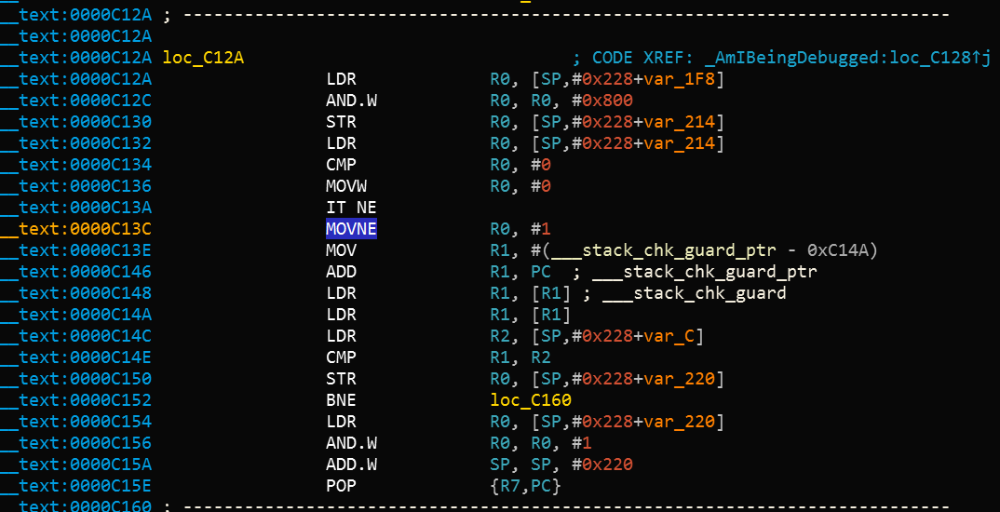

## iOS Anti-Reversing Defenses

### Jailbreak Detection

#### Overview

Jailbreak detection mechanisms are added to reverse engineering defense to make running the app on a jailbroken device more difficult. This blocks some of the tools and techniques reverse engineers like to use. Like most other types of defense, jailbreak detection is not very effective by itself, but scattering checks throughout the app's source code can improve the effectiveness of the overall anti-tampering scheme. A [list of typical jailbreak detection techniques for iOS was published by Trustwave](https://www.trustwave.com/Resources/SpiderLabs-Blog/Jailbreak-Detection-Methods/ "Jailbreak Detection Methods on the Trustware Spiderlabs Blog").

##### File-based Checks

Check for files and directories typically associated with jailbreaks, such as

```
/Applications/Cydia.app
/Applications/FakeCarrier.app
/Applications/Icy.app
/Applications/IntelliScreen.app
/Applications/MxTube.app
/Applications/RockApp.app
/Applications/SBSettings.app
/Applications/WinterBoard.app
/Applications/blackra1n.app
/Library/MobileSubstrate/DynamicLibraries/LiveClock.plist
/Library/MobileSubstrate/DynamicLibraries/Veency.plist
/Library/MobileSubstrate/MobileSubstrate.dylib
/System/Library/LaunchDaemons/com.ikey.bbot.plist
/System/Library/LaunchDaemons/com.saurik.Cydia.Startup.plist
/bin/bash
/bin/sh
/etc/apt
/etc/ssh/sshd_config
/private/var/lib/apt
/private/var/lib/cydia
/private/var/mobile/Library/SBSettings/Themes
/private/var/stash
/private/var/tmp/cydia.log
/usr/bin/sshd
/usr/libexec/sftp-server
/usr/libexec/ssh-keysign
/usr/sbin/sshd
/var/cache/apt
/var/lib/apt
/var/lib/cydia
```

##### Checking File Permissions

Another way to check for jailbreaking mechanisms is to try to write to a location that's outside the application's sandbox. You can do this by having the application attempt to create a file in, for example, the `/private directory`. If the file is created successfully, the device has been jailbroken.

```objective-c
NSError *error;
NSString *stringToBeWritten = @"This is a test.";
[stringToBeWritten writeToFile:@"/private/jailbreak.txt" atomically:YES
         encoding:NSUTF8StringEncoding error:&error];
if(error==nil){
   //Device is jailbroken
   return YES;
 } else {
   //Device is not jailbroken
   [[NSFileManager defaultManager] removeItemAtPath:@"/private/jailbreak.txt" error:nil];
 }
```

##### Checking Protocol Handlers

You can check protocol handlers by attempting to open a Cydia URL. The Cydia app store, which practically every jailbreaking tool installs by default, installs the cydia:// protocol handler.

```
if([[UIApplication sharedApplication] canOpenURL:[NSURL URLWithString:@"cydia://package/com.example.package"]]){
```

##### Calling System APIs

Calling the `system` function with a "NULL" argument on a non-jailbroken device will return "0"; doing the same thing on a jailbroken device will return "1." This difference is due to the function's checking for access to `/bin/sh` on jailbroken devices only.


#### Bypassing Jailbreak Detection

Once you start an application that has jailbreak detection enabled on a jailbroken device, you'll notice one of the following things:

1.	The application closes immediately, without any notification.
2.	A pop-up window indicates that the application won't run on a jailbroken device.

In the first case, make sure the application is fully functional on non-jailbroken devices. The application may be crashing or it may have a bug that causes it to terminate. This may happen while you're testing a preproduction version of the application.

Let's again look at bypassing jailbreak detection using the Damn Vulnerable iOS application as an example. After loading the binary into Hopper, you need to wait until the application is fully disassembled (look at the top bar to check the status). Then look for the "jail" string in the search box. You'll see two classes: `SFAntiPiracy` and `JailbreakDetectionVC`. You may want to decompile the functions to see what they are doing and, in particular, what they return.

 

As you can see, there's a class method (`+[SFAntiPiracy isTheDeviceJailbroken]`) and an instance method (`-[JailbreakDetectionVC isJailbroken]`). The main difference is that we can inject Cycript in the app and call the class method directly, whereas the instance method requires first looking for instances of the target class. The function `choose` will look in the memory heap for known signatures of a given class and return an array of instances. Putting an application into a desired state (so that the class is indeed instantiated) is important.

Let's inject Cycript into our process (look for your PID with `top`):

```
iOS8-jailbreak:~ root# cycript -p 12345
cy# [SFAntiPiracy isTheDeviceJailbroken]
true
```

As you can see, our class method was called directly, and it returned "true." Now, let's call the `-[JailbreakDetectionVC isJailbroken]` instance method. First, we have to call the `choose` function to look for instances of the `JailbreakDetectionVC` class.

```
cy# a=choose(JailbreakDetectionVC)
[]
```

Ooops! The return value is an empty array. That means that there are no instances of this class registered in the runtime. In fact, we haven't clicked the second "Jailbreak Test" button, which initializes this class:

```
cy# a=choose(JailbreakDetectionVC)
[#"<JailbreakDetectionVC: 0x14ee15620>"]
cy# [a[0] isJailbroken]
True
```


Now you understand why having your application in a desired state is important. At this point, bypassing jailbreak detection with Cycript is trivial. We can see that the function returns a boolean; we just need to replace the return value. We can replace the return value by replacing the function implementation with Cycript. Please note that this will actually replace the function under its given name, so beware of side effects if the function modifies anything in the application:

```
cy# JailbreakDetectionVC.prototype.isJailbroken=function(){return false}
cy# [a[0] isJailbroken]
false
```


In this case we have bypassed the jailbreak detection of the application!

Now, imagine that the application is closing immediately after detecting that the device is jailbroken. You don't have time to launch Cycript and replace the function implementation. Instead, you have to use CydiaSubstrate, employ a proper hooking function like `MSHookMessageEx`, and compile the tweak. There are [good sources](http://delaat.net/rp/2015-2016/p51/report.pdf "Jailbreak/Root Detection Evasion Study on iOS and Android") for how to do this; however, we will provide a potentially faster and more flexible approach.

**[Frida](https://www.frida.re/ "Frida")** is a dynamic instrumentation framework that allows you to use a JavaScript API to instrument apps. One feature that we will use to bypass jailbreak detection is so-called early instrumentation, that is, we will replace function implementation at startup.

1.	Make sure that `frida-server` is running on your iDevice.
2.	Make sure that `Frida` is [installed]( https://www.frida.re/docs/installation/ "Frida Installation") on your workstation.
3.	iOS device must be connected via USB cable.
4.	Use `frida-trace` on your workstation:

```
$ frida-trace -U -f /Applications/DamnVulnerableIOSApp.app/DamnVulnerableIOSApp  -m "-[JailbreakDetectionVC isJailbroken]"
```

This will start DamnVulnerableIOSApp, trace calls to `-[JailbreakDetectionVC isJailbroken]`, and create a JavaScript hook with the `onEnter` and `onLeave` callback functions. Now, replacing the return value via `value.replace` is trivial, as shown in the following example:

```JavaScript
    onLeave: function (log, retval, state) {
    console.log("Function [JailbreakDetectionVC isJailbroken] originally returned:"+ retval);
    retval.replace(0);  
      console.log("Changing the return value to:"+retval);
    }
```

This will provide the following output:

```bash
$ frida-trace -U -f /Applications/DamnVulnerableIOSApp.app/DamnVulnerableIOSApp  -m "-[JailbreakDetectionVC isJailbroken]:"

Instrumenting functions...                                           `...
-[JailbreakDetectionVC isJailbroken]: Loaded handler at "./__handlers__/__JailbreakDetectionVC_isJailbroken_.js"
Started tracing 1 function. Press Ctrl+C to stop.                     
Function [JailbreakDetectionVC isJailbroken] originally returned:0x1
Changing the return value to:0x0
           /* TID 0x303 */
  6890 ms  -[JailbreakDetectionVC isJailbroken]
Function [JailbreakDetectionVC isJailbroken] originally returned:0x1
Changing the return value to:0x0
 22475 ms  -[JailbreakDetectionVC isJailbroken]
```

Please note the two calls to `-[JailbreakDetectionVC isJailbroken]`, which correspond to two physical taps on the app's GUI.

Frida is a very powerful and versatile tool. Refer to the [documentation](https://www.frida.re/docs/home/ "Frida Documentation") for more details.

Please see below a Python script for hooking Objective-C methods and native functions:

```python
import frida
import sys

try:
	session = frida.get_usb_device().attach("Target Process")
except frida.ProcessNotFoundError:
	print "Failed to attach to the target process. Did you launch the app?"
	sys.exit(0);

script = session.create_script("""

	// Handle fork() based check

  var fork = Module.findExportByName("libsystem_c.dylib", "fork");

	Interceptor.replace(fork, new NativeCallback(function () {
		send("Intercepted call to fork().");
	    return -1;
	}, 'int', []));

  var system = Module.findExportByName("libsystem_c.dylib", "system");

	Interceptor.replace(system, new NativeCallback(function () {
		send("Intercepted call to system().");
	    return 0;
	}, 'int', []));

	// Intercept checks for Cydia URL handler

	var canOpenURL = ObjC.classes.UIApplication["- canOpenURL:"];

	Interceptor.attach(canOpenURL.implementation, {
		onEnter: function(args) {
		  var url = ObjC.Object(args[2]);
		  send("[UIApplication canOpenURL:] " + path.toString());
		  },
		onLeave: function(retval) {
			send ("canOpenURL returned: " + retval);
	  	}

	});		

	// Intercept file existence checks via [NSFileManager fileExistsAtPath:]

	var fileExistsAtPath = ObjC.classes.NSFileManager["- fileExistsAtPath:"];
	var hideFile = 0;

	Interceptor.attach(fileExistsAtPath.implementation, {
		onEnter: function(args) {
		  var path = ObjC.Object(args[2]);
		  // send("[NSFileManager fileExistsAtPath:] " + path.toString());

		  if (path.toString() == "/Applications/Cydia.app" || path.toString() == "/bin/bash") {
		  	hideFile = 1;
		  }
		},
		onLeave: function(retval) {
			if (hideFile) {
		  		send("Hiding jailbreak file...");MM
				retval.replace(0);
				hideFile = 0;
			}

			// send("fileExistsAtPath returned: " + retval);
	  }
	});


	/* If the above doesn't work, you might want to hook low level file APIs as well

		var openat = Module.findExportByName("libsystem_c.dylib", "openat");
		var stat = Module.findExportByName("libsystem_c.dylib", "stat");
		var fopen = Module.findExportByName("libsystem_c.dylib", "fopen");
		var open = Module.findExportByName("libsystem_c.dylib", "open");
		var faccesset = Module.findExportByName("libsystem_kernel.dylib", "faccessat");

	*/

""")

def on_message(message, data):
	if 'payload' in message:
	  		print(message['payload'])

script.on('message', on_message)
script.load()
sys.stdin.read()
```


#### Anti-Debugging Checks

#### Overview
Debugging and exploring applications are helpful during reversing. Using a debugger, a reverse engineer can not only track critical variables but also read and modify memory.

Given the damage debugging can be used for, application developers use many techniques to prevent it. These are called anti-debugging techniques. As discussed in the "Testing Resiliency Against Reverse Engineering" chapter for Android, anti-debugging techniques can be preventive or reactive.

Preventive techniques prevent the debugger from attaching to the application at all, and reactive techniques allow the presence of a debugger to be verified and allow the application to diverge from expected behavior.

There are several anti-debugging techniques; a few of them are discussed below.

##### Using ptrace

iOS runs on an XNU kernel. The XNU kernel implements a `ptrace` system call that's not as powerful as the Unix and Linux implementations. The XNU kernel exposes another interface via Mach IPC to enable debugging. The iOS implementation of `ptrace` serves an important function: preventing the debugging of processes. This feature is implemented as the PT_DENY_ATTACH option of the `ptrace` syscall. Using PT_DENY_ATTACH is a fairly well-known anti-debugging technique, so you may encounter it often during iOS pentests.

The Mac Hacker's Handbook description of PT_DENY_ATTACH:

```
PT_DENY_ATTACH
This request is the other operation used by the traced process; it allows a process that's not currently being traced to deny future traces by its parent. All other arguments are ignored. If the process is currently being traced, it will exit with the exit status of ENOTSUP; otherwise, it sets a flag that denies future traces. An attempt by the parent to trace a process which has set this flag will result in the segmentation violation in the parent.
```

In other words, using `ptrace` with PT_DENY_ATTACH ensures that no other debugger can attach to the calling process; if a debugger attempts to attach, the process will terminate.

Before diving into the details, it is important to know that `ptrace` is not part of the public iOS API. Non-public APIs are prohibited, and the App Store may reject apps that include them. Because of this, `ptrace` is not directly called in the code; it's called when a `ptrace` function pointer is obtained via `dlsym`.

The following is an example implementation of the above logic:

```objective-C
#import <dlfcn.h>
#import <sys/types.h>
#import <stdio.h>
typedef int (*ptrace_ptr_t)(int _request, pid_t _pid, caddr_t _addr, int _data);
void anti_debug() {
  ptrace_ptr_t ptrace_ptr = (ptrace_ptr_t)dlsym(RTLD_SELF, "ptrace");
  ptrace_ptr(31, 0, 0, 0); // PTRACE_DENY_ATTACH = 31
}
```

The following is an example of a disassembled binary that implements this approach:


Let's break down what's happening in the binary. `dlsym` is called with `ptrace` as the second argument (register R1). The return value in register R0 is moved to register R6 at offset *0x1908A*. At offset *0x19098*, the pointer value in register R6 is called using the BLX R6 instruction. To disable the `ptrace` call, we need to replace the instruction BLX R6 (0xB0 0x47 in Little Endian) with the NOP (0x00 0xBF in Little Endian) instruction. After patching, the code will be similar to the following:


[Armconverter.com](Armconverter.com) is a handy tool for conversion between byte-code and instruction mnemonics.

##### Using sysctl

Another approach to detecting a debugger that's attached to the calling process involves `sysctl`. According to the Apple documentation:

```
The `sysctl` function retrieves system information and allows processes with appropriate privileges to set system information.
```

`sysctl` can also be used to retrieve information about the current process (such as whether the process is being debugged). The following example implementation is discussed in ["How do I determine if I'm being run under the debugger?"](https://developer.apple.com/library/content/qa/qa1361/_index.html "How do I determine if I'm being run under the debugger?"):

```C
#include <assert.h>
#include <stdbool.h>
#include <sys/types.h>
#include <unistd.h>
#include <sys/sysctl.h>

static bool AmIBeingDebugged(void)
    // Returns true if the current process is being debugged (either
    // running under the debugger or has a debugger attached post facto).
{
    int                 junk;
    int                 mib[4];
    struct kinfo_proc   info;
    size_t              size;

    // Initialize the flags so that, if sysctl fails for some bizarre
    // reason, we get a predictable result.

    info.kp_proc.p_flag = 0;

    // Initialize mib, which tells sysctl the info we want, in this case
    // we're looking for information about a specific process ID.

    mib[0] = CTL_KERN;
    mib[1] = KERN_PROC;
    mib[2] = KERN_PROC_PID;
    mib[3] = getpid();

    // Call sysctl.

    size = sizeof(info);
    junk = sysctl(mib, sizeof(mib) / sizeof(*mib), &info, &size, NULL, 0);
    assert(junk == 0);

    // We're being debugged if the P_TRACED flag is set.

    return ( (info.kp_proc.p_flag & P_TRACED) != 0 );
}
```

When the code above is compiled, the disassembled version of the second half of the code is similar to the following:



After the instruction at offset *0xC13C*, MOVNE R0, #1 is patched and changed to MOVNE R0, #0 (0x00 0x20 in in byte-code), the patched code is similar to the following:


You can bypass a `sysctl` check by using the debugger itself and setting a breakpoint at the call to `sysctl`. This approach is demonstrated in [iOS Anti-Debugging Protections #2](https://www.coredump.gr/articles/ios-anti-debugging-protections-part-2/ "iOS Anti-Debugging Protections #2").

Needle contains a module aimed to bypass non-specific jailbreak detection implementations. Needle uses Frida to hook native methods that may be used to determine whether the device is jailbroken. It also searches for function names that may be used in the jailbreak detection process and returns false when the device is jailbroken. Use the following command to execute this module:

```
[needle] > use dynamic/detection/script_jailbreak-detection-bypass
[needle][script_jailbreak-detection-bypass] > run
```


#### File Integrity Checks

#### Overview

There are two topics related to file integrity:

 1. _Application source code integrity checks:_ In the "Tampering and Reverse Engineering" chapter, we discussed the iOS IPA application signature check. We also saw that determined reverse engineers can easily bypass this check by re-packaging and re-signing an app using a developer or enterprise certificate. One way to make this harder is to add an internal run-time check that determines whether the signatures still match at run time.

 2. _File storage integrity checks:_ When files are stored by the application, key-value pairs in the keychain, `UserDefaults`/`NSUserDefaults`, a SQLite database, or a Realm database, their integrity should be protected.

##### Sample Implementation - Application Source Code

Apple takes care of integrity checks with DRM. However, additional controls (such as in the example below) are possible. The `mach_header` is parsed to calculate the start of the instruction data, which is used to generate the signature. Next, the signature is compared to the given signature. Make sure that the generated signature is stored or coded somewhere else.

```c
int xyz(char *dst) {
    const struct mach_header * header;
    Dl_info dlinfo;

    if (dladdr(xyz, &dlinfo) == 0 || dlinfo.dli_fbase == NULL) {
        NSLog(@" Error: Could not resolve symbol xyz");
        [NSThread exit];
    }

    while(1) {

        header = dlinfo.dli_fbase;  // Pointer on the Mach-O header
        struct load_command * cmd = (struct load_command *)(header + 1); // First load command
        // Now iterate through load command
        //to find __text section of __TEXT segment
        for (uint32_t i = 0; cmd != NULL && i < header->ncmds; i++) {
            if (cmd->cmd == LC_SEGMENT) {
                // __TEXT load command is a LC_SEGMENT load command
                struct segment_command * segment = (struct segment_command *)cmd;
                if (!strcmp(segment->segname, "__TEXT")) {
                    // Stop on __TEXT segment load command and go through sections
                    // to find __text section
                    struct section * section = (struct section *)(segment + 1);
                    for (uint32_t j = 0; section != NULL && j < segment->nsects; j++) {
                        if (!strcmp(section->sectname, "__text"))
                            break; //Stop on __text section load command
                        section = (struct section *)(section + 1);
                    }
                    // Get here the __text section address, the __text section size
                    // and the virtual memory address so we can calculate
                    // a pointer on the __text section
                    uint32_t * textSectionAddr = (uint32_t *)section->addr;
                    uint32_t textSectionSize = section->size;
                    uint32_t * vmaddr = segment->vmaddr;
                    char * textSectionPtr = (char *)((int)header + (int)textSectionAddr - (int)vmaddr);
                    // Calculate the signature of the data,
                    // store the result in a string
                    // and compare to the original one
                    unsigned char digest[CC_MD5_DIGEST_LENGTH];
                    CC_MD5(textSectionPtr, textSectionSize, digest);     // calculate the signature
                    for (int i = 0; i < sizeof(digest); i++)             // fill signature
                        sprintf(dst + (2 * i), "%02x", digest[i]);

                    // return strcmp(originalSignature, signature) == 0;    // verify signatures match

                    return 0;
                }
            }
            cmd = (struct load_command *)((uint8_t *)cmd + cmd->cmdsize);
        }
    }

}
```

##### Sample Implementation - Storage

When ensuring the integrity of the application storage itself, you can create an HMAC or signature over either a given key-value pair or a file stored on the device.  The CommonCrypto implementation is best for creating an HMAC.
If you need encryption, make sure that you encrypt and then HMAC as described in [Authenticated Encryption](http://cseweb.ucsd.edu/~mihir/papers/oem.html "Authenticated Encryption: Relations among notions and analysis of the generic composition paradigm").

When you generate an HMAC with CC:

1. Get the data as `NSMutableData`.
2. Get the data key (from the keychain if possible).
3. Calculate the hash value.
4. Append the hash value to the actual data.
5. Store the results of step 4.


```obj-c
	// Allocate a buffer to hold the digest and perform the digest.
	NSMutableData* actualData = [getData];
 	//get the key from the keychain
	NSData* key = [getKey];
   NSMutableData* digestBuffer = [NSMutableData dataWithLength:CC_SHA256_DIGEST_LENGTH];
   CCHmac(kCCHmacAlgSHA256, [actualData bytes], (CC_LONG)[key length], [actualData
     bytes], (CC_LONG)[actualData length], [digestBuffer mutableBytes]);
   [actualData appendData: digestBuffer];
```
Alternatively, you can use NSData for steps 1 and 3, but you'll need to create a new buffer for step 4.

When verifying the HMAC with CC
1. Extract the message and the hmacbytes as separate `NSData`.
2. Repeat steps 1-3 of the procedure for generating an HMAC on the `NSData`.
3. Compare the extracted HMAC bytes to the result of step 1.

```obj-c
	NSData* hmac = [data subdataWithRange:NSMakeRange(data.length - CC_SHA256_DIGEST_LENGTH, CC_SHA256_DIGEST_LENGTH)];
	NSData* actualData = [data subdataWithRange:NSMakeRange(0, (data.length - hmac.length))];
	NSMutableData* digestBuffer = [NSMutableData dataWithLength:CC_SHA256_DIGEST_LENGTH];
	CCHmac(kCCHmacAlgSHA256, [actualData bytes], (CC_LONG)[key length], [actualData bytes], (CC_LONG)[actualData length], [digestBuffer mutableBytes]);
	return [hmac isEqual: digestBuffer];

```

##### Bypassing File Integrity Checks

*When you're trying to bypass the application-source integrity checks*

1. Patch the anti-debugging functionality and disable the unwanted behavior by overwriting the associated code with NOP instructions.
2. Patch any stored hash that's used to evaluate the integrity of the code.
3. Use Frida to hook file system APIs and return a handle to the original file instead of the modified file.

*When you're trying to bypass the storage integrity checks*

1. Retrieve the data from the device, as described in the section on device binding.
2. Alter the retrieved data and return it to storage.

#### Effectiveness Assessment

*For the application source code integrity checks*
Run the app on the device in an unmodified state and make sure that everything works. Then apply patches to the executable using optool, re-sign the app as described in the chapter "Basic Security Testing," and run it.
The app should detect the modification and respond in some way. At the very least, the app should alert the user and/or terminate the app. Work on bypassing the defenses and answer the following questions:

- Can the mechanisms be bypassed trivially (e.g., by hooking a single API function)?
- How difficult is identifying the anti-debugging code via static and dynamic analysis?
- Did you need to write custom code to disable the defenses? How much time did you need?
- What is your assessment of the difficulty of bypassing the mechanisms?

*For the storage integrity checks*
A similar approach works. Answer the following questions:

- Can the mechanisms be bypassed trivially (e.g., by changing the contents of a file or a key-value pair)?
- How difficult is obtaining the HMAC key or the asymmetric private key?
- Did you need to write custom code to disable the defenses? How much time did you need?
- What is your assessment of the difficulty of bypassing the mechanisms??


### Device Binding

#### Overview

The purpose of device binding is to impede an attacker who tries to copy an app and its state from device A to device B and continue the execution of the app on device B. After device A has been determined trusted, it may have more privileges than device B. This situation shouldn't change when an app is copied from device A to device B.

[Since iOS 7.0](https://developer.apple.com/library/content/releasenotes/General/RN-iOSSDK-7.0/index.html "iOS 7 release notes"), hardware identifiers (such as MAC addresses) are off-limits. The ways to bind an application to a device are based on `identifierForVendor`, storing something in the keychain, or using Google's InstanceID for iOS. See the "Remediation" section for more details.

#### Static Analysis

When the source code is available, there are a few bad coding practices you can look for, such as

- MAC addresses: there are several ways to find the MAC address. When you use `CTL_NET` (a network subsystem) or `NET_RT_IFLIST` (getting the configured interfaces) or when the mac-address gets formatted, you'll often see formatting code for printing, such as `"%x:%x:%x:%x:%x:%x"`.
- using the UDID: `[[[UIDevice currentDevice] identifierForVendor] UUIDString];` and `UIDevice.current.identifierForVendor?.uuidString in Swift3.
`
- Any keychain- or filesystem-based binding, which isn't protected by `SecAccessControlCreateFlags` or and doesn't use protection classes, such as `kSecAttrAccessibleAlways` and `kSecAttrAccessibleAlwaysThisDeviceOnly`.

#### Dynamic Analysis

There are several ways to test the application binding.

##### Dynamic Analysis with A Simulator

Take the following steps when you want to verify app-binding in a simulator:

1.	Run the application on a simulator.
2.	Make sure you can raise the trust in the application instance (e.g., authenticate in the app).
3.	Retrieve the data from the Simulator:
  - Because simulators use UUIDs to identify themselves, you can make locating the storage easier by creating a debug point and executing `po NSHomeDirectory()` on that point, which will reveal the location of the simulator's stored contents. You can also execute `find ~/Library/Developer/CoreSimulator/Devices/ | grep <appname>` for the suspected plist file.
  - Go to the directory indicated by the given command's output.
  - Copy all three found folders (Documents, Library, tmp).
  - Copy the contents of the keychain. Since iOS 8, this has been in `~/Library/Developer/CoreSimulator/Devices/<Simulator Device ID>/data/Library/Keychains`.
4.	Start the application on another simulator and find its data location as described in step 3.
5.	Stop the application on the second simulator. Overwrite the existing data with the data copied in step 3.
6.	Can you continue in an authenticated state? If so, then binding may not be working properly.

We are saying that the binding "may" not be working because not everything is unique in simulators.

##### Dynamic Analysis Using Two Jailbroken Devices

Take the following steps when you want to verify app-binding with two jailbroken devices:

1.	Run the app on your jailbroken device.
2.	Make sure you can raise the trust in the application instance (e.g., authenticate in the app).
3.	Retrieve the data from the jailbroken device:
   - You can SSH into your device and extract the data (as with a simulator, either use debugging or `find /private/var/mobile/Containers/Data/Application/ |grep <name of app>`). The directory is in `/private/var/mobile/Containers/Data/Application/<Application uuid>`.
  - SSH into the directory indicated by the given command's output or use SCP (`scp <ipaddress>:/<folder_found_in_previous_step> targetfolder`) to copy the folders and it's data. You can use an FTP client like Filezilla as well.
  - Retrieve the data from the keychain, which is stored in `/private/var/Keychains/keychain-2.db`, which you can retrieve using the [keychain dumper](https://github.com/ptoomey3/Keychain-Dumper "Keychain Dumper"). First make the keychain world-readable (`chmod +r /private/var/Keychains/keychain-2.db`), then execute it (`./keychain_dumper -a`).
4.	Install the application on the second jailbroken device.
5.	Overwrite the application data extracted during step 3. The keychain data must be added manually.
6.	Can you continue in an authenticated state? If so, then binding may not be working properly.

#### Remediation

Before we describe the usable identifiers, let's quickly discuss how they can be used for binding. There are three methods for device binding in iOS:

- You can use `[[UIDevice currentDevice] identifierForVendor]` (in Objective-C),  `UIDevice.current.identifierForVendor?.uuidString` (in Swift3), or `UIDevice.currentDevice().identifierForVendor?.UUIDString` (in Swift2). These may not be available after you reinstall the application if no other applications from the same vendor are installed.
- You can store something in the keychain to identify the application's instance. To make sure that this data is not backed up, use `kSecAttrAccessibleWhenPasscodeSetThisDeviceOnly` (if you want to secure the data and properly enforce a passcode or touch-id requirement), `kSecAttrAccessibleAfterFirstUnlockThisDeviceOnly`, or `kSecAttrAccessibleWhenUnlockedThisDeviceOnly`.
- You can use Google and its Instance ID for [iOS](https://developers.google.com/instance-id/guides/ios-implementation "iOS implementation Google Instance ID").

Any scheme based on these methods will be more secure the moment a passcode and/or touch-id is enabled, the materials stored in the Keychain or filesystem are protected with protection classes (such as `kSecAttrAccessibleAfterFirstUnlockThisDeviceOnly` and `kSecAttrAccessibleWhenUnlockedThisDeviceOnly`), and the `SecAccessControlCreateFlags` is set either with `kSecAccessControlDevicePasscode` (for passcodes), `kSecAccessControlUserPresence` (passcode or touchid), `kSecAccessControlTouchIDAny` (touchID) or `kSecAccessControlTouchIDCurrentSet` (touchID: but current fingerprints only).

### References

-	[Dana Geist, Marat Nigmatullin: Jailbreak/Root Detection Evasion Study on iOS and Android](http://delaat.net/rp/2015-2016/p51/report.pdf "Dana Geist, Marat Nigmatullin: Jailbreak/Root Detection Evasion Study on iOS and Android")

#### OWASP Mobile Top 10 2016

-	M9 - Reverse Engineering - https://www.owasp.org/index.php/Mobile_Top_10_2016-M9-Reverse_Engineering

#### OWASP MASVS

- V8.1: "The app detects, and responds to, the presence of a rooted or jailbroken device either by alerting the user or terminating the app."
- V8.9: "All executable files and libraries belonging to the app are either encrypted on the file level and/or important code and data segments inside the executables are encrypted or packed. Trivial static analysis does not reveal important code or data."
- V8.10: "Obfuscation is applied to programmatic defenses, which in turn impede de-obfuscation via dynamic analysis."
- V8.11: "The app implements a 'device binding' functionality using a device fingerprint derived from multiple properties unique to the device."
- V8.13: "If the goal of obfuscation is to protect sensitive computations, an obfuscation scheme is used that is both appropriate for the particular task and robust against manual and automated de-obfuscation methods, considering currently published research. The effectiveness of the obfuscation scheme must be verified through manual testing. Note that hardware-based isolation features are preferred over obfuscation whenever possible."

#### Tools
- Frida - http://frida.re/
- Keychain Dumper - https://github.com/ptoomey3/Keychain-Dumper
- Appsync Unified - https://cydia.angelxwind.net/?page/net.angelxwind.appsyncunified
