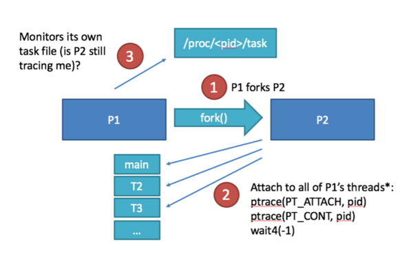

# Assessing Software Protection Schemes

Software protections are a controversial topic. Some security experts dismiss client-side protections outright. Security-by-obscurity, they argue, is not *real* security, thus from a security standpoint no value is added. In the MASVS and MSTG we take a more pragmatic approach. Given that software protection controls are used fairly widely in the mobile world, we argue that there is *some* benefit to such controls, as long as they are employed with a clear purpose and realistic expectations in mind, and aren't used to *replace* solid security controls.

What's more, mobile app security testers encounter anti-reversing mechanisms in their daily work, and they not only need ways to "deal" with them to enable dynamic analysis, but also to assess whether these mechanisms are used appropriately and effectively. Giving clients  advice like "you must use obfuscation" or "never obfuscate code because it's useless" doesn't cut it. However, most mobile app security testers have a background in network and web application security, and lack the reverse engineering and cracking skills required to form an opinion. On top of that, there is no methodology or even industry consensus on how anti-reversing schemes should be assessed.

The point of software-based reversing defenses is indeed to add obscurity - enough to deter some adversaries from achieving certain goals. There are several reason why developers choose to do this: For example, the intention could be to make it more difficult to steal the source code and IP, or to prevent malware running on the same device from tampering with the runtime behaviour of the app.

Resilience testing is the process of evaluating the robustness of the a software protection scheme against particular threats. Typically, this kind of testing is performed using a black-box approach, with the objective of circumventing the software protection scheme and reaching a pre-defined goal, such as extracting sensitive assets. This process requires skills that are not typically associated with penetration testing: The tester must be able to handle advanced anti-reversing tricks and obfuscation techniques. Traditionally, this is the domain of malware analysts.

This form of testing can be performed in the context of a regular mobile app security test, or stand-alone to verify the effectiveness of a software protection scheme. The process consists of the following high-level steps:

1. Assess whether a suitable and reasonable threat model exists, and the anti-reversing controls fit the threat model;
2. Assess the effectiveness of the defenses in countering the identified threats using hybrid static/dynamic analysis. In other words, play the role of the adversary, and crack the defenses!
3. In some scenarios, white-box testing can be added to assess specific features of the protection scheme in an isolated fashion (e.g., a particular obfuscation method).

Note that software protections must never be used as a replacement for security controls. The controls listed in MASVR-R are intended to add threat-specific, additional protective controls to apps that also fulfil the MASVS security requirements.

## Assessing the Threat Model and Software Protection Architecture

Client-side protections are desirable in some cases, but unnecessary or even counter-productive in others. In the worst case, software protections cause a false sense of security and encourage bad programming practices. It is impossible to provide a generic set of resilience controls that "just works" in every possible case. For this reason, proper attack modeling is a necessary prerequisite before implementing any form of software protections.

--[ TODO From the MASVS: ] --

```
A threat model must be defined that clearly outlines the client-side threats defended against. Additionally, the grade of protection the scheme is meant to provide must be specified. For example, a stated goal could be to force authors of targeted malware seeking to instrument the app to invest significant manual reverse engineering effort.

The threat model must be sensical. For example, hiding a cryptographic key in a white-box implementation is besides the point if the attacker can simply code-lift the white-box as a whole.

The effectiveness of the protection should always be verified by a human expert with experience in testing the particular types of anti-tampering and obfuscation used (see also the "reverse engineering" and "assessing software protections" chapters in the Mobile Security Testing Guide).
```

The OWASP Reverse Engineering and Code Modification Prevention Project <sup>[1]</sup> lists the following threats associated with reverse engineering and tampering:

- Spoofing Identity - Attackers may attempt to modify the mobile application code on a victim’s device to force the application to transmit a user’s authentication credentials (username and password) to a third party malicious site. Hence, the attacker can masquerade as the user in future transactions;

- Tampering - Attackers may wish to alter higher-level business logic embedded within the application to gain some additional value for free. For instance, an attacker may alter digital rights management code embedded in a mobile application to attain digital assets like music for free;

- Repudiation - Attackers may disable logging or auditing controls embedded within the mobile application to prevent an organization from verifying that the user performed particular transactions;

- Information Disclosure - Attackers may modify a mobile application to disclose highly sensitive assets contained within the mobile application. Assets of interest include: digital keys, certificates, credentials, metadata, and proprietary algorithms;

- Denial of Service - Attackers may alter a mobile device application and force it to periodically crash or permanently disable itself to prevent the user from accessing online services through their device;

- Elevation of Privilege - Attackers may modify a mobile application and redistribute it in a repackaged form to perform actions that are outside of the scope of what the user should be able to do with the app.

## Anti-Reversing Controls in the MASVS

The effectiveness of software protection schemes depends to some extent on originality and secrecy. Standardizing a particular scheme has the unfortunate side effect of making the scheme ineffective: Soon enough, a generic tool available for bypassing the scheme will be available. Instead of defining a standard way of implementing protection, we take the following approach:

1. List high-level requirements pertaining the reverse engineering processes against which should be defended against;
2. Highlight properties that determine the effectiveness of mechanisms and the overall scheme;
3. List robustness criteria for specific types of obfuscation and tampering;
3. Provide testers with knowledge, processes and tools for verifying effectiveness.

Item 1 and 2 are covered in the "Resilience Against Reverse Engineering" group of controls in the MASVS (MASVS-R), and further elaborated on in the Testing Guide. The MSTG also goes into great detail on item 3 and 4. We went to great length to document both offensive and defensive techniques. Note however that the process cannot be completely formalized. To perform a meaningful assessement, the test must be performed by a skilled reverse engineer who is familiar with the state-of-the-art in mobile app reversing and anti-reversing.

## The Assessment Process

Software protection effectiveness can be assessed using the white-box or black-box approach. Just like in a "regular" security assessment, the tester performs static and dynamic analysis but with a different objective: Instead of identifying security flaws, the goal is to identify holes in the anti-reversing defenses, and the property assessed is *resilience* as opposed to *security*. Also, scope and depth of the assessment must be tailored to specific scenario(s), such as tampering with a particular function. Note that the resilience assessment can be performed as part of a regular security assessment.

--[ TODO - multiple approaches which can be combined,...] --

### Design Review

Review and evaluate the design and implementation the software protection scheme and its individual components (anti-tampering, anti-debugging, device binding, obfuscating transformations, etc.).

### Black-box Resilience Testing

Evaluate the robustness of their White-Box cryptographic solution against specific attacks. Without prior knowledge about the implementation, with the objective to break or circumvent the protections.

The advantage of the black-box approach is that it reflects the real-world effectiveness of the reverse engineering protections: The effort required by actual adversary with a comparable skill level and toolset would likely be close to the effort invested by the assessor. 

--[ TODO ] --

Drawbacks: For one, the result is highly influenced by the skill level of the assessor. Also, the effort for fully reverse engineering a program with state-of-the-art protections is very high (which is exactly the point of having them), and some apps may occupy even experienced reverse engineers for weeks. Experienced reverse engineers aren’t cheap either, and delaying the release of an app may not be feasible in an "agile" world. 


### Obfuscation Effectiveness Assessment

Complex obfuscation schemes, such as custom implementations of white-box cryptography or virtual machines, are better assessed in an isolated fashion using the white-box approach. Such an assessment requires specialized expertise in cracking the particular type(s) of obfuscation. In this type of assessment, the goal is to determine resilience against current state-of-the-art de-obfuscation techniques, and providing an estimate of robustness against manual analysis.

## Key Questions

Any resilience test should answer the following questions:

**Does the protection scheme impede the threat(s) they are supposed to?**

It is worth re-iterating that there is no anti-reversing silver bullet. 

**Does the protection scheme achieve the desired level of resilience?**

It is worth re-iterating that there is no anti-reversing silver bullet. 

**Does the scheme defend comprehensively against processes and tools used by reverse engineers?**

--[ TODO ] --

**Are suitable types of obfuscation used in the approriate places and with the right parameters?**

--[ TODO ] --

## Assessing Programmatic Defenses

--[ TODO ] --

For a protection scheme to be considered effective, it must incorporate various kinds of anti-reversing tricks. To make things sound more respectable, we'll refer to those tricks as *programmatic defenses*. "Programmatic" refers to the fact that these kinds of defenses *do* things - they are functions that prevent, or react to, actions of the reverse engineer. In this, they differ from obfuscating transformations, which change the way the program looks. Note that these two categories sometimes overlap - for example, self-compiling or self-modifiying code, while usually being refered to as a means of obfuscation, could also be said to "do something". In general however it is a useful distincton.

*Programmatic defenses* can be further categorized into two modi operandi:

1. Preventive: Functions that aim to *prevent* anticipated actions of the reverse engineer. As an example, an app may use an operating system API to prevent debuggers from attaching.

2. Reactive: Features that aim to detect, and respond to, tools or actions of the reverse engineer. For example, an app could terminate when it suspects being run in an emulator, or change its behavior in some way if a debugger is detected.

You usually find both types employed in a given software protection scheme.

### Criteria for Overall Effectiveness

The main motto in anti-reversing is **the sum is greater than its parts.** The defender wants to make it as difficult as possible to get a first foothold for an analysis. They want the adversary to throw the towel before they even get started! Because once the adversary does get started, it's usually only a matter of time before the house of card collapses.

To achieve this deterrant effect, one needs to combine a multitude of defenses, preferably including some original ones. The defenses need to be scattered throughout the app, but also work together in unison to create a greater whole. In the following sections, we'll describe the main criteria that contribute to the effectiveness of programmatic defenses.

#### Coverage

--[ TODO ] --


```
8.1 The app detects, and responds to, the presence of a rooted or jailbroken device either by alerting the user or terminating the app.
```


```
8.2: The app implements prevents debugging and/or detects, and responds to, a debugger being attached. All available debugging protocols must be covered (Android: JDWP and ptrace, iOS: Mach IPC and ptrace).
```


```
8.3: The app detects, and responds to, tampering with executable files and critical data within its own container.
```


```
8.4: The app detects the presence of widely used reverse engineering tools and frameworks that support code injection, hooking, instrumentation and debugging.
```


```
8.5: The app detects, and responds to, being run in an emulator.
```

```
8.6: The app continually verifies the integrity of critical code and data structures within its own memory space.
```


#### Amount and Diversity of Defenses

--[ TODO ] --

As a general rule of thumb, at least two to three defensive controls should be implemented for each category. These controls should operate independently of each other, i.e. each control should be based on a different technique, operate on a different API Layer, and be located at a different location in the program (see also the criteria below). The adversary should not be given opportunities to kill multiple birds with the same stone - ideally, they should be forced to use multiple stones per bird.

```
8.7 The app implements multiple mechanisms to fulfil requirements 8.1 to 8.6. Note that resilience scales with the amount, diversity of the originality of the mechanisms used.
```

```
8.8 The detection mechanisms trigger different responses, including stealthy ones that don't simply terminate the app.
```

```
8.10: Obfuscating transformations and functional defenses are interdependent and well-integrated throughout the app.
```

##### Originality

The effort required to reverse engineer an application highly depends on how much information is initially available to the adversary. This includes information about the functionality being reversed as well as knowledge about the obfuscation and anti-tampering techniques used by the target application. Therefore, the level of innovation that went into designing anti-reversing tricks is an important factor.

Adversaries are more likely to be familiar with ubiquituous techniques that are repeatedly documented in reverse engineering books, papers, presentations and tutorials. Such tricks can either be bypassed using generic tools or with little innovation. In contrast, a secret trick that hasn't been presented anywhere can only be bypassed by a reverser who truly understands the subject, and may force them to do additional research and/or scripting/coding.

Defenses can be roughly categorized into the following categories in terms of originality:

- Standard API: The feature relies on APIs that are specifically meant to prevent reverse engineering. It can be bypassed easily using generic tools.
- Widely known: A well-documented and commonly used technique is used. It can be bypassed using commonly available tools with a moderate amount of customization.
- Proprietary: The feature is not commonly found in reversing resources and research papers, or a known technique has been sufficiently extended / customized to cause significant effort for the reverse engineer.

##### API Layer

Generally speaking, the less your mechanisms relies on operating operating system APIs to work, the more difficult it is to discover and bypass. Also, lower-level calls are more difficult to defeat than higher level calls. To illustrate this, let's have a look at a few examples.

As you have learned in the 


```c
#define PT_DENY_ATTACH 31

void disable_gdb() {
    void* handle = dlopen(0, RTLD_GLOBAL | RTLD_NOW);
    ptrace_ptr_t ptrace_ptr = dlsym(handle, "ptrace");
    ptrace_ptr(PT_DENY_ATTACH, 0, 0, 0);
    dlclose(handle);
}
```

```c
void disable_gdb() {

	asm(
		"mov	r0, #31\n\t"	// PT_DENY_ATTACH
		"mov	r1, #0\n\t"
		"mov	r2, #0\n\t"
		"mov 	ip, #26\n\t"	// syscall no.
		"svc    0\n"
	);
}
```

```c
struct VT_JdwpAdbState *vtable = ( struct VT_JdwpAdbState *)dlsym(lib, "_ZTVN3art4JDWP12JdwpAdbStateE");

	unsigned long pagesize = sysconf(_SC_PAGE_SIZE);
	unsigned long page = (unsigned long)vtable & ~(pagesize-1);

	mprotect((void *)page, pagesize, PROT_READ | PROT_WRITE);

	vtable->ProcessIncoming = vtable->ShutDown;

	// Reset permissions & flush cache

	mprotect((void *)page, pagesize, PROT_READ);
```

- System library: The feature relies on public library functions or methods.
- System call: The anti-reversing feature calls directly into the kernel. 
- Self-contained: The feature does not require any library or system calls to work.


##### Parallelism

Debugging and disabling a mechanism becomes more difficult when multiple threats or processes are involved.

- Single thread 
- Multiple threads or processes

--[ TODO - description and examples ] --




##### Response

Less is better in terms of information given to the adversary. This principle also applies to anti-tampering controls: A control that reacts to tampering immediately in a visible way is more easily discovered than a control that triggers some kind of hidden response with no apparent immediate consequences. For example, imagine a debugger detection mechanism that displays a message box saying "DEBUGGER DETECTED!" in big, red, all-caps letters. This gives away exactly what has happened, plus it gives the reverse engineer something to look for (the code displaying the messagebox). Now imagine a mechanism that quietly changes modifies function pointer when it detects a debugger, triggering a sequence of events that leads to a crash later on. This makes the reverse engineering process much more painful.

The most effective defensive features are designed to respond in stealth mode: The attacker is left completely unaware that a defensive mechanism has been triggered. For maximum effectiveness, we recommend mixing different types of responses including the following:

- Feedback: When the anti-tampering response is triggered, an error message is displayed to the user or written to a log file. The adversary can immediately discern the nature of the defensive feature as well as the time at which the mechanism was triggered.
- Indiscernible: The defense mechanism terminates the app without providing any error details and without logging the reason for the termination. The adversary does not learn information about the nature of the defensive feature, but can discern the approximate time at which the feature was triggered.
- Stealth: The anti-tampering feature either does not visibly respond at all to the detected tampering, or the response happens with a significant delay. 

See also MASVS V8.8: "The app implements multiple different responses to tampering, debugging and emulation, including stealthy responses that don't simply terminate the pap."

#### Scattering

--[ TODO ] --

#### Integration

--[ TODO ] --

## Assessing Obfuscation

Obfuscation is the process of transforming code and data in ways that make it more difficult to comprehend, while preserving its original meaning or function. Think about translating an English sentence into an French one that says the same thing (or pick a different language if you speak French - you get the point).

The simplest way of making code less comprehensible is stripping information that is meaningful to humans, such as function and variable names. Many more intricate ways have been invented by software authors - especially those writing malware and DRM systems - over the past decades, from encrypting portions of code and data, to self-modifying and self-compiling code.

A standard implementation of a cryptographic primitive can be replaced by a network of key-dependent lookup tables so the original cryptographic key is not exposed in memory ("white-box cryptography"). Code can be into a secret byte-code language that is then run on an interpreter ("virtualization"). There are infinite ways of encoding and transforming code and data!

Things become complicated when it comes to pinpointing an exact academical definition. In an often cited paper, Barak et. al describe the black-box model of obfuscation. The black-box model considers a program P' obfuscated if any property that can be learned from P' can also be obtained by a simulator with only oracle access to P. In other words, P’ does not reveal anything except its input-output behavior. The authors also show that obfuscation is impossible given their own definition by constructing an un-obfuscable family of programs <sup>[2]</sup>.

Does this mean that obfuscation is impossible? Well, it depends on what you obfuscate and how you define obfuscation. Barack’s result only shows that *some* programs cannot be obfuscated - but only if we use a very strong definition of obfuscation. Intuitively, most of us know from experience that code can have differing amounts of intelligibility and that understanding the code becomes harder as code complexity increases. Often enough, this happens unintentionally, but we can also observe that implementations of obfuscators exist and are more or less successfully used in practice <sup>[3]</sup>.

Unfortunately, reseachers don't agree on whether obfuscation effectiveness can ever be proven or quantified, and there are no widely accepted methods of doing it. In the following sections, we provide a taxonomy of commonly used types of obfuscation. We then outline the requirements for achieving what we would consider *robust* obfuscation, given the de-obfuscation tools and research available at the time of writing. Note however that the field is rapidly involving, so in practice, the most recent developments must always be taken into account.

### Obfuscation Controls in the MASVS

The MASVS lists only two requirements that deal with obfuscation <sup>[4]</sup>. The first requirement is V8.11:

```
"8.11 All executable files and libraries belonging to the app are either encrypted on the file level and/or important code and data segments inside the executables are encrypted or packed. Trivial static analysis does not reveal important code or data."
```

This requirement simply says that the code should be made to look fairly incomprehensible to someone inspecting it in a common disassembler or decompiler. This can be achieved by doing a combination of the following.

**Stripping information**

The first simple and highly effective step involves stripping any explanative information that is meaningful to humans, but isn’t actually needed for the program to run. Debugging symbols that map machine code or byte code to line numbers, function names and variable names are obvious examples.

For instance, class files generated with the standard Java compiler include the names of classes, methods and fields, making it trivial to reconstruct the source code. ELF and Mach-O binaries have a symbol table that contains debugging information, including the names of functions, global variables and types used in the executable.

Stripping this information makes a compiled program less intelligible while fully preserving its functionality. Possible methods include removing tables with debugging symbols, or renaming functions and variables to random character combinations instead of meaningful names. This process sometimes reduces the size of the compiled program and doesn’t affect its runtime behavior.

**Packing, encryption, and other tricks**

In addition to stripping information, there's many ways of making apps difficult and annoying to analyze, such as:

- Splitting up code and data between Java bytecode and native code; 
- Encrypting strings;
- Encrypting parts of the code and data withing the program;
- Encrypting whole binary files and class files.

This kind of transformations are "cheap" in the sense that they don't add significant runtime overhead. They form a part of every effective software protection scheme, no matter the particular threat model. The goal is simply to make it hard to understand what is going on, adding to the overall effectiveness of the protections. Seen in isolation, these techniques are not highly resilient against manual or automated de-obfuscation.

The second requirement, V8.12, deals with cases where obfuscation is meant to perform a specific function, such as hiding a cryptographic key, or concealing some portion of code that is considered sensitive.

```
8.12: If the goal of obfuscation is to protect sensitive computations, an obfuscation scheme is used that is both appropriate for the particular task and robust against manual and automated de-obfuscation methods, considering currently published research. The effectiveness of the obfuscation scheme must be verified through manual testing. Note that hardware-based isolation features should prefered over obfuscation whenever possible."
```

This is where more "advanced" (and often controversial) forms of obfuscation, such as white-box cryptography, come into play. This kind of obfuscation is meant to be truly robust against both human and automated analysis, and usually increases the size and complexity of the program. The methods aim to hide the semantics of a computation by computing the same function in a more complicated way, or encoding code and data in ways that are not easily comprehensible.

A simple example for this kind of obfuscations are opaque predicates. Opaque predicates are redundant code branches added to the program that always execute the same way, which is known a priori to the programmer but not to the analyzer. For example, a statement such as if (1 + 1) = 1 always evaluates to false, and thus always result in a jump to the same location. Opaque predicates can be constructed in ways that make them difficult to identify and remove in static analysis.

Other obfuscation methods that fall into this category are:

- Pattern-based obfuscation, when instructions are replaced with more complicated instruction sequences
- Control flow obfuscation
- Control flow flattening
- Function Inlining
- Data encoding and reordering
- Variable splitting
- Virtualization
- White-box cryptography


### Obfuscation Effectiveness

To determine whether a particular obfuscation scheme is depends on the exact definition of "effective". If the purpose of the scheme is to deter casual reverse engineers, a mixture of cost-efficient tricks is sufficient. If the purpose is to achieve a level of resilience against advanced analysis performed by skilled reverse engineers, the scheme must achieve the following:

1. Potency: Program complexity must increased by a sufficient amount to significantly impede human/manual analysis. Note that there is always a trade off between complexity and size and/or performance.
2. Resilience against automated program analysis. For example, if the type of obfuscation is known to be "vulnerable" to concolic analysis, the scheme must include transformations that cause problems for this type of analysis.

#### General Criteria

--[ TODO - describe effectiveness criteria ] --

**Increase in Overall Program Complexity**

--[ TODO ] --

**Difficulty of CFG Recovery**

--[ TODO ] --

**Resilience against Automated Program Analysis**

--[ TODO ] --

#### The Use of Complexity Metrics

--[ TODO  - what metrics to use and how to apply them] --

#### Common Transformations

--[ TODO  - describe commonly used schemes, and criteria associated with each scheme. e.g., white-box must incorportate X to be resilient against DFA,  etc.] --

##### Control-flow Obfuscation

--[ TODO ] --

##### Polymorphic Code

--[ TODO ] --

##### Virtualization

--[ TODO ] --

##### White-box Cryptography

--[ TODO ] --

## Background and Caveats

--[ TODO ] --

### Academic Research on Obfuscation Metrics

-- TODO [Insert and link references] --

Collberg et. al. introduce potency as an estimate of the degree of reverse engineering difficulty. A potent obfuscating transformation is any transformation that increases program complexity. Additionally, they propose the concept of resilience which measures how well a transformation holds up under attack from an automatic de-obfuscator. The same paper also contains a useful taxonomy of obfuscating transformations <sup>[5]</sup>.

Potency can be estimated using a number of methods.  Anaeckart et. al apply traditional software complexity metrics to a control flow graphs generated from executed code <sup>[6]</sup>. The metrics applied are instruction count, cyclomatic number (i.e. number of decision points in the graph) and knot count (number of crossing in a function’s control flow graph). Simply put, the more instructions there are, and the more alternate paths and less expected structure the code has, the more complex it is.

Jacubowsky et. al. use the same method and add further metrics, such as number of variables per instruction, variable indirection, operational indirection, code homogeneity and dataflow complexity <sup>[7]</sup>. Other complexity metrics such as N-Scope <sup>[8]</sup>, which is determined by the nesting levels of all branches in a program, can be used for the same purpose <sup>[9]</sup>.

All these methods are more or less useful for approximating the complexity of a program, but they don’t always accurately reflect the robustness of the obfuscating transformations. Tsai et al. attempt to remediate this by adding a distance metric that reflects the degree of difference between the original program and the obfuscated program. Essentially, this metric captures how the obfuscated call graph differs from the original one. Taken together, a large distance and potency is thought to be correlated to better robustness against reverse engineering <sup>[10]</sup>.

In the same paper, the authors also make the important observation is that measures of obfuscation express the relationship between the original and the transformed program, but are unable to quantify the amount of effort required for reverse engineering. They recognize that these measure can merely serve as heuristic, general indicators of security.

Taking a human-centered approach, Tamada et. al. describe a mental simulation model to evaluate obfuscation <sup>[11]</sup>. In this model, the short-term memory of the human adversary is simulated as a FIFO queue of limited size. The authors then compute six metrics that are supposed to reflect the difficulty encountered by the adversary in reverse engineering the program. Nakamura et. al. propose similar metrics reflecting the cost of mental simulation <sup>[12]</sup>.

More recently, Rabih Mosen and Alexandre Miranda Pinto proposed the use of a normalized version of Kolmogorov complexity as a metric for obfuscation effectiveness. The intuition behind their approach is based on the following argument: if an adversary fails to capture some patterns (regularities) in an obfuscated code, then the adversary will have difficulty comprehending that code: it cannot provide a valid and brief, i.e., simple description. On the other hand, if these regularities are simple to explain, then describing them becomes easier, and consequently the code will not be difficult to understand. The authors also provide empirical results showing that common obfuscation techniques managed to produce a substantial increase in the proposed metric. They found that the metric was more sensitive then Cyclomatic measure at detecting any increase in complexity comparing to original un-obfuscated code <sup>[13]</sup>.

This makes intuitive sense and even though it doesn’t always hold true, the Kolmogorov complexity metric appears to be useful to quantify the impact of control flow and data obfuscation schemes that add random noise to a program.

### Experimental Data

With the limitations of existing complexity measures in mind we can see that more human studies on the subject would be helpful. Unfortunately, the body of experimental research is relatively small - in fact, the lack of empirical studies is one of the main issues researchers face  <sup>[14]</sup>. There are however some interesting papers linking some types of obfuscation to higher reverse engineering difficulty.

Nakamura et. al performed an empirical study to investigate the impact of several novel cost metrics proposed in the same paper <sup>[12]</sup>. In the experiment, twelve subjects were asked to mentally execute two different versions (with varying complexity) of three Java programs. At specific times during the experiment, the subjects were required to describe the program state (i.e., values of all variables in the program). The accuracy and speed of the participants in performing the experiment was then used to assess the validity of the proposed cost metrics. The results demonstrated that the proposed complexity metrics (some more than others) were correlated with the time needed by the subjects to solve the tasks. 

Sutherland et al. examine a framework for collecting reverse engineering measurement and the execution of reverse engineering experiments <sup>15</sup>. The researchers asked a group of ten students to perform static analysis and dynamic analysis on several binary programs and found a significant correlation between the skill level of the students and the level of success in the tasks (no big surprise there, but let’s count it as preliminary evidence that luck alone won’t get you far in reverse engineering).

In a series of controlled experiments, M. Ceccato et. al. tested the impact of identifier renaming and opaque predicates to increase the effort needed for attacks  <sup>[3] [16] [17]</sup>. In these studies, Master and PhD students with a good knowledge of Java programming were asked to perform understanding tasks or change tasks on the decompiled (either obfuscated or clear) client code of client-server Java applications. The experiments showed that obfuscation reduced the capability of subjects to understand and modify the source code. Interestingly, the results also showed that the presence of obfuscation reduced the gap between highly skilled attackers and low skilled ones: The highly skilled attackers were significantly faster in analyzing the clear source code, but the difference was smaller when analyzing the obfuscated version. Among other results, identifier renaming was shown to at least double the time needed to complete a successful attack <sup>[16]</sup>.


*Boxplot of attack efficiency from the Ceccato et. al. experiment to measure the impact of identifier renaming on program comprehension. Subjects analyzing the obfuscated code gave less correct answers per minute.*

### The Device Binding Problem

In many cases it can be argued that obfuscating some secret functionality misses the point, as for all practical purposes, the adversary does not need to know all the details about the obfuscated functionality. Say, the function of an obfuscated program it to take an input value and use it to compute an output value in an indiscernible way (for example, through a cryptographic operation with a hidden key). In most scenarios, the adversaries goal would be to replicate the functionality of the program – i.e. computing the same output values on a system owned by the adversary. Why not simply copy and re-use whole implementation instead of painstakingly reverse engineering the code? Is there any reason why the adversary needs to look inside the black-box?

This kind of attack is known as code lifting and is commonly used for breaking DRM and white-box cryptographic implementations <sup>[18]</sup>. For example, an adversary aiming to bypass digital media usage could simply extract the encryption routine from a player and include it in a counterfeit player, which decrypts the digital media without enforcing the contained usage policies <sup>19</sup>. Designers of white-box implementations have to deal with another issue: one can convert an encryption routine into a decryption routine without actually extracting the key <sup>[20]</sup>.

Protected applications must include measures against code lifting to be useful. In practice, this means binding the obfuscated functionality to the specific environment (hardware, device or client/server infrastructure) in which the binary is executed. Preferably, the protected functionality should execute correctly only in the specific, legitimate computing environment. For example, an obfuscated encryption algorithm could generate its key (or part of the key) using data collected from the environment <sup>[21]</sup>. Techniques that tie the functionality of an app to specific hardware are known as device binding.

Even so, it is relatively easy (as opposed to fully reverse engineering the black-box) to monitor the interactions of an app with its environment. In practice, simple hardware properties such as the IMEI and MAC address of a device are often used to achieve device binding. The effort needed to spoof these environmental properties is certainly lower than the effort required for needed for fully understanding the obfuscated functionality.

What all this means is that, for most practical purposes, the security of an obfuscated application is only as good as the device binding it implements. For device binding to be effective, specific characteristics of the system or device must be deeply intertwined with the various obfuscation layers, and these characteristics must be determined in stealthy ways (ideally, by reading content directly from memory). Advanced device binding methods are often deployed in DRM and malware and some research has been published in this area <sup>[22]</sup>.

## References

- [1] OWASP Reverse Engineering and Code Modification Prevention - https://www.owasp.org/index.php/OWASP_Reverse_Engineering_and_Code_Modification_Prevention_Project
- [2] Boaz Barak, Oded Goldreich, Rusell Impagliazzo, Steven Rudich, Amit Sahai, Salil Vadhan, Ke Yang - On the (Im)possibility of Obfuscating Programs - Lecture Notes in Computer Science, issue 2139, 2001
- [3] Mariano Ceccato, Massimiliano Di Penta, Jasvir Nagra, Paolo Falcarin, Filippo Ricca, Marco Torchiano, Paolo Tonella - Towards Experimental Evaluation of Code Obfuscation Techniques, 2008
- [4] OWASP MASVS Resilience Requirements - https://github.com/OWASP/owasp-masvs/blob/master/Document/0x15-V8-Resiliency_Against_Reverse_Engineering_Requirements.md
- [5] C. Collberg, C. Thomborson, and D. Low - A taxonomy of obfuscating transformations, Dept. of Computer Science, The Univ. of Auckland, Technical Report 148, 1997
- [6] Bertrand Anckaert, Matias Madou, Bjorn De Sutter, Bruno De Bus and Koen De Bosschere, Bart Preneel - Program Obfuscation: A Quantitative Approach. Proceedings of the 2007 ACM workshop on Quality of protection, ACM New York, NY, USA, 2007
- [7] Mariusz H. Jakubowski, Chit W. (Nick) Saw, Ramarathnam Venkatesan - ITERATED TRANSFORMATIONS AND QUANTITATIVE METRICS FOR SOFTWARE PROTECTION, 2009
- [8] Zuse, H. - Software Complexity: Measures and Methods. Walter de Gruyter & Co. Hawthorne, NJ, USA, 1991
- [9] Yongdong Wu, Hui Fang, Shuhong Wang, Zhifeng Qi - A Framework for Measuring the Security of Obfuscated Software. International Conference on Test and Measurement, 2010
- [10] Hsin-Yi Tsai, Yu-Lun Huang, and David Wagner - A Graph Approach to Quantitative Analysis of Control-Flow Obfuscating Transformations. IEEE TRANSACTIONS ON INFORMATION FORENSICS AND SECURITY, Volume 4, Issue 2, 2009
- [11] Haruaki Tamada, Kazumasa Fukuda, Tomoya Yoshioka - Program Incomprehensibility Evaluation for Obfuscation Methods with Queue-based Mental Simulation Model, ACIS International Conference on Software Engineering, Artificial Intelligence, Networking and Parallel Distributed Computing (SNPD), 2012
- [12] Masahide Nakamura, Akito Monden, Tomoaki Itoh, Ken-ichi Matsumoto, Yuichiro Kanzaki, Hirotsugu Satoh - Queue-based Cost Evaluation of Mental Simulation Process in Program Comprehension. Proceedings of the Ninth International Software Metrics Symposium (METRICS’03), IEEE, 2003
- [13] Rabih Mohsen, Alexandre Miranda Pinto - Algorithmic Information Theory for Obfuscation Security. International Conference on Security and Cryptography, SECRYPT 2015
- [14] Ceccato, Mariano - On the Need for More Human Studies to Assess Software Protection.
- [15] Iain Sutherland, George E. Kalb, Andrew Blyth, Gaius Mulley - An empirical examination of the reverse engineering process for binary files.
- [16] Mariano Ceccato, Massimiliano Di Penta, Jasvir Nagra, Paolo Falcarin, Filippo Ricca, Marco Torchiano, Paolo Tonella - The effectiveness of source code obfuscation: An experimental assessment
- [17] Mariano Ceccato, Massimiliano Di Penta, Jasvir Nagra, Paolo Falcarin, Filippo Ricca, Marco Torchiano, Paolo Tonella - Towards Experimental Evaluation of Code Obfuscation Techniques
- [18] Brecht Wyseur - WHITE-BOX CRYPTOGRAPHY: HIDING KEYS IN SOFTWARE.
- [19] Sebastian Schrittwieser, Stefan Katzenbeisser, Johannes Kinder, Geord Merzdovnik, Edgar Weippl - Protecting Software through Obfuscation: Can It Keep Pace with Progress in Code Analysis? ACM Computing Surveys, Volume 49, issue 1, 2016
- [20] Joppe W. Bos, Charles Hubain, Wil Michiels, and Philippe Teuwen - Differential Computation Analysis: Hiding your White-Box Designs is Not Enough.
- [21] James Riordan, Bruce Schneier - Environmental Key Generation towards Clueless Agents. Mobile Agents and Security, Springer Verlag, 1998
- [22] Royal, Chengyu Song and Paul - Flowers for Automated Malware Analysis. Blackhat USA 2012. https://media.blackhat.com/bh-us-12/Briefings/Song/BH_US_12_Song_Royal_Flowers_Automated_WP.pdf


