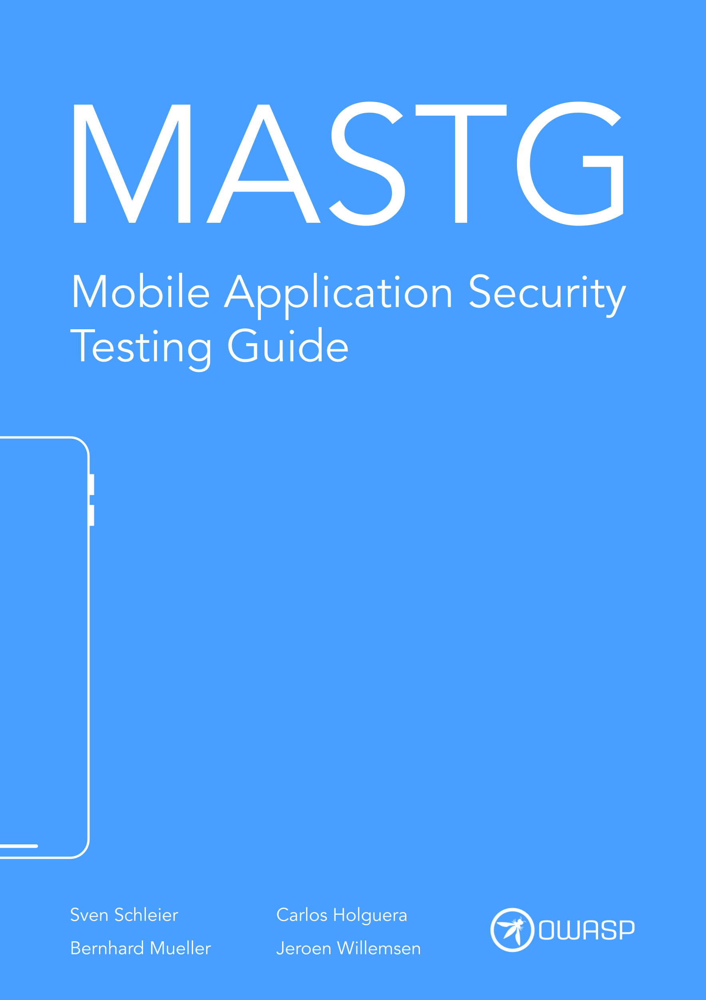

---
hide:
  - toc
---

# OWASP MASTG

<a href="https://github.com/OWASP/owasp-mastg/">:material-github: GitHub Repo</a>

The **OWASP Mobile Application Security Testing Guide (MASTG)** is a comprehensive manual for mobile app security testing and reverse engineering. It describes technical processes for verifying the controls listed in the [OWASP MASVS](https://mas.owasp.org/MASVS) through the weaknesses defined by the [OWASP MASWE](https://mas.owasp.org/MASWE).

 

 

Start exploring the MASTG:

<!-- markdownlint-disable search-replace -->
<a href="/MASTG/tests/" class="md-button md-button--primary" style="margin: 5px; min-width: 12em; text-align: center;">:octicons-codescan-checkmark-24:  Tests</a>
<a href="/MASTG/techniques/" class="md-button md-button--primary" style="margin: 5px; min-width: 12em; text-align: center;">:material-magic-staff:  Techniques</a>
<a href="/MASTG/demos/" class="md-button md-button--primary" style="margin: 5px; min-width: 12em; text-align: center;">:material-flask-outline:  Demos</a>
<a href="/MASTG/tools/" class="md-button md-button--primary" style="margin: 5px; min-width: 12em; text-align: center;">:octicons-tools-24:  Tools</a>
<a href="/MASTG/apps/" class="md-button md-button--primary" style="margin: 5px; min-width: 12em; text-align: center;">:octicons-code-square-24:  Apps</a>
<a href="/MASTG/best-practices/" class="md-button md-button--primary" style="margin: 5px; min-width: 12em; text-align: center;">:material-shield-check:  Best Practices</a>
<!-- markdownlint-disable search-replace -->

 
