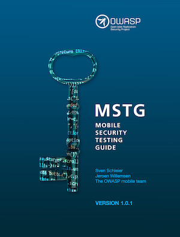

<a href="https://leanpub.com/mobile-security-testing-guide"></a>

# OWASP Mobile Security Testing Guide [](https://twitter.com/OWASP_MSTG)

[](https://creativecommons.org/licenses/by-sa/4.0/ "CC BY-SA 4.0")

[](https://www.owasp.org/index.php/Category:OWASP_Project#tab=Project_Inventory)
[](https://travis-ci.com/OWASP/owasp-mstg)

This is the official GitHub Repository of the OWASP Mobile Security Testing Guide (MSTG). The MSTG is a comprehensive manual for mobile app security testing and reverse engineering. It describes technical processes for verifying the controls listed in the [OWASP Mobile Application Verification Standard (MASVS)](https://github.com/OWASP/owasp-masvs "MASVS").
You can also read the MSTG on [Gitbook](https://mobile-security.gitbook.io/mobile-security-testing-guide/ "MSTG @ Gitbook") or download it as an [e-book](https://leanpub.com/mobile-security-testing-guide-preview "MSTG as an e-book").

The MSTG and the MASVS are being adopted by many companies, standards, and various organizations. Want to find out more? Check our [users document listing some of the adopters](Users.md).

## Table-of-Contents

### Introduction

- [Header](Document/0x00-Header.md)
- [Foreword](Document/Foreword.md)
- [Frontispiece](Document/0x02-Frontispiece.md)
- [Introduction to the Mobile Security Testing Guide](Document/0x03-Overview.md)
- [Mobile App Taxonomy](Document/0x04a-Mobile-App-Taxonomy.md)
- [Mobile App Security Testing](Document/0x04b-Mobile-App-Security-Testing.md)

### General Testing Guide

- [Mobile App Authentication Architectures](Document/0x04e-Testing-Authentication-and-Session-Management.md)
- [Testing Network Communication](Document/0x04f-Testing-Network-Communication.md)
- [Cryptography in Mobile Apps](Document/0x04g-Testing-Cryptography.md)
- [Testing Code Quality](Document/0x04h-Testing-Code-Quality.md)
- [Tampering and Reverse Engineering](Document/0x04c-Tampering-and-Reverse-Engineering.md)
- [Testing User Education](Document/0x04i-Testing-user-interaction.md)

### Android Testing Guide

- [Platform Overview](Document/0x05a-Platform-Overview.md)
- [Android Basic Security Testing](Document/0x05b-Basic-Security_Testing.md)
- [Data Storage on Android](Document/0x05d-Testing-Data-Storage.md)
- [Android Cryptographic APIs](Document/0x05e-Testing-Cryptography.md)
- [Local Authentication on Android](Document/0x05f-Testing-Local-Authentication.md)
- [Android Network APIs](Document/0x05g-Testing-Network-Communication.md)
- [Android Platform APIs](Document/0x05h-Testing-Platform-Interaction.md)
- [Code Quality and Build Settings for Android Apps](Document/0x05i-Testing-Code-Quality-and-Build-Settings.md)
- [Tampering and Reverse Engineering on Android](Document/0x05c-Reverse-Engineering-and-Tampering.md)
- [Android Anti-Reversing Defenses](Document/0x05j-Testing-Resiliency-Against-Reverse-Engineering.md)

### iOS Testing Guide

- [Platform Overview](Document/0x06a-Platform-Overview.md)
- [iOS Basic Security Testing](Document/0x06b-Basic-Security-Testing.md)
- [Data Storage on iOS](Document/0x06d-Testing-Data-Storage.md)
- [iOS Cryptographic APIs](Document/0x06e-Testing-Cryptography.md)
- [Local Authentication on iOS](Document/0x06f-Testing-Local-Authentication.md)
- [iOS Network APIs](Document/0x06g-Testing-Network-Communication.md)
- [iOS Platform APIs](Document/0x06h-Testing-Platform-Interaction.md)
- [Code Quality and Build Settings for iOS Apps](Document/0x06i-Testing-Code-Quality-and-Build-Settings.md)
- [Tampering and Reverse Engineering on iOS](Document/0x06c-Reverse-Engineering-and-Tampering.md)
- [iOS Anti-Reversing Defenses](Document/0x06j-Testing-Resiliency-Against-Reverse-Engineering.md)

### Appendix

- [Testing Tools](Document/0x08-Testing-Tools.md)
- [Suggested Reading](Document/0x09-Suggested-Reading.md)

## Reading the Mobile Security Testing Guide

The release 1.0 of the MSTG was published in June 2018. You can get intermediate builds in multiple formats.

1. Read it on [Gitbook](https://mobile-security.gitbook.io/mobile-security-testing-guide/ "Gitbook"). The book is automatically synchronized with the main repo.

2. Check the [releases](https://github.com/OWASP/owasp-mstg/releases "Our releases"). Here you can find a PDF, an archive containing the sources and a DocX document for any given tagged version. Please note that the documents are generated automatically per tag.

3. Get the book as printed version. A hardcopy of the book can be ordered via [lulu.com](http://www.lulu.com/shop/sven-schleier-and-jeroen-willemsen-and-bernhard-m%C3%BCller/owasp-mobile-security-testing-guide/paperback/product-24091501.html "MSTG on Lulu.com"). This version of the book is not completely aligned with book printing standards, but we are improving each version. If you recognize any issues or mistakes, even small ones, please raise an [issue](https://github.com/OWASP/owasp-mstg/issues "our issues section") so we can fix it in the next version.

4. Get the [e-book](https://leanpub.com/mobile-security-testing-guide-preview "MSTG as an e-book"). The book is available for free, but you can choose to purchase it at a price of your choosing if you wish to support our project. All funds raised through sales of the e-book go directly into the project budget and will be used to fund production of future releases.

5. Clone the repository and run the [document generator](https://github.com/OWASP/owasp-mstg/blob/master/Tools/generate_document.sh "The document generator") (requires [pandoc](http://pandoc.org "Pandoc")). This produces docx and HTML files in the "Generated" subdirectory.

    ```shell
    $ git clone https://github.com/OWASP/owasp-mstg/
    $ cd owasp-mstg/Tools/
    $ ./generate_document.sh
    ```

6. Clone the repository and run the [gitbook generator](https://github.com/OWASP/owasp-mstg/blob/master/Tools/gitbookepubandpdf.sh "Gitbook based"). This produces PDF, Epub and Mobi files in the "Generated" subdirectory.

    ```shell
    $ git clone https://github.com/OWASP/owasp-mstg/
    $ cd owasp-mstg/Tools/
    $ ./gitbookandpdf.sh
    ```

You can also use the [document index](https://rawgit.com/OWASP/owasp-mstg/master/Generated/OWASP-MSTG-Table-of-Contents.html "TOC") to navigate the master branch of the MSTG.

## Contributions, feature requests and feedback

**We are searching for additional authors, reviewers and editors.** The best way to get started is to browse the [existing content](https://mobile-security.gitbook.io/mobile-security-testing-guide/ "existing content"). Also, check the [issues](https://github.com/OWASP/owasp-mstg/issues "our issues section") and the [project page](https://github.com/OWASP/owasp-mstg/projects/2 "The MSTG Project") for a list of open tasks.

Drop a us line on the [Slack channel](https://app.slack.com/client/T04T40NHX/C1M6ZVC6S "Come to our Slack!") before you start working on a topic. This helps us to keep track of what everyone is doing and prevent conflicts. You can create a Slack account here:

[https://owasp.slack.com/](https://join.slack.com/t/owasp/shared_invite/enQtNjExMTc3MTg0MzU4LTViMDg1MmJiMzMwZGUxZjgxZWQ1MTE0NTBlOTBhNjhhZDIzZTZiNmEwOTJlYjdkMzAxMGVhNDkwNDNiNjZiOWQ)

Before you start contributing, please check our [contribution guide](https://github.com/OWASP/owasp-mstg/blob/master/CONTRIBUTING.md "Contribution Guide") which should get you started.

Please note that the MSTG focuses primarely on the native apps. These are apps built with Java or Kotlin using the Android SDK for Android or built with Swift or Objective-C using the Apple SDKs for iOS. Nativescript/React-native/Xamarin/Cordova/... apps are not within the focus of the MSTG. However, some key-controls, such as pinning, have been explained already for some of these platforms.
If you are looking for more security recommendations on this field, take a look the work-in-progress Google sheets based on the compliancy checklist 1.1.2:

- [Flutter Compliancy Checklist (WIP)](https://drive.google.com/open?id=1wHK3VI1cU1xmYrCu9yb5OHKUEeLIPSkC "Flutter Compliancy Checklist");
- [React-Native Compliancy Checklist (WIP)](https://drive.google.com/open?id=1P5FZ_Bup5eSPOmkePZA8cIpKGOKvngkN "React-Native Compliancy Checklist").
- [Xamarin Compliancy Checklist (WIP)](https://drive.google.com/open?id=1UL1yLRREJwXfe0HlrcX-IuvPYQM7lTtG "Xamarin Compliancy Checklist").

If there's something you really want to see in the guide, or you want to suggest an improvement, create an issue [issue](https://github.com/OWASP/owasp-mstg/issues "Issue") or ping us on [Slack](https://app.slack.com/client/T04T40NHX/C1M6ZVC6S "Come to our Slack!").
If the issue is accepted, we will schedule it into one of our [milestones](https://github.com/OWASP/owasp-mstg/milestones "Milestones").

## Authoring Credit

Contributors are added to the acknowledgements table based on their contributions logged by GitHub. The list of names is sorted by the number of lines added. Authors are categorized as follows:

- Project Leader / Author: Manage development of the guide continuously and write a large amount of content.
- Co-Author: Consistently contribute quality content, [at least 2,000 additions logged](https://github.com/OWASP/owasp-mstg/graphs/contributors "Co-author").
- Top Contributor: Consistently contribute quality content, [at least 500 additions logged](https://github.com/OWASP/owasp-mstg/graphs/contributors "Top Contributor").
- Contributor: Any form of contribution, [at least 50 additions logged](https://github.com/OWASP/owasp-mstg/graphs/contributors "Contributor").
- Mini-contributor: Everything below 50 additions, e.g. committing a single word or sentence.
- Reviewer: People that haven't submitted their own pull requests, but have created issues or given useful feedback in other ways.

Please ping us or create a pull request if you are missing from the table or in the wrong column (note that we update the table frequently, but not in realtime).

If you are willing to write a large portion of the guide and help consistently drive the project forward, you can join as an author. Be aware that you'll be expected to invest lots of time over several months. Contact Sven Schleier (Slack: *Sven*), Jeroen Willemsen (Slack: *jeroenwillemsen*) or Carlos Holguera (Slack: *Carlos*) for more information.

## Crackmes

In the Crackmes folder, you can find a set of mobile apps to hack. Are you able to find the secrets? For more details: check the [README.md](https://github.com/OWASP/owasp-mstg/blob/master/Crackmes/README.md "Crackmes readme") at the [Crackmes folder](https://github.com/OWASP/owasp-mstg/blob/master/Crackmes "Crackmes folder").
