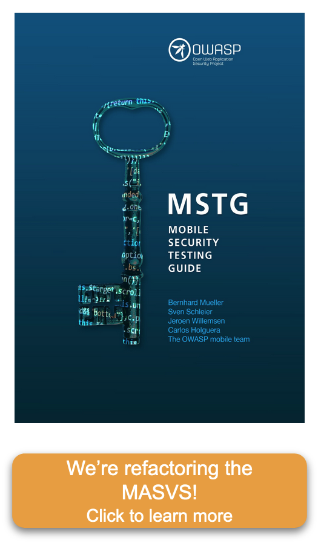

# OWASP Mobile Security Testing Guide (MSTG)

This is the official GitHub Repository of the OWASP Mobile Security Testing Guide (MSTG). The MSTG is a comprehensive manual for mobile app security testing and reverse engineering. It describes technical processes for verifying the controls listed in the [OWASP Mobile Application Verification Standard (MASVS)](https://github.com/OWASP/owasp-masvs "MASVS").

- 📖 [Read it on Gitbook](https://mobile-security.gitbook.io/mobile-security-testing-guide/)
- ⬇️ [Download the latest PDF](https://github.com/OWASP/owasp-mstg/releases/latest)
- ✅ [Get the latest Mobile App Security Checklists](https://github.com/OWASP/owasp-mstg/releases/latest)
- ⚡ [Contribute!](#how-to-contribute)
- 💥 [Play with our Crackmes](https://github.com/OWASP/owasp-mstg/blob/master/Crackmes/README.md)

## Trusted by ...

The OWASP MASVS and MSTG are trusted by the following platform providers and standardization, governmental and educational institutions. [Learn more](Document/0x02b-MASVS-MSTG-Adoption.md).

 

## 🥇 MSTG Advocates

MSTG Advocates are industry adopters of the OWASP MASVS and MSTG who have invested a significant and consistent amount of resources to push the project forward by providing consistent high-impact contributions and continuously spreading the word. [Learn more](Document/0x02a-Acknowledgements.md#our-mstg-advocates).

 

## Connect with Us

<ul>
<li><a href="https://github.com/OWASP/owasp-mstg/discussions"> GitHub Discussions</a></li>
<li><a href="https://owasp.slack.com/messages/project-mobile_omtg/details/">  #project-mobile_omtg</a> (<a href="https://owasp.slack.com/join/shared_invite/zt-g398htpy-AZ40HOM1WUOZguJKbblqkw#//">Get Invitation</a>)</li>
<li><a href="https://twitter.com/OWASP_MSTG"> @OWASP_MSTG </a> (Official Account)</li>
<li><a href="https://twitter.com/bsd_daemon"> @bsd_daemon </a> (Sven Schleier, Project Lead) <a href="https://twitter.com/grepharder"> @grepharder </a> (Carlos Holguera, Project Lead)</li>
</ul>

## How to Contribute

The MSTG is an open source effort and we welcome all kinds of contributions and feedback.

**Help us improve & join our community:**

- 🐞 [Report an error (typos, grammar)](https://github.com/OWASP/owasp-mstg/issues) or [fix it on a Pull Request](https://github.com/OWASP/owasp-mstg/pulls).
- 💬 [Give feedback](https://github.com/OWASP/owasp-mstg/discussions/categories/general).
- 🙏 [Ask questions](https://github.com/OWASP/owasp-mstg/discussions/categories/q-a)

**Contribute with content:**

- 💡 [Propose ideas or suggest improvements](https://github.com/OWASP/owasp-mstg/discussions/categories/ideas) (if it qualifies we'll promote it to an [Issue](https://github.com/OWASP/owasp-mstg/issues "Github issues"))
- 📄 [Create a Pull Request](https://github.com/OWASP/owasp-mstg/pulls) for concrete fixes (e.g. grammar/typos) or content already approved by the core team.

Before you start contributing, please check our [contribution guide](https://github.com/OWASP/owasp-mstg/blob/master/CONTRIBUTING.md "Contribution Guide") which should get you started. If you have any doubts [please contact us](#connect-with-us).

### Contribution Credit / Acknowledgments

Contributors are added to the acknowledgments section based on their contributions logged by GitHub and/or by applying to a certain role and consistently demonstrating their commitment. Acknowlegements are visible in the [official owasp.org Project Page](https://owasp.org/www-project-mobile-security-testing-guide/#div-acknowledgements), in [GitHub](https://github.com/OWASP/owasp-mstg/blob/master/Document/0x02-Frontispiece.md#acknowledgments), [GitBook](https://mobile-security.gitbook.io/mobile-security-testing-guide/0x02-frontispiece#acknowledgments) and in the [printed versions](https://www.lulu.com/shop/sven-schleier-and-jeroen-willemsen-and-bernhard-m%C3%BCller/owasp-mobile-security-testing-guide/paperback/product-24198359.html).

Contributors are categorized as follows:

- **Project Leader / Author**: Manage the development of the guide continuously and write a large amount of new content. Project Leadership cannot be achieved if any violations of the Code of Conduct occurred in the past. Be aware that you'll be expected to invest lots of time over several months.
- **Reviewer**: People that continuously monitor and review our [Pull Requests](https://github.com/OWASP/owasp-mstg/pulls) or given useful feedback and suggesting changes.
- **Most Helpful Discussions contributor**: actively participate in our GitHub Discussions. Contributors with the most answers marked as "The Answer" will get recognized as "Most Helpful" in our official repos.
- **Co-Author**: Consistently contribute quality content, [at least 2,000 additions logged](https://github.com/OWASP/owasp-mstg/graphs/contributors "Co-author").
- **Top Contributor**: Consistently contribute quality content, [at least 500 additions logged](https://github.com/OWASP/owasp-mstg/graphs/contributors "Top Contributor").
- **Contributor**: Any form of contribution, [at least 50 additions logged](https://github.com/OWASP/owasp-mstg/graphs/contributors "Contributor").
- **Mini-contributor**: Everything below 50 additions, e.g. committing a single word or sentence.

[Contact us](#connect-with-us) (Sven Schleier (Slack: *Sven*) or Carlos Holguera (Slack: *Carlos*)) if you are planning to become an Author/Co-Author/Reviewer, are missing from the acknowledgements (note that we make updates frequently, but not in realtime).

## MSTG Translations

The MSTG is a living document that changes and adapts to the most recent security recommendations every day. While we do want to reach the maximum audience possible, our past experience shows that **maintaining translations has proven to be an extremely challenging task**. Therefore, please understand that **any PRs containing MSTG translations will be declined**, but you're free to do them on your own forks.

> 🇯🇵 A translation of the MSTG into Japanese is available on Github: <https://github.com/coky-t/owasp-mstg-ja>. Thanks to @coky-t for pushing this forward!

That said, we **strongly encourage [further translations of the MASVS](https://github.com/OWASP/owasp-masvs/blob/master/README.md#masvs-translations)** as it is much easier to maintain and you'll get a translated [Mobile App Security Checklists](https://github.com/OWASP/owasp-mstg/releases/latest) mapping to the MSTG for free.

## Other Formats

- Get the [printed version via lulu.com](https://www.lulu.com/shop/sven-schleier-and-jeroen-willemsen-and-bernhard-m%C3%BCller/owasp-mobile-security-testing-guide/paperback/product-24198359.html)
- Get the [e-book on leanpub.com](https://leanpub.com/mobile-security-testing-guide-preview) (please consider purchasing it to support our project or [make a donation](https://owasp.org/www-project-mobile-security-testing-guide/#div-donate))
- Check our [Document generation scripts](tools/docker/README.md)

## Table-of-Contents

### Introduction

- [Foreword](Document/0x01-Foreword.md)
- [Frontispiece](Document/0x02-Frontispiece.md)
- [OWASP MASVS and MSTG Adoption](Document/0x02b-MASVS-MSTG-Adoption.md)
- [Introduction to the Mobile Security Testing Guide](Document/0x03-Overview.md)
- [Mobile App Taxonomy](Document/0x04a-Mobile-App-Taxonomy.md)
- [Mobile App Security Testing](Document/0x04b-Mobile-App-Security-Testing.md)

### General Testing Guide

- [Mobile App Authentication Architectures](Document/0x04e-Testing-Authentication-and-Session-Management.md)
- [Testing Network Communication](Document/0x04f-Testing-Network-Communication.md)
- [Cryptography in Mobile Apps](Document/0x04g-Testing-Cryptography.md)
- [Testing Code Quality](Document/0x04h-Testing-Code-Quality.md)
- [Tampering and Reverse Engineering](Document/0x04c-Tampering-and-Reverse-Engineering.md)
- [Testing User Privacy Protection](Document/0x04i-Testing-User-Privacy-Protection.md)

### Android Testing Guide

- [Platform Overview](Document/0x05a-Platform-Overview.md)
- [Android Basic Security Testing](Document/0x05b-Basic-Security_Testing.md)
- [Data Storage on Android](Document/0x05d-Testing-Data-Storage.md)
- [Android Cryptographic APIs](Document/0x05e-Testing-Cryptography.md)
- [Local Authentication on Android](Document/0x05f-Testing-Local-Authentication.md)
- [Android Network APIs](Document/0x05g-Testing-Network-Communication.md)
- [Android Platform APIs](Document/0x05h-Testing-Platform-Interaction.md)
- [Code Quality and Build Settings for Android Apps](Document/0x05i-Testing-Code-Quality-and-Build-Settings.md)
- [Tampering and Reverse Engineering on Android](Document/0x05c-Reverse-Engineering-and-Tampering.md)
- [Android Anti-Reversing Defenses](Document/0x05j-Testing-Resiliency-Against-Reverse-Engineering.md)

### iOS Testing Guide

- [Platform Overview](Document/0x06a-Platform-Overview.md)
- [iOS Basic Security Testing](Document/0x06b-Basic-Security-Testing.md)
- [Data Storage on iOS](Document/0x06d-Testing-Data-Storage.md)
- [iOS Cryptographic APIs](Document/0x06e-Testing-Cryptography.md)
- [Local Authentication on iOS](Document/0x06f-Testing-Local-Authentication.md)
- [iOS Network APIs](Document/0x06g-Testing-Network-Communication.md)
- [iOS Platform APIs](Document/0x06h-Testing-Platform-Interaction.md)
- [Code Quality and Build Settings for iOS Apps](Document/0x06i-Testing-Code-Quality-and-Build-Settings.md)
- [Tampering and Reverse Engineering on iOS](Document/0x06c-Reverse-Engineering-and-Tampering.md)
- [iOS Anti-Reversing Defenses](Document/0x06j-Testing-Resiliency-Against-Reverse-Engineering.md)

### Appendix

- [Testing Tools](Document/0x08-Testing-Tools.md)
- [Suggested Reading](Document/0x09-Suggested-Reading.md)

## About Hybrid Apps

Please note that the MSTG focuses primarily on native apps. These are apps built with Java or Kotlin using the Android SDK for Android or built with Swift or Objective-C using the Apple SDKs for iOS. Apps using frameworks such as Nativescript, React-native, Xamarin, Cordova, etc. are not within the main focus of the MSTG. However, some essential controls, such as certificate pinning, have been explained already for some of these platforms. For now, you can take a look and contribute to the work-in-progress being made in the discussions ["Hybrid application checklist experiments"](https://github.com/OWASP/owasp-mstg/discussions/1971) and ["Basic Guidelines for Hybrid Apps"](https://github.com/OWASP/owasp-masvs/discussions/557).
