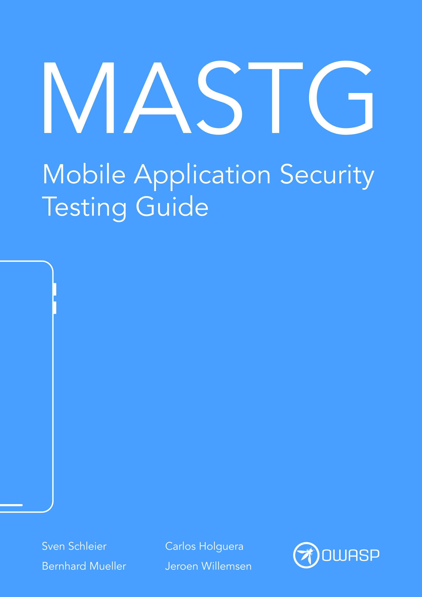
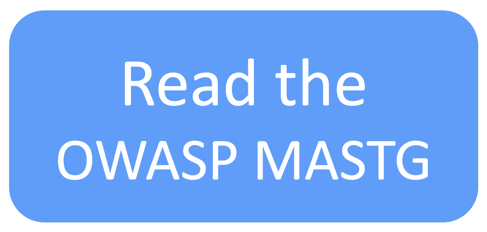

# OWASP Mobile Application Security Testing Guide (MASTG)

This is the official GitHub Repository of the OWASP Mobile Application Security Testing Guide (MASTG). The MASTG is a comprehensive manual for mobile app security testing and reverse engineering. It describes technical processes for verifying the controls listed in the [OWASP Mobile Application Verification Standard (MASVS)](https://github.com/OWASP/owasp-masvs "MASVS").

 

 

- 🌐 [Access the MASTG Web](https://mas.owasp.org/MASTG/)
- ✅ [Get the latest Mobile App Security Checklists](https://github.com/OWASP/owasp-mastg/releases/latest)
- ⚡ [Contribute!](https://mas.owasp.org/contributing)
- 💥 [Play with our Crackmes](https://mas.owasp.org/crackmes)

 

## Trusted by

The OWASP MASVS and MASTG are trusted by the following platform providers and standardization, governmental and educational institutions. [Learn more](https://mas.owasp.org/MASTG/0x02b-MASVS-MASTG-Adoption/).

 

## 🥇 MAS Advocates

MAS Advocates are industry adopters of the OWASP MASVS and MASTG who have invested a significant and consistent amount of resources to push the project forward by providing consistent high-impact contributions and continuously spreading the word. [Learn more](https://mas.owasp.org/MASTG/0x02c-Acknowledgements).

 

  

## Connect with Us

<a href="https://mas.owasp.org/contact">Contact details of project leaders.</a>

 
