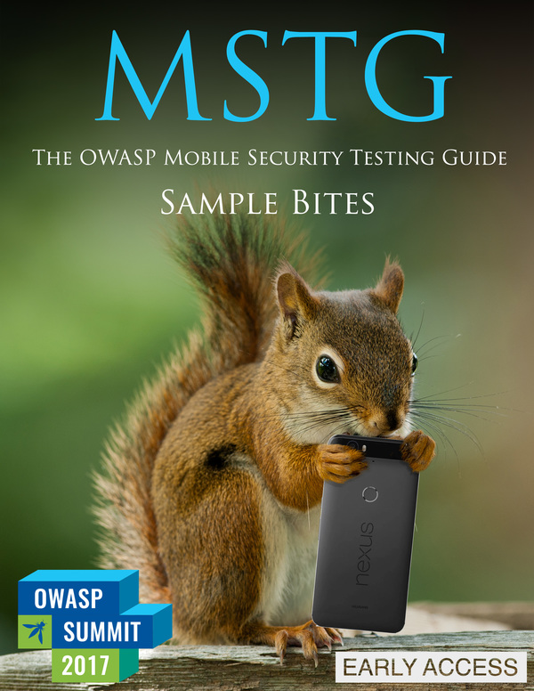

<a href="https://leanpub.com/mobile-security-testing-guide-preview"></a>

# OWASP Mobile Security Testing Guide

This is the official GitHub Repository of the OWASP Mobile Security Testing Guide (MSTG). The MSTG is a comprehensive manual for mobile app security testing and reverse engineering. It describes technical processes for verifying the controls listed in the [OWASP Mobile Application Verification Standard (MASVS)](https://github.com/OWASP/owasp-masvs). You can also read the MSTG on [Gitbook](https://b-mueller.gitbooks.io/the-owasp-mobile-security-testing-guide/content/) or download it as an [e-book](https://leanpub.com/mobile-security-testing-guide-preview).

## Table-of-Contents

### Introduction

- [Header](Document/0x00-Header.md)
- [Foreword](Document/Foreword.md)
- [Frontispiece](Document/0x02-Frontispiece.md)
- [Introduction to the Mobile Security Testing Guide](Document/0x03-Overview.md)
- [Mobile App Taxonomy](Document/0x04a-Mobile-App-Taxonomy.md)
- [Mobile App Security Testing](Document/0x04b-Mobile-App-Security-Testing.md)
- [Tampering and Reverse Engineering](Document/0x04c-Tampering-and-Reverse-Engineering.md)

### General Testing Guide

- [Testing Code Quality](Document/0x04h-Testing-Code-Quality.md)
- [Cryptography in Mobile Apps](Document/0x04g-Testing-Cryptography.md)
- [Mobile App Authentication Architectures](Document/0x04e-Testing-Authentication-and-Session-Management.md)
- [Testing Network Communication](Document/0x04f-Testing-Network-Communication.md)

### Android Testing Guide

- [Platform Overview](Document/0x05a-Platform-Overview.md)
- [Setting up a Testing Environment for Android Apps](Document/0x05b-Basic-Security_Testing.md)
- [Data Storage on Android](Document/0x05d-Testing-Data-Storage.md)
- [Android Cryptographic APIs](Document/0x05e-Testing-Cryptography.md)
- [Local Authentication on Android](Document/0x05f-Testing-Local-Authentication.md)
- [Android Network APIs](Document/0x05g-Testing-Network-Communication.md)
- [Android Platform APIs](Document/0x05h-Testing-Platform-Interaction.md)
- [Code Quality and Build Settings for Android Apps](Document/0x05i-Testing-Code-Quality-and-Build-Settings.md)
- [Tampering and Reverse Engineering on Android](Document/0x05c-Reverse-Engineering-and-Tampering.md)
- [Android Anti-Reversing Defenses](Document/0x05j-Testing-Resiliency-Against-Reverse-Engineering.md)

### iOS Testing Guide

- [Platform Overview](Document/0x06a-Platform-Overview.md)
- [Setting up a Testing Environment for iOS Apps](Document/0x06b-Basic-Security-Testing.md)
- [Data Storage on iOS](Document/0x06d-Testing-Data-Storage.md)
- [iOS Cryptographic APIs](Document/0x06e-Testing-Cryptography.md)
- [Local Authentication on iOS](Document/0x06f-Testing-Local-Authentication.md)
- [iOS Network APIs](Document/0x06g-Testing-Network-Communication.md)
- [iOS Platform APIs](Document/0x06h-Testing-Platform-Interaction.md)
- [Code Quality and Build Settings for iOS Apps](Document/0x06i-Testing-Code-Quality-and-Build-Settings.md)
- [Tampering and Reverse Engineering on iOS](Document/0x06c-Reverse-Engineering-and-Tampering.md)
- [iOS Anti-Reversing Defenses](Document/0x06j-Testing-Resiliency-Against-Reverse-Engineering.md)

### Appendix

- [Testing Tools](Document/0x08-Testing-Tools.md)
- [Suggested Reading](Document/0x09-Suggested-Reading.md)

## Reading the Mobile Security Testing Guide

The MSTG is not complete yet. You can however get intermediate builds in multiple formats.

1. Get the [e-book](https://leanpub.com/mobile-security-testing-guide-preview). The book is available for free, but you can choose to purchase it at a price of your choosing if you wish to support our project. All funds raised through sales of the e-book go directly into the project budget and will be used to fund production of the final release.

2. Read it on [Gitbook](https://b-mueller.gitbooks.io/the-owasp-mobile-security-testing-guide/content/). The book is automatically synchronized with the main repo. You can use the gitbook command line tool to generate PDF, epub, and other e-book formats. Please note that we have disabled the ebook export features on gitbook.com for the time being - they will be enabled once the project reaches beta status.

3. Clone the repository and run the [document generator](https://github.com/OWASP/owasp-mstg/blob/master/Tools/generate_document.sh) (requires [pandoc](http://pandoc.org)). This produces docx and html files in the "Generated" subdirectory.

```bash
$ git clone https://github.com/OWASP/owasp-mstg/
$ cd owasp-mstg/Tools/
$ ./generate_document.sh
```

You can also use the [document index](https://rawgit.com/OWASP/owasp-mstg/master/Generated/OWASP-MSTG-Table-of-Contents.html) to navigate the master branch of the MSTG.

## Contributions, feature requests and feedback

**We are searching for additional authors, reviewers and editors.** The best way to get started is to browse the [existing content](https://b-mueller.gitbooks.io/the-owasp-mobile-security-testing-guide/content/). Also, check the [project dashboard](https://github.com/OWASP/owasp-mstg/projects/1) for a list of open tasks.

Drop a us line on the [Slack channel](https://owasp.slack.com/messages/project-mobile_omtg/details/) before you start working on a topic. This helps us to keep track of what everyone is doing and prevent conflicts. You can create a Slack account here:

http://owasp.herokuapp.com/

Before you start contributing, please read our brief [style guide](https://github.com/OWASP/owasp-mstg/blob/master/style_guide.md) which contains a few basic writing rules.

If there's something you really want to see in the guide, or you want to suggest an improvement, create an issue [issue](https://github.com/OWASP/owasp-mstg/issues) or ping us on [Slack](https://owasp.slack.com/messages/project-mobile_omtg/details/).

## Authoring Credit

Contributors are added to the acknowledgements table based on their contributions logged by GitHub. The list of names is sorted by the number of lines added. Authors are categorized as follows:

- Project Leader / Author: Manage development of the guide continuously and write a large amount of content.
- Co-Author: Consistently contribute quality content, [at least 2,000 additions logged](https://github.com/OWASP/owasp-mstg/graphs/contributors).
- Top Contributor: Consistently contribute quality content, [at least 500 additions logged](https://github.com/OWASP/owasp-mstg/graphs/contributors).
- Contributor: Any form of contribution, [at least 50 additions logged](https://github.com/OWASP/owasp-mstg/graphs/contributors).
- Mini-contributor: Everything below 50 additions, e.g. committing a single word or sentence.
- Reviewer: People that haven't submitted their own pull requests, but have created issues or given useful feedback in other ways.

Please ping us or create a pull request if you are missing from the table or in the wrong column (note that we update the table frequently, but not in realtime).

If you are willing to write a large portion of the guide and help consistently drive the project forward, you can join as an author. Be aware that you'll be expected to invest lots of time over several months. Contact [Bernhard Mueller](https://twitter.com/muellerberndt) (Slack: *bernhardm*) for more information.
