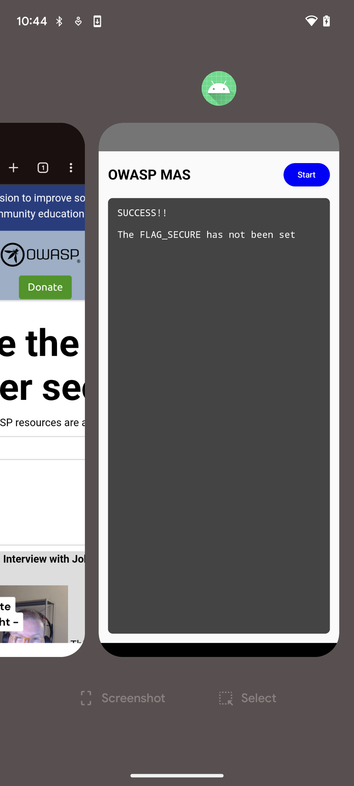

Ensure that the app hides sensitive content, such as credit card details and passcodes, from screen readers and system backgrounding. Malware may attempt to capture screen output to extract confidential information. Make sure that the keyboard view is also protected as it may leak keystrokes for the passcode fields.

Screenshots may be saved in locations that are accessible to other applications, or accessible to the attacker with local access to the device.

Use code below to hide the content of the Activity.

```kotlin
window.setFlags(WindowManager.LayoutParams.FLAG_SECURE,
                WindowManager.LayoutParams.FLAG_SECURE)

setContentView(R.layout.activity_main)
```

Setting the `FLAG_SECURE` will make your screenshot black so that none confidential data is exposed.

| Without `FLAG_SECURE` | With FLAG_SECURE
|  | 

Refer to the "[Testing Data Storage](../Document/0x05d-Testing-Data-Storage.md "Testing Data Storage")" chapter for more information and best practices on securely storing sensitive data.
