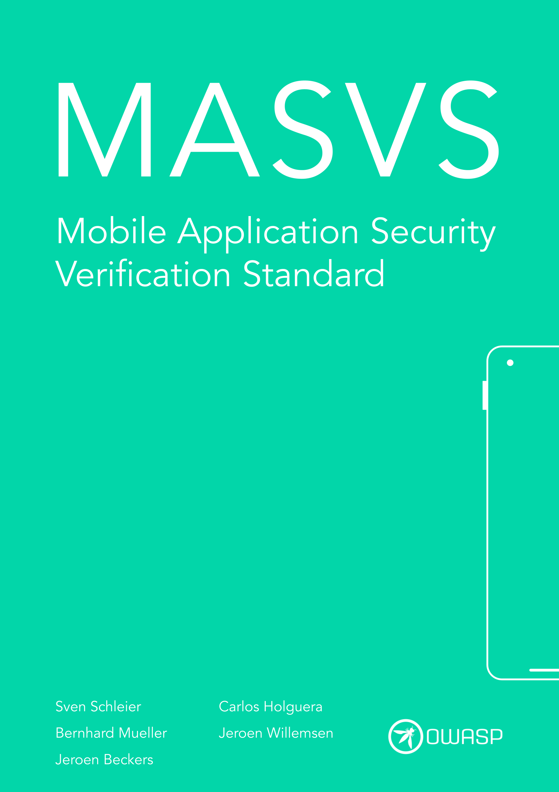

---
hide:
  - toc
---

# OWASP MASVS

<a href="https://github.com/OWASP/owasp-masvs/">:material-github: GitHub Repo</a>

The **OWASP MASVS (Mobile Application Security Verification Standard)** is the industry standard for mobile app security. It can be used by mobile software architects and developers seeking to develop secure mobile applications, as well as security testers to ensure completeness and consistency of test results.

 

[:material-download: Download the MASVS v2.0.0](https://github.com/OWASP/owasp-masvs/releases/latest/download/OWASP_MASVS.pdf){ .md-button .md-button--primary }

 

 :material-translate: Starting with MASVS v2.0.0, translations will no longer be included to focus on the development of MASTG v2.0.0. We encourage the community to create and maintain their own translations. Thank you to all the past translators who generously volunteered their time and expertise to make the MASVS accessible to non-English speaking communities. We truly appreciate your contributions and hope to continue working together in the future. The past MASVS v1.5.0 translations are still [available in the MASVS repo](https://github.com/OWASP/owasp-masvs/releases/tag/v1.5.0).

 
