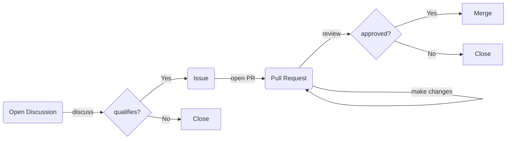

# How Can You Contribute?

You can directly contribute to the MASVS, MASWE, or MASTG in many different ways!

## Contribution Flow

Typically, contributors should follow the entire process. However, sometimes it's clear what's needed, so we create an issue or open a PR directly. We recommend starting with a discussion to save you from the hassle of writing and submitting content that does not qualify, which would result in it being rejected after the work is done.

| How to contribute                                       | Description                                                                   | MASVS                                                     | MASWE                                                     | MASTG                                                     |
| -------------------------------------------- | ----------------------------------------------------------------------------- | --------------------------------------------------------- | --------------------------------------------------------- | --------------------------------------------------------- |
| [:simple-livechat: Participate in Discussions](3_PRs_and_Reviews.md#how-to-participate-in-discussions) | Ask questions, give feedback, or propose ideas.  | [Discussions](https://github.com/OWASP/masvs/discussions) | [Discussions](https://github.com/OWASP/maswe/discussions) | [Discussions](https://github.com/OWASP/mastg/discussions) |
| [:simple-target: Create Issues](3_PRs_and_Reviews.md#how-to-create-issues)                          | Report concrete actionable things such as missing content, errors, or improvements.     | [Issues](https://github.com/OWASP/masvs/issues)           | [Issues](https://github.com/OWASP/maswe/issues)           | [Issues](https://github.com/OWASP/mastg/issues)           |
| [:material-source-pull: Open Pull Requests](3_PRs_and_Reviews.md#how-to-open-a-pr)                  | Submit new content, updates or fixes. | [Pull Requests](https://github.com/OWASP/masvs/pulls)           | [Pull Requests](https://github.com/OWASP/maswe/pulls)           | [Pull Requests](https://github.com/OWASP/mastg/pulls)           |
| [:material-eye-check: Review Pull Requests](3_PRs_and_Reviews.md#how-to-review-a-pr)                  | Review technical content or fix typos.                              | [Pull Requests](https://github.com/OWASP/masvs/pulls)           | [Pull Requests](https://github.com/OWASP/maswe/pulls)           | [Pull Requests](https://github.com/OWASP/mastg/pulls)           |
