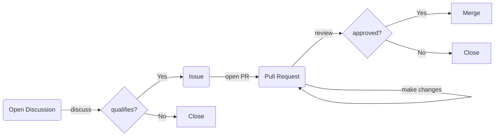

# How Can You Contribute?

You can directly contribute to the MASVS or MASTG in many different ways! First, go ahead and create a GitHub account for free on the [GitHub homepage](https://github.com/).

## Contribution Flow

## 💬 Participate in Discussions

Our GitHub [Discussions](https://github.com/OWASP/owasp-mastg/discussions) are the first place to go to ask questions, give feedback, and propose new ideas. If your proposal qualifies for the MASTG/MASVS, we'll convert it into an "Issue" (the discussion might take a while).

## 🎯 Create Issues

Before creating a PR, first create an [Issue](https://github.com/OWASP/owasp-masvs/issues "MASVS Issues") to be discussed for missing requirements, content or errors.

- To avoid multiple people duplicating effort on the same issue, project leaders will assign it to only a few that will own it.
- Explain what you think is missing in the issue, including references (if available) and suggest where it could be added.

## 📝 Open a Pull Request

You can contribute with content or corrections by opening a Pull Request (PR).

- Your PR may be merged after review.
- Be sure to follow our [style guide](5_Style_Guide.md) when writing content.

> Learn how to open a PR [here](3_PRs_and_Reviews.md#how-to-open-a-pr).

## ✅ Become a Reviewer

You can [Review Pull Requests (PRs)](https://github.com/OWASP/owasp-masvs/pulls) and also gain contributions. If you are a fluent speaker in any of the different languages that the MASVS is available in, feel free to give feedback on any of the submitted PRs.

After your PR or issue has been submitted, we will review it as quickly as possible which typically only takes a few days. If you think we have forgotten about it, feel free to give us a nudge after 7 days have passed.

> Learn how to review a PR [here](3_PRs_and_Reviews.md#how-to-review-a-pr).

## 🔎 Proof-reading

If you do proof-reading, these are the things we’re looking for:

- Content [cohesion & coherence](https://writing.chalmers.se/chalmers-writing-guide/writing-a-text/coherence-cohesion/)
    - is there a good linkage of ideas?
    - does the paragraph make sense?
    - does it make sense with the next one? think that hundreds of people have written in here, often without considering the surroundings of the text they were including).
- Reducing the content to a minimum (people tend to be very verbose/wordy) and in such a document we need clear and short/concise statements
- Optimize for _scannability_ (maybe instead of a big paragraph it would be better to have a bullet point list).
- Any passive voice sentences? Convert to active voice.
- Does each paragraph focus on a single topic?
- Are key points stated at the start of each section?
- Are commas, parentheses, colons, em-dashes, and semicolons used properly?

Refer to Google Technical Writing trainings for more info:

- [Google Technical Writing One](https://developers.google.com/tech-writing/one)
- [Google Technical Writing Two](https://developers.google.com/tech-writing/two)

## 🌐 Translating the MASVS

Translating the MASVS in a new language is another great way to contribute. This helps the project to reach to more people around the world.

Before starting a translation please consider the following:

- **First of all** contact us on Slack or via email.
- We need your commitment. After the first translation is done, we will ask for your help to translate any new changes, so your translation can remain up to date.
- We need a second translator who can verify that the English version of the MASVS has been translated properly.
- Once you are all set, go to your fork and follow [these steps](4_Add_new_Language.md).
