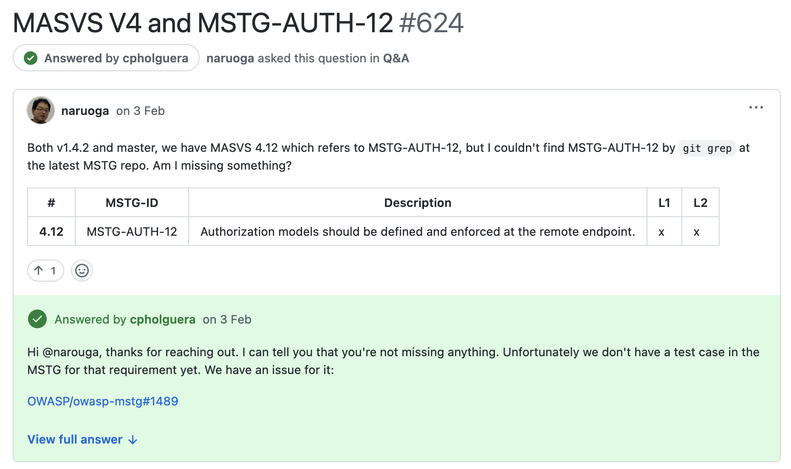

# Pull Requests & Reviews

## How to Participate in Discussions

[:simple-github: Open a Discussion](https://docs.github.com/en/discussions/quickstart#creating-a-new-discussion) to ask questions, give feedback, and propose new ideas. If your proposal qualifies, we'll convert it into an "Issue" (the discussion might take a while).

For example, you can start a discussion like "Add a weakness about key rotation" for MASWE or "Add a test case for key rotation on Android" for MASTG.

Once you get your answer please [mark it as answered](https://docs.github.com/en/discussions/collaborating-with-your-community-using-discussions/participating-in-a-discussion#marking-a-comment-as-an-answer). When you mark a question as an answer, GitHub will highlight the comment and replies to the comment to help visitors quickly find the answer.

## How to Create Issues

[:simple-github: Create an issue](https://docs.github.com/en/issues/tracking-your-work-with-issues/using-issues/creating-an-issue) before opening a pull request. Clearly describe the problem or feature you plan to work on.

Before creating an issue:

- Check if it already exists. If you find a related issue, comment on it instead of creating a new one.
- Break down complex problems into smaller tasks (issues) if possible.

When creating an issue, please follow these guidelines:

- Use a clear and descriptive title.
- Include detailed context, steps to reproduce (if reporting a bug), and expected behavior.

Next, if you'd like to work on the issue, you request to be assigned to it. You can do this by clicking on the "Assignees" section in the right sidebar of the issue page and selecting yourself or asking to be assigned by a maintainer.

## How to Open a PR

[:simple-github: Open a PR](https://docs.github.com/en/pull-requests/collaborating-with-pull-requests/proposing-changes-to-your-work-with-pull-requests/creating-a-pull-request-from-a-fork) to contribute with content or corrections.

- The target branch should be `master` or `main`.
- If your PR closes an issue, write ["Closes `#<issue-id>`"](https://docs.github.com/en/issues/tracking-your-work-with-issues/linking-a-pull-request-to-an-issue) at the beginning of the PR description.
- Follow our [style guide](5_Style_Guide.md) when writing content.
- **Self-review** your changes locally and in GitHub.

Next, you can request a review as described in the next section.

## How to Get your PR Reviewed

[:simple-github: Request a review](https://docs.github.com/en/pull-requests/collaborating-with-pull-requests/proposing-changes-to-your-work-with-pull-requests/requesting-a-pull-request-review) from one of our maintainers or contributors. You can do this by clicking on the "Reviewers" section in the right sidebar of the PR page and selecting the user(s) you want to review your PR.

If you do not have the correct permissions to request a review, please write a comment on the PR mentioning us (`@cpholguera`, `@sushi2k` or `@TheDauntless`) and we will assign a reviewer for you.

Once a review is requested, it will be reviewed by one of our maintainers or contributors. They will check your changes and provide feedback.

## How to Incorporate the Reviewer's Feedback to your PR

[:simple-github: Incorporate feedback from reviewers](https://docs.github.com/en/pull-requests/collaborating-with-pull-requests/reviewing-changes-in-pull-requests/incorporating-feedback-in-your-pull-request) into your PR by following these steps:

- [Apply any Suggested Changes](https://docs.github.com/en/pull-requests/collaborating-with-pull-requests/reviewing-changes-in-pull-requests/incorporating-feedback-in-your-pull-request#applying-suggested-changes) using the "Commit suggestions" button.
- In order to process a comment, simply make modifications directly to your branch and push normally. GitHub will automatically detect these changes and add them to your existing PR.
- As you update your PR and apply changes, mark each conversation as [resolved](https://docs.github.com/en/github/collaborating-with-issues-and-pull-requests/commenting-on-a-pull-request#resolving-conversations).
- If you run into any merge issues, [refer to this page](https://docs.github.com/en/pull-requests/collaborating-with-pull-requests/addressing-merge-conflicts/about-merge-conflicts) to learn how to resolve them.

> NOTE: Remember to regularly [sync your fork](https://docs.github.com/en/pull-requests/collaborating-with-pull-requests/working-with-forks/syncing-a-fork) with the upstream repo: `git pull upstream/master`

## How to Review a PR

[:simple-github: Review PRs](https://docs.github.com/en/pull-requests/collaborating-with-pull-requests/reviewing-changes-in-pull-requests/about-pull-request-reviews) and also gain contributions.

- Request to be assigned to PRs that match your expertise.
- Be sure to follow our [style guide](5_Style_Guide.md) when reviewing content.

If you'd like to review an open PR please follow these steps:

### Step 1: Comment and Suggest Changes

[:simple-github: Comment on a PR](https://docs.github.com/en/pull-requests/collaborating-with-pull-requests/reviewing-changes-in-pull-requests/commenting-on-a-pull-request) using single or multi-line comments (click and drag to select the range of lines):

**Always prefer making "Suggested Changes"** using the `±` button:

If the suggestion you'd like to make cannot be expressed using "suggested changes" please enter a clear comment explaining what should be fixed (e.g. some paragraphs don't link properly or some essential information cannot be found and should be added).

> Using "Suggested Changes" saves you as a reviewer and the PR author a lot of time. And you get _points_ (attributions) for the changes that you suggested (if the author commits them you become a co-author of those commits). If you're constant with your reviewer work you can apply to be recognize as an official reviewer in our Acknowledgements page.

### Step 2: Submit your Review

[:simple-github: Submit your review](https://docs.github.com/en/pull-requests/collaborating-with-pull-requests/reviewing-changes-in-pull-requests/reviewing-proposed-changes-in-a-pull-request#submitting-your-review) once you went through the whole PR.

1. Click on "Review changes".
2. Enter a comment for the contributor.
3. Select the type of review you'd like to leave (Comment, Approve or Request Changes).
4. Click on "Submit review".
