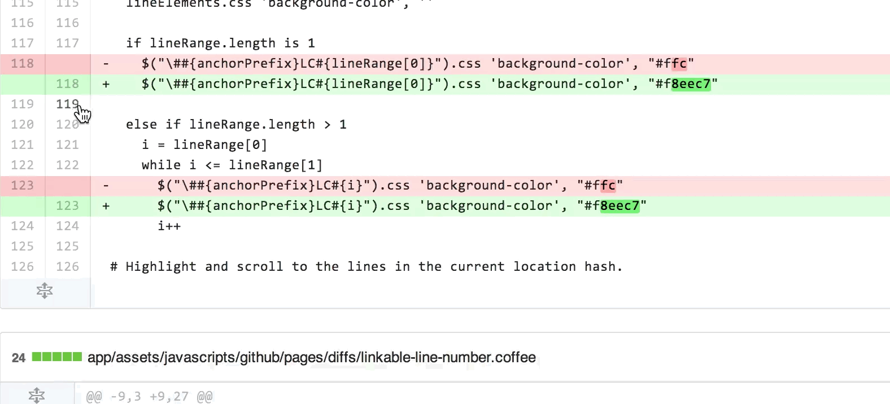

# Pull Requests & Reviews

## How to Open a PR

You can create a Pull Request (PR) by following [these steps](https://docs.github.com/en/pull-requests/collaborating-with-pull-requests/proposing-changes-to-your-work-with-pull-requests/creating-a-pull-request-from-a-fork). Remember that:

- The target branch should be `master`.
- If your PR closes and issue, write ["Closes `#<issue-id>`"](https://docs.github.com/en/issues/tracking-your-work-with-issues/linking-a-pull-request-to-an-issue).

Your PR will be reviewed soon (refer to this page to learn more about [reviews](https://docs.github.com/en/pull-requests/collaborating-with-pull-requests/reviewing-changes-in-pull-requests/about-pull-request-reviews)).

> Before opening a PR please **self-review your changes in GitHub** and ensure that you follow our [style guide](5_Style_Guide.md) to speed up the review process⚡

## How to Incorporate the Reviewer's Feedback to your PR

It might be directly approved and merged or one of our reviewers will send you some comments and suggested changes.

When reviewers suggest changes in a pull request, you can automatically incorporate the changes into your PR.

- [Apply any Suggested Changes](https://docs.github.com/en/pull-requests/collaborating-with-pull-requests/reviewing-changes-in-pull-requests/incorporating-feedback-in-your-pull-request#applying-suggested-changes) using the "Commit suggestions" button.
- In order to process a comment, simply make modifications directly to your branch and push normally. GitHub will automatically detect these changes and add them to your existing PR.
- As you update your PR and apply changes, mark each conversation as [resolved](https://docs.github.com/en/github/collaborating-with-issues-and-pull-requests/commenting-on-a-pull-request#resolving-conversations).
- If you run into any merge issues, [refer to this page](https://docs.github.com/en/pull-requests/collaborating-with-pull-requests/addressing-merge-conflicts/about-merge-conflicts) to learn how to resolve them.

> NOTE: Remember to regularly [sync your fork](https://docs.github.com/en/pull-requests/collaborating-with-pull-requests/working-with-forks/syncing-a-fork) with the upstream repo: `git pull upstream/master`

## How to Review a PR

If you'd like to review an open PR please follow these steps:

### Step 1: Comment and Suggest Changes

You can enter single or multi-line comments (click and drag to select the range of lines):

**Always prefer making "Suggested Changes"** using the `±` button:

If the suggestion you'd like to make cannot be expressed using "suggested changes" please enter a clear comment explaining what should be fixed (e.g. some paragraphs don't link properly or some essential information cannot be found and should be added).

> Using "Suggested Changes" saves you as a reviewer and the PR author a lot of time. And you get _points_ (attributions) for the changes that you suggested (if the author commits them you become a co-author of those commits). If you're constant with your reviewer work you can apply to be recognize as an official reviewer in our Acknowledgements page.

### Step 2: Submit your Review

Once you went through the whole PR you can [submit your review](https://docs.github.com/en/pull-requests/collaborating-with-pull-requests/reviewing-changes-in-pull-requests/reviewing-proposed-changes-in-a-pull-request#submitting-your-review)

1. Click on "Review changes".
2. Enter a comment for the contributor.
3. Select the type of review you'd like to leave (Comment, Approve or Request Changes).
4. Click on "Submit review".

> Learn more: ["(GitHub Docs) Reviewing proposed changes in a pull request"](https://docs.github.com/en/pull-requests/collaborating-with-pull-requests/reviewing-changes-in-pull-requests/reviewing-proposed-changes-in-a-pull-request).
