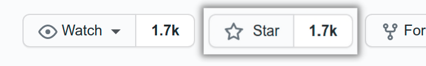

# Contributing to the MAS Project

_First of all,_ [⭐ Give us a Star in GitHub](https://github.com/OWASP/owasp-mastg)!

 

The MAS project is an open source effort and we welcome all kinds of contributions and feedback.

**Help us improve & join our community:**

- 🐞 [Report an error (typos, grammar)](1_How_Can_You_Contribute.md#create-issues) or [fix it on a Pull Request](1_How_Can_You_Contribute.md#open-a-pull-request).
- 💬 Give feedback ([MASTG](https://github.com/OWASP/owasp-mastg/discussions/categories/general)/[MASVS](https://github.com/OWASP/owasp-masvs/discussions/categories/general)).
- 🙏 Ask questions ([MASTG](https://github.com/OWASP/owasp-mastg/discussions/categories/q-a)/[MASVS](https://github.com/OWASP/owasp-masvs/discussions/categories/q-a)).

**Contribute with content:**

- 💡 Propose ideas or suggest improvements ([MASTG](https://github.com/OWASP/owasp-mastg/discussions/categories/ideas)/[MASVS](https://github.com/OWASP/owasp-masvs/discussions/categories/ideas)). If it qualifies we'll promote it to an Issue.
- 📄 [Create a Pull Request](1_How_Can_You_Contribute.md#open-a-pull-request) for concrete fixes (e.g. grammar/typos) or content already approved by the core team.

Before you start contributing, please check our pages ["How Can You Contribute?"](1_How_Can_You_Contribute.md) and ["Getting Started"](2_Getting_Started.md). If you have any doubts [please contact us](../contact.md).

## 🚫 What not to do

Although we greatly appreciate any and all contributions to the project, there are a few things that you should take into consideration:

- **No advertisement**: The OWASP mobile Security Project cannot be used as a platform for advertisement of commercial tools, companies or individuals. Technical content such as the implementation of certain techniques or tests should be written with free and open-source tools in mind. Commercial tools are typically not accepted, but might be referenced in some specific cases.
- **No unnecessary self-promotion of tools or blog posts**: If you have a relation with one of the URLs or tools you are referencing, please state so in the PR so that we can verify that the reference is in line with the rest of the guide.

Please be sure to take a careful look at our [Code of Conduct](https://github.com/OWASP/owasp-mastg/blob/master/.github/CODE_OF_CONDUCT.md "Code of Conduct") for all the details and [ask us](../contact.md) in case of doubt.

## Tool Inclusion Disclaimer for Contributors

OWASP MASTG encourages community contributions, including security testing tools that provide clear and practical value. However, all tool submissions are subject to review and may be rejected if they appear to be self-promotional, lack relevance, or do not meet minimum quality standards (e.g., documentation, usability, maintenance).

To be considered for inclusion, tools should be:

- Open source or freely accessible
- Clearly documented and usable by the community
- Actively maintained, with updates tracking Android and iOS platform changes whenever applicable

Even after inclusion, tools are subject to removal if they become outdated, broken, unmaintained, or otherwise no longer align with the goals of the MASTG. Inclusion is not permanent and does not imply endorsement by OWASP.

In instances where no suitable open-source alternative exists, we may include closed-source tools. However, any closed-source tools included must be free to use, as we aim to avoid featuring paid tools whenever possible. This also extends to freeware or community editions of commercial tools.

Our goal is to be vendor-neutral and to serve as a trusted learning resource, which is why we've **avoid the inclusion of "automated mobile application security scanners"** due to the competitive challenges they pose. Instead, we focus on tools that provide full code access and comprehensive testing, as they are better suited for educational purposes. Tools that lack this transparency, even if they offer a free version, typically do not meet the OWASP MAS project's inclusion criteria.

 

## Our Contributors

All of our contributors are listed in GitHub repos. See [OWASP MASTG Authors & Co-Authors](../MASTG/0x02a-Frontispiece.md#authors), [MASTG Contributors](https://github.com/OWASP/owasp-mastg/graphs/contributors) and [MASVS Contributors](https://github.com/OWASP/owasp-masvs/graphs/contributors).

**Update March 2023: We're creating a new concept for contributions that aligns with the new MASTG v2 workflows. Stay tuned...**

 

### OWASP MAS Project Featured Contributions

- Damien Clochard (Automation in GitHub Actions with pandocker)
- Loni Jacobsen (Access to Corellium)

### OWASP MASVS V2

_Coming soon..._

### OWASP MASTG V2

_Coming soon..._

### OWASP MASVS V1

The latest version of the MASVS v1 including all translations is available here: <https://github.com/OWASP/owasp-masvs/releases/tag/v1.5.0>

| Project Lead | Lead Author | Contributors and Reviewers |
| ------- | --- | ----------------- |
| Sven Schleier and Carlos Holguera | Bernhard Mueller, Sven Schleier, Jeroen Willemsen and Carlos Holguera | Alexander Antukh, Mesheryakov Aleksey, Elderov Ali, Bachevsky Artem, Jeroen Beckers, Jon-Anthoney de Boer, Ben Cheney, Will Chilcutt, Stephen Corbiaux, Ratchenko Denis, Ryan Dewhurst, @empty_jack, Ben Gardiner, Manuel Delgado, Anton Glezman, Josh Grossman, Sjoerd Langkemper, Vinícius Henrique Marangoni, Martin Marsicano, Roberto Martelloni, @PierrickV, Julia Potapenko, Andrew Orobator, Mehrad Rafii, Javier Ruiz, Abhinav Sejpal, Stefaan Seys, Yogesh Sharma, Prabhant Singh, Nikhil Soni, Anant Shrivastava, Francesco Stillavato, Abdessamad Temmar, Pauchard Thomas, Lukasz Wierzbicki |

 

| Language | Translators & Reviewers |
| --------------- | ------------------------------------------------------------ |
| Brazilian Portuguese | Mateus Polastro, Humberto Junior, Rodrigo Araujo, Maurício Ariza, Fernando Galves |
| Chinese (Traditonal) | Peter Chi, Lex Chien, Henry Hu, Leo Wang |
| Chinese (Simplified) | Bob Peng, Harold Zang, Jack S |
| French | Romuald Szkudlarek, Abderrahmane Aftahi, Christian Dong (Review) |
| German | Rocco Gränitz, Sven Schleier (Review) |
| Hindi | Mukesh Sharma, Ritesh Kumar, Kunwar Atul Singh, Parag Dave, Devendra Kumar Sinha, Vikrant Shah |
| Japanese | Koki Takeyama, Riotaro Okada (Review) |
| Korean | Youngjae Jeon, Jeongwon Cho, Jiyou Han, Jiyeon Sung |
| Persian | Hamed Salimian, Ramin Atefinia, Dorna Azhirak, Bardiya Akbari, Mahsa Omidvar, Alireza Mazhari, Milad Khoshdel |
| Portuguese | Ana Filipa Mota, Fernando Nogueira, Filipa Gomes, Luis Fontes, Sónia Dias|
| Russian | Gall Maxim, Eugen Martynov, Chelnokov Vladislav, Oprya Egor, Tereshin Dmitry |
| Spanish | Martin Marsicano, Carlos Holguera |
| Turkish | Anıl Baş, Haktan Emik |
| Greek | Panagiotis Yialouris |

### OWASP MASTG V1

The latest version of the MASTG v1 is available here: <https://github.com/OWASP/owasp-mastg/releases/tag/v1.5.0>

**Note**: This contributor table is generated based on our [GitHub contribution statistics](https://github.com/OWASP/owasp-mastg/graphs/contributors "GitHub contribution statistics"). For more information on these stats, see the [GitHub Repository README](https://github.com/OWASP/owasp-mastg/blob/master/README.md "GitHub Repository README"). We manually update the table, so be patient if you're not listed immediately.

- **Reviewers**: Reviewers have consistently provided useful feedback through GitHub issues and pull request comments.
- **Top Contributors**: Top contributors have consistently contributed quality content and have at least 500 additions logged in the GitHub repository.
- **Contributors**: Contributors have contributed quality content and have at least 50 additions logged in the GitHub repository.
- **Mini Contributors**: Many other contributors have committed small amounts of content, such as a single word or sentence (less than 50 additions).

| Authors | Reviewers | Top Contributors | Contributors | Mini Contributors | Editors |
| ---- | ---- | ----- | --- | --- | --- |
| Bernhard Mueller, Sven Schleier, Jeroen Willemsen, Carlos Holguera | Jeroen Beckers, Sjoerd Langkemper, Anant Shrivastava | Pawel Rzepa, Francesco Stillavato, Henry Hoggard, Andreas Happe, Kyle Benac, Paulino Calderon, Alexander Anthuk, Caleb Kinney, Abderrahmane Aftahi, Koki Takeyama, Wen Bin Kong, Abdessamad Temmar, Cláudio André, Slawomir Kosowski, Bolot Kerimbaev, Lukasz Wierzbicki | kryptoknight13, DarioI, luander, oguzhantopgul, Osipion, mpishu, pmilosev, isher-ux, thec00n, ssecteam, jay0301, magicansk, jinkunong, nick-epson, caitlinandrews, dharshin, raulsiles, righettod, karolpiateknet, mkaraoz, Sjord, bugwrangler, jasondoyle, joscandreu, yog3shsharma, ryantzj, rylyade1, shivsahni, diamonddocumentation, 51j0, AnnaSzk, hlhodges, legik, abjurato, serek8, mhelwig, locpv-ibl and ThunderSon. | jonasw234, zehuanli, jadeboer, Isopach, prabhant, jhscheer, meetinthemiddle-be, bet4it, aslamanver, juan-dambra, OWASP-Seoul, hduarte, TommyJ1994, forced-request, D00gs, vasconcedu, mehradn7, whoot, LucasParsy, DotDotSlashRepo, enovella, ionis111, vishalsodani, chame1eon, allRiceOnMe, crazykid95, Ralireza, Chan9390, tamariz-boop, abhaynayar, camgaertner, EhsanMashhadi, fujiokayu, decidedlygray, Ali-Yazdani, Fi5t, MatthiasGabriel, colman-mbuya and anyashka | Heaven Hodges, Caitlin Andrews, Nick Epson, Anita Diamond, Anna Szkudlarek |

### OWASP MASTG Beta

#### OWASP MSTG "Beta 2" (Google Doc)

| Authors | Reviewers | Top Contributors |
| --- | --- | --- |
| Milan Singh Thakur, Abhinav Sejpal, Blessen Thomas, Dennis Titze, Davide Cioccia, Pragati Singh, Mohammad Hamed Dadpour, David Fern, Ali Yazdani, Mirza Ali, Rahil Parikh, Anant Shrivastava, Stephen Corbiaux, Ryan Dewhurst, Anto Joseph, Bao Lee, Shiv Patel, Nutan Kumar Panda, Julian Schütte, Stephanie Vanroelen, Bernard Wagner, Gerhard Wagner, Javier Dominguez | Andrew Muller, Jonathan Carter, Stephanie Vanroelen, Milan Singh Thakur | Jim Manico, Paco Hope, Pragati Singh, Yair Amit, Amin Lalji |

#### OWASP MSTG "Beta 1" (Google Doc)

| Authors | Reviewers | Top Contributors |
| --- | --- | --- |
| Milan Singh Thakur, Abhinav Sejpal, Pragati Singh, Mohammad Hamed Dadpour, David Fern, Mirza Ali, Rahil Parikh | Andrew Muller, Jonathan Carter | Jim Manico, Paco Hope, Yair Amit, Amin Lalji |
