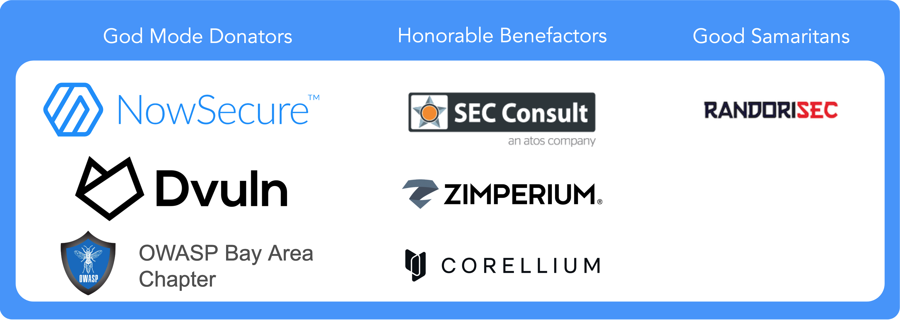

# Donations

While both the MASVS and the MASTG are created and maintained by the community on a voluntary basis, sometimes a little bit of outside help is required.

**Monetary Donations:** You can donate any amount you like, no matter how small, anyone can help. From 500$ up you may select a [Donation Package](donate/packages.md) and be listed as a donator.

100% of the funds go to the OWASP Foundation and allow us funding our project activities such as contracting technical editors, graphic designers, software developers, purchasing test devices, creating swag, etc.

<a href="https://owasp.org/donate/?reponame=www-project-mobile-app-security&title=OWASP+Mobile+Application+Security" class="md-button md-button--primary" style="margin: 5px;">:white_heart:{ .pump } Donate</a>
<a href="https://leanpub.com/owasp-mastg" class="md-button md-button--primary" style="margin: 5px;">:material-book-heart: Purchase the MASTG</a>

**Effort Based:** You can instead support the project by contributing with your work and end up at our [acknowledgement section](MASTG/Intro/0x02c-Acknowledgements.md "MASTG acknowledgements").

If you're a company, consider becoming a ["MAS Advocate"](MASTG/Intro/0x02c-Acknowledgements.md#our-mas-advocates) which is the highest status that companies can achieve in the project acknowledging that they've gone above and beyond to support the project.

<a href="../contributing/" class="md-button md-button--primary" style="margin: 5px;">:material-text-box-edit: Contribute</a>
<a href="https://mas.owasp.org/#mas-advocates" class="md-button md-button--primary" style="margin: 5px;">:material-medal: Become a MAS Advocate</a>

## Our Donators

We thank our donators for providing the funds to support us on our project activities.

**The OWASP Foundation is very grateful for the support by the individuals and organizations listed. However please note, the OWASP Foundation is strictly vendor neutral and does not endorse any of its supporters. Donations do not influence the content of the MASVS or MASTG in any way.**

  

  
