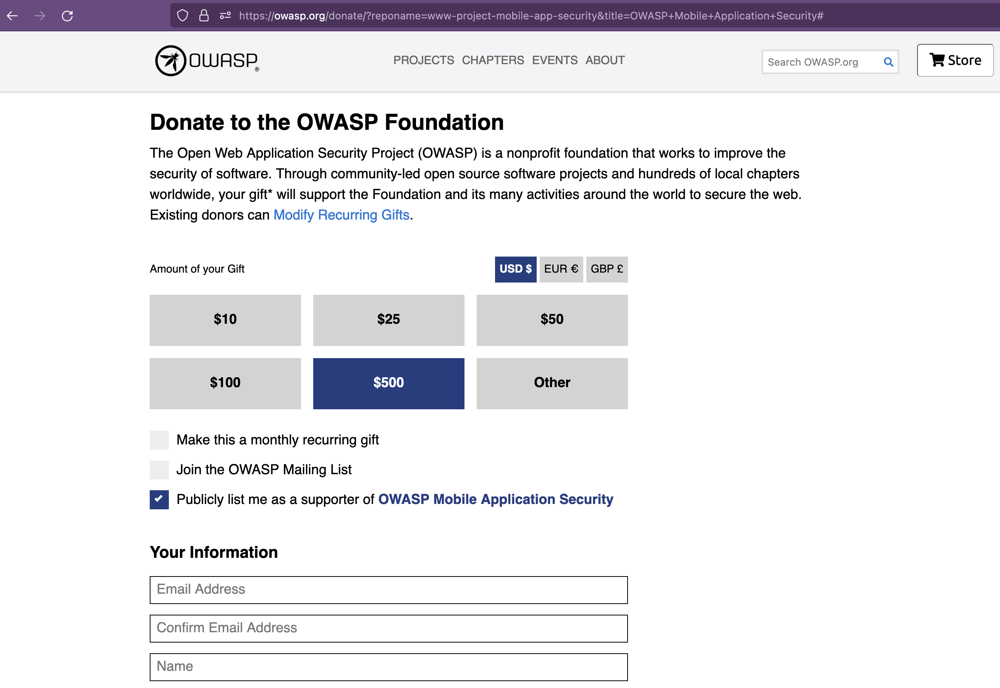
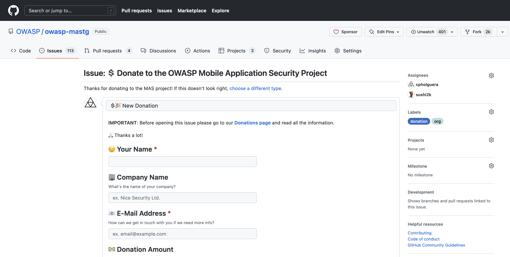

# ♡ Donations

While both the MASVS and the MASTG are created and maintained by the community on a voluntary basis, sometimes a little bit of outside help is required. If you'd like to support the OWASP MAS project we'll be happy to accept your donations.

1. You may donate 5, 500, 5000 (USD/EUR/GBP) or any custom amount. Certain amounts allow you to opt-in for a "[Donation Package](#donation-packages)" (see below).

2. Purchase the [OWASP MASTG on leanpub.com](https://leanpub.com/owasp-mastg).

3. Consider becoming a [MAS Advocate](../Document/0x02c-Acknowledgements.md#our-mas-advocates).

100% of the funds raised go directly to the OWASP foundation and allow us to ask for budget to fund our project activities:

- Editing and proofreading by professional editors.
- Graphic design and layout improvements.
- Improving our automated delivery pipelines.
- Acquiring new test devices if certain tests can not be executed on existing emulators/simulators/test devices.

## Donators

We thank our donators for providing the funds to support us on our project activities. The Donation Packages are described on the [Donation page](#donation-packages).

**The OWASP Foundation is very grateful for the support by the individuals and organizations listed. However please note, the OWASP Foundation is strictly vendor neutral and does not endorse any of its supporters. Donations do not influence the content of the MASVS or MASTG in any way.**

  

  

## Steps

### Make your Donation

You can make a donation by opening this [link at the official OWASP website](https://owasp.org/donate/?reponame=www-project-mobile-app-security&title=OWASP+Mobile+Application+Security). Fill in the form and be sure to **select the option**:
> "Publicly list me as a supporter of OWASP Mobile Application Security"

### Register your Donation Package (optional)

If your donation is above USD 500 you may opt-in for a [Donation Package](#donation-packages). Please fill out the [MASTG Donation Form](https://github.com/OWASP/owasp-mastg/issues/new?assignees=cpholguera%2Csushi2k&labels=org%2Cdonation&template=make-donation.yml&title=%F0%9F%92%B2%F0%9F%8E%89+New+Donation) (which will create a new Issue in the MASTG).

Once the issue is created, please copy its URL and send it to [Sven Schleier](mailto:sven.schleier@owasp.org) or [Carlos Holguera](mailto:carlos.holguera@owasp.org) to verify your donation. We will then, together with the OWASP Foundation, verify and process it.

> Please note that the OWASP Donation Policy has changed since 22-Sept-2020. All details can be found in [OWASP Donations Policy](https://owasp.org/www-policy/operational/donations) page.

## Donation Packages

> These types of public recognition shall be online no less than one year, or in the case of Project no less than the next major release, whichever is greater. Some Donation Packages have a maximum duration, once reached the logos will be removed and the donator will still be listed as supporter on the project website, GitHub and in the printed and digital versions. This can be renewed anytime.

### Good Samaritan (USD 500)

- Listed as a supporter on the project website and GitHub.
- Listed as a supporter in the printed and digital versions (without logo).
- Duration: 1 year
- Optional: 1 Paperback Book

### Honorable Benefactor (USD 2,000 / 8 Available)

- Small company logo in the “Honorable Benefactors” section on project website and Github.
- Small company logo on the supporter page of the printed and digital versions.
- Duration: 2 years
- Optional: 3 Paperback Books

### God Mode Donator (USD 4,000 / 5 Available)

- Large company logo in the “God mode donators section on project website and Github.
- Large company logo on the supporter page of the printed and digital versions.
- Duration: 3 years
- Optional: 5 Paperback Books

## Other Forms of Donation / Support

If you still want to support the project you can always [contribute with content](contributing/1_How_Can_You_Contribute.md) for the MASVS or the MASTG and end up at our [acknowledgement section](../Document/0x02c-Acknowledgements.md "MASTG acknowledgements").

If you're a company, consider becoming a [MAS Advocate](../Document/0x02c-Acknowledgements.md#our-mas-advocates) which is the highest status that companies can achieve in the project acknowledging that they've gone above and beyond to support the project.

If you have any questions please feel free to [reach out](https://mas.owasp.org/#connect-with-us) anytime.
