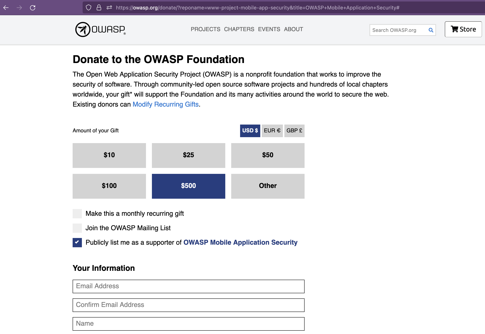

---
hide:
  - toc
---

# How to Donate

**1. Make your Donation:**

Click the button to make your donation directly in the official OWASP website:

:warning: Fill in the form and be sure to **select the option** _"Publicly list me as a supporter of OWASP Mobile Application Security"_

<a href="https://owasp.org/donate/?reponame=www-project-mobile-app-security&title=OWASP+Mobile+Application+Security" class="md-button md-button--primary" style="margin: 5px;">:white_heart:{ .pump } Make your Donation</a>

  

**2. Register your Donation Package (optional):**

If your donation is above USD 500 you may opt-in for a [Donation Package](packages.md) by registering it. We will then, together with the OWASP Foundation, verify and process it.

<a href="https://github.com/OWASP/owasp-mastg/issues/new?assignees=cpholguera%2Csushi2k&labels=org%2Cdonation&template=make-donation.yml&title=%F0%9F%92%B2%F0%9F%8E%89+New+Donation" class="md-button md-button--primary" style="margin: 5px;">:material-check-all: Register your Donation</a>

   
