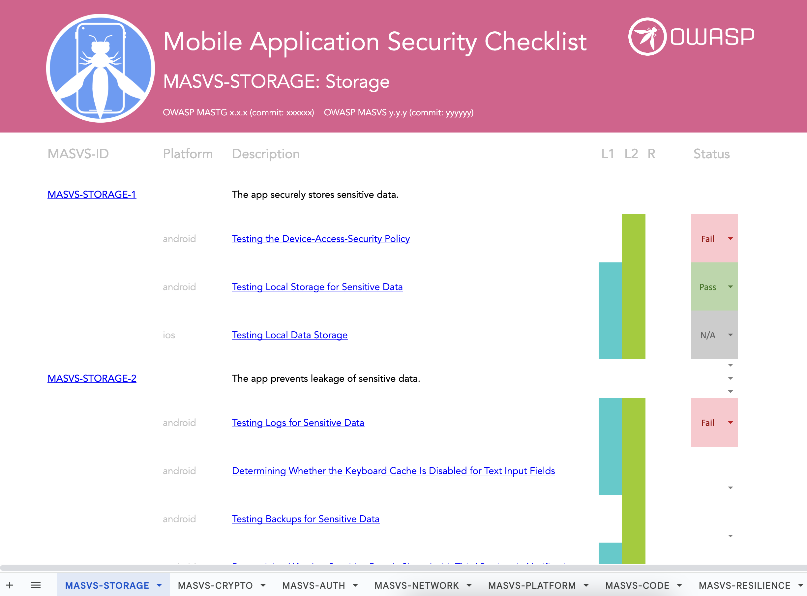

---
hide:
  - navigation
  - toc
---

# OWASP Mobile Application Security

## Our Mission

<blockquote>"Define the industry standard for mobile application security."</blockquote>

The OWASP Mobile Application Security (MAS) flagship project provides a security standard for mobile apps (OWASP MASVS), a list of common security and privacy weaknesses specific to mobile apps (OWASP MASWE) and a comprehensive testing guide (OWASP MASTG) that covers the processes, techniques, and tools and test cases that enable testers to deliver consistent and complete results.

<h2>OWASP MASVS</h2>

 

<h2>OWASP MASWE</h2>

 

<h2>OWASP MASTG</h2>

 

<h2>OWASP MAS Checklist</h2>

  

 

 

## Trusted By

The OWASP MASVS and MASTG are trusted by the following platform providers and standardization, governmental and educational institutions. [Learn more](MASTG/0x02b-MASVS-MASTG-Adoption.md).

 

## 🥇 MAS Advocates

MAS Advocates are key industry adopters of the OWASP MASVS and MASTG who have invested a significant and consistent amount of resources to drive the project forward and ensure its continued success. This includes making consistent high-impact contributions and actively promoting the adoption and usage of the project. <a href="MASTG/0x02c-Acknowledgements">Learn more</a>.

 
