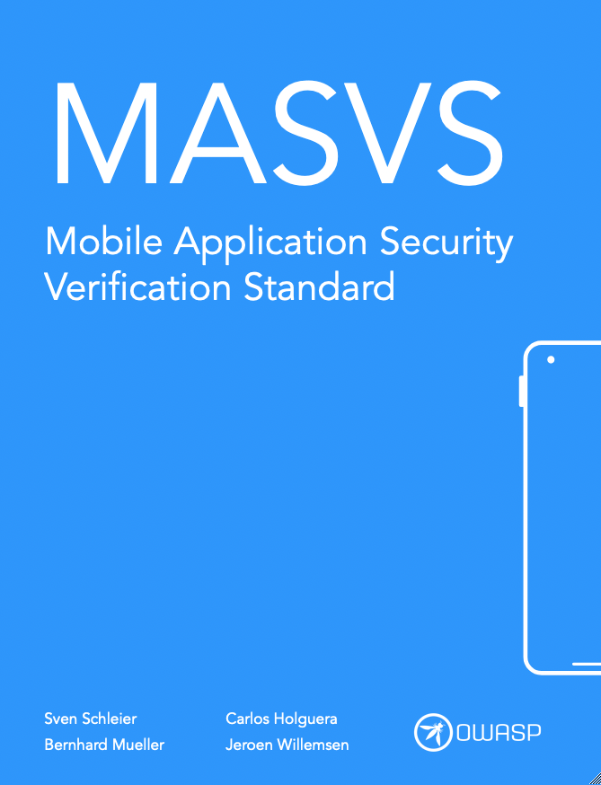
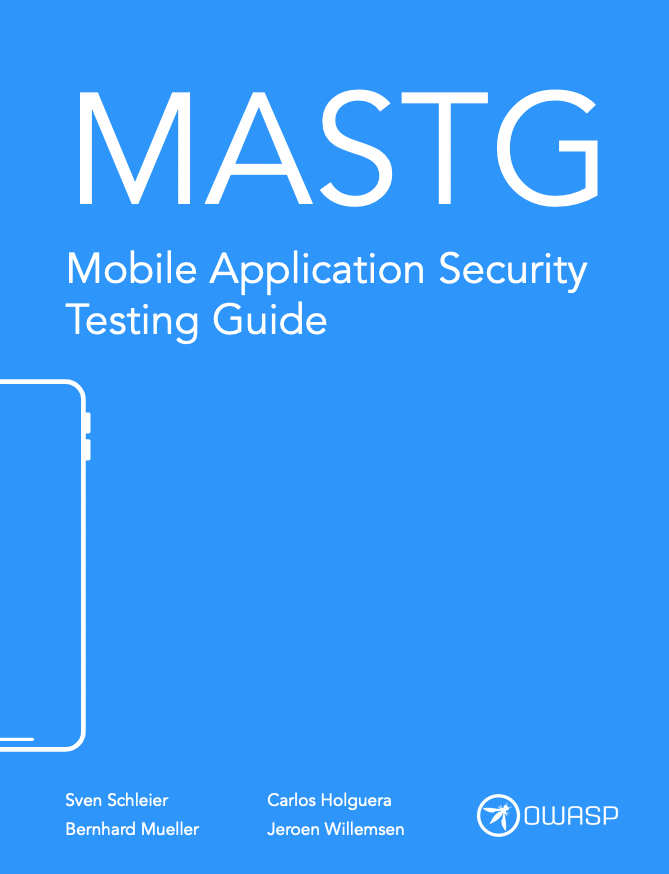
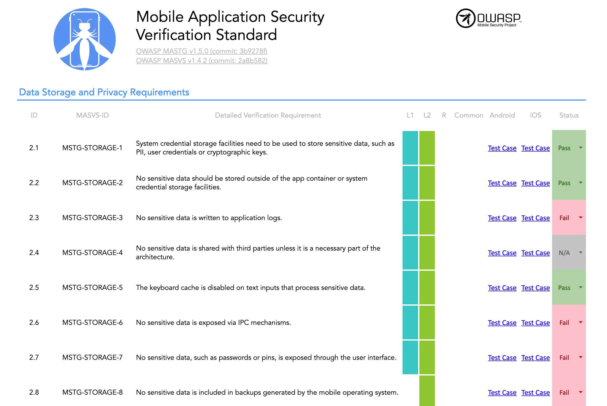

---
hide:
  - navigation
  - toc
title: "Home"
---

# OWASP Mobile Application Security

## Our Mission

<blockquote>"Define the industry standard for mobile application security."</blockquote>

The OWASP Mobile Application Security (MAS) flagship project provides a security standard for mobile apps (OWASP MASVS) and a comprehensive testing guide (OWASP MASTG) that covers the processes, techniques, and tools used during a mobile app security test, as well as an exhaustive set of test cases that enables testers to deliver consistent and complete results.

<h2>OWASP MASVS</h2>

 

<button class="mas-button" onclick="window.location.href='https://github.com/OWASP/owasp-masvs/releases/latest/download/OWASP_MASVS.pdf';"> Download the MASVS</button>

<h2>OWASP MASTG</h2>

 

<a href="https://github.com/OWASP/owasp-mastg/releases/latest/download/OWASP_MASTG-v1.5.0.pdf" class="md-button md-button--primary" > Download the MASTG</a>

<h2>OWASP MAS Checklist</h2>

  

   

<a href="https://github.com/OWASP/owasp-mastg/releases/latest/download/Mobile_App_Security_Checklist_en.xlsx" class="md-button md-button--primary" style="margin-top: 0.6em;"> Download the Checklist</a>

 

## Trusted by ...

The OWASP MASVS and MASTG are trusted by the following platform providers and standardization, governmental and educational institutions. [Learn more](MASTG/Intro/0x02b-MASVS-MASTG-Adoption.md).

 

## 🥇 MAS Advocates

MAS Advocates are industry adopters of the OWASP MASVS and MASTG who have invested a significant and consistent amount of resources to push the project forward by providing consistent high-impact contributions and continuously spreading the word. [Learn more](MASTG/Intro/0x02c-Acknowledgements.md).

 
