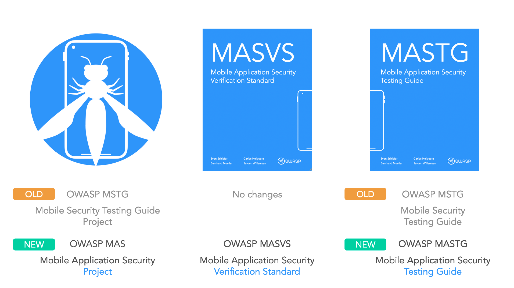

# News

## August 23rd, 2022: Project Rebranding to OWASP MAS

Until now our project was called the “OWASP Mobile Security Testing Guide (MSTG)” project. Unfortunately, this was a source of confusion since we happen to have a resource with the same name, the OWASP MSTG. Not only that, that name doesn’t reflect the full scope and reach of our project. Have you ever wondered why the MSTG is called MSTG and not MASTG? Both documents are about Mobile Application Security and we'd like to make that clear.

Today we are rebranding our project to “OWASP Mobile App Security (MAS)”. The OWASP MAS project includes:

- OWASP MASVS -> MAS Verification Standard
- OWASP MASTG -> MAS Testing Guide
- OWASP MAS Checklists
- OWASP MAS Crackmes (incl. Hacking playground)



We see MAS reflecting all the consistency, structure and transparency that we’re bringing with our 2.0 versions.

**The rebranding will happen gradually so expect changes to be rolled out over the upcoming days/weeks.**

## February 7th, 2022: NIST 800-218 - Recommendations for Mitigating the Risk of Software Vulnerabilities

We're happy to share the new NIST 800-218 (Feb 2022) mapping to the latest MASVS v1.4.2 (Jan 2022) especially MASVS-ARCH and MASVS-CODE:

> "Secure Software Development Framework (SSDF) v1.1: Recommendations for Mitigating the Risk of Software Vulnerabilities"


<https://nvlpubs.nist.gov/nistpubs/SpecialPublications/NIST.SP.800-218.pdf>

## November 17th, 2021: From Slack to GitHub Discussions

Hello everyone,

times change, our project evolves and being able to hear you and discuss with you all is key for the OWASP MSTG project.

`TL;DR: we deprecate Slack in favor of GitHub Discussions as our primary communication channel.`

https://github.com/OWASP/owasp-mastg/discussions/
https://github.com/OWASP/owasp-masvs/discussions/

### Removing obstacles

Until now we've driven all discussion on the MSTG Slack channel, to participate you had to get Slack, find the invite link (hope that it's still valid, else report it), go to our channel and post your question. It could really be a hurdle some times and some questions might be missed, there was also no way to up-vote them or keep track.

All our contributors do have a GitHub account (or should! now you have a reason :) ). So, **from today on we move to GitHub discussions and deprecate Slack as the primary communication channel**. You can still reach us there for private messages though and we will try to [relay the discussions to Slack ASAP](https://github.com/github/feedback/discussions/2844), but just as notifications (no Q&A over there).

> Discussions provides a place to bring all those conversations together right next to your code. Whether it’s asking questions, sharing announcements, or featuring important information, it’s all in one place and easily accessible to contributors and community members alike.

### Separation

We want to separation regarding actionable things to do (issues) and ideas/proposals (now "Ideas" Discussion). Having it all in GitHub makes it sooo much easier for us to manage, reference, etc. 

> Think of it this way: Discussions are for talking and GitHub Issues are for doing. This helps minimize distractions, keep teams on track, and address topics and questions clearly in a dedicated forum. Plus, you can move seamlessly between the two as well by converting an issue to a discussion and vice versa with a simple click.

### Insights

Soon we will be able to see insights regarding the discussions. You guessed it, we'll take that into account and acknowledge your contribution to the discussions as we do with the content itself. More details on this once we can test the feature.

### Roadmap

- [X] Deprecate Slack
- [X] Relay Discussions to Slack
- [X] Discussion contribution acknowledgement info

### Be sure to subscribe


or:


_For this announcement we partially mapped this nice GitHub article to our project (recommended read): https://github.blog/2021-11-10-7-unique-software-collaboration-features-in-github-discussions/_

## May 23rd 2020: New build system and release upcoming!

As already shared during the virtual Dutch Chapter meetup: we are going to release a new version of the MSTG soon. We have been quite busy with moving it to the new build system first as the document got too large for our old tooling. This is a great incentive as well to think of how we can make the guide more focused so that the size does not matter ;-)

More news on the new release will follow soon...

## April 10th 2020: #StayHome and share your knowledge!

Hi everybody,

we are all in more or less restrictive lock-down situations, but the guideline is always #StayHome. This is definitely a challenging time for you, but also us. But luckily it was also never easier to collaborate and share, through so many different tools and platforms.

The OWASP Mobile Security Testing Guide (MSTG) project team wants to encourage people to #StayHome and also use this time to share your knowledge with the community. So if you want to either share your knowledge in mobile security or are just keen in doing some research in this area, we have many open issues where we are still looking for volunteers.

If you can close 5 issues that we marked with the tag #StayHome we will sent you in return a hard copy of the [OWASP MSTG](http://www.lulu.com/shop/sven-schleier-and-jeroen-willemsen-and-bernhard-m%C3%BCller/owasp-mobile-security-testing-guide/paperback/product-24198359.html)! We are giving away a total of 5 books on a first come first serve basis.

If you are interested, do the following:

1. Go through the open issues in our Github repo with the tag [#StayHome](https://github.com/OWASP/owasp-mastg/issues?q=is%3Aissue+is%3Aopen+label%3AStayHome).

2. Make a comment on the issue that you would like to take care of, which will be assigned on a first come first serve basis. For any clarifications you can ping either Carlos or Sven in OWASP Slack. If you don't have an account yet, please check here on how to register.

3. Work on the issue and create a Pull Request (PR). If you are new to Git(hub), check out our [contribution guide](https://github.com/OWASP/owasp-mastg/blob/master/CONTRIBUTING.md#how-to-contribute) for further details.

4. We will review the PR and merge once all comments are addressed/resolved.

5. Start at 1. :-)

We would love to have you as a contributor. Feel free to share the mail or like our tweet

Stay safe, take care and #StayHome!

Sven, Jeroen and Carlos

## March 17th, 2020: International release of MASVS 1.2

A new version of the OWASP Mobile Application Security Standard (MASVS) was released! The MASVS establishes baseline security requirements for mobile apps and summarizes them in one standard. With this new release we achieved a significant alignment and coverage with existing mobile security documents from ENISA, older NIST documents, OWASP Mobile top 10, and others. The new version 1.2 is available in Github Releases: <https://github.com/OWASP/owasp-masvs/releases/tag/v1.2>. For more details please look into our Changelog for Version 1.2 and Version 1.2-RC <https://github.com/OWASP/owasp-masvs/blob/master/Document/CHANGELOG.md>.

Thanks to the great support of our community we have now 9 different languages available in total for the MASVS and would like to thank all of our translators for their great work and support throughout:

- Chinese (traditional) - Peter Chi, Lex Chien, Henry Hu and Leo Wang
- Chinese (simplified) - Bob Peng, Harold Zang and Jack S
- English - Jeroen Willemsen, Sven Schleier, Carlos Holguera and Jeroen Beckers
- French - Romuald Szkudlarek, Abderrahmane Aftahi and Christian Dong (Review)
- German - Rocco Gränitz and Sven Schleier
- Japanese - Koki Takeyama and Riotaro Okada (Review)
- Korean - Youngjae Jeon, Jeongwon Cho, Jiyou Han and Jiyeon Sung
- Russian - Eugen Martynov, Gall Maxim, Chelnokov Vladislav (Review), Oprya Egor (Review) and Tereshin Dmitry (Review)
- Spanish - Martin Marsicano and Carlos Holguera

The MASVS and its translations are available in PDF, Mobile, ePub, docx and you can also read it via Gitbook. See here for details: <https://github.com/OWASP/owasp-masvs/releases>

The project team (Sven Schleier, Jeroen Willemsen and Carlos Holguera) would like to thank all the contributors, translators and those who build the improved automation around it and all their hard work and support in the last few months! New releases will be much faster thanks to our GitHub actions and Docker containers. Next to that, we are happy to add Korean and Chinese Simplified to our ever growing list of translations! We will finalize the document generation system and then apply the same build system to the Mobile Security Testing Guide (MSTG) in order to speed up the release process and release more frequently.

## October 4th, 2019: Pre-release of MASVS 1.2!

We have a pre-release of MASVS Version 1.2. This will be the reference document for further translations.

## October 2nd, 2019: MSTG Playground Release!

Want more training apps? We hear you! We just released the MSTG-Android-Java & MSTG-Android-Kotlin for Android and the MSTG-JWT app for iOS. Come and check it out at [the release page](https://github.com/OWASP/MSTG-Hacking-Playground/releases)! With special thanks to Sven Schleier (@sushi2k), Wen Bin Kong (@kongwenbin), Nikhil Soni (@nikhil), and Ryan Teoh (@ryantzj).

## October 2nd, 2019: MSTG Project joins Hacktoberfest!

We are joining the #hacktoberfest October 2-31. Check out our issues [at Github](https://github.com/OWASP/owasp-mastg/labels/Hacktoberfest). Register at [https://hacktoberfest.digitalocean.com](https://hacktoberfest.digitalocean.com).

## September 17th, 2019: Xamarin experiment!

We have launched a react-native experiment based on our compliance checklist. Want to teach others how to validate React Native apps against the MASVS? Check this [Google sheet](https://drive.google.com/open?id=1UL1yLRREJwXfe0HlrcX-IuvPYQM7lTtG)!

## September 6th, 2019: Flutter experiment!

We have launched a react-native experiment based on our compliance checklist. Want to teach others how to validate React Native apps against the MASVS? Check this [Google sheet](https://drive.google.com/open?id=1wHK3VI1cU1xmYrCu9yb5OHKUEeLIPSkC)!

## September 6th, 2019: React native experiment!

We have launched a react-native experiment based on our compliance checklist. Want to teach others how to validate React Native apps against the MASVS? Check this [Google sheet](https://drive.google.com/open?id=1P5FZ_Bup5eSPOmkePZA8cIpKGOKvngkN)!

## August 29th, 2019: Carlos Holguera joins the leader team

We are happy to announce that Carlos Holguera joins us as an official MSTG Author and co-leader! With a team of 3 we hope to march further as that would make our lives easier given that all of this hard work is done by volunteers!

## August 4th, 2019: OSS Release!

After a lot of work, we finally have a new release of the MSTG! Want to know more? Head over to the Github [release page](https://github.com/OWASP/owasp-mastg/releases).

## August 2nd, 2019: Project promoted to Flagship status!

We have been awarded Flagship status! We are very grateful and excited about this! We could not have done this without our team of awesome volunteers that have committed to the project, wrote issues, and supported us in many other ways. A special thanks goes out to OWASP and especially Harold Blankenship for facilitating us to function as a project and for leading the project review at OWASP Appsec Tel-Aviv! Thank you!

## June 5th, 2019: New release of the MASVS

As the summit is progressing, so are we! We have just released a new version of the MASVS (1.1.4). Want to know more? Head over to the Github [release page](https://github.com/OWASP/owasp-masvs/releases)!

## May 21nd, 2019: New release of the MSTG

As part of the preparations for the Open Security Summit, we have released a new version of the MSTG. Want to know more? Head over to the Github [release page](https://github.com/OWASP/owasp-mastg/releases)!

## May 7th, 2019: New release of the MSTG

After many changes, we decided it was time to create a new release in order to improve the book version! Want to know more? Head over to the Github [release page](https://github.com/OWASP/owasp-mastg/releases).

## April 15th, 2019: Book version, project promotion & preparation for the summit

Given that most news is already shared via OWASP Slack over the last quarter, we still see that it is good to share a summary of all of the good things outside of Slack using this news section. In this update we have a lot to share! While we started off this year with an improved version of the MASVS and MSTG, things have not been quiet: there has been a huge development in master of the MSTG and many issues have been raised and fixed. In the meantime, we have worked on an actual print of the book! While an early version is available through Hulu (no link supplied, google and buy at your own risk), we are working on making a better version of that book. In the mean time we have filed for a project promotion to Flagship! Next a lot more cool things happened: with the now official publication of [NIST Special Publication (SP) 800-163 Revision 1](https://csrc.nist.gov/news/2019/nist-publishes-sp-800-163-rev-1), the MASVS and MSTG are getting more mainstream ;-). The MASVS & MSTG are mentioned in various other upcoming programs/standards/recommendations as well, which is really a recognition of the hard work put in by the community. We are proud to be part of such a great project! Next, we are preparing to join the Open Security Summit again! Already three people will be on site, and at least one remote, but we would love to work with more people at the project again! Want to know more? Please get in touch via Slack and join the #project-mobile_omtg channel or follow us on [Twitter](https://twitter.com/OWASP_MAS).

## January 15th, 2019: Release of improved checklist

We released a new version of the checklist! This version has adaptable references so that it can be used with newer versions of the MSTG as well. This version is currently available in French and English and we hope to add the Russian, Japanese, German and Spanish version soon! Want to know more? Take a look at [our release page](https://github.com/OWASP/owasp-mastg/releases/tag/1.1-excel)!. We would like to thank our volunteers for their effort to deliver these easy to use checklists!

## January 3rd, 2019: Multilanguage Release 1.1.2 of the MASVS

We released the 1.1.2 version of the OWASP MASVS! This is the first version in Chinese, English, French, German, Japanese, Russian, and Spanish! Exactly: we just added French, German, Japanese and Chinese! Obviously this would not be possible without all the volunteers that helped us with translations, feedback, updating, and automating the release process! We are grateful for the awesome team that pulled this off! Want to see the result? Take a look at [our release page](https://github.com/OWASP/owasp-masvs/releases/tag/1.1.2)!

## November 39th, 2018: Release 1.1.0 of the MSTG

We released the 1.1.0 version of the OWASP MSTG! Now all requirements of the MASVS have at least one covering testcase. We would like to thank all of our contributors for their hard work! Want to check it out? [Check the releases](https://github.com/OWASP/owasp-masvs/releases)!.

## October 28th, 2018: Call for Company references

We are looking for company references that are using or have used the OWASP-MSTG and/or MASVS. If you have done so and are ok with being mentioned: please email to sven.schleier@owasp.org.

## October 28th, 2018: The MASVS is getting more translations

Thanks to Romuald, Koki and many others, new translations of the MASVS are popping up. We now have a Japanese translation added and the French, German and Persian translations are in development. Each of them will be released the moment our release-automation of the MASVS is completed. Until then: feel free to checkout the sources!

## October 18th, 2018: The MSTG is now officially an OWASP Lab Project!

During AppSec US 2018 in San Jose the Mobile Security Testing Guide was reviewed by several volunteers to assess the maturity of the project. As a result our request for project graduation to lab status was granted. The reviews can be found [here](https://docs.google.com/a/owasp.org/document/d/1WiHln8igTE5noquodwWCo_VuRmvnpQtEhGV6z-P37EU/edit?usp=drive_web).

Thanks to Harold Blankenship for organising the project review event during AppSec US and for pushing things forward for all the OWASP projects and of course to all people that took the effort to review our project!

## October 13th, 2018: MSTG 1.0.2 released & Twitter account!

While working hard towards the 1.1.0 milestone of the MSTG, we released the 1.0.2 version. From now onward we have better PDF, Epub and Mobi files! We hope to port this to the MASVS after the Github release. We now have an official Twitter account: [@OWASP_MAS](https://twitter.com/OWASP_MAS)!

## September 21th, 2018: MASVS automation started

Now that the document generation process for the MSTG has been optimized enough for milestone 1.1.0 (and we reached #1000 in Github of issues and Pull requests), we have started to improve the MASVS releasing mechanism. This will be further improved after Appsec USA and the release of 1.1.0 of the MSTG.

## September 16th, 2018: MSTG 1.0.1 released

The Mobile Security Testing Guide version 1.0.1 has been released using our automated release system (based on tagging). See the CHANGELOG.md for all the changes. We now have added pdf support and improved our .docx quiet a lot. We will further improve the release process for the pdf and epubs after milestone 1.1.0.

## September 1st, 2018: Mobile Security Testing Guide mentioned in NIST SP-163r1

The Mobile Security Testing Guide is now reference in [NIST SP 800-163 Revision 1](https://nvlpubs.nist.gov/nistpubs/SpecialPublications/NIST.SP.800-163r1.pdf).

## Augustus 2nd, 2018: Mobile App Security Verification Standard Releases

A lot has happened & we are happy to announce that version 1.1 of the MASVS got released! Not just in English, but in Spanish and Russian as well. Want to know more? [check the releases](https://github.com/OWASP/owasp-masvs/releases)!. We would like to thank our Russian and Spanish speaking volunteers that have put quite some effort in translating the document! Lastly, we would like to announce that not all minor version releases will be in this news-section, unless something really important changed. Do you want to have the latest version of the MASVS? Just check Github!

## June 16th, 2018: Jeroen Willemsen joins as project lead

Jeroen Willemsen has joined as a project leader for the OMTG project.

## June 15th, 2018: Mobile Security Testing Guide - Release 1.0

The Mobile Security Testing Guide is [now available for download in various formats](https://github.com/OWASP/owasp-mastg#reading-the-mobile-security-testing-guide). This is the first release of the MSTG and is a great community effort. We want to thank [all contributors](https://github.com/OWASP/owasp-mastg/graphs/contributors) through this great journey. Thank you!

## January 13th, 2018: Mobile App Security Verification Standard Release 1.0

[Version 1.0](https://github.com/OWASP/owasp-masvs/releases/download/1.0/OWASP_Mobile_AppSec_Verification_Standard_v1.0.pdf) of the MASVS is now [available for download](https://github.com/OWASP/owasp-masvs/releases/download/1.0/OWASP_Mobile_AppSec_Verification_Standard_v1.0.pdf). This release contains several bug fixes and modifications to security requirements and is our first release.

## September 14th, 2017: Mobile App Security Verification Standard Update

Version 0.9.4 of the MASVS is now [available for download](https://github.com/OWASP/owasp-masvs/releases/tag/0.9.4). This release contains several bug fixes and modifications to security requirements.

## July 5th, 2017: Sponsorship Packages Announced

We are happy to announce that a limited amount of sponsorship packages will be made available shortly through our crowdfunding campaign. With these packages, we offer companies opportunities to create brand awareness and maximize visibility in the mobile security space. 100% of the funds raised go directly into the project budget and will be used to fund production of the final release.

## June 17th, 2017: The OWASP Mobile Security Testing Guide - Summit Preview

The MSTG Summit Preview is an experimental proof-of-concept book created on the OWASP Summit 2017 in London. The goal was to improve the authoring process and book deployment pipeline, as well as to demonstrate the viability of the project. Note that the content is not final and will likely change significantly in subsequent releases.

## Mobile Security Testing Workshop on the OWASP Summit 2017

The OWASP MSTG team is organizing a 5-days mobile security track on the OWASP Summit 2017. The track consists of a series of book sprints, each of which focuses on producing content for a specific section in the OWASP MSTG, as well as proof-reading and editing the existing content. The goal is to make as much progress on the guide as is humanly possible. Depending on the number of participants, we’ll split into sub-groups to work on different subsections or topic areas.

### How to Join

Join up for the working session(s) you like by following the link(s) on the [mobile security track page](http://owaspsummit.org/Working-Sessions/Mobile-Security/), then hitting the "Edit this page here" link at the bottom, and adding yourself to the "participants" field. Signing up is not mandatory, but helps us to better organize the sessions. Don’t worry though if your session of choice happens on the "wrong" day - you can always simply stop by and we’ll brief you on your topic of choice. After all, this is the Woodstock of appsec!

Mobile security track main page:

[http://owaspsummit.org/Working-Sessions/Mobile-Security/](http://owaspsummit.org/Working-Sessions/Mobile-Security/)

Mobile security track schedule:

[http://owaspsummit.org/schedule/tracks/Mobile-Security.html/](http://owaspsummit.org/Working-Sessions/Mobile-Security/)

## April 5th, 2017: Mobile App Security Verification Standard Update

Version 0.9.3 of the MASVS is now [available for download](https://github.com/OWASP/owasp-masvs/releases/tag/0.9.3). This release contains several bug fixes and modifications to security requirements:

```md
* Merged requirements 7.8 and 7.9 into for simplification
* Removed Anti-RE controls 8.1 and 8.2
* Updated MSTG links to current master
* Section "Environmental Interaction" renamed to "Platform Interaction"
* Removed To-dos
* Fixed some wording & spelling issues
```

## January 31st, 2017: Mobile App Security Verification Standard v0.9.2 Available For Download

The Mobile App Security Verification Standard (MASVS) has undergone a major revision, including a re-design of the security model and verification levels. We also revised many security requirements to address the multitude of [issues raised on GitHub](https://github.com/OWASP/owasp-masvs/issues?q=is%3Aissue%20). The result is MASVS v0.9.2, which is now [available for download](https://github.com/OWASP/owasp-masvs/releases/tag/0.9.2) in PDF format.

As the MASVS is nearing maturity, we have decided to freeze the requirements until the Mobile Testing Guide and checklists "catch up" (due to the one-to-one mapping between requirements in the MASVS and MSTG, changes to the requirements make it necessary to update the other documents as well, causing repeated effort). Unless major issues pop up, the current list will therefore remain in place until MASVS/MSTG v1.0, and further changes will be reserved for v1.1 or later releases.

The MASVS is a community effort to establish security requirements for designing, developing and testing secure mobile apps on iOS and Android. Join the [OWASP Mobile Security Project Slack Channel](https://owasp.slack.com/messages/project-mobile_omtg/details/) to meet the project members! You can sign up for an account [here](https://join.slack.com/t/owasp/shared_invite/enQtNjExMTc3MTg0MzU4LTViMDg1MmJiMzMwZGUxZjgxZWQ1MTE0NTBlOTBhNjhhZDIzZTZiNmEwOTJlYjdkMzAxMGVhNDkwNDNiNjZiOWQ).

## January 28th, 2017: Mobile Crackmes and Reversing Tutorials

A key goal of the OWASP Mobile Testing Project is to build the ultimate learning resource and reference guide for mobile app reversers. As hands-on hacking is by far the best way to learn, we'd like to link most of the content to practical examples.

Starting now, we'll be adding [crackmes for Android and iOS](https://github.com/OWASP/owasp-mastg/tree/master/Crackmes) to the [GitHub repo](https://github.com/OWASP/owasp-mastg) that will then be used as examples throughout the guide. The goal is to collect enough resources for demonstrating the most important tools and techniques in our guide, plus additional crackmes for practicing. For starters there are three challenges:

- [Android License Validator](https://github.com/OWASP/owasp-mastg/tree/master/Crackmes/Android/License_01)
- [Uncrackable App for iOS Level 1](https://github.com/OWASP/owasp-mastg/tree/master/Crackmes/iOS/Level_01/)
- [Uncrackable App for iOS Level 2](https://github.com/OWASP/owasp-mastg/tree/master/Crackmes/iOS/Level_02/)

One of these three already has a [documented solution](https://github.com/OWASP/owasp-mastg/blob/master/Document/0x05c-Reverse-Engineering-and-Tampering.md#symbolic-execution) in the guide. Tutorials for solving the other two [still need to be added](https://github.com/OWASP/owasp-mastg/blob/master/Crackmes/README.md).

### We Need More Authors and Contributors!

Maybe you have noticed that the reverse engineering sections in the Mobile Testing Guide are incomplete. The reason: We're still in the starting stages and don't have a lot of authors and contributors (in fact, 99% of the reversing content was produced by one guy). We'd love to welcome _you_ as a contributor of crackmes, tutorials, writeups, or simply new ideas for this project.

#### What You Can Do

The OWASP MSTG is an open project and there's a lot of flexibility - it mostly depends on your skill set and willingness to commit your time. That said, the some areas that need help are:

- Solving crackmes and contributing a tutorial to the guide (preferable a technique that's not already documented).
- Writing and adding new crackmes along with solutions (should also describe something not already in the guide. Cracking white-boxes, dynamic analysis using an emulator / introspection, etc. etc.).
- General reversing write-ups to describe specific processes and techniques
- Help us figure out resiliency testing processes and [obfuscation metrics](https://github.com/muellerberndt/obfuscation-metrics)
The reversing part of the guide consists of the following chapters:

- Tampering and Reverse Engineering - General Overview
- Tampering and Reverse Engineering on Android
- Tampering and Reverse Engineering on iOS

#### How To Join

Read the [Contribution Guide](https://github.com/OWASP/owasp-mastg/blob/master/CONTRIBUTING.md) first, and join the [OWASP Mobile Security Project Slack Channel](https://owasp.slack.com/messages/project-mobile_omtg/details/), where you'll find all the other project members.

## January 22nd, 2017: Mobile Testing Guide TOC Available

As of now, we'll be auto-generating a table of contents out of the current MSTG master branch. This reflects the current state of the guide, and should make it easier to coordinate work between authors. A short-term goal is to finalize the structure of the guide so we get a clearer picture of what will be included in the final document. Lead authors are encouraged to complete the outline of their respective chapters.

**On another note, we still need additional authors to help with all sections of the guide, including mobile operating system overviews, testing processes and techniques, and reverse engineering.** Especially iOS authors are in short supply! As usual, ping us on the Slack Channel if you want to contribute.

## December 4th, 2016: Call For Authors: The Ultimate Open-Source Mobile App Reverse Engineering Guide

Reverse engineering is an art, and describing every available facet of it would fill a whole library. The sheer range techniques and possible specializations is mind-blowing: One can spend years working on a very specific, isolated sub-problem, such as automating malware analysis or developing novel de-obfuscation methods. For mobile app security testers, it can be challenging to filter through the vast amount of information and build a working methodology. Things become even more problematic when one is tasked to assess apps that are heavily obfuscated and have anti-tampering measures built in.

One of the main goals in the MSTG is to build the ultimate resource for mobile reverse engineers. This includes not only basic static and dynamic analysis, but also advanced de-obfuscation, scripting and automation. Obviously, writing all this content is a lot of work, both in terms of general content and OS-specific how-tos. We're therefore looking for talented authors that want to join the project early on. Topics include the following:

- Basic Hybrid Static/Dynamic Analysis
- Code Injection and Dynamic Instrumentation (Substrate, FRIDA)
- Dynamic Binary Instrumentation (Valgrind, PIE)
- Analysis Frameworks (Metasm / Miasm)
- Symbolic Execution
- DCA and DPA attacks on white-box crypto
- Dynamic analysis frameworks (PANDA / DroidScope,...)
- Anything else we might have missed

### What is in for me?

All of this is unpaid, volunteer work. However, depending on your contribution, you will be named in the "lead authors" or "contributors" list, and you'll be able to point to the fact that you co-authored the guide. You'll also be contributing to the field, helping others who are just starting out, and in turn becoming a happier person yourself (reaping the full benefits of your altruism).

### Where do I sign up?

First of all, have a look at the existing RE chapters outline. You'll probably immediately have ideas on how you can contribute. If that's the case, read the [Contribution Guide](https://github.com/OWASP/owasp-mastg/blob/master/CONTRIBUTING.md) first.

Then contact [Bernhard Mueller](https://github.com/muellerberndt) - ideally directly on the OWASP Mobile Security Project Slack Channel, where you'll find all the other project members. You can sign up for an account here.
