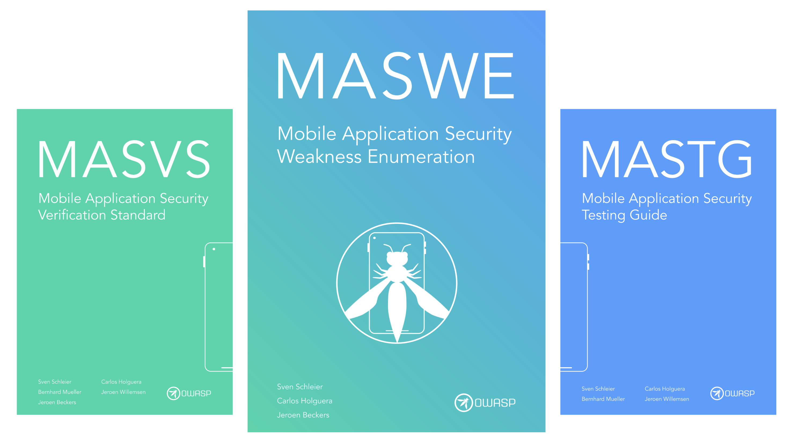

# MASWE (Mobile Application Security Weakness Enumeration)

The Mobile Application Security Weakness Enumeration (MASWE) is a list of common security weaknesses in mobile applications. It is intended to be used as a reference for developers, security researchers, and security professionals to understand common security weaknesses in mobile applications and to help identify and mitigate these weaknesses.

<center>

</center>

For its definition we draw inspiration from the [Common Weakness Enumeration (CWE)](https://cwe.mitre.org/), which is a community-developed list of common software security weaknesses. The MASWE is intended to be a **complementary list to the CWE**, focusing specifically on security weaknesses in mobile applications.

The MASWE leverages both the MASVS and the MASTG. From the MASVS, the MASWE takes the categories and controls, and from the MASTG, it takes the tests and demos. This combination allows the MASWE to provide a comprehensive list of security weaknesses in mobile applications and to provide a practical way to identify and mitigate these weaknesses. This is done by leveraging the new iteration of the MASTG tests and extending them with demontrative examples called demos.

## Weaknesses

A weakness is a security issue that can be introduced into a mobile application.

!!! quote "Weakness vs Vulnerability"
    According to the [CWE](https://cwe.mitre.org/documents/glossary/#Weakness), a weakness is a condition in a software, firmware, hardware, or service component that, under certain circumstances, could contribute to the introduction of vulnerabilities. Whereas a vulnerability is a flaw in a software, firmware, hardware, or service component resulting from a weakness that can be exploited, causing a negative impact to the confidentiality, integrity, or availability of an impacted component or components.
    
    It is important to note that a weakness is not a vulnerability, but it can lead to the introduction of vulnerabilities.

Weaknesses are categorized by the MASVS categories and controls. For example, a weakness related to the use of insecure random number generators is categorized under the `MASVS-CRYPTO-1` control.

Each weakness contains the following information:

- **Overview**: A brief description of the weakness.
- **Impact**: The potential impact of the weakness on the security of the application.
- **Modes of Introduction**: The ways in which the weakness can be introduced into an application.
- **Mitigations**: Recommendations for mitigating the weakness.

## Tests

A test is a set of steps that can be followed to identify a weakness in a mobile application. Tests are associated with specific weaknesses.

Each test contains the following information:

- **Overview**: A brief description of the test.
- **Steps**: A set of steps to follow to identify the weakness in a mobile application.
- **Observation**: A description of the results of running the test against an application.
- **Evaluation**: Specific instructions for evaluating the results of the test.

## Demos

Demos are write-ups that demonstrate the weakness in a sample application. They can be seen as a practical application of the tests.

Each demo contains the following information:

- **Overview**: A brief description of the demo.
- **Sample**: A code snippet that demonstrates the weakness.
- **Steps**: The specific steps followed to identify the weakness in the sample code.
- **Observation**: A description of the results of running the test against the code.
- **Evaluation**: The evaluation of the results of the test explaining why it failed or passed.

All demos in the MASTG are written in markdown and are organized in the following directory structure:

```shell
maswe/
├── <MASVS category>
│   ├── <MASVS control>
│   │   ├── <weakness>
│   │   │   ├── <test>
│   │   │   │   ├── demo-1
```

For example, the directory structure for a demo in the `MASVS-CRYPTO` category, `1-strong-crypto` control (`MASVS-CRYPTO-1`), `insecure-random` weakness, and `android-insecure-random-use` test would look like this:

```shell
maswe/
├── MASVS-CRYPTO
│   ├── 1-strong-crypto
│   │   ├── insecure-random
│   │   │   ├── android-insecure-random-use
│   │   │   │   ├── demo-1
│   │   │   │   │   ├── demo.md
│   │   │   │   │   ├── MastgTest.kt
│   │   │   │   │   ├── MastgTest_reversed.java
│   │   │   │   │   ├── output.txt
│   │   │   │   │   ├── run.sh
```

The files within the demo directory are as follows:

- `demo.md`: The markdown file containing the demo write-up.
- `MastgTest.kt`: The Kotlin code snippet that demonstrates the weakness.
- `output.txt`: The output of running the test against the code.
- `run.sh`: The script that runs the test against the code.

Depending on the test, the demo may contain additional files, such as configuration files or additional code snippets, scripts (e.g. in python), or output files. The samples are written in Kotlin or Swift, depending on the platform. In some cases, the samples will also include configuration files such as `AndroidManifest.xml` or `Info.plist`.

If the sample can be decompiled, the decompiled code is also provided in the demo. This is useful for understanding the code in the context of the application.

Demos are required to be fully self-contained and should not rely on external resources or dependencies. This ensures that the demos can be run independently and that the results are reproducible. They must be proven to work on the provided sample applications and must be tested thoroughly before being included in the MASTG.

## MAS Test Apps

In order for our new demos to be reliable and consistent, we needed to make sure that the results were reproducible and could be tested and validated. This is where the new MASTestApps came in. They are two very simple apps that mirror each other on Android and iOS. Demos must be implemented using these apps. This helps the reviewer and serves as a playground to create and practice your MAS skills.

- [MASTestApp-Android](https://github.com/cpholguera/MASTestApp-Android)
- [MASTestApp-iOS](https://github.com/cpholguera/MASTestApp-iOS)

Simply clone the repository and follow the instructions to run the apps on your local machine. Use them to validate the demos before submitting them to the MASTG.
